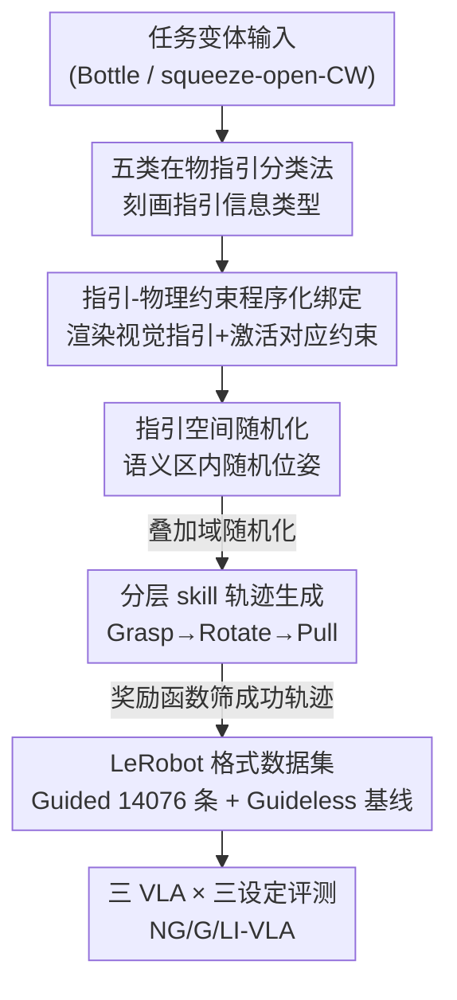

# INSIGHT Bench: Towards Grounded IN-SItu Guidance for Robotic Manipulation

**会议**: CVPR 2026  
**论文**: [CVF Open Access](https://openaccess.thecvf.com/content/CVPR2026/html/Kim_INSIGHT_Bench_Towards_Grounded_IN-SItu_Guidance_for_Robotic_ManipulaTion_CVPR_2026_paper.html)  
**领域**: 机器人 / 具身智能  
**关键词**: 机器人操作, VLA, 在物指引, benchmark, 物理约束

## 一句话总结
针对当前 VLA 模型"会听外部语言指令、却读不懂物体上印着的 PUSH/PULL/箭头/squeeze 等在物符号"这一空白，本文提出 INSIGHT Bench——一个把在物视觉指引与物理约束程序化绑定的机器人操作基准，配套五类指引分类法、可扩展的自动数据生成管线和 14,076 条轨迹数据集，并实测出 π0、GR00T N1.5、SmolVLA 普遍无法稳定 ground 这类在物指引。

## 研究背景与动机

**领域现状**：机器人操作近年靠 VLA（vision-language-action）模型大幅进步，π0、GR00T、SmolVLA 这类模型借助网络规模预训练，能把"打开抽屉""把门推开"这种**外部语言指令**映射成可泛化的动作。

**现有痛点**：人类操作物体时其实大量依赖**印在物体本身上的文字和符号**——门上的"PUSH/PULL"、防儿童药瓶盖上的"按住再拧"图标、瓶盖上指示旋转方向的箭头。这些在物指引（in-situ guides）简洁、视觉一致、且与具体物理 affordance（拧、按、拉）紧密耦合。但现有 VLA 几乎完全无视这类信息，导致在符号密集的日常环境里频繁失败。

**核心矛盾**：以往的视觉提示（visual prompting）和目标图像（goal-image）方法提供的都是**外部供给**的视觉上下文，而在物指引是**物理附着在物体上**、直接编码 affordance 的——二者本质不同，前者捕捉不到后者。更关键的是，这个能力一直**无法被衡量**：没有标准基准，社区不知道现有模型到底能不能读懂在物指引、差在哪。

**本文目标**：① 把"在物指引 grounding"这个任务正式形式化并给出分类法；② 造一个能把视觉指引与物理约束程序化绑定的基准与可扩展数据生成框架；③ 系统评测现有 VLA，定位它们的真实瓶颈。

**切入角度**：作者把在物指引看作一种"异步的人类意图"——设计者把操作知识直接刻在物体上，无需 human-in-the-loop。于是关键问题变成：模型能不能把物体上的视觉符号翻译成受物理约束的动作？

**核心 idea**：用"指引→物理约束"的程序化绑定（guide-conditioned physical constraint）把任务从"简单视觉模式匹配"变成"因果推理"——比如药瓶盖的旋转关节默认锁死，只有施加 squeeze 力才解锁，这样"成功转动关节"本身就成了"读懂了指引"的充分证据。

## 方法详解

### 整体框架
INSIGHT Bench 本质是"一套分类法 + 一个仿真基准 + 一条自动数据生成管线"。它先用五类分类法刻画在物指引能传达哪些信息，再在 NVIDIA Isaac Lab 上把 Cabinet / Door / Bottle 三大任务搭起来，并把每个视觉指引和它对应的物理约束**程序化绑死**；然后用一条 skill-based 的自动管线批量生成带指引/不带指引两套轨迹数据；最后在三种微调设定（NG-VLA / G-VLA / LI-VLA）下评测三个主流 VLA，定位它们读不懂在物指引的具体环节。

整条数据生成管线（基准的核心贡献）是这样流动的：

### 关键设计

**1. 五类在物指引分类法：把"物体上能印什么信息"讲清楚**

痛点在于，过去没人系统说清在物指引到底承载哪几种信息，benchmark 也就无从设计。本文把它拆成五类：① **接触 affordance（Contact Affordance）**——指出该跟物体哪个部件交互（如门板上的"PUSH"、指向小按钮的箭头），尤其当目标在几何上不明显时；② **部件内接触规格（In-Part Contact Specification）**——在已知部件上进一步指明精确接触方式/位置（如药瓶盖上指示该按哪几个点、什么朝向才能解锁）；③ **动作方向（Action Directional）**——约束执行方向、限制动作空间（瓶盖上的旋转箭头、门上的推拉标识）；④ **流程指引（Procedural Guidance）**——指定多步操作的顺序（"先转手柄再拉门"）；⑤ **目标消歧（Target Disambiguation）**——当多个部件都可交互时锁定目标（多个抽屉只标了顶部那个）。这套分类法是整个基准的骨架：每个任务都被设计成**专门隔离测试某几类信息**，让评测能精确定位模型在哪一类上崩。

**2. 指引-物理约束程序化绑定：把"看懂符号"逼成"解开物理锁"**

如果只是把符号画上去、成功判据还是"动一下关节"，模型完全可以无视符号靠蛮力撞对，benchmark 就失去意义。本文在仿真里给指引配上**程序化激活的物理约束**：对一个 episode，先采样高层任务（Bottle）和子任务（squeeze 后顺时针开），渲染出对应视觉指引，同时**程序化激活**关联约束——Bottle-Squeeze 场景里盖子的 revolute 关节会一直锁死，除非末端执行器施加 squeeze 力；而标准旋转子任务里这个约束就不激活。Door 任务同理：铰链关节保持锁定，直到手柄被转够角度释放门闩。成功判据是"目标关节超过阈值"，由于不先解开指引施加的约束在物理上根本转不动，"过阈值"就成了"读懂指引"的充分证据。这一步把任务从视觉模式匹配升级成了**因果推理**。

**3. 指引空间随机化：逼模型真去"找指引、读内容"，而非记位置**

光绑定约束还不够——如果指引永远固定在同一位置，模型可能记住空间布局而非真去读符号。本文把指引的**语义内容与摆放位置解耦**：在目标物体上定义一个语义相关区域（瓶盖顶面、抽屉前面板），在该区域内**程序化采样**指引的位置和朝向，再叠加通用域随机化（资产位姿、质量、摩擦系数）。这样模型必须主动定位指引并推理其内容，评测考的是鲁棒的解读能力而非空间记忆。

**4. 分层 skill-based 轨迹生成：无需遥操作/人工标注，批量造 14k 轨迹**

遥操作采数据要专用硬件和专家、且场景一变就得重录，扩展性差。本文用**分层、基于技能**的管线自动生成：高层每个任务是固定的参数化技能序列（如 GRASP→ROTATE→PULL），低层每个技能 $\psi_i$ 的参数 $\theta_i$ 根据仿真状态程序化实例化（cabinet-open 任务里自动识别目标 handle link、在其附近采样抓取位姿）。技能库为 $\mathcal{S}=\{\textsc{Grasp}(\cdot),\textsc{Rotate}(\cdot),\textsc{Pull}(\cdot)\}$：$\psi_{grasp}(p,q)$ 把末端移到目标位姿（$p\in\mathbb{R}^3$ 位置、$q$ 四元数朝向，含 approach 阶段）；$\psi_{rot}(\phi)$ 绕末端局部 z 轴转 $\phi$ 弧度（碰到关节限位会复位续转）；$\psi_{pull}(d)$ 沿前向轴平移 $d$（正推负拉）。技能经 CuRobo 运动规划器执行、关节级 PID 跟踪，一条轨迹表示为

$$\zeta=\{(o_t,a_t,r_t)\}_{t=0}^{T}$$

其中观测 $o_t$ 含本体感受状态（关节角/速度/夹爪）和视觉输入（多视角 RGB + 分割掩码），动作 $a_t\in\mathbb{R}^8$ 为 7-DoF 臂目标关节位置加夹爪指令，奖励 $r_t$ 稀疏、仅 episode 末评判成功，只有满足成功判据的轨迹才入库。整套管线无需人工 key-point 标注或人工验证，并把指引语义无缝融进生成过程。

### 一个完整示例：Bottle-Squeeze 一条轨迹怎么生成
以"打开防儿童药瓶（squeeze 后逆时针）"为例走一遍：① 采样到 Bottle 任务的 squeeze-open-CCW 子任务，渲染出瓶盖上的 squeeze 箭头指引，**同时程序化锁死**盖子的 revolute 关节（不 squeeze 就拧不动）；② 在瓶盖顶面语义区内随机摆放这个箭头，叠加瓶身位姿/摩擦随机化；③ 高层技能序列 GRASP→ROTATE 被实例化——GRASP 识别盖子并以指定朝向施压（满足 in-part contact 规格才解锁），ROTATE 绕 z 轴逆时针转；④ CuRobo 规划 + PID 跟踪执行，末端用稀疏奖励判定是否过阈值，成功的存成 LeRobot 格式（10 Hz、带 Grasp/Rotate 逐帧技能标注）。这套同样的任务再跑一遍**不 spawn 指引**，就得到对照用的 Guideless Dataset。

## 实验关键数据

实验围绕三个问题：① 在物视觉指引到底有没有帮助操作？② 现有 VLA 在含指引数据上微调后能不能学会 ground 指引？③ 若把指引语义换成语言模态提供，模型能不能解题？

评测三个 VLA：π0（VLM 骨干 PaliGemma 3B）、SmolVLA（SmolVLM-2 0.5B）、GR00T N1.5（Eagle-2.5 2.1B），都按多任务训练；三种微调设定：**NG-VLA**（无指引数据集）、**G-VLA**（含视觉指引数据集）、**LI-VLA**（含指引 + 额外语言指令，评测时用外部 VLM 解析指引生成指令）。每对(物体, 任务变体)跑 8 次 rollout，10 秒时限。三大任务规模：Cabinet 267 场景（102 资产、2-6 个可操作关节）、Door 220 场景（55 资产 × 4 配置）、Bottle 296 场景（37 资产 × 8 变体）。

### 主实验：整体任务成功率

| 模型 | NG-VLA | G-VLA | LI-VLA |
|------|--------|-------|--------|
| π0 | 12.1% | 14.1% | 18.5% |
| GR00T N1.5 | 17.2% | 18.5% | 24.3% |
| SmolVLA | 10.1% | 7.4% | — |

两个核心发现：**G-VLA 相比 NG-VLA 几乎没明显提升**（π0 仅 12.1%→14.1%，GR00T 17.2%→18.5%，SmolVLA 甚至 10.1%→7.4% 下降），说明模型没有有效 ground 视觉指引的语义，小模型上指引甚至成了视觉干扰物；而 **LI-VLA 显著高于前两者**（GR00T 18.5%→24.3%，π0 14.1%→18.5%），说明失败不在于执行不了物理动作（squeeze/旋转/拉），瓶颈纯粹在**感知与理解**——一旦把指引语义解码成语言字符串，模型就能用上。

### 分任务分析（消融视角）

| 任务（主测信息类型） | 关键现象 | 结论 |
|------|---------|------|
| Cabinet（目标消歧） | G-VLA 大幅超 NG-VLA，GR00T 上 G-VLA 是 NG 的 3× 以上；加语言反而没增益、SmolVLA 加指令更差 | 简单空间消歧任务，视觉指引比语言指令信号更清晰 |
| Bottle-Standard（动作方向） | G-VLA、LI-VLA 相比 NG-VLA 都无显著提升 | 当前 VLA 无论视觉还是语言都难 ground 方向信息 |
| Door（方向 + 流程） | LI-VLA 全面最好；除 GR00T 外视觉指引反而更差 | 视觉指引沦为干扰物，流程信息靠语言才有效 |
| Bottle-Squeeze（部件内接触 + 方向） | π0 上 G-VLA 近乎 NG/LI 的 2×；GR00T 加语言近 4× 提升；SmolVLA 全失败 | 细粒度物理指令的 grounding 强依赖 VLM 骨干 |

### 关键发现
- **瓶颈在"读懂"而非"执行"**：LI-VLA 普遍最优，证明模型能做出 squeeze/拧/拉的物理动作，只是看不懂物体上的符号——这是全文最强的论据。
- **信息类型决定成败**：模型能从视觉指引学会简单的目标消歧（Cabinet），但对流程、方向、部件内接触这类复杂信息基本失败；视觉指引在难任务上甚至当干扰物拉低成绩。
- **强依赖 VLM 骨干**：Door / Bottle-Squeeze 上只有 GR00T 因 Eagle-2.5 骨干的 grounding 能力获益，说明结论"不在模型/任务间鲁棒"。
- **真机验证一致**：用 LoRA 在每变体 15 条真机轨迹上微调 GR00T，Bottle-Std 上 LI-VLA 65% vs G-VLA 45%，Cabinet 上 G-VLA 50% ≈ LI-VLA 45%，与仿真趋势吻合，证明 grounding 难题在真实世界依旧存在。

## 亮点与洞察
- **"指引-物理约束绑定"是这个 benchmark 最巧的地方**：它把"看懂符号"从软性的视觉识别变成硬性的"不读懂就物理上做不到"，成功判据天然防作弊——这个思路可迁移到任何需要验证"模型是否真理解某条件"的具身任务。
- **NG/G/LI 三设定的对照设计很干净**：通过把同一信息分别以"无/视觉/语言"三种形式喂给模型，精确分离出"感知理解"与"动作执行"两个瓶颈，得出"问题在读不懂而非做不到"的强结论。
- **全自动 skill-based 数据管线**：无需遥操作和人工标注就批量造 14k 轨迹、还附逐帧技能标注，对分层/技能策略研究是现成的训练场；用 LeRobot 标准格式降低了复现门槛。
- **一个反直觉点**："加语言指令"不总是更好——Cabinet 的目标消歧、Bottle-Squeeze 的 π0 上，视觉指引比语言更清晰，说明视觉与语言模态各有适合的信息类型。

## 局限与展望
- **只是诊断性基准，不给解法**：本文揭示了 VLA ground 在物指引的失败，但没提出能稳定 ground 的新模型/学习范式，这是留给后续的开放问题（作者也明确点出）。
- **整体成功率偏低**：最好的 LI-VLA 也只有 24.3%，绝对水平低，部分难任务可能受运动规划/接触检测等非 grounding 因素干扰（作者为隔离 grounding 专门用了无位置随机化的数据集，但这也意味着主结论的设定被简化过）。
- **指引资产规模有限**：仅 12 个符号图标 + 20 个文本资产，真实世界在物指引的多样性（字体、磨损、多语言、组合符号）远超于此，泛化性待验证。
- **任务局限于柜/门/瓶三类铰接物体**：尚未覆盖更复杂的工具使用、装配等场景。
- **改进思路**：可探索把外部 VLM 的指引解析与动作策略端到端联合训练，或设计专门的"符号区域注意力"模块，把视觉指引显式转成可执行约束，而不依赖外部语言中转。

## 相关工作与启发
- **vs 视觉提示 / 目标图像（visual prompting [21], goal-image [9,37]）**：它们提供外部供给的视觉上下文，本文聚焦物理附着在物体上的 object-centric 指引，二者本质不同——前者捕捉不到物体特有的 in-situ affordance。
- **vs 机器人导航中的标识理解（Sign Language [1] 等）**：以往用标识做大尺度定位/建图与移动引导，本文转向**细粒度操作**——基于物体局部指引决定怎么拧/按/拉。
- **vs 操作基准 LIBERO / CALVIN / ManiSkill2 / ARNOLD**：这些都依赖**任务环境之外**的语言指令或示范轨迹，ARNOLD 虽测连续目标态（"开抽屉 75%"）但仍是外部指令；INSIGHT Bench 补上了"把物体上 in-situ 指引 ground 成受物理约束动作"这一缺失的评测轴。
- **vs affordance 发现 / 失败后恢复策略 [12,39]**：传统做法靠试错或失败后学恢复策略（post-hoc discovery），在物指引把约束**前置外化**（"Squeeze and Turn"），把反应式纠错变成主动的指令跟随。

## 评分
- 新颖性: ⭐⭐⭐⭐⭐ 首次形式化"在物指引 grounding"并用指引-物理约束绑定把它做成可量化基准，问题切入点新且重要。
- 实验充分度: ⭐⭐⭐⭐ 三模型×三设定×四任务的对照干净、有真机验证，但绝对成功率低、指引资产与物体类别有限。
- 写作质量: ⭐⭐⭐⭐ 分类法与三问题驱动的结构清晰，结论层层递进；部分公式在缓存中有转义噪声。
- 价值: ⭐⭐⭐⭐⭐ 暴露了 VLA 一个真实且被忽视的能力空白，提供现成数据集/管线/评测轴，对具身智能社区有明确推动作用。

<!-- RELATED:START -->

## 相关论文

- [\[CVPR 2026\] Language-Grounded Decoupled Action Representation for Robotic Manipulation (LaDA)](lada_robotic_manipulation.md)
- [\[CVPR 2025\] RoboGround: Robotic Manipulation with Grounded Vision-Language Priors](../../CVPR2025/robotics/roboground_robotic_manipulation_with_grounded_vision-language_priors.md)
- [\[CVPR 2026\] PointWorld: Scaling 3D World Models for In-The-Wild Robotic Manipulation](pointworld_scaling_3d_world_models_for_in-the-wild_robotic_manipulation.md)
- [\[CVPR 2026\] Action-Sketcher: From Reasoning to Action via Visual Sketches for Robotic Manipulation](action-sketcher_from_reasoning_to_action_via_visual_sketches_for_robotic_manipul.md)
- [\[CVPR 2026\] CLaD: Planning with Grounded Foresight via Cross-Modal Latent Dynamics](clad_planning_with_grounded_foresight_via_cross-modal_latent_dynamics.md)

<!-- RELATED:END -->
