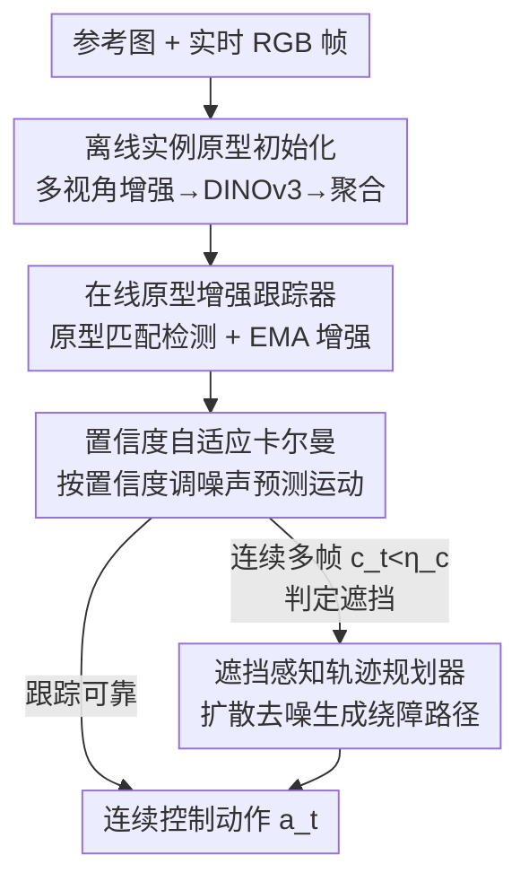

# Instance-level Visual Active Tracking with Occlusion-Aware Planning

**会议**: CVPR 2026  
**arXiv**: [2604.21453](https://arxiv.org/abs/2604.21453)  
**代码**: https://github.com/SHWplus/OA-VAT (有)  
**领域**: 视觉主动跟踪 / 具身智能 / 无人机感知  
**关键词**: 主动视觉跟踪, 实例级判别, 遮挡恢复, 扩散策略规划, 原型匹配

## 一句话总结
OA-VAT 用一张参考图离线构建判别性"实例原型"来对抗相似干扰物，在线 EMA 增强原型 + 置信度自适应卡尔曼滤波保持稳定跟踪，并训练一个以目标框为条件的扩散轨迹规划器在目标被遮挡时主动绕障找回——在 UnrealCV 上平均 SR 0.93、真实图像平均 CAR 90.8%、真机无人机 TSR 81.6%，且 RTX 3090 上 35 FPS 实时。

## 研究背景与动机
**领域现状**：视觉主动跟踪（Visual Active Tracking, VAT）要求 agent 实时控制相机/无人机去追一个 3D 空间里的目标，用于无人机跟拍、安防巡逻等。主流分两派：强化学习（RL）端到端把像素直接映射到动作，低延迟但奖励稀疏、依赖仿真训练、有 sim-to-real gap；流水线（pipeline）派把感知和控制解耦，用预训练视觉模型做感知，泛化性更好、更易部署。

**现有痛点**：即便是更可部署的 pipeline 方法，在真实场景仍有两个硬伤。其一是**缺乏实例级判别**——现实里常有多个长得很像的干扰物（一群人、一排车），而大多数 VAT 方法只在类别级工作，分不清"具体是哪一个目标"，很容易跟错。其二是**没有主动遮挡处理**——多数 pipeline 用 PID 之类的简单控制器，只把目标往画面中心怼，目标一旦被障碍物挡住就只会原地丢失，不会绕障去把目标重新看到。

**核心矛盾**：感知端要的是"实例级判别力"，但通用视觉基础模型（Grounding-DINO、SAM、DINOv3）的原始特征是类别级的，直接拿来区分同类实例不够判别；控制端要的是"遮挡下主动找回"，但能找回的专家轨迹在真实世界几乎不可得，没数据就训不出会绕障的策略。

**本文目标**：在一个统一 pipeline 里同时解决"区分相似实例"和"遮挡主动恢复"两件事，且要轻量、实时、能上真机。

**切入角度**：作者观察到——单视角的基础模型特征判别力不足，但把**多视角增强特征聚合**成一个原型，能把不同实例在特征空间推得更开（并给了理论保证）；遮挡恢复缺专家数据，那就**在仿真里合成遮挡轨迹**，并用**目标框而非视觉外观**作为规划条件，让策略与具体目标解耦、零样本泛化到没见过的目标。

**核心 idea**：用"离线多视角原型 + 在线原型增强/卡尔曼"解决实例判别与稳定跟踪，用"以目标框为条件的扩散轨迹规划器"解决遮挡主动找回。

## 方法详解

### 整体框架
OA-VAT 是一个三模块串行的 pipeline。**离线阶段**：给一张目标参考图，先做多视角增强、分割抠出目标、用 DINOv3 提特征并聚合成一个判别性"实例原型"。**在线阶段**：每帧若还没锁定目标，就用原型和当前帧里所有候选做余弦相似度匹配来检测目标；锁定后启动底层跟踪器逐帧定位，同时用 EMA 在线增强原型、用置信度自适应卡尔曼滤波预测目标运动。**遮挡阶段**：当跟踪器连续多帧不可靠（目标被挡），用卡尔曼预测出的目标框作为条件，触发扩散轨迹规划器生成一条绕障的恢复路径，把相机/无人机导到能重新看到目标的位置。输入是 RGB 帧 + 一张参考图，输出是连续控制动作 $a_t=[v_f, v_l, v_v, \omega_y]^T$（前/侧/垂直线速度 + 偏航）。

### 关键设计

**1. 实例级离线原型初始化：用多视角聚合把"同类不同个体"在特征空间推开**

痛点是基础模型特征只在类别级判别，一群相似目标的原始特征互相重叠、跟踪时极易混淆。OA-VAT 的做法是**免训练**地从一张参考图构造原型：先对参考图做水平/垂直翻转增强（人类目标外观随视角变化大，额外用现成扩散模型生成更多视角再翻转），用 YOLO-E 分割抠出目标 crop 集合 $\tilde{\mathbf{I}}=\{\tilde{\mathcal{I}}_{ref}, \tilde{\mathcal{I}}_1, \dots, \tilde{\mathcal{I}}_N\}$，再用 DINOv3 + 全局平均池化提特征 $\mathbf{f}_{ref}, \mathbf{f}_i$，最后把参考特征与增强特征的均值相加并归一化得到原型：

$$\tilde{\mathbf{f}} = \frac{\mathbf{f}_{ref} + \frac{1}{N}\sum_{i=1}^N \mathbf{f}_i}{\lVert \mathbf{f}_{ref} + \frac{1}{N}\sum_{i=1}^N \mathbf{f}_i \rVert_2}.$$

为什么有效：作者给了理论保证（Proposition 1）——在"多视角增强特征比单参考特征更好覆盖真实特征流形"且"同目标内聚、异目标可分"两个假设下，聚合后任意两实例原型间的最小平方距离不小于原始参考特征间的最小距离，即聚合**单调增大了实例间隔**。t-SNE 可视化也证实聚合后的原型按实例清晰分簇，而原始 DINOv3 特征大面积重叠；目标与干扰物的平均余弦相似度间隔从 DINOv3 的 0.08 拉大到 0.28

**2. 在线原型增强 + 置信度自适应卡尔曼：让原型跟着外观变、让滤波跟着可信度调**

VAT 没有初始框，且目标外观和运动在跟踪中剧烈变化。检测阶段（框为空时）用分割得到 $M$ 个候选 mask，抠图提特征后与当前原型 $\tilde{\mathbf{f}}'$ 算余弦相似度 $S(\tilde{\mathbf{f}}', \mathbf{f}_{cand}^i)$，取最高且超过阈值 $\eta_s$ 的候选作为目标并初始化底层跟踪器 ORTrack。锁定后两条增强并行：一是**原型 EMA 在线更新** $\tilde{\mathbf{f}}' \leftarrow \beta\tilde{\mathbf{f}}' + (1-\beta)\hat{\mathbf{f}}_{tar}$，在独立线程里跑以免拖慢主跟踪，使原型持续吸收新视角、长序列保持判别力。

二是**置信度自适应卡尔曼滤波**。状态向量 $\mathbf{x}_t=[x,y,w,h,\dot{x},\dot{y},\dot{w},\dot{h}]^T$ 含框及其速度。关键创新在于把测量噪声协方差 $\mathbf{R}_t$ 建成跟踪器置信度 $c_t$ 的函数：

$$\mathbf{R}_t = \sigma^2(c_t)\mathbf{I}, \quad \sigma^2(c_t) = \frac{1}{1 + e^{\lambda(c_t - \gamma)}}.$$

当 $c_t$ 高于 $\gamma$ 时 $\sigma^2$ 变小、卡尔曼增益 $\mathbf{K}_t$ 增大、更信任观测；$c_t$ 低时则压低增益、更信内部状态预测。为什么有效：低置信度往往意味着框被遮挡或漂移，此时盲信观测反而带偏，而压低增益让滤波器在跟踪失败期间继续用 $\hat{\mathbf{x}}_{t|t-1}=\mathbf{F}\hat{\mathbf{x}}_{t-1|t-1}$ 外推运动，提高重新捕获目标的概率；若连续多帧无可靠观测就触发规划模块

**3. 遮挡感知扩散轨迹规划器：以目标框为条件，学到"绕障"而非"记外观"**

PID 控制器只能把目标往画面中心拉，遇遮挡无法绕障。专家遮挡轨迹现实中拿不到，作者在 UnrealCV 的 SimpleRoom 里合成 **Planning-20k** 数据集：随机摆障碍物建 2D 占据图，把目标生成在障碍物某条边、把跟踪器放在相邻边制造遮挡（全可见样本被丢弃），用 A* 在占据图上搜专家轨迹，覆盖单侧/双侧/走廊三类常见遮挡结构，并做光照与纹理域随机化（8k 默认纹理 + 12k 随机纹理）。

规划被建成条件去噪扩散过程，建模 $p(\mathbf{A}_t | \mathcal{I}_t, \mathbf{b}_t)$，从噪声 $\mathbf{A}_t^K \sim \mathcal{N}(0,\mathbf{I})$ 迭代 $K$ 步去噪出轨迹点。**核心区别于 Diffusion Policy 的地方**是显式把目标框 $\mathbf{b}_t$ 作为条件输入：纯视觉条件的扩散策略会过拟合特定目标的外观纹理，换目标就失效；而以框为条件让模型聚焦"目标在哪、障碍物在哪"的空间关系，学到的是与具体目标无关的物理绕障规则，从而**零样本泛化到任意未见目标**。在线时一旦 $c_t < \eta_c$，就用卡尔曼预测的框喂给规划器生成恢复轨迹

### 损失函数 / 训练策略
规划器用 MSE 噪声预测目标训练：$\mathcal{L} = \mathbb{E}_{k,\mathbf{A}_t^0,\bm{\varepsilon}}[\lVert \bm{\varepsilon} - \epsilon_\theta(\mathcal{I}_t, \mathbf{b}_t, \mathbf{A}_t^0 + \bm{\varepsilon}, k)\rVert^2]$，让网络重建加在真值轨迹上的噪声。原型初始化与在线跟踪器**完全免训练**（直接用 DINOv3/YOLO-E/ORTrack 等现成模型），只有扩散规划器需要训练——单张 RTX 3090 训 15 小时即可，对比 TrackVLA 同时长需 24×H100。

## 实验关键数据

### 主实验
在 UnrealCV（含干扰物的 3 张地图）与 DAT 上**零样本**评测，对比 12 个基线。

| 基准 | 指标 | OA-VAT | 之前 SOTA | 提升 |
|------|------|--------|-----------|------|
| UnrealCV（含干扰物，平均） | SR | 0.93 | TrackVLA 0.91 | +2.2% |
| UnrealCV（含干扰物，平均） | AR / EL | 390 / 483 | TrackVLA -/474 | — |
| UnrealCV（无干扰，5 场景） | SR / EL | 1.00 / 500 | 与 TrackVLA 并列满分 | — |
| DAT（6 场景平均） | CR | 321 | GC-VAT 242 | +32.6% |
| DAT（6 场景平均） | TSR | 0.86 | GC-VAT 0.72 | +19.4% |
| 真实图像（VOT/DTB70/UAVDT 平均） | CAR | 90.8% | GC-VAT 78.7% | +12.1% |
| DJI Tello 真机 | TSR | 81.6% | 最佳基线 18.9% | +62.7pt |

效率上 OA-VAT 仅 584M 参数（TrackVLA >7B、EVT 748M），RTX 3090 上 35 FPS（TrackVLA 在 RTX 4090 上仅 10 FPS）。真实图像逐数据集 CAR：VOT 0.879、DTB70 0.900、UAVDT 0.945，全面超过 GC-VAT 的 0.795/0.833/0.802。

### 消融实验
在 UnrealCV 含干扰物 3 地图上逐模块消融（平均 SR）：

| 模块 | 配置 | 平均 SR | 说明 |
|------|------|---------|------|
| 离线原型初始化 | w/ DINOv3 原型 | 0.87 | 直接用原始特征 |
| | **Ours** | **0.93** | 多视角聚合，+6.9% |
| 在线原型增强 | w/o 增强 | 0.82 | 不更新原型 |
| | w/ 平均更新 | 0.89 | 简单平均 |
| | **Ours (EMA)** | **0.93** | +13.4%/+4.5% |
| 置信度卡尔曼 | w/o 滤波 | 0.87 | 无运动预测 |
| | w/ 线性卡尔曼 | 0.90 | 固定噪声 |
| | **Ours** | **0.93** | +6.9%/+3.3% |
| 轨迹规划器 | w/o 规划 (PID) | 0.85 | 不会绕障 |
| | w/ EVT 规划 | 0.87 | 离线 RL |
| | w/o 目标框条件 | 0.89 | 纯视觉条件 |
| | **Ours** | **0.93** | +6.9%/+4.5% |

### 关键发现
- **在线 EMA 增强贡献最大**：去掉在线增强平均 SR 从 0.93 掉到 0.82（−13.4%），说明长序列里目标外观漂移是稳定跟踪的主要风险，原型必须持续吸收新视角。
- **目标框条件是规划泛化的关键**：去掉框条件（纯视觉）SR 掉 4.5%，验证了"以框为条件让策略与外观解耦"才是零样本泛化到未见目标的来源；DAT 目标是训练中未见的车辆，仍取得 0.86 TSR。
- **置信度自适应优于固定噪声卡尔曼**：自适应版比线性卡尔曼 +3.3%，低置信度时压低增益、改信状态外推，确实能纠正不可靠的框并在短暂失败中继续预测运动。
- **真机增益最夸张**：长时遮挡场景下 OA-VAT 主动绕障找回目标，TSR 81.6% 远超最佳基线 18.9%，而 EVT/FAn 会永久丢目标——主动规划在真实部署里的价值被显著放大。

## 亮点与洞察
- **免训练原型 + 理论保证**：整条实例判别链路（增强→分割→DINOv3→聚合）零训练，却用 Proposition 1 证明了多视角聚合单调拉大实例间隔，把"工程 trick"上升成有依据的设计，相似度间隔从 0.08 提到 0.28 很有说服力。
- **把置信度灌进卡尔曼噪声**：用 sigmoid 把跟踪器置信度映射成测量噪声方差，等于让滤波器"知道自己什么时候该不信观测"，这个把感知不确定性接进状态估计的做法可迁移到任何"检测+滤波"的跟踪系统。
- **以目标框替代视觉外观做扩散条件**：一句话点破了 Diffusion Policy 过拟合外观的根因，并给出极简解法——条件换成框，立刻拿到目标无关的零样本泛化，这个"换条件解耦"的思路对其他条件生成式策略很有启发。
- **轻量打赢大模型**：584M、单卡 15h 训练、35 FPS，却在含干扰物场景超过 >7B 的 TrackVLA，说明 VAT 的瓶颈未必是模型容量，而是实例判别与主动遮挡处理这两块结构性能力。

## 局限与展望
- **规划数据来自仿真**：Planning-20k 在 UnrealCV SimpleRoom 合成，遮挡结构限于单侧/双侧/走廊三类，真实世界更复杂的动态遮挡（移动遮挡物、多目标交叉）能否覆盖存疑。
- **依赖多个现成模型串联**：YOLO-E 分割 + DINOv3 描述 + ORTrack 跟踪 + 扩散规划，任一环节失败（如分割漏检小目标、参考图质量差）都会级联影响，论文未充分讨论失败模式。
- **置信度可靠性是隐含前提**：整套自适应卡尔曼与遮挡触发都建立在底层跟踪器置信度 $c_t$ 能真实反映不确定性上，若 $c_t$ 自身在某些场景失准（如自信地跟错干扰物），机制可能反向放大错误。
- **2D 占据图 + A\* 专家**：规划在 2D 平面建模并用 A\* 生成专家，对需要垂直机动（飞越/钻过障碍）的 3D 绕障是否够用未验证。

## 相关工作与启发
- **vs RL-based VAT（SARL / AD-VAT / EVT / GC-VAT）**：它们端到端学策略、低延迟但奖励稀疏且依赖仿真有 sim-to-real gap；OA-VAT 走 pipeline 解耦感知与控制，用预训练模型获得强泛化，且只规划器需训练，部署成本与真机表现都明显更优。
- **vs TrackVLA**：TrackVLA 用 >7B VLA 大模型把跟踪做成端到端，性能强但 10 FPS、需 24×H100 训练；OA-VAT 用 584M、35 FPS、单卡 15h 在含干扰物场景反超其 SR（0.93 vs 0.91），靠的是结构化的实例原型而非堆参数。
- **vs Follow Anything (FAn) / FAn+SAM2**：它们用基础模型做类别级跟随，缺实例判别与主动遮挡处理；OA-VAT 的离线原型补上实例级判别、扩散规划补上绕障恢复。
- **vs Diffusion Policy**：本文规划器直接受其启发，但指出纯视觉条件会过拟合目标外观，改用目标框作条件实现目标无关规划——这是把通用扩散策略迁到"需泛化到未见目标"任务上的关键改造。

## 评分
- 新颖性: ⭐⭐⭐⭐ 实例原型聚合（带理论）、置信度自适应卡尔曼、框条件扩散规划三件套组合新颖，但单点都基于已有模块的巧妙拼装
- 实验充分度: ⭐⭐⭐⭐⭐ 仿真两基准 + 真实图像三数据集 + 真机无人机，逐模块消融完整，零样本设定有说服力
- 写作质量: ⭐⭐⭐⭐ 结构清晰、图表充分、含理论分析，部分细节（超参、失败模式）放在了附录
- 价值: ⭐⭐⭐⭐⭐ 轻量实时、可上真机、代码开源，对无人机跟拍/安防等实际部署直接可用

<!-- RELATED:START -->

## 相关论文

- [\[CVPR 2026\] UAST: Unified Active Search and Tracking for Arbitrary Targets with UAVs](uast_unified_active_search_and_tracking_for_arbitrary_targets_with_uavs.md)
- [\[CVPR 2026\] ForeAct: Steering Your VLA with Efficient Visual Foresight Planning](foreact_steering_your_vla_with_efficient_visual_foresight_planning.md)
- [\[CVPR 2026\] Spatial-Aware VLA Pretraining through Visual-Physical Alignment from Human Videos](spatial-aware_vla_pretraining_through_visual-physical_alignment_from_human_video.md)
- [\[CVPR 2026\] FLARE: A Failure-Aware Framework for Autonomous Correction and Recovery in Visual-Language Robotic Manipulation](flare_a_failure-aware_framework_for_autonomous_correction_and_recovery_in_visual.md)
- [\[CVPR 2026\] AdaDexTrack: Dynamic Modulation for Adaptive and Generalizable Dexterous Manipulation Tracking](adadextrack_dynamic_modulation_for_adaptive_and_generalizable_dexterous_manipula.md)

<!-- RELATED:END -->
