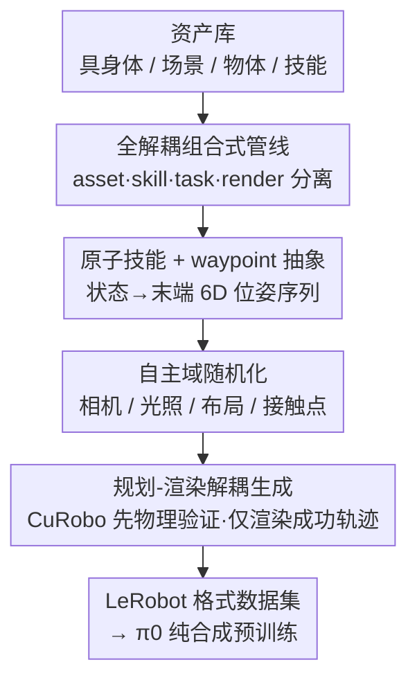

# InternData-A1: Pioneering High-Fidelity Synthetic Data for Pre-training Generalist Policy

**会议**: CVPR 2026  
**论文**: [CVF Open Access](https://openaccess.thecvf.com/content/CVPR2026/html/Tian_InternData-A1_Pioneering_High-Fidelity_Synthetic_Data_for_Pre-training_Generalist_Policy_CVPR_2026_paper.html)  
**代码**: 作者声明将开源数据集与生成管线（论文未给出具体仓库地址，⚠️ 以原文为准）  
**领域**: 机器人 / 具身智能  
**关键词**: VLA 预训练、合成数据、仿真到真实、机器人操作、数据缩放

## 一句话总结
InternData-A1 用一条全解耦、自主运行的仿真合成管线造出 63 万条、7433 小时的高保真机器人操作数据，首次证明「纯合成数据」单独预训练的 VLA 模型能在 49 个仿真 + 9 个真机任务上追平用闭源真机数据 π-dataset 训练的官方 π0。

## 研究背景与动机
**领域现状**：近两年 VLA（Vision-Language-Action）模型的强泛化能力，主要靠大规模真机数据撑起来——π-series 用闭源的 π-dataset 展示了真机预训练的威力。

**现有痛点**：真机数据采集极其昂贵。遥操作需要熟练操作员、专用硬件和大量人力，绝大多数研究组根本造不起这种规模、这种多样性的真机数据集，社区因此连「VLA 预训练到底需要什么样的数据」这个基础问题都无法系统研究。仿真本该是补充路线，但已有仿真数据集（MimicGen、RoboCasa、RoboTwin 等）技能集窄（主要是 pick-and-place）、几乎只涉及刚体、仍需大量人工操作，而且很少有人验证它们对大规模 VLA 预训练真的有用。

**核心矛盾**：一边是「真机数据贵到不可规模化」，一边是「合成数据虽便宜却从没在规模上证明能匹配最强真机数据」。问题的根子在于：现有仿真管线在物体类型、场景、技能、物理真实度这几个维度同时受限，无法逼近真机数据的预训练效力。

**本文目标**：拆成两个子问题——(1) 造一条能在「具身体、场景、技能、物理真实度」四个维度同时规模化的高保真合成管线；(2) 用它产出的纯合成数据，验证能否在下游真机任务上追平最强真机数据。

**切入角度**：作者押注「解耦 + 组合」——把资产规格、技能策略、任务组合、渲染这四件事彻底拆开，让任务可以像搭积木一样自由拼装。只要这四块各自做扎实，组合空间就能指数级扩张，而人工成本几乎不增。

**核心 idea**：用一条「资产/技能/任务/渲染全解耦」的自主仿真管线，以可忽略的人力把单一技能扩展成 70 个任务、227 个场景、4 种具身体的 63 万条轨迹，再用它纯合成预训练去追平闭源真机数据。

## 方法详解

### 整体框架
InternData-A1 的核心不是一个模型，而是一条**数据合成管线** + 用它预训练出来的 π0 策略。管线把「造一条机器人操作轨迹」拆成四个串行阶段：先从资产库里检索具身体/场景/物体搭出环境（环境构建），再从原子技能库里挑技能、按配置文件拼成完整任务（技能组合），接着对相机视角、光照、布局、接触点做自主域随机化（域随机化），最后用 CuRobo 规划稠密关节动作、先纯物理仿真验证、只对成功轨迹开渲染并存成 LeRobot 格式（生成与存储）。整条管线的关键在于「解耦」：每个技能被设计成「状态→waypoint」的自动映射，换物体、换空间范围、换场景甚至换具身体都不需要额外人工，人工只剩下调一下空间范围。工程优化后，8 张 RTX 4090 一天能产 209.7 小时机器人数据，每条 episode 成本低于 0.003 美元。

### 关键设计

**1. 全解耦组合式管线：把「造任务」拆成可独立扩张的四块**

这针对的是「已有仿真数据集技能窄、物体单一、还要大量人工」这个痛点。作者把资产规格、技能策略、任务组合、渲染彻底拆开：每个任务由「从资产库检索具身体+场景+物体」+「组合脚本化技能策略」生成，技能策略以机器人与物体状态为条件计算并插值出轨迹。因为四块互不耦合，组合空间是它们的笛卡尔积——同一套技能配上不同物体/场景/具身体就是新任务，于是从「近乎所有人类基本技能」（折叠、倾倒、旋转、堆叠……）出发组合出 70 个任务、其中还有 18 个至少含三段顺序技能的长程任务（12.5 万条轨迹）。和「靠换被操作物体来充任务数」的旧做法（picking 几百个物体仍只算一个任务）不同，这里每个任务都指定了独特的上下文、原子技能组合和动作空间约束，多样性是「真任务级」的。

**2. 原子技能 + waypoint 统一抽象：让换物体/具身体零额外成本**

如果技能和底层运动执行耦合，每换一个物体或机器人都要重写策略，管线就规模不起来。作者把每个技能做成模块化脚本策略，输入是物体状态（位姿、关节态）、机器人状态（底座与末端位姿）和用户约束，输出统一是一串 waypoint（目标末端 6D 位姿）。waypoint 作为统一表示，干净地把「高层技能逻辑」和「低层运动执行」解耦——例如 Pick 技能过滤抓取候选、算出 pre-grasp/grasp/post-grasp 三个位姿，关节体的 Push 技能用接触标注算 pre-contact/contact/post-contact。因为每个技能都是「状态→waypoint」的自动映射，换物体、空间范围、场景乃至具身体都不产生额外成本，唯一人工就是调空间范围；用户只需指定左右臂并把技能顺序/并行编排，长程双臂任务就能自动展开。

**3. 自主域随机化：在视觉与轨迹两个维度同时注入多样性**

纯合成数据若视觉单一、轨迹刻板，预训练学到的先验难以迁移。作者在两个维度做随机化：视觉上，主相机与腕部相机视角在 ±5° 旋转、±5 cm 平移内扰动，并构建 174 张环境贴图、各自随机化色温与光强模拟自然光照，目标物体可被同类物体替换、桌面与背景布局也随机；轨迹上，物体位置朝向在任务专属空间范围内采样，接触区域也加随机——例如自主抓取位姿管线产生上百万候选，过滤后从 top-40 高置信候选里随机选一个，关节体/可变形体则把接触区扩成邻域再随机采点。这种「自主」随机化让同一任务展开出大量视觉与动作各异的 episode，是 hard 设定下鲁棒性的来源。

**4. 规划-渲染解耦生成：把算力只花在成功轨迹上**

渲染比物理仿真慢得多，如果对每次尝试都渲染，失败的规划会白白烧掉大量算力，长程/灵巧任务尤其严重。作者用 CuRobo 在 waypoint 之间插值出稠密关节空间动作，每次试验先**关闭渲染**只跑物理仿真去跟随动作；只有当一条轨迹被成功规划后，才重放并打开渲染引擎。这种「先验证后渲染」的解耦把算力集中到有效轨迹上，是管线能在 8 卡上日产 209.7 小时数据的工程关键。最终每条 episode 记录物体元数据、语言指令、多视角 RGB 与相机参数、机器人本体感与动作标签，统一转成 LeRobot 格式供 VLA 预训练。

### 损失函数 / 训练策略
本文不提出新损失，沿用 π0 架构：视觉语言模型 Paligemma + 基于 flow-matching 的 action expert。预训练时用 Paligemma 权重初始化、action expert 从零开始，**仅在 InternData-A1 上**预训练，再与「在闭源 π-dataset 上训练的官方 π0」在下游任务上对比，以此隔离出预训练数据质量的影响。

## 实验关键数据

### 主实验
仿真评测用 RoboTwin 2.0 的 49 个双臂任务，分 Easy（干净）/ Hard（杂乱）两档，每任务 100 试验跨两个 checkpoint，共 19,600 次 rollout。

| 设定 | π0 (Scratch) | 官方 π0 (π-dataset) | π0 (InternData-A1) | 相对官方 π0 |
|------|------|------|------|------|
| 49 任务 Avg. Easy | 23.5% | 55.0% | **60.0%** | +5.0% |
| 49 任务 Avg. Hard | 2.5% | 20.0% | **26.5%** | +6.5% |

纯合成预训练不仅追平、还略超用闭源真机数据训练的官方 π0；相比未预训练的 Paligemma，Easy 提升 36.5%、Hard 提升 24.0%。真机上跨 Genie-1 / ARX Lift-2 / ARX AC One 三种具身体、5 个常规 + 4 个灵巧任务（每任务 30 试验），常规任务平均超 π-dataset 6.2%，4 个长程灵巧任务（折衣、分拣零件、拧瓶盖、拉拉链，用两边都没见过的 ARX AC One）也达到与 π-dataset 相当的水平。

### 与开源数据集对比
各数据集分别预训练 π0 共 500k 迭代，在 49 仿真任务 + 2 真机任务上评测：

| 数据集 | 类型 | 49 Sim Easy | 49 Sim Hard | Sort Rubbish | Pass Bottle |
|------|------|------|------|------|------|
| OXE | 真机 | 32.5% | 11.0% | 40.0% | 36.7% |
| Agibot World | 真机 | 52.5% | 12.0% | 53.3% | 56.7% |
| RoboCasa | 仿真 | 50.0% | 11.0% | 23.3% | 13.3% |
| **InternData-A1** | 仿真 | **60.0%** | **26.5%** | **90.0%** | **60.0%** |

RoboCasa 在仿真上只落后 10%，但真机上崩塌——InternData-A1 真机平均比它高 57.7%，作者归因于高保真渲染 + 数据量。

### 关键发现
- **Hard 设定提升更明显**（+6.5% vs Easy +5.0%）：下游微调只用干净非随机数据时，InternData-A1 域随机化带来的视觉/空间鲁棒性依然保留，说明多样性是在预训练阶段「内化」进策略的。
- **仿真到真实的数据效率惊人**：从同一 π0(InternData-A1) checkpoint 出发，Sort Rubbish、Wipe Stain 这类基础技能任务只需 200 条仿真 episode 就能匹配 200 条真机 episode；Flip Package、Instructional Pick 这类需动态物体操作 + 语言 grounding 的复杂任务约需 1,600 条仿真。整体「仿真:真机」等效比收窄到 8:1 以内，部分接近 1:1。另有 6 个含重复抓放/关节/双臂协调的任务，仅 500 条仿真 episode 就能超 50% 成功率。

## 亮点与洞察
- **「纯合成能否匹配最强真机数据」第一次被正面回答**：以往合成数据只当真机数据的补充，本文用追平官方 π0 的结果证明，只要在具身体/场景/技能/物理真实度四维同时拉满，合成数据本身就够。这对买不起真机数据的研究组是直接的解放。
- **waypoint 抽象是规模化的真正杠杆**：把技能写成「状态→waypoint」的自动映射，换物体/具身体零成本——这条工程抽象，比任何单个仿真技巧都更决定管线能不能扩张，值得迁移到其他数据合成场景。
- **规划-渲染解耦是「便宜」的来源**：先纯物理仿真筛掉失败规划、只渲染成功轨迹，把每 episode 成本压到 0.003 美元以下。这个「贵的操作放最后、只对赢家执行」的思路在任何「生成-验证」型数据流水线里都通用。

## 局限与展望
- 作者坦承部分复杂任务（动态物体、语言 grounding）仍需约 1,600 条仿真才追平 200 条真机，说明并非所有任务都「仿真即真机」，等效比随任务难度变化大。
- 评测的仿真到真实迁移建立在「良好对齐的 sim-to-real 设定」上，对相机/光照/接触显著偏离真实的场景，迁移效果未充分检验（⚠️ 论文主要报告对齐良好的任务）。
- 与官方 π0 的对比受限于 π-dataset 闭源，无法做完全同条件的数据级消融——「数据质量 vs 数据量 vs 架构」的贡献拆分还不彻底。
- 改进方向：把域随机化从手工范围升级为「可学习/自适应」的分布，可能进一步缩小仿真到真实差距并减少剩余人工。

## 相关工作与启发
- **vs π-series / π-dataset**：π-dataset 用大规模闭源真机数据，本文用全开源可复现的纯合成数据，结论是合成数据能追平最强真机，且生成管线完全开放，降低了 VLA 研究门槛。
- **vs RoboTwin 2.0 / RoboCasa 等仿真数据集**：它们技能窄、偏刚体、仿真好看但真机掉点严重；InternData-A1 覆盖刚体/关节/可变形/流体四类物体、18 技能 70 任务 227 场景，且真机上不崩，差距来自解耦组合管线 + 高保真渲染。
- **vs MimicGen 等增广式数据**：增广多靠遥操作 + 数据增广扩样本，本文靠原子技能自主组合，无需遥操作，规模与多样性上限更高。

## 评分
- 新颖性: ⭐⭐⭐⭐ 不是新模型，而是「全解耦自主合成管线 + 纯合成追平真机」的系统性证据，工程与论证都扎实。
- 实验充分度: ⭐⭐⭐⭐⭐ 49 仿真 + 9 真机 + 多开源数据集对比 + sim-to-real 数据效率分析，覆盖很全。
- 写作质量: ⭐⭐⭐⭐ 管线四阶段讲得清晰，但部分实验数字散落在图注里、表格组织偏密。
- 价值: ⭐⭐⭐⭐⭐ 开源数据 + 管线，对买不起真机数据的社区是实打实的基础设施。

<!-- RELATED:START -->

## 相关论文

- [\[CVPR 2026\] Video2Robo: 3DGS-based Synthetic Data from One Video Enables Scalable Robot Learning](video2robo_3dgs-based_synthetic_data_from_one_video_enables_scalable_robot_learn.md)
- [\[AAAI 2026\] Realistic Synthetic Household Data Generation at Scale](../../AAAI2026/robotics/realistic_synthetic_household_data_generation_at_scale.md)
- [\[CVPR 2026\] FM-Steer: Enhance Generalist Policies with Value-Guided Cascaded Denoising](fm-steer_enhance_generalist_policies_with_value-guided_cascaded_denoising.md)
- [\[CVPR 2026\] OctoNav: Towards Generalist Embodied Navigation](octonav_towards_generalist_embodied_navigation.md)
- [\[NeurIPS 2025\] LabUtopia: High-Fidelity Simulation and Hierarchical Benchmark for Scientific Embodied Agents](../../NeurIPS2025/robotics/labutopia_high-fidelity_simulation_and_hierarchical_benchmark_for_scientific_emb.md)

<!-- RELATED:END -->
