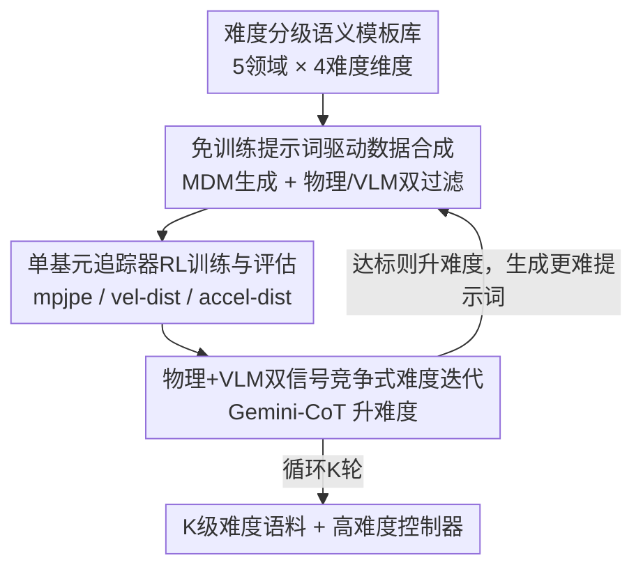

# Iterative Closed-Loop Motion Synthesis for Scaling the Capabilities of Humanoid Control

**会议**: CVPR 2026  
**论文**: [CVF Open Access](https://openaccess.thecvf.com/content/CVPR2026/html/Xu_Iterative_Closed-Loop_Motion_Synthesis_for_Scaling_the_Capabilities_of_Humanoid_CVPR_2026_paper.html)  
**代码**: https://wesleyxu224.github.io/CLAIMS/ (项目页)  
**领域**: 机器人/具身智能  
**关键词**: 人形控制, 闭环数据生成, 动作扩散模型, 难度课程, 物理仿真

## 一句话总结
本文提出 CLAIMS——一个让"动作数据合成"与"人形控制器训练"协同进化的闭环框架：用动作扩散模型从难度分级的语义模板提示词生成专业高动态动作、用物理 + VLM 双重过滤后训练物理仿真追踪器，再用物理指标 + VLM 反馈驱动 LLM 自动升难度，从而用仅约 AMASS 1/10 的数据量把 PHC 追踪器在 2201 段测试集上的平均失败率降低 45%。

## 研究背景与动机
**领域现状**：基于物理的人形控制（physics-based humanoid control）走的是"用强化学习模仿动捕数据"的标准管线——DeepMimic 证明复杂技能可学，AMP 提升真实感，ASE/PHC 改进技能复用与泛化。这些方法的能力上限都被训练数据的分布钉死。

**现有痛点**：现有动作语料存在两个硬伤。其一，**难度分布固定且偏低**：AMASS 超过 90% 是低动态日常动作，AIST++ 只针对舞蹈，专业高动态动作（武术、体操、格斗）严重稀缺，导致在这些语料上训出的控制器一遇到翻腾、空翻这类高动态技能就失败。其二，**高质量数据获取成本高**：专业动捕系统昂贵，难以规模化；靠视频挖掘或跨形态聚合（Humanoid-X、HuBE）虽能扩量，却仍偏低难度、缺乏可靠语义和难度分层。

**核心矛盾**：控制器的能力上限被数据的"固定难度分布"锁死，而打破这个上限需要更难的专业数据，但更难的数据又恰恰是最难采集的——数据难度与控制器能力之间缺少一个**能随能力增长而自动升级数据难度**的机制。

**本文目标**：(1) 给专业动作一套可扩展的语义定义与难度分级；(2) 让数据生成与控制器训练在一个博弈式循环里交替进行，使策略突破自己的难度天花板。

**切入角度**：作者观察到动作扩散模型 MDM 虽然训练在低动态的 HumanML3D 上，但其**潜空间支持动作基元的组合混合**，能生成训练集里不存在的新组合（OOD 动作）——于是不必重训生成器，只要用结构化提示词就能"撬"出专业高动态动作。

**核心 idea**：把"数据合成"和"控制器"做成一对**竞争式协同进化**的玩家——控制器掌握当前分布后，用物理 + VLM 反馈让 LLM 生成更难的提示词、合成更难的数据，逼控制器继续往上爬，形成自强化课程。

## 方法详解

### 整体框架
CLAIMS 是一个端到端自动化的闭环系统。每一轮迭代里：从一个覆盖五大专业领域（武术、舞蹈、格斗、体育、体操）、按四个维度分级的**难度感知变量库**采样提示词；用 MDM 把提示词合成动作轨迹，经物理合法性检查（根关节高度等）和 VLM 语义对齐过滤后入库；用过滤后的合成数据以强化学习训练单基元物理追踪器；训练收敛后采集物理追踪指标 + VLM 主观难度反馈，拼成观测向量交给以 Gemini 链式思维（CoT）为核心的 LLM 策略，由它输出下一轮"更难且贴合控制器当前短板"的提示词。循环 K 轮后得到一个带 K 级难度梯度的五领域语料 + 一个能适应异质高难度动作的控制器；其中只有控制器需要训练算力，其余组件都是免训练、低成本的，因此框架与具体控制器解耦（controller-agnostic）。

### 关键设计

**1. 专业难度分级的语义模板库：给"难"一个可控、可扩展的定义**

针对"现有语料难度分布固定且无难度分层"的痛点，作者先把"专业性"和"难度"形式化。围绕专家要求与采集风险，精选五个高动态领域（武术、舞蹈、格斗、体操、体育），并沿四个轴定义难度：**基础动作**（原子技能）、**组合动作**（组合逻辑）、**细节**（如肢体摆位等技术要点）、**速度与节奏**（时间结构）。例如一个舞蹈提示词可组合 grand allegro（基础）+ saut de basque 连跳（组合）+ triple pirouette（细节）于稳定节奏（速度）。这套模板既约束生成、又指导数据集优化，保证难度升级是"有原则的"而非随机。t-SNE 验证显示，用专家提示词合成的动作与真实专业武术流形高度重叠，而随机提示词合成的动作离得很远——说明模板编码了显著的领域先验，缓解了 MDM 提示条件合成的分布偏置。

**2. 免训练的提示词驱动数据合成：不重训生成器就撬出 OOD 高动态动作**

针对"专业数据采集成本高"的痛点，作者用预训练、低成本的文本条件扩散模型 MDM（50 步采样器 + DistilBERT 文本编码器）直接合成训练数据。关键在于：虽然 MDM 训练在低动态的 HumanML3D 上，但其潜空间允许动作基元的**组合混合**，能产出原数据集里不存在的新组合。作者不改生成器，而是用从语义分类法派生的**模板化动作提示词**（再由辅助 LLM 自动实例化）来引导——模板化设计比自由形式的 LLM 描述更稳定、更贴合领域。合成后做两道过滤：物理合法性检查（如根关节高度边界，剔除漂浮/下沉/穿模），以及 VLM（评估提示词与动作语义对齐），两关都过的片段才入训练集。t-SNE 显示专家提示词样本大量落在 MDM 训练流形**之外**，证明这条路径确实能撬出 OOD 的专业内容。

**3. 单基元追踪器的 RL 训练与多维物理评估：刻画控制器能力前沿**

合成数据需要一个能客观度量"控制器掌握到哪"的训练 + 评估环节。作者的单基元追踪器用强化学习模仿、单一策略 + 密集奖励（姿态、关节速度、末端执行器、接触事件）+ 样本过滤，在 PHC 单基元配置下训练；该 RL 设置与 PHC、MaskedMimic 等不同数据/特征管线兼容，沿用其原超参。收敛后用四个指标评估：$\text{mpjpe-g}$（世界坐标系平均关节位置误差）、$\text{mpjpe-l}$（根相对坐标系关节位置误差）、$\text{vel-dist}$（每关节线速度差，反映平滑度）、$\text{accel-dist}$（每关节加速度差，暴露高频抖动）。这些指标共同**勾勒控制器的能力前沿**，并回灌到下一轮数据生成循环以指导难度升级——只有控制器是计算密集组件，其余都低成本。

**4. 物理 + VLM 双信号的竞争式难度迭代：让数据与策略协同进化**

这是把前三者串成闭环、突破能力天花板的核心。作者采用**竞争式迭代课程**：每轮训练后，若客观指标超过预设阈值，就认为当前分布已被"掌握"，于是升级数据难度；控制器再在更难样本上训练、能力随之提升。进度由"控制器表现"与"数据难度"的协同进化驱动，并由一个**融合客观物理追踪指标与主观视觉判断**的联合评估度量。具体地，把每段训练动作渲染成拼接的 SMPL 序列，交给两个 VLM（GPT-4o 与 Qwen-VL-MAX）打主观难度分并给出动作序列、技术复杂度、强度、平衡、连贯性等描述符；控制器同时报告同一动作上的客观物理指标。把这些信号拼成一个**语义观测向量** $o_k=[m_k, v_k, e_k]$（物理指标 $m_k$、VLM 反馈 $v_k$、上一轮动作编码 $e_k$），输入以 Gemini CoT 为核心的中央 LLM 策略 $\pi_\theta$；策略从难度感知变量库输出下一批"更难且贴合控制器短板"的提示词 $A_k\sim\pi_\theta(o_k,\mathcal{L},\mathcal{T})$（对应论文 Algorithm 1），环境则在新合成片段上执行追踪训练。优化是隐式的：策略的目标是在稳步抬高标注难度的同时提升物理追踪分，形成自强化课程。

### 一个完整示例
以单基元追踪器从 AMASS 起步为例走一遍闭环：loop0 用专家提示词合成 + 物理/VLM 过滤得到初始数据，训练 PHC 追踪器——此时它在四个第三方高难度基准上**还落后于 AMASS 基线**（L0 平均 55.9% vs 基线 58.3%）；采集追踪指标 + VLM 反馈构成观测，Gemini CoT 据此提出更难提示词得到 loop1，控制器**已反超基线**（L1 平均 64.0%）；后续 loop 持续抬难度，到 L6 平均成功率达 76.9%，相对 AMASS 基线把平均失败率从 41.7% 降到 23.1%（降低 45%）。整个过程数据难度（VLM 难度分、平均速度）随 loop 单调上升，控制器能力同步爬升。

### 损失函数 / 训练策略
控制器侧是标准 RL 模仿，密集奖励覆盖姿态/关节速度/末端执行器/接触事件，沿用 PHC 单基元原超参；闭环侧无显式损失，策略 $\pi_\theta$ 隐式优化"物理追踪分 ↑ + 标注难度 ↑"。全部实验在单张 NVIDIA A6000 上完成，仅控制器需训练算力。

## 实验关键数据

### 主实验
在六个标准测试集（kungfu、emdb、amass、mdm、aist++、video-converted）上评估，主表汇总 2201 段片段（Motion-X/Kungfu 663、EMDB 45、AIST++ 1320、Video-Convert 173）的成功率。

| 方法 | Kungfu | EMDB | AIST++ | VC | Avg |
|------|--------|------|--------|-----|-----|
| AMASS 基线 | 47.1 | 53.3 | 67.6 | 31.2 | 58.3 |
| L0（loop0） | 37.8 | 31.1 | 68.8 | 33.3 | 55.9 |
| L1 | 47.7 | 33.3 | 75.3 | 38.7 | 64.0 |
| L3 | 59.1 | 64.4 | 82.1 | 50.9 | 72.4 |
| L6 | 60.3 | 64.4 | 88.1 | 58.9 | **76.9** |

L0 一度落后基线，loop1 即反超，后续 loop 持续改善；L6 相对 AMASS 基线把平均失败率降低 45%（41.7% → 23.1%），且只用了约 AMASS 1/10 的数据量、不到 400 段训练序列。

跨追踪器可移植性（换成 DeepMimic 系的 MaskedMimic）：

| 测试集 | AMASS | loop0 | loop1 |
|--------|-------|-------|-------|
| Motion-X/Kungfu | 57.2 | 54.0 | 65.8 |
| EMDB | 53.3 | 48.9 | 71.1 |
| AIST++ | 68.9 | 75.3 | 83.9 |
| Video-Convert | 41.6 | 47.4 | 62.4 |

loop0 与基线持平，loop1 在各高动态任务上一致显著提升——证明框架是模型无关的即插即用增强。

### 消融实验
固定 Gemini-CoT 难度目标、从同一 loop0 出发训到 loop3，消融观测向量与变量库（四个第三方高难度基准平均成功率）。

| 配置 | 关键结论 | 说明 |
|------|---------|------|
| Full（物理指标 + VLM） | 最优 | 完整观测 |
| w/o VLM | 次优 | 去掉 VLM 主观难度信号，掉点但仍优于无物理 |
| w/o 物理指标 | 较差 | 物理追踪指标最具诊断性，去掉后明显下降 |
| w/o 两者 | 最差 | 无观测 → 调度器退化为随机 |
| w/o 变量库（让 Gemini 直接提难提示词） | 全面落后 | 变量库提供结构化先验，稳定提示生成 |

排序一致为 **无观测 < 无物理 < 无 VLM < Full**。

### 关键发现
- **物理指标是最关键的反馈信号**，VLM 提供互补的主观难度线索；两者都有用，但物理指标去掉掉点最多——说明"控制器实际追得动没"比"看起来难不难"更能指导难度设计。
- **收益来自迭代反馈而非单纯数据量**：用与 loop0→loop6 累计数据量相同的随机采样一次性训练（size-matched 非迭代基线），仍稳定落后于迭代版（表 4），证明课程效应是真实增益来源。
- **难度确实在单调上升**：用预训练 PHC+ 推理各 loop 数据，成功率随 loop 单调下降（Tab. 5：loop0 75.3% → 后续更低），速度分布尾部更长、峰值更高，验证后期数据内在更高动态、更难。
- VLM 打分可信度经盲测验证：1000 段五级难度动作上，Qwen 盲评难度分与平均速度均随等级单调上升。

## 亮点与洞察
- **把数据生成和控制器做成竞争式协同进化**，让数据难度跟着控制器能力自动爬升——这套"自强化课程"思路可迁移到任何"能力被训练分布钉死、且高难度数据稀缺"的具身/机器人任务。
- **免训练撬动 OOD 数据**：不重训 MDM，仅靠结构化模板提示词就让低动态生成器吐出高动态专业动作，t-SNE 证明样本落在训练流形之外，是个很省成本的巧办法。
- **物理 + VLM 双信号融合反馈**：客观可追踪性 + 主观视觉难度互补，且消融清楚地量化了各自贡献，给"如何给闭环课程设计可靠反馈"提供了可复用范式。

## 局限与展望
- 作者承认两点：(1) 合成质量受**生成模型在极端高动态上的能力**上限约束（不过模块化架构可无缝替换未来更强的生成器）；(2) 手工整理的**变量库缺乏客观标定与全面覆盖**，未来需结合领域知识图谱做自动化多模态库。
- 框架重度依赖外部大模型（Gemini CoT + GPT-4o + Qwen-VL-MAX）做反馈与提示生成，可复现性与成本受这些闭源模型影响。
- ⚠️ 缓存中部分数字经 OCR（如表 3 多列消融、Tab. 5 的 g-MPJPE/Acc/Vel），个别小数位可能有误，**以原文为准**。
- 评估集中在追踪成功率与物理指标，对生成动作的物理真实感、可部署到真实机器人的 sim-to-real 间隙讨论较少。

## 相关工作与启发
- **vs PARC**：同样把动作生成器与物理追踪器配成"生成-纠正-增广-重训"迭代循环，但 PARC 用单一评估准则、跨场景泛化弱；本文用"物理指标 + VLM"多维融合评估 + 专业语义分类法，难度升级更有原则、更可控。
- **vs PHC / MaskedMimic 等通用控制器**：它们继承静态低动态数据，在体操翻腾等高动态技能上常失败；本文不替换控制器，而是给它们**喂自适应升难度的课程数据**，作为模型无关的增强工具，在两种追踪范式上都带来一致提升。
- **vs Humanoid-X / HuBE 等扩量语料**：它们靠视频挖掘/跨形态聚合扩量但偏低难度、缺难度分层；本文用难度分级模板库 + 闭环升难度，专门补"专业高动态"这块短板。

## 评分
- 新颖性: ⭐⭐⭐⭐ 闭环协同进化 + 难度分级模板库 + 免训练撬 OOD 数据的组合很有想法，单个组件多为已有思路的巧妙拼装
- 实验充分度: ⭐⭐⭐⭐ 主实验 + 跨追踪器 + 多组消融 + 难度单调性验证较全面，但局限于单 A6000、未做真机
- 写作质量: ⭐⭐⭐⭐ 动机与管线讲得清楚，反馈信号设计有说服力；部分指标定义略简
- 价值: ⭐⭐⭐⭐ 用 1/10 数据降 45% 失败率、且模型无关即插即用，对高动态人形控制有实用意义

<!-- RELATED:START -->

## 相关论文

- [\[CVPR 2026\] Closed-Loop Neural Activation Control in Vision-Language-Action Models](closed-loop_neural_activation_control_in_vision-language-action_models.md)
- [\[CVPR 2026\] Towards Motion Turing Test: Evaluating Human-Likeness in Humanoid Robots](towards_motion_turing_test_evaluating_human-likeness_in_humanoid_robots.md)
- [\[CVPR 2026\] DAWN: Pixel Motion Diffusion is What We Need for Robot Control](dawn_pixel_motion_diffusion_robot_control.md)
- [\[CVPR 2026\] End-to-End Language-Action Model for Humanoid Whole Body Control](end-to-end_language-action_model_for_humanoid_whole_body_control.md)
- [\[CVPR 2026\] Do You Have Freestyle? Expressive Humanoid Locomotion via Audio Control](do_you_have_freestyle_expressive_humanoid_locomotion_via_audio_control.md)

<!-- RELATED:END -->
