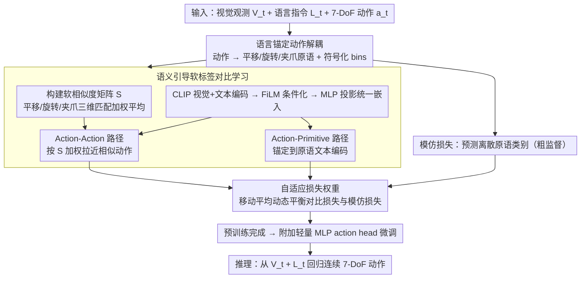

# Language-Grounded Decoupled Action Representation for Robotic Manipulation (LaDA)

**会议**: CVPR 2026  
**arXiv**: [2603.12967](https://arxiv.org/abs/2603.12967)  
**代码**: 无  
**领域**: 机器人操作  
**关键词**: 动作解耦, 语言语义桥梁, 软标签对比学习, VLA, 跨任务泛化

## 一句话总结

提出 LaDA 框架，用自然语言作为语义桥梁将连续 7-DoF 动作解耦为平移/旋转/夹爪三个可解释原语，通过软标签对比学习在共享嵌入空间中对齐跨任务动作表示，仅 0.6B 参数在 LIBERO 上达 93.6% 成功率，超越 1.3B~8.5B 参数的所有基线。

## 研究背景与动机

**领域现状**：视觉-语言-动作（VLA）模型近年推动了机器人操作进展，但高级语义理解与低级动作控制之间的异构性仍是根本挑战。

**现有痛点**：三类范式各有短板——(1) 端到端 VLA（如 OpenVLA、RT-2）将感知和控制紧耦合，动作不可解释且无法复用共享运动结构；(2) 隐式动作学习（如 LAPA、UniSkill）在紧凑隐空间编码动作，但隐空间由观测差异定义，缺乏显式语义标签，跨任务迁移受限；(3) 语言条件策略（如 CLIP-RT、PPL）引入语言但依赖粗粒度离散原语（"向前移动""关闭夹爪"），缺少平移幅度、旋转角度等精细运动参数。

**核心矛盾**："倒水"和"放瓶子"共享大量底层运动原语（到达、抓取、旋转），但现有模型无法利用这些共享结构，导致冗余学习和跨任务泛化差。根本原因在于缺少一个连接符号意图和连续执行的语义接地层。

**本文目标** 构建一个既有语义接地又可跨任务迁移的动作表示，实现细粒度运动语义的共享和对齐。

**切入角度**：语言天然提供了连接人类意图、视觉感知和机器人控制的通用接口——它具有组合性和语义规律性，可编码运动概念并在统一空间中比较、迁移和泛化。

**核心 idea**：用语言锚定的细粒度动作原语作为连续控制和高级语义之间的中间层，通过软标签对比学习实现跨任务动作的语义对齐。

## 方法详解

### 整体框架

LaDA 要解决的是 VLA 模型里高级语义和低级控制之间那道鸿沟——它不去做端到端的黑盒映射，而是在中间插一层「语言锚定的动作表示」。给定视觉观测 $V_t$、语言指令 $L_t$ 和 7-DoF 动作 $\mathbf{a}_t$，pipeline 大致是这样转的：先把连续动作拆成三个能用语言描述的原语（平移、旋转、夹爪），再据此算出一个编码原语级语义亲缘度的软相似度矩阵 $S$，然后用这个矩阵做双路径软标签对比学习——一边对齐动作与动作、一边把动作锚定到它的原语文本描述——在共享嵌入空间里把跨任务复用的运动结构对齐起来；训练时再用一个自适应权重在对比损失和模仿损失之间动态调平衡。预训练完成后只需附加一个轻量 MLP action head 微调，就能直接从 $(V_t, L_t)$ 回归出连续 7-DoF 动作。

### 关键设计

**1. 语言锚定动作解耦：把连续控制翻译成可共享的语义原语**

隐式动作学习的痛点在于动作被压进不可解释的 latent code，"倒水"和"放瓶子"明明共享大量底层运动（到达、抓取、旋转），却没法被显式利用。LaDA 的做法是定义一个投影 $\Pi: \mathbf{a}_t \mapsto \mathbf{p}_t$，把 7-DoF 动作分解为三类带语言模板的原语——平移 "Move [dist] meters along [dir]"、旋转 "Rotate [mag] degrees around [axis]"、夹爪 "Open/Close"，并进一步把每个原语离散化为语言对齐的符号类别（symbolic bins）：平移方向分成前/后/左/右/上/下，旋转轴分成 x/y/z，夹爪是开/关二元状态。这一步的关键不在"分解"本身，而在于分解后每段运动都挂上了显式语义标签——于是"沿 z 轴旋转 90°"这样的原语无论出现在哪个任务里都被标成同一个符号，跨任务的共享结构这才暴露出来、能被后面的对比学习抓住，而不是像隐式 latent code 那样被埋没。

**2. 语义引导软标签对比学习：用"部分相似"代替二元正负对**

有了语义标签还不够，传统对比学习只认二元正负对（要么是正样本要么是负样本），无法表达"平移相同但旋转不同"这种部分相似。LaDA 因此构建一个软相似度矩阵，把三个维度的匹配情况加权平均：

$$S = \frac{w_t M_t + w_r M_r + w_g M_g}{w_t + w_r + w_g}$$

其中 $M_t, M_r, M_g$ 分别是平移/旋转/夹爪维度上的二元匹配矩阵。举例来说，两个动作若平移方向一致、夹爪状态一致、只有旋转轴不同，三个 $M$ 里有两个为 1、一个为 0，加权后 $S_{ij}$ 落在 0 和 1 之间，给出一个梯度化的相似度而非粗暴的"非正即负"。表示侧用 CLIP 的视觉+文本编码器提嵌入、经 FiLM 条件化后再用 MLP 投影到统一空间 $A_i$，然后跑两条 soft-label InfoNCE 路径：Action-Action 路径按 $S_{ij}$ 加权去拉近语义相似的动作嵌入，Action-Primitive 路径把每个动作锚定到它对应的原语文本编码 $P_j$，总对比损失 $\mathcal{L}_{CL} = \mathcal{L}_a + \lambda \mathcal{L}_m$。这样细到单个运动分量的对应关系都能进到梯度里，这正是它能在跨任务设定下复用运动语义的根本原因。

**3. 自适应损失权重：让粗监督和细对齐不互相压制**

训练里同时有两股监督力量——模仿损失 $\mathcal{L}_{IL}$ 预测离散化的原语类别，提供粗粒度行为监督；对比损失 $\mathcal{L}_{CL}$ 做细粒度语义对齐。两者收敛速率和粒度都不一样，用固定权重很容易让其中一方主导、把另一方的信号淹掉。LaDA 借鉴课程学习的思路，用各自损失的移动平均来动态归一化权重：

$$w_{IL} = \frac{\text{MA}(\mathcal{L}_{IL})}{\text{MA}(\mathcal{L}_{IL}) + \text{MA}(\mathcal{L}_{CL})}$$

最终 $\mathcal{L}_{total} = w_{CL} \mathcal{L}_{CL} + w_{IL} \mathcal{L}_{IL}$。哪一项当前损失更大就自动分到更高权重，从而让两股监督在整个训练过程里始终保持均衡，而不是一开始就被某一项带偏。

### 损失函数 / 训练策略

- **预训练**：在 OXE 数据集（约 2250 万帧，22 种机器人）上用 $\mathcal{L}_{total}$ 训练，自动为每个连续动作生成结构化语言描述作为辅助监督
- **微调**：轻量 MLP action head + $\ell_1$ 轨迹回归损失
- **推理**：不需要显式原语标签，直接从 $(V_t, L_t)$ 输出连续动作

## 实验关键数据

### 主实验

| 模型 | 参数量 | LIBERO-Spatial | LIBERO-Object | LIBERO-Goal | LIBERO-Long | LIBERO-Avg |
|------|--------|---------------|---------------|-------------|-------------|------------|
| OpenVLA | 7.5B | 84.7% | 88.4% | 79.2% | 53.7% | 76.5% |
| FlowVLA | 8.5B | 93.2% | 95.0% | 91.6% | 72.6% | 88.1% |
| CLIP-RT | 1.3B | 95.2% | 99.2% | 94.2% | 83.8% | 93.1% |
| **LaDA** | **0.6B** | **95.2%** | **99.2%** | **93.6%** | **86.4%** | **93.6%** |

| 模型 | MimicGen 9 任务平均 | 代表任务 StackThree_D1 |
|------|-------------------|----------------------|
| OpenVLA | 38% | 20% |
| Phoenix | 58% | 20% |
| CLIP-RT* | 51% | 52% |
| **LaDA** | **67%** | **71%** |

### 消融实验

| 配置 | Spatial | Object | Goal | Long | Avg |
|------|---------|--------|------|------|-----|
| w/o SCL（去软标签对比） | 79.2% | 82.8% | 76.6% | 63.4% | 75.5% |
| w/o AW（去自适应权重） | 93.6% | 94.4% | 87.2% | 74.4% | 87.4% |
| **LaDA（完整）** | **95.2%** | **99.2%** | **93.6%** | **86.4%** | **93.6%** |

### 关键发现

- 移除 SCL 后 LIBERO 平均骤降 18.1 个点（93.6→75.5%），其中 Long 从 86.4% 降至 63.4%，说明长序列最依赖跨任务语义共享
- 移除自适应权重后平均降 6.2 个点，Long 降 12 个点，证明优化平衡对长序列尤为关键
- 泛化测试：跨任务设定中 CLIP-RT* 成功率为 0%，LaDA 达 12.3%，证明语言锚定原语使未见指令的运动语义复用成为可能
- MimicGen 上 LaDA 在多任务训练中增益明显（CLIP-RT 几无增益），说明语义结构有效促进运动模式跨任务共享

## 亮点与洞察

- "语言作为语义桥梁"的理念直击 VLA 痛点——不做端到端黑盒映射，而是在动作层建立显式语义接口层，让动作可比较、可迁移。这比隐式动作学习和粗粒度语言条件都更优雅
- 软标签对比学习是方法论创新——传统对比学习用二元正负对，LaDA 用连续亲缘度矩阵做 soft InfoNCE，允许"平移相同但旋转不同"这种部分匹配有适当梯度信号。这个思路可迁移到目标检测/分割等需要细粒度语义对齐的领域
- 参数效率惊人：0.6B 参数超越 7B+ 模型，说明精心设计的结构化归纳偏置（动作解耦+对比对齐）可以大幅减少模型对规模的依赖

## 局限与展望

- 三类原语（平移/旋转/夹爪）覆盖标准工业机械臂的 7-DoF，但对灵巧手操作（如人形手指关节 20+ DoF）可能不够，需要更多运动分量的原语设计
- 语言模板手工设计（"Move X meters along Y"），自动化原语发现可能更灵活
- 实机实验仅 pick-and-place 单一任务，复杂真实场景验证不足
- 软相似度矩阵权重 $(w_t, w_r, w_g)$ 是超参数，不同任务域可能需重新调整

## 相关工作与启发

- **vs CLIP-RT**：同用语言条件控制，但 CLIP-RT 将动作建模为离散语言 token 分类，缺少运动参数的连续语义对齐；LaDA 用软标签对比学习做连续亲缘度匹配，参数量减半但性能持平略优
- **vs LAPA**：隐式动作学习将动作编码为不可解释的 latent code，跨任务迁移需隐式学习；LaDA 让动作空间变得可解释且可通过语义直接对齐迁移
- **vs Phoenix**：Phoenix 依赖运动级自反思纠正，MimicGen 上 58%；LaDA 无自纠正直接达 67%，说明更好的表示比更复杂的推理策略更有效

## 评分

- 新颖性: ⭐⭐⭐⭐ 语言锚定动作解耦 + 软标签对比学习是全新方法论组合
- 实验充分度: ⭐⭐⭐⭐ LIBERO/MimicGen 双基准 + 消融 + 泛化 + 实机，但实机偏简单
- 写作质量: ⭐⭐⭐⭐ 问题定义清晰，三类范式对比有说服力
- 价值: ⭐⭐⭐⭐ 0.6B 超越 7B+ 有强实践意义，软标签对比学习可广泛迁移

<!-- RELATED:START -->

## 相关论文

- [\[CVPR 2025\] LaDA: Language-Grounded Decoupled Action Representation for Robotic Manipulation](../../CVPR2025/robotics/language-grounded_decoupled_action_representation_for_robotic_manipulation.md)
- [\[CVPR 2026\] QuantVLA: Scale-Calibrated Post-Training Quantization for Vision-Language-Action Models](quantvla_scale-calibrated_post-training_quantization_for_vision-language-action_.md)
- [\[CVPR 2026\] HiF-VLA: Hindsight, Insight and Foresight through Motion Representation for Vision-Language-Action Models](hif-vla_hindsight_insight_and_foresight_through_motion_representation_for_vision.md)
- [\[CVPR 2026\] SaPaVe: Towards Active Perception and Manipulation in Vision-Language-Action Models for Robotics](sapave_active_perception_manipulation_vla_roboti.md)
- [\[CVPR 2026\] ForceVLA2: Unleashing Hybrid Force-Position Control with Force Awareness for Contact-Rich Manipulation](forcevla2_unleashing_hybrid_force-position_control_with_force_awareness_for_cont.md)

<!-- RELATED:END -->
