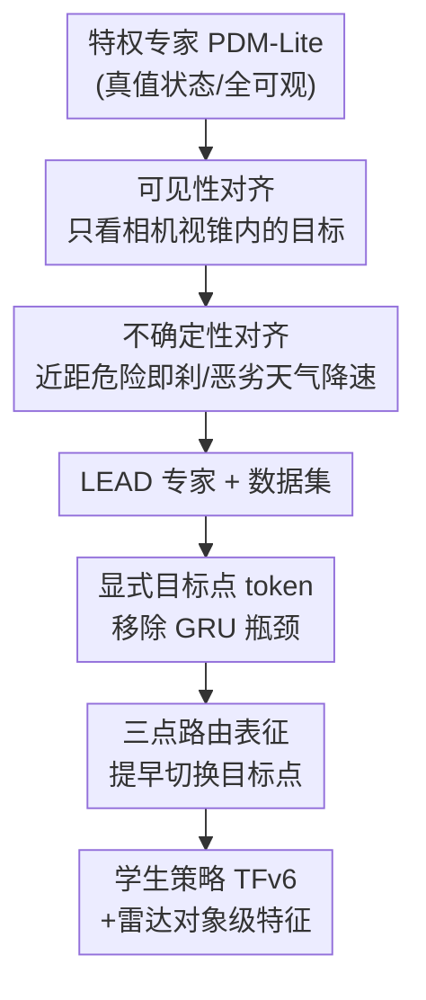

# LEAD: Minimizing Learner-Expert Asymmetry in End-to-End Driving

**会议**: CVPR 2026  
**arXiv**: [2512.20563](https://arxiv.org/abs/2512.20563)  
**代码**: https://github.com/kesai-labs/lead (有)  
**领域**: 自动驾驶 / 机器人 / 模仿学习  
**关键词**: 端到端驾驶, 模仿学习, 特权专家, CARLA, 闭环评测

## 一句话总结
这篇论文指出 CARLA 里"学车（student）学不会老司机（privileged expert）"的根因不是模型不够强，而是专家用了学生看不到/测不准的特权信息、以及导航意图给得太稀疏；通过把专家的感知和决策约束到学生能观测的范围（LEAD 专家+数据集）、并重构学生策略的目标点注入方式（TFv6），在 Bench2Drive 上拿到 95 DS、在 Longest6 v2 / Town13 上把此前最好成绩翻倍以上。

## 研究背景与动机
**领域现状**：CARLA 闭环驾驶的主流范式是 "Learning by Cheating"（LBC）两阶段模仿学习——先用真值状态（精确地图、其他车辆的速度/加速度、全场景 3D 框）造一个规则型/RL 特权专家，再让一个只看相机/LiDAR 的学生策略去模仿专家的动作。过去几年大家默认"专家越强、学生越强"，于是把精力都放在堆专家性能和换更大模型上。

**现有痛点**：学生策略的闭环性能早已停滞在远低于专家的水平。作者观察到两件被长期忽视的事：① 专家用了大量学生根本拿不到或测不准的信息，导致它的示范"对学生不可学"；② 学生在测试时只靠**单个目标点（target point）** 来表达"我要往哪开"，意图严重欠定，模型于是退化成"无脑朝目标点打方向盘"。

**核心矛盾**：专家在**全可观、零噪声**状态下是最优的，但同一套动作被一个**部分可观、高不确定**的学生模仿时就变得既不可学又危险——这就是"学习者-专家不对称（learner-expert asymmetry）"。以往要么联合训练可微专家（驾驶里专家是规则型、不可微，行不通），要么单纯加大导航信号密度（前人验证过收效甚微）。

**本文目标**：把这种不对称拆成可操作的三类分别消除——可见性（visibility）、不确定性（uncertainty）、意图（intent）不对称——并验证消除它们能直接提升闭环性能，而非只换模型架构。

**切入角度**：不再以"最大化专家性能"为目标，而是以"让专家的示范对学生更好学"为目标重新设计专家；同时发现 target point bias（策略把目标点当成纠偏信号、偏离路线后猛打方向回去）即使在强场景表征下也存在，根因是意图欠定 + 目标点注入太晚。

**核心 idea**：把专家的特权信息"降级"到学生可观测的水平（造出 LEAD 专家与数据集），并把学生的导航条件从"单点、解码器晚期注入"改成"三点、编码阶段早期注入"，让模仿学习的监督信号和学生的真实观测对齐。

## 方法详解

### 整体框架
论文把整个改进拆成两条对齐主线，串在 LBC 两阶段范式里：**先对齐专家给出的监督（state alignment），再对齐学生消化意图的方式（intent alignment）**。基线是当前 Longest6 v2 SOTA 的 TransFuser++（论文按版本号统称 TFv5）——一个用相机+LiDAR 经自注意力融合产出 BEV 场景 token、再用 route query 跨注意力做横向控制的端到端策略。作者在**保持模型架构和数据规模不变**的受控设定下，逐项把专家/意图信息收敛到学生可见范围，最后产出新专家+数据集 **LEAD** 和新学生策略 **TFv6**。

整条 pipeline 自上而下是：原始特权专家 PDM-Lite → 经可见性/不确定性约束变成 LEAD 专家 → 采集 LEAD 数据集 → 训练学生策略；学生侧把目标点从 GRU 晚期注入改为编码阶段的显式 token、并从单点扩成三点 → 得到 TFv6。

### 关键设计

**1. 可见性对齐：把专家的"上帝视角"裁剪到相机视锥内**

痛点是 PDM-Lite 用真值 3D 框预测碰撞、对**学生相机看不到的演员**（比如车后方的行人、被遮挡的车）也做出反应，这种"非因果"的刹车在学生看来毫无来由，是不可学的噪声示范。LEAD 的做法是把专家的规划输入约束到学生传感器能覆盖的信号：动态演员只保留落在相机视野内的（还会考虑演员尺寸、天气、昼夜等可见性因素），红绿灯只考虑相机视锥（frustum）内的灯；对限速牌，因为不直接给模型限速、且牌子只是间歇可见，所以把专家目标速度上限设成"路牌限速"和"周边车流典型速度"的较小值——后者从局部交通上下文可推断。这样专家不再因为"看见学生看不见的东西"而动作，示范变得因果可学

**2. 不确定性对齐：让专家像"测不准的人"那样留安全裕度**

痛点是专家用零噪声的速度/加速度做精确碰撞预测，于是敢贴着极小安全裕度开，但学生从原始传感器估不出这么精确的运动量，照学就会出危险动作。LEAD 调整专家刹车逻辑来注入"保守性"：除了对预测到的碰撞航线刹车，专家现在**只要附近有可观测的危险物就刹**（不再依赖精确速度/加速度估计）；在夜间、大雨等低能见度条件下主动降低行驶速度以反映感知置信度下降；在无保护路口转弯时，把迎面来车的碰撞检测框**放大**，用更大的空间裕度而非精确运动预测来做安全决策。注意此设计不损专家自身能力——表 5 显示 LEAD 专家在 B2D/Longest6 v2 上与 PDM-Lite 性能持平

**3. 意图对齐：把单目标点的晚期注入改成三点的早期 token 化**

痛点是学生只靠单个目标点表达意图，存在两个顽固失败模式：① 当目标点很远或位置异常（如环岛里落在车身后方），轨迹预测彻底崩溃、输出错乱不可用；② 当目标点落在相邻车道，策略变得"目标点固着"、无视周边静/动态危险猛打方向冲过去。作者证明这种 target point bias 即便场景表征很强也不消失，根因有二：意图**欠定**（单点无法消歧变道这类多步机动）、目标点**注入太晚**（几何坐标在解码器晚期才进来，无法和编码器的感知特征充分交互，反而被放大成主导信号）。

对应两步重构：其一，**移除 GRU 精修阶段**，把目标点表示成与 BEV token 并列的**显式 token**（嵌入前用训练集统计量归一化到 $[-1,1]$）——这让目标点在编码阶段就和场景特征交互，直接缓解第一个失败模式（表 2：+6 DS / +2 DS）。其二，把单点条件换成**紧凑三点路由表征**（前一个/当前/未来目标点），并**调小当前目标点的切换距离阈值**，让未来目标点更早生效、训练时提供更强监督——例如当前目标点只剩 2-3 米时它对长程路径信息量不足，策略此时可依赖未来目标点（表 3：+1.4 DS / +2 DS）

> ⚠️ **GRU 为何是瓶颈**：GRU 本为建模时序依赖而引入，但 planning query 已经通过堆叠的自/跨注意力整合了时空上下文，使 GRU 基本冗余。它被插在一个表达力强得多的 transformer 解码器（6 层 ×256 维）之后，自身只有单层 ×64 隐藏单元，形成浅瓶颈：不但没能让场景上下文和目标点更丰富地交互，反而退化成"放大更强的可用信号（即目标点）"。且 GRU 只用目标点条件化路径/转向，目标速度独立预测——一旦偏离路线，转向被强拉向目标点、速度却与之失配，分布漂移下直接出错。

### 损失函数 / 训练策略
方法层面无新增损失，沿用 TransFuser++ 的模仿学习目标。训练规模上：受控消融（第 3 节）用 40 小时驾驶数据；主实验把 LEAD 数据集扩到 **73 小时**、覆盖更多城镇/光照/天气/传感器配置，用 4 块 L40S GPU 混合精度训练约一周。雷达侧给学生 4 个雷达单元（每帧每单元 75 个检测点），先用一个轻量学习模块把原始雷达点预处理成对象级特征，这些特征**绕过传感器融合编码器**、作为额外上下文 token 直接喂进 planning 解码器。所有结果在 3 个不同随机种子独立训练的模型上取平均。

## 实验关键数据

### 受控消融（架构/数据规模固定，逐项对齐）
三张控制变量表说明每一步对齐的贡献（DS = Driving Score，越高越好）：

| 改进步骤 | Longest6 v2 DS | Bench2Drive DS | 说明 |
|----------|----------------|----------------|------|
| TFv5 + PDM-Lite 数据集 | 22.51 | 83.56 | 基线 |
| TFv5 + LEAD 数据集（状态对齐） | 34.05 | 84.94 | Longest6 +11.5 |
| TFv6 移除 GRU（显式目标点 token） | 40.70 | 87.26 | Longest6 +6.7 / B2D +2.3 |
| TFv6 用三目标点（意图加密） | 42.13 | 89.29 | Longest6 +1.4 / B2D +2.0 |

### 主实验：闭环 SOTA（Bench2Drive / Longest6 v2，表 5）
扩大数据/骨干/传感器后的最佳模型（140° FOV 相机 + LiDAR + Radar + RegNetY-032）：

| 方法 | 骨干 | B2D DS | B2D SR | Longest6 v2 DS | Longest6 v2 RC |
|------|------|--------|--------|----------------|----------------|
| HiP-AD | ResNet-50 | 86.8 | 69.1 | 7 | 56 |
| SimLingo | InternViT-300M | 85.1 | 67.2 | 22 | 70 |
| TFv5 | RegNetY-032 | 83.5 | 67.3 | 23 | 70 |
| **TFv6（最佳）** | RegNetY-032 | **95.2** | **86.8** | **62** | 91 |
| PDM-Lite（特权专家） | - | 97.0 | 92.3 | 73 | 100 |
| LEAD（本文专家） | - | 96.8 | 96.6 | 73 | 93 |

注：纯相机版 TFv6（ResNet-34, 360°）已达 B2D 91.6 DS / Longest6 v2 43 DS，全面超越所有学生基线。相对 TFv5/SimLingo（均为 CARLA Challenge 2024 冠军），Longest6 v2 上 +39 DS、+21 RC。

### Town13 泛化（未见城镇，表 4，用 NDS）
| 方法 | RC | DS | NDS | 设定 |
|------|-----|-----|------|------|
| TFv5 | 50.20 | 1.08 | 2.12 | Val（Town13 训练时不可见） |
| **TFv6** | 39.70 | **3.52** | **4.04** | Val |
| TFv6 | 71.82 | 5.28 | 14.65 | Train（仅供分析，灰显） |
| PDM-Lite | 83.40 | 36.30 | 58.50 | Val（特权专家上界） |

### 真实世界开环迁移（LTFv6，表 6）
丢掉 LiDAR/Radar、用位置编码替代 LiDAR（即 LTF 设定）后：

| 方法 | NAVSIM v1 (PDMS) | NAVSIM v2 (EPDMS) | WOD-E2E (RFS) |
|------|------------------|-------------------|---------------|
| LTF | 83.8 | 23.1 | - |
| LTFv6 | 85.4 | 28.3 | 7.51 |
| + LEAD 预训练 | 86.4 | 31.4 | 7.76 |
| Expert（上界） | 94.5 | 51.3 | 8.10 |

### 关键发现
- **状态对齐是单步收益最大的改进**：仅换 LEAD 数据集（不改架构）就在 Longest6 v2 上 +11.5 DS，证明"专家设计"本身是被长期忽视的杠杆。
- **DS 在短路线上会高估鲁棒性**：TFv6 在 B2D 上 DS 已接近 LEAD 专家（差 ~2），但 SR（无违规完成率）仍差 ~10 点——因为 DS 对靠近终点的违规惩罚很轻，SR 这种"全或无"指标才暴露真实差距。
- **泛化鸿沟仍显著**：TFv6 在 Town13 Train 上 14.65 NDS，到 Town13 Val 掉到 4.04 NDS，凸显"训练时绝不碰验证城镇"的 benchmark 才有意义。
- **意图对齐有副作用**：削弱 target point bias 后总体违规下降，但"路线偏离（Route Deviation）"反而上升——因为模型不再偏航后猛拽回目标点（图 2）。

## 亮点与洞察
- **重新定义问题**：把"学生学不好"从"模型不够强"重新归因为"专家给的监督对学生不可学/意图欠定"，并给出三类可分别操作的不对称（可见性/不确定性/意图）——这是一个很干净、可迁移到任何 teacher-student 模仿学习设定的诊断框架。
- **"降级专家"反直觉但有效**：通常大家想让专家更强，本文反而主动削掉专家特权（裁视野、加保守裕度），且实验证明 LEAD 专家自身性能不掉（与 PDM-Lite 持平）——说明"可学性"和"专家能力"不冲突，可以兼得。
- **目标点注入位置 > 信号密度**：前人加密导航信号收效甚微，本文指出"注入的方式和位置同样重要"——把目标点从解码器晚期 GRU 挪到编码阶段显式 token，单这一步就 +6 DS，是很实用的架构 trick。
- **可迁移性**：合成数据 LEAD 预训练在 NAVSIM/WOD-E2E 三个真实开环基准上一致涨点，说明"对齐过的合成监督"能跨越 sim-to-real 分布漂移带来迁移收益。

## 局限与展望
- **泛化鸿沟仍未根治**：Town13 Val 的 NDS（4.04）远低于 Train（14.65）和专家上界（58.50），跨城镇泛化仍是开放问题。
- **DS/SR 差距暴露鲁棒性不足**：B2D 上 DS 已逼近专家但 SR 仍差 10 点，说明策略在"全程零违规"意义上还不够稳。
- **依赖 CARLA 这一特定模拟器**：长程闭环评测目前只有 CARLA 支持，结论的外推性受限于 CARLA 的场景分布；作者也指出 log-replay/重建型基准无法做长程测试，生成式仿真或是出路。
- **真实世界仅做开环验证**：NAVSIM/WOD-E2E 都是开环指标，绝对提升幅度温和（如 WOD-E2E 7.51→7.76），真正的真实闭环收益仍待验证。
- 个人补充：可见性/不确定性约束里有不少人工设定的阈值（切换距离、放大框比例、降速幅度），论文正文未给完整消融，迁移到新场景可能需要重新调参（⚠️ 细节在补充材料，以原文为准）。

## 相关工作与启发
- **vs PDM-Lite**：本文专家直接构建在开源规则专家 PDM-Lite 之上，但目标相反——PDM-Lite 追求专家驾驶性能，LEAD 追求"示范对学生好学"，且在不牺牲专家自身性能（B2D/Longest6 v2 与 PDM-Lite 持平）的前提下让学生大涨。
- **vs TFv5 (TransFuser++)**：同一架构家族，TFv6 的核心改动是移除 GRU 精修瓶颈、目标点显式 token 化、三点意图表征、加雷达对象级特征；在所有 CARLA 闭环基准上大幅超越 TFv5。
- **vs SimLingo / HiP-AD**：SimLingo（CARLA Challenge 2024 冠军 VLA 模型）和 HiP-AD（B2D 上此前发表 SOTA、纯相机）都在短路线 B2D 上有竞争力，但 HiP-AD 在 Longest6 v2 上只有 7 DS——本文借此论证"长程闭环评测才能暴露短路线掩盖的弱点"。
- **vs 联合训练可微专家的传统 state-asymmetry 方法**：经典做法靠可微专家+在线交互联合适配学生与专家，在低维设定有效但在大规模驾驶（专家是规则型、不可微）不实用；本文用"直接约束专家输入/决策逻辑"这一离线、非可微友好的方式绕开了该限制。

## 评分
- 新颖性: ⭐⭐⭐⭐ 把"学不好"重新归因并拆成三类可操作不对称、提出"降级专家"思路，视角新但单项技术（裁视野/加裕度/换注入位置）较工程化
- 实验充分度: ⭐⭐⭐⭐⭐ 受控消融逐项归因 + 5 个 benchmark（含未见城镇泛化和真实开环迁移）+ 三种子均值，扎实
- 写作质量: ⭐⭐⭐⭐⭐ 问题诊断清晰、失败模式分析具体、控制变量讲得很干净
- 价值: ⭐⭐⭐⭐⭐ 在 CARLA 闭环多个基准刷新 SOTA（95 DS / Longest6 翻倍），开源代码数据模型，对端到端驾驶社区实用价值高

<!-- RELATED:START -->

## 相关论文

- [\[CVPR 2026\] End-to-End Language-Action Model for Humanoid Whole Body Control](end-to-end_language-action_model_for_humanoid_whole_body_control.md)
- [\[CVPR 2026\] RoboTAG: End-to-end Robot Pose Estimation via Topological Alignment Graph](robotag_end-to-end_robot_pose_estimation_via_topological_alignment_graph.md)
- [\[NeurIPS 2025\] SutureBot: A Precision Framework & Benchmark for Autonomous End-to-End Suturing](../../NeurIPS2025/robotics/suturebot_a_precision_framework_benchmark_for_autonomous_end-to-end_suturing.md)
- [\[NeurIPS 2025\] AutoVLA: A Vision-Language-Action Model for End-to-End Autonomous Driving with Adaptive Reasoning and Reinforcement Fine-Tuning](../../NeurIPS2025/robotics/autovla_a_vision-language-action_model_for_end-to-end_autonomous_driving_with_ad.md)
- [\[CVPR 2025\] TinyNav: End-to-End TinyML for Real-Time Autonomous Navigation on Microcontrollers](../../CVPR2025/robotics/tinynav_end-to-end_tinyml_for_real-time_autonomous_navigation_on_microcontroller.md)

<!-- RELATED:END -->
