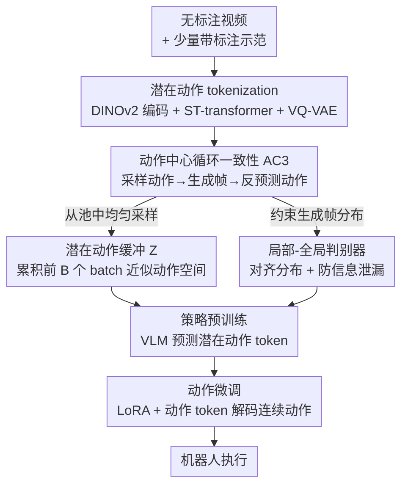

# Learning a Unified Latent Action Space from Videos with Action-centric Cycle Consistency

**会议**: CVPR 2026  
**论文**: [CVF Open Access](https://openaccess.thecvf.com/content/CVPR2026/html/Chen_Learning_a_Unified_Latent_Action_Space_from_Videos_with_Action-centric_CVPR_2026_paper.html)  
**代码**: 待确认  
**领域**: 机器人 / 具身智能  
**关键词**: 潜在动作, 视频预训练, 循环一致性, VLA, 跨本体  

## 一句话总结
提出 CycleMimic，用"动作中心循环一致性（AC3）"约束从无标注视频里学习潜在动作 tokenizer——靠"采样潜在动作→生成未来帧→再从原帧和生成帧预测回该动作"的闭环，逼出语义一致且跨本体统一的潜在动作空间，在 LIBERO 上比 OpenVLA 提升 20.1%、CALVIN 平均完成任务数从 3.27 升到 3.93。

## 研究背景与动机
**领域现状**：机器人模仿学习依赖昂贵的动作标注示范，而视频是几乎免费的海量数据源。近年的主流做法是先训练一个"潜在动作 tokenizer"：给定相邻两帧 $o_t, o_{t+H}$，编码出帧间的潜在动作 $z_t$，再用当前帧加潜在动作去重建未来帧，从而把视频里的行为模式蒸馏成离散动作 token，供 VLA（Vision-Language-Action）策略预训练用（如 Genie、LAPA、UniVLA）。

**现有痛点**：作者做了 pilot study 暴露两个硬伤。其一，每个当前帧与其未来帧是**唯一配对**的，tokenizer 只要记住"这一对"就能完成重建，根本不需要理解底层转移动力学——结果学到的潜在动作语义不一致（把参考视频的潜在动作施加到新当前帧上，生成的运动与参考发散）。其二，为了容纳不同机器人的异构形态，tokenizer 通常给每个本体分配**互不相交的潜在动作子集**，导致潜在动作空间碎片化、知识无法跨本体迁移。

**核心矛盾**：重建目标太"容易"——唯一配对让 tokenizer 走捷径，既学不到语义一致的动作，也不会主动统一不同本体的动作表示。

**本文目标**：构造一个**统一的潜在动作空间**，同时满足（1）语义一致性、（2）跨本体统一。

**切入角度**：把"唯一配对"这个捷径打破——不再只用数据集里成对的 $(o_t, o_{t+H})$，而是从一个潜在动作池里**采样**动作、解码生成**多样**的未来帧，再要求 tokenizer 从原帧与生成帧里把这个采样动作**预测回来**。

**核心 idea**：用循环一致性（CycleGAN 思想搬到动作空间）造一个更难的自监督任务——"采样动作 → 生成帧 → 反预测动作"形成闭环，逼 tokenizer 学到语义连贯、可跨本体复用的潜在动作。

## 方法详解

### 整体框架
CycleMimic 的输入是无标注视频数据集 $T^o$ 与少量带动作标注的机器人示范 $T^a$，输出是一个能执行操作任务的策略。整条管线分三段：先学一个带循环一致性约束的潜在动作 tokenizer（核心创新都在这一段），再把 tokenizer 的编码器当作逆动力学模型、在视频上预训练 VLA 策略去预测潜在动作 token，最后用带标注数据微调出连续的低层机器人动作。

tokenizer 本身是个 VQ-VAE 风格的编码器-解码器：编码器 $E$ 用 DINOv2 抽取当前帧与未来帧的特征，拼上可学习的潜在动作 token，过一个时空（ST）transformer 聚合转移动力学，量化成离散动作 $z_t^q$（每个动作用 $l_z$ 个 token、码本大小 $K$）；解码器 $D$ 用当前帧加 $z_t^q$ 重建未来帧。真正让它"学好"的是叠加在上面的三个贡献：动作中心循环一致性、潜在动作缓冲、局部-全局判别器。

### 关键设计

**1. 动作中心循环一致性（AC3）：用闭环造一个更难的任务，逼出语义一致与跨本体统一**

这是全文的核心，针对"唯一配对让 tokenizer 走捷径"。做法是：取数据集帧 $o_c$，从潜在动作缓冲 $Z$ 里采样一个动作 $z_s^q$，用解码器生成对应未来帧 $\hat{o}_g = D(o_c, z_s^q)$；然后把 $o_c$ 与 $\hat{o}_g$ 一起送进编码器，要求它**恢复出原本采样的动作** $\hat{z}_s^q = E(o_c, \hat{o}_g)$，并强制 $\hat{z}_s^q \approx z_s^q$。为了让梯度能传，用量化前的嵌入 $\hat{z}_s^e$ 与码本向量算 L2 距离作为相似度，再以采样动作的码本索引为监督做交叉熵：

$$\mathcal{L}_C = -\sum_{k=1}^{K} y_k \log\left(\frac{\exp(-d(\hat{z}_s^e, e_k)/\tau)}{\sum_{j=1}^{K}\exp(-d(\hat{z}_s^e, e_j)/\tau)}\right)$$

与原来"固定帧对重建"不同，这个闭环里未来帧是采样动作生成的、多样且不再唯一配对，tokenizer 必须真正理解"什么动作导致什么变化"才能反预测成功——语义一致性由此被逼出来。跨本体统一也顺势解决：采样本体 $E_i$ 编码的动作 $z_s^q$，施加到本体 $E_j$ 的帧 $o_c$ 上生成帧、再预测 $E_j$ 的动作，循环一致性强制两者相等，于是不同本体的动作被对齐进同一空间。

**2. 潜在动作缓冲 $Z$：给一个"会动的"动作空间一个可采样的近似，并防止其坍缩**

AC3 要"从潜在动作空间采样"，但 tokenizer 在训练中潜在动作空间是**动态变化**的，没有一个预定义的空间可采。最直接的办法是只从当前 batch 采，但这会给 tokenizer 留下偷懒空间——它会把潜在动作空间压缩得很小来降低循环一致性的难度（即空间坍缩）。本文的解法很简洁：用一个缓冲 $Z$ **累积前 $B$ 个 batch** 编码出的潜在动作，从中均匀采样，以此近似真实的潜在动作空间，同时因为来源跨多个 batch、空间被撑开而不易坍缩。消融显示这个 $B$ 不能太小也不能太大：$B=1$（仅当前 batch）因空间坍缩掉点，$B=16$ 因纳入过早 batch 的"陈旧动作"污染空间也掉点，$B=4$ 最优。

**3. 局部-全局判别器：对齐生成帧与真实帧分布，同时堵住解码器→编码器的信息泄漏**

AC3 引入了两个新风险。其一，解码器生成的帧与数据集真实帧存在**分布差异**，编码器在"假帧"上表现会退化；其二，解码器可能把采样动作的信息**直接泄漏**进生成帧的像素里，让编码器靠"读泄漏"而非"理解动作"就能反预测成功——形成看似循环一致、实则错误的对应。本文用一个局部-全局判别器 $\Psi$ 解决：它用空间 transformer 抽 patch 特征产出 patch logits（局部细节），再卷积+全局池化产出 global logits（全局风格），在两个层级上做对抗：

$$\mathcal{L}^{\Psi}_{GAN} = -\log(\Psi(o)) - (1 - \log(\Psi(D(o,z)))), \quad \mathcal{L}^{D}_{GAN} = 1 - \log(\Psi(D(o,z)))$$

判别器逼解码器生成更逼真的帧，从而对齐分布；而一旦解码器把动作信息嵌进生成帧，就会引起分布偏移被判别器惩罚，间接堵住了信息泄漏。消融里去掉判别器在 LIBERO-Object 上从 97.6 掉到 88.1，只用局部判别器也明显逊于局部-全局组合。

**4. 三段式策略学习与动作 token 解码：把视频先验稳稳搬到真实机器人动作上**

tokenizer 学好后，编码器 $E$ 被当作逆动力学模型，从 $o_t, o_{t+H}$ 抽潜在动作 token。策略基于 Prismatic-7B VLM（融合 SigLip+DINOv2 视觉编码器 + LLaMA-2），词表扩展 $K$ 个专用 token $\{LACT_1,...,LACT_K\}$，在视频上做自回归预训练去预测潜在动作（实验设动作 token 长度 $N=4$）。微调阶段接一个动作解码器，在潜在动作 token 后追加 query token `ACT`，从 VLM 末层隐状态聚合出连续机器人动作（delta 末端位姿），VLM 用 LoRA 微调以保留先验、动作解码器全参训练。消融对比三种解码方式：离散分箱预测最差（精度受限），直接把潜在动作解码成连续值居中，本文"追加动作 token 再解码"最好——因为直接从潜在动作 token 解动作会让同一 token 同时背负连续回归与潜在动作预测两重约束，反而难优化。

## 实验关键数据

### 主实验
LIBERO（130 个语言条件操作任务，4 个 suite）平均成功率：

| 方法 | Spatial | Object | Goal | Long | 平均 |
|------|---------|--------|------|------|------|
| LAPA | 73.8 | 74.6 | 58.8 | 55.4 | 65.7 |
| OpenVLA | 84.7 | 88.4 | 79.2 | 53.7 | 76.5 |
| UniVLA | 96.5 | 96.8 | 95.6 | 92.0 | 95.2 |
| Ours w/ Genie (Full) | 91.6 | 92.7 | 85.5 | 84.9 | 88.6 |
| **Ours (Bridge)** | 95.8 | 97.6 | 96.2 | 92.0 | 95.4 |
| **Ours (Full)** | **97.5** | **98.2** | **97.3** | **93.4** | **96.6** |

亮点：仅用 Bridge 数据集预训练（数据量远小于 OpenVLA/Octo/UniVLA 用的大库）就反超它们；同架构同训练策略、只把 AC3 换成 Genie 的"Ours w/ Genie"平均仅 88.6，直接验证循环一致性的增益。相对 OpenVLA 平均提升约 20.1%。

CALVIN（ABC→D 未见场景泛化，Avg. Len. = 1000 条序列里平均连续完成任务数）：

| 方法 | 1 | 2 | 3 | 4 | 5 | Avg. Len. |
|------|---|---|---|---|---|-----------|
| OpenVLA | 0.913 | 0.778 | 0.620 | 0.521 | 0.435 | 3.27 |
| UniVLA | 0.955 | 0.858 | 0.754 | 0.669 | 0.565 | 3.80 |
| Ours w/ Genie | 0.952 | 0.838 | 0.691 | 0.542 | 0.437 | 3.46 |
| **Ours** | **0.973** | **0.867** | **0.792** | **0.704** | **0.594** | **3.93** |

真实机器人（Franka 臂，9 类任务，每任务仅 30 条示范，10 次随机位姿评测）整体成功率：OpenVLA 0.44、UniVLA 0.77、Ours w/ Genie 0.68、**Ours 0.88**——相对最强视频预训练 baseline 提升约 44%（⚠️ 论文摘要的 "44% improvement" 对应此处口径，具体基线以原文为准）。SimplerEnv（WidowX+Bridge）抓取与任务成功率亦显著优于 Genie 基线（图示，无表格数值）。

### 消融实验
均在 Bridge 预训练 + LIBERO 微调上做：

| 配置 | Spatial / Object / Goal / Long | 说明 |
|------|-------------------------------|------|
| 缓冲 $B=1$ | 93.4 / 95.7 / 92.5 / 87.9 | 仅当前 batch，空间坍缩掉点 |
| **缓冲 $B=4$**（默认） | 95.8 / 97.6 / 96.2 / 92.0 | 最优 |
| 缓冲 $B=16$ | 92.5 / 98.1 / 95.3 / 91.5 | 陈旧动作污染空间 |
| 无判别器 | 90.3 / 88.1 / 87.9 / 81.6 | 信息泄漏，大幅掉点 |
| 仅局部判别器 | 95.4 / 95.6 / 93.3 / 90.8 | 逊于局部-全局 |
| **局部-全局判别器**（默认） | 95.8 / 97.6 / 96.2 / 92.0 | 最优 |
| 离散动作解码 | 89.6 / 90.3 / 85.9 / 78.6 | 精度受限，最差 |
| 潜在动作解码 | 94.8 / 97.1 / 95.5 / 91.1 | 居中 |
| **动作 token 解码**（默认） | 95.8 / 97.6 / 96.2 / 92.0 | 最优 |

### 关键发现
- 判别器贡献最大：去掉后 LIBERO-Long 从 92.0 暴跌到 81.6，说明防信息泄漏 + 分布对齐是 AC3 能真正生效的前提，否则循环一致性会被"读泄漏"作弊绕过。
- 缓冲 batch 数存在甜区（$B=4$）：太小坍缩、太大污染，印证"潜在动作空间动态变化"这一痛点的真实性。
- 判别器深度匹配编码器（12 层）最稳；过浅容量不足维持不住与编码器的对抗均衡、易泄漏。
- 跨数据规模优势明显：小数据集（Bridge）预训练即可超过大数据集预训练的强基线，说明 AC3 提升的是数据利用效率而非靠堆数据。

## 亮点与洞察
- 把 CycleGAN 的循环一致性思想迁移到"潜在动作"空间，是很巧的概念搬运：原本图像翻译里 $F(G(x))\approx x$ 解决无配对域映射，这里 $E(o_c, D(o_c, z))\approx z$ 解决"无监督动作语义一致"，闭环天然制造了一个比帧对重建更难、无法走捷径的任务。
- "潜在动作缓冲"是一个朴素但点睛的工程设计：它把"如何从一个还在变化的空间里采样"这个看似无解的问题，用跨 batch 累积近似解决，且顺带防坍缩——可迁移到任何"目标分布随训练动态漂移、又需要从中采样"的自监督场景。
- 局部-全局判别器一石二鸟：既对齐生成帧分布、又堵信息泄漏，提醒做"生成-再编码"闭环时务必警惕解码器把答案偷偷写进像素。
- 跨本体统一不靠新模块、纯靠 AC3 的采样-施加机制自然实现（从本体 A 采样的动作施加到本体 B 的帧），思路优雅。

## 局限与展望
- 潜在动作的语义一致性靠生成帧质量兜底，若解码器在复杂/长时序场景生成质量下降，循环一致性约束可能失效——论文实验多为相对短程操作任务。
- 缓冲 batch 数 $B$、判别器深度等超参对结果敏感（消融可见），换数据集可能需要重新调，缺乏自适应机制。
- 真实机器人实验每任务仅 30 条示范、9 类任务，规模偏小；"44% 提升"的对照口径需结合原文具体基线理解（⚠️ 以原文为准）。
- 仍依赖一定量带动作标注数据做微调，未完全摆脱标注；可探索更少标注或零标注迁移。

## 相关工作与启发
- **vs Genie**：Genie 用因果潜在动作模型靠下一帧预测学动作，是"固定帧对重建"的代表；本文同架构下把它换成 AC3，LIBERO 平均从 88.6 升到 96.6、CALVIN 从 3.46 升到 3.93，直接证明循环一致性优于单纯重建。
- **vs LAPA / Moto**：它们把帧间转移离散成量化潜在动作作为 VLA 预训练监督，但仍受唯一配对限制、且本体间空间碎片化；本文用采样-闭环打破配对、用跨本体施加统一空间。
- **vs UniVLA**：UniVLA 从跨本体视频学任务中心潜在动作、无需动作标注，是最强基线；本文在 Bridge 小数据上即超过它在大数据上的结果，体现 AC3 的数据效率优势。
- **vs CycleGAN / TCC**：循环一致性此前用于无配对图像翻译、时序对齐；本文是把该原理首次系统用于"潜在动作表示学习"的跨域案例。

## 评分
- 新颖性: ⭐⭐⭐⭐⭐ 把循环一致性创造性迁移到潜在动作空间，同时解决语义一致与跨本体统一两个长期痛点。
- 实验充分度: ⭐⭐⭐⭐ LIBERO/CALVIN/SimplerEnv/真实机器人全覆盖、消融到位；真实实验规模与基线口径略可加强。
- 写作质量: ⭐⭐⭐⭐ 动机推导清晰、pilot study 有说服力；部分符号与生成帧细节偏密。
- 价值: ⭐⭐⭐⭐⭐ 显著提升视频预训练数据效率，对低成本机器人技能学习有直接落地意义。

<!-- RELATED:START -->

## 相关论文

- [\[CVPR 2026\] Motus: A Unified Latent Action World Model](motus_a_unified_latent_action_world_model.md)
- [\[AAAI 2026\] Object-Centric Latent Action Learning](../../AAAI2026/robotics/object-centric_latent_action_learning.md)
- [\[CVPR 2026\] Cross-Hand Latent Representation for Vision-Language-Action Models](cross-hand_latent_representation_for_vision-language-action_models.md)
- [\[CVPR 2026\] TraceGen: World Modeling in 3D Trace Space Enables Learning from Cross-Embodiment Videos](tracegen_world_modeling_in_3d_trace_space_enables_learning_from_cross-embodiment.md)
- [\[CVPR 2026\] CoMo: Learning Continuous Latent Motion from Internet Videos for Scalable Robot Learning](como_learning_continuous_latent_motion_from_internet_videos_for_scalable_robot_l.md)

<!-- RELATED:END -->
