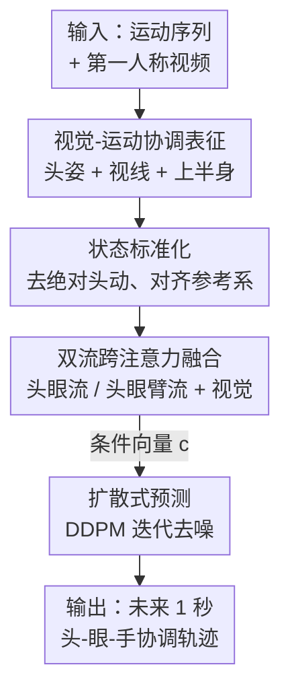

# Learning Predictive Visuomotor Coordination

**会议**: CVPR 2026  
**arXiv**: [2503.23300](https://arxiv.org/abs/2503.23300)  
**代码**: https://vjwq.github.io/VCR/ (项目页)  
**领域**: 机器人 / 具身智能 / 第一人称视觉  
**关键词**: 视觉-运动协调、第一人称视频、运动预测、扩散模型、头-眼-手协同

## 一句话总结
本文把"头部姿态 + 视线 + 上半身关节"统一成一个**视觉-运动协调表征（VCR）**，用一个条件扩散模型从第一人称视频和运动历史预测未来 1 秒的协调运动，在 EgoExo4D 上做到平移误差 59 mm、头部旋转误差 13.2°，比 Diffusion Policy 等强基线全面更优。

## 研究背景与动机
**领域现状**：第一人称视觉里预测"佩戴者下一步要做什么"是 AR 眼镜助手、机器人模仿学习的核心能力，前人已经能从 egocentric 视频分别预测 ego-motion、视线（gaze）或手部轨迹。

**现有痛点**：这些工作几乎都只盯着**单一模态**——只预测视线、或只预测手部，把头、眼、手当作互相独立的信号处理。但人类的运动从来不是孤立的：神经科学发现人在做日常任务（如做三明治）时会依赖前几次注视存下的视觉记忆来规划接下来几秒的动作，头会先转、眼会先看、手才跟着伸过去，这是一套**有预测性的协调控制系统**。割裂建模就丢掉了这套耦合关系。

**核心矛盾**：要预测自然的人体动作，必须同时建模头-眼-手之间的时空依赖；但现有数据集长期缺少同步的 3D 头姿、视线、全身关节标注，导致这个"协调"问题无法被定量评测。

**本文目标**：(1) 把视觉-运动协调形式化成一个**可量化评测的预测任务**；(2) 设计一个能联合建模头、眼、上半身的生成框架。

**切入角度**：作者借助新出现的 EgoExo4D / Nymeria 数据集（含 3D 视线、头姿、身体关节标注），第一次有条件把"协调"当成一个整体来学。

**核心 idea**：用一个统一的视觉-运动协调表征把三类信号绑在一起，再用扩散模型在第一人称视觉条件下联合预测它们的未来轨迹——**协调当作整体学，而不是拼三个独立预测器**。

## 方法详解

### 整体框架
输入是过去一段时间（约 1 秒、10 fps）的视觉-运动状态序列 $S_{t-\tau:t}$ 和对应的第一人称 RGB 视频片段 $E_{t-\tau:t}$（4 fps），输出是未来 $\Delta$ 步的视觉-运动状态 $\hat{S}_{t+1:t+\Delta}$。整条管线分四步：先把头、眼、上半身定义成统一的 VCR 状态；再做"标准化"去掉绝对头部运动只留相对协调；然后把运动特征和视觉特征做双流跨注意力融合得到条件向量 $\mathbf{c}$；最后用一个以 $\mathbf{c}$ 为条件的 DDPM 迭代去噪生成未来轨迹。

### 关键设计

**1. 视觉-运动协调表征（VCR）：把头、眼、手绑成一个状态**

针对"前人只建模单一模态、丢掉头-眼-手耦合"的痛点，作者定义一个联合状态 $S=\{H,G,U\}$。其中头姿 $H=(\mathbf{p}_{head},\mathbf{R}_{head})$ 含位置 $\mathbf{p}_{head}\in\mathbb{R}^3$ 和朝向 $\mathbf{R}_{head}\in SO(3)$，给运动提供空间参考系；视线用端点表示 $\mathbf{g}=\mathbf{p}_{head}+\lambda\mathbf{d}_{gaze}$（$\mathbf{d}_{gaze}$ 是从头姿导出的单位视线方向、$\lambda$ 控制射线长度），代表视觉注意与意图；上半身 $U=\{\mathbf{j}_i\in\mathbb{R}^3\mid i=1,\dots,6\}$ 是肩、肘、腕六个关节，承载交互动作。作者刻意**只取上半身而不要下半身**——因为下半身运动更多被地形/外部约束决定，与内在视觉-运动协调关系弱，纳入反而引入噪声。这样这三类信号被放进同一个状态向量里联合预测，模型才能学到它们之间的协调，而不是各算各的

**2. 视觉-运动状态标准化：剥掉绝对头动，只留相对协调**

第一人称数据里头一直在动、视角一直在变，绝对坐标下同样的"伸手"动作会因为视角不同而长得完全不一样，模型很难学到稳定模式。作者以**最后一个观测帧的头姿为基准**做标准化：用变换 $\Phi$ 把该帧头姿对齐到单位旋转 $\mathbf{I}$、平移到原点 $\mathbf{0}$，得到 $H^c_t=\Phi(H_t)$；同一个 $\Phi$ 同步作用到视线端点和上半身关节（$\mathbf{g}^c_t=\Phi(\mathbf{g}_t)$、$U^c_t=\Phi(U_t)$），保证单帧内部空间关系不变。对时间维上的其它帧，先把它相对 $S_t$ 变换再映射到标准系：$S^c_i=T_{i\to t}(S_i)\circ S^c_t$，让所有帧在统一参考系下对齐。这一步把"绝对头部运动"这个混淆因素消掉，只保留头-眼-手之间的相对协调，从而对视角变化更鲁棒、泛化更好

**3. 双流跨注意力融合：让视觉有选择地注入运动特征**

第一人称画面总能反映头和视线朝向，但因为遮挡和视野受限，它对**全身协调**的相关性是不确定的——直接把视觉强行融进所有运动特征会引入噪声。作者因此构造**两条运动表征**：一条只含头+眼 $\mathbf{k}^{hg}_t=\text{Concat}(\mathbf{k}^{head}_t,\mathbf{k}^{gaze}_t)$，捕捉视角和注意力动态；另一条再加上臂部 $\mathbf{k}^{hga}_t=\text{Concat}(\mathbf{k}^{head}_t,\mathbf{k}^{gaze}_t,\mathbf{k}^{arm}_t)$，含上半身运动线索。视觉嵌入 $\mathbf{v}\in\mathbb{R}^{128}$ 由 3D ResNet 从视频提取，再分别对两条流做跨注意力 $\mathbf{k}^{\prime hg}_t=\mathcal{A}(\mathbf{k}^{hg}_t,\mathbf{v},\mathbf{v})$、$\mathbf{k}^{\prime hga}_t=\mathcal{A}(f_{proj}(\mathbf{k}^{hga}_t),\mathbf{v},\mathbf{v})$，最后相加 $\mathbf{k}^{fused}_t=\mathbf{k}^{\prime hg}_t+\mathbf{k}^{\prime hga}_t$ 送进 Transformer 时序编码器 $\mathcal{T}$，展平成条件向量 $\mathbf{c}$。这种"头眼流稳、头眼臂流广"的分流设计，让模型在视觉可靠时充分用、在视觉模糊时仍能靠运动学撑住，避免单一融合被遮挡带偏

**4. 扩散式视觉-运动预测：把预测当成条件去噪**

作者沿用 Diffusion Policy 的思路把预测建成 DDPM 去噪过程。前向过程对未来真值状态逐步加高斯噪声 $q(S_t|S_0)=\mathcal{N}(S_t;\sqrt{\bar\alpha_t}S_0,(1-\bar\alpha_t)\mathbf{I})$；反向过程以条件向量 $\mathbf{c}$ 为指引迭代去噪 $p_\theta(S_{t-1}|S_t,\mathbf{c})=\mathcal{N}(S_{t-1};\mu_\theta(S_t,t,\mathbf{c}),\sigma_\theta^2\mathbf{I})$，且 $\mathbf{c}$ 在整个去噪过程中保持不变。相比直接回归一个确定轨迹，扩散框架天然能建模动作的**多模态不确定性**（同一情境下未来可能有多种合理走法），生成的轨迹更平滑、时序更连贯

### 损失函数 / 训练策略
训练用标准 DDPM 去噪损失 $\mathcal{L}=\mathbb{E}_{S_0,t,\epsilon}[\|\epsilon-\epsilon_\theta(S_t,t,\mathbf{c})\|^2]$，即预测加进去的噪声。视觉编码器用 Kinetics-400 预训练，Transformer 模块和扩散模型从零训练。PyTorch 实现，AdamW、学习率 $5\times10^{-4}$、训练 400 epoch、batch size 384，单张 H100 约 8 小时训完。

## 实验关键数据

数据集为 **EgoExo4D**，选取 Basketball / Cooking / Bike Fixing / Health 四类需要手眼协调的活动，共 23,372 训练样本、5,126 测试样本（约 15.8 小时）。评测指标含 PA-MPJPE（结构一致性，对齐刚体变换后的关节误差，mm）、Head/Gaze/Hand 位置误差（mm）、Head Rotation Error（HRE，度），**均为越低越好**，预测范围约 1 秒。

### 主实验
| 方法 | PA-MPJPE↓ | 头部位置↓ | 视线位置↓ | 手部位置↓ | 头部旋转↓ |
|------|-----------|-----------|-----------|-----------|-----------|
| Constant Pose（复制末帧） | 68.3 | 184 | 193 | 274 | 16.7 |
| Constant Velocity（线性外推） | 109 | 161 | 201 | 436 | 18.5 |
| Transformer Encoder + MLP | 65.3 | 119 | 135 | 211 | 13.8 |
| Diffusion Policy-CNN | 64.1 | 112 | 132 | 208 | 13.9 |
| **本文 (Ours)** | **59** | **106** | **124** | **188** | **13.2** |

相对 Diffusion Policy-CNN，PA-MPJPE 改善 8.6%、头/视线误差分别降 5.7%/6.5%、头部旋转降 4.5%；相对 Transformer 基线 PA-MPJPE 改善 10.7%。**手部位置**是最难子任务，本文在这一项提升最大（274/208→188），说明统一表征确实抓住了头-眼-手协调。

### 消融实验
| 配置 | 头部位置 | 视线位置 | 手部位置 | 头部旋转 | 说明 |
|------|---------|---------|---------|---------|------|
| Complete Visuomotor（完整） | 106 | 124 | 188 | 13.2 | 全输入 |
| w/o Head Rotation（输入也去） | 111 (+4.7%) | 130 | 195 | — | 去头部旋转 |
| w/o Head Rot. & Gaze（输入也去） | 112 (+5.7%) | — | 196 | — | 再去视线 |
| w/o Head（输入也去） | — | 132 (+6.5%) | 194 | — | 去全部头部信息 |
| w/o Gaze（输入也去） | 111 | — | 194 | 13.9 (+4.5%) | 去视线 |
| w Last Step Arm | 113 (+6.6%) | 141 (+5.2%) | 199 (+5.9%) | 13.7 | 只用末帧臂姿 |
| w/o Egocentric Frame | 111 (+4.7%) | 130 | 193 | 14.1 (+6.0%) | 去第一人称视觉 |

### 关键发现
- **头和视线信号是协调的关键**：去掉头部旋转、再去视线，头/视线/手误差逐级上升（手部 188→196），说明头姿确实影响整体协调；去掉视线还会让头部旋转误差从 13.4 升到 13.9，证明视线在稳定头部朝向上有作用。
- **时序历史对手部预测最重要**：只保留末帧臂姿（丢掉运动历史）时手部误差涨 5.9%，单帧缺少时序上下文撑不起上半身预测。
- **第一人称视觉主要稳头眼**：去掉视觉后头部位置误差 +4.7%、头部旋转 +6.0%；但视线误差反而略降，说明缺视觉时模型转而更依赖运动学来估视线。结论是"运动历史帮手、视觉帮头眼"两类模态互补。
- **失败案例**：篮球突然弹起这种只在最后一帧才看得到的快速意外运动，模型会按"常规接球"预测、错过突变轨迹——快速运动 + 遮挡是主要短板。

## 亮点与洞察
- **把神经科学的"协调"做成可量化任务**：以往头/眼/手各做各的，本文用一个 VCR 状态把它们绑起来联合预测，并配上 PA-MPJPE/HRE 等指标，让"协调好不好"第一次能定量比较——这是设定本身的贡献。
- **标准化是低成本高回报的 trick**：以末帧头姿为基准对齐整段序列，剥掉绝对头动这个混淆因素，几乎零参数却显著提升对视角变化的鲁棒性，可直接迁移到任何第一人称运动建模。
- **双流融合体现"视觉不总可靠"的工程直觉**：把头眼流和头眼臂流分开做跨注意力再相加，等于给视觉一个"按需注入"的开关，对遮挡/视野受限的第一人称场景特别实用。
- **手部提升最大很有说服力**：手部是最难、也最依赖头眼引导的部位，本文恰恰在这里赢最多，反向印证了"协调建模"而非"堆模态"才是收益来源。

## 局限与展望
- 作者承认在**快速、意外、强遮挡**场景下会失败（如突然弹起的篮球），细微线索不足以支撑精确协调；未来可引入显式接触建模或环境感知推理。
- 只建模上半身、刻意排除下半身，虽避开地形先验但也限制了在行走/全身任务上的适用性。
- 预测范围仅约 1 秒、且只在 EgoExo4D 选定的四类活动上评测，更长时程、更开放场景的泛化未验证。
- 与同期工作 EgoCast、EgoAgent 因任务定义/输入模态不同且无公开实现而未能直接对比，强基线主要是 Diffusion Policy 和 Transformer，横向比较的覆盖面有限。

## 相关工作与启发
- **vs 单模态预测（gaze forecasting / hand trajectory forecasting）**：前人各预测一种信号、忽略头-眼-手耦合；本文用统一 VCR 联合建模，证明协调比孤立预测更准，尤其是最难的手部。
- **vs 全身运动预测**：传统全身预测含下半身，但下半身受地形约束、与内在协调弱相关；本文只取上半身，避开环境先验、聚焦真正由视觉-运动协调驱动的部位。
- **vs Diffusion Policy / 模仿学习**：模仿学习常让示范者"像机器人一样"压制自然头身运动以简化策略学习，丢掉了自然行为的丰富性；本文反过来对自然人体协调建预测模型，可作为未来从人类视频做机器人模仿学习的数据驱动基础。

## 评分
- 新颖性: ⭐⭐⭐⭐ 首个把头-眼-手协调统一成可量化预测任务并用扩散模型联合建模，任务设定本身有原创性。
- 实验充分度: ⭐⭐⭐⭐ 主实验 + 两类消融充分验证各模态贡献，但范围仅 1 秒、四类活动，缺与同期方法直接对比。
- 写作质量: ⭐⭐⭐⭐ 动机有神经科学支撑、方法分层清晰；部分公式表述偏密、个别表格数字（如正文称 Constant Velocity PA-MPJPE 264 与表中 109 不一致 ⚠️ 以原文为准）。
- 价值: ⭐⭐⭐⭐ 对 AR 助手、机器人从人类视频学习有直接价值，标准化与双流融合两个 trick 可复用。

<!-- RELATED:START -->

## 相关论文

- [\[ICML 2026\] STEP: Warm-Started Visuomotor Policies with Spatiotemporal Consistency Prediction](../../ICML2026/robotics/step_warm-started_visuomotor_policies_with_spatiotemporal_consistency_prediction.md)
- [\[CVPR 2026\] GeoPredict: Leveraging Predictive Kinematics and 3D Gaussian Geometry for Precise VLA Manipulation](geopredict_leveraging_predictive_kinematics_and_3d_gaussian_geometry_for_precise.md)
- [\[CVPR 2026\] Predict Before You Explore: Predictive Planning with Specialized Memory for Embodied Question Answering](predict_before_you_explore_predictive_planning_with_specialized_memory_for_embod.md)
- [\[ICML 2026\] R2R2: Robust Representation for Intensive Experience Reuse via Redundancy Reduction in Self-Predictive Learning](../../ICML2026/robotics/r2r2_robust_representation_for_intensive_experience_reuse_via_redundancy_reducti.md)
- [\[NeurIPS 2025\] Inner Speech as Behavior Guides: Steerable Imitation of Diverse Behaviors for Human-AI Coordination](../../NeurIPS2025/robotics/inner_speech_as_behavior_guides_steerable_imitation_of_diverse_behaviors_for_hum.md)

<!-- RELATED:END -->
