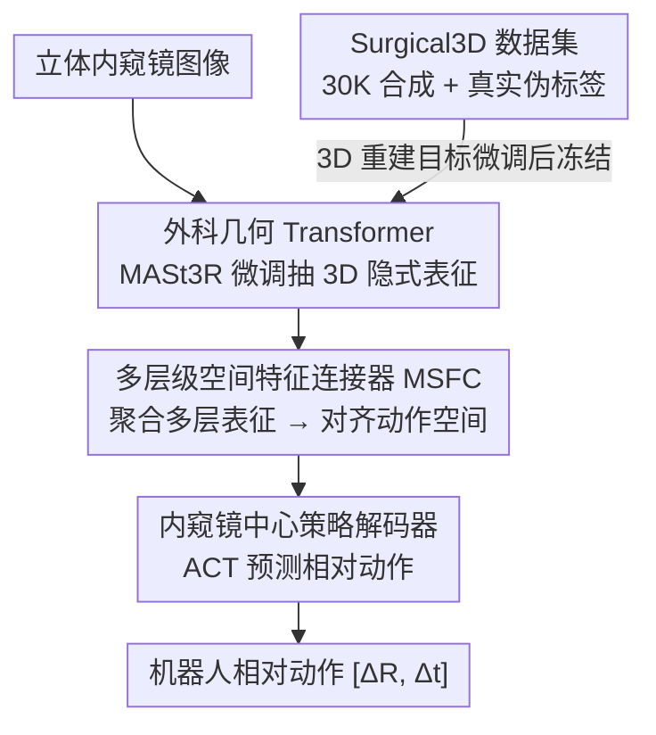

# Learning Surgical Robotic Manipulation with 3D Spatial Priors

**会议**: CVPR 2026  
**论文**: [CVF Open Access](https://openaccess.thecvf.com/content/CVPR2026/html/Sheng_Learning_Surgical_Robotic_Manipulation_with_3D_Spatial_Priors_CVPR_2026_paper.html)  
**代码**: 待开源（作者声明 dataset 与 code 将公开）  
**领域**: 机器人 / 具身智能  
**关键词**: 手术机器人、视觉运动策略、模仿学习、3D 几何先验、立体内窥镜

## 一句话总结
把一个前馈式 3D 几何重建模型（MASt3R）在自建的合成手术数据集上微调，端到端地从立体内窥镜图像里抽出 3D 隐式表征，再用轻量连接器把它对齐到机器人动作空间，让真实手术机器人在打结、离体胆囊解剖等精细任务上不靠腕部相机就能拿到 SOTA 成功率。

## 研究背景与动机
**领域现状**：自主手术机器人（如 da Vinci）要在毫米级精度下操作针、组织等细小结构，关键瓶颈是让视觉运动策略具备 3D 空间感知。现有做法分两派：一派先用优化类方法（SfM / NeRF / 3DGS）显式重建手术场景，再在重建结果上学操作技能；另一派（SRT 系列）在病人侧机械臂（PSM）上加装腕部相机，给默认的立体内窥镜补充多视角信息，端到端训练策略。

**现有痛点**：显式重建是多阶段流水线，重建误差会逐级累积，且无法端到端联合优化；腕部相机方案在临床里几乎不可行——trocar（套管）对 PSM 的插入路径有严格空间约束，带额外相机的器械根本穿不过去，而且腕部相机会被血、水损坏、还会遮挡内窥镜视野。

**核心矛盾**：手术场景既缺 3D 监督，又不能像通用桌面机器人那样随便加传感器；而前馈几何模型（DUSt3R/MASt3R/VGGT）虽能快速产出富含几何信息的隐式表征，却几乎没在手术图像上训练过，存在巨大域差；同时把大容量预训练编码器硬塞进策略网络，常因表征与任务目标不对齐反而掉点。

**本文目标**：(1) 补上手术域 3D 标注数据的空白；(2) 让前馈几何先验真正服务于精细手术操作策略，且端到端可训、不依赖额外硬件。

**切入角度**：与其显式重建出点云再用，不如直接利用前馈几何模型中间层的 3D 隐式表征当作空间先验——既绕开了逐场景优化的低效，又避开了腕部相机的硬件限制。

**核心 idea**：用「在手术域微调过的几何 Transformer 抽 3D 隐式表征 + 轻量多层级连接器对齐动作空间 + 内窥镜中心动作系」三件套，把 3D 空间先验端到端注入视觉运动策略。

## 方法详解

### 整体框架
方法叫 Spatial Surgical Transformer（SST），整条管线分两步走：**先在自建的 Surgical3D 合成数据集上以 3D 重建为目标微调几何 Transformer，再冻结它、把它输出的多层 3D 隐式表征喂给策略网络学操作**。具体地，立体内窥镜图像进入几何 Transformer 得到 3D 隐式表征；多层级空间特征连接器（MSFC）把来自不同层的表征聚合并对齐到动作特征空间；内窥镜中心策略解码器在内窥镜坐标系下预测机器人的相对动作 $[\Delta R, \Delta t]$。因为是「数据集 → 几何模型微调 → 表征连接 → 策略解码」的多阶段串行 pipeline，下面给一张框架图。

### 关键设计

**1. Surgical3D 数据集：用合成 + 真实伪标签的混合数据补上手术域 3D 标注空白**

手术环境极度狭窄（器官到相机常 < 10cm），超出多数 3D 传感器量程，导致带 3D 标注的手术数据极其稀缺，前馈几何模型直接迁移过来效果很差。作者用 NVIDIA Omniverse 合成 Surgical3D：整合 8 类开源人体器官模型 + 手术器械资产，外加 10 个用 iPad 扫描真实器官得到的高真实感网格，配合域随机化（变化立体基线、内外参、光照、组织纹理），生成 30K 张 1920×1080 立体图像对及对应深度图/点云/外参。但纯合成与真实仍有域差（器官形态、腹腔内光照不同），于是再做一轮混合：先在合成数据上微调 VGGT 的点预测头，用它给真实手术录像推断深度伪标签，只保留高置信度区域。这个「合成打底 + 真实伪标签补真实感」的组合显著提升了几何 Transformer 在真实场景下的鲁棒性，是后续一切的空间基础。

**2. 外科几何 Transformer：选轻量的 MASt3R 而非重型 VGGT，换实时性与稳定性**

手术图像有两个独特难点：器官表面常无纹理或高度重复，传统特征匹配不可靠；双目基线极窄，几何法对微小像素错位会累积显著深度误差。作者选 MASt3R 当原型——它是前馈式、不依赖相机参数和特征匹配、能从图像对直接推稠密 3D 点，还能继承互联网级预训练。相比之下 VGGT 虽能抓更细几何，但架构重、实时部署会引入运动抖动。微调阶段，decoder token 经 DPT 头回归内窥镜坐标系下的稠密点图，回归损失对预测与 GT 点图做尺度归一化以消除尺度歧义：$L_{reg}(v,i)=\sum_{v}\sum_{i\in D^v}\|\tfrac{1}{z}X^{v,1}_i-\tfrac{1}{\hat z}\hat x^{v,1}_i\|$（$z,\hat z$ 为尺度因子）。针对无纹理区域，引入逐像素置信度 $C^{v,1}_i$ 做置信度加权：$L_{conf}=\sum_v\sum_{i\in D^v}C^{v,1}_i L_{reg}(v,i)-\alpha\log C^{v,1}$，让模型在难重建区域学会「示弱」而非硬猜。

**3. 多层级空间特征连接器 MSFC：用低/高层表征互补，绕开显式点云的误差**

直接把显式 3D 点图喂进策略会被重建误差和尺度歧义带偏；而单纯换一个更强的预训练编码器又常常没收益甚至掉点。MSFC 的思路是：几何 Transformer 不同层捕捉不同抽象层级——低层编码细粒度局部细节，高层编码全局上下文，而精细手术既要精确定位物体、又要把握整体运动方向，两者缺一不可。具体取几何 Transformer 四个 decoder 层（正是微调时喂给 DPT 头、几何信息最丰富的那几层）的隐式表征，先各自投到低维压缩，再沿特征维拼接、用一个轻量 MLP 对齐到动作空间，对齐后的表征与位置嵌入做 cross-attention 生成动作。轻量聚合 + 多层级互补，让策略能在很少的示范下稳定学习。

**4. 内窥镜中心策略解码器：把感知与动作统一到同一坐标系，并用相对位姿避开不准的正运动学**

由于 3D 隐式表征本身定义在内窥镜坐标系，作者干脆把动作空间也搬到该坐标系，保证感知与执行始终在统一表示下。手术机器人与通用机器人最大差异是缺准确的正运动学——PSM 的 Set-Up Joints 仅靠电位器测角、本就不准，所以无法像通用机器人那样学绝对关节/末端位姿。解决办法是用相对位姿表示：记末端位姿 $E_i=(R_i,tr_i)\in SE(3)$，取相邻帧差分 $a_t=\{(tr^i_{t+1}-tr^i_t,\,(R^i_t)^T R^i_{t+1})\}$，旋转差分进一步表达为欧拉角（实验中比旋转矩阵更易学），夹爪用与运动学无关的绝对张角，每臂得到 7 维动作（平移 3 + 旋转 3 + 夹爪 1）。解码器采用 ACT 框架一次预测未来 $k$ 个动作，再用指数加权 $w_i=\exp(-m\cdot i)$ 平均，抑制手术里最忌讳的轨迹抖动。

### 损失函数 / 训练策略
两阶段：① 几何 Transformer 微调用上面的置信度加权重建损失 $L_{conf}$；② 策略学习冻结几何 Transformer，端到端最小化预测动作与 GT 的 MSE：$L_{MSE}=\text{MSE}(\hat a_t,\pi_\theta(o_t,x_t))$。几何 Transformer 用 ViT-Large（patch=16，MASt3R 预训练初始化），策略解码器 12 层、hidden 768，动作 chunk=100，加权系数 $m=0.1$，训练 100 epoch。

## 实验关键数据

> 无公开手术操作 benchmark，作者把 SST 部署到真实 Torin 手术机器人，在三个真实任务上各跑 10 次独立试验：peg pickup（取栓）、knot tying（打结）、ex-vivo gallbladder dissection（离体胆囊解剖）。

### 主实验

| 任务/子任务 | 设置 | SRT（带腕相机） | ACT | DP | SST（本文，无腕相机） |
|------|------|------|------|------|------|
| Peg Pickup Test1 | — | 10/10 | 9/10 | 10/10 | 10/10 |
| Peg Pickup Test2（更大范围+深度变化） | — | 6/10 | 2/10 | 1/10 | **8/10** |
| Knot Tying Grasp | — | 10/10 | 4/10 | 5/10 | **10/10** |
| Knot Tying Loop | — | 3/10 | 0/10 | 1/10 | **7/10** |
| Knot Tying 整体 | — | 2/10 | 0/10 | 1/10 | **7/10** |
| Gallbladder 整体 | — | —（被排除） | 0/10 | 0/10 | **6/10** |

SST 在**不用腕部相机**这个更贴近临床的设置下，仍在难任务上全面领先：ACT/DP 只在最简单的 peg pickup 勉强能用，复杂任务几乎全军覆没；SRT 靠腕相机在 peg pickup 表现好，但打结的 loop 子任务（3/10）反被 SST（7/10）拉开。胆囊解剖因怕液体损坏腕相机，SRT 直接被排除。

### 消融实验

| 消融维度 | 配置 | 关键指标 | 说明 |
|------|------|---------|------|
| 是否在 Surgical3D 微调 | w/o ToS | Peg test1/test2: 2/10、0/10；重建 Acc/Comp: 0.0111/0.0140 | 不微调只能粗定位、抓取有明显空间偏移，打结学不出有意义行为 |
| 是否在 Surgical3D 微调 | w/ ToS（本文） | Peg test1/test2: 10/10、8/10；重建 Acc/Comp: 0.0048/0.0064 | 微调后重建精度/完整度近乎减半，成功率大幅提升 |
| 连接器设计 | LFC（仅末层） | Peg 10/10、0/10；Knot 全 0 | 末层 token 空间线索有限，最差 |
| 连接器设计 | MSC（多层分离 cross-attn） | Peg 10/10、3/10；Knot 全 0 | 复杂注意力需大数据，少示范下欠拟合 |
| 连接器设计 | MSFC（本文） | Peg 10/10、8/10；Knot Grasp/Loop 10/10、7/10 | 多层级紧凑融合最优 |

> 表中 Acc.↓/Comp.↓ 为重建精度与完整度误差（越低越好）；ToS = trained on Surgical3D。⚠️ 具体度量定义以原文为准。

### 关键发现
- **Surgical3D 微调是命门**：不微调时打结直接学成「漫无目的乱动」，说明几何先验质量直接决定策略能否学到东西，而非锦上添花。
- **几何模型要选轻的**：MASt3R 推理 56.2ms，VGGT 高达 140.4ms（约 2.5× 慢）；作者实测推理率低于 10Hz 会引入明显运动抖动，故 VGGT 不适合实时手术部署——精度不是唯一标准，实时性同样是硬约束。
- **多层级 > 单层 / 多层分离**：低层细节 + 高层上下文的紧凑融合，在少示范下比只用末层或复杂的多层分离 cross-attn 都稳。
- **空间泛化强**：peg pickup 故意用不规则硅胶肝模型，Test2 区域有大幅深度变化，ACT 会照着训练时的绿圈位置硬抓，SST 能贴着实际栓子位置自适应抓取，甚至抓到区域边缘。

## 亮点与洞察
- **「用中间层隐式表征而非显式点云」这一步很巧**：既继承前馈几何模型的互联网级先验，又躲开显式重建的误差累积和逐场景优化，是把 3D 基础模型「软落地」到精细控制的范例。
- **把临床约束写进方法动机**：腕部相机穿不过 trocar、会被血水损坏、会遮挡视野——这些不是泛泛的「更实用」，而是直接决定了「只用内窥镜」的设计取向，动机非常具体。
- **坐标系一致性**：感知（内窥镜系）与动作（内窥镜中心相对位姿）统一到同一框架，是让 3D 先验真正可用的关键工程细节，可迁移到任何「相机系与机器人基座系难标定」的场景。
- **相对位姿 + 欧拉角 + ACT 加权平均** 这套组合拳专治手术机器人正运动学不准 + 轨迹抖动，思路可复用到其他低成本/低精度本体的机器人。

## 局限与展望
- 评测全在真实机器人上、每任务仅 10 trials，样本量偏小，统计置信度有限；且无公开 benchmark 可横向复现。
- 解剖子任务成功率相对偏低（6/10），作者归因于胆囊-肝交界边缘定位难（人类操作者也难），说明对精细边界感知仍有上限。
- 几何 Transformer 训练后冻结，策略无法反过来微调几何表征，可能限制任务自适应；纯合成 + 伪标签的真实感对更复杂活体场景的覆盖度待验证。
- 仅评测三个任务，离真正多样的临床流程还有距离；动作仅相对位姿，长程任务的误差漂移未充分讨论。

## 相关工作与启发
- **vs SRT 系列（腕部相机端到端）**: SRT 靠在 PSM 加腕相机补多视角，但临床不可行且会被液体损坏；SST 只用默认内窥镜、靠 3D 隐式先验，在打结 loop 和胆囊解剖上反超，证明「稳的 3D 几何」比「多一路从零学的视图」更有效。
- **vs 显式重建 + 操作（SfM/NeRF/3DGS 类）**: 它们多阶段、误差累积、逐场景优化无法实时；SST 端到端、用前馈隐式表征，实时性与可训性都更好。
- **vs ACT / Diffusion Policy（通用桌面策略）**: 直接把它们搬到内窥镜单视角输入会因缺几何先验而在复杂任务崩溃；SST 表明手术域必须显式注入 3D 先验。
- **vs 直接换强编码器**: 单纯把策略的图像编码器替换成更强预训练模型常掉点（表征与任务不对齐），MSFC 的多层级对齐才是把基础模型表征「用对」的关键。

## 评分
- 新颖性: ⭐⭐⭐⭐ 把前馈几何模型的隐式表征端到端注入手术策略，切入点扎实但模块多为已有组件的巧妙组合
- 实验充分度: ⭐⭐⭐ 真实机器人三任务有说服力，但每任务仅 10 trials、无公开 benchmark，统计置信度受限
- 写作质量: ⭐⭐⭐⭐ 动机紧扣临床约束、pipeline 清晰、消融到位
- 价值: ⭐⭐⭐⭐ 同时给出手术域 3D 数据集与可临床落地的策略，对自主手术方向推动明显

<!-- RELATED:START -->

## 相关论文

- [\[CVPR 2026\] DiffuView: Multi-View Diffusion Pretraining for 3D-Aware Robotic Manipulation](diffuview_multi-view_diffusion_pretraining_for_3d_aware_robotic_manipulation.md)
- [\[CVPR 2026\] PointWorld: Scaling 3D World Models for In-The-Wild Robotic Manipulation](pointworld_scaling_3d_world_models_for_in-the-wild_robotic_manipulation.md)
- [\[CVPR 2026\] ActiveVLA: Injecting Active Perception into Vision-Language-Action Models for Precise 3D Robotic Manipulation](activevla_injecting_active_perception_into_vision-language-action_models_for_pre.md)
- [\[ICLR 2026\] From Spatial to Actions: Grounding Vision-Language-Action Model in Spatial Foundation Priors](../../ICLR2026/robotics/from_spatial_to_actions_grounding_vision-language-action_model_in_spatial_founda.md)
- [\[CVPR 2026\] Structural Action Transformer for 3D Dexterous Manipulation](structural_action_transformer_for_3d_dexterous_manipulation.md)

<!-- RELATED:END -->
