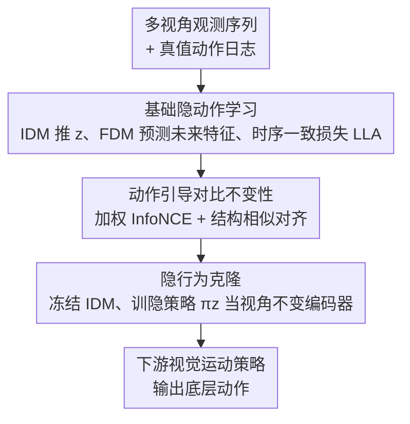

# Learning to Act Robustly with View-Invariant Latent Actions

**会议**: CVPR 2026  
**论文**: [CVF Open Access](https://openaccess.thecvf.com/content/CVPR2026/html/Jeong_Learning_to_Act_Robustly_with_View-Invariant_Latent_Actions_CVPR_2026_paper.html)  
**代码**: 待确认  
**领域**: 机器人/具身智能  
**关键词**: 视角不变, 隐动作, 视觉运动策略, 对比学习, 机器人预训练

## 一句话总结
VILA 提出：视角不变性不该强加在「整张场景的视觉表征」上，而该只加在「与动作相关的动态变化」上——用 IDM/FDM 学一个编码相邻帧变化的紧凑隐动作，再用真值动作序列做动作引导的加权对比+结构对齐，把不同视角下同一段运动的隐动作拉齐，最后把这个隐策略当视角不变编码器去 condition 下游策略，在仿真与真机上对未见视角和新任务都显著更鲁棒。

## 研究背景与动机
**领域现状**：基于视觉的机器人策略对相机视角变化极其脆弱，哪怕轻微视角偏移都会让成功率崩盘。主流解法分两类：一类在「观测层」动手，用新视图合成（NVS）或几何输入扩充视角、或显式把相机内外参喂给策略；另一类在「表征层」动手，预训练一个对相机运动稳定的视觉编码器。

**现有痛点**：两类方法的共同目标都是「在图像层强制鲁棒」——让一个紧凑特征向量去概括整张图（静态布局、背景全都要管），同时还要扛起所有任务相关运动信息。这等于要求对一个「远比控制所需更宽」的表征做不变性，既不必要地苛刻，又没区分「静态上下文」和「真正驱动动作的动态」。

**核心矛盾**：场景级表征把「任务相关的运动」和「静态外观/背景」搅在一起；对这个混合体强制视角不变，模型容量被浪费在「场景从某视角看起来怎样」上，而不是「智能体和物体怎么动」。而控制真正需要的恰恰是后者。

**本文目标**：把不变性的施加对象从「静态场景级视觉表征」换成「与动作相关的动态变化」，并解决两个子问题：(1) 如何学一个只编码「相邻观测之间变化」的紧凑动态表征？(2) 在多视角机器人数据（动作日志通常可得）下，如何用动作信息把不同视角的同一段运动对齐成视角不变？

**切入角度**：作者的关键洞察是——「变化」的表征天然比「外观」紧凑，主要刻画智能体与物体怎么动而非整场景长啥样，因此是施加视角不变性的更自然、更省力的载体。隐动作（latent action）正是这种「解释相邻观测之间变化的紧凑码」。

**核心 idea**：在隐动作空间（而非场景级表征）上强制视角不变——用真值动作序列当跨视角对齐的监督信号，让同一段运动在不同相机下的隐动作彼此靠近。

## 方法详解

### 整体框架
VILA 分两阶段。**阶段一（隐动作学习）**：在 LAOM 式基础隐动作学习上，叠加「动作引导的对比不变性」目标，学出一个紧凑、视角不变、扎根于物理动态的隐动作表征。**阶段二（隐行为克隆）**：冻结阶段一的逆动力学模型 IDM，训一个隐策略 $\pi_z$——它只看当前观测就预测隐动作，从而本身充当一个视角不变的视觉编码器，去 condition 下游视觉运动策略（如 Diffusion Policy）输出底层动作。测试时不需要未来帧。

### 关键设计

**1. 基础隐动作学习：用 IDM/FDM 学一个只编码「帧间变化」的紧凑码**

针对「场景级表征把外观和运动搅在一起」，这一步先建一个不含视角不变性、纯刻画动态的底座（沿用 LAOM）。记 $o_t^v$ 为时刻 $t$、视角 $v$ 的观测，视觉编码器 $E$ 给出特征 $s_t^v = E(o_t^v)$；采时间偏移 $k \in \{1,\dots,K\}$ 得 $s_{t+k}^v$。逆动力学模型推隐动作 $z_t^v = \mathrm{IDM}(s_t^v, s_{t+k}^v)$，前向动力学模型预测未来特征 $\hat{s}_{t+k}^v = \mathrm{FDM}(s_t^v, z_t^v)$。时序一致损失为 $L_{\text{LA}} = \mathbb{E}\big[\lVert \mathrm{FDM}(s_t^v, z_t^v) - s_{t+k}^{\text{tgt},v} \rVert_2^2\big]$，其中目标特征 $s_{t+k}^{\text{tgt},v}$ 来自一个不回传梯度、参数为在线编码器 EMA 的目标编码器 $E^{\text{tgt}}$。这迫使 $(E,\mathrm{IDM},\mathrm{FDM})$ 发现一个能解释 $o_t \to o_{t+k}$ 变化、又不必重建像素的紧凑隐动作 $z$——因为定义在「变化」上，它天然偏重运动而非静态外观，为后续加视角不变性提供了一个比场景级表征更合适的载体。

**2. 动作引导的对比不变性：用真值动作序列把跨视角同一运动拉齐**

这是论文核心创新，针对「如何让隐动作跨视角对齐」。直觉是：若两段转移对应的未来真值动作序列相似，它们的隐动作就该靠近。构 batch 时先采偏移 $k$、再采 $N$ 个基准时刻，每个时刻采 $V$ 个随机视角，得 $B = NV$ 个隐动作样本，每个样本带其真值动作序列 $A_i^{\text{GT}} \in \mathbb{R}^{k\times D}$。先定义归一化平方距离 $d_{ij} = \lVert A_i^{\text{GT}} - A_j^{\text{GT}} \rVert_F^2 / (kD)$，再转成软权重 $w_{ij} = \exp(-d_{ij}/\beta) / \sum_\ell \exp(-d_{i\ell}/\beta)$（$\beta$ 控分布锐度，动作越像权重越大）。**局部结构**用加权 InfoNCE 精化：$L_{\text{W-NCE}} = -\sum_i \sum_{j\neq i} w_{ij}\log\frac{\exp(\mathrm{sim}(z_i,z_j)/\tau)}{\sum_\ell \exp(\mathrm{sim}(z_i,z_\ell)/\tau)}$，$\mathrm{sim}$ 为余弦相似度。**全局结构**再加一个结构对齐损失：把隐动作与真值动作各自 L2 归一后构余弦相似度矩阵 $S_z, S_{\text{GT}}$，用 $L_{\text{struct}} = \lVert S_{\text{GT}} - S_z \rVert_F^2$ 让隐动作空间的全局相似结构对齐到动作空间。总表征损失 $L_{\text{VILA}} = L_{\text{LA}} + \lambda_1 L_{\text{W-NCE}} + \lambda_2 L_{\text{struct}}$。与「无标注互联网视频」的隐动作预训练不同，VILA 专攻多视角机器人学习——这里动作日志现成可用，正好当跨视角对齐的天然监督。

**3. 隐行为克隆：把隐策略本身当视角不变编码器**

阶段一学出的视角不变性怎么传给下游策略？作者训一个隐策略 $\pi_z$ 直接从当前观测预测隐动作：$L_{\text{BC}} = \lVert \pi_z(s_t^v) - \mathrm{IDM}(s_t^v, s_{t+k}^v) \rVert_2^2$，其中 IDM 在阶段一后冻结。由于 $\pi_z$ 工作在预训练好的隐动作空间里，它**继承了该空间的视角不变、结构化性质**。微调时 $\pi_z$ 只看当前观测就预测隐动作（无需未来帧），这些隐动作再作为条件喂给下游策略输出底层动作。换言之，$\pi_z$ 不是普通策略而是「会把任意视角观测映到同一视角不变隐动作」的编码器——这把阶段一的不变性无缝接到了控制端。

## 实验关键数据

评测设定：仿真用 RoboSuite 五任务（Lift / Square / Stack Three / Coffee / Mug Cleanup），对每条轨迹在 azimuth $[-90°,+90°]$、elevation $[-15°,+15°]$ 上构 5×5=25 个视角，固定 10 个训练（seen）、留 15 个评测（unseen），另设 8 个外推视角。真机用 SO-ARM101 抓块放杯，用 ZeroNVS 扩视角，4 训 3 测。下游统一用 Diffusion Policy，仿真每视角 20 episode、真机每视角 10 episode。Rel.=unseen/seen 成功率之比（越高说明对未见视角越不掉点）。

### 主实验（仿真，微调设定，unseen 成功率 %）

| 任务 | VILA(本文) | Vanilla | CLASS | ReViWo | 说明 |
|------|-----------|---------|-------|--------|------|
| Lift | **94.70** | 77.00 | 65.00 | 38.00 | 五任务 unseen 全最优 |
| Square | **19.80** | 8.70 | 9.00 | 0.35 | 高精度抓放，难度大 |
| Stack Three | **53.65** | 23.70 | 10.35 | 0.00 | 多块堆叠 |
| Coffee | **12.65** | 0.35 | 0.35 | 0.00 | 基线近乎全崩 |
| Mug Cleanup | **27.85** | 9.70 | 6.35 | 0.00 | 长程多步 |

冻结编码器设定下，VILA 是唯一在多数任务上仍保持非平凡成功率的方法（其它方法在 unseen 上常塌到接近 0）。⚠️ 上表数字源自缓存 OCR 的密集表格，以原文 Table 1 为准。

### 外推视角 & 真机 & 任务迁移

| 评测 | VILA | 最强基线 | 说明 |
|------|------|---------|------|
| 外推视角 Lift（Table 2） | **93.10** | CLASS 51.30 | 8 个超出训练网格的视角 |
| 外推视角 Stack Three | **35.00** | Vanilla 6.25 | 基线大面积失败 |
| 真机 3 未见视角均值（Table 3） | **63.33** | π0.5 36.67 | 还超过 VLA 基线 π0.5 / SmolVLA(33.33)、Vanilla 仅 3.33 |
| 跨任务迁移 Stack Three→Coffee | 始终强于 Vanilla | 其它编码器常不如从头训 | 各标注预算下均提供更好先验 |

### 消融实验（Lift 任务，微调，unseen 成功率 %，Table 4）

| 配置 | Unseen | Rel. | 说明 |
|------|--------|------|------|
| VILA (full: $L_{\text{LA}}$+$L_{\text{W-NCE}}$+$L_{\text{struct}}$) | **94.70** | 95.18 | 完整目标 |
| 换结构损失为 CKA 对齐 | 92.00 | 93.40 | 距离式结构损失更优 |
| w/o 结构损失（仅 $L_{\text{LA}}$+$L_{\text{W-NCE}}$） | 91.70 | 92.63 | 掉点 |
| 无加权对比（$L_{\text{LA}}$+$L_{\text{NCE}}$） | 90.00 | 94.24 | 动作权重有用但非必需 |
| w/o 加权对比（仅 $L_{\text{LA}}$+$L_{\text{struct}}$） | 84.30 | 84.72 | 掉最多，对比项贡献最大 |

### 关键发现
- **加权对比项贡献最大：** 去掉 $L_{\text{W-NCE}}$（仅 $L_{\text{LA}}$+$L_{\text{struct}}$）unseen 从 94.70 暴跌到 84.30，是掉点最猛的消融；说明「动作引导把同运动跨视角拉齐」是视角不变性的主引擎，两个损失互补、缺一不可。
- **不变性加在动态上 ≫ 加在场景上：** 场景级不变性基线（CLASS、ReViWo）在难任务和 unseen/外推视角上常塌到接近 0，VILA 仍保持可用成功率——印证「只对动作相关变化做不变性」远比「对整张图做不变性」省力且有效。
- **隐动作先验更可迁移：** 跨任务迁移里，其它多视角预训练编码器常不如从头训的 Vanilla（场景级不变性会过拟合任务外观），而 VILA 的隐动作先验是视角泛化且动态中心的，少量目标数据下仍有用——「不是所有多视角预训练都有益」。
- **超 VLA 基线：** 真机上 VILA(63.33) 超过 π0.5(36.67)、SmolVLA(33.33)，呼应「现有 VLA 在相机变化下仍脆弱」，显式不变性目标可作改善 VLA 鲁棒性的互补路径。

## 亮点与洞察
- **「换施加对象」这一步很关键：** 不发明新损失，而是把视角不变性从「场景级视觉表征」搬到「隐动作（帧间变化）」上——一个表征对象的重定位，就把问题从「让宽表征全能」缩小到「让窄动态对齐」，既省容量又更对路。这个「先想清楚该对谁做不变性」的思路可迁到任何鲁棒表征任务。
- **用现成动作日志当对齐监督很务实：** 区别于互联网视频的无监督隐动作，机器人场景动作日志本就可得，作者直接拿真值动作序列的相似度当跨视角对齐的软标签，几乎零额外标注成本就拿到了强监督信号。
- **隐策略=视角不变编码器的双关设计：** $\pi_z$ 既是预测隐动作的策略、又是给下游策略的编码器，借冻结 IDM 把阶段一的不变性「免费」传到控制端，结构干净。
- **局部+全局双对齐：** 加权 InfoNCE 管局部邻域结构、Frobenius 结构损失管全局相似矩阵，两个尺度同时约束隐动作空间，消融证明缺一即掉点。

## 局限与展望
- **依赖真值动作序列：** 对齐监督来自动作日志，在没有动作标注的纯视频数据上无法直接用；作者也指出未加权变体仍较强，但完整方法仍以动作可得为前提。
- **多视角数据靠合成：** 真机实验用 ZeroNVS 扩视角而非真多相机采集，合成视角与真实视角的差异可能影响结论外推性。
- **超参较多：** $\beta$、$\tau$、$\lambda_1,\lambda_2$、偏移范围 $K$ 等需调；消融显示偏移范围（约 10 步最佳）、距离度量（L2/余弦优于 DTW）等都敏感。
- **可改进方向：** 探索无动作标注下的替代对齐信号（如自监督运动一致性）；把隐动作不变性接进 VLA 大模型而非仅 Diffusion Policy；扩到更长程、接触丰富的真机任务。

## 相关工作与启发
- **vs CLASS**：同样用基于真值动作序列距离的加权 InfoNCE，但 CLASS 把它加在**场景级**表征上；VILA 加在**隐动作**上。消融与主实验均显示场景级不变性在难任务/未见视角下崩塌，印证「施加对象」之差是关键。
- **vs ReViWo**：通过多视角观测分解学场景级视角不变表征，仍是图像层不变；在 Square/Coffee 等任务上近乎全失败，VILA 的动态中心表征更稳。
- **vs Know Your Camera (KYC)**：显式把相机参数 condition 进策略；VILA 不需相机内外参，靠隐动作对齐隐式获得不变性。
- **vs 标准隐动作模型（LAOM 等）**：它们只优化隐动作「可预测、利于控制」，不显式针对视角鲁棒；VILA 保留其学习目标，额外加多视角动作引导正则，把隐动作空间变成跨视角对齐的接口。
- **vs VLA（π0.5 / SmolVLA）**：真机上 VILA 超过这两个 VLA，说明大模型 VLA 在相机变化下仍脆弱，显式不变性目标是互补的鲁棒化路径。

## 评分
- 新颖性: ⭐⭐⭐⭐⭐ 「把视角不变性从场景级表征重定位到隐动作（动态变化）」是清晰且少见的视角转换，实验强力支撑。
- 实验充分度: ⭐⭐⭐⭐ 五仿真任务 + 外推视角 + 真机 + 跨任务迁移 + 细致消融，覆盖广；真机靠 NVS 合成视角略有保留。
- 写作质量: ⭐⭐⭐⭐ 动机推导（为何加在动态上）讲得透彻，公式与两阶段流程完整清楚。
- 价值: ⭐⭐⭐⭐⭐ 视角鲁棒是真机部署核心痛点，方法即插（当编码器）、还超 VLA 基线，实用价值高。

<!-- RELATED:START -->

## 相关论文

- [\[CVPR 2026\] Learning to See and Act: Task-Aware Virtual View Exploration for Robotic Manipulation](learning_to_see_and_act_task-aware_virtual_view_exploration_for_robotic_manipula.md)
- [\[CVPR 2026\] MM-ACT: Learn from Multimodal Parallel Generation to Act](mm-act_learn_from_multimodal_parallel_generation_to_act.md)
- [\[ICML 2026\] From Imagined Futures to Executable Actions: Mixture of Latent Actions for Robot Manipulation](../../ICML2026/robotics/from_imagined_futures_to_executable_actions_mixture_of_latent_actions_for_robot_.md)
- [\[CVPR 2026\] Training One Model to Master Cross-Level Agentic Actions via Reinforcement Learning](training_one_model_to_master_cross-level_agentic_actions_via_reinforcement_learn.md)
- [\[CVPR 2026\] CoMo: Learning Continuous Latent Motion from Internet Videos for Scalable Robot Learning](como_learning_continuous_latent_motion_from_internet_videos_for_scalable_robot_l.md)

<!-- RELATED:END -->
