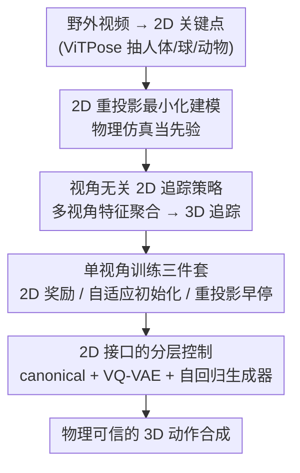

# Learning to Control Physically-simulated 3D Characters via Generating and Mimicking 2D Motions

**会议**: CVPR 2026  
**论文**: [CVF Open Access](https://openaccess.thecvf.com/content/CVPR2026/html/Li_Learning_to_Control_Physically-simulated_3D_Characters_via_Generating_and_Mimicking_CVPR_2026_paper.html)  
**代码**: https://jiannli.github.io/mimic2dm/ （项目主页）  
**领域**: 机器人 / 物理仿真角色控制  
**关键词**: 物理仿真角色控制, 强化学习, 2D 动作模仿, 视角无关策略, 分层控制

## 一句话总结
Mimic2DM 把"从视频学物理可控角色"重新表述成纯 2D 重投影追踪问题——只用从野外视频抽出的 2D 关键点、靠物理仿真当先验过滤不可行姿态，训练一个视角无关的追踪策略；再通过多视角特征聚合零样本扩展到 3D 追踪，并接上一个自回归 2D 动作生成器构成分层控制器，能合成跳舞、足球盘带、四足动物运动等物理可信动作，全程不碰任何显式 3D 动作数据。

## 研究背景与动机

**领域现状**：训练物理仿真角色控制器（在 Isaac Gym 这类仿真器里输出 PD 目标、用 RL 学技能）目前主流靠动捕（MoCap）数据做动作追踪奖励或风格判别奖励，效果很好但动捕采集昂贵、依赖专业演员和设备。为降低成本，近期工作转向用视频当数据源。

**现有痛点**：现有"视频→技能"方法几乎都是**两阶段**——先用现成的 3D 人体重建器从视频估计 3D 动作轨迹，再做基于物理的模仿。但 3D 估计器缺乏物理约束，频繁产出物理上不可行的姿态；这种有缺陷的 3D 监督会严重拖累、甚至直接搞砸策略学习。更糟的是这些重建器高度依赖大规模 3D 训练集，在 3D 数据极度稀缺的领域（复杂人-物交互 HOI、非人类角色）根本不适用。

**核心矛盾**：2D-to-3D 反演是病态问题，强行先重建 3D 再模仿，相当于把噪声当真值去"过约束"物理模仿器；而真正能保证物理可信的约束（仿真器本身）却被放在了第二阶段，没参与到对 2D 证据的解释中。

**本文目标**：跳过 3D 重建中间环节，直接从随处可得的 2D 动作学控制策略，同时覆盖人类、HOI 和非人类角色。

**切入角度**：作者的关键观察是——2D 观测虽缺深度，但**物理仿真自带强先验**，会自动过滤掉不可行状态；而野外视频天然来自多样视角，把不同视角的 2D 约束叠在一起，足以隐式刻画出 3D 结构（见原文 Figure 2：单视角下橙色与灰色角色都能完美对齐同一 2D 参考，存在歧义，多视角可消解）。

**核心 idea**：把动作重建与动作模仿统一成一个"物理约束下的 2D 重投影最小化"问题，用 RL 端到端求解，让物理仿真而非外部重建器来保证 3D 合理性。

## 方法详解

### 整体框架
Mimic2DM 的输入是从野外视频用 ViTPose 抽出的 2D 关键点序列（含人体关节、足球框、动物关键点），输出是一个能在仿真器里驱动角色、使其 3D 动作投影到指定相机视角后与 2D 参考精确对齐的控制策略。整条管线分四块：先把模仿问题改写成 2D 重投影最小化的约束优化；据此训练一个**视角无关**的单视角追踪策略（配套三件训练技巧）；该策略可零样本地通过多视角特征聚合扩展到 3D 追踪；最后把它当低层控制器，上接一个自回归 2D 动作生成器，组成分层控制框架做长程合成与交互控制。2D 动作在这里扮演高层生成模型与低层物理控制之间的统一接口。

### 关键设计

**1. 2D 重投影最小化建模：把重建与模仿拧成一个物理约束问题**

针对"先重建 3D 再模仿"会引入不可行监督的痛点，作者直接在 2D 上定义目标：给定 2D 动作 $X \in \mathbb{R}^{T \times J \times 2}$，求策略 $\pi$ 使 $\min_\pi \mathbb{E}_{s_0 \sim d(s_0)} \lVert P_\pi(C) - X \rVert$，受约束 $f_\pi = 0$（仿真器的物理约束与 MDP 动力学），其中 $P_\pi(C)$ 是策略合成的 3D 关节在相机 $C$ 下的 2D 投影。这样物理约束被直接拉进对 2D 证据的解释里——仿真器自动正则掉不合理的 3D 解，保证可信。相机外参 $C$ 和初始状态分布 $d(s_0)$ 用类似 SMPLify 的优化从源视频联合估出（最小化 2D 重投影误差），估好后在策略训练全程**固定不变**。

**2. 视角无关 2D 追踪策略 + 多视角聚合做 3D 追踪：用单视角策略零样本拼出 3D**

只优化单视角重投影会受深度歧义困扰，导致不自然姿态。作者刻意在观测里**抹掉显式相机视角信息**，逼策略仅凭角色在仿真中的实际 2D 投影来反推参考动作的视角，从而对任意视角都学会满足重投影约束、隐式获得 3D 理解。观测为 $o^{2D|C}_t = [P(x^{3D}_t, C),\ x_{t:t+L}]$，即当前 3D 关键点的 2D 投影加上未来 $L$ 帧的 2D 参考片段；策略还吃本体感知 $s^{prop}_t$ 与交互物体外部状态 $s^{ext}_t$，输出动作空间上的对角高斯（PD 目标）。关键红利在于：因为策略是视角无关的，多个视角 $\{X_k, C_k\}_{k=1}^K$（同一 3D 动作的不同投影）可直接**特征平均聚合** $o^{agg}_t = \frac{1}{N}\sum_i \phi(o^{2D_i}_t)$ 后喂进同一策略 $\pi_{mv}(a_t|s^{prop}_t, o^{agg}_t)$，**无需任何微调**就把单视角策略升级成多视角 3D 追踪器，3D 追踪精度逼近用真值 3D 训练的基线。

**3. 单视角训练三件套：2D 奖励 + 自适应状态初始化 + 重投影早停**

只有 2D 监督时，常规 3D 模仿的训练范式跑不动，作者打了三个补丁。奖励用距离型 2D 追踪奖励加能耗惩罚 $r_t = w_p r^p_t + w_e r^e_t$，其中 $r^p_t = \exp(-\alpha \sum_j \lVert P(x^{3D|j}_t) - x^j_t \rVert)$ 直接压重投影误差，$r^e_t = -\sum_j \dot{q}^j_t \cdot \tau^j_t$ 罚关节速度×力矩。**自适应状态初始化**替代依赖准确 3D 姿态的 RSI：因为没有可靠 3D 参考，作者为每个参考帧维护一个状态缓冲区（初始填任意 3D 姿态），训练中用 critic 网络给 rollout 出的状态打分，高分状态存回对应帧缓冲，采样概率按分数指数加权，从而把物理不可行的初始状态逐步替换成可行的（原文 Figure 7 显示初始化从错误姿态收敛到合理姿态）。**重投影早停**：当角色投影姿态显著偏离 2D 参考时立即终止该 episode，避免陷入不可恢复状态、提升效率。

**4. 2D 接口的分层控制：canonical 表示 + VQ-VAE 词元化 + 自回归生成器**

要从"追踪"走向"生成"，作者在追踪策略上层接一个运动学 2D 生成器。原始 2D 坐标受全局平移/缩放影响方差大，难训，于是定义 **canonical 表示**：每帧拆出根平移 $x^{root}$、尺度 $s$、局部姿态 $\bar{x} = (x - x^{root})/s$，并记相对尺度变化 $\delta s_t = \log(s_t/s_{t-1})$、归一化根平移 $\delta x^{root}_t = (x^{root}_t - x^{root}_{t-1})/s_t$，得 $x^{can}_t = (\bar{x}_t, \delta x^{root}_t, \delta s_t)$，与绝对表示可逆互转 $X^{can} = G(X)$。再用 **VQ-VAE** 把 canonical 序列离散成紧凑词元，损失里额外加一项绝对坐标重建 $L_{rec} = \lVert X^{can} - \hat{X}^{can} \rVert + \omega \lVert G^{-1}(X^{can}) - G^{-1}(\hat{X}^{can}) \rVert$ 以保长序列下的全局平移/尺度一致，并用因果卷积支持自回归去词元化。最后一个 GPT 式**因果 transformer** 建模 $p(c) = \prod_i p(c_i | c_0,\dots,c_{i-1})$ 做实时无限长生成。生成的 2D 参考转回全局坐标后喂给视角无关追踪策略，投影视角可任选，从而支持灵活的下游交互控制。

### 损失函数 / 训练策略
策略为 MLP（隐层 512/256/256），仿真器 Isaac Gym（控制 30Hz，动力学 60Hz）；VQ-VAE 码本大小 512、嵌入维 128；自回归 transformer 为 4 层 4 头、嵌入维 128。单视角追踪策略在 AIST++ 与 Dribble 上各训约一周（4×NVIDIA P40），动物动作约三天。⚠️ 上述超参/时长以原文为准。

## 实验关键数据

**自定义指标说明**：**Succ.↑** 成功率，最大重投影误差 >100 像素判为失败，统计成功追踪占比；**E2D↓** 2D 追踪误差，角色投影姿态与 2D 参考的平均重投影误差（像素）；**EO2D↓** HOI 中物体的 2D 追踪误差；**E3D↓** 3D 追踪误差，全帧关节位置误差均值；**Jitters↓** 关节位置三阶导，越小越平滑、越物理可信；**FID↓** 合成与参考动作的分布差异（在 2D 投影上计算）。

### 主实验
对比代表性两阶段基线 Sfv*（先估 3D 再物理模仿，已升级其重建模块以公平比较）在野外视频数据集 Soccer Dribble 与 Animal 上：

| 数据集 | 方法 | Succ.↑ | E2D↓ | EO2D↓ | Jitters↓ |
|--------|------|--------|------|-------|----------|
| Soccer Dribble | Sfv* w/ SLAHMR | 47.8 | 19.9 | 38.2 | 2.62 |
| Soccer Dribble | Sfv* w/ SMPLify | 37.1 | 25.1 | 42.0 | 2.54 |
| Soccer Dribble | **Ours** | **91.3** | **17.1** | **17.5** | **1.69** |
| Animal | Sfv* w/ SMPLify | 50.0 | 68.9 | — | 9.20 |
| Animal | **Ours** | **83.3** | **26.8** | — | **3.36** |

成功率近乎翻倍，物体追踪误差（EO2D）腰斩，抖动显著下降——基线因重建 3D 不准，学不会复杂的球-脚交互、四足运动也常不自然。

AIST++ 大规模模仿与生成动作上，2D 监督逼近真值 3D 监督：

| 训练数据 | 输入 | Succ.↑(Test) | E3D↓(Test) | E2D↓(Test) | Jitters↓(Test) |
|----------|------|--------------|------------|------------|----------------|
| 3D（真值） | 3D | 89 | 141 | 21.3 | 2.99 |
| 2D | 1 视角 | 82.5 | 254.6 | 38.6 | 1.79 |
| 2D | 2 视角 | 88.0 | 164.9 | 24.5 | 1.60 |
| 2D | 3 视角 | 88.9 | 161.5 | 24.1 | 1.60 |

仅靠 2D 监督 + 多视角聚合，3D 追踪误差从单视角 254.6 降到 2 视角 164.9，且抖动反而比 3D 基线更低（仿真先验带来的平滑性）。

### 消融实验
| 配置 | Succ.↑ | E2D↓ | EO2D↓ | Jitters↓ | 说明 |
|------|--------|------|-------|----------|------|
| Ours（Dribble） | 91.3 | 17.1 | 17.5 | 1.69 | 完整模型 |
| w/ Rnd. | 83.2 | 22.1 | 26.1 | 1.92 | 推理时球随机初始化于角色前 1×1m |
| w/ Rnd. + Force | 72.6 | 27.4 | 29.9 | 2.03 | 再每 2 秒施加 300N 随机方向力 |
| w/ Noisy S.I. | 93.4 | 21.6 | 24.5 | 1.92 | 训练时初始姿态加 σ=0.5 高斯噪声 |

生成器对比（分层框架内 AR vs 扩散）：

| 数据集 | 生成器 | FID↓ | Succ.↑ | Jitters↓ |
|--------|--------|------|--------|----------|
| Soccer Dribble | Diffusion | 6.29 | 0.13 | 2.16 |
| Soccer Dribble | AR (Ours) | 5.16 | 0.71 | 1.91 |
| AIST++ | Diffusion | 5.92 | 0.44 | 1.87 |
| AIST++ | AR (Ours) | 2.44 | 0.92 | 2.07 |

### 关键发现
- 即使遭受球随机初始化 + 周期性 300N 外力，策略仍能恢复并保持追踪（Succ. 72.6%），证明它学到的是稳定物理控制而非死记轨迹。
- 训练初始姿态加噪（Noisy S.I.）几乎不损学习（Succ. 反而 93.4%），说明方法对初始状态不敏感、自适应初始化能自我纠偏。
- 视角多样性是学复杂技能的关键：同质视角训练的策略动作不自然，甚至学不会"举箱子"这类交互（原文 Figure 6）。
- 自回归生成器在驱动低层控制时全面优于扩散基线（AIST++ FID 2.44 vs 5.92、Succ. 0.92 vs 0.44），更适合产出能被物理策略稳定追踪的 2D 引导。

## 亮点与洞察
- 把"重建 + 模仿"两阶段塌缩成单一 2D 重投影约束优化，让物理仿真器从"事后补救者"变成"参与解释 2D 证据的先验"——这是范式级的简化，也是它能吃 HOI 和非人类数据的根因。
- "抹掉相机信息逼策略视角无关 → 特征平均聚合零样本升 3D"这套思路很巧：单视角与多视角共享同一策略，3D 能力是免费副产品，可迁移到任何"多观测约束同一隐变量"的设定。
- 2D 动作作为高层生成与低层控制的统一接口，解耦了"生成什么"和"怎么物理执行"，让投影视角在推理时可任选，扩展性强。

## 局限与展望
- 训练成本高：单视角追踪策略需 4×P40 训约一周，⚠️（以原文为准）对复现不友好。
- 相机与初始状态靠类 SMPLify 优化估出且训练全程固定，若初始相机估计偏差大，可能限制对剧烈相机运动视频的适用性。
- 多视角 3D 追踪依赖同一 3D 动作存在多视角投影，而野外单条视频未必提供足够视角多样性，3D 精度仍略逊真值 3D 基线（E3D 161.5 vs 141）。
- 可改进：把相机参数纳入端到端联合优化、或引入自监督视角增广，减少对视频天然视角多样性的依赖。

## 相关工作与启发
- **vs Sfv / 两阶段视频模仿（Peng et al. SFV、Yu et al.）**：他们先用重建器估 3D 再物理模仿，受 3D 估计不准拖累；本文直接在 2D 上优化、靠仿真器保物理，端到端，且天然支持 HOI 与非人类角色。
- **vs 基于动捕的物理角色控制（DeepMimic 等）**：他们要昂贵高质 3D MoCap；本文只要野外视频的 2D 关键点，数据可获取性和可扩展性大幅提升。
- **vs 扩散式动作生成**：在分层框架里，本文自回归 2D 生成器产出的引导 FID 更低、成功率更高，更契合"被物理策略实时追踪"的需求。

## 评分
- 新颖性: ⭐⭐⭐⭐⭐ 把视频→物理角色控制重构成纯 2D 重投影问题、用仿真先验消解 3D 歧义，思路干净且开辟新范式。
- 实验充分度: ⭐⭐⭐⭐ HOI/动物/舞蹈多域 + 鲁棒性/多视角/生成器消融较全，但缺更大规模角色种类与真值 3D 对比的细粒度分析。
- 写作质量: ⭐⭐⭐⭐ 动机推导清晰、图示到位；部分公式与符号偏密，初读需对照原文。
- 价值: ⭐⭐⭐⭐⭐ 大幅降低物理可控角色的数据门槛，对动画、机器人仿真与具身技能学习都有直接应用价值。

<!-- RELATED:START -->

## 相关论文

- [\[ECCV 2024\] GraspXL: Generating Grasping Motions for Diverse Objects at Scale](../../ECCV2024/robotics/graspxl_generating_grasping_motions_for_diverse_objects_at_scale.md)
- [\[CVPR 2026\] Bridging the 2D-3D Gap: A Hierarchical Semantic-Geometric Map for Vision Language Navigation](bridging_the_2d-3d_gap_a_hierarchical_semantic-geometric_map_for_vision_language.md)
- [\[CVPR 2026\] Physically Ground Commonsense Knowledge for Articulated Object Manipulation with Analytic Concepts](physically_ground_commonsense_knowledge_for_articulated_object_manipulation_with.md)
- [\[CVPR 2026\] Learning Surgical Robotic Manipulation with 3D Spatial Priors](learning_surgical_robotic_manipulation_with_3d_spatial_priors.md)
- [\[CVPR 2026\] Closed-Loop Neural Activation Control in Vision-Language-Action Models](closed-loop_neural_activation_control_in_vision-language-action_models.md)

<!-- RELATED:END -->
