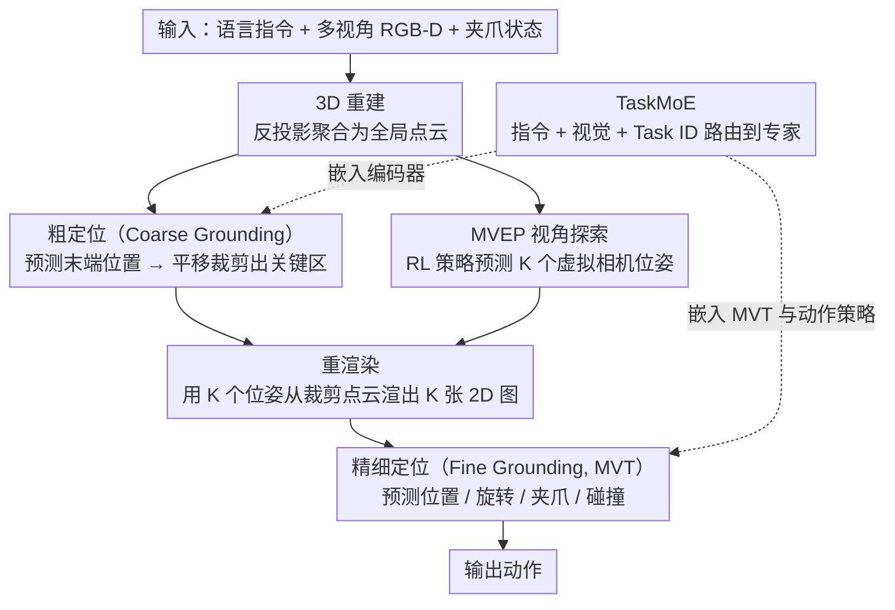

# Learning to See and Act: Task-Aware Virtual View Exploration for Robotic Manipulation

**会议**: CVPR 2026  
**arXiv**: [2508.05186](https://arxiv.org/abs/2508.05186)  
**代码**: [有](https://github.com/) (TAVP)  
**领域**: 机器人/具身智能  
**关键词**: 视角探索, 多任务操作, Mixture-of-Experts, 虚拟视图渲染, 强化学习

## 一句话总结

提出 TVVE 框架，通过强化学习驱动的多视角探索策略（MVEP）选择最优虚拟相机视角并在线重渲染观测，同时设计任务感知 MoE 视觉编码器（TaskMoE）解决多任务特征干扰问题，在 RLBench 18 个任务上平均成功率达 86.6%。

## 研究背景与动机

**领域现状**：VLA（Vision-Language-Action）模型在端到端机器人操作领域快速发展，OpenVLA、π₀ 等方法在复杂精细任务上取得了不错效果。这些方法通常依赖单视角或少量固定视角的 RGB-D 观测来指导动作预测。

**现有痛点**：固定视角在杂乱或动态场景中问题严重——当目标物体或末端执行器在任务执行过程中被重新放置时，固定相机经常导致遮挡。例如执行"把糖放进橱柜"指令时，正面相机只能看到橱柜但看不到糖，左/右肩相机只能看到被抓取的糖但看不到橱柜，导致场景理解不完整、动作预测失败。

**核心矛盾**：一是视角固定 vs 场景动态——固定相机无法随任务进展适应性选择最佳观测角度；二是共享编码器 vs 任务异质性——RVT/RVT-2 等方法用共享视觉编码器处理所有任务，抓苹果与开抽屉这类差异大的任务之间存在严重特征干扰。

**要解决什么**：(1) 如何动态选择能最大化覆盖任务关键信息的虚拟观测视角；(2) 如何在多任务设置下避免视觉特征和动作策略之间的干扰。

**切入角度**：用 RGB-D 重建 3D 点云作为场景表示，通过强化学习策略在点云上探索最优虚拟相机位姿，再从点云重渲染 2D 观测图像；同时用 MoE 架构把不同任务路由到专门的专家网络。

**核心 idea**："先学看，再学做"——把视角选择建模成一个可训练的 RL 策略，通过伪环境交互避免昂贵的物理仿真，并用解耦门控的 TaskMoE 实现任务间的选择性参数共享。

## 方法详解

### 整体框架

TVVE 想解决的核心问题是：固定相机在机器人操作中常因物体或夹爪移动而被遮挡，看不全任务关键信息，导致动作预测失败。它的思路是让模型先"学会看"——主动挑一组好的虚拟视角把场景看清楚，再"学会做"——基于看清的观测预测动作。整条流水线以语言指令、多视角 RGB-D 图像和当前夹爪状态为输入，分四步走：

1. **3D 重建**：把多张 RGB-D 图像反投影成点云，在世界坐标系下聚合为全局点云，作为后续视角探索的统一场景表示。
2. **粗定位（Coarse Grounding）**：先预测末端执行器的大致位置，把点云中心平移到该位置并裁掉无关区域，让后续探索聚焦在任务关键区。
3. **视角探索（MVEP）**：在全局点云上用 RL 策略预测 K 个虚拟相机位姿，从裁剪后的点云重渲染出 K 张 2D 观测图像。
4. **精细定位（Fine Grounding）**：把渲染图像送入 TaskMoE 增强的多视角 Transformer（MVT），预测最终动作（位置、旋转、夹爪开合、碰撞状态）。

注意第 2、3 步是从全局点云分出的两条并行支路——粗定位负责锁定关键区、MVEP 负责挑视角，二者在重渲染处汇合（用 MVEP 选出的位姿去渲染粗定位裁好的点云）。而 TaskMoE 并不是独立的一步，它嵌在 MVT 视觉编码器和动作策略内部，让粗/精两处的特征提取和动作预测都按任务自适应路由。整套设计里，MVEP 负责"看哪里"，TaskMoE 负责"不同任务怎么看、怎么做才不互相干扰"，两者由三阶段训练串起来。

### 关键设计

**1. MVEP：把"选视角"变成一个可训练的 RL 策略**

固定相机看不全动态场景，但"什么角度最好"又没有标签可监督，于是 TVVE 干脆把视角选择本身建模成一个强化学习问题。MVEP 接收全局点云及其 RGB 特征，用 look-at 相机模型把每个相机位姿参数化成 5 维球坐标向量 $(\theta, \phi, r, \theta_{up}, \phi_{up})$——前三维定相机的方位与到目标的距离，后两维定"上方向"。一个 MLP 不直接回归位姿，而是预测一个高斯分布的均值和方差，再用重参数化技巧从中采样出位姿，并用 sigmoid 把球坐标约束在有效范围内。球坐标天然契合"围着目标转着看"的语义，概率采样则在保持端到端可微的同时引入了探索性——这正是后面能用 PPO 去优化它的前提。

**2. TaskMoE：用解耦门控让多任务"选择性共享"参数**

RVT/RVT-2 这类方法对所有任务共用一个视觉编码器，抓苹果和开抽屉的特征会互相干扰。TaskMoE 给视觉/动作模块换上混合专家结构，按任务语义动态路由到不同专家。它的路由特征不是简单拿 task ID 查表：先用交叉注意力把语言指令和场景视觉信息融合，再过一个 FiLM 层把 Task ID 调制进去，得到既懂任务又懂当前场景的上下文路由特征。最关键的一步是把门控数量 $N_G$ 与任务总数 $N_J$ 解耦（取 $N_G < N_J$）：语义相近的任务（如打开不同的抽屉）共享同一个门控、却仍能路由到不同专家，而差异大的任务保留各自独立的通道。相比"一个任务配一个门控"的传统 MoE，这种共享让模型自动发现潜在的任务簇，从而把已学知识迁移到未见任务上。

### 损失函数 / 训练策略

直接联合训练"看"和"做"会很不稳定，TVVE 把它拆成三阶段：

**Stage 1 — 固定视角预训练**：先用前、左、上三个默认视角训练出一个基础模型，损失是各动作分量之和

$$\mathcal{L}_{s1} = \mathcal{L}_{hc} + \mathcal{L}_{hf} + \mathcal{L}_{rot} + \mathcal{L}_{gri} + \mathcal{L}_{col}$$

涵盖粗/精热力图交叉熵、旋转、夹爪状态和碰撞指示。这个模型同时充当 Stage 2 的奖励参考下界。

**Stage 2 — PPO 优化 MVEP**：冻结其余组件只训 MVEP，奖励由三项构成——$r_0 = \mathcal{L}_{ref} - \mathcal{L}_{TVVE}$（相对固定视角模型的任务损失改善），$r_1$ 为热力图负平均熵（鼓励置信预测），$r_2$ 为视角间平均余弦距离（鼓励 K 个视角彼此分散、不要挤在一起）。三项经 Welford 算法自适应归一化后加权求和并裁剪到 $[-10, 10]$：$r = \sum_{i=0}^{2} w_i \cdot \mathcal{N}(r_i)$。

**Stage 3 — 联合微调**：反过来冻结 MVEP、微调其余模块，让"做"去适配"看"选出的视角，协调两者的配合。

## 实验关键数据

### 主实验

**表1：RLBench 多视角设置（18 个任务）**

| 方法 | Avg. SR (%) ↑ | Avg. Rank ↓ | Insert Peg | Sort Shape | Slide Block | Close Jar |
|------|:---:|:---:|:---:|:---:|:---:|:---:|
| PerAct | 49.4 | 7.06 | 5.6 | 16.8 | 74.0 | 55.2 |
| RVT | 62.9 | 5.28 | 11.2 | 36.0 | 81.6 | 52.0 |
| 3D Diffuser Actor | 81.3 | 3.0 | 65.6 | 44.0 | 97.6 | 96.0 |
| RVT2 | 81.4 | 2.89 | 40.0 | 35.0 | 92.0 | 100.0 |
| ARP | 81.6 | 2.83 | 53.2 | 35.2 | 98.4 | 97.6 |
| **TVVE (Ours)** | **86.6** | **2.17** | **98.0** | **62.0** | **100.0** | **100.0** |

TVVE 比此前 SOTA（ARP 81.6%）提升约 **5 个百分点**，在 Insert Peg 任务上提升幅度达 +32.4%（65.6→98.0）。

**表2：RLBench-OG 鲁棒性测试（遮挡+泛化）**

| 方法 | Avg. SR (%) | Occlusion 1 | Occlusion 2 | Light | Table Texture | Camera Pose |
|------|:---:|:---:|:---:|:---:|:---:|:---:|
| Diffusion Policy | 23.8 | 27.4 | 23.4 | 22.9 | 22.6 | 22.2 |
| ARP | 63.7 | 73.0 | 52.6 | 59.8 | 61.3 | 69.7 |
| RVT2 | 64.5 | 72.8 | 46.9 | 60.8 | 64.0 | 74.0 |
| **TVVE (Ours)** | **67.0** | **75.0** | **58.0** | **63.7** | **66.8** | 73.2 |

在遮挡场景（Occlusion 2）上，TVVE 相比 RVT2 提升 **+11.1%**（46.9→58.0），体现动态视角对抗遮挡的有效性。

### 消融实验

**组件消融（18任务，表5）**：

| 配置 | Avg. SR (%) |
|------|:---:|
| TVVE (TaskMoE + MVEP) | **86.6** |
| w/o TaskMoE | 85.6 (-1.0) |
| Fixed Viewpoints（去掉 MVEP） | 83.3 (-3.3) |
| Random Viewpoints | 8.9 (-77.7) |

- 随机视角直接崩溃至 8.9%，充分证明 MVEP 学到了有意义的视角选择策略
- 固定视角下降 3.3%，说明动态视角探索带来显著提升

**TaskMoE 泛化实验（表6）**：有 TaskMoE 时，训练中见过的 5 个任务平均成功率 80.8%（无 TaskMoE 为 72.0%），未见任务 Open Drawer 成功率 72% vs 60%，说明 TaskMoE 同时提升了已知任务表现和未知任务泛化。

**视角数量 K 和径向约束 r 消融（表7）**：K 从 2→3→4 时成功率从 27.2%→49.6%→55.2%；更紧的距离约束 (0.90~1.04m) 将成功率从 49.6% 提升至 56.0%。最终选择 K=3 作为精度和计算开销的平衡。

### 关键发现

1. **动态视角 >> 固定视角 >> 随机视角**：MVEP 的视角选择并非随机有益，而是学到了任务相关的信息最大化策略
2. **TaskMoE 对泛化至关重要**：门控解耦机制让模型自动发现潜在任务簇，促进跨任务迁移
3. **真机实验验证了 sim-to-real 迁移能力**：Dobot 上 TVVE (88%) vs DP (68%)，Franka 上 TVVE (78%) vs ARP (72%)

## 亮点与洞察

- **伪环境交互**极大降低了 MVEP 的 RL 训练成本——不需要真环境交互，仅用离线数据和参考模型生成奖励信号
- **三阶段训练策略**设计精巧：先学固定视角的基础能力→再学视角探索策略→最后协调"看"和"做"，避免了联合训练的不稳定性
- TaskMoE 的**门控数解耦设计**（N_G < N_J）兼顾了参数共享和任务隔离，在系统可扩展性上有清晰的工程价值

## 局限与展望

- 多视角重渲染增加了推理延迟，实时性受限
- 依赖准确的全局点云重建，对反光、透明物体效果不佳
- 目前消融实验仅在 5 个代表性任务上进行，不够全面
- Stage 2 的 PPO 训练需要 4 张 A800 GPU，资源要求较高
- 未与近期的 3D 扩散策略类方法（如 3D Diffuser Actor）在 OOD 设置上做直接对比

## 相关工作与启发

- **RVT-2**：TVVE 基于 RVT-2 的粗定位模块构建，但将固定多视角升级为动态探索视角
- **ARP**：自回归动作策略的基线方法，TVVE 用 TaskMoE 增强了其动作生成模块
- **SDP**：将 MoE 集成到扩散策略中用于多任务学习，但未做任务感知的路由设计
- **启发**：伪环境交互的思路可以推广到其他需要 RL 优化但环境交互昂贵的场景（如主动感知、导航等）

## 评分

⭐⭐⭐⭐ 方法设计完整度高（MVEP + TaskMoE + 三阶段训练），实验覆盖仿真/OOD/真机三个层面，在 18 个 RLBench 任务上实现了显著提升，但推理效率和点云依赖是实际部署的瓶颈。

<!-- RELATED:START -->

## 相关论文

- [\[CVPR 2026\] Learning to Act Robustly with View-Invariant Latent Actions](learning_to_act_robustly_with_view-invariant_latent_actions.md)
- [\[CVPR 2026\] DiffuView: Multi-View Diffusion Pretraining for 3D-Aware Robotic Manipulation](diffuview_multi-view_diffusion_pretraining_for_3d_aware_robotic_manipulation.md)
- [\[CVPR 2026\] PALM: Progress-Aware Policy Learning via Affordance Reasoning for Long-Horizon Robotic Manipulation](palm_progress-aware_policy_learning_via_affordance_reasoning_for_long-horizon_ro.md)
- [\[NeurIPS 2025\] Act to See, See to Act: Diffusion-Driven Perception-Action Interplay for Adaptive Policies](../../NeurIPS2025/robotics/act_to_see_see_to_act_diffusion-driven_perception-action_interplay_for_adaptive_.md)
- [\[CVPR 2026\] GeCo-SRT: Geometry-aware Continual Adaptation for Robotic Cross-Task Sim-to-Real Transfer](gecosrt_geometryaware_continual_adaptation_for_rob.md)

<!-- RELATED:END -->
