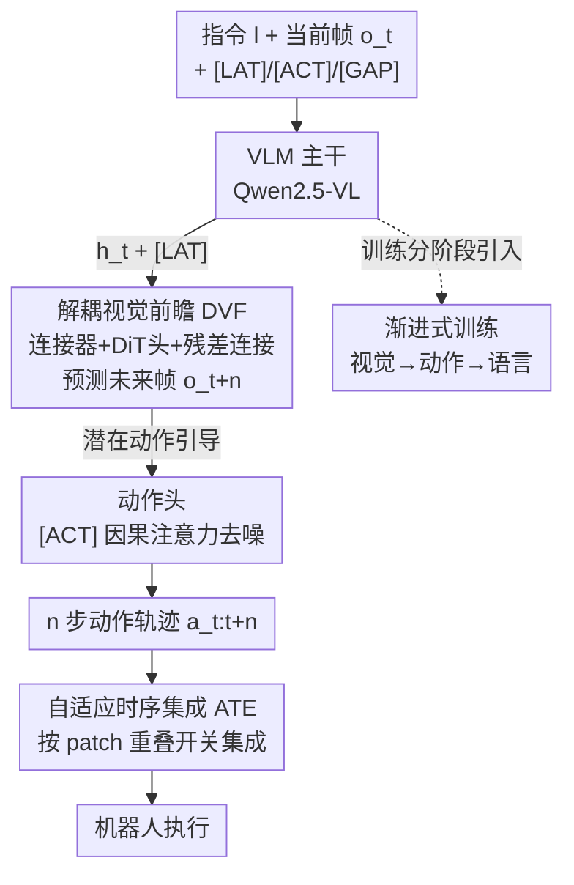

# Mantis: A Versatile Vision-Language-Action Model with Disentangled Visual Foresight

**会议**: CVPR 2026  
**论文**: [CVF Open Access](https://openaccess.thecvf.com/content/CVPR2026/html/Yang_Mantis_A_Versatile_Vision-Language-Action_Model_with_Disentangled_Visual_Foresight_CVPR_2026_paper.html)  
**代码**: https://github.com/SJTU-DENG-Lab/Mantis  
**领域**: 机器人 / VLA 模型  
**关键词**: 视觉-语言-动作模型, 视觉前瞻, 潜在动作, DiT, 渐进式训练

## 一句话总结
Mantis 把"预测未来画面"这件事从 VLA 主干上解耦出去——用一组潜在动作查询 + 独立的扩散 Transformer（DiT）头去生成下一帧，让主干只需吐出一段紧凑的帧间动态作为动作监督信号，从而既保住了视觉前瞻的好处，又腾出主干容量保留语言理解与推理能力，在 LIBERO 上拿到 96.7% 成功率，真实机器人上指令跟随和泛化都超过 π0.5。

## 研究背景与动机
**领域现状**：VLA（Vision-Language-Action）模型用预训练 VLM 把语言指令 + 视觉观测翻译成机器人动作，是当前机器人操作学习最有希望的路线之一。但大家很快发现一个结构性矛盾：动作信号是低维、稀疏的（几个关节角度），而模型要处理的是高维稠密的视觉输入，稀疏监督根本喂不饱一个大模型，模型大量表征容量被闲置。

**现有痛点**：为了补足稀疏动作监督，主流做法是引入"视觉前瞻"——让模型在预测动作之外还预测未来视觉状态。但三类做法各有各的坑：(1) **像素级前瞻**（直接预测未来帧）会带进纹理、光照这类与动作无关的冗余信息，分散模型注意力、训练成本高、收敛慢，甚至让模型把"物理运动"错误关联到"外观变化"上产生幻觉；(2) **轨迹引导**（把视觉压缩成关键点 track）虽然紧凑，但压缩会丢掉细粒度运动信息形成信息瓶颈，而且从视频里抽点轨迹本身精度有限，误差会累积；(3) **潜在动作监督**需要先单独训一个动作量化模型从帧间差里学离散潜在动作，额外引入计算复杂度。

**核心矛盾**：信息量与紧凑度之间的 trade-off——直接预测稠密视觉状态信息全但太重，压缩成紧凑信号又会丢信息。更要命的是，几乎所有这些方法都**忽视了语言监督**，机器人专项训练会覆盖掉 VLM 预训练时学到的视觉-文本对齐，导致指令跟随和推理能力退化。

**本文目标**：找到一种既紧凑又准确的视觉前瞻辅助信号，同时不牺牲主干的语言理解与推理能力。

**核心 idea**：与其让 VLA 主干"亲自"生成未来帧，不如把前瞻预测**解耦**到主干之外——主干只产出一组潜在动作查询，由一个独立 DiT 头负责把它还原成未来帧。这样主干吐出的不是冗余像素而是"帧间动态"，天然紧凑且直接对应潜在动作；解耦还把视觉重建的负担从主干卸下，让主干有余力接受语言监督。

## 方法详解

### 整体框架
Mantis 由几个部件组成：一个 VLM 主干 $\mathcal{P}$（Qwen2.5-VL）、一个连接器 $\mathcal{C}$、一个 DVF 头 $\mathcal{D}$（基于 Sana 的 DiT）、一个动作头 $\pi$，以及三组可学习查询 token：潜在动作查询 `[LAT]`、动作查询 `[ACT]`、多间隔查询 `[GAP]`。

整体数据流是这样转的：在时刻 $t$，主干接收语言指令 $l$ 和当前视觉状态 $\mathbf{o}_t$，连同 `[LAT]` 打包成序列，输出隐表示 $\mathbf{h}_t = \mathcal{P}(\mathbf{o}_t, l, \texttt{[LAT]})$。然后 $\mathbf{h}_t$ 和当前帧 $\mathbf{o}_t$ 一起喂给连接器 $\mathcal{C}$，投影成 DiT 的条件输入，由 DVF 头生成未来帧 $\mathbf{o}_{t+n} = \mathcal{D}(\mathcal{C}(\mathbf{o}_t, \mathbf{h}_t))$。关键在于 `[LAT]` 在这个"预测未来帧"的目标下，会自动学到刻画视觉轨迹的帧间动态（即潜在动作），而不是去重建整帧。最后动作头 $\pi$ 用动作查询 `[ACT]` 从上下文（含 `[LAT]`）里抽信息，去噪生成接下来 $n$ 步的动作轨迹 $\mathbf{a}_{t:t+n}$。推理时 DVF 头被直接拿掉——机器人执行不需要真的画出未来帧，前瞻只是训练期的"拐杖"。

### 关键设计

**1. 解耦视觉前瞻 DVF：把"画未来帧"从主干剥离，逼出紧凑的潜在动作**

这是全文的核心，直接针对"像素级前瞻太重、压缩又丢信息"这对矛盾。做法是不让主干自己生成像素，而是引入潜在动作查询 `[LAT]` + 一个独立的 DiT 头：主干只把 `[LAT]` 对应的隐表示 $\mathbf{h}_t$ 交出来，由 DiT 头去完成"预测未来帧"的重活。这一步的精髓在那条**残差连接**——把当前帧 $\mathbf{o}_t$ 也直接喂给 DiT。因为 DiT 已经能从 $\mathbf{o}_t$ 看到完整的当前外观，`[LAT]` 就不必再去编码"画面长什么样"，只需补上"画面怎么变"，也就是帧间动态。这些帧间动态正是显式机器人运动在视觉上的投影，作者称之为**潜在动作**，它天然紧凑（不含冗余纹理/光照）又准确（不是从视频里抽 track 那种有限精度），给动作预测提供了直接、有针对性的引导。

为了在训练时产出更稠密的视觉监督、并适配下游不同步长的任务，作者还加了**多间隔查询 `[GAP]`**：把它们插在 `[LAT]` 之前，引导 DiT 生成不同时间间隔 $n$（从 1 到 6）的未来帧，相当于让模型同时学"下一帧""隔几帧"的多尺度动态。消融里 flawed-DVF（去掉残差连接）明显掉点（95.7→94.4），印证了残差连接是 `[LAT]` 能学到潜在动作而非被迫重建整帧的关键。

**2. 渐进式训练配方：分阶段引入模态，避免跨模态恶性竞争**

直接把视觉、语言、动作三种监督一锅炖会出问题——模型会偏向最容易学的信号（动作），或被主导模态（语言）带偏，造成跨模态竞争和收敛不稳。Mantis 用三阶段渐进式引入来解决：

- **阶段 1 多间隔视觉训练**：只在无动作标注的人类操作视频（SSV2，22 万段）上预测未来帧，优化扩散损失 $\mathcal{L}_{\text{DVF}}$，解冻 DVF 头、`[LAT]`、`[GAP]`，但**冻结主干**以保住预训练语言表征。这一步让模型从纯视觉动态里学通用操作技能和世界知识。
- **阶段 2 视觉-动作联合训练**：引入机器人示范数据（DROID，7.6 万段），把时间间隔固定为动作块大小做时序对齐，目标变成 $\alpha\mathcal{L}_{\text{DVF}} + \mathcal{L}_{\text{action}}$（$\alpha=0.1$），解冻动作查询、仍冻主干。
- **阶段 3 语言监督混合训练**：把 38 个多模态数据集和 DROID 混在一起训，这时**解冻主干**并对语言输出加交叉熵 $\mathcal{L}_{\text{lang}}$，总目标 $\alpha\mathcal{L}_{\text{DVF}} + \mathcal{L}_{\text{action}} + \beta\mathcal{L}_{\text{lang}}$。

之所以有效，是因为它让每种模态在前一阶段打好的稳定基础上再加入，而 DVF 的解耦设计本就给主干腾出了容量，语言监督才有空间发挥，最终保住了真实实验里那种"理解 Taylor Swift 是谁""会算 3+5"的语义能力。

**3. 自适应时序集成 ATE：只在需要稳的时候才花算力做集成**

推理时 VLA 常用时序集成（Temporal Ensemble）来平滑动作、提升运动稳定性，但它每步都要多次推理，开销大。ATE 的洞察是：**不是每个时刻都需要高稳定性**——精细操作（如抓取）需要稳，空载移动则不需要。于是 ATE 在每步维护两组视觉 patch 来判断当前是否处于精细操作：(1) **目标 patch**——与指令最相关的区域，由主干交叉注意力算出文本→视觉注意力分数，取最高的前 $\tau_{\text{target}}\%$ token；(2) **动态 patch**——视觉变化最剧烈的区域，把当前帧与上一帧按 patch 在像素空间算余弦相似度，取相似度最低的前 $\tau_{\text{dynamic}}\%$。动态 patch 抓的是机械臂/末端执行器的运动，目标 patch 标的是指令相关物体，二者**重叠**就意味着正在对目标物体做精细操作（如抓握）——此时才激活时序集成换稳定性，否则关掉省算力。论文设 $\tau_{\text{target}}=1$、$\tau_{\text{dynamic}}=12$，由此得到 Mantis-ATE 变体，推理次数砍掉约 50% 而成功率几乎不变。

### 损失函数 / 训练策略
总训练目标在阶段 3 为 $\alpha\mathcal{L}_{\text{DVF}} + \mathcal{L}_{\text{action}} + \beta\mathcal{L}_{\text{lang}}$，其中 $\mathcal{L}_{\text{DVF}}$、$\mathcal{L}_{\text{action}}$ 均为扩散损失，$\mathcal{L}_{\text{lang}}$ 为语言输出交叉熵，$\alpha=0.1$ 平衡视觉项。模型共 5.8B 参数（主干 3.7B、DVF 头 1.4B、动作头 0.3B、VAE 0.3B），`[LAT]`=9、`[ACT]`=6、`[GAP]`=6×3，DVF 头扩散 30 步、动作头 10 步，用 AdamW（weight decay 0.1、梯度裁剪 0.5）+ DeepSpeed 训练。

## 实验关键数据

### 主实验
在 LIBERO 仿真基准（Spatial / Object / Goal / Long 四个任务套件，各 10 任务、每任务 50 trial）上用成功率（SR）评测：

| 类别 | 方法 | Spatial | Object | Goal | Long | Avg. |
|------|------|---------|--------|------|------|------|
| 非视觉增强 | OpenVLA | 84.7 | 88.4 | 79.2 | 53.7 | 76.5 |
| 非视觉增强 | π0 | 96.8 | 98.8 | 95.8 | 85.2 | 94.2 |
| 视觉增强 | CoT-VLA | 87.5 | 91.6 | 87.6 | 69.0 | 81.1 |
| 视觉增强 | UnifiedVLA | 95.4 | 98.8 | 93.6 | 94.0 | 95.5 |
| 视觉增强 | F1 | 98.2 | 97.8 | 95.4 | 91.3 | 95.7 |
| 视觉增强 | **Mantis（本文）** | **98.8** | **99.2** | 94.4 | **94.2** | **96.7** |

Mantis 在 4 个套件中 3 个拿最优，平均 SR 96.7% 超过所有视觉增强与非视觉增强基线。值得注意的是 ATM（轨迹引导）只有 63.4%，作者归因于视频抽点轨迹精度有限导致误差累积——这正好反衬了 DVF "不靠抽 track" 的紧凑动态信号更可靠。

### 消融实验
**DVF 四变体**（验证解耦、残差、视频预训练各自的贡献）：

| 配置 | Avg. SR | 说明 |
|------|---------|------|
| pretrained-DVF | 96.2 | DVF 在人类+机器人视频上预训练，最优 |
| vanilla-DVF | 95.7 | 完整 DVF（从头训） |
| flawed-DVF | 94.4 | 去掉残差连接 |
| no-DVF | 91.3 | 只留动作头，最差 |

**ATE 效率**（TE vs ATE，IC 为推理次数，越低越省）：以 Long 套件为例，TE 的 IC 高达 260.5、ATE 仅 117.8，SR 从 94.2→94.4 基本持平；四套件平均推理次数下降近 50%。

### 关键发现
- **解耦比堆视觉信息更重要**：收敛速度对比里，纠缠式视觉前瞻 UnifiedVLA 前 10 个 epoch 成功率一直是 0，收敛最慢；而 Mantis 收敛速度与非视觉增强的 OpenVLA、潜在动作监督的 UniVLA 相当——说明把前瞻从动作学习里解耦才是高效优化的关键，单纯加视觉前瞻反而拖慢收敛。
- **残差连接是 DVF 的命门**：去掉残差（flawed-DVF）掉 1.3 个点，因为没有残差时 `[LAT]` 被迫去重建整帧而非只抓动态，潜在动作质量下降。
- **语言监督真正保住了泛化**：真实 Agilex 机器人上，面对需要世界知识（"Taylor Swift"）和算术（"3+5"）的 OOD 指令，Mantis 在 ID 和 OOD 上都稳超 π0.5，而 π0.5 几乎没有 OOD 泛化能力——印证了语言监督对保护主干理解/推理能力的作用。

## 亮点与洞察
- **"解耦 + 残差"双管齐下逼出潜在动作**：最巧妙的地方是用一条残差连接让 DiT 头自己看到当前帧，从而把 `[LAT]` 的学习目标从"重建整帧"悄悄变成"只学帧间变化"，无需额外监督就拿到了紧凑又准确的潜在动作。这种"用架构约束引导表征语义"的思路可迁移到任何需要从重信号里榨出轻量监督的场景。
- **前瞻只在训练期当拐杖、推理时丢掉**：DVF 头推理时直接拿掉，不增加部署开销，等于"训练吃补、推理减负"，很务实。
- **ATE 把"该不该花算力"变成可判定的几何问题**：用"目标 patch 与动态 patch 是否重叠"来近似"当前是否在做精细操作"，是一个很轻量、可解释的自适应推理触发器，思路可迁移到其他需要按需调节计算的策略推理上。

## 局限与展望
- 作者承认：真实场景下因为缺少机器人本体状态（proprioception）输入，会有轻微的动作回滚（motion rollback）。
- 前瞻信号仍是 2D 帧级，对真正需要 3D 空间理解的精细操作可能不够；作者计划引入 3D 点云等更丰富输入。
- 5.8B 参数 + 训练期还要跑一个 1.4B 的 DiT 头，训练成本不低；虽然推理可丢 DVF 头，但训练资源门槛较高。
- ATE 的两个阈值 $\tau_{\text{target}}=1$、$\tau_{\text{dynamic}}=12$ 是手调的，跨平台/跨任务的鲁棒性与自动选取没有充分讨论。

## 相关工作与启发
- **vs 像素级视觉前瞻（CoT-VLA / UnifiedVLA）**：它们让 VLA 主干直接生成未来帧或离散图像 token，主干背负重建冗余像素的负担、收敛慢且易把运动错关联到外观；Mantis 把生成解耦到独立 DiT 头、只让主干产出紧凑动态，收敛快得多（UnifiedVLA 前 10 epoch 为 0）。
- **vs 轨迹引导（ATM）**：ATM 把视觉压成关键点 track，紧凑但抽点精度有限、误差累积（LIBERO 仅 63.4%）；Mantis 的潜在动作来自端到端学到的帧间动态，无需显式抽 track。
- **vs 潜在动作监督（UniVLA）**：UniVLA 需要先单独训一个动作量化模型学离散潜在动作，多一个模型多一份复杂度；Mantis 用 `[LAT]` + 残差让潜在动作在前瞻目标下自动浮现，省掉量化模型。
- **vs π0.5**：作为强开源 VLA 基线，π0.5 真实实验里指令跟随一般、几乎无 OOD 泛化；Mantis 靠保留的语言监督在 ID/OOD 上全面领先，说明"保住主干语言能力"对真实泛化至关重要。

## 评分
- 新颖性: ⭐⭐⭐⭐ "用残差连接把潜在动作从未来帧预测里自动逼出来"是一个简洁而非平凡的解耦设计，ATE 也有巧思。
- 实验充分度: ⭐⭐⭐⭐ LIBERO 全套件 + 真实机器人 ID/OOD + DVF 四变体 + ATE 效率 + 收敛速度都覆盖，对比基线丰富。
- 写作质量: ⭐⭐⭐⭐ 动机的三类视觉增强 trade-off 梳理清晰，方法图文配合到位。
- 价值: ⭐⭐⭐⭐ 给"视觉前瞻该怎么用"提供了一个解耦范式，且兼顾了语言能力保留与推理效率，代码与权重开源，实用性强。

<!-- RELATED:START -->

## 相关论文

- [\[CVPR 2026\] HiF-VLA: Hindsight, Insight and Foresight through Motion Representation for Vision-Language-Action Models](hif-vla_hindsight_insight_and_foresight_through_motion_representation_for_vision.md)
- [\[CVPR 2026\] ForeAct: Steering Your VLA with Efficient Visual Foresight Planning](foreact_steering_your_vla_with_efficient_visual_foresight_planning.md)
- [\[CVPR 2026\] Evo-1: Lightweight Vision-Language-Action Model with Preserved Semantic Alignment](evo-1_lightweight_vision-language-action_model_with_preserved_semantic_alignment.md)
- [\[CVPR 2026\] Global Prior Meets Local Consistency: Dual-Memory Augmented Vision-Language-Action Model for Efficient Robotic Manipulation](global_prior_meets_local_consistency_dual-memory_augmented_vision-language-actio.md)
- [\[CVPR 2026\] MergeVLA: Cross-Skill Model Merging Toward a Generalist Vision-Language-Action Agent](mergevla_cross-skill_model_merging_toward_a_generalist_vision-language-action_ag.md)

<!-- RELATED:END -->
