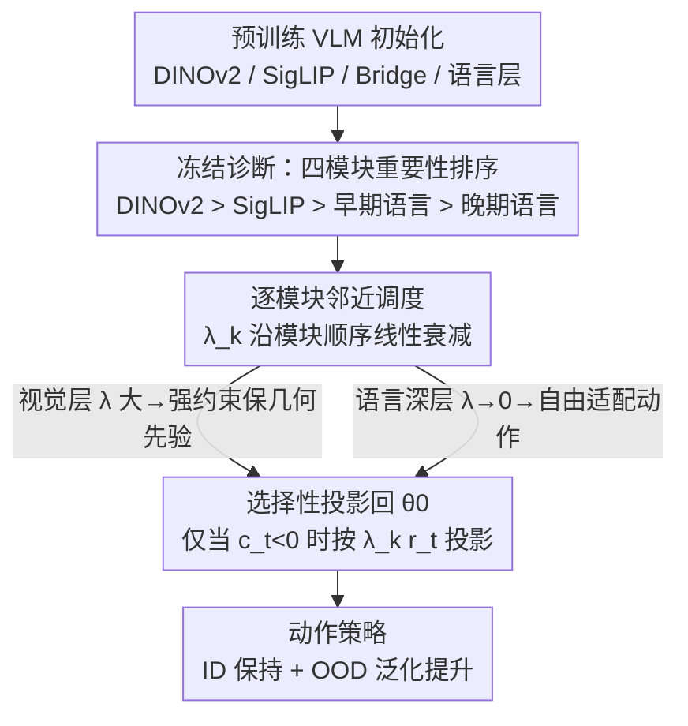

# MAPS: Preserving Vision-Language Representations via Module-Wise Proximity Scheduling for Better Vision-Language-Action Generalization

**会议**: CVPR 2026  
**论文**: [CVF Open Access](https://openaccess.thecvf.com/content/CVPR2026/html/Huang_MAPS_Preserving_Vision-Language_Representations_via_Module-Wise_Proximity_Scheduling_for_Better_CVPR_2026_paper.html)  
**代码**: https://mapsvla.github.io （项目页）  
**领域**: 机器人 / VLA 泛化  
**关键词**: VLA、鲁棒微调、灾难性遗忘、投影正则、逐模块调度

## 一句话总结
针对 VLA 模型从 VLM 初始化后一微调就破坏预训练表示、丢失泛化能力的问题，MAPS 把鲁棒微调里的"全局邻近约束强度"改成一条沿"视觉编码器 → 语言层"线性衰减的逐模块调度——让视觉层牢牢贴住预训练几何先验、让面向动作的语言层自由适配，不加任何参数和数据，就在 SimplerEnv / CALVIN / LIBERO 及真机 Franka 上把 OOD 泛化最多提升 30%。

## 研究背景与动机

**领域现状**：VLA（Vision-Language-Action）模型是机器人学习的统一范式——感知环境、理解语言指令、端到端输出动作。但机器人数据稀缺，从零训练不现实，于是几乎所有 VLA 都从在 web 规模数据上预训练好的 VLM（DINOv2、SigLIP、LLaMA 等）初始化，再在机器人数据上微调出动作策略。

**现有痛点**：这套"先借 VLM 先验、再微调学动作"的做法虽然任务性能强，却往往以**牺牲泛化**为代价——一旦遇到没见过的任务、物体或环境，性能就掉。根因是预训练（大规模、宽广）和机器人微调（稀疏、任务特定）之间的尺度错配：在小而专的机器人数据上过度微调会诱发虚假相关和过拟合，进而灾难性遗忘掉空间推理、世界知识和语言 grounding。已有工作也定位到证据：ReVLA 发现 DINOv2 编码器在微调后塌缩，深度估计退化成低细节、空间均匀的图；还有工作发现微调后的 VLA 在 OOD 下注意力跑到无关区域、特征空间被压成退化的团。

**核心矛盾**：VLA 训练的本质是在"动作适配"和"保留预训练泛化"之间权衡。微调太多 → 漂离预训练初始化、对分布偏移变脆；微调太少 → 对不齐动作空间。现有缓解手段各有硬伤：冻结视觉编码器保住了感知却限制了机器人特定适配；双编码器（一个冻一个训）翻倍内存和算力；权重插值（把视觉权重逐步拉回预训练态、同时调语言）要多阶段训练。这些方法大多只盯着"保视觉"，**忽视了语言组件里语义先验的角色**，而且都额外引入计算或架构复杂度。

**切入角度**：作者先回到最朴素的"模型冻结"做系统分析——把 VLA 拆成 DINOv2 / SigLIP / 早期语言层 / 晚期语言层四块，逐一冻结看 ID/OOD 表现。结论印证了一个常被假设但少被量化的直觉：视觉模块应被强约束、语言模块需更大灵活度，且各模块重要性存在清晰排序。但冻结本身又会引入任务相关的归纳偏置，某些冻结配置在新域上反而失效。于是作者转向更柔性的软正则（鲁棒微调 RFT），但发现现有 RFT 用**单一超参数对全模型施加统一约束强度**，隐含假设所有层应等量偏移——这恰恰不适合 VLA：不同组件编码不同先验、对微调敏感度不同。

**核心 idea**：用"沿模块顺序线性衰减的逐层邻近约束"取代 RFT 的全局单一约束——早期视觉层用最强约束贴住预训练几何先验，越往语言深层约束越松、自由适配动作语义；不加参数、不加数据、即插即用。

## 方法详解

### 整体框架

MAPS 不改 VLA 的网络结构，它是一个套在**动作微调阶段**上的鲁棒微调框架。整条逻辑分三步走：先做"冻结诊断"搞清楚哪些模块该保、哪些该放（4.1–4.2），再指出现有软正则的统一约束为什么不够（4.3），最后把约束强度做成沿模块线性衰减的调度器（4.4）。

它的底座是投影式鲁棒微调家族（L2-SP → TPGM → SPD）：这类方法在每步更新后，若参数漂离预训练初始化 $\theta_0$ 太远，就把更新后的权重投影回以 $\theta_0$ 为心的球内。SPD（Selective Projection Decay）进一步用一个全局标量 $\lambda$ 控制"约束半径扩张/收缩的激进程度"。MAPS 的全部改动就一句话：把 SPD 那个**对全模型统一的 $\lambda$，换成逐模块、随架构顺序线性衰减的 $\lambda_k$**。

### 关键设计

**1. 冻结诊断：用系统性消融量出"四模块重要性排序"**

MAPS 没有一上来就设计调度器，而是先回答"到底哪些模块该保、哪些该放"。作者把 VLA（以 OpenVLA 家族为例，它把 DINOv2 和 SigLIP 拼成联合视觉编码器）拆成四块——DINOv2、SigLIP、早期语言层、晚期语言层——枚举各种冻结组合，在 ID 和 OOD 上测。这一步把"视觉该冻"的民间直觉做成了可量化的证据，并得到五条关键观察：① 语言适配必不可少（冻住整个语言 backbone 会让 SimplerEnv 近乎归零、LIBERO 掉最多 60%）；② 冻视觉编码器普遍涨点（SimplerEnv 上 ID +7–17%、OOD +7–25%）；③ 晚期语言层驱动任务性能（只调晚期、冻早期语言能让 OOD +1–3%，因为它们直接产出动作）；④ 保 DINOv2 比保 SigLIP 更重要（冻 DINOv2 的 OOD 比冻 SigLIP 高约 5%，几何先验比视觉-语言对齐更关键）；⑤ 冻结效果并非处处一致——某些配置在一个 benchmark 涨、另一个却掉，说明硬冻会注入任务相关的归纳偏置。综合起来得到一条清晰的重要性梯度：

$$\text{DINOv2} > \text{SigLIP} > \text{早期语言} > \text{晚期语言}$$

这条排序正是后面线性调度方向的依据——越靠视觉前端越该强约束、越靠语言后端越该放开。

**2. 从硬冻到软约束：指出统一约束 RFT 的失配**

冻结给了模块化（可精确选哪些能力保留），但代价是强归纳偏置、在新域上脆。自然的替代是软正则——鲁棒微调（RFT），它不禁止更新而是引导更新。但作者发现把现成 RFT 直接搬到动作微调上，相比 baseline 只有微弱提升。原因在公式里：L2-SP 用 $\mathcal{L}_{\text{L2-SP}}=\mathcal{L}(\theta_t)+\frac{\lambda_{\text{reg}}}{2}\lVert\theta_t-\theta_0\rVert_2^2$ 惩罚漂移，TPGM 改成硬约束 $\lVert\theta_t-\theta_0\rVert_2\le\gamma$ 并投影回球内，SPD 再用单标量 $\lambda$ 控制半径动态——但**这三者都是一个全局超参管全模型**，意味着所有层以同一速率向预训练态收缩或扩张。可第 1 点的诊断恰恰说明：不同组件应以不同速率演化，有的该保几何先验、有的该放开学动作。统一约束把这个结构性差异抹平了，所以 naive RFT 只能拿到平庸收益。这一点为"约束必须逐模块化"提供了直接动机。

**3. 逐模块邻近调度：把全局 λ 换成沿模块线性衰减的 $\lambda_k$**

这是 MAPS 的核心。把模型子模块按架构顺序排成有序栈 $L=(\ell_1,\dots,\ell_{|L|})$，顺序为 DINOv2 → SigLIP → Bridge → 语言层。对第 $k$ 个模块，邻近强度按线性衰减分配：

$$\lambda_k=\lambda_{\max}\left(1-\frac{k-1}{|L|-1}\right)$$

于是早期视觉层拿到最强约束 $\lambda_1=\lambda_{\max}$，语言末端衰减到 $\lambda_{|L|}=0$（完全自由微调）。对所有从零初始化、没有预训练 $\theta_0$ 可保的模块（动作头、本体状态投影器等），直接令 $\lambda_k=0$ 做全量微调。优化时 MAPS 先算无约束步 $\tilde\theta_t$，再看梯度-位移相关 $c_t:=-g_t^\top(\theta_{t-1}-\theta_0)$；只有当 $c_t<0$（更新方向与"保预训练结构"相悖）时，才按模块特定强度投影回 $\theta_0$：

$$\theta_t\leftarrow\tilde\theta_t-\lambda_k\, r_t\,(\tilde\theta_t-\theta_0)$$

其中 $r_t$ 是 SPD 的偏移比（deviation ratio，由当前与上一步的偏移半径之比给出）。和 SPD 的关键区别在于：SPD 一个全局约束无法区分梯度尺度或语义角色不同的层，而 MAPS 把架构结构显式编码进约束里——DINOv2 漂移最小、SigLIP 次之、语言层适配最多（见原文 Fig.3 的 $\ell_2$ 距离曲线呈平滑、模块感知的衰减）。论文还指出线性调度优于常数和余弦调度，印证了"结构化的逐层邻近控制"是有效的。整套机制即插即用、零额外参数/网络/数据，可直接套到现有 VLA 上。

### 损失函数 / 训练策略
MAPS 不引入新的 loss 项，任务损失仍是各 backbone 原生的动作目标（如 ℓ1 回归、扩散去噪、flow matching、或离散动作 token 的分类）。它只在优化器的更新步里插入"按 $\lambda_k$ 的选择性投影"。所有 benchmark 上作者都直接微调底座 VLM 权重（从预训练 VLM 初始化、用 MAPS 从头训），不依赖任何外部预训练（如 Open X-Embodiment）。

## 实验关键数据

### 冻结诊断（动机表）

四模块冻结配置在 SimplerEnv / LIBERO 上的关键趋势（"冻"=保留预训练、"\\"=全量微调），支撑重要性排序：

| 配置要点 | 现象 | 推论 |
|----------|------|------|
| 冻整个语言 backbone | SimplerEnv 近 0，LIBERO 掉最多 60% | 语言适配必不可少 |
| 冻视觉编码器 | SimplerEnv ID +7–17%、OOD +7–25% | 保视觉先验普遍有益 |
| 冻早期语言、调晚期语言 | OOD +1–3% | 晚期语言层产出动作 |
| 冻 DINOv2 vs 冻 SigLIP | DINOv2 高约 5% OOD | 几何先验 > 视觉-语言对齐 |
| 某些冻结配置 | 一个 benchmark 涨、另一个掉 | 硬冻注入任务相关偏置 |

### 主实验

各 backbone 上 MAPS（相对 vanilla 全量微调）的 OOD 均值变化，跨 SimplerEnv / LIBERO / 真机：

| Backbone / Benchmark | 指标 | Vanilla | +MAPS | Δ |
|----------------------|------|---------|-------|---|
| MiniVLA-OFT / SimplerEnv | Avg. ID | 13.5 | 30.0 | +16.5 |
| MiniVLA-OFT / SimplerEnv | Avg. OOD | 8.9 | 35.8 | **+26.9** |
| OpenVLA-OFT / SimplerEnv | Avg. OOD | 8.7 | 17.1 | +8.4 |
| MiniVLA-VQ / LIBERO | Avg. OOD | 0.0 | 4.75 | +4.75 |
| MiniVLA-OFT / LIBERO | Avg. OOD | 4.75 | 7.0 | +2.25 |
| Franka 真机 / MiniVLA-OFT | Avg. ID | 40.0 | 72.5 | +32.5 |
| Franka 真机 / MiniVLA-OFT | Avg. OOD | 22.5 | 52.5 | +30.0 |

值得注意的是：MiniVLA-OFT 在 SimplerEnv 上仅用 BridgeData V2 这一小预训练语料，加 MAPS 后 OOD 就追平甚至超过 RT-1-X（OOD 3.4）、Octo（10.6）、π0（40.9 体量大得多）等大模型；CALVIN 上 MAPS 给 MiniVLA-OFT 带来 +0.7 平均序列长度、2–5 连续任务成功率各涨约 15%；越强的 baseline（OpenVLA-OFT）增益越小但仍正，说明 MAPS 是补充而非替代已有能力。

### 关键发现
- **贡献最大的不是"保更多"而是"按层差异化保"**：naive RFT 用统一约束只有微弱提升，把它换成线性衰减的逐模块调度后 OOD 才大幅起飞——说明收益来自"结构化的差异约束"本身。
- **OOD 提升远大于 ID**：多数 backbone 上 ID 基本持平（甚至个别小掉），OOD 显著涨（SimplerEnv MiniVLA-OFT +26.9）。这正符合设计意图——保住预训练泛化、同时不牺牲拟合。
- **真机增益最大**：Franka 上 ID +32.5、OOD +30.0，比仿真更猛，说明在数据更稀（每任务 150 条示范）、分布偏移更真实时，保预训练先验的价值更突出。
- **调度形状重要**：线性优于常数和余弦，方向与冻结诊断给出的重要性梯度一致。

## 亮点与洞察
- **把"民间直觉"做成可量化梯度再据此设计**：先用系统冻结消融量出 DINOv2 > SigLIP > 早语言 > 晚语言，再让调度方向严格对上这条梯度——动机不是拍脑袋，是数据驱动的，这套"先诊断后设计"的范式可迁移到任何"预训练→下游微调"的保泛化问题。
- **改动小到只有一行，却抓住了 RFT 的真正瓶颈**：把 SPD 的全局 $\lambda$ 换成 $\lambda_k=\lambda_{\max}(1-\frac{k-1}{|L|-1})$，零额外参数/数据/网络、即插即用，工程落地几乎无成本。
- **"让对的模块以对的速度漂移"是个通用原则**：对从零初始化的动作头直接 $\lambda_k=0$ 全量训、对视觉前端强约束——这种"按是否有预训练先验、按结构位置决定约束强度"的思路，可直接搬到其他多模块异构微调（如多模态大模型 SFT、LoRA 分层强度）。

## 局限与展望
- **调度形状是手工设定的线性函数**：虽然实验证明线性优于常数/余弦，但"线性"未必是各架构最优；衰减曲线、$\lambda_{\max}$ 仍是需要调的超参，缺少自适应学习调度的机制。
- **模块顺序依赖人为划定的栈**：DINOv2 → SigLIP → Bridge → 语言层这个排序在 OpenVLA 家族清晰，但对结构差异更大、或视觉/语言深度交织的 VLA，"沿栈线性衰减"的前提是否成立尚需验证（NORA 在附录有补充，但主表覆盖仍以 OpenVLA 家族为主）。
- **LIBERO 绝对数值偏低**：多数 backbone 的 OOD 成功率仍在个位数（如 MiniVLA-VQ +MAPS 的 Avg.OOD 仅 4.75%），MAPS 是相对提升明显但绝对泛化能力离实用仍远，部分源于"只在 LIBERO-90 上预训练、不借外部大规模预训练"的苛刻协议。
- 个别配置 ID 轻微下降（如 OpenVLA-OFT LIBERO ID 92→90），说明强约束视觉层偶尔也会略损 ID 拟合，存在细微权衡。

## 相关工作与启发
- **vs 冻结 / 双编码器（ReVLA、Dual-encoder）**：它们用硬冻或额外可训副本保视觉，要么注入强归纳偏置在新域变脆、要么翻倍算力内存；MAPS 用软的逐模块投影约束，无额外参数且把语言侧的语义先验也纳入考量。
- **vs 权重插值（ReVLA 的 vision 插值）**：插值把视觉权重逐步拉回预训练态需多阶段训练；MAPS 单阶段、端到端，靠 $\lambda_k$ 在每步优化里自动控制漂移。
- **vs 统一鲁棒微调（L2-SP / TPGM / SPD）**：它们用单一全局约束假设所有层等量偏移，对组件异构的 VLA 失配；MAPS 把 SPD 的全局 $\lambda$ 升级为架构感知的逐层调度，是对 SPD 的直接、最小化扩展。

## 评分
- 新颖性: ⭐⭐⭐⭐ 不是全新范式而是对 SPD 的最小化扩展，但"先量化模块重要性、再据此做线性调度"的思路扎实且切中 VLA 痛点。
- 实验充分度: ⭐⭐⭐⭐⭐ 五个 backbone × SimplerEnv/CALVIN/LIBERO 三仿真 + Franka 真机，附带冻结诊断和调度形状消融，覆盖全面。
- 写作质量: ⭐⭐⭐⭐ 从冻结诊断到软约束再到调度的逻辑链清晰，公式推导（L2-SP→TPGM→SPD→MAPS）交代到位。
- 价值: ⭐⭐⭐⭐ 零成本即插即用、最多 +30% OOD，对 VLA 微调实践直接有用，"按层差异化保泛化"原则可迁移性强。

<!-- RELATED:START -->

## 相关论文

- [\[CVPR 2026\] MoEActok: A MoE-based Action Tokenizer for Vision-Language-Action Models](moeactok_a_moe-based_action_tokenizer_for_vision-language-action_models.md)
- [\[CVPR 2026\] ACoT-VLA: Action Chain-of-Thought for Vision-Language-Action Models](acot-vla_action_chain-of-thought_for_vision-language-action_models.md)
- [\[CVPR 2026\] SRPO: Self-Referential Policy Optimization for Vision-Language-Action Models](srpo_self-referential_policy_optimization_for_vision-language-action_models.md)
- [\[CVPR 2026\] QuantVLA: Scale-Calibrated Post-Training Quantization for Vision-Language-Action Models](quantvla_scale-calibrated_post-training_quantization_for_vision-language-action_.md)
- [\[CVPR 2026\] Counterfactual VLA: Self-Reflective Vision-Language-Action Model with Adaptive Reasoning](counterfactual_vla_self-reflective_vision-language-action_model_with_adaptive_re.md)

<!-- RELATED:END -->
