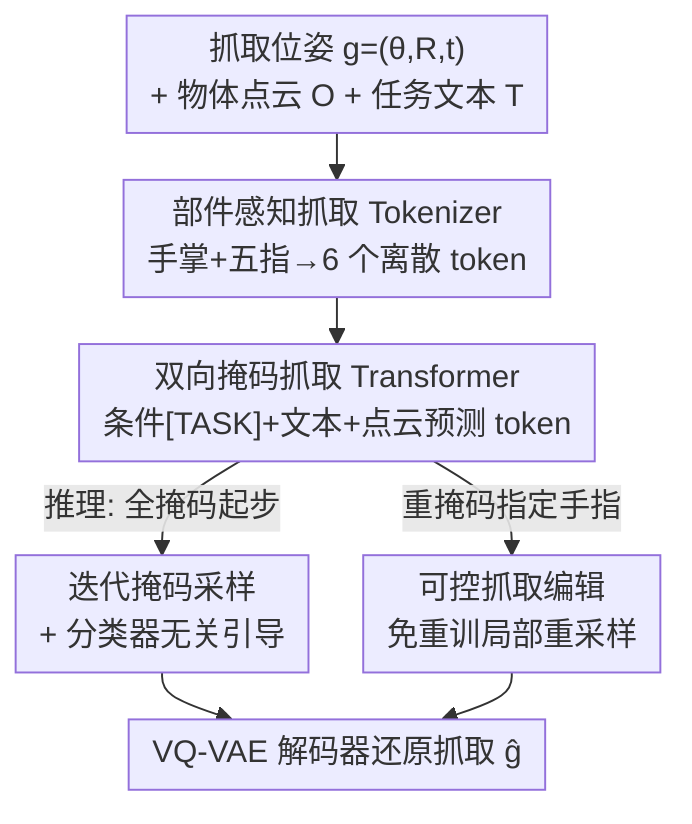

# MaskDexGrasp: Generative Masked Modeling for Part-Aware Dexterous Grasp Synthesis

**会议**: CVPR 2026  
**论文**: [CVF Open Access](https://openaccess.thecvf.com/content/CVPR2026/html/Zuo_MaskDexGrasp_Generative_Masked_Modeling_for_Part-Aware_Dexterous_Grasp_Synthesis_CVPR_2026_paper.html)  
**领域**: 机器人 / 灵巧抓取合成  
**关键词**: 灵巧抓取, 部件感知, VQ-VAE, 掩码生成, 可控编辑

## 一句话总结
MaskDexGrasp 把灵巧手抓取按手部解剖结构拆成「手掌 + 五指」六个部件、用 VQ-VAE 量化成离散 token，再用一个双向掩码 Transformer 在物体点云和任务文本条件下迭代采样这些 token，从而生成高质量、语义对齐且可逐指编辑的抓取，并在自建的 TDG 数据集（6.5 万抓取 / 26 万文本 / 11 类任务）上取得 SOTA。

## 研究背景与动机

**领域现状**：灵巧抓取生成是机器人迈向人类级操作的核心任务。主流生成式做法把整只手的位姿压进一个紧凑的连续隐空间——VAE 类或扩散类模型——再从中采样出抓取。

**现有痛点**：灵巧手（如 Shadow Hand）有 22 个关节自由度，加上全局旋转、平移，动作空间极高维。把整个抓取「整体地（holistically）」编码成单个隐向量，会抹掉手部本身的结构化、模块化语义——每根手指其实在抓取里扮演着不同又相互配合的功能角色，而整体隐空间根本无法解耦「某根手指如何响应某个条件信号」。结果是精细协调学不好、跨任务跨物体几何的泛化差。另一个痛点是条件：很多方法只拿物体几何当条件，生成的抓取缺乏语义一致性；少数引入任务描述的方法又因为文本多样性不足，导致任务条件含糊。

**核心矛盾**：高维整体隐空间的「紧凑」与手部天然的「部件化结构」之间存在根本冲突——你想要可控、可解耦、语义对齐，但整体表征恰恰把这些结构信息揉成了一团。

**本文目标**：把「结构化分解」「文本驱动条件」「可控抓取生成」三件事统一进一个生成框架里，让抓取既高质量又能逐部件地编辑。

**切入角度**：作者观察到灵巧抓取可以按层次分解为部件级的手部基元（part-level hand primitives），每个基元功能不同但相互依赖。受人体动作生成里「离散表征 + 自回归」成功经验启发，把抓取也离散化。

**核心 idea**：用「部件感知的离散 token + 双向掩码生成」代替「整体连续隐向量 + 单步解码」，来解决高维灵巧抓取的结构解耦与可控生成问题。

## 方法详解

### 整体框架
MaskDexGrasp 要解决的是「如何在保留手部部件结构的前提下，条件可控地生成灵巧抓取」。整条管线分两个训练阶段、一个推理阶段：先训一个**部件感知抓取 tokenizer**（VQ-VAE），把一个抓取位姿离散化成 6 个 token（手掌 + 五指各一个）；再训一个**双向掩码抓取 Transformer（BMGT）**，在物体点云和任务文本条件下预测这 6 个 token；推理时从「全掩码」序列出发，**迭代掩码采样**逐步填出 token，并用 classifier-free guidance 提质，最后由 VQ-VAE 解码器还原成抓取。离散表征还自带一个红利——**可控编辑**：只重掩码某几根手指的 token、重新采样即可改局部抓取，无需重训。

### 关键设计

**1. 部件感知抓取 Tokenizer：把整只手拆成六个部件再离散化，破解整体隐空间抹掉结构的痛点**

针对「整体隐向量抹掉手部模块化语义」这个核心痛点，作者不再用一个编码器吞下整只手，而是把抓取沿解剖结构拆开。具体做法：用 Shadow Hand 把抓取参数化为 $g=(\theta, R, t)$，其中 $\theta\in\mathbb{R}^{22}$ 是 22 个关节角、$R\in SO(3)$ 是全局朝向、$t\in\mathbb{R}^3$ 是平移；通过前向运动学把 $g$ 转成手表面采样点 $H\in\mathbb{R}^{2000\times3}$，再按解剖结构切成 $N=6$ 个部件 $\{H_i\}$（手掌 + 拇指/食指/中指/无名指/小指）。每个部件单独经一个 PointNet 编码器 $E_i$ 得到隐向量 $z_i=E_i(H_i)$，然后各自在一本可学习码本 $B_i=\{b_i^k\}_{k=1}^K$ 里找最近邻量化：

$$\hat z_i = b_i^{s_i},\quad s_i = \arg\min_k \lVert z_i - b_i^k\rVert_2$$

于是整只手被压成一个长度仅 6 的索引序列 $S=\{s_1,\dots,s_6\}$，是抓取的「组合式表征」。训练沿用标准 VQ-VAE 目标——重建损失 + commitment 损失（含 stop-gradient $sg[\cdot]$ 和权重 $\beta$），其中重建损失同时约束位姿参数和表面点 $L_{rec}=\lVert\hat g - g\rVert_2 + \sum_i\lVert\hat H_i - H_i\rVert$。这样做之所以有效，是因为「每根手指一个 token」天然对应人手「每指功能不同又协调」的结构，把复杂的抓取流形变成可组合推理、可逐部件操作的离散空间。为防码本坍缩，还用了 EMA 更新和码本重置。

**2. 双向掩码抓取 Transformer（BMGT）：用双向掩码而非单向自回归来同时建模局部协调与全局依赖**

有了 6 个 token，剩下的问题是怎么在条件下生成它们。如果照搬标准自回归（按 next-index 顺序逐个预测），就只能看到前文、看不到后文，对「五指之间相互依赖」这种全局协调建模不利。BMGT 改用**双向掩码建模**：把序列 $S$ 里随机一部分 token 掩成 $[MASK]$ 得到损坏序列 $S_M$，让网络在条件 $C$ 下同时利用前后上下文恢复被掩 token，目标是最大化 $\sum_i \log p(s_i\mid S_M, C)$。条件 $C$ 由三路拼成：一个从任务 ID 学来的任务嵌入 $[TASK]$、一个 CLIP 编码的文本嵌入 $t=F_T(T)$、一个 PointNet 编码的物体几何嵌入 $o=F_O(O)$，即 $C=[[TASK];t;o]$。掩码比例随训练用余弦调度 $\gamma(\tau)=\cos(\frac{\pi\tau}{2})$。相比单向自回归，双向掩码让每个 token 都能「看全局」，因此既抓住了局部手指内的协调，也建模了跨手指的整体依赖——这正是抓取质量与语义对齐的关键。

**3. 迭代掩码采样 + 分类器无关引导：推理时从全掩码逐步填出高保真又多样的抓取**

推理不是一步生成，而是从全掩码序列 $S^{(0)}=\{[MASK]_1,\dots,[MASK]_N\}$ 出发，跑 $T$ 轮迭代：每轮 BMGT 预测各掩码位的 token 及其置信度，置信度最低的那批（数量约 $\gamma(\frac{t}{T})\cdot N$）被重新掩回、留待下轮预测，高置信的保留，直到全部确定，最后解码成 $\hat g$。这种「score-based 逐步收敛」既保证生成质量又控制步数。在此之上叠加 classifier-free guidance：训练时以 $p_{uncond}=10\%$ 概率丢弃条件，推理时按引导尺度 $s$ 把条件 logits 推离无条件 logits，$\omega_g=(1+s)\cdot\omega_c - s\cdot\omega_u$，在保真度与多样性之间取得平衡。由于序列长度固定为 6，不需要 $[END]$ token。

**4. 可控抓取编辑：离散 token + 双向掩码天然支持免重训的逐指修改**

部件感知量化和双向掩码合起来还白送了一个能力：局部编辑。对一个已估计的 token 序列 $\hat S$，只要把需要修改的手指对应 token 重新掩掉、在新条件 $C'$ 下重采样即可。形式上，给定可编辑区域 $\Omega$，固定未掩上下文 $S_{\bar\Omega}$，只更新 $\tilde S_\Omega \sim p(S_\Omega\mid S_{\bar\Omega}, C')$，再解码出编辑后的抓取 $\tilde g$。关键是这一切**无需重训**——因为每根手指本就是独立 token，改一个不牵动其余，这给交互式抓取调整、任务自适应提供了直接可解释的接口。

### 损失函数 / 训练策略
两阶段训练：① Tokenizer 用 VQ-VAE 目标 $L_{VQ}=L_{rec}+\sum_i(\lVert sg[z_i]-\hat z_i\rVert_2^2 + \beta\lVert z_i - sg[\hat z_i]\rVert_2^2)$，码本 $256\times512$，训 200 epoch、batch 256，约 7 小时；② BMGT 最小化掩码 token 的负对数似然 $L_{AR}=-\sum_i\log p(s_i\mid S_M,([TASK];t;o))$，9 层 Transformer、16 头、嵌入维 512，训 500 epoch、batch 128，约 18 小时；均在单张 RTX 4070Ti Super 上完成。

## 实验关键数据

### 主实验
在自建 TDG 的两个子集（Subset 1 = AffordPose 来源，Subset 2 = OakShape 来源）上对比 5 个生成式基线，五个指标涵盖质量与多样性。

| 数据集 | 方法 | Suc.↑ | Q1↑ | Pen.↓ | Hmean↑ | Hstd↓ |
|--------|------|-------|-----|-------|--------|-------|
| Subset 1 | DexGraspAnything | 46.54 | 0.042 | 0.376 | **4.207** | 0.377 |
| Subset 1 | **Ours** | 44.68 | **0.048** | **0.340** | 3.876 | 0.421 |
| Subset 2 | DexGraspAnything | 58.90 | 0.125 | 0.477 | 3.662 | 0.253 |
| Subset 2 | **Ours** | **75.16** | **0.126** | 0.413 | **3.922** | 0.406 |

本文在 Subset 2 上成功率从 58.90 跳到 75.16（+16 点），在抓取稳定性 Q1 和穿透深度 Pen. 上几乎全面领先；Subset 1 成功率略逊于 DexGraspAnything（44.68 vs 46.54），但 Q1、Pen. 更优。作者指出 DGTR 穿透看似低实则源于抓取不稳（成功率最差），而扩散类方法在多样性（Hmean）上有优势是 VQ-VAE 的天然短板，综合质量后本文仍占优。

### 效率与编辑
| 指标 | DGTR | DexGYS | SceneDiffuser | UGG | DexGraspAnything | Ours |
|------|------|--------|---------------|-----|------------------|------|
| 参数量 (M)↓ | 3.85 | 23.14 | 22.98 | 67.03 | 159.68 | 71.29 |
| 单次推理时间 (s)↓ | 0.284 | 0.202 | 1.130 | 3.236 | 4.417 | **0.033** |

推理速度碾压式领先：0.033s，比最强基线 DexGraspAnything（4.417s）快约 130 倍，因为扩散类方法至少要 50 步去噪，而本文迭代采样步数极少。编辑实验验证了可逐指（一两根手指）修改而不扰动整体配置、不需重训。

### 消融实验
| 配置 | Subset 2 Suc.↑ | Subset 2 Pen.↓ | 说明 |
|------|------|------|------|
| w/ vanilla VQ-VAE | 50.63 | 0.498 | 单编码器整手压隐空间，去掉部件结构 |
| 码本 128×256 | 61.64 | 0.482 | 码本偏小 |
| 码本 512×1024 | 72.57 | 0.410 | 码本偏大 |
| iteration 3 | 74.47 | 0.464 | 迭代 3 步 |
| iteration 5 | 74.66 | 0.409 | 迭代 5 步 |
| **Ours (256×512)** | **75.16** | 0.413 | 完整模型 |

### 关键发现
- **部件感知结构贡献最大**：换成 vanilla 整手 VQ-VAE 后 Subset 2 成功率从 75.16 掉到 50.63（−24.5 点），证明「按手指拆 token」是性能主来源，而非单纯的离散化。
- **码本维度有甜点**：太小（128×256）欠拟合、太大（512×1024）反而略降且参数翻倍，作者选的 256×512 在精度与算力间最优，也缓解了码本坍缩。
- **迭代步数边际递减**：3 步已能到 74+，加到 5 步收益微乎其微却更慢，说明少量迭代即可收敛，是其极快推理的来源。
- 真机部署（XArm7 机械臂 + Freedom 五指手）能稳定抓起多种物体，验证了仿真到现实的可迁移性。

## 亮点与洞察
- **「每根手指一个 token」是全文的题眼**：把人手解剖结构直接映射成离散序列结构，既符合直觉又带来三重红利（结构解耦、组合推理、免重训局部编辑），消融里 −24 点的掉幅说明这不是锦上添花而是性能命脉。
- **借用人体动作生成的成熟范式跨界到抓取**：把「VQ-VAE 离散码本 + 双向掩码 Transformer（类 MaskGIT/MoMask）」这套在 motion generation 里验证过的配方迁移到灵巧抓取，是一次漂亮的跨任务嫁接，这个迁移思路也可用于其它高维结构化位姿生成（如全身姿态、双手协同）。
- **离散表征顺手解决了「可编辑性」这个机器人交互痛点**：传统连续隐空间改局部要么牵一发动全身、要么得重训，而 token 级重掩采样天然支持「只换无名指」，对交互式人机协作很实用。
- **速度优势来自范式而非工程**：0.033s 不是靠堆算力，而是「固定长度 6 token + 少步迭代」对比扩散「50 步去噪」的本质差异，提示在抓取这类低维输出上离散迭代采样可能比扩散更划算。

## 局限与展望
- **作者承认**：框架依赖有限的离散空间和离线 tokenization，可能限制多样性和对连续控制的适应性；扩散基线在 Hmean 多样性上确有优势（Subset 1 本文 3.876 vs 4.207），是 VQ-VAE 的固有短板。
- **静态单步抓取**：当前只生成一个静态抓取位姿，未涉及动态抓取轨迹和多步操作；作者将其列为未来方向（动态抓取生成、多步操作）。
- **Subset 1 成功率未夺冠**（44.68 < 46.54），说明部件离散表征在某些数据分布上对成功率的提升不如对稳定性/穿透的提升明显，两个子集结论不完全一致需谨慎解读。
- **数据集自建带来的可比性顾虑**：所有基线都在 TDG 上重训评测，虽公平但缺乏与原论文报告值的横向对照；TDG 文本标注由 VLM（qwen-vl-max）生成，标注质量与偏差未充分量化。

## 相关工作与启发
- **vs 整体隐空间生成（UGG / DexGraspAnything 等 VAE/扩散）**：他们把整只手压成单个连续隐向量，本文按手指拆成 6 个离散 token，区别在于保留了部件结构与可编辑性，优势是更快、更稳、可逐指改，劣势是离散表征的多样性略逊扩散。
- **vs 任务条件抓取（DexGYS / DGTR）**：他们也引入语义/任务条件，但多在整体隐空间里做，难以解耦「哪根手指响应哪个条件」；本文用部件 token + 双向掩码让条件能作用到局部，语义对齐更精细。
- **vs 人体动作生成里的离散范式（MoMask 类）**：本文继承了「VQ + 双向掩码迭代采样 + CFG」的核心机制，创新点在于把单一动作序列的时序 token 换成了手部部件的解剖 token，并叠加多模态条件（点云 + 任务 + 文本）。

## 评分
- 新颖性: ⭐⭐⭐⭐ 部件级离散 token 的抓取建模角度新颖，但底层范式（VQ + 掩码生成）借自动作生成领域。
- 实验充分度: ⭐⭐⭐⭐ 五指标、两子集、速度/编辑/真机俱全，消融到位；惜乎两子集结论不完全一致、数据集自建削弱横向可比性。
- 写作质量: ⭐⭐⭐⭐ 动机—方法—实验逻辑清晰，公式规范，图示对照充分。
- 价值: ⭐⭐⭐⭐ 兼顾质量、极快推理与可控编辑，并附 6.5 万规模 TDG 数据集，对灵巧抓取社区有实用价值。

<!-- RELATED:START -->

## 相关论文

- [\[CVPR 2026\] DextER: Language-driven Dexterous Grasp Generation with Embodied Reasoning](dexter_language-driven_dexterous_grasp_generation_with_embodied_reasoning.md)
- [\[CVPR 2026\] GeoDexGrasp: Geometry-aware Generation for Data-efficient and Physics-plausible Dexterous Grasping](geodexgrasp_geometry-aware_generation_for_data-efficient_and_physics-plausible_d.md)
- [\[ICCV 2025\] DexVLG: Dexterous Vision-Language-Grasp Model at Scale](../../ICCV2025/robotics/dexvlg_dexterous_vision-language-grasp_model_at_scale.md)
- [\[AAAI 2026\] Towards Affordance-Aware Robotic Dexterous Grasping with Human-like Priors](../../AAAI2026/robotics/towards_affordance-aware_robotic_dexterous_grasping_with_human-like_priors.md)
- [\[CVPR 2026\] Iterative Closed-Loop Motion Synthesis for Scaling the Capabilities of Humanoid Control](iterative_closed-loop_motion_synthesis_for_scaling_the_capabilities_of_humanoid_.md)

<!-- RELATED:END -->
