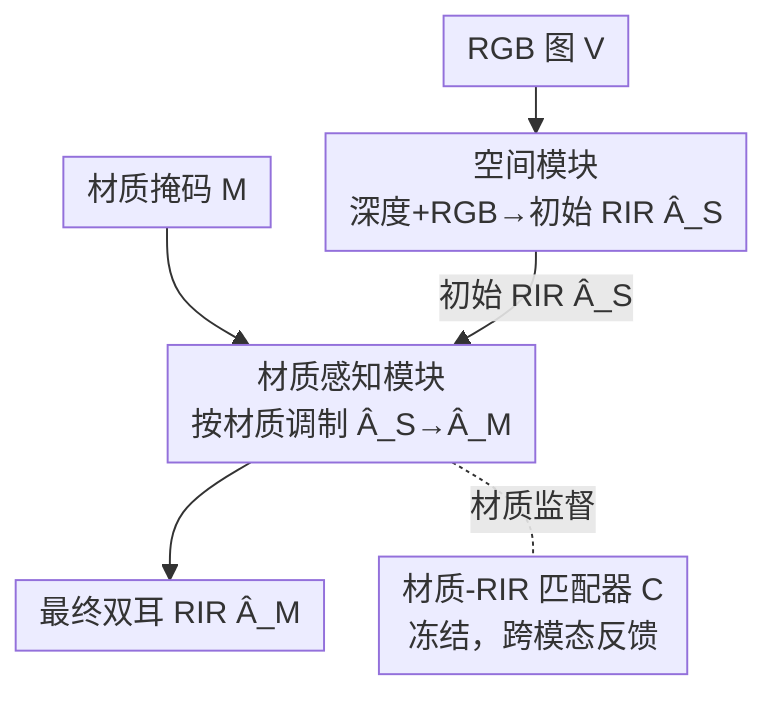

# Materialistic RIR: Material Conditioned Realistic RIR Generation

**会议**: CVPR 2026  
**arXiv**: [2604.21119](https://arxiv.org/abs/2604.21119)  
**代码**: 无  
**领域**: 具身智能 / 声学渲染 / 多模态 RIR 生成  
**关键词**: 房间脉冲响应, 材质条件生成, 空间-材质解耦, 视觉到声学, 跨模态监督

## 一句话总结
给定一张室内 RGB 图和一张用户指定的「材质分割图」，MatRIR 用**空间模块**先预测只跟房间布局有关的初始 RIR，再用**材质感知模块**按材质把它"调制"成最终的双耳房间脉冲响应，从而让用户能在不改变空间结构的前提下任意换材质（如给地板铺地毯、给墙贴钢板）并听到对应的混响变化，在 RT60 误差上比最强基线再降约 16.8%、在材质一致性指标上提升约 71%。

## 研究背景与动机
**领域现状**：房间脉冲响应（Room Impulse Response, RIR）刻画了声音在场景里如何反射、吸收、散射后到达听者，把它和任意音频卷积就能复现"这段声音在这个房间里听起来是什么样"。近年主流做法是从 RGB、深度、音频等单/多模态观测里学习预测 RIR，绕开昂贵的物理波动仿真，用于 VR/AR、机器人、空间音频设计等。

**现有痛点**：这些方法几乎都把视觉、空间、材质线索**一股脑编码进同一个隐表示**里再去预测 RIR。这种联合编码让语义、材质、布局三者的贡献纠缠在一起，模型学到的是它们之间的隐式相关性——结果用户没法单独改某一个因素（比如"只把墙换成混凝土"）然后得到匹配的 RIR。最近的 M-CAPA 第一次支持对任意材质配置生成 RIR，但它**仍然是联合建模**材质和空间，表示依旧相关，细粒度控制有限；而且它依赖干净的音频输入，现实中难取。

**核心矛盾**：声学既受**空间布局**（墙、物体的几何排布决定反射路径）影响，又受**表面材质**（木头、混凝土、地毯的吸收/透射系数不同）影响，二者本应是两个独立可控的旋钮；但只要把它们塞进一个 latent 里联合学，就必然纠缠，材质这个旋钮就拧不动。

**本文目标**：(1) 在生成 RIR 时**显式解耦**空间与材质，让用户能换任意材质而保持空间结构不变；(2) 做到**纯视觉**输入（不依赖音频），更实用；(3) 补上标准 RIR 指标测不到的"材质敏感度"评估。

**切入角度**：与其指望网络自己从纠缠表示里分离材质，不如在**架构层面**就把两件事拆成两个串行模块——先只看空间几何产出一版初始 RIR，再让材质模块在它之上做调制。这样空间分量天然与材质无关，材质旋钮被物理隔离出来。

**核心 idea**：用"空间模块先估 RIR → 材质模块按材质掩码调制"的**两段式解耦架构**，替代"所有线索联合编码成一个 latent"的旧范式，从而获得可控、可解释、纯视觉的材质条件 RIR 生成。

## 方法详解

### 整体框架
MatRIR（Material-Aware RIR Network）要解决的是**材质条件 RIR 生成**：输入一张 $90^\circ$ FoV 的 RGB 图 $V$ 和一张材质分割掩码 $M$（每个像素是 $N$ 类材质之一），输出在相机位置录得的双耳 RIR 频谱图 $\hat{A}$（两通道、$256\times256$，对应 0.5s / 16kHz 的脉冲响应）。整套模型 $\mathcal{F}(V,M)=\hat{A}$ 由两个串行模块组成：**空间模块** $\mathcal{F}_S$ 只从图像里抽几何线索、产出一版只反映布局的初始 RIR $\hat{A}_S$；**材质感知模块** $\mathcal{F}_M$ 再拿 $\hat{A}_S$ 和材质掩码 $M$，把材质相关的吸收/反射/透射效应"调制"进去，得到最终 $\hat{A}_M$。训练时用一组损失同时约束 $\hat{A}_S$、$\hat{A}_M$ 与真值的声学一致性，并用一个冻结的"材质-RIR 匹配器"提供跨模态材质监督。

### 关键设计

**1. 空间模块：只看几何，产出与材质无关的初始 RIR**

旧方法把材质和空间塞进同一个 latent，导致材质旋钮拧不动；本文第一步就把空间分量彻底隔离出来。空间模块 $\mathcal{F}_S$ 先用预训练深度预测器 MiDaS 从 RGB 估出归一化深度图 $\hat{D}\in[0,1]^{H\times W}$，再用预训练 DINOv2-Large 分别把 $V$ 和 $\hat{D}$ 编码成视觉特征 $e_v$ 和深度特征 $e_d$（各取第 18 层、256 token、维度 1024）。深度给出粗的房间布局，RGB 补充物体与表面的细节排布，二者互补。空间 RIR 解码器 $\mathcal{R}_S$ 给两路特征各加上模态嵌入 $s_v,s_d$ 后投影融合成 $f\in\mathbb{R}^{256\times512}$，用一个 4 层 transformer decoder 配一组可学习"空间查询"去 cross-attend 抽出空间 RIR 特征 $g_s$；最后上采样网络 $\mathcal{U}_S$（4 层转置卷积）把 $g_s$ 还原成初始频谱图估计 $\hat{A}_S$。关键在于 $\hat{A}_S$ **完全不看材质**——论文的定性结果显示，同一场景换不同材质时 $\hat{A}_S$ 纹理保持不变，这正是解耦的直接证据

**2. 材质感知模块：在初始 RIR 上做材质调制而非重新生成**

有了与材质无关的 $\hat{A}_S$，材质模块 $\mathcal{F}_M$ 的任务不是从头生成 RIR，而是**调制**这版初始估计，注入透射、吸收、反射等材质相关效应。它先用同款 DINOv2-Large 把材质掩码 $M$ 编码成材质特征 $e_m\in\mathbb{R}^{256\times1024}$；同时从 $\hat{A}_S$ 的每个通道切 patch、用小 MLP 编成空间音频特征 $e_s$。材质 RIR 编码器 $\mathcal{R}_M$（4 层 transformer encoder）对 $e_m$、$e_s$ 以及一组**重加权 token** $R$（投影成 $e_r$）做自注意力，输出材质感知音频特征 $g_m$ 和重加权特征 $g_r$。最后上采样器 $\mathcal{U}_M$ 把 $g_m$ 还原成 $\hat{A}_M$，并用 $g_r$ 在每个上采样层调制特征的重要性。把"材质条件"实现成"在已有空间 RIR 上做注意力调制"，既保住了空间保真度，又让材质成为一个独立旋钮

**3. 重加权 token：让材质线索在不同分辨率上分层注入**

只在最后一层注入材质往往不够，材质对声学的影响在不同时频尺度上都有体现。本文引入四个**音频特征重加权 token** $R$，经 $\mathcal{R}_M$ 自注意力后产出 $g_r$，再在上采样器 $\mathcal{U}_M$ 的**每一层**用来调制（reweight）该层特征的重要性，相当于告诉网络"在这个分辨率上哪些音频特征对当前材质配置最重要"。消融显示去掉 $R$（表 2 行 b）后 RTE 从 77.18ms 暴涨到 142.4ms、MatC 从 89.29% 崩到 20.02%——分层注入材质线索是材质敏感度的关键来源

**4. 材质-RIR 匹配器 $\mathcal{C}$：用跨模态对齐损失补上材质监督**

光靠和真值 RIR 的回归损失，模型学到的材质敏感度有限。本文先**预训练**一个材质-RIR 匹配网络 $\mathcal{C}$：给匹配的 (RIR, 材质掩码) 对输出 1、不匹配输出 0。正式训练 $\mathcal{F}$ 时**冻结** $\mathcal{C}$，把 $M$ 和预测的 $\hat{A}_M$ 喂进去，用它评估"这版 RIR 和材质掩码有多匹配"，并把误差反传回 $\mathcal{F}_M$，作为辅助损失 $L_C$ 提供强材质条件监督。这等于给材质模块装了一个专门盯"材质对不对"的裁判。消融显示去掉 $\mathcal{C}$（表 2 行 a）后 MatC 从 89.29% 掉到 65.02%——这个跨模态裁判是材质分类准确率的主要贡献者

### 损失函数 / 训练策略
总损失 $\mathcal{L}=\mathcal{L}_S+\mathcal{L}_M$，同时监督初始估计和最终估计：

$$\mathcal{L}_S=\lambda_1\|\hat{A}_S-A\|_1+\lambda_2 L_D(\hat{A}_S,A)$$

$$\mathcal{L}_M=\lambda_1\|\hat{A}_M-A\|_1+\lambda_2 L_D(\hat{A}_M,A)+\lambda_3 L_C(\hat{A}_M,M)$$

其中 $\|\cdot\|_1$ 是预测与真值幅度谱之间的 L1 损失；$L_D$ 是能量衰减损失，约束预测与真值 RIR 的能量衰减曲线相似，帮助捕捉晚期混响；$L_C$ 是用冻结匹配器 $\mathcal{C}$ 算出的跨模态对应损失。训练用 Adam、余弦退火、初始学习率 $7\times10^{-5}$、batch size 150、单 GPU。

## 实验关键数据

数据集为 Acoustic Wonderland（AcoW，来自 M-CAPA）：76 个 seen 场景 + 8 个 unseen 场景，2673 种材质配置（2405 seen + 268 unseen），训练集 128 万样本；测试分三个 split——$D_{us}$（见过的材质配置）、$D_{uu}$（没见过的材质配置）、$D_{uk}$（没见过的配置配对），每个 2000 样本。指标：L1、STFT、RTE（RT60 误差，ms，越低越好）、CTE（早晚能量比误差，dB，越低越好）、以及本文新提的 MatC / MatD（材质分类/分布准确率，%，越高越好）。

### 主实验（unseen 场景三个 split 的代表数字）

| Split | 指标 | MatRIR | M-CAPA (最强基线) | Image2Reverb |
|-------|------|--------|------------------|--------------|
| $D_{us}$ | RTE↓ (ms) | **75.56** | 89.23 | 245.2 |
| $D_{us}$ | MatC↑ (%) | **89.26** | 9.32 | 10.01 |
| $D_{us}$ | MatD↑ (%) | **31.75** | 21.85 | 9.01 |
| $D_{uu}$ | RTE↓ (ms) | **77.18** | 92.80 | 223.3 |
| $D_{uu}$ | L1↓ (×$10^{-2}$) | **5.60** | 6.06 | 14.13 |
| $D_{uk}$ | RTE↓ (ms) | **77.69** | 91.75 | 244.5 |

RTE 在 $D_{us}$ 上从 89.23ms 降到 75.56ms（约 -15.3%；论文报告整体最高 -16.8%）；MatC 这一项基线普遍只有个位数到 10% 出头，MatRIR 直接拉到约 89%，平均提升约 71%。

### 消融实验（$D_{uu}$ split）

| 配置 | RTE↓ (ms) | MatC↑ (%) | MatD↑ (%) | 说明 |
|------|-----------|-----------|-----------|------|
| Full model | 77.18 | 89.29 | 31.0 | 完整模型 |
| a) w/o $\mathcal{C}$ | 78.94 | 65.02 | 29.30 | 去掉材质匹配器，MatC 掉 24 个点 |
| b) w/o $R$ | 142.4 | 20.02 | 11.20 | 去掉重加权 token，RTE 翻倍、MatC 崩 |
| c) w/ $(V,D)$ Only | 154.7 | 9.09 | 9.95 | 只有空间模块，材质指标全崩 |
| d) w/ $M$ Only | 97.78 | 18.20 | 17.25 | 只有材质模块，缺空间也不行 |

### 关键发现
- **重加权 token $R$ 贡献最大**：去掉它 RTE 从 77.18 暴涨到 142.4ms、MatC 从 89.29% 掉到 20.02%，说明把材质线索在多个分辨率分层注入是材质敏感度的命脉。
- **空间与材质缺一不可**：只用空间模块（行 c）材质指标全崩，只用材质模块（行 d）RTE 也明显变差——两类线索都必要，且**分开显式建模**比联合建模更有效。
- **标准指标与材质指标不总同向**：作者发现 RTE 改善不一定带来 MatC/MatD 改善，这正是要引入材质敏感指标的理由。
- **用户研究**：7 名被试各评 22 个样本，60.4% 的情况下认为 MatRIR 比 M-CAPA 更真实。
- **失败情形**：相机贴墙太近、视野受限时，模型会过度依赖空间线索、对材质不敏感（图 5），作者建议未来上 $360^\circ$ 全景视图。

## 亮点与洞察
- **把"解耦"做进架构而非寄望于损失**：很多工作想靠正则或对比学习从纠缠 latent 里分离因素，本文直接用"空间先估 → 材质后调制"的串行结构，让 $\hat{A}_S$ 天然与材质无关，定性图里同场景换材质 $\hat{A}_S$ 不变就是铁证——这种"用结构换可控性"的思路可迁到任何需要分离两类条件因素的生成任务。
- **冻结裁判网络提供跨模态监督**：预训练一个 (RIR, 材质) 匹配器再冻结当损失，等于用一个判别器把"材质对不对"这件难以直接回归的事变成可反传的信号，比单纯回归真值谱更能逼出材质敏感度，这个 trick 可复用到任何"输出难以逐像素监督、但能判断是否匹配条件"的场景。
- **指标也是贡献**：作者发现标准 RIR 指标根本测不出材质好坏，于是设计 MatC（单材质分类准确率）和 MatD（对材质分布做 k-means 成 36 簇后报 top-5 准确率）两个材质敏感指标——做新任务时连带补上能暴露问题的评估协议，是很扎实的做法。
- **纯视觉、可换材质**：相比依赖音频的 M-CAPA，MatRIR 只要 RGB + 材质掩码就能跑，更贴近"在设计软件里拖个材质就听效果"的真实交互。

## 局限与展望
- 作者承认的局限：相机贴墙、视野受限时模型退化为主要依赖空间线索、对材质不敏感；建议引入 $360^\circ$ 全景缓解。
- 材质输入依赖一张**密集材质分割掩码** $M$，现实中获取每个表面的材质标注本身就不简单（论文把它当用户指定输入，但真实部署时这块怎么来是个问号）。
- 评估只在合成的 Acoustic Wonderland 上做，真实房间的泛化、以及 0.5s/16kHz 这种较短低采样设置下对高频材质差异的刻画能力，文中未充分验证。
- 用户研究规模偏小（7 人 × 22 样本），60.4% 的偏好优势虽过半但不算压倒性，统计显著性可再加强。

## 相关工作与启发
- **vs M-CAPA**：M-CAPA 首次支持任意材质配置生成 RIR，但**联合建模**空间与材质、表示仍相关，且依赖音频输入；本文显式解耦成两个串行模块、纯视觉，RTE 再降约 16.8%、MatC 从个位数拉到约 89%，可控性和实用性都更强。
- **vs Image2Reverb / FAST-RIR++**：这两者是纯视觉 SOTA 但只建模空间布局、忽略材质，材质指标几乎为随机水平；本文证明"显式建材质"对真实感至关重要。
- **vs JM-* 联合建模基线**（JM-CNN / JM-Transformer / JM-QFormer）：它们用和本文相同的输入 $(V,\hat{D},M)$ 但**联合编码**，性能优于纯空间方法却仍逊于 MatRIR——直接对照说明"分开显式建模空间与材质"才是收益来源，而非单纯多喂了材质输入。

## 评分
- 新颖性: ⭐⭐⭐⭐ 把空间-材质解耦做进串行架构、配冻结匹配器跨模态监督，思路清晰且针对性强
- 实验充分度: ⭐⭐⭐⭐ 三 split + 充分消融 + 用户研究，但仅合成数据集、真实泛化未验证
- 写作质量: ⭐⭐⭐⭐ 动机与架构讲得通透，新指标定义清楚
- 价值: ⭐⭐⭐⭐ 给"可交互换材质听混响"这类 VR/声学设计应用提供了可控、纯视觉的实用方案

<!-- RELATED:START -->

## 相关论文

- [\[AAAI 2026\] Realistic Synthetic Household Data Generation at Scale](../../AAAI2026/robotics/realistic_synthetic_household_data_generation_at_scale.md)
- [\[ACL 2026\] GoViG: Goal-Conditioned Visual Navigation Instruction Generation via Multimodal Reasoning](../../ACL2026/robotics/govig_goal-conditioned_visual_navigation_instruction_generation_via_multimodal_r.md)
- [\[CVPR 2026\] MM-ACT: Learn from Multimodal Parallel Generation to Act](mm-act_learn_from_multimodal_parallel_generation_to_act.md)
- [\[CVPR 2026\] Towards Human-Like Robot Handwriting via Contour-Aware Generation](towards_human-like_robot_handwriting_via_contour-aware_generation.md)
- [\[CVPR 2026\] Scalable Trajectory Generation for Whole-Body Mobile Manipulation](scalable_trajectory_generation_for_whole-body_mobile_manipulation.md)

<!-- RELATED:END -->
