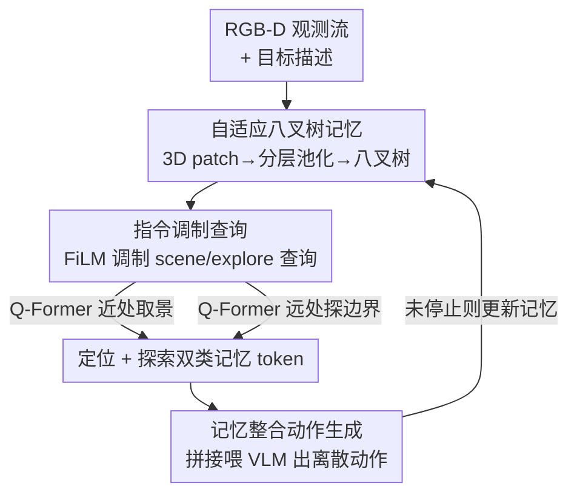

# Memory-Augmented Scene Understanding and Exploration for Open-World Aerial Object-Goal Navigation

**会议**: CVPR 2026  
**论文**: [CVF Open Access](https://openaccess.thecvf.com/content/CVPR2026/html/Zhou_Memory-Augmented_Scene_Understanding_and_Exploration_for_Open-World_Aerial_Object-Goal_Navigation_CVPR_2026_paper.html)  
**领域**: 具身导航 / 机器人 / 视觉语言导航  
**关键词**: 空中目标导航, UAV, 八叉树记忆, 指令调制查询, 具身智能

## 一句话总结
针对无人机在大尺度户外场景中"只给目标物体描述、没有逐步指令"的空中目标导航任务，本文提出 OctMem-Agent：用一个**自适应八叉树记忆**把历史 RGB-D 观测增量聚合成可扩展的分层 3D 表征，再用**指令调制的记忆查询**抽出"定位用"和"探索用"两类紧凑 token 喂给 VLA 决策，在 UAV-ON 基准上成功率比此前最优方法提升 7.5%。

## 研究背景与动机
**领域现状**：空中目标导航（Aerial ObjectNav）要求无人机仅凭视觉观测和一句高层物体描述（如"一个表面光滑、带绿色条纹的圆形水果"），自主飞到目标物体附近，没有逐步动作指令。这是无人机用于应急救援、搜救、快递投递的关键能力——这些场景往往通信中断、无法人工遥控。现有做法（AOA、OpenFly）大多是把当前帧加最近几帧/位姿历史直接喂给 VLM 生成动作。

**现有痛点**：这类方法只依赖局部观测和短期历史，缺乏全局场景理解和长期空间记忆。AOA 用当前观测+近期位姿，OpenFly 只用当前帧加前两帧——结果就是"近视决策"：无人机在大尺度户外反复绕飞、重复探索同一区域，找不到目标。

**核心矛盾**：能不能直接套用室内地面导航的场景表征？不能。室内导航常用的稠密体素地图、神经特征场内存随场景体积**立方级**增长，户外大尺度场景根本撑不住；而拓扑图、网格图这类稀疏表征是为室内物体级场景设计的，其离散抽象和层级结构在大尺度户外、且伴随剧烈高度/视角变化时泛化不了。一句话：**精度要细（近处要看清物体）和内存要省（远处不能炸）在大尺度空中场景里直接打架**。

**本文目标**：拆成两个子问题——（1）造一个既能保留近处细节、又能压缩远处大范围、还能随飞行增量扩展的空间记忆；（2）从这个记忆里**按当前任务**抽出真正有用的信息，既支持精确定位目标，又支持对未探索区域的主动探索。

**切入角度**：作者观察到，导航中"近"和"远"的诉求本质不同——精确逼近目标需要细粒度局部几何/语义，而有效探索只需要远处空间的粗略布局和"已探索/未探索边界（frontier）"。于是用**距离自适应的体素粒度**来匹配这种不对称需求，用八叉树做可扩展索引。

**核心 idea**：用"距离自适应的八叉树记忆 + 指令调制的双类查询"替代单一稠密/稀疏地图，让无人机同时具备**长期场景理解**和**主动 frontier 探索**两种能力。

## 方法详解

### 整体框架
OctMem-Agent 建立在 OpenVLA 框架上，把它改造成空中目标导航的离散动作预测器。整体分三步走：每来一帧 RGB-D 观测，先把它聚合进一个全局的**自适应八叉树记忆**（持续累积、跨时间步增量更新）；然后用一组被语言指令调制过的可学习查询，通过 Q-Former 从记忆里抽出两类紧凑 token——盯着近处找目标的 scene token，和盯着远处找未探索边界的 exploration token；最后把这些记忆 token、当前帧观测、语言指令拼成一个序列喂进 VLM 主干，由动作解码器输出离散动作（前进/左转/右转/上升/下降/停止）。

问题形式化上：给定描述目标的语言指令 $I_{goal}$，智能体从初始 3D 位姿 $p_0=(x_0,y_0,z_0,\phi_0)$ 出发；每个时间步 $t$ 收到观测 $O_t=\{D_t,V_t\}$（深度图 + RGB），输出动作 $a_t\in\mathcal{A}$ 更新位姿。前进平移 3 单位、升降调高 3 米、转向 30 度；当智能体落在目标 20 米内即判定成功。

### 关键设计

**1. 自适应八叉树记忆：用距离自适应的体素粒度平衡"近处看清"和"远处省内存"**

这一设计直接针对"精度细 vs 内存省在大尺度空中场景打架"的核心矛盾。记忆构建分三阶段。**3D Patch 表征**：对每帧 RGB 用视觉编码器提 patch 特征 $X_p\in\mathbb{R}^{h\times w\times d}$，再用相机内外参和深度把每个 patch 反投影到 3D 世界坐标 $P\in\mathbb{R}^{h\times w\times 3}$，经两层 MLP 编成 3D 位置嵌入 $P'$，与 2D 特征相加得到带空间结构的 3D patch：$X_{3D}=X_p+P'$。**分层空间聚合**是设计的灵魂：先过滤掉离当前位置超过 $d_{max}$ 的点（比如找 100 米内物体时，10000 米外的点毫无导航价值），再把保留点按"离智能体的距离"划进 $K$ 个区间 $D=\{[d_0,d_1),\dots,[d_{K-1},d_K]\}$，每个区间用一个体素尺寸 $s_k$ 且 $s_1<s_2<\cdots<s_K$——近处用细体素保几何/语义细节，远处用粗体素抓大尺度布局和未探索 frontier；同一体素内的点和特征做均值池化 $x_v=\frac{1}{|I_v|}\sum_{i\in I_v}x_i$。**记忆整合**：聚合后的 patch 增量插入全局八叉树 $M_t$，递归把空间划成八分体；落到已有 cell 的特征做平均更新，落到未访问区域的新建 cell。这样既能快速空间索引，又能随飞行无限扩展，不会像稠密体素那样内存立方级爆炸。

**2. 指令调制查询：让查询"知道现在要找什么"再去翻记忆**

如果用一组固定的可学习查询去翻记忆，它对所有任务一视同仁，抽出来的信息和当前目标无关。本设计用 **Feature-wise Linear Modulation（FiLM）** 把指令信息注入查询：先用预训练语言编码器把指令 $I_{goal}$ 编码并平均池化成向量 $e_I\in\mathbb{R}^d$，再用线性投影算出逐特征的缩放 $\gamma(e_I)$ 和平移 $\beta(e_I)$，对初始查询做仿射变换：

$$Q_{task}=\mathrm{FiLM}(Q,e_I)=(1+\gamma(e_I))\odot Q+\beta(e_I)$$

其中 $\odot$ 是逐特征维度的逐元素乘。这一步让后续的记忆注意力是"带着导航目标"去查的，而不是盲查。消融显示去掉 FiLM 调制（IMQ）后 SR/OSR/SPL 全线下降。

**3. 任务感知记忆抽取：scene 与 exploration 两类查询分头管"定位"和"探索"**

定位和探索诉求不同，本设计把 $Q_{task}$ 拆成两个互补子集，分头查记忆的不同区域。**scene token** $Q_{scene}\in\mathbb{R}^{N_s\times d}$ 只关注边界距离 $d_b$ 以内的记忆体素，聚焦匹配目标描述的语义物体做精确定位；**exploration token** $Q_{explore}\in\mathbb{R}^{N_e\times d}$ 只关注 $d_b$ 以外的体素，识别已探索/未探索区域之间的 frontier，在目标还没出现时引导无人机去潜在搜索区。两者共用同一套 FiLM 调制（$N_s+N_e=N_q$）。在 Q-Former 的 $L$ 层里，每层先自注意力再与记忆做交叉注意力，而交叉注意力时把记忆按边界距离切成两半：

$$M_{near}=\{m_c^{(t)}\in M_t\mid dis(c)<d_b\},\quad M_{far}=\{m_c^{(t)}\in M_t\mid dis(c)\geq d_b\}$$

scene token 只和 $M_{near}$ 交叉注意以抓局部上下文，exploration token 只和 $M_{far}$ 交叉注意以找远处未探索区，产出互补的 $Q^{(L)}_{scene}$ 和 $Q^{(L)}_{explore}$。这种"硬切分区"保证两类 token 各司其职，避免定位查询被远处噪声干扰、探索查询被近处细节淹没。

### 损失函数 / 训练策略
动作生成沿用 OpenVLA：把 Q-Former 输出的 $Q^{(L)}_{scene}$ 和 $Q^{(L)}_{explore}$ 拼接后线性投影成记忆表征 $H_{mem}$，当前帧编成 $H_{obs}$，指令编成 $H_{lang}$，拼成统一序列 $H_{input}=[H_{lang},H_{obs},H_{mem}]$ 喂进 VLM 主干，动作解码器把预测 token 离散成动作。视觉编码器拼接 DINOv2 + SigLIP 特征，LLM 主干用 LLaMA-2 7B，权重从 OpenFly 同款预训练初始化以保证公平比较。超参：$d_{max}=500$、$d_b=50$、区间 $D=[0,d_b),[d_b,d_{max})$ 对应步长 $s_k\in\{5,25\}$；共 $N_q=144$ 个查询（$N_s=128$ scene + $N_e=16$ explore）；batch 64、学习率 2e-5、训 2 个 epoch、4 张 L20。训练轨迹由 3D A* 算法在 UAV-ON 标注上生成最短可达路径，OctMem-Agent 和各基线都用同样轨迹训练。

## 实验关键数据

### 主实验
UAV-ON 基准含 14 个虚幻引擎搭建的高保真户外环境（村庄、城镇、城市、森林、水域），1,270 个目标物体，10,000 训练 episode（10 环境）+ 1,000 测试 episode（10 训练环境 + 4 个 held-out 环境，含新物体）。指标为 SR（停在目标 20 米内）/ OSR（轨迹中曾进入阈值）/ SPL（路径效率加权成功率）。

| 物体尺寸 | 指标 | OctMem-Agent | OpenFly (前SOTA) | Navid | CLIP-H (零样本) |
|----------|------|------|------|------|------|
| Total | SR↑ | **19.50%** | 12.00% | 11.50% | 6.20% |
| Total | OSR↑ | **29.30%** | 25.90% | 29.10% | 11.90% |
| Total | SPL↑ | 6.37% | 6.09% | **6.44%** | 4.15% |
| Small | SR↑ | **18.91%** | 12.40% | 10.02% | 2.86% |
| Large | SR↑ | **23.60%** | 13.04% | 17.39% | 13.04% |

相比训练版的空中 VLN 模型，OctMem-Agent 的 SR 比 OpenFly 高 **7.5%**、比 Navid 高 8.0%；相比零样本方法，比 CLIP-H 高 13.4% SR、比 AOA-F 高 12.2% SR。注意 SPL 上和 Navid 基本持平（6.37 vs 6.44），说明本文的主要增益来自"找得到/找得准"，路径效率上没有明显碾压。

泛化性（seen vs unseen）：

| 设置 | 方法 | SR↑ | OSR↑ | SPL↑ |
|------|------|------|------|------|
| Seen | OctMem-Agent | **22.72%** | **30.48%** | **8.40%** |
| Seen | OpenFly | 12.29% | 26.20% | 6.83% |
| Unseen | OctMem-Agent | **17.57%** | 28.59% | 5.15% |
| Unseen | Navid | 10.70% | 28.51% | 5.99% |

在 unseen 环境（含新物体、新指令）上 SR 仍领先，但 SPL（5.15%）反而低于 Navid（5.99%）——说明面对全新场景，它能更频繁找到目标，但绕路更多、路径不够优。

### 消融实验
| 配置 | SR↑ | OSR↑ | SPL↑ | 说明 |
|------|------|------|------|------|
| Baseline（都不要） | 12.40% | 20.60% | 3.35% | 退化成纯观测决策 |
| + 八叉树记忆 | 15.70% | 21.10% | 4.35% | 多尺度空间编码 |
| + 指令调制查询（Full） | **19.50%** | **29.30%** | **6.37%** | 完整模型 |
| Full w/o 分层聚合（换均匀体素） | 19.10% | 27.50% | 5.70% | OSR/SPL 掉点 |
| Full w/o FiLM 调制（IMQ） | 18.60% | 27.30% | 5.97% | 全线小幅下降 |

### 关键发现
- **两大组件叠加生效**：加八叉树记忆把 SR 从 12.40% 抬到 15.70%（+3.3%），再加指令调制查询抬到 19.50%（再 +3.8%）；OSR 在第二步暴涨 +8.2%（21.10%→29.30%），说明指令引导的探索查询大幅减少了"绕到附近却没意识到"的浪费。
- **分层聚合 vs 均匀体素**：把分层聚合换成尺寸为 5 的均匀体素，SR 几乎不变（19.10% vs 19.50%），但 OSR（-1.8%）和 SPL（-0.67%）掉，说明分层粒度主要改善的是**轨迹质量和探索覆盖**，而非最终能否成功。
- **FiLM 调制的增益偏小**：去掉 IMQ 只掉 0.9% SR / 2.0% OSR / 0.4% SPL，是三个设计里贡献相对最轻的一环，主要在 OSR 上有用。
- **定性观察**：OctMem-Agent 先探索周边、逐步收缩到"游乐场/休闲区"再精确定位；OpenFly 会卡在原地打转丢目标，Navid 干脆找不到物体直接冲进空地——印证了长期空间记忆对避免"近视决策"的作用。

## 亮点与洞察
- **把"距离"当成内存分配的一等公民**：用距离自适应的体素粒度 + 八叉树索引，让记忆开销随场景"按需"增长而非立方级爆炸——这是把室内稠密地图搬到户外大尺度的关键工程取舍，思路可迁移到任何大场景的在线 3D 记忆构建。
- **"定位 token / 探索 token"的硬分区**：用 $d_b$ 把记忆切成近/远两半、让两类查询各管一摊，是个很干净的归纳偏置——它把"逼近目标"和"主动探索 frontier"这对常被混在一起的诉求显式解耦，OSR +8.2% 的消融增益证明探索分支确实在干活。
- **FiLM 用在"查询"而非"特征"上**：常规 FiLM 调制的是视觉特征，这里调制的是 Q-Former 的可学习查询，相当于让"问什么问题"随指令而变，是个轻量但巧妙的 task conditioning 用法。

## 局限与展望
- **作者承认**：八叉树记忆依赖准确的深度估计和位姿/IMU；在低光、恶劣天气、无纹理区域等挑战性户外条件下深度估计会退化，导致记忆构建出错。未来想做鲁棒深度融合和多传感器集成。
- **绝对性能仍低**：最好的 Total SR 也只有 19.50%，unseen 上 17.57%——空中目标导航离实用还很远，本文是"相对最优"而非"问题解决"。
- **SPL 提升不明显**：在 unseen 上 SPL（5.15%）甚至低于 Navid，说明它"能找到但绕路多"，路径效率没随成功率一起涨；记忆主要帮了"找得到"，没有充分转化为"走得省"。
- **FiLM 增益偏弱**：指令调制只贡献 ~0.9% SR，是否值得这套复杂度、能否换更强的指令-记忆交互（如显式语义匹配）值得探究。
- **依赖训练轨迹**：训练轨迹由 3D A* 在已知地图上生成，real-world 部署时没有这种 oracle 最短路监督，迁移成本未评估。

## 相关工作与启发
- **vs AOA / OpenFly（空中 VLN 基线）**：它们只用当前帧+短期历史/位姿做决策，没有长期空间记忆，导致近视、重复探索；本文用八叉树记忆显式累积长期 3D 表征，SR 比 OpenFly 高 7.5%。区别本质是"有没有可扩展的全局记忆"。
- **vs 室内导航的稠密体素地图 / 神经特征场**：稠密表征精度高但内存随体积立方增长，撑不起户外大尺度；本文用距离自适应粒度 + 八叉树把内存按需分配，是面向户外尺度的针对性改造。
- **vs 稀疏拓扑图 / 网格图**：稀疏抽象为室内物体级场景设计，离散结构在大尺度户外、剧烈视角变化下泛化差；本文保留连续的多尺度体素特征，兼顾了定位的细粒度和探索的大范围。
- **启发**：在 OpenVLA/VLA 这类动作模型上"外挂一个可增量更新的结构化空间记忆 + 任务调制的检索"，是给端到端策略补长期空间推理能力的通用范式，可迁移到地面机器人、室内长程导航等任何需要跨时间空间记忆的具身任务。

## 评分
- 新颖性: ⭐⭐⭐⭐ 距离自适应八叉树记忆 + 定位/探索双类查询的组合，针对空中大尺度场景做了实在的归纳偏置，但各组件（FiLM、Q-Former、八叉树）多为已有部件的巧妙拼装。
- 实验充分度: ⭐⭐⭐⭐ 在 UAV-ON 上做了多尺寸、seen/unseen、组件/聚合/FiLM 三层消融和定性分析，覆盖较全；但只在单一基准上验证，缺真机实验。
- 写作质量: ⭐⭐⭐⭐ 动机—矛盾—方法链条清晰，公式与符号交代完整，框架三步划分明了。
- 价值: ⭐⭐⭐⭐ 给空中目标导航提供了可扩展记忆的实用范式，7.5% SR 提升明显；但绝对成功率仍低、SPL 增益有限，离落地尚远。

<!-- RELATED:START -->

## 相关论文

- [\[AAAI 2026\] PanoNav: Mapless Zero-Shot Object Navigation with Panoramic Scene Parsing and Dynamic Memory](../../AAAI2026/robotics/panonav_mapless_zero-shot_object_navigation_with_panoramic_scene_parsing_and_dyn.md)
- [\[CVPR 2026\] Parse, Search, and Confirmation: Training-Free Aerial Vision-and-Dialog Navigation with Chain-of-Thought Reasoning and Structured Spatial Memory](parse_search_and_confirmation_training-free_aerial_vision-and-dialog_navigation_.md)
- [\[CVPR 2026\] HTNav: A Hybrid Navigation Framework with Tiered Structure for Urban Aerial Vision-and-Language Navigation](htnav_a_hybrid_navigation_framework_with_tiered_structure_for_urban_aerial_visio.md)
- [\[NeurIPS 2025\] C-NAV: Towards Self-Evolving Continual Object Navigation in Open World](../../NeurIPS2025/robotics/c-nav_towards_self-evolving_continual_object_navigation_in_open_world.md)
- [\[CVPR 2026\] IGen: Scalable Data Generation for Robot Learning from Open-World Images](igen_scalable_data_generation_for_robot_learning_from_open-world_images.md)

<!-- RELATED:END -->
