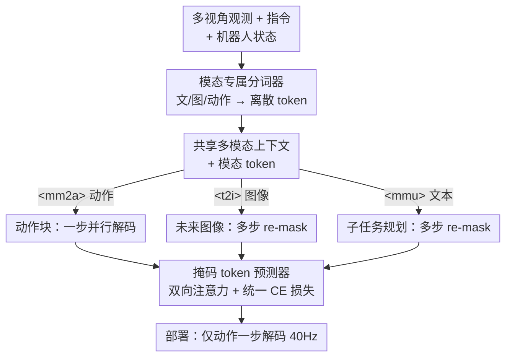

# MM-ACT: Learn from Multimodal Parallel Generation to Act

**会议**: CVPR 2026  
**论文**: [CVF Open Access](https://openaccess.thecvf.com/content/CVPR2026/html/Liang_MM-ACT_Learn_from_Multimodal_Parallel_Generation_to_Act_CVPR_2026_paper.html)  
**代码**: 有（https://github.com/HHYHRHY/MM-ACT）  
**领域**: 机器人 / 具身智能（VLA）  
**关键词**: VLA、统一离散token、并行解码、离散扩散、跨模态联合训练

## 一句话总结
MM-ACT 把文本、图像、动作都表示成同一套离散 token，用一个带双向注意力的掩码 token 预测器统一并行解码（文/图多步 re-mask、动作一步出），再用 Context-Shared 多模态学习让任务规划和未来图像预测反哺动作生成，在 LIBERO 拿 96.3%、RoboTwin2.0 八任务 52.38%（跨模态训练带来 +9.25%）、Franka 真机 72.0%。

## 研究背景与动机
**领域现状**：通才机器人策略既要高层语义理解（任务规划），又要能与环境交互的预测能力。VLA（视觉-语言-动作）模型成了主流范式，通常在预训练 VLM 上加动作头或专家模块来打通感知与控制。

**现有痛点**：（1）**VLM 派**（OpenVLA、π0 等）擅长视觉语义理解，但缺乏对物理动力学的显式建模，难以指导时序动作生成。（2）**视觉预测派**（CoT-VLA、DreamVLA 等世界模型）把未来视觉预测引入策略学习，时序/环境动力学强，但主要为预测目标训练而非面向任务规划，指令理解和子任务规划偏弱。（3）**统一 VLA 派**大多照搬"统一理解-生成模型"的范式，不重新思考策略架构：有的（如 WorldVLA）保留文本自回归、对图像和动作用并行解码，逼模型在同一前向里既做单 token 预测又做 block 级预测，要多套注意力机制、架构和训练流水线复杂；有的（如 UniVLA）干脆全自回归生成文/图/动作，动作推理慢。

**核心矛盾**：自回归预训练（token 预测目标）与扩散式动作微调（去噪目标）之间存在**目标错配**——这种不一致会引入优化错位、阻碍模型有效利用预训练知识；同时混合范式还要在统一性和动作推理速度之间权衡。

**本文目标**：用一个从头到尾都遵循同一并行解码生成目标的统一模型，把文/图/动作三模态生成统一起来，既简化训练、又保证动作低延迟。

**切入角度**：以离散扩散统一模型 MMaDA（dLLM）为底座，把动作也变成离散 token、纳入同一掩码预测目标，避免 AR↔扩散的范式割裂。

**核心 idea**：三模态共享离散 token 空间 + 统一掩码 token 预测目标 + 共享上下文联合监督，让跨模态学习增益动作生成，部署时只跑"一步并行解码"出动作。

## 方法详解

### 整体框架
MM-ACT 是一个 8B 的 Transformer 掩码 token 预测器，带双向注意力。它把文本、图像、机器人本体状态/动作都通过各自的模态分词器编码成离散 token，拼进同一序列。给定共享多模态输入（多视角观测 + 任务指令 + 文本描述 + 可选状态），在上下文前加一个**模态 token**（`<|mm2a|>` 动作 / `<|t2i|>` 图像 / `<|mmu|>` 文本）指明本次要生成哪个模态，在上下文后追加一段定长 `<mask>` block；模型一次前向对该 block 的所有 mask 位置算 logits，按解码策略并行填充。文本和图像用**多步 re-mask 并行解码**（低置信度重掩、cosine 噪声调度），动作用**一步并行解码**（$t=1$，整段全 mask 一次出全）。训练时三模态共享同一上下文、用统一交叉熵损失联合优化；部署时只做动作一步解码，稳定跑到 40Hz。

### 关键设计

**1. 统一离散 token 空间：文/图/动作都当成同一类离散 token**

为消除"AR 预训练 token 预测 ↔ 扩散动作去噪"的目标错配，作者把三模态全部离散化进同一词表。文本沿用 LLaDA 的分词器；图像用 Show-o 的预训练量化器（codebook 8,192），输入先 pad 成方图、下采到 256×256 编成 256 token，生成时也输出 256 token 再解码回 256×256 图；动作和本体状态用 bin tokenizer（分配 2,048 个 token），每个连续标量先归一到 $[-1,1]$ 再量化成 token，输出端再反量化回连续值；动作 codebook 拼在词表末尾，不影响原文本/图像 codebook。这样三模态被表示成等价的离散 token，可以用同一套双向注意力、同一个目标优化，不再需要模态专属解码器或注意力——这是整篇"统一"的地基。

**2. 并行解码策略：文/图多步 re-mask、动作一步出，权衡效果与效率**

模型被设计成 block 级掩码 token 预测器。对每个连续时间 $t\in(0,1]$，按概率 $p_{mask}=f_{modal}(t)$ 独立把每个位置替换成 `<mask>`，单位置条件分布为

$$q_t(x_t^i\mid f_{modal}(t),x_0^i)=(1-f_{modal}(t))\,\mathbf{1}\{x_t^i=x_0^i\}+f_{modal}(t)\,\mathbf{1}\{x_t^i=\texttt{<mask>}\},$$

文本用线性 schedule（随 LLaDA），图像和动作用 cosine schedule 以贴合连续去噪。对**动作**直接取 $t=1$，即整段全 mask（$x_t=\texttt{<mask>}\times L$），让模型一次前向把所有动作 token 并行生成出来，保证低延迟；同时也提供一个低置信度 **re-mask** 多步解码版本（cosine 调度，参照 MAGVIT-v2），用来权衡效果与效率。**图像**用同样的 re-mask 多步解码。**文本**把生成长度限制在 256 token（任务规划标注通常够用、也对齐 LLaDA 默认 block 大小），因此不用半自回归、整段在一个 block 内并行解码。一步解码省时间、多步 re-mask 更精细，作者在附录里对比了两者的效果-效率权衡。

**3. Context-Shared 多模态学习：共享上下文 + 统一损失，让规划和图像预测反哺动作**

针对"动作生成缺乏动力学/规划支撑"的痛点，作者让三个生成任务**共用同一份上下文** $C_{modal}=\texttt{<modal>}+\text{sharedinput}$，其中 sharedinput 是把多视角观测、任务指令、文本描述、可选状态按模板交错成的 token 序列。每模态在上下文后接定长 block：文本 block 256（容纳子任务规划）、图像 block 256（生成一张未来完成图）、动作 block 大小 $N_{\text{act\_block}}=d_{action}\times N_{\text{chunk\_size}}$（按 chunk 生成动作）。三模态用**同一个**只在 mask 位置计算的交叉熵损失联合优化：

$$\mathcal{L}(\theta)=-\mathbb{E}_{t,x_0,x_t}\Big[\sum_{modal\in\mathcal{M}}\frac{\lambda_{modal}}{t}\sum_{i\in\mathcal{I}_{modal}}\mathbf{1}\{x_t^i=\mathrm{M}\}\log p_\theta(x_0^i\mid C_{modal},x_t)\Big],$$

$\lambda_{modal}$ 是各模态损失权重。训练分两阶段：**Stage 1** 设 $\lambda_{mm2a}=0$，只训文本和图像生成直到二者 loss 降到低位；**Stage 2** 主攻动作生成，把 $\lambda_{mmu},\lambda_{t2i}$ 调到约 0.05–0.1 以维持文/图生成能力。三模态在同一梯度累积步内聚合各自损失，于是"该执行哪个子任务"的规划知识和"动作执行后环境会怎样"的未来图像预测，都被注入到动作生成里。部署时只做动作一步生成，不需要额外多模态生成，延迟低。

### 一个完整示例
以 RoboTwin 的 "Place Burger Fries" 为例：输入是机器人多视角观测 + 指令"用双臂把软汉堡和薯条放到深棕色托盘"+ 机器人状态。① 走 `<|mmu|>` 通道，模型在 256-token 文本 block 内并行解码出子任务规划（如"先用左夹爪抓汉堡、放到托盘，再继续……"）；② 走 `<|t2i|>` 通道生成一张"该动作块执行完之后"的未来完成图（256 token→256×256 图，在未见场景里也能贴近真值子目标图）；③ 走 `<|mm2a|>` 通道，对全 mask 的动作 block 一步并行解码出当前时刻的 chunk 动作（chunk size 8）。训练时三者共享上下文联合监督，于是规划与图像预测的语义/动力学线索回流到动作；部署时只跑第③步，40Hz 输出。

## 实验关键数据

> 指标说明：所有任务的核心指标都是**成功率 SR（%）**（任务/物体放对的比例）。LIBERO 报四个子基准（Spatial/Object/Goal/Long）与平均；RoboTwin2.0 在**未见设置**（指令/环境/物体位置训练时都没见过）下评八个双臂任务，衡量域外泛化；Franka 为真机三任务。`Vanilla`=仅动作训练；`+Text/+Image/+Text&Image`=用对应模态做 Context-Shared 联合训练。

### 主实验

LIBERO 成功率（节选 Table 1）：

| 模型 | Spatial | Object | Goal | Long | 平均 |
|------|------|------|------|------|------|
| OpenVLA | 84.7 | 88.4 | 79.2 | 53.7 | 76.5 |
| π0 | 96.8 | 98.8 | 95.8 | 85.2 | 94.2 |
| OpenVLA-OFT | 96.2 | 98.3 | 96.2 | 90.7 | 95.4 |
| UniVLA | 95.4 | 98.8 | 93.6 | 94.0 | 95.5 |
| MM-ACT (Vanilla) | 97.8 | 99.4 | 94.8 | 88.0 | 95.0 |
| **MM-ACT (+Text in Long)** | — | — | — | **93.0 (+5.0)** | **96.3** |

RoboTwin2.0 八任务平均与 Franka 真机（Table 2/3）：

| 模型 | RoboTwin2.0 八任务平均 SR | Franka 真机平均 SR |
|------|------|------|
| OpenVLA-OFT | 23.13 | 58.6 |
| π0 | 48.13 | 70.0 |
| MM-ACT (Vanilla) | 43.13 | — |
| MM-ACT (+Text) | 46.5 (+3.37) | — |
| MM-ACT (+Image) | 48.75 (+5.62) | — |
| **MM-ACT (+Text&Image)** | **52.38 (+9.25)** | **72.0** |

LIBERO 平均 96.3% 超过所有 baseline（比 OpenVLA +19.8、π0 +2.1、UniVLA +0.8）；在域外的 RoboTwin2.0 上以 52.38% 领先 π0 +4.25、OpenVLA-OFT +29.25；真机也以 72.0% 居首。

### 消融实验

| 配置 | RoboTwin2.0 平均 SR | 说明 |
|------|------|------|
| Vanilla（仅动作） | 43.13 | 单模态动作训练基线 |
| + Text | 46.5（+3.37） | 加任务规划联合训练 |
| + Image | 48.75（+5.62） | 加未来图像预测联合训练 |
| + Text & Image | 52.38（+9.25） | 三模态全联合，最佳 |
| LIBERO-Long: 仅动作 | 88.0 | — |
| LIBERO-Long: + Text 规划 | 93.0（+5.0） | 长程任务靠规划提升明显 |

### 关键发现
- **跨模态联合训练确实反哺动作**：在域外 RoboTwin2.0 上，单加文本 +3.37、单加图像 +5.62、三模态全开 +9.25，逐级累加，说明任务规划的语义和未来图像的动力学线索都对动作有独立增益、且可叠加。
- **图像模态对动作帮助更大**：+Image（+5.62）单独看比 +Text（+3.37）更猛，提示"预测执行后的环境样子"这种动力学监督，比纯文本规划更贴近动作生成所需。
- **长程任务最吃规划**：LIBERO-Long 从 88.0→93.0（+5.0），共训子任务规划对需要分解的长 horizon 任务收益最大。
- **生成的未来图像质量可用**：在干净与域随机的未见场景里，生成图都能保留关键信息、贴近子目标真值图，间接印证图像通道学到了有用的动力学。

## 亮点与洞察
- **"动作 = 一步全 mask 解码"很巧**：把动作当成 $t=1$ 的极端掩码情形，一次前向并行出全 chunk，既统一进掩码预测框架、又拿到 40Hz 低延迟，避开了自回归逐 token 的慢。
- **用 dLLM 当底座消除范式错配**：从预训练到动作微调都用同一并行解码目标，绕开了"AR 预训练 + 扩散动作头"的目标不一致，是相比 OpenVLA/π0 这类方法在"统一性"上的根本区别。
- **共享上下文的联合监督可迁移**：把"同一份观测/指令同时生成规划、未来图、动作"做成统一 CE 损失，这种"让辅助生成任务反哺主任务"的训练范式可迁移到其他需要多目标协同的具身任务。

## 局限与展望
- **动作一步解码 vs re-mask 多步的取舍**：作者承认两者在效果与效率上各有权衡（细节在附录），一步解码省时但精度上可能让步，缺乏在更高维/更长 horizon 动作上的系统结论。⚠️ 缓存为正文，附录对比未含。
- **图像/状态分词依赖外部预训练量化器**（Show-o 量化器、bin tokenizer），图像统一下采到 256×256，对需要精细视觉的操作任务可能损失信息。
- **多为单臂/双臂桌面操作**：LIBERO、RoboTwin、Franka 都是相对受控的操作场景，更复杂的移动操作、接触丰富任务上的泛化未验证。
- **可改进方向**：让 $\lambda_{modal}$ 自适应/课程化而非固定调到 0.05–0.1；探索动作 token 化的更高保真方案以减少量化误差。

## 相关工作与启发
- **vs OpenVLA / π0（VLM+动作头）**: 它们在预训练 VLM 上加动作头/扩散头，存在 AR 预训练与扩散微调的目标错配；本文全程统一并行解码目标，LIBERO 上 +19.8 / +2.1，且统一性更彻底。
- **vs WorldVLA（混合统一 VLA）**: 它文本自回归、图/动作并行解码，需多套注意力、流水线复杂；本文三模态全离散 token + 双向注意力 + 单一目标，架构更简洁（LIBERO +14.5）。
- **vs UniVLA（全自回归统一 VLA）**: 它文/图/动作全自回归、动作推理慢；本文动作一步并行解码低延迟（40Hz），LIBERO 略胜（+0.8）。
- **vs DreamVLA / CoT-VLA（视觉预测派）**: 它们强于未来预测但规划弱；本文把未来图像预测当成共享上下文里的一个辅助生成任务去反哺动作，兼顾预测与规划（RoboTwin 域外明显领先）。

## 评分
- 新颖性: ⭐⭐⭐⭐ "把动作纳入离散扩散统一框架、一步并行解码 + 共享上下文联合训练"组合得很干净，但底座 MMaDA 与并行解码思路有迹可循。
- 实验充分度: ⭐⭐⭐⭐ 仿真（LIBERO/RoboTwin2.0）+ 真机（Franka）+ 逐模态消融齐全，但部分解码策略对比塞在附录、正文略薄。
- 写作质量: ⭐⭐⭐⭐ 范式对比图（AR/Hybrid/PD）和训练流程讲得清楚；个别公式/上下文记号在缓存里有 OCR 噪声但可还原。
- 价值: ⭐⭐⭐⭐ 给出一个统一、低延迟、可跨模态自增益的 VLA 范式，且开源代码/模型/数据，对具身离散生成方向有实用参考。

<!-- RELATED:START -->

## 相关论文

- [\[CVPR 2026\] Learning to Act Robustly with View-Invariant Latent Actions](learning_to_act_robustly_with_view-invariant_latent_actions.md)
- [\[CVPR 2026\] Learning to See and Act: Task-Aware Virtual View Exploration for Robotic Manipulation](learning_to_see_and_act_task-aware_virtual_view_exploration_for_robotic_manipula.md)
- [\[NeurIPS 2025\] Act to See, See to Act: Diffusion-Driven Perception-Action Interplay for Adaptive Policies](../../NeurIPS2025/robotics/act_to_see_see_to_act_diffusion-driven_perception-action_interplay_for_adaptive_.md)
- [\[CVPR 2026\] Diagnose, Correct, and Learn from Manipulation Failures via Visual Symbols](diagnose_correct_and_learn_from_manipulation_failures_via_visual_symbols.md)
- [\[CVPR 2026\] From Manuals to Actions: A Unified VLA Model for Chain-of-Thought Manual Generation and Robotic Manipulation](from_manuals_to_actions_a_unified_vla_model_for_chain-of-thought_manual_generati.md)

<!-- RELATED:END -->
