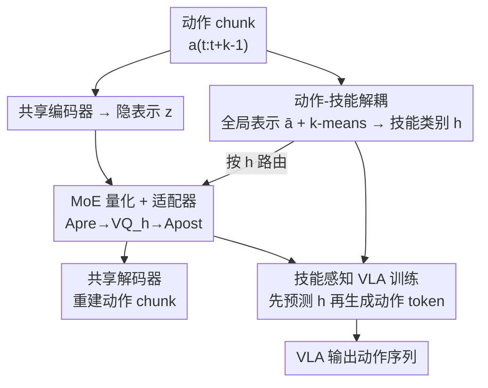

# MoEActok: A MoE-based Action Tokenizer for Vision-Language-Action Models

**会议**: CVPR 2026  
**论文**: [CVF Open Access](https://openaccess.thecvf.com/content/CVPR2026/html/Xu_MoEActok_A_MoE-based_Action_Tokenizer_for_Vision-Language-Action_Models_CVPR_2026_paper.html)  
**代码**: https://github.com/cpaaax/MoEActok (有)  
**领域**: 机器人 / 具身智能（VLA 动作 tokenizer）  
**关键词**: VLA、动作离散化、混合专家、VQ-VAE、技能解耦

## 一句话总结
MoEActok 把单一动作 tokenizer 拆成「按技能聚类的多专家 VQ-VAE」，让每个专家只负责一类动作技能（移动 / 抓取等），再配合「先预测技能类别、再生成动作 token」的粗到细训练范式，在 RoboTwin、Simpler-Env 仿真和真机零样本迁移上都显著超过 Binning / FAST / VQ-BET / VQ-VLA 等现有离散化方法。

## 研究背景与动机

**领域现状**：当下的自回归 VLA（vision-language-action）模型把连续控制信号离散成 token，借此复用 LLM/VLM 的 next-token 预测范式。这条路线的命门在于「动作 tokenizer」的质量——它要把高维、时序连贯的控制信号压成紧凑且语义丰富的离散表示。早期方法用「均匀分桶」（uniform binning）逐维离散，抓不住时间步之间的依赖；近期 FAST 用 DCT + BPE 在频域做压缩，VQ-BET / VQ-VLA 用残差向量量化（RVQ）分层离散，都是在「单个 tokenizer 怎么压得更好」上做文章。

**现有痛点**：这些 tokenizer 全都是**在整条轨迹上整体训练（trained holistically）**的，而一条操作轨迹往往混杂了多种异质技能——比如大范围的平移移动和精细的末端执行器抓取。用一个量化器同时吃这两类信号，等于强迫它在「不同运动学模式、不同时间尺度」之间做妥协，谁都学不精。作者在 BridgeData V2 上对动作 chunk 做聚类（图 1）发现：动作天然分成几簇——簇 0/1 是绕 z 轴相反方向的移动基元，簇 2/3 是夹爪开 / 合的抓取动作。这说明异质技能确实是「可分」的，但现有 tokenizer 把它们搅在一起学。

**核心矛盾**：单一量化器的「容量」要同时服务多种互相冲突的技能分布（mixed-signal optimization），表示保真度必然被拉低；而且没有显式机制把技能结构解耦出来，下游 VLA 在「观测→精确动作基元」的 grounding 上也会变差。

**本文目标**：(1) 让 tokenizer 按技能分工，每个专家专精一类动作；(2) 让异质专家的量化空间能彼此对齐、统一重建；(3) 让下游 VLA 显式利用技能结构，降低学习难度。

**切入角度**：既然动作 chunk 天然聚成几簇技能，那就用无监督聚类把它们分开，给每簇配一个专属量化专家——把「一个 tokenizer 学所有技能」换成「混合专家（MoE）各管一摊」。

**核心 idea**：用「聚类驱动的 MoE VQ-VAE」替代「单一 VQ-VAE」做动作离散化，每个专家专精一种技能；并把 VLA 训练改成「先识别技能类别 h、再在 h 条件下生成动作 token」的粗到细两段式。

## 方法详解

### 整体框架
MoEActok 由两层组成：上层是**动作 tokenizer 本体**（一个 MoE VQ-VAE），下层是**基于它的 VLA 模型**。先用无监督聚类把所有动作 chunk 按「全局运动学特征」分成 K 个技能簇；tokenizer 用一个共享编码器把动作 chunk 压成隐表示 $z$，再根据该 chunk 所属的技能类别 $h$ 把 $z$ 路由到对应的专家量化器 $VQ_h$（每个专家有独立 codebook），中间用 pre/post 适配器在「共享空间↔技能专属空间」之间来回映射，最后共享解码器把量化结果重建回动作。下游 VLA 把文本、图像、本体状态、动作四种模态都 tokenize 进同一个 transformer，并按「先预测技能 $h$、再生成动作 token」的顺序自回归。

输入：动作 chunk $a_{t:t+k-1}\in\mathbb{R}^{k\times 7}$（每臂 7-DoF）、观测图像 $o_t$、本体状态 $s_t$、指令 $l$。输出：离散动作 token 序列 → 重建 / 执行的动作 chunk。

### 关键设计

**1. 动作-技能解耦：用全局运动学表示做无监督聚类，把异质技能分开**

要让「每个专家管一类技能」成立，前提是先把动作 chunk 按技能切开，而这一步必须无监督、可扩展。作者的做法是从动作 chunk $a_{t:t+k-1}\in\mathbb{R}^{k\times 7}$ 提炼一个 7 维的紧凑全局表示 $\bar a\in\mathbb{R}^7$：前 6 维对整段的手臂运动做逐元素**累加**，$\bar a_{1:6}=\sum_{j=t}^{t+k-1} a_{j,1:6}$，捕捉这段 chunk 的总位移 / 旋转趋势；第 7 维取夹爪的**端点差** $\bar a_7=a_{t+k-1,7}-a_{t,7}$，专门隔离出夹爪的净开合动作。这个设计精妙在于：累加让平移 / 旋转的「方向性」浮现出来，端点差让「抓 / 放」与「移动」自然分离——正好对应图 1 里观察到的簇结构。然后对所有 $\bar a$ 跑 k-means 得到 $K$ 个簇心，每个簇就被当作一个「技能类别」。相比频域变换或 RVQ 这种「在表示上做文章」的思路，这里直接利用了动作信号本身的运动学结构来分工。

**2. MoE 量化器 + 双适配器：每个专家独立 codebook，再把异质量化结果拉回统一空间**

这是全文的核心。给定隐表示 $z$ 和它的技能类别 $h\in\{1,...,K\}$，先**只**把 $z$ 送到对应专家 $VQ_h$ 做量化：

$$z_q,\ q=\arg\min_{c\in VQ_h}\|z-c\|_2$$

这样每个专家只在自己那簇技能的分布上更新 codebook，不再被别的技能信号干扰。但直接把共享编码器的 $z$ 丢给不同专家会有「表示错配」——各专家的潜在分布差异很大。为此作者在量化前后各加一个适配器。**前置适配器** $A^{pre}_h$ 把共享表示投影到技能专属子空间：

$$z'=A^{pre}_h(z)=W_1\big(\sigma_1(W_2(z)*W_3(z))+\sigma_2(W_4(z))\big)$$

其中 $W_{1\sim4}$ 是可训练线性变换、$\sigma$ 是 ReLU，乘法项 $W_2(z)*W_3(z)$ 引入门控式的非线性交互，让每个专家在自己的子空间里量化。**后置适配器** $A^{post}_h$ 结构相同，把量化结果 $z_q$ 映回共享解码器能消化的统一空间 $z'_q=A^{post}_h(z_q)$。一前一后两个适配器，正是「让 K 个专家各自专精、又能被同一个解码器一致重建」的桥梁——消融里去掉适配器掉点最狠（见下），说明这层「异质→统一」的协调不可或缺。

tokenizer 用经典 VQ-VAE 三段式 loss 训练：重建损失 $L_{rec}=\|\hat a_{t:t+k-1}-a_{t:t+k-1}\|_2^2$、codebook 损失 $L_{emb}=\|\text{sg}[z']-z_q\|_2^2$、承诺损失 $L_{com}=\|z'-\text{sg}[z_q]\|_2^2$（$\text{sg}$ 为停梯度），合成 $L_{total}=L_{rec}+\alpha L_{emb}+\beta L_{com}$。

**3. 技能感知 VLA 训练：从「隐式猜技能」改成「先报技能、再出动作」的粗到细两段式**

动作 token 来自不同技能簇，但常规自回归训练 $L_{VLA}=-\sum_r \log P(q_r|q_{<r},o_t,s_t,l)$ 让模型**隐式**地一边猜该用哪个技能、一边预测 token，相当于把「技能分类」和「动作预测」两个任务塞进一个目标里同时解，学习负担很重。作者把生成过程显式拆成两阶段——先识别技能、再在技能条件下预测动作：

$$L_{VLA}=-\log P(h\mid o_t,s_t,l)-\sum_{r=1}^{R}\log P(q_r\mid q_{<r},o_t,s_t,l,h)$$

第一项强制模型显式预测技能簇 $h$，第二项在 $h$ 条件下生成动作 token，从而真正调用对应专家学到的技能专属模式。配合这套训练，VLA 把文本（LLM 原生分词）、本体状态（按 FAST 每维 256 桶离散）、图像（SigLIP-SO400M 出 256 个视觉 token）、动作（MoEActok 出离散 token）统一成 token 序列，并用 `t_bos/eos`、`s_bos/eos`、`i_bos/eos`、`a_bos/eos` 等分隔符标清模态边界，技能则用 `sk_bos/eos` 包裹。

### 损失函数 / 训练策略
两阶段训练：先用 AdamW（lr $5\times10^{-5}$）预训练 MoEActok tokenizer；再冻结 MoEActok 和 SigLIP，只微调 LLM（Qwen2.5-0.5B 主干）和 MLP 投影层（AdamW，初始 lr $1\times10^{-4}$ + cosine 退火）。MoEActok 用 4 个专家、codebook 维度 2048；动作 chunk 时序长度 RoboTwin 取 8 步、BridgeV2 取 4 步；RoboTwin 训 10 epoch、BridgeV2 训 20 epoch。

## 实验关键数据

### 主实验
RoboTwin 12 任务平均成功率（节选代表性任务 + Average）：

| Tokenizer | Click Bell | Place Container Plate | Move Can Pot | Place Phone Stand | 平均成功率 |
|-----------|-----------|----------------------|--------------|-------------------|-----------|
| Binning | 0.67 | 0.00 | 0.02 | 0.02 | 0.24 |
| FAST | 0.68 | 0.07 | 0.08 | 0.01 | 0.17 |
| VQ-BET | 0.64 | 0.54 | 0.13 | 0.04 | 0.29 |
| VQ-VLA | 0.59 | 0.79 | 0.30 | 0.23 | 0.45 |
| **MoEActok** | **0.85** | **0.88** | **0.50** | **0.38** | **0.56** |

Simpler-Env（WidowX 4 任务）成功率：

| Tokenizer | Put Spoon on Towel | Put Carrot on Plate | Stack Green on Yellow | Put Eggplant in Basket | Avg. |
|-----------|--------------------|---------------------|-----------------------|------------------------|------|
| Binning | 0.08 | 0.00 | 0.00 | 0.04 | 0.03 |
| FAST | 0.21 | 0.17 | 0.00 | 0.08 | 0.12 |
| VQ-BET | 0.04 | 0.04 | 0.00 | 0.00 | 0.02 |
| VQ-VLA | 0.29 | 0.33 | 0.21 | 0.00 | 0.21 |
| **MoEActok** | **0.38** | **0.38** | 0.13 | **0.63** | **0.38** |

RoboTwin 上把平均成功率从次优的 VQ-VLA 0.45 提到 0.56；Simpler-Env 上从 VQ-VLA 0.21 提到 0.38，绝对涨 17 个百分点。推理吞吐在单张 RTX 4090 上约 10 Hz，接 vLLM 引擎后提到 54 Hz。

### 消融实验
RoboTwin / Simpler-Env 上逐个去掉组件：

| 配置 | RoboTwin Avg. | Simpler-Env Avg. | 说明 |
|------|---------------|------------------|------|
| Full（MoEActok） | 0.56 | 0.38 | 完整模型 |
| w/o Adapter | 0.45 | 0.17 | 去掉前后适配器，量化空间无法协调 |
| w/o Skill-aware | 0.47 | 0.30 | 去掉显式技能预测，退回隐式学习 |

专家数 $K$ 的影响（$K\in\{1,2,4\}$）：RoboTwin 平均成功率从 $K{=}1$ 的 0.50 升到 $K{=}4$ 的 0.56；Simpler-Env 从 $K{=}1$ 的 0.26 升到 $K{=}4$ 的 0.38。

真机零样本迁移（AgileX Cobot Magic，直接部署 RoboTwin 训练的策略，每任务 20 试）：

| Tokenizer | Click Bell | Place Container on Plate | Pick Diverse Bottles | Avg. |
|-----------|-----------|--------------------------|----------------------|------|
| VQ-BET | 7/20 | 2/20 | 0/20 | 0.15 |
| VQ-VLA | 10/20 | 7/20 | 0/20 | 0.28 |
| **MoEActok** | **12/20** | **9/20** | **1/20** | **0.37** |

### 关键发现
- **适配器贡献最大**：去掉适配器后 Simpler-Env 从 0.38 暴跌到 0.17（几乎腰斩），RoboTwin 也从 0.56 掉到 0.45，说明「异质专家空间→统一解码空间」的协调是整套 MoE 量化能跑通的关键，而不只是锦上添花。
- **技能感知训练确有增益**：去掉后 RoboTwin 0.56→0.47、Simpler-Env 0.38→0.30，验证「先报技能再出动作」的粗到细分解确实降低了学习难度。
- **专家越多越好（在测试范围内）**：$K$ 从 1 增到 4 单调涨点，佐证「操作任务由多种技能基元组成、需要分工表示」这一核心假设；但论文只测到 $K{=}4$，再大是否饱和未知。
- **真机迁移保持优势**：零样本直接部署、不微调，MoEActok 仍在三个真机任务上全面领先，说明技能解耦带来的表示质量能跨 sim-to-real gap。

## 亮点与洞察
- **「按技能分工」这个切入点很对**：图 1 的聚类观察先把「动作天然可分技能」这件事坐实，再顺理成章地引出 MoE 量化——动机具体、不空洞，比起「单 tokenizer 内部再优化」是更本质的换路。
- **7 维全局表示设计巧妙**：前 6 维累加、第 7 维取端点差，用极轻量的手工特征就把「平移/旋转」和「抓/放」解耦开，无需额外网络就能驱动 k-means 聚类，可迁移到任何带夹爪的机械臂动作分组。
- **双适配器是让 MoE 量化可用的隐形功臣**：消融显示它比技能感知训练更关键。多专家各自专精容易，难的是让一个共享解码器消化这些异质 codebook——pre/post 适配器正好补上这一环，这个「分工后再统一」的模式可复用到其他多 codebook / 多专家量化场景。
- **纯 tokenizer 层改进、不动 LLM 架构**：相比 diffusion head 那类需要改 transformer 结构的连续动作方案，MoEActok 仍是离散 token，能无缝接进标准自回归 VLA，部署友好。

## 局限与展望
- **聚类是离线、静态的**：k-means 在训练前一次性把技能簇定死，簇数 $K$ 和簇划分都不随训练自适应；遇到训练分布外的新技能组合可能路由到不合适的专家。
- **专家数只扫到 K=4**：单调增益没探到饱和点，也没报 $K$ 增大带来的 codebook / 显存开销与收益的权衡，最优专家数如何随任务多样性确定缺乏指引。
- **路由依赖全局表示的硬分配**：用 $\bar a$ 做 argmin 硬路由，边界附近的动作 chunk 可能被错分到相邻技能专家，没有软路由 / top-k 容错机制。
- **绝对成功率仍偏低**：Simpler-Env 平均 0.38、部分 RoboTwin 任务（如 Pick Diverse Bottles 0.15、真机 1/20）依然很难，说明技能解耦缓解了表示冲突，但远未解决精细操作本身的难度。
- **可改进方向**：把聚类换成可端到端学习的可微路由、引入软分配或负载均衡、随训练动态扩充专家，或把技能层级做得更深（多级技能树）。

## 相关工作与启发
- **vs Binning**：Binning 逐维均匀分桶、每时间步独立离散，抓不住时序相关；MoEActok 在 chunk 级量化并按技能分工，表示更紧凑、保真度更高。
- **vs FAST**：FAST 用 DCT 把动作搬到频域再 BPE 合并相关系数，是「单一频域压缩」；MoEActok 不做频域变换，而是从运动学结构出发把异质技能拆给多个专家，二者解决的是不同维度的问题（压缩效率 vs 技能解耦）。
- **vs VQ-BET / VQ-VLA**：两者都用（残差）VQ-VAE，但仍是**单一**量化栈在整条轨迹上训练，潜在空间纠缠；MoEActok 的根本区别是把单量化器换成 K 个技能专属量化器 + 适配器协调，正面解决「混合信号优化」这一痛点，也因此在所有 benchmark 上稳超 VQ-VLA。
- **vs diffusion-head 类连续动作方法**：那类方法绕过离散化、直接出连续动作，但要改 transformer 架构；MoEActok 保持离散 token、零架构改动地接入标准自回归 VLA，更易复用 LLM 生态。

## 评分
- 新颖性: ⭐⭐⭐⭐ 把 MoE 引入动作 tokenizer、按技能聚类分专家量化，切入点本质且少见
- 实验充分度: ⭐⭐⭐⭐ 两个仿真 benchmark + 真机零样本 + 消融 + 专家数分析，较完整；但绝对成功率偏低、$K$ 未扫到饱和
- 写作质量: ⭐⭐⭐⭐ 动机由聚类观察自然引出，方法与公式清晰，图 1/2 帮助理解
- 价值: ⭐⭐⭐⭐ 提供了一个即插即用、不改 LLM 架构的更强动作 tokenizer，对自回归 VLA 社区有直接复用价值

<!-- RELATED:START -->

## 相关论文

- [\[CVPR 2026\] ACoT-VLA: Action Chain-of-Thought for Vision-Language-Action Models](acot-vla_action_chain-of-thought_for_vision-language-action_models.md)
- [\[CVPR 2026\] SRPO: Self-Referential Policy Optimization for Vision-Language-Action Models](srpo_self-referential_policy_optimization_for_vision-language-action_models.md)
- [\[CVPR 2026\] Adaptive Action Chunking at Inference-time for Vision-Language-Action Models](adaptive_action_chunking_at_inference-time_for_vision-language-action_models.md)
- [\[CVPR 2026\] QuantVLA: Scale-Calibrated Post-Training Quantization for Vision-Language-Action Models](quantvla_scale-calibrated_post-training_quantization_for_vision-language-action_.md)
- [\[CVPR 2026\] Closed-Loop Neural Activation Control in Vision-Language-Action Models](closed-loop_neural_activation_control_in_vision-language-action_models.md)

<!-- RELATED:END -->
