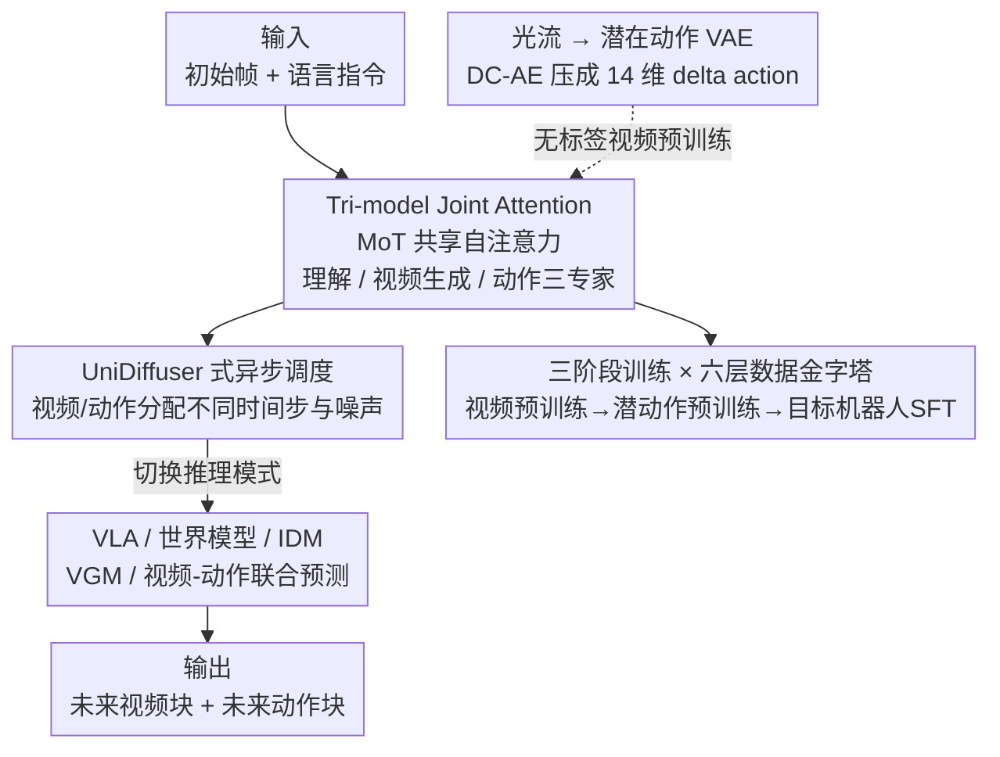

# Motus: A Unified Latent Action World Model

**会议**: CVPR 2026  
**论文**: [CVF Open Access](https://openaccess.thecvf.com/content/CVPR2026/html/Bi_Motus_A_Unified_Latent_Action_World_Model_CVPR_2026_paper.html)  
**领域**: 机器人 / 具身智能  
**关键词**: 具身基座模型, 世界模型, 潜在动作, 光流, Mixture-of-Transformers

## 一句话总结
Motus 用一个 Mixture-of-Transformers 架构把「理解 / 视频生成 / 动作」三个预训练专家缝在一起，靠共享自注意力（Tri-model Joint Attention）+ UniDiffuser 式异步调度，在单一模型里统一了 VLA、世界模型、IDM、视频生成、视频-动作联合预测这 5 种具身范式；再用光流提炼出像素级「潜在动作」让动作专家也能在海量无标注视频上预训练，最终在仿真上比 π0.5 高 45%、比 X-VLA 高 15%，真机提升 11~48%。

## 研究背景与动机
**领域现状**：一个理想的具身智能体应该是「看懂场景指令 → 想象未来 → 预测后果 → 生成动作」的统一体。但当前主流做法把这些能力拆成了 5 个互相独立的范式各做各的：VLA（从视觉语言学静态策略）、World Model（基于动作预测未来观测）、IDM（从相邻帧反推动作）、视频生成（VGM）、以及视频-动作联合预测。F1 把 VLA 和 IDM 拼了起来，但仍然漏掉了世界模型和视频生成，统一并不完整。

**现有痛点**：第一，把这些多模态生成能力塞进一个框架里很难。已有的统一世界模型（UWM）虽然给出了理论原型，但它们要么从零训练、要么基座很小、要么即使引入了部分先验也总缺一块——要么缺 VLM 的视觉语言理解先验，要么缺 VGM 的物理交互先验，因此缺乏鲁棒泛化所需的完整世界知识。第二，具身智能要从大规模异构数据（互联网视频、第一视角人类示范、多机器人轨迹）里学，但不同本体的动作空间在维度、范围、语义上差异巨大，控制信号不能直接复用，而且绝大多数视频根本没有动作标签，导致动作专家无法像其它专家那样做大规模预训练。

**核心矛盾**：能力的「统一」和先验的「丰富」之间被现有架构对立了起来——UWM 为了统一只能从头训、丢掉预训练先验；而要保留 VLM/VGM 先验又难以把它们与新的动作模态对齐。同时，动作模态被「需要标签」这件事卡死，无法蹭上海量无标注视频。

**本文目标**：(1) 在一个框架里同时建模 VLA/World Model/IDM/VGM/Joint Prediction 这 5 种分布，且不牺牲通用多模态先验；(2) 让动作专家也能在跨本体、无动作标签的异构数据上做大规模预训练。

**切入角度**：既然 Bagel 这类统一多模态模型已经证明用 MoT（Mixture-of-Transformers）共享自注意力就能让「理解专家」和「生成专家」共存互补，那同样的思路能不能扩展到「动作专家」？而要让动作专家蹭上无标注视频，作者押注在光流上——光流是一种与本体无关的通用运动表达，能把不同机器人的行为对齐到同一个运动空间。

**核心 idea**：用 MoT 把三个预训练专家（理解 + 视频生成 + 动作）通过共享自注意力融合成一个统一生成模型，用 UniDiffuser 式异步噪声调度实现 5 种推理模式自由切换；再用光流编码出像素级「delta action」作为潜在动作，让动作专家在六层数据金字塔上做三阶段预训练。

## 方法详解

### 整体框架
Motus 的输入是「初始观测帧 + 语言指令（+ 本体感知）」，输出是「未来视频块 + 未来动作块」。它的骨架是一个 MoT：三个专家各自保留独立的 Transformer 模块（理解专家用 Qwen3-VL-2B，视频生成专家用 Wan 2.2 5B，动作专家新建），但把它们各层的多头自注意力**拼接**在一起共享，这就是 Tri-model Joint Attention。训练时模型用 rectified flow 目标同时预测视频块和动作块，而给视频和动作分配**不同的扩散时间步和噪声尺度**（UniDiffuser 式调度），从而在推理时只要把某些模态设成已知/纯噪声，就能自由切换成 VLA、世界模型、IDM、VGM 或联合预测。

与此并行的是一条解决「无标签数据」的支线：用一个潜在动作 VAE 把光流压成 14 维的潜在动作，让动作专家可以在大量无动作标签的视频上预训练。整个系统按「视频预训练 → 潜在动作预训练 → 目标机器人微调」三阶段，在「Web → 人类第一视角 → 合成 → 任务无关 → 多机器人 → 目标机器人」六层数据金字塔上训练。

### 关键设计

**1. Tri-model Joint Attention：用 MoT 把三个预训练专家缝成一个不互相打架的统一模型**

痛点正是 Challenge 1——UWM 把观测 token 和动作 token 简单拼起来过同一串 N 个 block，既无法吸纳 VLM/VGM 的现成先验，也容易让不同模态互相干扰。Motus 的做法是给理解、视频生成、动作各保留一套独立的 Transformer（独立的 FFN、AdaLN），只把每层的多头自注意力上下文拼接起来共享——形式上等价于让三路 token 在同一个注意力里互相看见，但前馈与归一化仍各走各的。这样既保住了「理解专家擅长 3D grounding/空间定位、生成专家擅长物理动态」的专门化角色，避免任务干扰，又让跨模态特征能在注意力里融合，三种预训练知识互相补位。动作专家被设计成和 Wan 同深度的 Transformer block（AdaLN 注入 rectified flow 时间步 + FFN + Tri-model Joint Attention），从而能平等地与另外两个专家做注意力交互。

这里还顺手解决了一个工程隐患：视频 token 数量远多于动作 token，注意力会被视频压倒，让模型过拟合到视频预测而削弱动作能力。作者用 **Action-Dense Video-Sparse Prediction** 把视频帧降采样（例如视频帧率取动作帧率的 1/6），让两类 token 数量平衡，同时也省了冗余视频帧的算力。

**2. UniDiffuser 式异步调度：一套权重，五种推理模式自由切换**

如果视频和动作共用同一个扩散时间步（Joint Diffuser 式同步），模型就只能做「联合预测」这一种事，没法在推理时灵活地把某个模态当条件、某个模态当待生成目标。Motus 借鉴 UniDiffuser，给视频和动作**分配各自独立的时间步 $\tau_o,\tau_a$ 和噪声尺度**，训练目标是两路 rectified flow（速度场预测）之和：

$$l^\theta = \mathbb{E}\big\|v^\theta_a-(\epsilon_a-a_{t+1:t+k})\big\|_2^2 + \mathbb{E}\big\|v^\theta_o-(\epsilon_o-o_{t+1:t+k})\big\|_2^2$$

其中 $\tau_a,\tau_o\sim U(0,T_\tau)$，$\epsilon_a,\epsilon_o$ 是采样噪声，$v^\theta_a,v^\theta_o$ 是模型预测的速度场。因为时间步是解耦的，推理时只要把某模态时间步设成 0（已知）或最大（纯噪声待生成），同一套权重就能实例化成不同的边缘/条件/联合分布：给视频纯噪声、动作当条件 → 世界模型；给动作纯噪声、视频当条件 → IDM；只给语言+图像生视频 → VGM；以此类推覆盖 5 种范式。消融显示这种异步调度比同步 Joint Diffuser 高 9.79%（77.00% vs 67.21%），而且同步方案根本演化不出世界模型/IDM 这些模式。

**3. 光流潜在动作：把无动作标签的视频也变成可学的「像素级 delta action」**

Challenge 2 的根子是大量视频没有动作标签、且不同本体动作空间不互通。Motus 选光流作为「与本体无关」的通用运动表达：用 DPFlow 算出相邻帧的像素位移并转成 RGB 图，再用一个深度压缩自编码器（DC-AE）重建光流、把它编码成 $4\times512$ 的 token，最后一个轻量编码器把这些特征投影成 **14 维向量**——刻意贴近真实机器人动作空间的尺度，让潜在动作天然能和真实控制对齐，成为「感知 → 动作」的桥梁。

光是重建光流会把任务无关的外观信息也学进来，所以作者用「弱动作监督」把潜在空间拽向真实控制分布：训练时混入 90% 无标签数据做自监督重建 + 10% 有标签轨迹（含按 AnyPos 用 Curobo 随机采样动作空间收集的**任务无关 image-action 对**和常规机器人示范）。总损失是重建 + 对齐 + KL 三项：

$$L = L_{recon} + \lambda_a\|a_{real}-a_{pred}\|^2 + \beta L_{KL}$$

维度对应（14 维）和弱监督对齐项共同把潜在动作分布锚到真实动作分布上，于是从视频里学到的运动先验就能自然映射成可执行控制。这一步是动作专家敢在海量无标注数据上预训练的前提。

**4. 三阶段训练 × 六层数据金字塔：让动作专家也享受到大规模预训练**

以往动作专家只能吃有标签机器人轨迹，规模上不去。Motus 把数据按「丰富度 vs 策略相关度」组织成六层金字塔（底层量大质粗、顶层量小质精）：Level 1 Web 数据、Level 2 第一视角人类视频、Level 3 合成数据、Level 4 任务无关数据、Level 5 多机器人任务轨迹、Level 6 目标机器人任务轨迹。对应三阶段渐进式注入物理先验：Stage 1 只动 VGM，用多机器人轨迹+人类视频让它学会从指令和初始帧生成合理的未来视频（学视觉动态）；Stage 2 冻结 VLM、用视频+语言+潜在动作训练整个 Motus，把运动与交互知识灌进潜在动作空间（学动作表征）；Stage 3 在目标机器人数据上 SFT，把先验适配到具体本体的动力学/运动学。这样动作专家终于和理解/生成专家一样拥有了大规模预训练，跨本体的运动知识被对齐到光流描述的运动空间后再迁移给目标本体。

### 损失函数 / 训练策略
- **主模型**：视频 + 动作两路 rectified flow 速度场回归之和（见设计 2 公式），异步时间步采样。
- **潜在动作 VAE**：重建 + 真实动作对齐 + KL 正则（见设计 3 公式），90% 无标签重建 + 10% 弱动作监督。
- **三阶段**：Stage1 仅 VGM / Stage2 冻结 VLM 训三专家 + 潜在动作 / Stage3 目标机器人 SFT。消融在 27.5K RoboTwin 数据上从零训 50K 步。

## 实验关键数据

### 主实验
仿真在 RoboTwin 2.0 的 50+ 操作任务上做多任务训练（2500 clean + 25000 重度随机化示范，每任务 100 次试验测成功率）。Motus 在 clean / 随机化两档都拿到 SOTA。

| 设置 | π0.5 | X-VLA | w/o Pretrain | Stage1 | Motus |
|------|------|-------|--------------|--------|-------|
| RoboTwin Clean 平均(%) | 42.98 | 72.80 | 72.8 | 82.86 | **88.66** |
| RoboTwin 随机化 平均(%) | 43.84 | 72.84 | 77.00 | 81.86 | **87.02** |

随机化设置下 Motus 比 π0.5 高 **45%** 绝对成功率、比 X-VLA 高约 **15%**。真机在两台双臂平台（AC-One、Agilex-Aloha-2）上用部分成功率评测，覆盖空间理解、可变形物体、精密流体控制、长程规划等任务：

| 平台 | π0.5 | w/o Pretrain | Motus |
|------|------|--------------|-------|
| AC-One 平均(%) | 14.79 | 25.86 | **63.22** |
| Agilex-Aloha-2 平均(%) | 48.60 | 26.60 | **59.30** |

像「用咖啡机冲咖啡」「磨咖啡豆」这类长程任务，π0.5 几乎是 0~8 分，Motus 能到 62~92 分，整体相对提升 11~48%。

### 消融实验
| 配置 | 成功率(%) | 说明 |
|------|---------|------|
| Motus (full) | 77.00 | 完整模型（27.5K 数据，50K 步从零训） |
| w/o VLM & Und Expert | 64.94 | 去掉理解专家，中度下降 ~12 个点 |
| w/o VGM | 25.50 | 去掉视频生成专家，**暴跌 51.5 个点** |
| Joint Diffuser（同步调度） | 67.21 | 换成同步时间步，掉 9.79 个点 |
| UniDiffuser（本文异步） | 77.00 | 异步调度，且能切换出 IDM/世界模型等模式 |

### 关键发现
- **VGM 是最关键的专家**：去掉视频生成专家成功率从 77% 直接崩到 25.5%，远比去掉 VLM（→64.94%）严重——说明「视频生成带来的物理交互/动态先验」才是策略学习的主心骨，视觉语言理解是重要但次一级的补强。
- **异步调度不只是涨点，更是「能力解锁」**：UniDiffuser 比同步 Joint Diffuser 高 9.79%，而且同步方案根本无法演化出世界模型/IDM 等推理模式，统一性是异步调度换来的。
- **预训练逐阶段有效**：从「无预训练」(72.8/77.0) → Stage1 (82.86/81.86) → 完整两阶段 (88.66/87.02)，每加一阶段都稳定涨点；真机上从零训反而经常不如带预训练。
- **世界模型范式更可扩展**：随任务数增加 π0.5 退化而 Motus 反升，成功率高 1.77×；同等数据预算下高 2.61×，达到同等性能只需 1/13.55 的数据，体现出强数据效率。

## 亮点与洞察
- **"统一" = 共享注意力 + 异步噪声调度** 这套组合很巧：MoT 共享自注意力负责「让三个专家彼此看见」，UniDiffuser 异步时间步负责「让一套权重能扮演 5 种角色」，两者正交叠加，既保住预训练先验又拿到模式自由切换，是全文最干净的设计点。
- **把光流当成跨本体的"通用动作货币"**：用 DC-AE 把光流压到 14 维去贴机器人动作空间尺度，再用 10% 弱监督把潜在动作锚到真实控制分布——这套「无标签视频也能喂动作专家」的配方可直接迁移到任何缺动作标签的具身预训练场景。
- **Action-Dense Video-Sparse 是个被低估的细节**：注意到视频 token 压倒动作 token 会让模型过拟合视频，用简单的帧率降采样（1/6）就同时解决了平衡和算力两个问题，是很实用的工程 trick。
- **"VGM 比 VLM 重要得多" 这个消融结论很反直觉**：很多 VLA 工作默认 VLM 是地基，Motus 用 51.5 个点的暴跌说明对操作任务来说「会想象未来视频」比「会理解语言」更接近核心。

## 局限与展望
- **作者承认的方向**：希望未来能引入更深的 VLM 整合，以及从互联网级通用视频里学潜在动作（目前潜在动作主要还靠机器人/人类视频 + 少量标签锚定）。
- **依赖大量重型基座**：Wan 2.2 5B + Qwen3-VL-2B + 新动作专家 + 光流 VAE 堆在一起，训练/部署成本和推理延迟都不小，论文未给出推理速度与算力账。
- **弱监督比例可能敏感**：90%/10% 的无标签/标签混合、14 维潜在动作维度、视频 1/6 降采样率都是经验设定，缺乏对这些关键超参的敏感性分析。
- **真机绝对成功率仍偏低**：长程任务（冲咖啡 62、折毛巾 14.5）虽大幅超 baseline，但绝对值离可靠部署还有距离，OOD 与更长程组合任务的鲁棒性待验证。

## 相关工作与启发
- **vs UWM**：UWM 同样想统一 5 种范式，但只是把观测/动作 token 拼接过单一扩散骨架，从零或小基座训练、缺 VLM/VGM 先验；Motus 用 MoT 引入现成预训练专家 + 互联网级通用先验 + 机器人轨迹专用先验，统一的同时保住了先验，这是核心区别。
- **vs F1**：F1 只把 VLA 和 IDM 拼起来（显式想象未来视觉再出动作），漏掉了世界模型和 VGM，统一不完整；Motus 一口气覆盖全部 5 种范式。
- **vs π0.5 / X-VLA**：它们是 VLA 范式，用通用骨架 + 本体特定信息注入，但主要靠有标签轨迹、无法吸纳无标注视频；Motus 靠光流潜在动作打通了无标签数据，且世界模型范式在任务数/数据量上扩展性更好（仿真 +45%/+15%）。
- **vs 潜在动作类方法（LAOM / AdaWorld 等）**：它们多用 IDM+FDM 重建下一帧、或限制 AE 容量/解耦表示去掉外观干扰；Motus 直接用光流作运动表达 + DC-AE 压到动作尺度 + 弱监督对齐真实动作，更直接地把潜在动作锚到可执行控制。

## 评分
- 新颖性: ⭐⭐⭐⭐⭐ 用 MoT 共享注意力 + UniDiffuser 异步调度在单模型里真正统一 5 种具身范式，并用光流潜在动作打通无标签预训练，组合很完整且新。
- 实验充分度: ⭐⭐⭐⭐ 仿真 50+ 任务 + 两台真机多任务 + 专家/调度/阶段/scaling 多维消融都到位；但缺推理成本与关键超参敏感性分析。
- 写作质量: ⭐⭐⭐⭐ 问题分解（两大 challenge）和方法对应清晰，公式与图表齐全；部分细节（数据金字塔层级与阶段对应）略需对照表格才看明白。
- 价值: ⭐⭐⭐⭐⭐ 给具身基座模型提供了「统一范式 + 无标签动作预训练」的可复用配方，VGM>VLM 的消融结论也对社区有启发。

<!-- RELATED:START -->

## 相关论文

- [\[CVPR 2026\] Chain of World: World Model Thinking in Latent Motion (CoWVLA)](chain_of_world_world_model_thinking_in_latent_motion.md)
- [\[CVPR 2026\] Learning a Unified Latent Action Space from Videos with Action-centric Cycle Consistency](learning_a_unified_latent_action_space_from_videos_with_action-centric_cycle_con.md)
- [\[CVPR 2026\] From Manuals to Actions: A Unified VLA Model for Chain-of-Thought Manual Generation and Robotic Manipulation](from_manuals_to_actions_a_unified_vla_model_for_chain-of-thought_manual_generati.md)
- [\[ICML 2026\] Dual-Stream Diffusion for World-Model Augmented Vision-Language-Action Model](../../ICML2026/robotics/dual-stream_diffusion_for_world-model_augmented_vision-language-action_model.md)
- [\[CVPR 2026\] Mantis: A Versatile Vision-Language-Action Model with Disentangled Visual Foresight](mantis_a_versatile_vision-language-action_model_with_disentangled_visual_foresig.md)

<!-- RELATED:END -->
