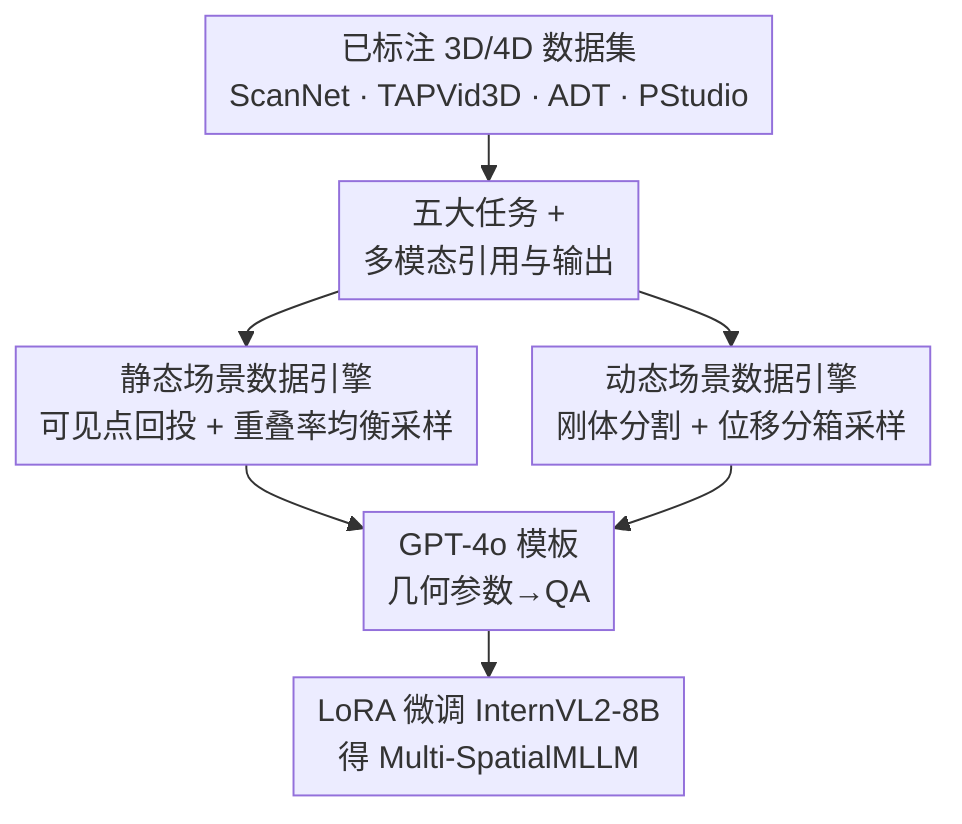

# Multi-SpatialMLLM: Multi-Frame Spatial Understanding with Multi-Modal Large Language Models

**会议**: CVPR 2026  
**arXiv**: [2505.17015](https://arxiv.org/abs/2505.17015)  
**代码**: 无（FAIR, Meta；项目提供数据/benchmark，论文未明确开源仓库，⚠️ 以官方为准）  
**领域**: 多模态VLM / 空间理解 / 具身智能  
**关键词**: 多帧空间理解、深度感知、视觉对应、相机/物体运动、数据引擎

## 一句话总结
针对 MLLM 只会单图空间推理、连左右都分不清的问题，本文用已标注的 3D/4D 场景数据集自动生成 2700 万条多帧空间问答（MultiSPA），把深度、视觉对应、动态感知三大基础能力灌进 InternVL2，训出的 Multi-SpatialMLLM 在自建 benchmark 上平均比基座涨 36%，甚至追平闭源大模型和专用 3D 模型。

## 研究背景与动机
**领域现状**：MLLM/VLM 已经成为通用 AI 助手，越来越多地被塞进机器人、自动驾驶等真实物理场景，而这些场景要求模型具备类人的空间理解能力——判断距离、方位、运动。

**现有痛点**：当前 MLLM 的空间理解弱得惊人，甚至会把左右搞反。已有改进工作（SpatialVLM、SpatialRGPT）把问题归因于"缺空间训练数据"，靠灌单图空间数据来补，但它们全都停留在**单张图像**：模型的感知被锁死在一个静态视野里，拿不到任何跨帧的动态信息。

**核心矛盾**：真实世界的空间理解本质是**跨多帧**的（Structure-from-Motion 的经典命题），但多帧空间数据极难获取——既要空间对齐又要时间对齐，在野外无结构图像上几乎无解；而单图监督学到的东西**无法迁移**到多图任务（实验里 SpatialRGPT 在多帧 benchmark 上反而比零样本基座还差）。

**本文目标**：让 MLLM 学会跨多张图像做空间推理，具体拆成三种基础能力——深度感知（推断相对距离与 3D 结构）、视觉对应（跨图匹配同一 3D 点）、动态感知（感知相机自运动 + 物体运动）。

**切入角度**：与其在野外噪声图像上用单目深度估计器等现成模块凑标注，不如**直接利用已经精标过的 3D/4D 场景数据集**（ScanNet、TAPVid3D、ADT、PStudio），用相机内外参把点云回投到图像、建立像素级对应，从几何真值里"挤"出干净的空间问答。

**核心 idea**：用一条几何驱动的数据引擎，把带 3D 真值的扫描/追踪数据自动转成海量、多模态引用、多样化输出的多帧空间 QA，再以标准 LoRA 微调灌进现成 MLLM——不动架构，只换数据。

## 方法详解

### 整体框架
本文的核心不是模型创新，而是一条**数据引擎**：输入是已标注的 3D（ScanNet）和 4D（TAPVid3D / ADT / PStudio）场景数据集，输出是 2700 万条多帧空间问答对（MultiSPA），最后用这些数据 LoRA 微调一个冻结视觉编码器的 InternVL2-8B，得到 Multi-SpatialMLLM。整条 pipeline 可以这样鸟瞰：先定义"五大任务 / 三种引用 / 五种输出"撑起任务空间；再分静态、动态两条支线把点云回投成像素对应、并做均衡采样压制长尾；最后用 GPT-4o 生成多样模板把几何参数包装成 QA，喂给基座微调。

### 关键设计

**1. 五大任务统一三种基础空间能力：把"空间理解"落成可生成的题型**

空间理解这个概念太虚、难以形式化定义，直接生成数据无从下手。本文把它锚定到 3D 视觉里成熟的三种基础能力，再展开成五个**有几何真值可算**的任务：深度感知（单点估深度 / 两点比远近）、视觉对应（给第一张图一个像素，在第二张图找同一 3D 点）、相机运动感知、物体运动感知、物体尺寸感知。其中相机运动从粗到细分九种题型——只判方向（左右/前后/上下平移 + 左右旋转/上下俯仰）、估标量（平移距离或旋转角）、直接回归位移向量；物体尺寸则要求模型**跨整组图像**融合信息估出长宽高，被定位为比前四者更高阶的能力。这套任务划分的价值在于：每个任务的答案都能从点云 + 相机参数精确算出，从而把"教模型空间理解"转化成"按几何真值批量出题"

**2. 多模态引用 + 多样化输出：让一套数据覆盖尽可能多的下游接口**

以往数据要么用语义标签引用（SpatialVLM）、要么用分割掩码引用（SpatialRGPT，还得额外挂一个分割模块），输出也多被限制成多选或标量。本文同时支持三种引用方式——视觉打点（在图上画 dot）、像素坐标、语义标签，其中像素坐标这一路**不在原图上加任何标注**，保持图像原貌、零额外依赖；输出则从定性文本一路扩到标量、2D 像素坐标、3D 位移向量。为兼容不同分辨率，像素坐标统一归一化到 0–1000：$x_{\text{norm}}=\lfloor \frac{x}{W}\times 1000\rfloor,\ y_{\text{norm}}=\lfloor \frac{y}{H}\times 1000\rfloor$，长度量用毫米取整。这样训出来的模型能直接对接打点、坐标、语义等多种真实交互形式，而不是只会做选择题

**3. 静态场景数据引擎：可见点回投 + 重叠率均衡采样**

静态场景（ScanNet）要解决两件事：怎么算跨图的像素对应、怎么挑出"难度合适"的图像对。前者靠几何回投——对场景点云里每个世界坐标点 $\mathbf{p}^W$，用外参逆变换到相机系再用内参投到像素：$\mathbf{p}^C_i=(\mathbf{E}_i)^{-1}[\mathbf{p}^W;1]$，并通过 $0<\mathbf{p}^C_i[2]<\mathbf{D}_i(u,v)$ 的深度判据剔除被遮挡点，得到每张图的可见点集 $\mathcal{P}_i$；两张图的共视点 $\mathcal{P}_i\cap\mathcal{P}_j$ 天然给出像素级对应、相机相对位姿 $\mathbf{E}_j^i=\mathbf{E}_i^{-1}\mathbf{E}_j$ 给出平移向量与方向。后者针对一个隐患：图像对的重叠率服从长尾分布，绝大多数对重叠极低，随机采样会让数据严重偏斜。本文定义重叠率为可见点的 IoU $\text{Overlap}(i,j)=\frac{|\mathcal{P}_i\cap\mathcal{P}_j|}{|\mathcal{P}_i\cup\mathcal{P}_j|}$，只保留 6%–35% 区间（太低无共视、太高近重复），再按重叠率分箱、向样本少的箱倾斜做**均衡采样**，保证不同难度的图像对都被覆盖。物体尺寸任务还额外用一个 BFS 最小覆盖集搜索，确保"只有整组图能覆盖物体、任何子集都不够"，逼模型真正跨图融合而非看单图猜尺寸

**4. 动态场景数据引擎：刚体分割 + 位移分箱采样**

物体运动需要时间对齐的轨迹，本文用 TAPVid3D 提供的逐帧追踪点云 $\{\mathcal{P}_t\}$ 加相机参数，按与相机运动相同的方式算出每个点在两帧间的位移向量与距离。但动态数据有两个采样陷阱。其一，追踪点云往往集中在物体的主导部位（如运动的人，躯干点远多于手臂），随机采样会让数据偏向单一运动模式；为此设计基于聚类的**刚体分割**——按点间距离随时间的变化把点云分成若干刚体组，**逐组分别采样**以覆盖不同运动模式。其二，一个出现在 $T$ 帧的点可组出 $\frac{T(T-1)}{2}$ 个图像对，运动幅度同样长尾；于是按物体平移距离**分箱均衡采样**，让小位移和大位移都被充分采到。这条支线与静态引擎共享"分箱均衡采样压长尾"的思路，区别只是把重叠率换成了运动幅度

### 损失函数 / 训练策略
不改架构，标准语言建模目标微调。基座选 InternVL2-8B（预实验显示其指令跟随强于 LLaVA-OneVision、VILA），用 LoRA（rank $R=16$）只更新 LLM、冻结视觉编码器与投影层；AdamW + cosine 调度，$\text{lr}=4\times10^{-5}$。为效率在 3M QA 子集上训一个 epoch，并混入 60K 通用图文指令数据防止退化原能力。在 24 节点 ×8×32G V100 上、batch 192 训练约 50 小时。

## 实验关键数据

### 主实验
MultiSPA benchmark：每个子任务留出 300 条、共 7800 条评测样本，场景与训练集严格不重叠。标量/向量判对标准为 $\|\mathbf{v}_{pred}-\mathbf{v}_{gt}\|_2\le 0.2\cdot\|\mathbf{v}_{gt}\|_2$，像素坐标判对为落在 5% 图宽内。

| 任务（子项） | 指标 | Multi-SpatialMLLM (8B) | InternVL2-8B 基座 | GPT-4o | 提升(vs 基座) |
|--------|------|------|------|------|------|
| **平均** | Acc | **56.11** | 20.43 | 28.87 | **+35.68** |
| 深度比较 | Acc | 74.00 | 49.50 | 54.84 | +24.50 |
| 深度数值 | Acc | 75.33 | 3.34 | 22.50 | +71.99 |
| 视觉对应(坐标) | Acc | 49.00 | 1.67 | 2.00 | +47.33 |
| 视觉对应(MCQ) | Acc | 90.00 | 33.33 | 67.67 | +56.67 |
| 相机方向 | Acc | 90.83 | 48.17 | 58.84 | +42.66 |
| 相机旋转角 | Acc | 45.50 | 3.34 | 17.50 | +42.16 |
| 相机平移向量 | Acc | 18.00 | 0.33 | 0.00 | +17.67 |
| 物体运动距离 | Acc | 40.42 | 8.84 | 8.92 | +31.58 |
| 物体尺寸 | Acc | 49.11 | 27.45 | 40.44 | +21.66 |

闭源大模型在定性任务上仅略高于随机（50–60%），在需要定量输出的任务（坐标对应、相机/物体运动向量）几乎全军覆没（接近 0）。仅 8B 的本文模型在所有任务上超越或追平这些更大的闭源系统；26B 变体在相机向量预测上达 ~72%，与专用 3D 模型 VGGT 持平。

### 泛化与消融
| 实验 | 配置 | 关键指标 | 说明 |
|------|------|---------|------|
| 跨数据集泛化(BLINK) | 本文 8B | 平均 84.3（基座 57.9） | 多视图推理 M.V. 达 94.7，平均涨 26.4%，超闭源 |
| 通用 VQA 保持 | 本文 vs 基座 | POPE 85.3 vs 84.5 | 6 个标准 VQA 大致持平，未过拟合空间任务 |
| 多任务协同 | 相机向量：单任务→多任务 | 9.30 → 18.00 (+8.70) | 加入其他任务数据反而涨点 |
| 多任务协同 | 物体运动：400K→+400K他任务 | 17.50 → 22.04 (+4.56) | 跨数据集/题型的能力可迁移 |
| 涌现(MCQ对应,Hard训Easy测) | 8B / 13B / 26B | 25.67 / 42.67 / 82.33 | 仅 26B 能从难样本学到能力 |

### 关键发现
- **单图监督不迁移到多图**：SpatialRGPT 在海量单图空间数据上训过，但在 MultiSPA 上反而低于零样本 InternVL，坐实多帧能力必须用多帧数据教。
- **多任务有协同而非互斥**：只训相机运动子集（500K）得 9.3%，混入其他任务凑成 3M 后涨到 18.0%——任务多样性是数据量、模型容量之外的第三个 scaling 维度。
- **空间理解可能"涌现"**：对难版视觉对应，8B/13B 训完反而掉点，只有 26B 能从难样本学好（82.33% vs 基线 44.0），暗示困难空间任务需要足够大的容量才学得动。
- **作为机器人多帧奖励标注器**：模型能零样本识别静态物体、预测运动距离并对齐真值，展示了给机器人学习做多帧 reward annotation 的潜力。

## 亮点与洞察
- **"借真值出题"的数据观**：不在野外噪声图上用现成模块凑标注，而是回到带 3D/4D 真值的扫描/追踪数据集，用相机参数把几何精确算出来——这让 27M 条 QA 既海量又干净，是单图方法做不到的。
- **均衡采样压长尾这一招通用且关键**：无论静态的重叠率还是动态的运动幅度都长尾，分箱 + 向稀疏箱倾斜的采样把"难度分布"显式控制住，比随机采样能避免数据偏斜——这套思路可直接迁移到任何"几何/运动幅度服从长尾"的数据合成任务。
- **不动架构、只换数据**：冻结视觉编码器 + LoRA 灌空间数据，既拿到 36% 的空间提升又几乎不损通用 VQA，说明很多"模型不会"其实是"没见过这种监督"。
- **多任务协同 + 涌现两个观察**有方法论价值：前者说明把多种空间子能力混训能互相增益，后者首次在空间任务上看到类似 LLM 的容量门槛现象。

## 局限与展望
- **依赖已标注 3D/4D 数据集**：数据引擎要求源数据有点云、相机内外参、3D 追踪等真值，场景多样性受限于 ScanNet/TAPVid3D 等现有集合（多为室内扫描），野外/室外/极端光照覆盖有限。
- **最难任务绝对精度仍低**：相机平移向量 18.0%、物体运动向量 12.92%，离实用尚远；作者也承认这些任务"学起来更难"，要靠继续 scale 数据与参数。
- **涌现结论是初步的**：只在单个 MCQ 视觉对应任务上观察到，样本与任务面都窄，作者明确留待后续验证。
- **改进思路**：把数据引擎接到更多真值数据集（如户外/驾驶场景）、引入更细粒度的遮挡与动态建模、或把 reward annotator 用途真正闭环进机器人策略学习。

## 相关工作与启发
- **vs SpatialVLM / SpatialRGPT**：它们同样靠"补空间数据"提升，但局限单图、用语义标签或分割掩码引用（后者还得挂分割模块）；本文扩到多帧、三种引用（含零标注的像素坐标）、更丰富的定量输出，且实验证明单图监督迁不到多图。
- **vs SAT（并行工作）**：SAT 也做多帧空间推理但用仿真数据、有 sim-to-real gap；本文数据来自真实图像、规模更大、任务更广。
- **vs VGGT 等专用 3D 模型**：本文是通用 VLM，却在相机向量预测上用 26B 变体追平 VGGT，说明通用模型 + 对的数据可以逼近专用几何模型。
- **vs BLINK / VSI-Bench 等 benchmark**：这些多限于多选格式或单图关系；MultiSPA benchmark 在统一度量下覆盖更多题型与输出格式（含物体运动、向量回归）。

## 评分
- 新颖性: ⭐⭐⭐⭐ 首个大规模多帧空间理解数据集 + benchmark，数据引擎思路扎实，但模型侧是标准 LoRA 微调
- 实验充分度: ⭐⭐⭐⭐⭐ 自建 benchmark + 跨数据集泛化 + 通用 VQA 保持 + 多任务协同 + 涌现 + 机器人应用，覆盖全面
- 写作质量: ⭐⭐⭐⭐ 任务定义与几何推导清晰，长尾采样动机讲得透
- 价值: ⭐⭐⭐⭐⭐ 把"教 MLLM 空间理解"从单图推进到多帧，数据与 benchmark 对具身/机器人社区直接可用

<!-- RELATED:START -->

## 相关论文

- [\[CVPR 2026\] FloVerse: Floor Plan-Guided Multi-Modal Navigation](floverse_floor_plan-guided_multi-modal_navigation.md)
- [\[CVPR 2026\] AURA: Multi-modal Shared Autonomy for Urban Navigation](aura_multi-modal_shared_autonomy_for_urban_navigation.md)
- [\[CVPR 2026\] DiffuView: Multi-View Diffusion Pretraining for 3D-Aware Robotic Manipulation](diffuview_multi-view_diffusion_pretraining_for_3d_aware_robotic_manipulation.md)
- [\[NeurIPS 2025\] HiMaCon: Discovering Hierarchical Manipulation Concepts from Unlabeled Multi-Modal Data](../../NeurIPS2025/robotics/himacon_discovering_hierarchical_manipulation_concepts_from_unlabeled_multi-moda.md)
- [\[CVPR 2026\] QuantVLA: Scale-Calibrated Post-Training Quantization for Vision-Language-Action Models](quantvla_scale-calibrated_post-training_quantization_for_vision-language-action_.md)

<!-- RELATED:END -->
