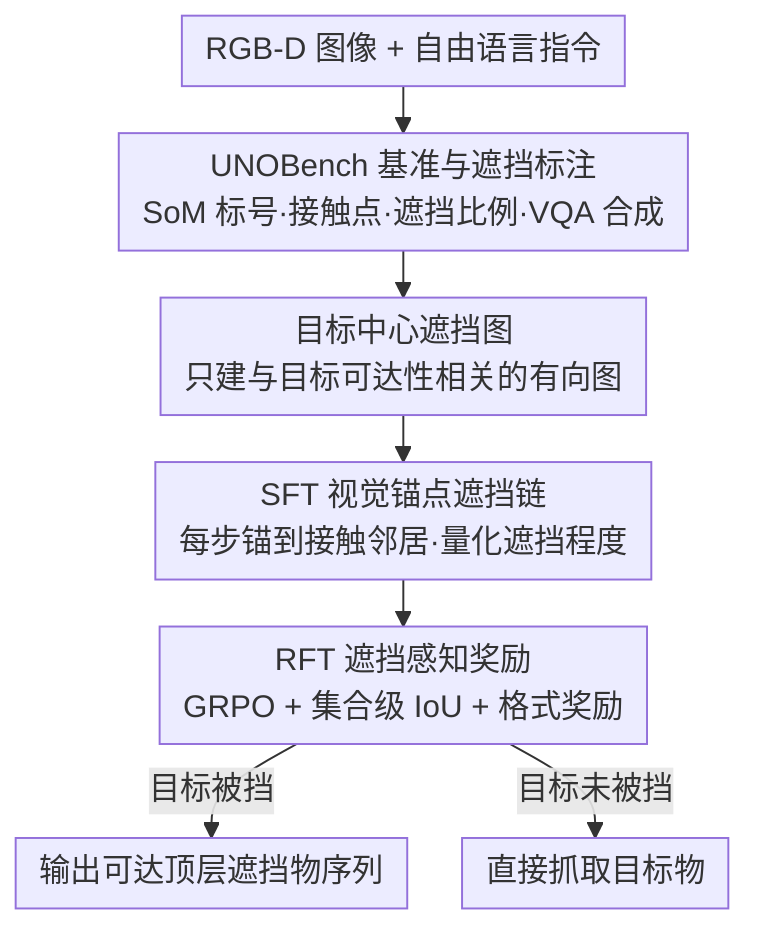

# Obstruction Reasoning for Robotic Grasping

**会议**: CVPR 2026  
**论文**: [CVF Open Access](https://openaccess.thecvf.com/content/CVPR2026/html/Jiao_Obstruction_Reasoning_for_Robotic_Grasping_CVPR_2026_paper.html)  
**代码**: https://tev-fbk.github.io/UnoGrasp/ (有，项目主页承诺开放数据/模型/代码)  
**领域**: 机器人抓取 / 具身空间推理 / 视觉语言模型  
**关键词**: 遮挡推理, 杂乱抓取, 视觉语言模型, 强化微调, 目标中心图

## 一句话总结
针对杂乱场景中"目标物被挡住、得先搬开遮挡物才能抓"这一被长期忽视的问题，本文提出 UNOGrasp——一个以目标物为中心构建有向遮挡图、再用 SFT+RFT（GRPO + IoU 奖励）训练的视觉语言模型，配套自建的 10 万+遮挡路径基准 UNOBench，在合成与真实场景的遮挡推理与抓取成功率上全面超过 Qwen2.5-VL 与谷歌专有的 Gemini Robotics-ER 1.5。

## 研究背景与动机
**领域现状**：让机器人按自然语言指令在 bin-picking、物体装配这类高度杂乱的场景里抓取目标物，是机器人操作的核心技能。近来的视觉语言模型（VLM）展现出一定的"涌现式"空间理解，能把语言指代落到图像里的具体物体上（visual grounding），也有 SpatialVLM、SpatialBot、RoboPoint 等工作往里塞 3D/深度/可供性知识。

**现有痛点**：现有 VLM 在"遮挡推理"这件事上很弱。它们能认出目标物，却理不清物体之间的物理依赖关系——当目标物被别的物体压住、挡住时，机械手根本够不到，必须先按正确顺序把上面的遮挡物搬开。已有的两类做法都不够：基于检测的方法（如 [18]）能估遮挡关系，但天生不支持多步动作规划，接不进 VLM 的具身推理框架；早期 VLM 探索（Jiao 等的 FreeGrasp [12] 用 Molmo grounding + GPT-4o 推理）只是零样本拼凑，任务形式化很浅，也没有像样的评测协议。

**核心矛盾**：杂乱场景里物体相互遮挡形成的"遮挡链"——A 被 B 挡、B 又被 C 挡——是个需要多步、多路径推理的结构问题，而现有 benchmark（EmbSpatial-Bench、Spatial457、CAPTURe）测的多是静态感知，不测"该先搬哪个、再搬哪个"这种动作导向的清障规划；且大多缺少语言标注，VLM 无从落地。

**本文目标**：把遮挡理解从底层控制里抽离出来，当成一个"空间感知 + 推理"问题来研究——给定目标物，识别出从它出发的**遮挡路径**，进而推断出"下一步该搬哪些可达的遮挡物"。要同时解决两件事：(1) 造一个能训练也能评测遮挡推理的数据集与指标；(2) 造一个真能做这种推理的 VLM。

**切入角度**：作者的关键观察是——要抓目标物 $o_t$，并不需要推理场景里**所有**物体的两两遮挡关系，只需要关心和 $o_t$ 可达性相关的那一小撮物体。于是把问题收敛成"以目标物为中心"的有向图，大幅压缩推理空间。

**核心 idea**：用"目标中心遮挡图 + 遮挡感知的视觉线索（接触点、遮挡比例、遮挡程度词）"来引导 VLM 做可验证的多步推理，并用强化微调把"最终该搬哪些物体"这个集合级目标直接优化进去。

## 方法详解

### 整体框架
UNOGrasp 接收一张 RGB-D 图像 $I=(I_{rgb}, I_d)$ 和一句自由语言指令 $q$（如 "grasp the white iphone box"），输出一份"清障计划"：若目标物没被挡就直接抓；若被挡，则吐出一串需要按序搬走的、当前**可达的**顶层遮挡物。$I_{rgb}$ 用于推理与动作规划，$I_d$ 用于估计 3D 抓取点。整条链路分两层看——离线先用 UNOBench 的结构化标注把场景翻译成"遮挡图 + VQA 训练样本"，在线时模型先把语言指代 grounding 到目标物、构建以它为中心的有向遮挡图、沿遮挡路径逐步推理，最后产出可达遮挡物集合 $\mathcal{F}(o_t)$ 作为下一步动作。模型本身基于 Qwen2.5-VL-3B，经两阶段训练：先 SFT 学会输出带视觉锚点的遮挡链，再 RFT（GRPO）用遮挡感知奖励把推理质量推上去。

### 关键设计

**1. 目标中心遮挡图：把"全场两两遮挡"压成"只盯目标可达性"的有向图**

痛点很直接：场景里有 $N$ 个物体，若像 [18] 那样推理所有可能的两两遮挡关系，组合爆炸且大量关系跟"能不能抓到 $o_t$"无关。本文只为目标物 $o_t$ 建一张有向图 $G_t=(V_t, E_t)$：节点集 $V_t$ 只含 $o_t$ 和直接或间接挡住它的物体；有向边 $(o_i, o_j)\in E_t$ 表示"从相机视角看 $o_i$ 被 $o_j$ 挡住"，边的方向从被挡物指向遮挡物，于是从 $o_t$ 出发会形成一条或多条遮挡路径，终点落在"自己不被任何东西挡、因而可直接抓"的顶层遮挡物上。

定义 $o_t$ 的祖先集（所有挡住它、需先搬走的物体）为

$$\mathcal{A}(o_t)=\{\, o_i\in\mathcal{O}\mid \exists \text{ 一条有向路径 } [o_t,\cdots,o_i]\in G_t \,\}.$$

而真正可立即动手的、位于杂物顶端的顶层遮挡物集为

$$\mathcal{F}(o_t)=\{\, o_i\in\mathcal{A}(o_t)\mid \nexists\, o_j \text{ s.t. } (o_i,o_j)\in E_t \,\}.$$

最终推理目标写成一个分段函数：若 $o_t$ 被挡，$f_\Theta(I,q)=\mathcal{A}(o_t)\rightarrow\mathcal{F}(o_t)$（经由祖先推理给出顶层集）；否则直接返回 $o_t$。这样做的好处是：当存在多个顶层遮挡物时，$\mathcal{F}(o_t)$ 自然给出一组"下一步候选"，机器人可再按可抓性、可达性等约束二次挑选，而模型不必纠缠于整场的无关遮挡。举例：钉书机 $o_2$ 被黄色螺旋桨 $o_4$ 挡、$o_4$ 又被橙色玩具枪 $o_5$ 挡，则 $\mathcal{A}(o_2)=\{o_4,o_5\}$，但只有 $o_5$ 自己不被挡，故 $\mathcal{F}(o_2)=\{o_5\}$——机器人下一步该搬的就是玩具枪。

**2. UNOBench：把遮挡结构变成可训练、可评测的语言化基准与新指标**

痛点是没有"既能训又能评"的遮挡推理数据集——MetaGraspNetV2 有 amodal 分割和几何，但缺高层推理监督和语言锚点。UNOBench 在它之上做两件事：(i) 给杂乱 bin 里的物体加人工自由语言描述；(ii) 给每个 bin 建逐目标的遮挡图。结构化构造分四步：(a) **Set-of-Marks**：在 GT mask 上给每个实例叠唯一数字标号，记录 ID 与质心 $(x,y)$；(b) **遮挡信息**：从 amodal mask 算接触点、遮挡比例、遮挡程度词（slightly / partially / mostly / heavily）；(c) **目标中心遮挡图**：以 SoM ID 为节点、"被挡→遮挡"为带属性的有向边；(d) **ID-名称-坐标关联**：GPT-4o 生成名字组成三元组。为保证语言准确，196 名 Prolific 母语者复核了 41,193 个物体名（人均 80 分钟），加专家复检，最终修正 4,678 张图、改写 17,261 个名字。

数据合成两套互补 VQA，统一用 `<think>...</think><answer>...</answer>` 格式：**Oracle (with SoM)** 全用数字 ID（无名字无坐标），只考推理能力；**Natural Language Prompting** 用自由语言提问、答案里同时给名字和坐标，贴近真实人机交互，同时考遮挡推理与空间 grounding。规模上合成 6,255 场景 / 108,174 条推理路径，真实 520 场景 / 2,552 条路径。评测指标分三层：结果级用 SR-P/SR-R/SR-F1 衡量最终顶层集是否对；物体级用三元组 OP/OR/F1$_{rel}$（一对物体及其遮挡关系都对才算 TP）；路径级提出新指标 **MP NED**（Multi-Path Normalized Edit Distance）——先算单路径归一化编辑距离 $\text{NED}(p_i,g_j)=\frac{\text{EditDist}(p_i,g_j)}{\max(|p_i|,|g_j|)}$，再用匈牙利算法以 $C_{ij}=\text{NED}$ 做最小代价匹配，取匹配对的平均代价并按 $\max(m,n)$ 归一化，越低表示预测路径与真值结构越贴。难度据图深度 $K_{min}$ 与不同路径数 $|P|$ 分 No-Occ / Easy / Medium / Hard 四档。

**3. SFT 视觉锚点遮挡链：让推理的每一步都钉在"物理接触的邻居"上**

痛点是 VLM 在多步推理里容易"步骤与坐标错位"——说着说着把物体身份搞混，导致 MP NED 飙到 0.8 以上。SFT 阶段在 UNOBench 上微调 $f_\Theta$，用两种显式参照来 grounding 目标：物体名+图像坐标 $\{o_t,(x_t,y_t)\}$，以及 SoM 视觉提示（给物体编唯一 ID），以消解多实例歧义。微调让模型学会判别三种情形（目标未被挡 / 单遮挡路径 / 多遮挡路径），并生成逐步推理链——**关键是每一步都锚到一个物理相邻（接触）的邻居**，保证链条只沿真实遮挡走，而不是凭空跳到不相干物体。同时鼓励模型在链里量化遮挡程度作为辅助信号（"被挡 38%"），这与"空间 grounding 能促进视觉推理"的发现一致，从而更稳地重建完整遮挡路径、识别顶层遮挡物 $\mathcal{F}(o_t)$。

**4. RFT 遮挡感知奖励：用集合级 IoU 把"最终该搬哪些"直接优化进去**

SFT 之后用强化微调进一步拔高。采用 GRPO（Group Relative Policy Optimization），对每个输入采样多个输出、用组内相对奖励来优化。奖励是格式奖励与任务奖励的加权和：

$$r=\lambda_{\text{fmt}}\, r_{\text{fmt}}+\lambda_{\text{task}}\, r_{\text{task}}.$$

格式奖励 $r_{\text{fmt}}$ 二值（0/1），检查 `<think>` 与 `<answer>` 是否正确成对闭合，保证结构合法。任务奖励监督最终输出 $\mathcal{F}(o_t)$，用集合级 IoU：

$$r_{\text{task}}=\frac{|\mathcal{F}_{\text{pred}}(o_t)\cap\mathcal{F}_{\text{gt}}(o_t)|}{|\mathcal{F}_{\text{pred}}(o_t)\cup\mathcal{F}_{\text{gt}}(o_t)|}.$$

为什么用 IoU 而非二值对错？因为当存在**多个**顶层遮挡物时，二值奖励"全对才给分"过于稀疏；IoU 给部分正确的预测以平滑梯度，既鼓励"答全"又不至于学崩。一个有意思的结果是：尽管该奖励只监督 `<answer>` 里的最终集合，实验显示它还能间接改善内部推理路径 $\mathcal{A}(o_t)$ 的质量（OR-F1 与 MP NED 同步变好）——说明"逼着模型把动作集答完整"会反向引导出更忠实的推理轨迹。

### 一个例子：抓棕色盒子
输入 "grasp the brown box"。模型先把指代 grounding 到棕色盒子 $o_3$ 的坐标 (768,631)，建目标中心遮挡图，沿两条路径推理：path1——棕盒被肥皂袋 (693,451) 挡住、遮挡比例 69%，肥皂袋自己不被挡；path2——棕盒被蓝罐 (495,636) 挡住、遮挡比例仅 3%，蓝罐也不被挡。于是 $\mathcal{F}(o_3)=\mathcal{A}(o_3)=\{$肥皂袋, 蓝罐$\}$，`<answer>` 同时给出两个顶层遮挡物的坐标作为下一步可搬候选。机器人据此先搬其一，再重新观测、迭代清障，直到棕盒可达。

## 实验关键数据

### 主实验
基线为开源 Qwen2.5-VL-3B（ICL / SFT 两版）和专有 Gemini Robotics-ER 1.5（base / ICL 两版）；UNOGrasp 基于 Qwen2.5-VL-3B 做 SFT+RFT。合成集按 7:1:2 划分训练/验证/测试，真实场景全部仅用于测试。下表为合成测试集路径级结果（节选 SR-F1，%）：

| 设置 / 难度 | No-Occ SR | Easy SR-F1 | Medium SR-F1 | Hard SR-F1 |
|------|------|------|------|------|
| Gemini Robotics-ER 1.5 (Oracle/SoM) | 68.7 | 59.3 | 29.8 | 5.4 |
| Gemini Robotics-ER 1.5 ICL (Oracle) | 54.6 | 69.1 | 38.7 | 13.8 |
| Qwen2.5-VL SFT (Oracle) | 88.7 | 69.8 | 56.5 | 34.3 |
| **UNOGrasp (Oracle)** | **94.8** | **83.3** | **69.1** | **54.5** |
| Gemini Robotics-ER 1.5 (NL Prompt) | 50.2 | 52.1 | 32.5 | 10.1 |
| Qwen2.5-VL SFT (NL Prompt) | 91.4 | 65.3 | 51.5 | 31.9 |
| **UNOGrasp (NL Prompt)** | **92.5** | **74.9** | **59.7** | **37.2** |

越难的场景优势越大：合成 Hard 上 UNOGrasp 比 Qwen2.5-VL(SFT) 高 +20.2% SR-F1；真实 Hard 上差距拉到 +38.0%，印证"过程级监督对多路径推理至关重要"。物体级（Table 2）上更悬殊——自由语言设置里两个基线 OP/OR 普遍掉到个位数（grounding 几乎失效），UNOGrasp 仍有 62.6/56.0 的总体 OP/OR。

### 消融实验
SFT 阶段往遮挡链里加视觉线索（Table 5，合成总体）：

| 配置 | SR-F1 | OR-F1 | MP NED |
|------|------|------|------|
| Baseline（仅遮挡图） | 74.7 | 71.9 | 0.220 |
| + 接触点 | 75.3 (+0.6) | 72.5 | 0.216 |
| + 程度词 | 75.1 (+0.4) | 72.5 | 0.217 |
| + 遮挡比例 | 76.4 (+1.7) | 73.3 | 0.210 |

RFT 阶段加集合级 IoU 奖励（Table 6，合成）：

| 变体 / 难度 | Easy SR-F1 | Medium SR-F1 | Hard SR-F1 | Overall SR-F1 |
|------|------|------|------|------|
| Baseline (SFT) | 81.8 | 67.1 | 50.1 | 76.4 |
| + RFT on Answer | 83.3 (+1.5) | 69.1 (+2.0) | 54.5 (+4.4) | 78.2 (+1.8) |

真实机器人实验（UR5e + ZED 2 俯拍，30 场景 25 物体，Table 7）成功率：

| 方法 | Easy | Medium | Hard | 平均 |
|------|------|------|------|------|
| Gemini Robotics-ER 1.5 | 80% | 30% | 10% | 40% |
| Qwen2.5-VL | 10% | 0% | 0% | 3% |
| **UNOGrasp** | 80% | 30% | **40%** | **50%** |

### 关键发现
- **遮挡比例是最有用的辅助线索**：三种 SFT 线索里，遮挡比例增益最大（Hard 上 +5.8% SR-F1），既提精度又降推理误差；接触点、程度词增益较小。
- **难度越高 RFT 越关键**：IoU 奖励的增益随复杂度递增（Easy +1.5% → Hard +4.4%），说明它在"有多个真值遮挡物"时比二值对错更能逼出完整答案集；且只监督答案却能带动推理指标（OR-F1、MP NED）同步变好。
- **MP NED 与最终成功率强相关**：MP NED 越低、SR 越高，跨所有难度一致——验证了"推理质量"确实托起"决策准确"。
- **典型失败模式**：Gemini 在复杂多路径场景常"过早终止"，漏掉部分顶层遮挡物；Qwen2.5-VL 倾向"过度推理"，连容器本身都当成遮挡物；UNOGrasp 则在视觉相似物体或密集成簇时偶尔出错。真实环境的黑底白 bin 过曝高对比场景对 Gemini 更友好，是 UNOGrasp 少数吃亏的地方。

## 亮点与洞察
- **"目标中心图"是个朴素却好用的剪枝**：不去推全场两两关系，只盯住与目标可达性相关的祖先链，既符合任务本质（你只想抓那一个），又把推理空间和幻觉风险一起压下来——这种"以终为始"的建模思路可迁移到任意"为达成某目标需按序清除前置障碍"的规划任务。
- **遮挡比例当作可量化的视觉锚点**：把"被挡 38%"这种连续量写进推理链，比单纯说"被挡住了"信息密度高得多，消融也证明它增益最大；这呼应了"空间 grounding 促进视觉推理"的更一般规律。
- **集合级 IoU 奖励解决"多正确答案"下的稀疏奖励**：当一步有多个合法遮挡物可搬时，二值奖励逼模型猜单一答案，IoU 则奖励"答全的部分"，是个可直接复用到任何"输出是集合"的 RL 微调场景的小技巧。
- **3B 小模型 + 好数据/好奖励 打赢专有大模型**：UNOGrasp 仅基于 Qwen2.5-VL-3B，却在真实 Hard 上反超 Gemini Robotics-ER 1.5（+30%），说明针对性的任务形式化与过程监督，比单纯堆模型规模更能解决这个具体痛点。

## 局限与展望
- **动作计划只看"遮挡是否存在"，不看"遮挡多严重"**：作者明确把"量化遮挡严重度并据此排序"列为 out of scope——但现实里轻微遮挡可能根本不必先搬，把所有祖先都搬一遍会浪费动作；这是个明显可改进点。
- **依赖 MetaGraspNetV2 的 amodal 标注与 GT mask**：UNOBench 的遮挡图、接触点、比例都建立在已有 amodal 分割之上，迁移到没有这种标注的全新场景时，构造管线（尤其 SoM 与遮挡信息生成）需要额外的感知前端。
- **真实过曝/高对比场景偏弱**：黑底白 bin 的过曝条件下 UNOGrasp 不如 Gemini 鲁棒，且视觉相似/密集成簇物体仍会失败——grounding 的视觉鲁棒性还有空间。
- **抓取本身被抽象掉了**：方法停在"输出该搬哪些物体"，真实实验里抓取位姿交给 GroundedSAM + GraspNet，整链路的失败可能来自下游抓取而非推理，端到端联合优化未触及。

## 相关工作与启发
- **vs FreeGrasp / ThinkGrasp [12,17]**：它们用 LLM 做物体移除规划、用视觉提示零样本拼凑，任务形式化浅、无系统评测；本文把遮挡推理形式化成目标中心有向图，并用 SFT+RFT 端到端训练，配套首个可训可评的基准与指标。
- **vs 基于检测的遮挡关系估计 [18] / 场景级图方法 [11,18]**：前者能估遮挡但接不进多步具身规划，后者对全场所有物体建图、冗余且不聚焦；UNOGrasp 建紧凑的目标中心图，只关心目标可达性。
- **vs SpatialVLM / SpatialBot / RoboPoint [7,6,33]**：这些往 VLM 注入 3D/深度/可供性知识提升空间推理，但都不处理"目标被遮挡、需先清障"的场景；VISO-Grasp [23] 关注可见性约束，最接近但仍非"多步遮挡链清障"。
- **vs 静态空间 benchmark（EmbSpatial-Bench / Spatial457 / CAPTURe）**：它们测静态感知，不测动作导向的清障规划，且多缺语言标注；UNOBench 是首个带自由语言描述、面向"联合推理遮挡与清障动作"的基准。

## 评分
- 新颖性: ⭐⭐⭐⭐ 把被忽视的"清障式遮挡推理"形式化为目标中心图，并配套新基准、新指标（MP NED）与遮挡感知 RFT，问题定义与方法都有原创性。
- 实验充分度: ⭐⭐⭐⭐ 合成+真实双基准、路径级/物体级双层指标、SFT 与 RFT 双消融，外加 UR5e 真机 30 场景验证，覆盖相当完整。
- 写作质量: ⭐⭐⭐⭐ 任务形式化清晰（祖先集/顶层集/分段目标），图示与例子到位；个别指标（MP NED、奖励）细节需查补充材料。
- 价值: ⭐⭐⭐⭐ 3B 小模型打赢专有大模型且承诺开放数据/模型/代码，对杂乱抓取与具身空间推理社区有直接落地价值。

<!-- RELATED:START -->

## 相关论文

- [\[CVPR 2026\] Action-Sketcher: From Reasoning to Action via Visual Sketches for Robotic Manipulation](action-sketcher_from_reasoning_to_action_via_visual_sketches_for_robotic_manipul.md)
- [\[CVPR 2026\] GraspALL: Adaptive Structural Compensation from Illumination Variation for Robotic Garment Grasping in Any Low-Light Conditions](graspall_adaptive_structural_compensation_from_illumination_variation_for_roboti.md)
- [\[CVPR 2026\] PALM: Progress-Aware Policy Learning via Affordance Reasoning for Long-Horizon Robotic Manipulation](palm_progress-aware_policy_learning_via_affordance_reasoning_for_long-horizon_ro.md)
- [\[AAAI 2026\] Towards Affordance-Aware Robotic Dexterous Grasping with Human-like Priors](../../AAAI2026/robotics/towards_affordance-aware_robotic_dexterous_grasping_with_human-like_priors.md)
- [\[CVPR 2025\] ZeroGrasp: Zero-Shot Shape Reconstruction Enabled Robotic Grasping](../../CVPR2025/robotics/zerograsp_zero-shot_shape_reconstruction_enabled_robotic_grasping.md)

<!-- RELATED:END -->
