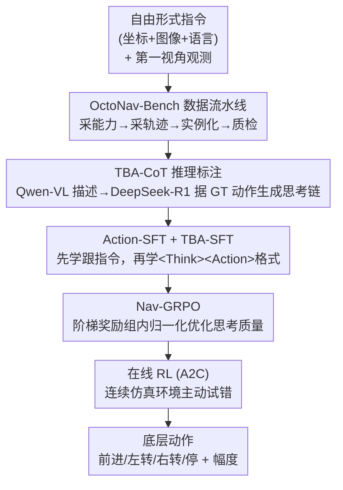

# OctoNav: Towards Generalist Embodied Navigation

**会议**: CVPR 2026  
**论文**: [CVF Open Access](https://openaccess.thecvf.com/content/CVPR2026/html/Gao_OctoNav_Towards_Generalist_Embodied_Navigation_CVPR_2026_paper.html)  
**代码**: https://buaa-colalab.github.io/OctoNav （项目页）  
**领域**: 具身导航 / VLA / 强化学习  
**关键词**: 通用导航, 自由形式指令, Think-Before-Action, VLA, GRPO

## 一句话总结
OctoNav 把 ObjNav / PointNav / ImgNav / Ins-ImgNav / VLN 五类彼此割裂的导航任务统一进一条"自由形式、多模态、多能力"指令里，配套放出 45k+ 指令-轨迹对的 OctoNav-Bench 与带推理链的 TBA-CoT 数据集，并训练出一个"先思考再行动"的 VLA 模型 OctoNav-R1（LLaMA-VID 底座 + 三阶段 SFT/GRPO/在线 RL 混合训练范式），把统一设定下的整体成功率从此前最好的 9.2% 提到 19.4%。

## 研究背景与动机

**领域现状**：具身导航的主流做法是把任务切成一个个窄定义子任务——PointNav 走到坐标、ImgNav/Ins-ImgNav 找到匹配参考图的场景或物体、ObjNav 找某类物体、VLN 跟随逐步语言指令。每个子任务有各自的输入模态、目标定义、benchmark 和专用模型。

**现有痛点**：这种"一任务一模型"的割裂让 agent 没有泛化弹性——一个 VLN agent 做不了 ImgNav，因为它从没见过"参考图当目标"这种模态。即便是 GOAT-Bench、LHPR-VLN 这类近期想做"通用"的 benchmark，也只覆盖两种能力，且每条指令仍只涉及单一能力/单一模态，本质上是"多个独立任务的集合"，并不是真正的通用导航。

**核心矛盾**：真实世界的指令天然是混合的，例如"导航到这个地方 {图}，然后穿过冰箱旁的门，左转找到衣柜，再返回 {x,y,z} 等待"——它同时横跨坐标、视觉、语言三种模态和 PointNav、ImgNav、VLN 三种能力。现有数据和模型从设计之初就假设"一条指令=一种能力一种模态"，根本无法表达也无法执行这种复合指令。

**本文目标**：(1) 造一个真正混合（multi-modal × multi-capability）的统一 benchmark；(2) 训一个能直接吃自由形式指令、只靠 2D 视觉观测就输出底层动作的通用 VLA 模型。

**切入角度**：作者借鉴 OpenAI-o1、DeepSeek-R1 的"先思考再回答"——既然导航指令复杂到需要拆解子目标、判断当前完成到哪一步、用常识推断目标在哪，那 agent 就不该像传统 VLA 那样"观测→动作"直接映射，而应该"观测→显式思考→动作"。

**核心 idea**：用"统一自由形式 benchmark + Think-Before-Action 推理 + 把 RL 塞进 VLA 训练"三件事，把分裂的导航任务收敛成一个会思考的通用 agent。

## 方法详解

### 整体框架

OctoNav 有两个一体两面的产出：**数据侧 OctoNav-Bench** 负责把五类能力压进同一条自由形式指令并配上轨迹、再蒸出推理链；**模型侧 OctoNav-R1** 以 LLaMA-VID 为底座做成 VLA，吃多模态指令 + 第一视角历史/当前观测，端到端吐出底层动作（move forward / turn left / turn right / stop + 幅度），训练用一套三阶段的混合训练范式 HTP（Hybrid Training Paradigm）。整条链路是：先用自动标注流水线造数据 → 用 Qwen-VL+DeepSeek-R1 给每个动作补"思考过程" → 先 Action-SFT 学会跟指令、再 TBA-SFT 学会带思考输出 → Nav-GRPO 强化思考质量 → 在线 RL 在仿真里主动试错收尾。

### 关键设计

**1. OctoNav-Bench 自动标注流水线：把五类能力压进一条自由形式指令**

割裂任务最根本的障碍是"没有混合数据"，作者用一条四阶段流水线造出来。**(I) 指令生成**：用一个 capability sampler 按预设原则（平衡各能力占比、平衡每条指令里能力的数量与顺序）先决定这条指令包含哪几种能力，再用 GPT 按采到的能力生成指令；此时具体元素（如 ImgNav 的参考图）还未定，用 placeholder 占位。**(II) 轨迹生成与指令实例化**：从一个 400+ 室内场景池（MP3D / HM3D / Gibson / ProcTHOR）采一个场景，用定制 trajectory sampler 采一条轨迹（约束轨迹长度、动作类型分布以保证多样真实），然后沿轨迹抽视觉/位置属性把 placeholder 落地——沿途选多个 waypoint 当子目标，每个子目标对应一种能力（如第一个子目标看到的图当 ImgNav 参考图、末尾子目标附近的物体类当 ObjNav 目标）。**(III) 指令扩展**：用 LLM 把每条指令扩成多个语义等价变体增加多样性。**(IV) 质检**：自动+人工双重过滤（剔除还带 placeholder 的未落地指令、过长指令、无意义参考图、怪异轨迹）。最终得到 45k+ 落地的指令-轨迹对，且关键性地用**连续环境（CE）**而非离散环境，让 agent 能在任意位置自由移动取观测，从而支持在线 RL。

**2. TBA-CoT 推理标注：给每个动作补一段"为什么这么走"的思考链**

光有指令-轨迹对，模型还是只能学"看到什么→走哪步"的硬映射，缺的是显式推理。作者借已有轨迹反向蒸馏思考过程：在时间步 $t$，agent 的真值动作（如 turn right 30°）是已知的；先取当前视图、历史视图、以及 ImgNav/Ins-ImgNav 的参考图，用 Qwen-VL 配结构化 prompt 把每张图转成语言描述（视觉模态→语言模态，保留关键感知线索）；再把这些描述聚合后连同**当前步的真值动作**一起喂给 DeepSeek-R1，让它据此动作倒推出一段详细的 reasoning trace。关键在"喂真值动作"——这样生成的思考链一定指向正确动作，等于用强推理 LLM 给弱 agent 造了 10k+ 条带标准答案的"思维教材"。这套数据让 OctoNav-Bench 成为首个带 TBA 标注的导航 benchmark。

**3. Action-SFT + TBA-SFT：先学会跟指令，再冷启动"先思考再行动"**

HTP 第一阶段分两步监督微调（LoRA 微调 LLaMA-VID 底座）。**Action-SFT** 用指令-轨迹对训练 $\pi_\theta$：每个训练样本是 $(\mathcal{V}, \mathcal{I}, \mathcal{A})$，视觉观测 $\mathcal{V}=(\mathcal{V}_h, \mathcal{V}_c)$ 含历史视频 $\mathcal{V}_h \in \mathbb{R}^{N_h \times H \times W \times 3}$ 和当前帧 $\mathcal{V}_c$；指令里的非文本元素（参考图等）用 `<ImageNav>` 这类 placeholder 替换，再由视觉编码器把对应图转成 embedding 顶替 placeholder 的 embedding；答案 $\mathcal{A}$ 是动作 $a \in \{\text{forward, left, right, stop}\}$ 加幅度 $m$（距离如 25cm 或角度如 90°）。损失是标准自回归：

$$\mathcal{L}_{act}(\theta) = -\mathbb{E}_{(\mathcal{V},\mathcal{I},\mathcal{A}) \sim D_{act}} \frac{1}{|\mathcal{A}|} \sum_{t=1}^{|\mathcal{A}|} \log \pi_\theta(\mathcal{A}^t \mid \mathcal{V}, \mathcal{I}, \mathcal{T}_{act}, \mathcal{A}^{<t})$$

**TBA-SFT** 紧接着用 TBA-CoT 数据训练，让模型输出结构化的 `<Think>推理</Think><Action>动作</Action>` 格式，损失同形式但数据换成 $D_{tba}$。妙处在于：通过不同 prompt 可控制模型输出"直接动作"还是"TBA 格式"，因此推理时能灵活调节思考频率（不必每步都想）。这一步是后续 RL 的冷启动——先让模型具备生成结构化思考的初步能力。

**4. Nav-GRPO + 在线 RL：用可验证奖励把思考质量和导航策略一起拉起来**

SFT 之后模型会"装模作样"地思考，但思考好不好没人监督，作者用两段 RL 收尾。**Nav-GRPO**（导航版 GRPO）对每个样本 $(\mathcal{V}_i, \mathcal{I}_i)$ 采 $G$ 个 TBA 输出，用**阶梯式可验证奖励**打分：动作和幅度都对给 1，动作对但幅度错给 0.5，动作错给 0——

$$r_{i,j} = \begin{cases} 1, & a_{i,j}=a_{gt} \land m_{i,j}=m_{gt} \\ 0.5, & a_{i,j}=a_{gt} \land m_{i,j} \neq m_{gt} \\ 0, & a_{i,j} \neq a_{gt} \end{cases}$$

"动作对幅度错给半分"的设计让模型在答案不完全精确时也能拿到梯度信号，比非 0 即 1 的严格奖励学得更稳（消融里 stepped > strict/loose）。优势用组内归一化 $\delta_{i,j} = (r_{i,j} - \text{mean}(r_i)) / \text{std}(r_i)$，再配 PPO 式 clip 和对 SFT 参考模型的 KL 约束更新。**在线 RL** 进一步利用 OctoNav-Bench 的连续仿真环境做主动学习，用 A2C：一个线性 critic 吃 OctoNav-R1 最后一层 Transformer 隐状态打 state 分，奖励兼顾到达目标和距离变化——

$$r_{on}(\mathcal{S}, \mathcal{A}, \mathcal{S}') = \begin{cases} 1, & \mathcal{S}' \text{ 成功} \\ -(d_{\mathcal{S}'} - d_{\mathcal{S}}), & \text{否则} \end{cases}$$

其中 $d$ 是到目标的距离（靠近即正奖励）。一个细节：转向类动作执行后到目标距离不变、奖励恒为 0，作者让 agent 在每个非移动动作后偷偷前进 $d'$ cm 以拿到非零奖励。critic 用 MSE 更新，并采用 warm-up 策略——初期冻结 OctoNav-R1 只训 critic，再放开联合训练。

### 一个完整示例

给一条混合指令"找到 {Ins-ImgNav 实例图} 里的物体并在当前环境确认其外观，找到床，径直走向床，到了就停下"，OctoNav-R1 在某一步会输出：`<think>我从客厅出发，已走到餐厅区域；第一个任务要在餐桌检查那把椅子，当前餐厅场景里左侧木桌带椅子，椅子已可见，第一个任务完成；第二个任务要去卧室，当前观测显示前方走廊、右侧有门，说明我在餐厅到卧室的过渡区，沿走廊前进很可能通向卧室找到床。</think><action>下一个动作是前进 75cm。</action>`。这段思考体现了三件难事：**理解任务顺序**（知道椅子任务已完成、切到找床）、**状态评估与切换**、以及**用室内布局常识推断目标位置**（床通常在卧室、卧室在走廊那头）——这正是"先思考再行动"相比"直接映射动作"在复合任务上的价值所在。

### 损失函数 / 训练策略

四个损失依次串起 HTP：Action-SFT 的 $\mathcal{L}_{act}$（式1）→ TBA-SFT 的 $\mathcal{L}_{tba}$（式2，同形式换 TBA 数据）→ Nav-GRPO 的 $\mathcal{L}_{grpo}$（式6，组内优势 + clip + KL 到 $\pi_{\theta_{SFT}}$）→ 在线 A2C 的 $\mathcal{L}_{on}$（式9，TD 误差 × log 概率）与 critic 的 MSE（式10）。推理时思考频率可调，实验取每 20 步思考一次为最优。

## 实验关键数据

环境基于 Habitat 仿真器，训练 400+ 场景、测试 40+ 场景（测试场景训练中未见），45k+ 指令-轨迹对、10k+ TBA-CoT。指标用 SR（全部子任务按序成功）、OSR（只看最终目标是否到达）、SPL（路径长度加权成功率），每种能力可单独算。

### 主实验

由于专用单任务模型根本无法处理混合指令，作者拿有一定泛化能力的 LLM/MLLM 类方法对比（部分经改造+在 OctoNav-Bench 微调）。

| 方法 | 类型 | Overall SR | Overall SPL | Overall OSR |
|------|------|-----------|-------------|-------------|
| Qwen-VL | MLLM 直接当 agent | 0.00 | 0.00 | 2.00 |
| Video-LLaVA | MLLM 直接当 agent | 0.80 | 0.45 | 3.80 |
| NavGPT-2* | 离散环境法改造 | 2.00 | 1.35 | 5.20 |
| NaVid | 连续环境法 | 5.80 | 4.34 | 11.40 |
| Uni-NaVid | 连续环境法 | 8.60 | 5.79 | 17.60 |
| Uni-NaVid† | +OctoNav 微调 | 9.20 | 6.21 | 17.80 |
| **OctoNav-R1 (ours)** | **VLA + HTP** | **19.40** | **13.77** | **29.40** |

OctoNav-R1 在所有五种能力的细分上都领先：例如 ImgNav SR 23.97（次优 11.16）、PointNav SR 23.51、ObjNav SR 49.18、VLN SR 37.14。即便是在同 benchmark 上微调过的最强 baseline Uni-NaVid† 也只有 9.20% SR，差距说明性能不是靠数据，而是靠模型设计 + HTP。

### 消融实验

| 配置 | Overall SR | Overall SPL | 说明 |
|------|-----------|-------------|------|
| Base-Model | 5.80 | 4.34 | LLaMA-VID 底座 |
| +Action-SFT | 8.80 | 7.20 | 学会跟指令，但 VLN SR 25.71→20.00（被牺牲换通用性） |
| +TBA-SFT | 14.40 | 10.32 | 思考能力，整体 +5.60，PointNav +11.55、ObjNav +15.16 |
| +Nav-GRPO | 17.00 | 12.04 | 强化思考质量，VLN SPL 拉到 29.14 |
| +Online RL | 19.40 | 13.77 | 主动学到更高效策略，ImgNav SR +4.55 |

另有细粒度消融：奖励设计上 stepped（17.00）> strict（16.20）> loose（15.40），证实"半分梯度"有效；prompt 用 diverse（17.00）优于 single（15.80）；思考频率 per-20-step（19.40）最佳，per-10（17.00）和 per-40（18.80）都略低。

### 关键发现
- **TBA-SFT 贡献最大**：单这一步把整体 SR 从 8.80 拉到 14.40（+5.60），且对几乎所有能力都大幅提升——显式"先思考"对多能力复合指令是刚需，不是锦上添花。
- **Action-SFT 有"通用税"**：为提升整体通用性，VLN 这种本就强的能力 SR 反而从 25.71 掉到 20.00，是 specialist→generalist 的权衡代价；后续 TBA/RL 阶段再把它补回到 37.14。
- **思考频率不敏感但非越多越好**：per-20 比 per-40 仅高 0.6 个点，说明频率本身不是瓶颈，但"在哪里、什么时候思考"作者留作未来工作。
- **sim2real 初步可迁移**：OctoNav-R1 部署到真实机器人上无需真实世界微调即有初步迁移能力。

## 亮点与洞察
- **"先思考再行动"被搬进导航 VLA**：传统 VLA 是观测→动作的反射式映射，作者把 o1/R1 的 long-CoT 思路落到具身导航，用 TBA-CoT 数据让模型显式拆解子目标、判断进度、用常识推位置——这是把推理 LLM 的红利迁到具身控制的清晰范式。
- **用真值动作反向蒸思考链**：给 DeepSeek-R1 喂当前步的 GT 动作再让它倒推 reasoning，巧妙地把"生成思考"这个开放问题变成"给定答案补解释"的可控问题，保证思维链一定指向正确动作，这个 trick 可迁移到任何"有真值动作但缺推理标注"的模仿学习场景。
- **阶梯奖励缓解稀疏信号**：导航动作"对/错"二值奖励太稀疏，"动作对幅度错给 0.5"让部分正确的样本也能贡献梯度，是把分类式奖励软化成可学信号的实用设计。
- **连续环境是 RL 的前提**：作者特意把 benchmark 做成 CE 而非 DE，正是为了让 agent 能在任意位置取观测、做在线试错——数据设计直接服务于训练算法，这种"benchmark 与方法协同设计"的思路值得借鉴。

## 局限与展望
- **绝对成功率仍低**：19.40% 的整体 SR 虽是 SOTA 但远未可用，复合多能力长程指令对当前模型仍极难，离实用还有很大距离。
- **思考的"何时/何地"未解**：作者承认思考频率虽不敏感，但 where/when to think 缺乏自适应机制，目前是固定频率，留作未来工作——理想情况下 agent 应在困惑时多想、笃定时少想。
- **TBA-CoT 是伪标注**：思考链由 Qwen-VL+DeepSeek-R1 基于真值动作生成，是"事后合理化"而非真实决策过程，可能存在 LLM 幻觉或与真实视觉证据不符的推理，质检主要靠规则+人工，难保完全对齐。
- **sim2real 仅初步**：真实机器人迁移只是定性 demo，没有量化的真实环境成功率，能力边界不明。
- **底座与动作空间受限**：动作只有前进/左转/右转/停四类离散动作 + 幅度，缺乏更精细或更高自由度的运动控制。

## 相关工作与启发
- **vs GOAT-Bench / LHPR-VLN**：它们也想做"通用/长程"导航，但每条指令只含单一能力单一模态，本质是多个独立任务的拼盘；OctoNav-Bench 的每条指令是 multi-modal × multi-capability 的真混合，且首次提供 TBA 推理标注和连续环境 RL 支持。
- **vs Uni-NaVid / NaviLLM**：这些统一模型靠在已有多任务数据集上直接多任务学习，面对自由形式混合指令就崩（微调后最高 9.20% SR）；OctoNav-R1 靠统一数据 + 思考 + RL，证明"简单拼多任务数据"和"真通用 benchmark"有本质差距。
- **vs NaVid / NavGPT-2**：NaVid 微调 video-MLLM 做特定任务、NavGPT 系把 LLM 当零样本 agent 靠 prompt；OctoNav-R1 既不是单任务也不是纯 prompt，而是端到端 VLA + 多阶段 RL 微调。
- **vs Vision-R1 / Video-R1**：这些把 RL+CoT 用在静态多模态任务上；OctoNav 把同样思路推进到需要主动移动、状态随轨迹演变的具身导航，难度更高。

## 评分
- 新颖性: ⭐⭐⭐⭐⭐ 首个把五类导航能力统一进自由形式混合指令、并配 TBA 推理标注 + RL 增强 VLA 的工作，benchmark 与方法双贡献。
- 实验充分度: ⭐⭐⭐⭐ 主实验对比充分、HTP 逐阶段消融清晰、奖励/prompt/思考频率都有细粒度消融；扣分在 sim2real 仅定性、缺真实环境量化。
- 写作质量: ⭐⭐⭐⭐ 动机和 pipeline 讲得清楚，公式完整；部分实现细节（如 critic warm-up、$d'$ 取值）偏简略。
- 价值: ⭐⭐⭐⭐⭐ 给"通用具身导航"立了统一 benchmark 与可复现的训练范式，TBA-CoT 数据和 think-before-action 思路对后续工作有明确推动力。

<!-- RELATED:START -->

## 相关论文

- [\[CVPR 2026\] FM-Steer: Enhance Generalist Policies with Value-Guided Cascaded Denoising](fm-steer_enhance_generalist_policies_with_value-guided_cascaded_denoising.md)
- [\[CVPR 2026\] Progress-Think: Semantic Progress Reasoning for Vision-Language Navigation](progress-think_semantic_progress_reasoning_for_vision-language_navigation.md)
- [\[CVPR 2026\] D3D-VLP: Dynamic 3D Vision-Language-Planning Model for Embodied Grounding and Navigation](d3d-vlp_dynamic_3d_vision-language-planning_model_for_embodied_grounding_and_nav.md)
- [\[ICML 2026\] RoboMME: Benchmarking and Understanding Memory for Robotic Generalist Policies](../../ICML2026/robotics/robomme_benchmarking_and_understanding_memory_for_robotic_generalist_policies.md)
- [\[CVPR 2026\] MergeVLA: Cross-Skill Model Merging Toward a Generalist Vision-Language-Action Agent](mergevla_cross-skill_model_merging_toward_a_generalist_vision-language-action_ag.md)

<!-- RELATED:END -->
