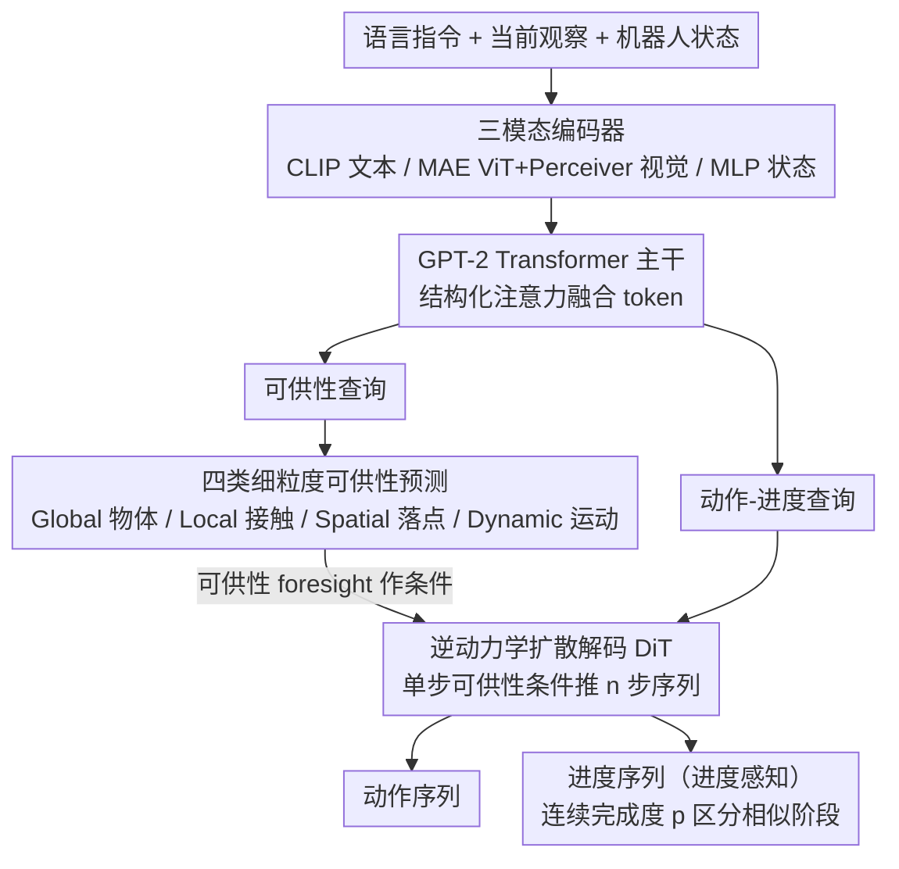

# PALM: Progress-Aware Policy Learning via Affordance Reasoning for Long-Horizon Robotic Manipulation

**会议**: CVPR 2026  
**arXiv**: [2601.07060](https://arxiv.org/abs/2601.07060)  
**代码**: [项目主页](https://plan-lab.github.io/palm)  
**领域**: 目标检测 / 机器人操作 / VLA模型  
**关键词**: 长时域操作, 可供性推理, 进度感知, 视觉语言动作模型, 扩散Transformer

## 一句话总结

提出 PALM，一个统一的 VLA 框架，通过结构化的细粒度可供性预测（全局/局部/空间/动态四类）作为隐式推理锚点，结合连续子任务进度估计实现无缝任务切换，在 CALVIN ABCD 上平均完成长度达 4.48（超越前 SOTA 12.5%），LIBERO-LONG 成功率 91.8%，真实世界长时域泛化测试中达到基线 2 倍以上。

## 研究背景与动机

1. **领域现状**：VLA 模型已在短时域操作中取得显著进展，代表方法包括自回归式（OpenVLA、RT系列）、扩散式（Diffusion Policy、π0）和预测式（Seer）。但在长时域、多步骤任务中仍然挣扎。

2. **现有痛点**：(1) 缺乏结构化可供性线索——模型不知道"下一步应该操作哪个物体、接触哪个部位、放到哪里、用什么运动"；(2) 缺乏子任务内部的进度追踪——视觉外观相似的状态可能对应不同动作阶段，导致重复动作、跳过步骤、提前终止等长时域特有的失败模式。

3. **核心矛盾**：标准行为克隆将不同任务阶段的演示混在一起训练，collapse 了阶段差异。视觉上相似但任务阶段不同的状态变得模糊不可区分，导致策略在长时域执行中不稳定。

4. **本文目标** (1) 为策略提供显式的、结构化的可供性表示作为"推理锚点"；(2) 引入连续的子任务进度信号来消除阶段歧义、稳定长时域执行。

5. **切入角度**：构建感知-动作-进度的闭环。可供性预测作为"中间隐式推理步骤"，进度信号作为"时间正则化器"。

6. **核心 idea**：用四类可供性对未来交互场景做结构化预测，再以进度感知的逆动力学模型联合生成动作和进度序列。

## 方法详解

### 整体框架

PALM 想解决的是：标准 VLA 在长时域任务里"看着像但其实不知道下一步该干嘛"，于是它在感知和动作之间插了一层结构化的"交互预测"，再用一个进度标量把执行节奏钉死。整条管线是这样转的：语言指令 $l$、当前观察 $o_t$、机器人状态 $s_t$ 先各自过编码器（CLIP 编文本、MAE ViT + Perceiver Resampler 编视觉、MLP 编状态），拼成一串 token 喂进 GPT-2 Transformer 主干做结构化注意力融合；融合后的上下文驱动两组可学习查询——一组是细粒度可供性查询，预测未来要交互的场景线索 $\hat{\mathbf{F}}_{t+n}$；另一组是动作-进度查询，把可供性当条件，送进逆动力学的扩散 Transformer（DiT）一次性解码出未来 $n$ 步的动作序列 $\hat{a}_{t:t+n-1}$ 和进度序列 $\hat{p}_{t:t+n-1}$。换句话说，可供性是"先想清楚要碰什么、碰哪儿、放哪儿、怎么动"的隐式推理步，进度则是贯穿这 $n$ 步的时间标尺。

### 关键设计

**1. 四类细粒度可供性预测：把"下一步该操作什么"拆成四个可监督的具体问题**

长时域失败的一个直接原因是模型缺乏结构化的交互线索——它不知道该操作哪个物体、接触哪个部位、放到哪里、用什么运动。PALM 没有用一个笼统的"未来表示"去糊弄，而是让四个专用子查询各自回答一个粒度的问题，并分别从现成工具蒸馏出监督信号：**Global** 用 Grounding DINO + SAM 产出目标物体的分割掩码，预测"哪个物体"（实例级语义）；**Local** 把标注接触点转成高斯热图，预测"物体的哪个部位"（接触级几何）；**Spatial** 用 SpatialVLM + RoboPoint 采样放置候选点、以集合匹配损失监督，预测"放到哪里"（候选放置区域）；**Dynamic** 用 CoTracker 跟踪运动轨迹提取动态区域、以 VAE 重建损失监督，预测"怎么动"（运动区域如何演化）。这四类从粗到细、互相补位——语义定物体、几何定接触、空间定落点、动态定运动——合起来就给策略提供了一套任务相关的场景先验，比预测一整帧未来图像更紧凑也更直接对齐控制需求。

**2. 进度感知策略：用一个标量把"看着相似但阶段不同"的状态区分开**

长时域里另一个隐患是阶段歧义——同一只手悬在杯子上方，可能是"刚要去抓"也可能是"已经放完正在收回"，外观几乎一样但该执行的动作完全相反；标准行为克隆把这些不同阶段的演示混在一起训练，正好把阶段差异 collapse 掉了。PALM 的处理简单到几乎廉价：在动作输出后面追加一个连续完成度 $p_t \in [0,1]$，让策略联合预测 $(a_t, p_t)$。这个标量起到时间正则化器的作用，逼着潜在状态沿子任务做单调、阶段一致的演化，于是视觉相似但进度不同的状态在表示空间里被拉开，子任务转换也能平滑发生。监督来自人工标注的连续进度标签，以及从长时域视频（EPIC-KITCHENS、RoboCerebra）的语义阶段分割里提取的进度信号。好处是不必再挂一个独立的高层规划器或层次化控制器，单条策略就完成了子任务切换。

**3. 基于逆动力学的扩散 Transformer 解码：把"两帧推一步动作"扩展成"一步可供性推 n 步动作-进度"**

传统逆动力学从相邻两帧反推中间的单步动作，但长时域需要的是一段连贯轨迹而非孤立动作。PALM 把这个范式拉长：以当前输入加上单步可供性潜变量为条件，一次推断未来 $n$ 步的动作-进度序列，用 DiT 做条件去噪

$$(\hat{a}_{t:t+n-1},\ \hat{p}_{t:t+n-1}) = \text{DiT}(l,\ o_t,\ s_t,\ \hat{\mathbf{F}}_{t+n})$$

训练用标准扩散去噪目标优化噪声预测。选扩散而非回归头，是因为操作动作往往是多峰分布（同一场景可以有多条合法轨迹），扩散能把这种多峰性建模出来，解出来的时序轨迹也更平滑，正好和进度信号要求的单调演化相互配合。

### 损失函数 / 训练策略

- 可供性损失：$\mathcal{L}_{global}$（Focal + Dice）、$\mathcal{L}_{local}$（Focal + KL）、$\mathcal{L}_{spatial}$（集合匹配L2）、$\mathcal{L}_{dynamic}$（VAE ELBO）
- 动作-进度损失：标准扩散去噪损失 $\mathcal{L}_{DiT}$
- 两阶段训练：大规模预训练（DROID + BridgeV2 + EPIC-KITCHENS + RoboCerebra）→ 微调（942条人工标注轨迹）
- Backbone: GPT-2 Transformer，384维，24层，12头
- 视觉: MAE ViT-B + Perceiver Resampler

## 实验关键数据

### 主实验

CALVIN ABCD（1000 次 rollout / 任务）：

| 方法 | 1任务 | 2任务 | 3任务 | 4任务 | 5任务 | Avg.Len.↑ |
|------|-------|-------|-------|-------|-------|-----------|
| OpenVLA | 91.3% | 77.8% | 62.0% | 52.1% | 43.5% | 3.27 |
| π0 | 93.8% | 85.0% | 76.7% | 68.1% | 59.9% | 3.92 |
| Seer | 94.4% | 87.2% | 79.9% | 72.2% | 64.3% | 3.98 |
| PALM (✗ progress) | 95.3% | 85.6% | 79.5% | 74.3% | 67.0% | 4.02 |
| **PALM** | **96.9%** | **93.8%** | **89.3%** | **85.9%** | **82.0%** | **4.48** |

LIBERO 全套件（3 seeds × 500 episodes）：

| 方法 | 平均 | Spatial | Object | Goal | Long |
|------|------|---------|--------|------|------|
| CoT-VLA | 81.1% | 87.5% | 91.6% | 87.6% | 69.0% |
| CoA-VLA | 79.8% | 85.3% | 93.1% | 85.8% | 55.0% |
| **PALM** | **94.5%** | **95.2%** | **96.7%** | **94.3%** | **91.8%** |

### 消融实验

CALVIN ABCD 上各组件消融：

| 消融 | 预训练 Avg.Len. | 微调 Avg.Len. |
|------|----------------|--------------|
| PALM 完整 | 4.48 | 4.48 |
| ✗ Affordance Foresight | 3.90 | 3.58 |
| ✗ Inverse Dynamic | 4.17 | 3.92 |
| ✗ Progress Prediction | 3.73 | 4.02 |

真实世界长时域泛化（6 步连续任务）：

| 泛化设定 | OpenVLA Avg.Len. | Octo Avg.Len. | PALM Avg.Len. |
|---------|-----------------|--------------|--------------|
| 随机定位 | 0.95 | 0.65 | **3.05** |
| 视觉干扰 | 1.60 | 0.95 | **3.80** |
| 未见光照 | 1.25 | 1.05 | **3.55** |

### 关键发现

- **进度预测是长时域泛化的核心**：去掉进度预测，CALVIN 5 任务成功率从 82.0% 降至 67.0%（-15%），预训练阶段降幅更大（4.48→3.73），说明大规模长时域视频数据特别有利于学习进度先验
- **可供性预测在微调阶段最关键**：去掉可供性，微调 Avg.Len. 从 4.48 降至 3.58（降幅最大），说明结构化可供性在适配到下游机器人数据时不可或缺
- **四类可供性累积贡献**：Global→+Local→+Spatial→+Dynamic 逐步提升，Dynamic 可供性（运动区域预测）为最终的增量贡献
- **LIBERO-LONG 提升 22.8%**：从 CoT-VLA 的 69.0% 提升至 91.8%，证明可供性+进度在最具挑战性的长时域场景中优势最大
- **真实世界泛化约为基线 2-3 倍**：在三种泛化设定下，PALM 的 Avg.Len. 一致是 OpenVLA 的 2-3 倍

## 亮点与洞察

- **闭环设计优雅**：感知（可供性预测）→动作（扩散策略）→进度（子任务追踪）形成闭环，每个模块有明确的功能分工，但通过共享的 Transformer backbone 和注意力机制紧密耦合
- **进度信号消除阶段歧义**：这是一个简单但极其有效的正则化——一个标量 $p_t \in [0,1]$ 就能显著提升长时域性能，可以迁移到任何需要长时域执行的策略学习中
- **结构化注意力设计合理**：可供性子查询只注意上下文 token（保持解耦），动作查询同时注意上下文和可供性（获取条件信息），因果注意力保持时序一致性

## 局限与展望

- 可供性的监督标签依赖 Grounding DINO/SAM/SpatialVLM/CoTracker 等多个现成工具，标注流程复杂
- 四类可供性的设计是手工定义的，可能遗漏了其他重要的交互线索（如力/触觉、声音等）
- 微调仅用 942 条标注轨迹 + 200 条真实demo，数据效率虽好但泛化到全新任务类型的能力有待验证
- 真实世界评估限于单臂桌面操作，尚未测试双臂或移动操作

## 相关工作与启发

- **vs Seer**: Seer 预测未来图像作为 foresight，PALM 预测结构化可供性（更紧凑、更任务相关）。CALVIN 上 Avg.Len. 从 3.98 提升至 4.48
- **vs π0**: 同为扩散策略但无显式可供性和进度信号，CALVIN 5 任务从 59.9% 提升至 82.0%
- **vs CoT-VLA/CoA-VLA/TraceVLA**: 各种增强 VLA 推理的方法（思维链/可供性链/行为轨迹），但都没有进度追踪，LIBERO 上差距明显
- 进度信号 + 可供性预测的组合范式可迁移到自动驾驶等其他需要长时域规划的领域

## 评分

- 新颖性: ⭐⭐⭐⭐ 可供性预测+进度估计的组合是新颖的闭环设计，但各子组件（MAE/CLIP/DiT）是成熟技术
- 实验充分度: ⭐⭐⭐⭐⭐ 两大仿真基准+三种真实世界泛化设定，消融完备，数据消融也做了
- 写作质量: ⭐⭐⭐⭐ 整体结构清晰，插图丰富，但方法细节较多需要反复阅读
- 价值: ⭐⭐⭐⭐⭐ 在长时域操作这一核心挑战上取得大幅提升，进度信号的思路可广泛迁移

<!-- RELATED:START -->

## 相关论文

- [\[CVPR 2026\] Recurrent Reasoning with Vision-Language Models for Estimating Long-Horizon Embodied Task Progress](recurrent_reasoning_with_vision-language_models_for_estimating_long-horizon_embo.md)
- [\[CVPR 2026\] AGiLe: Learning Robust Long-Horizon Manipulation via Affordance-Grounded Bidirectional Latent Planning](agile_learning_robust_long-horizon_manipulation_via_affordance-grounded_bidirect.md)
- [\[CVPR 2026\] Progress-Think: Semantic Progress Reasoning for Vision-Language Navigation](progress-think_semantic_progress_reasoning_for_vision-language_navigation.md)
- [\[AAAI 2026\] ManiLong-Shot: Interaction-Aware One-Shot Imitation Learning for Long-Horizon Manipulation](../../AAAI2026/robotics/manilong-shot_interaction-aware_one-shot_imitation_learning_for_long-horizon_man.md)
- [\[CVPR 2026\] Learning to See and Act: Task-Aware Virtual View Exploration for Robotic Manipulation](learning_to_see_and_act_task-aware_virtual_view_exploration_for_robotic_manipula.md)

<!-- RELATED:END -->
