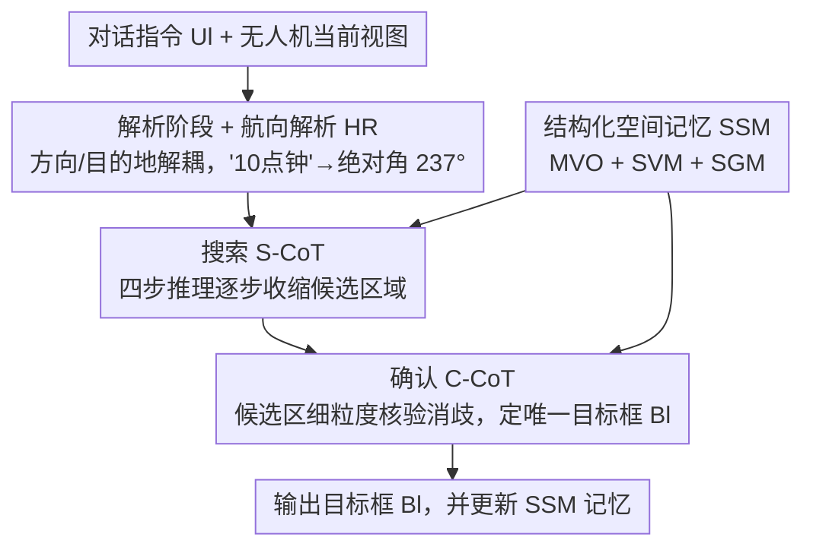

# Parse, Search, and Confirmation: Training-Free Aerial Vision-and-Dialog Navigation with Chain-of-Thought Reasoning and Structured Spatial Memory

**会议**: CVPR 2026  
**论文**: [CVF Open Access](https://openaccess.thecvf.com/content/CVPR2026/html/Qi_Parse_Search_and_Confirmation_Training-Free_Aerial_Vision-and-Dialog_Navigation_with_Chain-of-Thought_CVPR_2026_paper.html)  
**代码**: https://github.com/QY6616/PSC-AVDN （待开源）  
**领域**: 机器人 / 具身导航  
**关键词**: 空中视觉对话导航, 无人机, 免训练, 思维链, 空间记忆

## 一句话总结
针对"高空无人机视觉对话导航（AVDN）以往都得监督微调、换环境就要重标重训"的痛点，本文提出免训练框架 PSC-AVDN：把 MLLM 的导航拆成"解析—搜索—确认"三段式思维链，再配一个结构化空间记忆（SSM）补足 MLLM 缺失的空间/历史信息，在 ANDH / ANDH-Full 上拿到免训练设定下的 SOTA，甚至追平或超过若干微调方法。

## 研究背景与动机
**领域现状**：空中视觉对话导航（AVDN）让无人机按自然语言指令飞行、并通过对话消歧。它是高空俯视视角（类似遥感图），覆盖范围广、地标小而稀疏，适合救灾、环境监测、地理测绘等场景。以往 AVDN 方法基本都靠**监督微调**。

**现有痛点**：监督微调代价高——算力、标注都贵，而且换新环境就得重标重训、跨域泛化差。一个自然的想法是直接拿 MLLM 免训练做：把当前视图+对话指令喂给 MLLM，用任务提示驱动它一步步搜目标。但这样朴素迭代搜索很不可靠，原因有二。① **方向 grounding 弱**：MLLM 训练数据以近距离、地面视角为主，碰到"往右偏一点""朝你 10 点钟方向"这类抽象方位词，翻译不成反映无人机空间布局的几何线索，早早就走错；而且高空俯视下地标小、纹理稀疏，难对齐图文。② **缺全局空间理解和时序状态跟踪**：AVDN 要记住去过哪、多步更新对环境的信念，但自回归、语言驱动的推理没有建图或长程一致性的结构化机制，每帧都被孤立地解释，复杂场景里导航不稳。

**核心矛盾**：MLLM 的视觉语言先验（近景、地面）和 AVDN 需要的几何空间推理（高空、俯视）之间存在域差，且语言驱动推理天生没有显式空间记忆。

**本文目标**：把上述两个限制分别破掉——(1) 让方向理解与高空目标定位**解耦**；(2) 给 MLLM 补一套**显式的结构化空间记忆**。

**核心 idea**：用"解析-搜索-确认"三段式思维链承载 (1)，用结构化空间记忆 SSM 承载 (2)，全程免训练，纯靠 MLLM 原生能力 + 提示工程。

## 方法详解

### 整体框架
AVDN 任务含 $L$ 轮对话，每轮 $l$ 收到指令 $U_l$，PSC-AVDN 执行一次完整的"解析(Parsing)→搜索(Search)→确认(Confirmation)"循环，输出该轮目标框 $B_l=(x^1_l,y^1_l,x^2_l,y^2_l)$，最后一轮的框是导航终点。解析阶段用一个通用 LLM 把含糊的对话指令转成稳定的几何方向线索和目的地描述；搜索阶段用 Search-CoT（S-CoT）在高空观测下分步探索、逐步收缩候选区域；确认阶段用 Confirmation-CoT（C-CoT）在候选区周围做细粒度核验、消歧定到唯一目标。贯穿搜索与确认两段的是结构化空间记忆 SSM，它持续提供多尺度视觉观测、空间视觉记忆、结构化几何记忆三路互补线索，给推理补上全局空间上下文和长程一致性。

### 关键设计

**1. 解析阶段 + 航向解析（HR）：把含糊方位词解耦成可执行的绝对角**

痛点是 MLLM 翻译不了"10 点钟""往右偏一点"这类抽象方位。作者先用通用 LLM（DeepSeek-V3）把对话指令 $U$ 结构化分解，抽出运动方向短语 $s_{dir}$ 和目的地描述 $s_{des}$。但 $s_{dir}$ 形式五花八门（"3 o'clock"、"120°"、"north-east"），于是设计 **Heading Resolution（HR）** 模块用基于规则的解析把时钟式、度数式、罗盘式统一映射成 $[0,2\pi)$ 内的绝对角 $\alpha$；再结合无人机当前方位 $\phi$ 算相对航向：

$$\delta = \mathrm{wrap}(\alpha - \phi),$$

$\mathrm{wrap}(\cdot)$ 把角归一到 $[0,2\pi)$。比如图中"10 点钟"被转成绝对"237°"。这样把"方向理解"从"高空目标定位"里剥出来单独、可靠地解决，后续推理拿到的是稳定可执行的几何信号 $\delta$ 加目的地描述 $s_{des}$，避免方向歧义导致早期失败。

**2. 搜索思维链 S-CoT：把目标搜索拆成四步可解释推理**

朴素让 MLLM"看图找目标"在高空大场景里很飘。S-CoT 把搜索拆成四个串行子步：① **目的地分析**——对 $s_{des}$ 做语义解析，抽出目标类别（"warehouse"）、显著参照（"red building"）、空间关系（"on the left side"）作为显式约束；② **场景理解**——用 SSM 提供的多尺度观测 $V_t$ 和空间视觉记忆 $M_t$ 构建对当前视图的整体理解；③ **参考网格图生成**——把主视图划成 $N\times N$ 网格、给每格打预定义类别标签，生成结构化几何记忆 $R_t$，帮模型更结构化地理解场景；④ **目标定位**——基于视觉特征和目的地信息在主视图里框出候选目标区域，命中后进入确认阶段。这套显式分步把候选区一步步收窄，提升了 MLLM 在复杂空中搜索里的稳定性和可解释性。

**3. 确认思维链 C-CoT：候选区细粒度消歧定唯一目标**

即便搜到目标附近，高空俯视下目标仍小、尺度变化大、地标弱、和周边空间语义关系复杂，光靠 S-CoT 难精确定位。C-CoT 的核心是用可解释推理链对候选区做核验和消歧：先强制模型基于目的地描述生成可验证的逐步推理，再用多尺度视图核对空间和关系约束，依据更细的局部结构、方向、邻接关系逐步排除错误候选。例如指令"left side 有红楼的大仓库"，模型先找大仓库、再查其左侧是否有红楼、最后验证两者的空间邻接关系，最终确定唯一目标区域、输出当前轮 bbox $B$（并附置信度和简短视觉证据）。C-CoT 里同样提示模型生成参考网格图辅助空间感知。

**4. 结构化空间记忆（SSM）：给 MLLM 补三路显式空间/历史线索**

痛点是只靠单帧主视图，MLLM 缺全局空间和时序状态。SSM 在推理链中渐进运行，提供三类互补线索：① **多尺度视觉观测（MVO）**——对全局遥感图 $I$ 按尺度因子 $s_i$ 重采样得到不同尺度切片 $V^i_t=\mathrm{Resample}(I,s_i)$，拼成 $V_t=[V^1_t,\dots,V^M_t]$，让模型同时看大场景布局和细节（实现用尺度因子 3/5/7）；② **空间视觉记忆（SVM）**——把历史主视图、轨迹和朝向融进一张全局坐标系下的记忆画布，更新式为 $M_t=(M_{t-1}\oplus V_t)\oplus(T_t\oplus\theta_t)$（$\oplus$ 为拼接），用凸包生成统一空间掩码表示累计覆盖，维持对已探索区域的感知、抑制长程漂移；③ **结构化几何记忆（SGM）**——提示模型把中尺度视图 $V^m_t$ 划成 $N\times N$ 网格、给每格赋语义标签 $c_j$（从对话里统计出的 12 个高频类别），得 $\bar R_t=[r_1,\dots,r_{N^2}]$（$r_j=(p_j,c_j)$），再 $R_t=\mathrm{Update}(R_{t-1},\bar R_t)$ 持续更新，为多步空间推理提供稳定结构先验。三者一起喂给 S-CoT 和 C-CoT。

### 一个完整示例
以"head towards your 4 o'clock till you reach a large warehouse with a red building on the left side"为例：**解析**——LLM 抽出方向"4 o'clock"、目的地"left 有红楼的大仓库"，HR 把"4 点钟"转成绝对航向"190°"；**搜索 S-CoT**——目的地分析得（仓库 / 红楼 / 在左）三约束，场景理解用 MVO+SVM，生成 5×5 参考网格图（SGM），在主视图定位到候选仓库；**确认 C-CoT**——核验"中央灰顶建筑是大仓库""其左侧确有红楼""二者邻接"，排除其他候选，输出唯一目标 bbox 并更新 SSM 记忆，进入下一轮对话。

## 实验关键数据

### 主实验
在 ANDH（子轨迹）和 ANDH-Full（完整轨迹，更长程）上评测，指标为 SR（成功率）、SPL（按路径长度加权的成功率）、GP（目标进度）。下表取 ANDH Unseen Val.：

| 方法 | 设定 | SPL | SR | GP |
|------|------|------|------|------|
| GPT-4o | 免训练 | 3.4 | 3.9 | -11.8 |
| Qwen-VL-Max | 免训练 | 8.7 | 9.2 | 5.5 |
| **PSC-AVDN（本文）** | 免训练 | **17.8** | **22.6** | **39.2** |
| FELA | 监督微调 | 17.2 | 20.6 | 63.0 |
| HAA-LSTM | 监督微调 | 18.3 | 20.0 | 54.4 |

本文在免训练设定下大幅超过 GPT-4o / Qwen-VL-Max 等通用 MLLM 基线，SPL/SR 上甚至追平或超过若干监督微调方法（如 FELA）；在更长程的 ANDH-Full 上同样取得整体 SOTA（如 Seen Val. SPL 19.1 / SR 22.3 / GP 75.1）。GP 仍低于部分微调法，说明长程进度上免训练还有差距。

### 消融实验
三段式推理（ANDH Unseen Val.，Table 2）：

| 配置 | SPL | SR | GP |
|------|------|------|------|
| 基线（Qwen-VL-Max 迭代搜索） | 8.7 | 9.2 | 5.5 |
| + Parsing | 13.5 | 14.6 | 26.2 |
| + Parsing + Search | 15.6 | 17.5 | 25.8 |
| + Parsing + Search + Confirmation | **16.3** | **19.3** | **35.7** |

SSM 组件（Table 3，在三段式之上叠加）：

| 配置 | SPL | SR | GP |
|------|------|------|------|
| 无 SSM | 16.3 | 19.3 | 35.7 |
| + SVM | 16.5 | 20.4 | 36.6 |
| + SVM + MVO | 16.6 | 21.1 | 38.3 |
| + SVM + MVO + SGM（完整） | **17.8** | **22.6** | **39.2** |

### 关键发现
- 三段式逐级有效：Parsing 贡献最大的一跳（SR 9.2→14.6、GP 5.5→26.2），印证"方向解耦"是朴素 MLLM 导航的最大短板；Search、Confirmation 继续累积增益。
- SSM 三组件叠加单调涨点，SVM（历史记忆）先带来时空一致性，MVO（多尺度）补局部+全局感知，SGM（参考网格图）收尾把空间推理拉到最优。
- 参考网格大小敏感（Table 4）：5×5 最佳（SPL 17.8 / SR 22.6 / GP 39.2），过细（10×10）或过粗（3×3）都掉点，说明网格粒度要匹配高空地标的尺度。

## 亮点与洞察
- **"方向解耦"是朴素 MLLM 导航的最大收益点**：消融里 Parsing 单步就把 SR 翻倍、GP 从 5.5 跳到 26.2——把抽象方位词用规则化 HR 转成绝对角，比让 MLLM 硬猜方向有效得多，这个 trick 可迁移到任何"语言里带方位词"的具身任务。
- **全程免训练却追平微调法**：纯靠通用 LLM（解析）+ 通用 MLLM（搜索确认）+ 提示工程，不碰任何 task-specific 训练，换环境无需重标重训，这对实际无人机部署的资源效率很有价值。
- **让 MLLM 自己画网格当空间记忆**：SGM 不依赖 Grounded-SAM、OpenGIS 等外部模型（对比 GeoNav），只在推理链里提示 MLLM 生成参考网格图，零外部依赖地补上了结构化空间先验。

## 局限与展望
- GP（目标进度）仍明显低于部分监督微调法，长程进度上免训练有差距；高空小目标的精确终点定位仍是瓶颈。
- 依赖强通用 LLM/MLLM（DeepSeek-V3 + Qwen-VL-Max）的现成能力，整体性能受底座上限和推理成本约束；多步 CoT + 多尺度切片推理开销不小。
- HR 是基于规则的方位解析，对训练集里未覆盖的非常规方位表达可能解析失败。
- 参考网格语义类别（12 类）和网格大小（5×5）从数据集统计得来，换到差异较大的新场景可能需要重调。

## 相关工作与启发
- **vs 监督微调 AVDN（FELA、TA-GAT、HAA-T 等）**：它们靠 task-specific 训练拿高性能但代价高、跨域差；本文免训练、即插即用，性能可比，工程成本低得多。
- **vs GeoNav（认知地图）**：GeoNav 的认知地图依赖 Grounded-SAM、OpenGIS 等外部模型，部署复杂；本文 SGM 只用 MLLM 原生能力在推理链里生成网格图，无外部依赖。
- **vs Open-Nav（地面免训练 VLN）**：同样走免训练 CoT 路线，但本文专攻高空俯视 AVDN 的方向歧义和弱小地标，额外引入 HR 解耦和三路 SSM，针对性更强。

## 评分
- 新颖性: ⭐⭐⭐⭐ 首个三段式结构化推理的免训练 AVDN 框架，HR 解耦 + SSM 三路记忆组合有新意。
- 实验充分度: ⭐⭐⭐⭐ 两数据集三指标 + 三段式/SSM/网格大小多层消融完整，但缺对不同 MLLM 底座的系统横评（仅附录提及）。
- 写作质量: ⭐⭐⭐⭐ 动机—两限制—两对策的结构清晰，示例和公式交代到位。
- 价值: ⭐⭐⭐⭐ 免训练即可追平微调法，对资源受限的无人机导航部署有实际意义。

<!-- RELATED:START -->

## 相关论文

- [\[CVPR 2026\] FantasyVLN: Unified Multimodal Chain-of-Thought Reasoning for Vision-and-Language Navigation](fantasyvln_unified_multimodal_chain-of-thought_reasoning_for_vision-and-language.md)
- [\[CVPR 2026\] Towards Training-Free Scene Text Editing](towards_training-free_scene_text_editing.md)
- [\[CVPR 2026\] TRM-VLA: Temporal-Aware Chain-of-Thought Reasoning and Memorization for Vision-Language-Action Models](trm-vla_temporal-aware_chain-of-thought_reasoning_and_memorization_for_vision-la.md)
- [\[CVPR 2026\] Memory-Augmented Scene Understanding and Exploration for Open-World Aerial Object-Goal Navigation](memory-augmented_scene_understanding_and_exploration_for_open-world_aerial_objec.md)
- [\[CVPR 2026\] ACoT-VLA: Action Chain-of-Thought for Vision-Language-Action Models](acot-vla_action_chain-of-thought_for_vision-language-action_models.md)

<!-- RELATED:END -->
