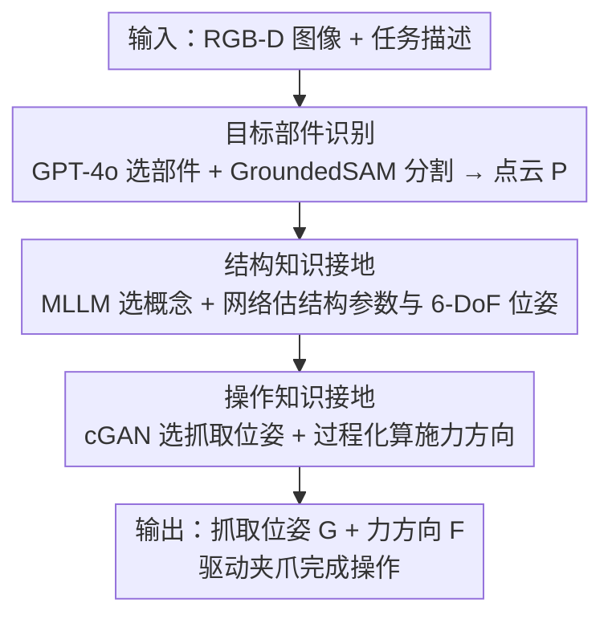

# Physically Ground Commonsense Knowledge for Articulated Object Manipulation with Analytic Concepts

**会议**: CVPR 2026  
**论文**: [CVF Open Access](https://openaccess.thecvf.com/content/CVPR2026/html/Wei_Physically_Ground_Commonsense_Knowledge_for_Articulated_Object_Manipulation_with_Analytic_CVPR_2026_paper.html)  
**代码**: 无  
**领域**: 机器人 / 具身智能  
**关键词**: 铰接物体操作, 常识知识接地, 解析概念, MLLM, 6-DoF 位姿估计

## 一句话总结
本文提出"解析概念"（analytic concepts）——一种用数学符号过程化定义、可被机器直接计算与仿真的物体结构/操作知识表示，把 MLLM 推理出的语义级常识知识接地到物理世界，再据此指导机器人完成铰接物体操作，在仿真未见类别上相对 A3VLM 提升约 27%。

## 研究背景与动机
**领域现状**：铰接物体操作（开门、拧水龙头、掀锅盖）需要智能体同时具备视觉感知与物理推理能力。近期主流做法是借助多模态大模型（MLLM）：让 GPT-4o 这类模型读取任务描述和 RGB 图像，凭借常识推理判断"在哪交互、怎么交互"，输出语义级任务规划来指导控制策略（如 ManipLLM、A3VLM）。

**现有痛点**：MLLM 工作在**语义层**，而机器人控制工作在**物理层**，二者之间存在难以弥合的鸿沟。一方面，把自然语言形式的知识直接当作控制策略的特征输入，会让策略难以真正识别知识背后的物理概念（"把手垂直于轴线"在向量空间里并不天然对应一个可执行的力方向）；另一方面，LLM 在高精度数值分析上很弱，很难微调出一个能输出足够精确物理量（如抓取位姿、施力方向）的模型来支撑高精度操作。

**核心矛盾**：MLLM 擅长的是**语义级常识推理**，机器人需要的是**精确的物理级数值**，而自然语言既不擅长精确描述物理结构，MLLM 也不擅长精确数值计算——缺少一个二者都能对齐的中间表示。

**本文目标**：构造一座桥，把 MLLM 推理出的语义知识转译成机器人能直接计算执行的物理知识，同时保留 MLLM 的泛化常识推理能力。

**切入角度**：作者观察到，一段常识知识本质上封装了"一组相似实体共享的本质共性"。那么是否可以用**数学符号过程化地**把这种共性写成既能被人/MLLM 理解、又能被机器直接计算仿真的形式？

**核心 idea**：引入解析概念作为语义层与物理层之间的桥梁——用基本几何体（圆柱、长方体等）+ 数学过程定义物体的结构与可操作知识，让 MLLM 负责"选哪个概念、用哪种抓法/施力"的语义决策，让解析概念负责把这些决策落成精确的 6-DoF 位姿与力方向。

## 方法详解

### 整体框架
给定一张目标物体的 RGB-D 图像和一句自然语言任务描述，机器人需用一个平行夹爪完成相应物理交互。整个流水线把"语义→物理"的转译拆成三大步：**目标部件识别 → 结构知识接地 → 操作知识接地**。三步都以一次"问答"开场——由 MLLM 在语义层做决策（选部件、选概念、选抓法、选力方向），决策结果再交给下游的解析概念和参数估计网络落成精确的物理量，最后机器人据此移动末端执行器完成操作。这种设计让 MLLM 只做它擅长的语义推理，把所有需要精确数值的活交给解析概念里的数学过程。

### 关键设计

**1. 解析概念：把常识知识写成可计算的数学过程**

这是全文的根基，直击"语义知识无法被机器人精确执行"这一痛点。每个解析概念由三部分组成：**概念身份**（concept identity）、**解析结构知识**（structural knowledge）、**解析操作知识**（manipulation knowledge）。概念身份是一个唯一符号（如 `L_Handle`）外加一段简洁精确的摘要（synopsis），保证人与 MLLM 对它的理解一致、且一一对应。解析结构知识用基本几何体当原子（Cylinder、Cuboid、Sphere…），通过数学过程排列组合来刻画一类空间结构的共性：例如 L 形把手定义里，轴是一个圆柱 `axis = Cylinder([A_l, A_d], [-(A_l+L_w)/2, -O, 0])`，杆是一个长方体 `lever = Cuboid([L_l, L_w, L_h], [0,0,0])`，再各自 `apply_pose`。这些几何体带可变参数（尺寸、偏移、位姿），不同实例靠不同参数取值来表示。解析操作知识则把每个原子动作写成以结构参数为输入的函数：抓取位姿如 `grasp_above(offset)` 返回 `M_0.translate([0, offset, 0]).apply(pose)`，施力方向如 `push_clockwise(theta)` 按轴线叉乘算出方向。关键好处是：MLLM 只要在语义层选对概念和动作名，剩下的精确数值全由这些数学过程算出来，绕开了 LLM 不擅长数值推理的短板。作者还验证了可扩展性——高中数学水平的志愿者平均 2 小时就能新建一个概念，目前已建 153 个，且只需其中一小部分就能覆盖大量操作任务。

**2. 结构知识接地：MLLM 选概念 + 网络估参数与位姿**

光有概念库还不够，得把抽象概念"贴"到当前这个具体物体上。这一步分两段。首先做**目标部件识别**：用 GPT-4o 读 RGB 图像和任务，回答"该和哪个部件交互、它属于什么类别"，语义描述送进 Grounded-SAM 得到像素级分割掩码，再套到深度图上裁出目标部件的点云 $P$，类别信息则用于检索对应的概念组。然后做**概念识别 + 参数估计**：把同组概念的身份与摘要喂给 MLLM，让它回答"哪个概念最匹配该部件的空间结构"，从而把 MLLM 的语义理解对齐到具体的解析概念上。选定概念后要估两类参数——(i) 定义空间结构的**结构参数**，用 Point-Transformer 编码点云 $P$ 后接 MLP 头回归（L2 损失）；(ii) 描述全局平移旋转的 **6-DoF 位姿参数**，先用编码器+MLP 把 $P$ 解码成规范空间下的点云 $P^*$（chamfer 距离损失），再用 Umeyama 算法配合 RANSAC 去外点，估出从 $P^*$ 到 $P$ 的刚体变换 $T \in SE(3)$。两段一起，就把一个数学定义的概念精确地落在了真实物体上。系统误差分析显示，这两步（尤其结构参数估计）正是整条流水线最大的瓶颈。

**3. 操作知识接地：cGAN 选抓取位姿 + 过程化算力方向**

结构接地之后，就能把操作知识也落成物理量。先由 MLLM 在语义层回答"哪种抓法/哪个力方向最适合完成任务"，再分别落地。**抓取位姿**比较棘手：每种抓法（如 `grasp_above`）定义的是一**类**共享模式的位姿，靠可变参数确定具体一个，作者用条件 GAN 来选参数——生成器 $G$ 以点云特征为条件、从高斯噪声 $z$ 产出多个候选参数，判别器 $D$ 给每个候选打 $(0,1)$ 的分、选最高分那个。训练上先训判别器 $L_D = -\mathbb{E}_{x\sim p_{data^+}}[\log D(x|y)] - \mathbb{E}_{x\sim p_{data^-}}[\log(1-D(x|y))]$，再训生成器 $L_G = -\mathbb{E}_{z\sim p_z}[\log D(G(z|y))]$，正负样本来自已有的抓取参数。**施力方向** $F$（如 lift up、turn clockwise）则完全由结构知识参数和抓取位姿过程化计算得出，无需再学。最终机器人按 $G$ 移动夹爪抓取，再沿 $F$ 施力完成操作。消融显示，用网络估计的抓取参数比在参数空间随机采样效果更好，证明这套抓取知识确实捕捉到了可行抓取的分布。

## 实验关键数据

### 主实验
仿真用 SAPIEN 模拟器，从 PartNet-mobility 收集 972 个适合单夹爪操作的物体（15 类，10 类训练 / 5 类测试），评测指标为成功率（目标关节运动超阈值即成功，交互预算 5 次）。对比 5 个代表性方法，含 SOTA A3VLM。

| 设置 | 指标 | 本文 | A3VLM（之前 SOTA） | 相对提升 |
|------|------|------|----------|------|
| 训练类别 AVG | 成功率 % | 42.5 | 37.4 | ~15.2% |
| 测试类别 AVG | 成功率 % | 40.8 | 32.1 | ~27.1% |
| Table（复杂多关节） | 成功率 % | 50.6 | 40.0 | ~21.4% |
| 真实世界 8 物体平均 | 成功率 | ≈0.78 | ≈0.60 | 多数任务 +0.1~0.3 |

训练类别与测试类别成绩接近，说明方法能有效泛化到未见物体——作者归因于解析概念能覆盖普遍共性结构、且 MLLM 能凭摘要为未见部件找到最匹配概念。

### 消融实验
| 配置 | 关键指标 | 说明 |
|------|---------|------|
| 抓取参数：估计 vs 随机采样 | 训练 42.5 / 测试 40.8 vs 40.2 / 38.6 | cGAN 估计的抓取参数优于随机采样，证明抓取知识有效 |
| 末端执行器：吸盘 | 训练 75.5 / 测试 73.8（A3VLM 72.4 / 66.4） | 换吸盘仍领先；且从吸盘换夹爪时 A3VLM 掉点远比本文严重 |
| 系统瓶颈分析（逐模块换 GT，训练类别） | None 42.5 → 结构参数 72.0 → 6-DoF 86.3 | 结构参数估计（+20.8）与 6-DoF 位姿（+14.3）是最大瓶颈 |

### 关键发现
- **物理接地是涨点关键**：Where2Act/Where2Explore（纯视觉 affordance）、GAPartNet（结构表示）、ManipLLM/A3VLM（MLLM 推理）各只补强了"常识推理"或"结构表示"之一，本文把两者通过解析概念彻底打通才拿到最大增益。
- **夹爪场景差距更大**：吸盘任务上各方法差距较小，一旦换成需要精确抓取的平行夹爪，纯靠 MLLM 做数值推理的方法掉点严重，凸显解析概念在精确数值上的优势。
- **瓶颈在几何估计而非语义决策**：换 GT 实验里，把结构参数/6-DoF 位姿换成真值带来的提升最大，而概念识别、力方向计算几乎不是瓶颈——说明 MLLM 的语义选择已足够可靠，未来主要该提升点云几何估计精度。

## 亮点与洞察
- **"让 MLLM 只做语义、让数学过程做数值"的分工很巧妙**：把 LLM 的弱项（精确数值）外包给可计算的解析概念，既保留泛化推理又获得物理精度，是一种可复用的"语义-物理解耦"范式。
- **解析概念是可解释、可仿真、低成本众包的**：高中数学水平志愿者 2 小时建一个、专家校验、不同人产出模板一致，说明这种表示在认知层具有一致性，工程上可规模化扩展到新结构。
- **思路可迁移**：把"用参数化几何原语 + 数学过程定义可操作知识"的做法迁移到双手操作、柔性物体或工具使用上，只需扩充概念库和操作函数，而 MLLM 选择层几乎不用改。

## 局限与展望
- 作者承认主要瓶颈是结构参数估计与 6-DoF 位姿估计——几何估计误差会导致抓取碰撞或错位，是当前成功率的主要制约。
- ⚠️ 解析概念依赖人工预先定义概念库（目前 153 个），对完全无法用基本几何体组合描述的复杂/非刚体结构可能力不从心；如何自动发现/生成新概念论文未展开。
- 操作知识目前面向单平行夹爪（及吸盘扩展），多指灵巧手、双臂协同、长程多步任务等更复杂场景尚未验证。
- 改进思路：用更强的点云几何估计网络或引入多视角/触觉反馈来攻克 6-DoF 瓶颈；探索让 MLLM 自动生成解析概念以减少人工。

## 相关工作与启发
- **vs Where2Act / Where2Explore**: 它们直接从 2D 图像/点云学逐像素 affordance 图，没有显式结构与常识推理；本文用解析概念提供物理结构先验 + MLLM 常识，泛化到未见类别更强。
- **vs GAPartNet**: GAPartNet 用 GAPart 的 6-DoF 位姿作结构化表示并预定义启发式策略，但缺少 MLLM 的语义推理；本文把结构表示与常识推理结合，且操作知识由数学过程参数化而非固定启发式。
- **vs ManipLLM / A3VLM**: 同样用 MLLM，但它们让 LLM 直接推 affordance/可操作框，受限于 LLM 数值推理弱；本文让 MLLM 只做语义选择、数值由解析概念精确计算，在夹爪等高精度场景优势明显（测试类别相对 +27.1%）。

## 评分
- 新颖性: ⭐⭐⭐⭐⭐ "解析概念"作为语义-物理桥梁的表示设计新颖，把 MLLM 弱项干净地解耦出去。
- 实验充分度: ⭐⭐⭐⭐ 仿真 15 类 + 真实世界 8 物体 + 吸盘/夹爪/瓶颈多组消融，较完整；真实世界规模偏小。
- 写作质量: ⭐⭐⭐⭐ 动机与三步流水线讲得清楚，图示充分；部分概念定义细节散在附录。
- 价值: ⭐⭐⭐⭐⭐ 为"如何把 MLLM 常识精确接地到机器人控制"给出了可解释、可扩展的范式，对具身操作有较强借鉴意义。

<!-- RELATED:START -->

## 相关论文

- [\[ICCV 2025\] Adaptive Articulated Object Manipulation On The Fly with Foundation Model Reasoning and Part Grounding](../../ICCV2025/robotics/adaptive_articulated_object_manipulation_on_the_fly_with_foundation_model_reason.md)
- [\[CVPR 2026\] VideoWorld 2: Learning Transferable Knowledge from Real-world Videos](videoworld_2_learning_transferable_knowledge_from_real-world_videos.md)
- [\[CVPR 2026\] AffordGen: Generating Diverse Demonstrations for Generalizable Object Manipulation with Affordance Correspondence](affordgen_generating_diverse_demonstrations_for_generalizable_object_manipulatio.md)
- [\[CVPR 2026\] Learning to Control Physically-simulated 3D Characters via Generating and Mimicking 2D Motions](learning_to_control_physically-simulated_3d_characters_via_generating_and_mimick.md)
- [\[CVPR 2026\] TrajRAG: Retrieving Geometric-Semantic Experience for Zero-Shot Object Navigation](trajrag_retrieving_geometric-semantic_experience_for_zero-shot_object_navigation.md)

<!-- RELATED:END -->
