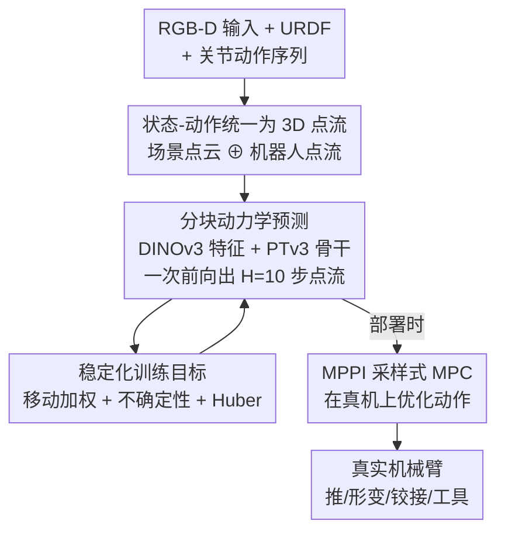

# PointWorld: Scaling 3D World Models for In-The-Wild Robotic Manipulation

**会议**: CVPR 2026  
**论文**: [CVF Open Access](https://openaccess.thecvf.com/content/CVPR2026/html/Huang_PointWorld_Scaling_3D_World_Models_for_In-The-Wild_Robotic_Manipulation_CVPR_2026_paper.html)  
**代码**: 无（作者承诺开源 code/dataset/checkpoint，point-world.github.io）  
**领域**: 3D视觉 / 机器人 / 世界模型  
**关键词**: 3D 世界模型, 点流, 机器人操作, MPC, 跨本体迁移

## 一句话总结
PointWorld 把场景状态和机器人动作统一表示为同一套 3D 点流（3D point flow），用一个大型预训练点云骨干在约 200 万条轨迹上学习"给定动作后全场景点会怎么动"，从而让一个 checkpoint 在零样本、单张 RGB-D 输入下驱动真实机械臂完成刚体推、形变物体、铰接物体和工具使用等任务。

## 研究背景与动机
**领域现状**：机器人世界模型（world model）要预测"环境在当前状态 + 机器人动作下会怎么演化"。主流路线有三类：基于物理仿真的模型（预测准但有 sim-to-real gap、要逐场景建模）；基于学习的动力学模型（能从交互数据学，但常依赖全可观、物体先验、材质先验等领域归纳偏置）；大规模视频生成模型（画面逼真但缺显式动作条件、物理一致性差）。

**现有痛点**：现有方法预测的东西和"人扫一眼就能预判形变/铰接/接触/稳定性"之间仍有明显差距，尤其是在开放世界、只有少量感知输入的野外场景。更关键的是，动作通常被表示成**特定本体**的动作空间（关节角、末端位姿），不同机器人的数据彼此不通，难以跨本体规模化训练。

**核心矛盾**：状态来自感知（RGB-D），动作来自本体特定的低维指令——两者模态不一致，于是模型很难既吃下海量异构数据、又把"机器人几何如何作用于场景"建模清楚。要规模化，就得先把状态和动作放进**同一个可统一、可扩展**的表示里。

**本文目标**：训一个**单一、可泛化**的预训练 3D 世界模型，从野外单张 RGB-D 输入就能做出空间对齐、动作条件下的预测，并能直接用于真实机器人控制。

**切入角度**：作者的哲学是"为规模化而统一"——状态和动作都用 3D 物理空间里的点流表示。场景状态 = RGB-D 反投影出的全场景点云；动作 = 机器人自身几何（已知 URDF + 关节序列）按正运动学外推出的稠密 3D 点轨迹。

**核心 idea**：把 3D 世界建模等价为"在一串机器人点流扰动下，预测全场景点的逐点位移"——用统一的 3D 点流同时承载状态与动作，像"next-token prediction"但作用于 3D 空间和时间上的交互。

## 方法详解

### 整体框架
PointWorld 学习一个动力学网络 $F_\theta: \mathcal{S} \times \mathcal{A} \to \mathcal{S}$，但不做单步更新，而是**分块（chunked）多步预测**：一次前向就预测未来 $H$ 步的状态 $F_\theta^H:(s_t, a_{t:t+H-1}) \to s_{t+1:t+H}$，论文取 $H=10$、每步 0.1s。输入是一帧（或少量）标定好的 RGB-D，输出是全场景每个点在未来一秒内的逐步 3D 位移。整条管线为：把动作转成机器人点流 → 与场景点云拼成一个点云 → 场景点用冻结的 DINOv3 取特征、机器人点用时间嵌入 → PTv3 骨干预测全场景点流 → 套进采样式 MPC 在真机上推动作。

### 关键设计

**1. 把状态和动作统一为 3D 点流：让感知与异构本体共享一套表示**

这是全文的根基，直接对准"状态来自感知、动作来自本体特定空间，两者不通"的矛盾。状态 $s_t = \{(p_{t,i}, f_i^S)\}_{i=1}^{N_S}$ 是一组点流，每点有 3D 位置 $p_{t,i}\in\mathbb{R}^3$ 和时不变特征——通过用正运动学（URDF + 关节角）把机器人像素 mask 掉、再反投影剩余像素得到，因此不假设物体性或材质先验，且推理时不需要单独的点跟踪器（对应只在前向内部"想象"中保留）。动作也是点流，但不来自 RGB-D，而是用机器人自己已知的几何按正运动学**外推**出来：给定关节序列 $\{q_{t+k}\}$，在 $t$ 时刻采一次机器人表面点、绑到对应连杆、随运动学传播得到有序的机器人点集，作为 $a_{t+k}$。这样做的妙处在于"想象出的动作"是**完全可观**的（即使接触发生在遮挡区也照样有点），并且天然与本体无关——关节角、末端位姿、运动基元都能被这套点流表示统一吸收，不同机器人（单臂 Franka 与双臂人形）的数据因此可以一起训。为效率只从夹爪采点（每个夹爪几百点），因为大多数机器人表面点根本不接触场景。

**2. 分块动力学预测：用现成点云骨干 + 预训练 2D 特征做可扩展的全场景点流回归**

针对"要规模化但又得把机器人几何作用于场景建清楚"，作者刻意不设计定制架构，而是把初始场景点和时间堆叠的机器人点拼成**一个点云**，交给 SOTA 点云骨干 PointTransformerV3（PTv3）处理。场景点用冻结的 DINOv3 投影到 2D 视图取多层稠密特征（隐式提供物体性先验，无需显式分割），机器人点用时间嵌入；骨干输出所有点的特征后，一个共享 MLP 头一次性预测 chunk 内每步、每个场景点的位移。选 PTv3 是因为它的点序列化对应了图神经动力学（GBND）的局部分组、U-net 层级又能在逐渐粗化的点集上做长程注意力，从而把参数从 GBND 规模一路扩到 957× 而显存和延迟只温和增长；这正好解决了 GBND 显存暴涨、纯局部消息传递在部分可观下长程效应要靠噪声跳数传播的两个瓶颈。分块一次前向带来约 0.1s 的实时延迟，便于后续在 MPC 里并行评估大量候选轨迹，区别于扩散类像素方法动辄数秒的推理。

**3. 稳定化训练目标：移动加权 + 不确定性正则 + Huber 损失救活稀疏且带噪的真实数据**

全场景预测有两个朴素 L2 治不了的难题：一是机器人通常只动场景里很小一部分（1–5% 的点在动），绝大多数点静止，标准 L2 信号极稀疏；二是真实数据噪声大，需要让模型对噪声鲁棒。对前者用**移动加权**：按真值运动给每点每步算一个软移动似然 $m_{k,i}=\sigma(\kappa(\delta_{k,i}-\tau))$（$\delta_{k,i}$ 是真值位移范数，$\tau$、$\kappa$ 是阈值和温度），归一化成权重 $w_{k,i}=m_{k,i}/\sum_{k,i} m_{k,i}$ 把损失聚焦到真正动起来的点。对后者用**aleatoric 不确定性正则**：为每点每步预测一个标量 log-方差 $s_{k,i}$，再对残差用 Huber 损失。完整目标为

$$\frac{1}{2}\sum_{k,i} w_{k,i}\left(\rho_\delta(\hat{P}_{t+k,i}-P_{t+k,i})\,e^{-s_{k,i}} + s_{k,i}\right)$$

其中 $\rho_\delta$ 是逐元素 Huber 损失。直觉是：移动加权单用会放大噪声信号，不确定性头和鲁棒损失反过来抑制权重、减少过拟合，三者合起来才让真实数据上的训练稳住并涨点。被 2D 跟踪器判为不可见的点会被忽略，不参与监督。

**4. MPPI 采样式 MPC：把预训练世界模型直接当"想象器"在真机上规划**

为了证明单个预训练 checkpoint 不靠示范也能控制，作者把 PointWorld 嵌进采样式 MPC（MPPI）。给定标定 RGB-D 先构出初始状态 $s_0$，然后用时间相关的三次样条噪声采 $K$ 条末端轨迹扰动加到名义轨迹上；每条候选轨迹被转成对应的机器人点流动作、由 PointWorld 滚动出场景点流、累计轨迹代价 $J^{(\ell)}$，再用指数权重 $\omega_\ell\propto\exp(-J^{(\ell)}/\beta)$ 对样本做加权平均迭代细化名义轨迹。代价把任务目标和控制正则分开：任务代价 $c_{\text{task}}(s_k)=\frac{1}{|I_{\text{task}}|}\sum_{i\in I_{\text{task}}}\|p_{k,i}-g_i\|_2^2$ 是任务相关点到目标位置的均方距离——这种逐点目标对刚体、形变、铰接物体都通用，任务点可由人在 GUI 指定或 VLM 给出。正因为模型一次前向 0.1s，MPC 才能实时评估海量候选。

### 损失函数 / 训练策略
核心训练目标即上式（移动加权 × Huber × 不确定性正则）。数据上一起训 DROID（单臂 Franka，真实）与 BEHAVIOR-1K（双臂人形，仿真），约 200 万条轨迹 / 500 小时。微调实验中每次微调只用原训练迭代的 1/20（约 5%），即可快速逼近甚至超过从头训的专家模型。

## 实验关键数据
评测指标为预测点流与真值的逐点逐步 $\ell_2$ 距离，重点看**移动点**上的误差 $\ell_2$ mover（静止点同时报 $\ell_2$ static）。

### 主实验（骨干对比 + 缩放路线图）
| 骨干 | 参数(相对GBND) | 延迟(ms) | $\ell_2$ mover↓ | $\ell_2$ static↓ |
|------|------|------|------|------|
| GBND（基线） | 1.00× | 13.46 | 0.0390 | 0.0066 |
| PointNet | 1.03× | 5.93 | 0.0369 | 0.0084 |
| Transformer | 41.06× | 30.43 | 0.0339 | 0.0071 |
| PTv3-132M | 127× | 69.60 | 0.0324 | 0.0061 |
| PTv3-411M | 399× | 102.47 | 0.0315 | 0.0059 |
| PTv3-1B | 958× | 123.65 (≈0.12s) | **0.0312** | **0.0056** |

缩放路线图（DROID 测试集 mover $\ell_2$）：从 GBND 基线 0.0386 逐步现代化骨干、稳定训练目标、引入预训练特征、放大模型，最终降到约 0.0312，每一步都带来一致增益。

### 消融实验（动作表示 + 泛化迁移）
动作表示对比（图 6，越低越好，单位 mover $\ell_2$）：

| 动作表示 | DROID(真实) | B1K(仿真) | 说明 |
|------|------|------|------|
| 夹爪点流（本文） | **最低** | **最低** | 接触推理高效，跨本体正迁移 |
| 全身点流(3000点) | 较高 | 较高 | 梯度要穿过大量非接触点，开销大 |
| 全身点流(500点) | 较高 | 中 | 分辨率不足，接触刻画差 |
| 末端位姿(低维) | 中 | 偏高 | 真实数据上反而比稠密全身流好 |
| 关节角(低维) | 中 | 偏高 | 同上 |

泛化/迁移（表 2，mover $\ell_2$，D=DROID/B=B1K/H=held-out 真实）：

| 设置 | D→D | B→B | D→B | B→D | D+B→H | From Scratch |
|------|------|------|------|------|------|------|
| 零样本 | 0.0315 | 0.0087 | 0.1460 | 0.0558 | 0.0300 | 0.0293 |
| 微调(1/20迭代) | – | – | 0.0107 | 0.0378 | 0.0272 | 0.0293 |

真机零样本 MPC 成功率（图 4，无示范无微调）：抽纸盒推 70%、围巾折叠 80%、抽屉 90%、微波炉 30%、扫帚/掸子工具使用各 60%。

### 关键发现
- **PTv3 是规模化关键**：它在把参数扩到 958× GBND 的同时显存/延迟只温和增长，是缩放路线图上贡献最大的一步；GBND 受限于显存暴涨与纯局部消息传递。
- **夹爪点流 > 全身点流 > 低维动作**：把接触在空间上稠密表示能在仿真上超过低维表示；但真实噪声数据下全身点流反而拖累（大量非接触点淹没本就稀疏的学习信号），只采夹爪点恰好兼顾效率与接触刻画，并实现跨本体正迁移。
- **可预测的缩放律**：在 50M–1B 参数和 5%–100% 数据两个轴上，预测误差在对数空间近似线性下降，说明加数据/加容量能稳定换来收益。
- **真→仿迁移优于反向**：作者观察到真实数据预训练带来的迁移更好，可能因为真实场景多样性更高；微调只需 1/20 迭代就能逼近/超过从头训的专家。

## 亮点与洞察
- **统一表示换来规模化**：把状态和动作都塞进同一套 3D 点流，是"用一个表示打通异构本体数据"的漂亮一招——动作用 URDF 正运动学外推使其完全可观，绕开了遮挡区接触无法表示的难题，这个思路可迁移到任何已知机器人几何的多本体学习场景。
- **不设计定制架构、专心找 recipe**：作者刻意复用 PTv3/DINOv3，把精力放在"backbone/objective/feature/scale 哪个 lever 有效"的系统消融上，等于给 3D 世界模型写了一份可复现的 scaling 手册。
- **实时性是控制可用的前提**：0.1s 一次前向直接决定了能用采样式 MPC 实时评估海量候选轨迹，这是它能零样本上真机的工程关键，对比扩散类秒级推理是数量级差距。

## 局限性 / 可改进方向
- **跨域零样本仍弱**：D→B 零样本 mover $\ell_2$ 高达 0.1460，远差于同域，真实↔仿真之间的零样本迁移依旧困难，必须靠微调补救。
- **依赖标定 RGB-D 与已知 URDF**：动作表示建立在已知机器人几何 + 标定相机外参之上，未标定或未知本体场景下不直接适用（⚠️ 论文未深入讨论此约束的放宽）。
- **真机成功率参差**：微波炉这类铰接任务仅 30%，说明接触/铰接的精细推理在部分任务上仍不稳定。
- **数据管线工程量大**：真实数据的 3D 标注靠 FoundationStereo + VGGT 外参优化 + CoTracker3 三阶段管线，仅覆盖 DROID 约 60%，复现成本高。

## 相关工作与启发
- **vs 视频世界模型（像素状态）**：它们做光度重建/联合嵌入预测，画面逼真但缺显式动作条件、物理一致性差且推理慢；本文用 3D 点流强调接触与几何而非外观，显式条件于具体机器人几何，单图实时前向。
- **vs 传统学习型动力学模型（如 GBND）**：它们依赖全可观/物体性/材质先验且常需逐场景建模；本文不假设这些先验、用统一点流在野外部分可观 RGB-D 上预训单一模型，并把参数规模化到 1B。
- **vs 2D 流/点跟踪用于操作**：本文借助 3D 视觉进展把 2D 轨迹提升到 3D 场景流作监督，用稳定回归损失训大模型，能推理可见区域之外的交互。

## 评分
- 新颖性: ⭐⭐⭐⭐⭐ 状态-动作统一为 3D 点流是简洁而有力的表示创新，打通异构本体规模化
- 实验充分度: ⭐⭐⭐⭐⭐ 骨干/目标/特征/缩放/迁移系统消融 + 真机零样本验证，约 200 万轨迹规模
- 写作质量: ⭐⭐⭐⭐ 把方法讲成可复现的 scaling 手册，逻辑清晰；细节较多需对照附录
- 价值: ⭐⭐⭐⭐⭐ 单 checkpoint 零样本驱动真机多类操作，为 3D 世界模型规模化提供路线图与开源数据

<!-- RELATED:START -->

## 相关论文

- [\[CVPR 2026\] SPEAR-1: Scaling Beyond Robot Demonstrations via 3D Understanding](spear-1_scaling_beyond_robot_demonstrations_via_3d_understanding.md)
- [\[CVPR 2026\] ActiveVLA: Injecting Active Perception into Vision-Language-Action Models for Precise 3D Robotic Manipulation](activevla_injecting_active_perception_into_vision-language-action_models_for_pre.md)
- [\[CVPR 2026\] Learning Surgical Robotic Manipulation with 3D Spatial Priors](learning_surgical_robotic_manipulation_with_3d_spatial_priors.md)
- [\[CVPR 2026\] Structural Action Transformer for 3D Dexterous Manipulation](structural_action_transformer_for_3d_dexterous_manipulation.md)
- [\[CVPR 2026\] DiffuView: Multi-View Diffusion Pretraining for 3D-Aware Robotic Manipulation](diffuview_multi-view_diffusion_pretraining_for_3d_aware_robotic_manipulation.md)

<!-- RELATED:END -->
