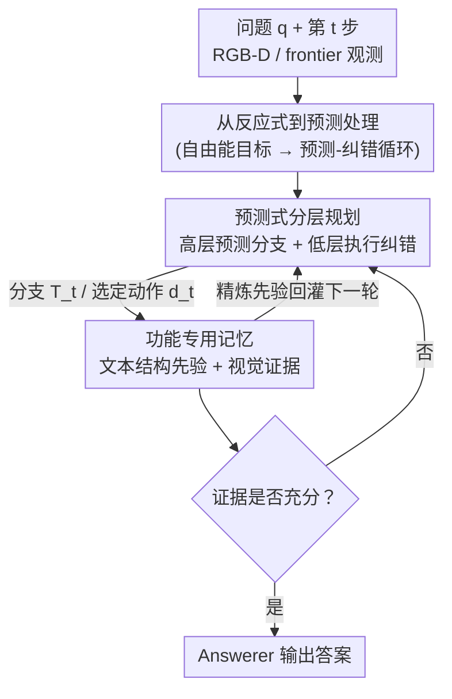

# Predict Before You Explore: Predictive Planning with Specialized Memory for Embodied Question Answering

**会议**: CVPR 2026  
**论文**: [CVF Open Access](https://openaccess.thecvf.com/content/CVPR2026/html/Yuan_Predict_Before_You_Explore_Predictive_Planning_with_Specialized_Memory_for_CVPR_2026_paper.html)  
**代码**: https://github.com/yuanrr/Pred-EQA  
**领域**: 具身智能 / 机器人导航  
**关键词**: 具身问答(EQA), 预测式规划, 分层规划, 专用记忆, 主动推理

## 一句话总结
Pred-EQA 把具身问答（EQA）从"看一步走一步"的反应式探索改造成"先预测再探索"的预测-纠错循环：用高层规划器预测证据可能藏在哪、生成几条带长程意图的探索分支，低层执行器在分支内主动消除不确定性并在预测失败时剪枝，再配一套把"稳定结构先验"和"问题相关视觉证据"分开存的双记忆，在 A-EQA 和 Express-Bench 上同时把答题准确率和探索效率刷到 SOTA。

## 研究背景与动机
**领域现状**：EQA 要求智能体在 3D 场景里导航、边走边收集视觉证据，最后基于零散观测回答问题。随着 VLM 在静态场景理解上变强，主流做法是用 VLM 当"语义规划器"——根据当前观测和问题判断下一个该去的 frontier（探索边界），再用一个单一的大记忆（scene graph / 语义地图 / 视频记忆）把走过的观测全存下来。

**现有痛点**：这套做法有两个老毛病。其一，规划是**反应式**的：每一步只看当前视角做决策，缺乏跨步骤的长程意图，导致动作前后矛盾、轨迹来回打转（goal drift）。其二，记忆是**单体（monolithic）**的：为了导航把大量观测一股脑塞进同一个结构，但其中绝大多数帧和问题无关，真正关键的稀疏证据反而被淹没，检索时互相干扰。

**核心矛盾**：EQA 的本质是**部分可观测**——每一步只能看到场景的一小块，且环境随智能体移动不断变化。这和 LLM agent 在工具调用、机器人控制里常见的"近乎全可观测、一次成型的计划"假设完全冲突；照搬那套预定计划会因信息不全而级联出错。同时，导航需要的"稳定空间结构"和答题需要的"稀疏语义证据"被混在一个记忆里，天然存在 trade-off。

**切入角度**：作者借用认知科学的**预测处理（predictive processing）/ 主动推理（active inference）**视角——人类不是被动响应每个感官输入，而是基于先验主动预测未来观测，预测失败时再纠正内部先验。这个"预测-纠错"循环恰好能在有限/噪声视角下维持连贯意图，而且预测天然把观测拆成"问题无关的稳定先验"和"问题相关的证据"两类。

**核心 idea**：把 EQA 重构成"预测先于探索"——先让高层规划器预测证据位置形成探索分支，再让低层执行器在分支内做减不确定性的动作并纠正预测，同时用双记忆分别锚定稳定先验和稀疏证据，从而在部分可观测下走出连贯轨迹。

## 方法详解

### 整体框架
Pred-EQA 把 EQA 组织成一个**递归的"预测 → 纠错 → 更新"循环**，部署在一个多智能体框架里。基线只用 RGB-D 第一视角输入 + 基于 TSDF 的 frontier 提取（不依赖检测器、scene graph 或语义地图），保证推理纯粹从交互和累积观测中涌现。每一步 $t$ 系统做三件事：**预测**（高层规划器预测可能含缺失证据的语义探索分支 $T_t$，编码长程意图而非对当前视角的反射）；**纠错**（执行器逐条测试分支、证实/证伪预测并剪掉矛盾分支，把探索从"贪心走 frontier"变成"预测驱动"）；**更新**（更新两套专用记忆——文本记忆存稳定语义/空间先验，视觉证据记忆只存问题相关观测——更新后的记忆作为下一轮预测的精炼先验）。整套流程由 Answerer / High-Level Planner / Executor / Recorder / Manager 几个 agent 协同，Answerer 一旦判断证据足够就直接输出答案，否则触发继续探索。

### 关键设计

**1. 从反应式到预测处理：用自由能目标把"预测-纠错"写成优化目标**

这一设计针对的是"规划为什么要预测"的根本问题——作者没有停在直觉层面，而是把智能体目标建模为主动推理里的变分自由能下界：

$$F(s, q, a) = D_{KL}\big(Q(\psi \mid s, q, a)\,\|\,P(\psi, s \mid q)\big) - \mathbb{E}_Q[\log P(a \mid \psi, s, q)].$$

其中 $Q(\psi)$ 是智能体在给定历史观测 $s$、问题 $q$、计划动作 $a$ 下对潜在语义结构 $\psi$ 的信念。KL 项把内部信念约束得与"任务条件下的空间布局/语义规律先验"保持一致，鼓励对未见结构做**稳定预测**；期望对数似然项偏好那些能**降低不确定性**的动作，把探索推向"预测误差最有信息量"的位置。最小化 $F$ 就自然导出一个预测-纠错循环：预测未见视角 → 行动验证 → 出现偏差时更新信念。这条公式直接落地成两条设计原则——KL 项 → 预测式分层规划；两类信息的分离 → 功能专用记忆，让后面的架构不是拍脑袋而是有理论锚点。⚠️ 公式细节以原文为准。

**2. 预测式分层规划：高层先猜"证据在哪"，低层去"消不确定性"**

这一设计直击反应式规划"把每步当孤立决策、易受部分可观测和目标漂移影响"的痛点。**高层预测规划器**在第 $t$ 步接收问题 $q$ 和文本结构记忆 $H_t = \{h_1,\dots,h_{t-1}\}$，它的职责不是挑一个眼前的 frontier，而是**预测还缺什么信息、这些证据大概在哪**，输出一个结构化的预测分支：

$$T_t = \{(\tau_i, \sigma_i, \alpha_i)\}_{i=1}^{M},$$

其中 $\tau_i$ 是一条假设的证据来源/语义预测（如"厨房可能在这条走廊尽头"），$\sigma_i \in \{\text{pending, active, done}\}$ 跟踪进度，$\alpha_i$ 是一条**精炼标注**，用来更新/确认/归档从 $T_{t-1}$ 继承来的预测（如 "irrelevant; kitchen already identified"）。VLM 预测器通过 $T_t \leftarrow \text{H.L.Planner}(q, H_t, T_{t-1})$ 递归地维护、修订、扩展假设，让长程推理跨步一致。**低层执行器**则在给定 $T_t$、精选快照 $S'_t$、文本先验 $H_t$、frontier 集 $F_t$ 后，选取使下一步期望自由能最小的动作 $d_t$，遵循三条原则：① 最大信息增益（选最能消除分支不确定性的 frontier）；② 常识引导（没有视觉线索时才用"房间-物体"常识给 frontier 排序）；③ 一致性驱动（跟随高层计划维持连贯轨迹）。这套"高层假设 + 低层局部预测-测试"的分工，正是它区别于 TODO-list 式扁平子目标和纯反应式 agent 的地方——后两者要么固守很快过时的子目标、要么短视。

**3. 功能专用记忆：把"稳定结构先验"和"稀疏问题证据"彻底拆开存**

这一设计解决单体记忆"密集轨迹记录淹没稀疏关键证据、检索互相干扰"的痛点。Pred-EQA 按预测处理的两类功能拆成两套记忆。**文本结构记忆**捕捉随时间稳定的语义规律和空间布局：不存原始帧，而是把每条已验证观测转成符号化条目 $e_t = (\text{Step}_t, \text{Agent Type}_t, \text{Agent Content}_t, \text{Position}_t)$，再由 Recorder 汇总成文本先验 $h_t \leftarrow \text{Recorder}(\{e_{t,i}\}, q)$ 并累积成 $H_t$，为后续预测提供防止目标漂移的稳定锚点。**视觉证据记忆**只保留用于验证/反驳预测的"误差信号"证据，不是所有帧的缓冲区：每步由 VLM 的 Manager 把原始快照候选过滤成问题相关子集 $S'_t \leftarrow \text{Manager}(q, S_t, H_t)$，一张快照只在满足"直接含答案相关信息 / 提供文本记不下的视觉-空间线索 / 给不确定区域一个非冗余视角"之一时才保留，已被 $H_t$ 覆盖或与问题无关的一律丢弃；frontier 也只在"既访问过又明确无关"时才剪枝，确保分支内潜在有用方向不被误删。这样导航靠干净的结构先验、答题靠精炼的视觉证据，两者互不干扰。

### 一个完整示例
问题"挂在烤箱把手上的是什么？"。第一步高层规划器基于先验生成几条预测分支：`[pending] 走廊可能通向厨房`、`[pending] 起居区可能通向厨房`、`[active] 烤箱可能在台面上`。执行器按"最大信息增益 + 常识引导"选了通向厨房的 frontier 前进，到达后视觉证据确认厨房已找到——于是分支被纠错标注：`completed; kitchen found`、`irrelevant; kitchen found`，"走廊/起居区"两条预测归档，只留"烤箱台面"分支继续 active。Manager 把"含烤箱把手的快照"留进视觉证据记忆、丢掉一路上无关的走廊帧；Recorder 把"厨房在走廊尽头"写进文本结构记忆。下一轮预测据此聚焦烤箱区域，最终 Answerer 在证据足够时直接给出答案——全程没有像反应式 agent 那样在房间间反复横跳。

## 实验关键数据

### 主实验
两个基准：A-EQA（Open-EQA 子集，用 GPT-4 算 LLM-Match 准确率 + LLM-SPL 探索效率）与 Express-Bench（用 GPT-4o-mini 算 $C$、$C^*$、$E_\text{path}$、$d_T$）。两者都基于 HM3D 真实室内扫描。Pred-EQA 是纯 VLM pipeline，本地用 vLLM 部署 Qwen3-VL，每 episode 最多 50 步。

| 数据集 | 指标 | Pred-EQA (Qwen3-VL 8B) | 之前 SOTA | 提升 |
|--------|------|------|----------|------|
| A-EQA | LLM-Match ↑ | 53.3 | 52.6 (3D-Mem, GPT-4o) | +0.7 |
| A-EQA | LLM-SPL ↑ | 48.5 | 42.6 (MTU3D) | +5.9 |
| A-EQA | LLM-Match (开源 7B) | 46.2 (Qwen2.5-VL 7B) | 35.5 (ToolEQA*) | +10.7 |
| Express-Bench | $C^*$ ↑ | 70.54 | 65.77 (ToolEQA†) | +4.77 |
| Express-Bench | $C$ ↑ | 52.58 | 42.21 (ToolEQA†) | +10.37 |
| Express-Bench | $E_\text{path}$ ↑ | 47.66 | 25.82 (ToolEQA†) | +21.84 |

亮点：用小号开源 VLM（Qwen2.5-VL 7B）就能超过一众用 GPT-4o 的闭源 agent，说明增益来自**预测式架构**而非模型规模。$d_T$（平均测地距离）不是最小，作者解释是 Pred-EQA 收集到足够证据就停止，而非像检测类方法那样物理走到目标物体跟前。

### 消融实验
| 配置 (Qwen3-VL 8B) | LLM-Match ↑ | LLM-SPL ↑ | 说明 |
|------|---------|---------|------|
| Baseline（多智能体反应式） | 45.7 | 39.5 | 既无预测规划也无专用记忆 |
| + 预测式规划 | 50.8 | 45.1 | 单加规划：+5.1 / +5.6 |
| + 专用记忆 | 47.8 | 42.2 | 单加记忆：+2.1 / +2.7 |
| + 两者（Full） | 53.3 | 48.5 | 协同：+7.6 / +9.0 |

规划策略对比（Qwen3-VL，无专用记忆）：纯反应式 Executor 45.7/39.5、TODO-list 计划 47.7/39.9、预测式计划 50.8/45.1——证明扁平子目标表在部分可观测 3D 里很快过时、轨迹脆弱，而预测式计划生成连贯多步假设、减少冗余探索。记忆对比：Spec. Mem.（53.3/48.5）优于直接换 3D-Mem（51.7/47.5）和单 Manager。

### 关键发现
- **两模块是协同而非简单叠加**：Qwen2.5-VL 上单加规划/记忆分别 +3.5/+1.5 LLM-Match，合起来 +6.0 LLM-Match、+13.2 LLM-SPL，预测规划提供结构化假设、专用记忆保留验证用的关键证据，互相成就。
- **预测式 > TODO-list > 反应式**：固定子目标表会"承诺一组很快失效的子目标"导致脆弱轨迹，预测式的可纠错分支才是长程一致的关键。
- **可扩展性好**：从 Qwen2.5-VL 3B（38.6）到 Qwen3-VL 32B（56.3）LLM-Match 单调提升，架构对模型规模/家族都鲁棒。
- **探索效率提升尤为显著**：Express-Bench 上 $E_\text{path}$ 相对 SOTA 提升超 20%，说明预测引导真正减少了无用绕路。

## 亮点与洞察
- **用主动推理给 EQA 架构找理论锚点**：把"预测式规划 + 双记忆"从一条自由能公式推出来，而不是拼模块——KL 项对应稳定预测、似然项对应减不确定性、两类信息分离对应双记忆，设计动机非常具体可追溯。
- **预测分支的"可纠错标注" $\alpha_i$ 很巧**：用一行注释式标注就让规划器跨步修订/归档旧假设，把长程一致性做成了显式的状态机（pending/active/done），可迁移到任何需要"边走边改计划"的 agent。
- **记忆按功能而非模态拆分**：文本存稳定结构先验、视觉只存稀疏误差信号证据——这个"导航记忆 vs 答题记忆"的分工思路可直接搬到其他长程具身任务（如物体重排、长视频问答）。
- **小模型打赢大闭源**：开源 7B 超过 GPT-4o agent，强证据表明在 EQA 上"架构 > 规模"，对低成本部署友好。

## 局限与展望
- 整套系统重度依赖 VLM 的预测质量：高层规划器若对"证据在哪"产生看似合理但错误的假设，虽有低层纠错和分支剪枝兜底，但作者也承认 LLM planner 在信息不全时可能给出 plausible-but-wrong 的高层计划。
- $d_T$（测地距离）不是最优，意味着轨迹的物理最短性并非其目标，对需要"真正走到物体跟前"的下游任务（如抓取）可能需额外适配。
- 评测仍依赖 GPT-4/GPT-4o-mini 当裁判打分（LLM-Match / $C$ / $C^*$），存在裁判模型偏置；且实验集中在 HM3D 室内场景，户外/更动态环境的泛化未验证。
- ⚠️ 多 agent 的 prompt 上下文设计、Manager/Recorder 的提示词细节在正文较略，复现需参考附录。

## 相关工作与启发
- **vs 反应式 frontier 方法（Explore-EQA / 3D-Mem）**：它们每步基于当前观测局部挑 frontier、把观测全塞进单体记忆；Pred-EQA 维护显式预测分支做长程引导 + 双记忆分离，轨迹更连贯、检索更干净，A-EQA LLM-SPL 从约 42 提到 48.5。
- **vs TODO-list / 子目标式规划**：扁平子目标表一旦生成就固定，在部分可观测 3D 里很快过时；Pred-EQA 的预测分支可逐步证实/证伪/归档，长程一致性显著更好（50.8 vs 47.7 LLM-Match）。
- **vs 工具调用 / 机器人控制类 LLM agent（ToolEQA / GraphEQA）**：那些方法假设近全可观测、一次成型计划，且常依赖检测器/3D 工具；Pred-EQA 纯 VLM 驱动、显式建模部分可观测下的预测-纠错，在 Express-Bench 上全面超过 ToolEQA 且无需检测器。
- **vs 认知启发的记忆框架（episodic/semantic/working memory）**：它们在静态设定有效但混合空间与语义特征；Pred-EQA 按"稳定先验 vs 问题证据"功能拆分，专为部分可观测的具身导航设计。

## 评分
- 新颖性: ⭐⭐⭐⭐⭐ 用主动推理/预测处理重构 EQA，预测分支 + 功能专用双记忆的组合在该领域是清晰的新视角。
- 实验充分度: ⭐⭐⭐⭐ 两基准 + 多组消融 + 跨模型规模扩展性，覆盖全面；但局限在 HM3D 室内、依赖 LLM 裁判。
- 写作质量: ⭐⭐⭐⭐ 理论动机与架构对应清晰，公式与设计一一落地；部分 prompt/agent 细节下放附录。
- 价值: ⭐⭐⭐⭐⭐ 小开源模型打赢大闭源 agent，证明架构优先，对低成本具身问答部署有实际意义。

<!-- RELATED:START -->

## 相关论文

- [\[CVPR 2026\] Extending Embodied Question Answering from Perception to Decision](extending_embodied_question_answering_from_perception_to_decision.md)
- [\[CVPR 2026\] Learning Predictive Visuomotor Coordination](learning_predictive_visuomotor_coordination.md)
- [\[CVPR 2026\] RoboAgent: Chaining Basic Capabilities for Embodied Task Planning](roboagent_chaining_basic_capabilities_for_embodied_task_planning.md)
- [\[CVPR 2026\] Do You Have Freestyle? Expressive Humanoid Locomotion via Audio Control](do_you_have_freestyle_expressive_humanoid_locomotion_via_audio_control.md)
- [\[CVPR 2026\] D3D-VLP: Dynamic 3D Vision-Language-Planning Model for Embodied Grounding and Navigation](d3d-vlp_dynamic_3d_vision-language-planning_model_for_embodied_grounding_and_nav.md)

<!-- RELATED:END -->
