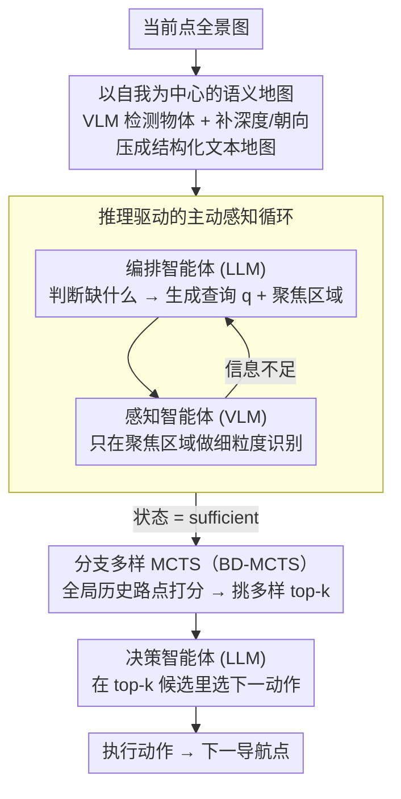

# ProFocus: Proactive Perception and Focused Reasoning in Vision-and-Language Navigation

**会议**: CVPR 2026  
**arXiv**: [2603.05530](https://arxiv.org/abs/2603.05530)  
**代码**: 无  
**领域**: 机器人 / 视觉语言导航  
**关键词**: VLN, proactive perception, MCTS, zero-shot navigation, LLM agent

## 一句话总结
提出 ProFocus，一个免训练的渐进式框架，通过主动感知（将全景图转为语义地图+LLM 生成针对性视觉查询）和聚焦推理（BD-MCTS 从大量历史路点中筛选 top-k 高价值候选），在 R2R 和 REVERIE 基准上达到零样本方法的 SOTA。

## 研究背景与动机
**领域现状**：视觉语言导航 (VLN) 要求智能体根据自然语言指令在物理环境中导航。基于基础模型的 VLN 方法通过后训练适应或零样本提示展现了良好前景，但普遍存在两个关键缺陷。

**现有痛点**：(1) 被动视觉感知——VLM 驱动的方法统一处理全景或多视角视觉输入，冗余信息膨胀视觉 token 数量，导致注意力在无关特征上扩散，遮蔽指令相关的细粒度线索；(2) 无聚焦推理——两种范式都接收大量未优先级排序的历史上下文，包含过去的观测和路点，长轨迹历史稀释注意力，阻碍精确推理。

**核心矛盾**：导航需要选择性感知（只获取任务相关信息）和聚焦推理（只关注高价值历史路点），但现有方法在两方面都是"全量处理"。

**本文目标**：如何主动获取任务相关的视觉观测以减少感知冗余，如何在大量历史上下文中聚焦推理高价值路点。

**切入角度**：通过 LLM-VLM 协作建立闭环感知-推理循环，用 MCTS 变体从全局历史中筛选关键路点。

**核心 idea**：LLM 根据语义地图判断"需要知道什么"并生成视觉查询，VLM 在指定区域执行细粒度感知，再用 BD-MCTS 从海量历史中聚焦 top-k 高价值路点进行决策。

## 方法详解

### 整体框架
ProFocus 要解决的是 VLN 里"看得太多、记得太杂"的两个老毛病：全景图一股脑塞给 VLM 让注意力被冗余像素稀释，长轨迹历史不加区分地堆给 LLM 让推理被无关路点淹没。它的做法是把一步导航拆成"感知—推理"的闭环，由三个分工明确的智能体接力完成：编排智能体 $\mathcal{A}_{\mathrm{orch}}^{\boldsymbol{\theta}}$（LLM）负责空间推理，判断当前缺什么信息、该往哪看；感知智能体 $\mathcal{A}_{\mathrm{perc}}^{\boldsymbol{\phi}}$（VLM）只在被指定的区域做细粒度识别；决策智能体 $\mathcal{A}_{\mathrm{dec}}^{\boldsymbol{\psi}}$（LLM）在筛选过的少量高价值候选上做最终选路。每一步先把全景图压成一张语义地图，编排智能体据此发起若干轮"针对性提问—定点观察"直到信息够用，再由 BD-MCTS 从全局历史中挑出 top-k 候选交给决策智能体，输出下一个动作。

### 关键设计

**1. 以自我为中心的语义地图：把像素压成 LLM 能空间推理的文本**

直接把全景图喂给 VLM 会带来海量冗余视觉 token，而 LLM 又读不懂原始像素里的方位关系。语义地图的思路是先把全景图切成 $K$ 个方向视图，让 VLM 并行检测所有物体 $\{(\boldsymbol{b}_i, \textit{obj}_i)\}_{i=1}^{N_t}$，再用单目深度估计补上每个物体的深度 $d_i$，并按框的水平位置算出朝向角

$$h_i = \pi \cdot \frac{x_1 + x_2 - F}{F}$$

最终把整圈观测组织成一张结构化地图 $\mathcal{C}_t = \{(h_i, \textit{obj}_i(\boldsymbol{b}_i), d_i)\}_{i=1}^{N_t}$ 并格式化成自然语言。这样 LLM 拿到的不再是像素而是"左前方 2 米有一扇门"这种带方位和距离的文本，既能直接做"往左边那个物体走"的空间推理，又彻底避开了处理原始图像的 token 膨胀。

**2. 推理驱动的主动感知循环：缺什么才去看什么**

被动感知的问题在于不管任务需不需要都把所有视图算一遍，细粒度线索反而被冗余特征淹没。这里反过来让推理来驱动感知：编排智能体综合语义地图、轨迹历史和指令，先想清楚"现在还缺哪条信息"，生成一个具体的视觉查询 $\boldsymbol{q}$ 和一块聚焦区域 $\boldsymbol{R}_{\text{focus}}^t$：

$$(\boldsymbol{q}, \boldsymbol{R}_{\text{focus}}^t) = \mathcal{A}_{\mathrm{orch}}^{\boldsymbol{\theta}}(\mathcal{C}_t, \boldsymbol{\tau}_t, \mathcal{I}, \mathcal{H}_{\text{query}})$$

感知智能体只在这块区域里针对这个问题做细粒度识别 $\boldsymbol{a}_i^t = \mathcal{A}_{\mathrm{perc}}^{\boldsymbol{\phi}}(\boldsymbol{\mathcal{O}}_t|_{\boldsymbol{R}_{\text{focus}}^t}, \boldsymbol{q})$，结果回填给编排智能体；这个"提问—定点观察—判断够不够"的循环一直转到状态变为 $s_t = \text{sufficient}$ 才停。和被动方法相比，它既因为只看相关区域而省下大量视觉 token，又因为带着具体问题去看（比如"门是什么颜色"）而拿到了被动扫描捞不到的细粒度属性。

**3. 分支多样 MCTS（BD-MCTS）：从全局历史里挑 top-k 而不是单条最优**

标准 MCTS 是为"选一个最优动作"设计的，但 VLN 里随着轨迹变长，候选路点越积越多，决策智能体若全量阅读就会被无关历史稀释注意力；而只给一条最优候选又容易陷进局部最优。BD-MCTS 把目标从"选一个"改成"挑出多样的 top-k"。它维护一棵搜索树 $\mathcal{T} = \langle \boldsymbol{V}_{\mathcal{T}}, \boldsymbol{E}_{\mathcal{T}}, Q, N \rangle$，分三步走：扩展时不做昂贵的随机 rollout，而用语义值 $V_{\text{sem}}(u)$ 直接初始化新节点；回传时沿路径动态精修节点价值

$$Q(v) \leftarrow Q(v) + \frac{R_t - Q(v)}{N(v)}$$

最后做路径聚合打分，把累积语义价值和到当前点的物理距离惩罚结合起来：

$$\text{Score}(v) = V_{\text{path}}(v) - \lambda \cdot \frac{d_{\mathcal{G}}(v_t, v)}{\max_{u} d_{\mathcal{G}}(v_t, u)}$$

距离项保证挑出的候选物理上可达、不会让智能体绕远路；同时约束每个父节点最多贡献 2 个子节点，强制 top-k 覆盖不同探索方向而不是扎堆在同一条路径上。最终只有这 top-k 个高价值候选进入决策智能体的推理上下文，把"聚焦推理"落到实处。

### 一个完整示例
以指令"走到厨房，停在冰箱旁边"为例走一步：当前点的全景图先被切成 $K$ 个视图，VLM 检测出门、桌子、走廊等物体并补上深度和朝向，压成语义地图"右前方 3 米一扇门、左侧 2 米一张桌子……"。编排智能体读到地图后发现指令关心"厨房"，但地图里没有厨房线索，于是生成查询"门后是否是厨房"并把聚焦区域锁定在那扇门所在视图；感知智能体只放大这一块识别出"门内可见冰箱和灶台"，回填后编排智能体判定信息已 $\text{sufficient}$，停止追问。随后 BD-MCTS 在历史所有路点里打分：通向厨房门的候选语义价值高、距离近得分最高，旁边走廊岔口因方向多样也被保留为次优候选，每个父节点至多留 2 个子节点，最终只把 top-k 个候选交给决策智能体——它在这几个候选里选定"前往厨房门"，而无须翻阅整条历史轨迹。

### 损失函数 / 训练策略
ProFocus 是**完全免训练 (training-free)** 的框架，无须微调或训练任何模型，三个智能体都直接调用现成的 LLM（Qwen3-Max / DeepSeek-V3）和 VLM（Qwen3-VL-Max / GLM-4.5V）。这也意味着可即插即用更强的基础模型，而不必重训任何参数。

## 实验关键数据

### 主实验
R2R validation unseen set 结果：

| 方法 | NE↓ | OSR↑ | SR↑ | SPL↑ |
|------|-----|------|-----|------|
| NavGPT (GPT-4) | 6.46 | 42.0 | 34.0 | 29.0 |
| MapGPT (GPT-4V) | 5.63 | 57.6 | 43.7 | 34.8 |
| MSNav (GPT-4o) | 5.24 | 65.0 | 46.0 | 40.0 |
| **ProFocus (Q3+Q3VL)** | **4.92** | **65.0** | **52.5** | **39.8** |
| **ProFocus (DS3+GLM)** | 5.21 | 63.0 | 50.0 | 41.2 |

### 消融实验

| 配置 | SR↑ | SPL↑ | 说明 |
|------|-----|------|------|
| NavGPT† (DS3) | 36.0 | 28.1 | 无主动感知，无聚焦推理 |
| MapGPT† (GLM) | 41.4 | 30.8 | 基于VLM的被动感知 |
| ProFocus (DS3+GLM) | 50.0 | 41.2 | +主动感知+BD-MCTS |
| ProFocus (Q3+Q3VL) | 52.5 | 39.8 | 更强基础模型进一步提升 |

### 关键发现
- SR 从 NavGPT 的 36.0% 提升至 52.5%，绝对提升 16.5 个百分点
- 主动感知通过减少视觉 token 和增强细粒度属性识别同时提高效率和准确率
- BD-MCTS 的分支多样性约束对避免局部最优至关重要
- 免训练框架在零样本设置下已超过部分训练方法

## 亮点与洞察
- 三智能体协作分工明确——编排（规划）、感知（执行）、决策（推理），符合人类导航认知过程
- "主动感知"对比"被动感知"的提升说明：少而精的视觉信息优于多而杂
- BD-MCTS 将人类的优先记忆访问机制引入 VLN——人类也不会均匀回忆所有历史状态
- 免训练框架意味着可即插即用更强的 LLM/VLM

## 局限与展望
- API 调用开销——每步导航需多次 LLM/VLM 调用，延迟较高
- 语义地图依赖物体检测和深度估计的质量
- 评估依赖特定 LLM/VLM，更换模型可能需要重新调整 prompt
- 仅评估 R2R 和 REVERIE，未涉及更挑战性的连续环境导航

## 相关工作与启发
- **NavGPT**：将全景场景转为文本描述，被动感知
- **MapGPT**：利用 VLM 地图表示，但仍被动处理所有视图
- **AO-Planner**：使用 SAM 的视觉可达性提示，但缺乏主动查询机制
- 启发：主动感知+聚焦推理的范式可推广到其他需要长程历史推理的任务，如对话系统、长文档问答

## 评分
- 新颖性: ⭐⭐⭐⭐ 主动感知循环和 BD-MCTS 的结合新颖，闭环感知-推理设计巧妙
- 实验充分度: ⭐⭐⭐⭐ R2R 和 REVERIE 两个标准基准，多种模型配置对比
- 写作质量: ⭐⭐⭐⭐ 结构清晰，公式化严谨
- 价值: ⭐⭐⭐⭐ 免训练框架实用性强，可作为 LLM/VLM 在导航任务中的通用增强模块

<!-- RELATED:START -->

## 相关论文

- [\[CVPR 2026\] AwareVLN: Reasoning with Self-awareness for Vision-Language Navigation](awarevln_reasoning_with_self-awareness_for_vision-language_navigation.md)
- [\[CVPR 2026\] Progress-Think: Semantic Progress Reasoning for Vision-Language Navigation](progress-think_semantic_progress_reasoning_for_vision-language_navigation.md)
- [\[CVPR 2026\] FantasyVLN: Unified Multimodal Chain-of-Thought Reasoning for Vision-and-Language Navigation](fantasyvln_unified_multimodal_chain-of-thought_reasoning_for_vision-and-language.md)
- [\[CVPR 2026\] Towards Open Environments and Instructions: General Vision-Language Navigation via Fast-Slow Interactive Reasoning](towards_open_environments_and_instructions_general_vision-language_navigation_vi.md)
- [\[CVPR 2026\] DecoVLN: Decoupling Observation, Reasoning, and Correction for Vision-and-Language Navigation](decovln_decoupling_observation_reasoning_and_correction_for_vision-and-language_.md)

<!-- RELATED:END -->
