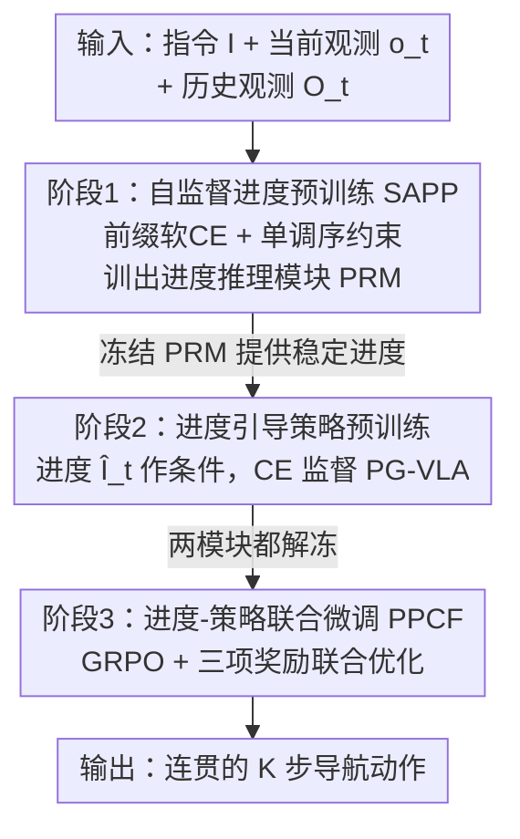

# Progress-Think: Semantic Progress Reasoning for Vision-Language Navigation

**会议**: CVPR 2026  
**论文**: [CVF Open Access](https://openaccess.thecvf.com/content/CVPR2026/html/Wang_Progress-Think_Semantic_Progress_Reasoning_for_Vision-Language_Navigation_CVPR_2026_paper.html)  
**代码**: [项目页](https://horizonrobotics.github.io/robot_lab/progress-think)  
**领域**: 视觉语言导航 / 具身智能  
**关键词**: VLN-CE, 语义进度推理, 自监督对齐, GRPO, VLA

## 一句话总结
针对视觉语言导航（VLN）中智能体"不知道自己走到指令哪一步"的问题，Progress-Think 不再预测数值完成度，而是让模型从历史观测推理出"已完成的那段指令文本"，并用一套无需标注的三阶段框架（自监督进度预训练 → 进度引导策略预训练 → 进度-策略联合 RL 微调）把进度推理和动作策略耦合起来，在 R2R-CE / RxR-CE 上仅用单目 RGB 就取得 SOTA。

## 研究背景与动机

**领域现状**：连续环境下的视觉语言导航（VLN-CE）要求智能体读懂一条多步自然语言指令，并在长时序里连贯地走完。当前主流是 VLA（Vision-Language-Action）模型：把指令、当前 RGB 观测、历史观测喂进多模态大模型，端到端直接预测下一步动作。

**现有痛点**：这类端到端 VLA 把"我走到指令第几步了"这件事**隐式地埋在动作预测里**，没有显式表示；而传统进度方法则用几何比例、剩余距离这类**数值代理**去近似进度。问题是——数值进度只衡量空间位移，根本说不清"智能体当前对应指令里的哪一段语义"。走了 60% 的路程，不等于完成了 60% 的语义子目标（可能在原地反复转向找门）。

**核心矛盾**：观测序列和指令序列其实天然存在一个被前人忽略的结构性质——**单调共同推进（monotonic co-progression）**：随着观测不断累积，"已对齐的指令前缀"也单调地往后延伸，后面的进度总是建立在前面进度之上（论文 Fig.1）。可现有方法要么把进度信号和视觉上下文纠缠在一起，要么只回归一个粗糙的全局完成率，谁都没把这个单调对齐结构利用起来做**步级的语义对齐**。

**核心 idea**：把进度估计重新表述为"**视觉观测 ↔ 指令前缀**"的步级语义对齐——直接预测"到目前为止已经完成的那段指令文本（instruction-style progress）"，作为语义锚点去引导策略。更关键的是，标注这种步级语义进度极其昂贵、也没有公开数据集提供这种监督，所以全套训练必须**无标注（annotation-free）**：监督信号直接从指令自身的顺序结构里推导出来。

## 方法详解

### 整体框架

Progress-Think 把 VLN 解耦成两个互补组件：一个**进度推理模块（PRM, $\mathbf{F}_P$）**负责"想清楚已经走到哪了"，一个**进度引导 VLA 模块（PG-VLA, $\pi_\theta$）**负责"据此决定下一步怎么走"。在第 $t$ 步，PRM 吃进历史观测 $\mathcal{O}_t=\{o_0,\dots,o_{t-1}\}$ 和当前观测 $o_t$，输出一段预测的"已完成指令文本" $\hat{\mathcal{I}}_t=\mathbf{F}_P(\mathcal{O}_t, o_t)$；这段语义进度随后作为额外条件喂给 PG-VLA，由它在指令 $I$、观测和进度 $\hat{\mathcal{I}}_t$ 共同作用下预测接下来 $K$ 个动作。

难点在于"没有步级标注"，所以整套能力靠**三阶段渐进式训练**搭起来：先用自监督让 PRM 从指令的前缀结构里学会推理进度（PRM 单独训）；再冻住 PRM、用它输出的进度去监督策略学习（PG-VLA 单独训）；最后用强化学习让两个模块联合微调、互相校准。三阶段串行、各管一摊又层层递进，是典型的 pipeline 结构：

### 关键设计

**1. 自监督进度预训练 SAPP：没有标注，就从指令前缀里"造"监督**

这一阶段要解决最根本的痛点——数据集只给高层指令和终点，没有步级子目标标注。SAPP 的做法是直接利用指令自身的两个天然性质造监督信号：(1) 一段被正确执行的观测序列，应当对应到指令"到此为止已执行的那个前缀"；(2) 进度应当随观测序列**单调增长**。

为此它把"指令前缀长度 $k$"当作隐进度状态，把 decoder logits 转成一个关于前缀长度的软分布：$p_\theta(k\mid\mathcal{O}_t,\mathcal{I})\propto\exp\!\big(-\mathrm{CE}(\hat{\mathcal{I}}_{t,1:k},\mathcal{I}_{1:k})/\tau\big)$，其中 $\tau$ 是温度、CE 是交叉熵；一个可微的"进度前缀长度"就定义为分布期望 $\hat{k}_t=\mathbb{E}_{p_\theta}[k]$。在此之上配两个损失：**前缀子集软交叉熵损失（Prefix-Subset Soft CE）** 给出对部分完成度的细粒度软监督

$$\mathcal{L}_{\mathrm{prefix}}=\mathbb{E}_t\Big[-\tau\log\sum_k\exp\!\big(-\tfrac{\mathrm{CE}(\hat{\mathcal{I}}_{t,1:k},\mathcal{I}_{1:k})}{\tau}\big)\Big],$$

以及**单调序损失（Monotonic Ordering Loss）**，对同一条 episode 里 $t_i<t_j$ 的两个状态，强制后者预测的前缀不短于前者：$\mathcal{L}_{\mathrm{mono}}=\mathbb{E}_{(i,j):t_i<t_j}\big[\max(0,\hat{k}_{t_i}-\hat{k}_{t_j})\big]$。总目标 $\mathcal{L}_{\mathrm{SAPP}}=\mathcal{L}_{\mathrm{prefix}}+\mathcal{L}_{\mathrm{mono}}$。前者把"执行进度"变成连续可学的语义量，后者用时序一致性防止进度回退、稳住训练——两者合起来，PRM 不靠任何外部标注就学会了"我对应到指令第几段"。

**2. 进度引导策略预训练 PG-VLA：把"已完成的语义"当显式条件喂给策略**

光会推理进度还不够，得让进度真正左右动作。这一阶段把 PRM **冻住**（保证进度引导稳定不漂移），训练进度引导 VLA：$a_{t:t+K-1}=\pi_\theta(\mathcal{O}_t,o_t,\mathcal{I},\hat{\mathcal{I}}_t)$，即在常规的指令+观测之外，多喂一路 PRM 给出的进度 $\hat{\mathcal{I}}_t$ 作为显式条件。直觉是：知道"哪些子目标已完成、还剩哪些"，策略就能把注意力对准当前真正相关的那一段子目标，而不是在整条指令里盲猜。训练用标准交叉熵对齐专家的后 $K$ 步动作 $\mathcal{L}_{\mathrm{policy}}=-\log\pi_\theta(a^*_{t:t+K-1}\mid\mathcal{O}_t,o_t,\mathcal{I},\hat{\mathcal{I}}_t)$。这一步把"语义进度"从一个旁路信号变成了策略决策的锚点，缓解长时序里的歧义和误差累积。

**3. 进度-策略联合微调 PPCF：用 GRPO 让进度与策略互相校准**

前两阶段是单向的（进度监督策略），但自监督学来的进度未必和真正的导航目标对齐。PPCF 用强化学习把 PRM 和 PG-VLA **一起解冻、联合优化**，采用 GRPO 框架。它设计了三项互补奖励并直接相加成 $r_t=r_{\mathrm{act}}+r_{\mathrm{fmt}}+r_{\mathrm{len}}$：**动作奖励** $r_{\mathrm{act}}=\sum_{i=0}^{K-1}\prod_{j=0}^{i}\mathbb{1}[a_{t+j}=a^*_{t+j}]$ 只奖励"最长正确前缀"——一旦某步错了，后面全不给分，取值 $\{0,1,\dots,K\}$，鼓励连续正确；**格式奖励** $r_{\mathrm{fmt}}$ 校验动作序列是否合法（合法 1 否则 0）；**进度长度奖励** $r_{\mathrm{len}}$ 约束预测进度文本不超过完整指令长度，超了就按 $-\beta(|\hat{\mathcal{I}}_t|-|\mathcal{I}|)$ 惩罚，防止"过早宣布完成"或"过度延展"。每次 rollout，PRM 采 $N$ 个进度假设、各自驱动动作模块产生一组动作，用组内归一化算优势 $A^{(n)}=(r^{(n)}-\mathrm{mean}(r_t))/\mathrm{std}(r_t)$，并以 GRPO 目标 $\mathcal{L}_{\mathrm{PPCF}}$ 联合更新两模块。值得注意的是其重要性比 $\rho^{(n)}$ 同时包含策略侧和 PRM 侧两个概率比的乘积，使进度推理也被纳入 RL 优化——进度学得更贴合导航目标，策略也变得对进度引导更敏感，两者互相强化。

### 损失函数 / 训练策略
三阶段分别用 $\mathcal{L}_{\mathrm{SAPP}}$（前缀软 CE + 单调序）、$\mathcal{L}_{\mathrm{policy}}$（CE）、$\mathcal{L}_{\mathrm{PPCF}}$（GRPO + 三项奖励）。PRM 与 PG-VLA 均从 NVILA-2B 初始化。训练数据来自 R2R-CE / RxR-CE / ScaleVLN 训练集，转成约 1200K 步级状态-动作对，并额外用"轨迹前缀配完整指令"造弱进度监督样本，加上 DAgger 策略采集的 500K 非 oracle 样本提升 off-distribution 鲁棒性。8×H20 训练，Stage 1 约 8 小时、Stage 2/3 各约 60 小时；GRPO rollout 数 4、clip 0.28、KL 系数 0。动作空间为 {前进(25/50/75 cm)、左转/右转(15°/30°/45°)、停止}，每次预测并执行 $K=3$ 步。

## 实验关键数据

### 主实验

R2R-CE val-unseen（仅单目 RGB、零外部数据，却超过用 depth/全景的方法）：

| 方法 | 观测 | NE ↓ | OSR ↑ | SR ↑ | SPL ↑ | 外部数据 |
|------|------|------|-------|------|-------|----------|
| NaVILA | S.RGB | 5.22 | 62.5 | 54.0 | 49.0 | 2215K |
| Aux-Think | S.RGB | 5.49 | 62.9 | 55.7 | 48.7 | 1600K |
| MonoDream | S.RGB | 5.45 | 61.5 | 55.8 | 49.1 | 0K |
| BEVBert† | Depth+Pano | 4.57 | 67.0 | 59.0 | 50.0 | - |
| **Progress-Think** | **S.RGB** | **4.68** | 63.6 | **60.1** | **53.6** | **0K** |

SR 60.1 / SPL 53.6 全面领先单目方法，且 SPL 甚至超过用深度+全景的 BEVBert——主要归功于显式进度建模带来的数据效率（无需外部推理标注）。

RxR-CE val-unseen（跨数据集泛化，所有方法都只在 R2R-CE 上训）：

| 方法 | NE ↓ | OSR ↑ | SR ↑ | SPL ↑ |
|------|------|-------|------|-------|
| NaVid | 8.41 | 34.5 | 23.8 | 21.2 |
| MonoDream | 8.57 | 35.9 | 25.1 | 21.6 |
| **Progress-Think** | **8.30** | **38.3** | **27.5** | **22.7** |

零 RxR-CE 训练数据仍取得 SOTA，验证了框架的迁移性。

### 进度表示对比 & 消融实验

进度表示形式对比（R2R-CE，验证"语义进度"比数值/全局指令更优）：

| 进度表示 | NE↓ | OSR↑ | SR↑ | SPL↑ |
|----------|------|------|------|------|
| 数值进度回归（完成百分比） | 8.25 | 37.7 | 33.4 | 26.2 |
| 指令重构（全局摘要） | 7.67 | 45.8 | 37.7 | 32.1 |
| **语义进度（本文）** | **6.84** | **50.4** | **43.8** | **38.5** |

组件消融（SAPP 的两个损失 + PPCF 的奖励配置，R2R-CE）：

| Prefix | Mono | AR+FR | PLR | NE↓ | OSR↑ | SR↑ | SPL↑ | 说明 |
|--------|------|-------|-----|------|------|------|------|------|
| | | | | 8.16 | 44.1 | 33.0 | 28.3 | baseline |
| ✓ | | | | 7.26 | 45.8 | 39.4 | 34.6 | 加前缀软 CE，SR +6.4 |
| ✓ | ✓ | | | 6.94 | 48.4 | 41.4 | 36.5 | 再加单调序，全面提升 |
| ✓ | ✓ | ✓ | | 7.16 | 46.2 | 40.0 | 35.0 | 仅 AR+FR 奖励 |
| ✓ | ✓ | ✓ | ✓ | **6.84** | **50.4** | **43.8** | **38.5** | 完整模型 |

### 关键发现
- **语义进度 > 数值/全局进度**：换成语义进度后 SR 从 33.4（数值回归）跃升到 43.8，证明步级、指令风格的对齐才能真正支撑可执行决策。
- **进度长度奖励 PLR 是 PPCF 的关键拼图**：只用 AR+FR 时 SR 反而从 41.4 掉到 40.0（NE 还升高），加上 PLR 后 SR 才回到 43.8——约束进度文本长度、防止"过早宣布完成"对稳定 RL 至关重要。
- **执行步数 $K=3$ 最佳**：每次只执行 1 步会短视、频繁重规划（NE 4.73），执行全部 3 步预测最稳（NE 4.68 / SR 60.1）。
- **对轨迹粒度鲁棒**：在指令/轨迹长度比极粗（<0.5）或极细（1.5-3.0）的极端情况下增益最大。

## 亮点与洞察
- **"单调共同推进"是个被忽视却很本质的结构先验**：观测累积 ⇄ 指令前缀单调延伸，作者把它直接落成可微的"前缀长度期望 $\hat{k}_t$"+单调序损失，是从结构性质到可训练目标的漂亮转化。
- **把进度从"标量"升级成"指令文本片段"**：数值进度只说"走了多少"，语义进度直接说"完成了哪几句指令"，可解释性强、还能当策略的显式条件——这是 SR 大涨的根因。
- **GRPO 重要性比里塞进 PRM 侧概率比**，让进度推理本身也进 RL 优化，而非只优化动作策略，这个细节让"进度-策略联合微调"名副其实。
- **无标注训练值得迁移**：用"序列前缀 + 单调性"自造监督的思路，可推广到任何"输入序列与目标序列天然共同推进"的任务（如步骤化指令跟随、流程型 agent）。

## 局限与展望
- 进度对齐的前提是"观测序列被较好执行"才对应指令前缀；当智能体大幅走错（off-trajectory）时，前缀对齐假设可能失真，论文虽用 DAgger 采非 oracle 样本缓解，但极端偏离下的可靠性未深入分析。⚠️
- 三阶段训练成本不低（Stage 2/3 各约 60 小时、8×H20），且依赖 NVILA-2B 这一特定 backbone，换骨干的可迁移性未验证。
- 进度长度奖励里的惩罚因子 $\beta$、温度 $\tau$ 等超参敏感性论文未给出系统分析，PLR 缺失时性能反降说明该正则较关键、需谨慎调。
- 当前只在室内 photorealistic 仿真（R2R-CE/RxR-CE）评测，真实机器人部署效果未报告。

## 相关工作与启发
- **vs 端到端 VLA（NaVILA / Uni-NaVid）**：它们把进度隐式埋在动作预测里、无显式表示；本文显式抽出"语义进度"并作为条件回灌策略，同样单目 RGB 下 SR 从 ~54 提到 60.1，且零外部数据。
- **vs 数值进度估计（几何比例/剩余距离）**：传统方法量化的是空间位移、无法定位"指令语义到哪一步"；本文用指令前缀对齐取代标量代理，进度表示对比实验里 SR 高出 10+ 点。
- **vs CoT 推理监督（Aux-Think / 慢思考 pipeline）**：CoT 对齐的是语言合理性、且依赖大 VLM 或人工生成的外部推理标注（昂贵、易引入偏差）；本文的进度推理对齐的是可度量的任务进展、且完全自监督无外部标注。
- **vs 里程碑/子目标方法（Milestone-based）**：它们需要额外结构或监督来产生步级信号；本文从指令前缀的单调性里"白嫖"出步级监督，无需子目标标注。

## 评分
- 新颖性: ⭐⭐⭐⭐⭐ 把"单调共同推进"结构先验落成自监督的语义进度推理，重定义了 VLN 的进度估计范式
- 实验充分度: ⭐⭐⭐⭐ 两 benchmark + 跨数据集泛化 + 进度表示对比 + 细粒度消融，较扎实；缺真实机器人与超参敏感性分析
- 写作质量: ⭐⭐⭐⭐ 动机（Fig.1 的共同推进）讲得清楚，三阶段逻辑顺畅
- 价值: ⭐⭐⭐⭐⭐ 单目 RGB、零外部数据即 SOTA，无标注训练范式对具身导航实用性强

<!-- RELATED:START -->

## 相关论文

- [\[CVPR 2026\] Recurrent Reasoning with Vision-Language Models for Estimating Long-Horizon Embodied Task Progress](recurrent_reasoning_with_vision-language_models_for_estimating_long-horizon_embo.md)
- [\[CVPR 2026\] AwareVLN: Reasoning with Self-awareness for Vision-Language Navigation](awarevln_reasoning_with_self-awareness_for_vision-language_navigation.md)
- [\[CVPR 2026\] PALM: Progress-Aware Policy Learning via Affordance Reasoning for Long-Horizon Robotic Manipulation](palm_progress-aware_policy_learning_via_affordance_reasoning_for_long-horizon_ro.md)
- [\[CVPR 2026\] ProFocus: Proactive Perception and Focused Reasoning in Vision-and-Language Navigation](profocus_proactive_perception_and_focused_reasoning_in_vision-and-language_navig.md)
- [\[CVPR 2026\] Bridging the 2D-3D Gap: A Hierarchical Semantic-Geometric Map for Vision Language Navigation](bridging_the_2d-3d_gap_a_hierarchical_semantic-geometric_map_for_vision_language.md)

<!-- RELATED:END -->
