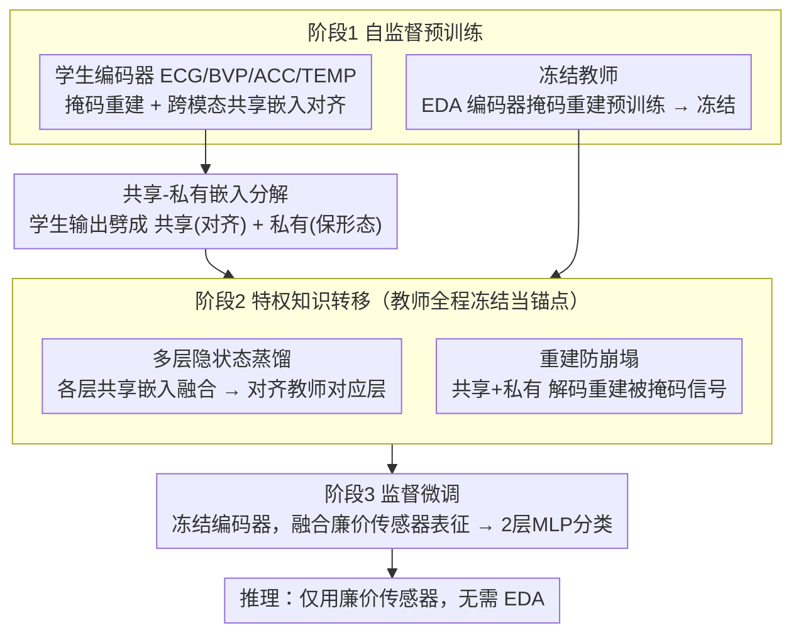

# PULSE: Privileged Knowledge Transfer from Rich to Deployable Sensors for Embodied Multi-Sensory Learning

**会议**: CVPR 2026 Workshop (Sense of Space)  
**arXiv**: [2510.24058](https://arxiv.org/abs/2510.24058)  
**代码**: 无  
**领域**: 机器人  
**关键词**: 特权知识蒸馏, 传感器不对称, 可穿戴设备, 压力检测, 多模态融合

## 一句话总结
本文提出 PULSE 框架，通过冻结的特权传感器（如 EDA）教师模型向廉价可部署传感器（如 ECG、BVP、加速度计）学生模型进行知识蒸馏，引入共享-私有嵌入分解和重建防崩塌机制，在不使用 EDA 推理的情况下达到 0.994 AUROC 的压力检测性能，甚至超越使用全部传感器的模型。

## 研究背景与动机
1. **领域现状**：多传感器系统在可穿戴健康监测、机器人等场景中广泛使用。皮肤电活动（EDA）是急性压力的金标准生理指标，因为它直接反映交感神经系统激活。
2. **现有痛点**：EDA 传感器需要 Ag/AgCl 电极和恒流源，极易受运动伪影干扰，成本高且脆弱。大多数商用可穿戴设备只提供 ECG/PPG、加速度计和温度传感器，无法承载 EDA。
3. **核心矛盾**：训练时有 EDA 数据可用（实验室采集），但部署时无法使用 EDA。直接丢弃 EDA 浪费了宝贵的监督信号；对称对齐方法无法利用 EDA 的信息不对称优势。
4. **本文目标** 在训练阶段利用 EDA 的特权信息来增强廉价传感器的表征学习，部署时完全不需要 EDA。
5. **切入角度**：基于 LUPI（Learning Using Privileged Information）范式，但关键创新在于：不是简单对齐所有模态，而是将学生表征分解为"共享"（可对齐，传输知识）和"私有"（保留模态特异性）两个子空间。
6. **核心 idea**：冻结特权传感器教师 + 共享-私有嵌入分解 + 多层隐状态蒸馏 + 重建防崩塌，实现从高端到低端传感器的知识转移。

## 方法详解

### 整体框架
三阶段训练流程：(1) 自监督预训练——每个模态的 Masked Autoencoder + 跨模态共享嵌入对齐；(2) 特权知识转移——冻结 EDA 教师，将其隐状态和池化嵌入蒸馏到学生的共享子空间；(3) 监督微调——仅使用廉价传感器的融合表征做分类。推理时完全不需要 EDA。四个关键设计分别落在这条流程的不同环节：冻结教师在阶段 1 末尾把 EDA 编码器定住、阶段 2 全程当锚点；共享-私有分解发生在每个学生编码器的输出处；多层隐状态蒸馏与重建防崩塌则是阶段 2 蒸馏过程中并行作用的两条损失通道。

### 关键设计

**1. 共享-私有嵌入分解：决定什么该对齐、什么该保留**

如果朴素地把所有学生表征都对齐到 EDA 教师，会过度约束学生——ECG 有自己的 QRS 波形态、BVP 有自己的脉搏波，这些模态特异结构既不应该、也不可能完全匹配 EDA。PULSE 的做法是给每个学生编码器的输出套一个随机二值掩码，把它劈成两半：共享嵌入负责跨模态对齐、接收教师的特权知识，私有嵌入则保留各模态特有的信号形态、专供重建使用（教师编码器本身不做这个分解）。这样"传知识"和"留个性"两条诉求各走各的通道，互不挤压。两个极端都验证了平衡的必要：把私有容量砍掉（ratio=0，全共享）丢了模态特异信息，AUROC 跌到 0.959；把共享容量砍掉（ratio=1，全私有）则没了知识转移通道，只有 0.945；ratio=0.5 才达到 0.989 的平衡最优。

**2. 多层隐状态蒸馏：让中间层的结构信息也参与转移**

只对齐最终层表征是不够的——实验里这种 final-only 设置 AUROC 反而跌到 0.953，比连教师都不用的基线（0.963）还低，说明编码器中间层携带了最终池化向量里丢失的互补结构信息。PULSE 因此在每一个匹配层 $\ell$ 都做蒸馏：先把学生各模态的共享嵌入融合，再与教师对应层的表征算余弦相似度损失

$$\mathcal{L}_{\text{hid}} = \frac{1}{|\mathcal{L}|} \sum_\ell (1 - \cos\langle \text{Fuse}(\{S_m^\ell\}), T^\ell\rangle)$$

同时对最终池化嵌入额外加一项对齐损失 $\mathcal{L}_{\text{emb}}$。全层一起对齐把性能推到最佳的 0.994。

**3. 重建作为崩塌防护：本文最关键的发现**

蒸馏本身有个隐患——当所有模态都被往同一个教师目标上拽时，共享嵌入很容易直接塌成一个常数向量来"作弊"对齐。论文实测到了这一幕：不加重建损失时，各模态共享嵌入的平均成对余弦相似度逼近 1.0、特征方差几乎归零（$2.57 \times 10^{-5}$），表征已经失去了区分力。PULSE 的解法是在蒸馏损失之外让每个学生的解码器从"共享+私有"嵌入重建被掩码的信号补丁，这个 MAE 重建目标逼着嵌入必须保留足够还原原信号的信息，等于一个信息保留正则项。加入重建后，余弦相似度回落到 0.027–0.137、方差恢复了三个数量级，崩塌被彻底摁住。

**4. 冻结教师：把额外模态从"信息源"变成"正则化器"**

EDA 教师在自监督预训练后就冻结，蒸馏阶段只更新学生参数。这个选择看似只是工程上图稳定，实则是 PULSE 跑赢全传感器基线的关键。全传感器基线联合优化包括 EDA 在内的所有编码器，在 15 个 LOSO 受试者这种小样本设定下，很容易过拟合到受试者特异的 EDA 伪影；PULSE 冻住教师后，特权信息不再被反向梯度污染，反而成了一个数据依赖的稳定目标，把 AUROC 的跨受试者标准差从 0.133 几乎减半到 0.060。换句话说，EDA 在这里的价值不是"多给了一路信息"，而是"提供了一个不动的锚点来防过拟合"。

### 损失函数 / 训练策略
- **预训练**: $\mathcal{L}_{\text{pre}} = \lambda_{\text{align}} \mathcal{L}_{\text{align}} + \lambda_{\text{rec}} \mathcal{L}_{\text{rec}}$，对齐使用 hinge loss（margin $\alpha=0.2$），训练 300 epochs。
- **知识转移**: $\mathcal{L} = \lambda_{\text{hid}} \mathcal{L}_{\text{hid}} + \lambda_{\text{emb}} \mathcal{L}_{\text{emb}} + \lambda_{\text{rec}} \mathcal{L}_{\text{rec}}$，默认 $\lambda_{\text{hid}}=\lambda_{\text{emb}}=1$，$\lambda_{\text{rec}}=0.1$，训练 100 epochs。
- **微调**: 冻结编码器，仅训练 2 层 MLP（hidden=4），300 epochs，余弦学习率调度。

## 实验关键数据

### 主实验（WESAD 二分类压力检测，LOSO）

| 模型 | 推理输入 | AUROC | AUPRC | Accuracy |
|------|---------|-------|-------|----------|
| A: 无教师基线 | 廉价传感器 | 0.963±0.050 | 0.937±0.101 | 91.64% |
| B: 对称对齐 | 廉价传感器 | 0.972±0.031 | 0.944±0.061 | 88.83% |
| **C: PULSE** | **廉价传感器** | **0.994±0.011** | **0.988±0.022** | **96.08%** |
| D: 全传感器 | 廉价+EDA | 0.983±0.028 | 0.963±0.048 | 90.74% |
| E: 仅EDA教师 | EDA | 0.962±0.067 | 0.924±0.122 | 87.20% |

### 消融实验

| 配置 | AUROC | AUPRC | 说明 |
|------|-------|-------|------|
| 全层蒸馏（默认）| 0.994 | 0.988 | 最佳 |
| 仅3/5/7层 | 0.989 | 0.977 | 部分层次信息丢失 |
| 仅最终层 | 0.953 | 0.922 | 低于无教师基线！|
| 私有比例=0（全共享）| 0.959 | 0.927 | 模态特异信息丢失 |
| 私有比例=0.5（默认）| 0.989 | 0.977 | 平衡最优 |
| 私有比例=1（无共享）| 0.945 | 0.906 | 无知识转移通道 |

### 关键发现
- **PULSE 超越全传感器模型**：不使用 EDA 推理的 PULSE（0.994）反而优于保留 EDA 的全传感器模型（0.983）。这是因为冻结教师防止了对受试者特异 EDA 伪影的过拟合，起到了正则化作用。
- **重建防崩塌是必要的**：无重建时共享嵌入崩塌（cosine≈1.0），加入重建后特征方差恢复了三个数量级。
- **三分类任务优势更明显**：在三分类（baseline/stress/amusement）上，PULSE AUROC 0.956 vs 全传感器 0.812，差距从二分类的微弱扩大到显著。
- **跨数据集泛化**：在 PhysioNet STRESS（36受试者）上也取得 0.965 AUROC，验证了泛化能力。

## 亮点与洞察
- **冻结教师 = 数据依赖正则化器**：这是一个深刻的洞察。PULSE 不是"因为有了更多信息所以更好"，而是"因为冻结了教师所以避免了过拟合"。在小样本跨受试者评估中，正则化的价值甚至超过了额外模态的信息量。这个发现可能对所有小数据多模态学习场景都有启示。
- **重建防崩塌机制具有普适性**：任何多传感器蒸馏场景都可能遇到表征崩塌问题，重建损失作为信息保留正则化器是通用解决方案。
- **共享-私有分解的必要性**：两个极端（全共享/全私有）都明显劣于平衡分配，证明了"什么该对齐、什么该保留"是知识蒸馏中的根本设计问题。

## 局限与展望
- 实验规模较小（WESAD 仅15个受试者），虽使用 LOSO 但统计稳定性仍有限。
- 仅在压力检测任务上验证，未在作者讨论的更广泛场景（如触觉-IMU 转移、XR 传感）上实际实验。
- 共享嵌入是否真正编码了 EDA 特权知识的直接验证（如探测分类器、t-SNE）留给了未来工作。
- 分类头极简（2层 MLP, hidden=4），可能限制了更复杂任务的性能上限。

## 相关工作与启发
- **vs 对称对齐方法（PhysioOmni、ADAPT）**: 这些方法对称地对齐所有模态，不利用信息不对称。PULSE 明确区分特权教师和学生，通过冻结教师提供稳定目标。
- **vs EmotionKD**: 也做跨生物信号的蒸馏，但没有共享-私有分解和多层蒸馏，且两个编码器都更新。
- **vs Abbaspourazad et al.**: 在大规模人群数据上将 PPG 蒸馏到加速度计，但同样缺乏共享-私有分解。
- **本文方法对机器人领域的启示**：触觉传感器到 IMU 的知识转移、高保真到消费级 XR 传感器的转移，都可以直接应用 PULSE 的框架设计。

## 评分
- 新颖性: ⭐⭐⭐⭐ 冻结特权教师+共享私有分解+重建防崩塌的组合设计有原创性
- 实验充分度: ⭐⭐⭐⭐ LOSO评估、两个数据集、详细消融、崩塌可视化证据
- 写作质量: ⭐⭐⭐⭐ 框架介绍清晰，讨论部分对泛化场景的分析有深度
- 价值: ⭐⭐⭐ Workshop论文，实验规模偏小，但核心设计原则有广泛适用性

<!-- RELATED:START -->

## 相关论文

- [\[ICLR 2026\] D2E: Scaling Vision-Action Pretraining on Desktop Data for Transfer to Embodied AI](../../ICLR2026/robotics/d2e_scaling_vision-action_pretraining_on_desktop_data_for_transfer_to_embodied_a.md)
- [\[ICLR 2026\] Experience-based Knowledge Correction for Robust Planning in Minecraft](../../ICLR2026/robotics/experience-based_knowledge_correction_for_robust_planning_in_minecraft.md)
- [\[NeurIPS 2025\] VIKI-R: Coordinating Embodied Multi-Agent Cooperation via Reinforcement Learning](../../NeurIPS2025/robotics/viki-r_coordinating_embodied_multi-agent_cooperation_via_reinforcement_learning.md)
- [\[CVPR 2026\] ForceVLA2: Unleashing Hybrid Force-Position Control with Force Awareness for Contact-Rich Manipulation](forcevla2_unleashing_hybrid_force-position_control_with_force_awareness_for_cont.md)
- [\[CVPR 2025\] ManipTrans: Efficient Dexterous Bimanual Manipulation Transfer via Residual Learning](../../CVPR2025/robotics/maniptrans_efficient_dexterous_bimanual_manipulation_transfer_via_residual_learn.md)

<!-- RELATED:END -->
