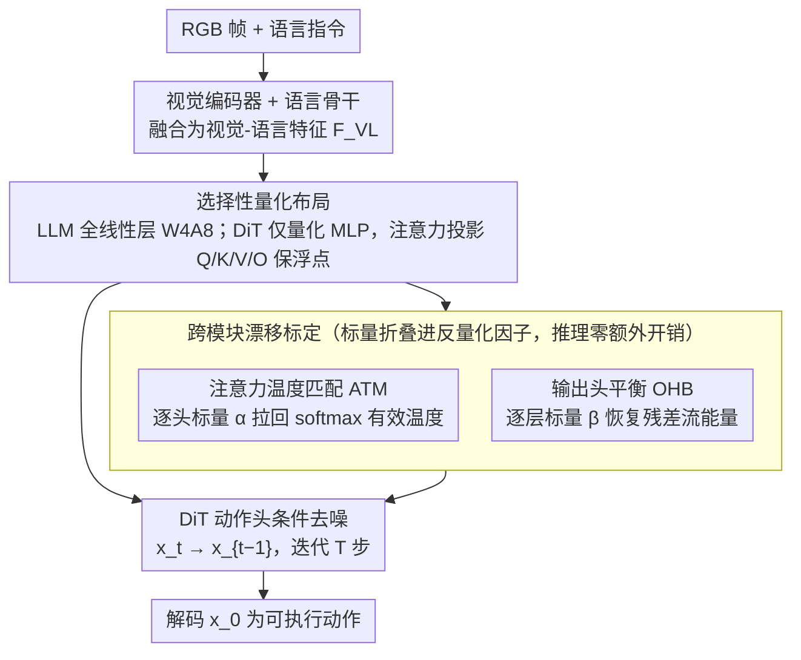

# QuantVLA: Scale-Calibrated Post-Training Quantization for Vision-Language-Action Models

**会议**: CVPR 2026  
**arXiv**: [2602.20309](https://arxiv.org/abs/2602.20309)  
**代码**: 无  
**领域**: 机器人  

## 一句话总结

提出 QuantVLA，首个面向 Vision-Language-Action (VLA) 模型的免训练后量化框架，通过选择性量化布局和两个轻量级标定机制（注意力温度匹配 ATM 和输出头平衡 OHB），在 W4A8 精度下实现约 70% 的内存节省，同时任务成功率超过全精度基线。

## 背景与动机

1. **VLA 模型部署瓶颈**：VLA 模型（如 π0.5、GR00T N1.5）统一了视觉感知、语言理解和动作生成，但随模型规模增大，计算和内存需求急剧膨胀，严重阻碍了在机器人嵌入式平台上的实际部署。
2. **现有效率方法的盲区**：EfficientVLA、VLA-Cache、MoLe-VLA 等方法主要优化视觉编码器或语言层（剪枝、缓存、路由），但几乎没有方法直接量化 DiT（Diffusion Transformer）动作头——而 DiT 是计算和内存的主要贡献者。
3. **通用 PTQ 方法不适用**：SmoothQuant、DuQuant 等为 LLM/VLM 设计的后量化方法无法处理 VLA 中多模态紧耦合带来的异构激活分布问题，直接应用会导致严重性能下降（如 DuQuant 在 π0.5 上成功率从 97.1% 骤降至 76.3%）。
4. **DiT 动作头的脆弱性**：量化引入的尺度漂移会改变注意力 logits 的有效温度和残差流能量，这两种系统性偏移在深层 DiT 中通过残差连接和 LayerNorm 不断累积，导致动作生成不稳定。
5. **首次系统分析**：本文首次对 VLA 模型中量化敏感性进行系统性理论分析，揭示了跨模块漂移的两大失效模式（温度偏移和能量漂移），并据此设计针对性解决方案。

## 方法详解

### 整体框架

QuantVLA 要解决的事情很直接：把 VLA 模型压到低比特，又不让任务成功率掉下来。一个基于扩散的 VLA 由三段串起来——视觉编码器（如 SigLIP2、DINOv2）把 RGB 帧变成图像 token，语言骨干把指令变成文本 token，DiT 动作头则以融合的视觉-语言特征 $F_{\text{VL}}$、机器人本体感知和扩散时间步 $t$ 为条件，一步步去噪动作 latent：

$$x_{t-1} = f_\theta(x_t, F_{\text{VL}}, t)$$

经过 $T$ 步后，最终的 $x_0$ 被解码成可执行动作。量化的底座沿用 DuQuant 的可逆重参数化（对每个线性层施加通道级平滑 $\Lambda$、块正交旋转 $\hat{R}_{(1)}, \hat{R}_{(2)}$ 和锯齿通道置换，把激活里的异常值重新摊平），但论文发现直接套用会塌。

塌的根源是一组一阶误差传播分析：量化误差在 DiT 里不会就地消失，而是沿残差连接和 LayerNorm 一层层累积成两类系统性漂移。一类是**温度漂移**——量化误差 $\varepsilon_{\text{up}}$ 传到 Q、K，改变注意力 logits 的方差，等效地移动了 softmax 的温度，让注意力分布偏离全精度教师：

$$\Delta L \approx \frac{1}{\sqrt{d}} \left( (\varepsilon_{\text{up}} W_q) K_T^\top + Q_T (\varepsilon_{\text{up}} W_k)^\top \right) + \Delta L_{\text{local}}$$

另一类是**能量漂移**——经过多头拼接和输出投影后，注意力输出的幅值发生系统性变化，改变了残差注入增益和 LayerNorm 的工作点：

$$\Delta O \approx J_{\text{softmax}}(L_T) \Delta L \, V_T W_{o,T} + A_T \varepsilon_{\text{up}} W_v W_{o,T} + A_T V_T \delta W_o + \Delta O_{\text{local}}$$

整个框架就是对症下药：先用选择性量化布局把最脆弱的层留作浮点，再用两个轻量标量分别把温度和能量拉回教师的工作点。

### 关键设计

**1. 选择性量化布局：不是所有层都该量化，注意力投影最脆弱就留浮点**

LLM 部分所有线性层都压到 W4A8（4-bit 权重、8-bit 激活），但 DiT 动作头只量化 MLP，注意力投影 $W_q, W_k, W_v, W_o$ 保持浮点。这个取舍直接对应上面的漂移分析：注意力投影正是温度漂移和能量漂移的源头，它决定 softmax 分布的稳定性和残差注入增益，一旦量化就把误差放大并往深层传。消融数字很能说明问题——把整个 DiT（含注意力投影）一起量化，π0.5 的平均成功率从 97.1% 塌到 71.6%，长时序的 Long 任务更是从 93.5% 掉到 39.0%；只量化 MLP 则稳在 95.4%。代价只是 DiT 注意力保浮点让内存少压了一点（1.28GB vs 全量化 1.17GB），但换来的稳定性远值这个钱。

**2. 注意力温度匹配（ATM）：用一个逐头标量把量化后的注意力温度拧回去**

针对温度漂移，ATM 对每个注意力头算一个标量 $\alpha$，让量化模型的 logits 方差对齐教师：

$$\alpha_{\text{raw}} = \frac{\text{Std}(L_T)}{\text{Std}(L_Q) + 10^{-6}}, \qquad \alpha = \text{clip}(\alpha_{\text{raw}}, \alpha_{\min}, \alpha_{\max})$$

校正后的量化 logits 为 $L_Q = L_T / \alpha$，softmax 的有效温度就回到了教师的工作点。关键在于 $\alpha$ 标定完会直接折叠进反量化缩放因子，推理时不增加任何算子——相当于免费把偏掉的注意力分布矫正回来。

**3. 输出头平衡（OHB）：用逐层标量把残差流的能量拉回基线**

针对能量漂移，OHB 对每一层算一个标量 $\beta$，用 RMS 匹配输出投影后的能量：

$$\beta_{\text{raw}}(l) = \frac{\text{RMS}(Z_{T,l})}{\text{RMS}(Z_{Q,l}) + 10^{-6}}, \qquad \beta(l) = \text{clip}(\beta_{\text{raw}}(l), \beta_{\min}, \beta_{\max})$$

校正后 $Z_Q = Z_l / \beta(l)$，残差注入增益和 LayerNorm 工作点随之恢复，避免漂移在深层 DiT 里逐层滚雪球。ATM 和 OHB 共用一套保守策略：用中性带 $\varepsilon = 0.03$ 过滤微小差异（$|\log \alpha| < \varepsilon$ 时直接置 1，不做无谓校正），剪裁范围 $\pm 0.4$ 防止个别异常头/层把标量推到极端值。两者都只需少量无标注标定数据，全程不重训。

## 实验结果

在 LIBERO 模拟器上评估，包含四个任务套件：Spatial（空间关系推理）、Object（物体抓取操作）、Goal（指令-目标对齐）、Long（长时序分解与误差累积控制）。

### 表1：选择性量化布局消融（无 ATM/OHB）

| 模型 | 精度 | 量化范围 | Spatial | Object | Goal | Long | Avg | 内存(GB) |
|------|------|----------|---------|--------|------|------|-----|----------|
| π0.5 | FP16 | 无量化 | 98.5% | 99.0% | 97.5% | 93.5% | 97.1% | 4.27 |
| π0.5 | W4A8 | 仅 LLM | 98.0% | 98.5% | 97.5% | 92.0% | 96.5% | 1.58 |
| π0.5 | W4A8 | 仅 DiT | 81.5% | 94.5% | 71.5% | 39.0% | 71.6% | 3.85 |
| π0.5 | W4A8 | LLM+DiT 全部 | 86.0% | 97.5% | 71.5% | 50.0% | 76.3% | 1.17 |
| π0.5 | W4A8 | LLM+DiT(MLP) | 98.0% | 97.0% | 94.5% | 92.0% | 95.4% | 1.28 |
| GR00T N1.5 | FP16 | 无量化 | 92.0% | 92.0% | 86.0% | 76.0% | 86.5% | 2.02 |
| GR00T N1.5 | W4A8 | LLM+DiT(MLP) | 90.0% | 86.0% | 80.0% | 74.0% | 82.5% | 0.91 |

关键发现：量化全部 DiT（含注意力投影）导致灾难性下降（Long 任务从 93.5% 降至 39.0%），而仅量化 MLP 保持接近基线。

### 表2：QuantVLA 完整结果

| 模型 | 方法 | 精度 | Spatial | Object | Goal | Long | Avg | 内存(GB) | 内存节省 |
|------|------|------|---------|--------|------|------|-----|----------|----------|
| π0.5 | FP16 基线 | FP16 | 98.5% | 99.0% | 97.5% | 93.5% | 97.1% | 4.27 | - |
| π0.5 | DuQuant(LLM+DiT) | W4A8 | 86.0% | 97.5% | 71.5% | 50.0% | 76.3% | 1.17 | 72.6% |
| π0.5 | QuantVLA(LLM) | W4A8 | 98.5% | 99.0% | 96.5% | 96.5% | 97.6% | 1.58 | 63.0% |
| π0.5 | **QuantVLA** | **W4A8** | **98.5%** | **98.0%** | **98.0%** | **96.0%** | **97.6%** | **1.28** | **70.0%** |
| GR00T N1.5 | FP16 基线 | FP16 | 92.0% | 92.0% | 86.0% | 76.0% | 86.5% | 2.02 | - |
| GR00T N1.5 | DuQuant(LLM+DiT) | W4A8 | 66.0% | 70.0% | 68.0% | 76.0% | 70.0% | 0.74 | 63.4% |
| GR00T N1.5 | **QuantVLA** | **W4A8** | **96.0%** | **92.0%** | **90.0%** | **74.0%** | **88.0%** | **0.91** | **55.0%** |

π0.5 上 QuantVLA 以 W4A8 精度达到 97.6% 平均成功率，**超过** FP16 基线的 97.1%，同时内存从 4.27GB 降至 1.28GB（节省 70%）。GR00T N1.5 上同样超越基线（88.0% vs 86.5%），内存节省 55%。

### 表3：不同量化精度与去噪步数

| 设置 | Spatial | Object | Goal | Long | Avg |
|------|---------|--------|------|------|-----|
| π0.5 FP16 | 98.5% | 99.0% | 97.5% | 93.5% | 97.1% |
| π0.5 W4A8 | 98.5% | 98.0% | 98.0% | 96.0% | 97.6% |
| π0.5 W4A4 | 98.5% | 98.5% | 93.5% | 90.5% | 95.3% |
| GR00T N1.5 8步 | 96.0% | 92.0% | 90.0% | 74.0% | 88.0% |
| GR00T N1.5 16步 | 96.0% | 94.0% | 84.0% | 80.0% | 88.5% |

即使在更激进的 W4A4 精度下仍保持 95.3% 的平均成功率，展现出良好的鲁棒性。

## 亮点

- **首个 VLA PTQ 框架**：首次实现对 VLA 模型（包括 DiT 动作头）的成功后量化，填补了该领域空白。
- **理论驱动设计**：通过一阶误差传播分析明确揭示了温度漂移和能量漂移两大失效机制，ATM 和 OHB 的设计有严谨的理论支撑而非经验调参。
- **量化后反超基线**：π0.5 在 W4A8 下成功率 97.6% 超过 FP16 的 97.1%，GR00T N1.5 上也类似——量化引入了正则化效果。
- **完全免训练**：仅需少量无标注标定数据，ATM/OHB 标量折叠进反量化因子后推理时零额外开销，保持原始架构和算子调度不变。
- **通用性**：跨两个代表性 VLA 模型（π0.5 和 GR00T N1.5）验证，支持不同精度（W4A8、W4A4）和去噪步数设置。

## 局限性

- **评估场景有限**：仅在 LIBERO 模拟器及 Simpler 基准上验证，缺乏真实机器人部署的验证，仿真到真实的迁移效果未知。
- **DiT 注意力未量化**：选择性布局保留了 DiT 注意力投影为浮点，限制了进一步的内存压缩潜力；如何在不损失性能的前提下量化这些层仍是开放问题。
- **标定数据依赖**：虽然标定数据量小且无需标注，但标定数据的分布是否影响泛化性未做深入分析。

## 评分

- ⭐⭐⭐⭐ 新颖性：首次将 PTQ 成功应用于 VLA 模型和 DiT 动作头，理论分析清晰揭示失效机制
- ⭐⭐⭐⭐ 实用性：免训练、零推理开销、70% 内存节省，对机器人部署极具价值
- ⭐⭐⭐ 实验充分度：两个模型、多个精度和配置的消融较完整，但缺乏真实机器人验证
- ⭐⭐⭐⭐ 写作质量：理论分析严谨，从敏感性分析到方法设计逻辑链完整清晰

<!-- RELATED:START -->

## 相关论文

- [\[CVPR 2026\] Adaptive Action Chunking at Inference-time for Vision-Language-Action Models](adaptive_action_chunking_at_inference-time_for_vision-language-action_models.md)
- [\[CVPR 2026\] SaPaVe: Towards Active Perception and Manipulation in Vision-Language-Action Models for Robotics](sapave_active_perception_manipulation_vla_roboti.md)
- [\[CVPR 2026\] AVA-VLA: Improving Vision-Language-Action models with Active Visual Attention](ava_vla_improving_vision_language_action_models_with_active_visual_attention.md)
- [\[ICLR 2026\] ST4VLA: Spatially Guided Training for Vision-Language-Action Models](../../ICLR2026/robotics/st4vla_spatially_guided_training_for_vision-language-action_models.md)
- [\[CVPR 2026\] HiF-VLA: Hindsight, Insight and Foresight through Motion Representation for Vision-Language-Action Models](hif-vla_hindsight_insight_and_foresight_through_motion_representation_for_vision.md)

<!-- RELATED:END -->
