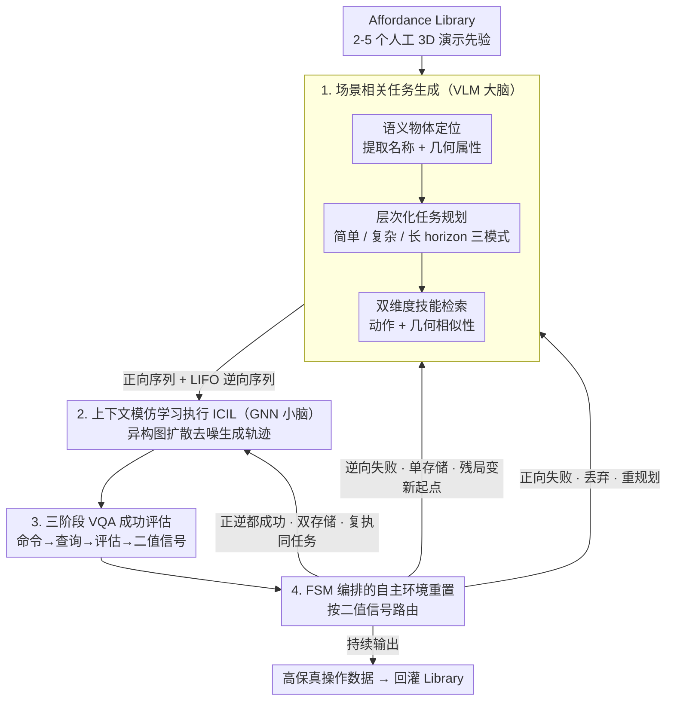

# RADAR: Closed-Loop Robotic Data Generation via Semantic Planning and Autonomous Causal Environment Reset

**会议**: CVPR 2026  
**arXiv**: [2603.11811](https://arxiv.org/abs/2603.11811)  
**代码**: 无  
**领域**:机器人
**关键词**: 自主数据采集, 闭环机器人操作, 环境自动重置, 上下文模仿学习, VLM任务规划  

## 一句话总结

提出RADAR——一个完全自主的闭环机器人操作数据生成引擎，通过VLM语义规划+GNN策略执行+VQA成功评估+FSM驱动的LIFO因果逆序环境重置四个模块，仅需2-5个人工演示即可持续生成高保真操作数据，在仿真中复杂长horizon任务达到90%成功率。

## 背景与动机

端到端具身智能模型（如$\pi_0$、RDT-1B）的scaling严重受限于大规模物理交互数据的获取成本。现有方案面临两难困境：仿真方法（如RoboGen、MimicGen）可扩展但存在sim-to-real gap；遥操作方法质量高但成本高且不可扩展。近期自主数据采集方案（如SOAR）尝试用VLM做任务提议和成功检测，但存在三个关键短板：(1) 视觉提示依赖脆弱的2D像素级猜测，缺乏3D运动学约束；(2) 执行策略是被动的，不能自主编排任务或验证结果；(3) 最致命的——无法实现环境自动重置，人必须反复介入恢复场景，破坏了闭环。

## 核心问题

如何构建一个真正的human-out-of-the-loop数据采集pipeline——让机器人自主规划任务、执行操作、评估成败、并在任务完成后自动恢复环境状态，从而实现持续不间断的数据生成？

## 方法详解

### 整体框架

RADAR将认知负载优雅地分为"大脑-小脑"协作模式：VLM作为"大脑"负责高层语义推理（任务规划+成功评估），GNN策略作为"小脑"负责亚毫米级物理控制。系统以2-5个人工演示构建的Affordance Library为基础先验，通过四个模块闭环运转：(1) 场景相关任务生成→(2) 上下文模仿学习执行→(3) VQA自动成功评估→(4) FSM编排的因果逆序环境重置。其中第 4 个模块的 FSM 把成功评估的二值信号路由成三条循环边，让整条 pipeline 在无人介入下自我维持。

### 关键设计

**1. 场景相关任务生成：从场景语义出发自适应规划正向与逆向序列**

自主采集要先知道「这个场景能做什么任务」，还得为后续自动重置预留退路。这一步分三段：先用 VLM 做语义物体定位（Semantic Object Grounding），从当前场景图像提取结构化物体表示（名称 + 几何属性如"椭圆形"）当作后续规划的硬约束；再做层次化任务规划，按场景复杂度自适应三种模式——简单场景直接做 Affordance 匹配（把"折毛巾"映射到"合盒子"演示），复杂场景用 Selective Attention 主动 mask 干扰物（忽略草莓和魔方、只关注柠檬），长 horizon 任务则做技能链编排并**同时生成正向执行序列和 LIFO 约束的逆向重置序列**；最后通过双维度（动作相似性 + 几何/功能相似性）从 Affordance Library 检索最匹配的 3D 演示当执行先验。正逆序列同时生成，正是后面自动重置能成立的前提。

**2. 上下文模仿学习执行 ICIL：把单次演示零样本泛化成可执行轨迹**

有了任务和 3D 演示先验，还需要一个不用微调就能照着演示干活的执行器。RADAR 基于 Instant Policy 框架，把模仿学习建模为图扩散生成问题：构建含上下文演示、当前点云观测和未来动作的异构图，通过 graph transformer 的逆扩散过程迭代去噪，生成可执行的连续轨迹，从而从单次视觉演示零样本泛化到新物体而不需微调。这里的命门是用 VLM 做语义级对象 mask 过滤点云里的干扰物体——消融实验表明去掉 mask 后成功率从 80-100% 暴跌到 0-10%，干扰物体会让执行策略灾难性失败。

**3. 三阶段 VQA 自动成功评估：把视觉推理和确定性逻辑严格解耦**

让 VLM 直接评估指令式命令是否完成并不可靠。RADAR 设计三阶段流水线把它拆开：先用 LLM 把动作命令（"把黄球放蓝盘上"）转成状态查询（"黄球在布上还是桌上？"）；再把执行后图像和 VQA 查询送进 VLM（如 GPT-4V）拿到文本评估；最后用一个解析 LLM 把冗长的 VLM 回答蒸馏成严格二值信号 True/False，驱动下游状态机。这样 VLM 只负责视觉推理、布尔逻辑交给确定性解码，评估鲁棒得多。

**4. FSM 编排的自主环境重置：把环境重置建模为逆向任务规划**

最致命的短板是无法自动重置环境——人得反复介入恢复场景，闭环就断了。RADAR 的关键创新是在任务规划阶段就同时生成正向计划和因果逆序（LIFO）重置计划，再用 FSM 把执行状态（A 规划、B 正向执行、C 逆向执行）和数据路由动作（D 双存储、E 单存储）显式解耦，支持三种循环：连续成功循环（B→C→B）——正逆都成功就循环复执同一任务、触发双存储保两条轨迹；非对称恢复循环（B→C→A）——正向成功但逆向失败，把未恢复场景当新初始状态重新规划、只保存有效正向轨迹；正向中止（B→A）——正向失败直接丢弃重规划。即使重置失败，系统也能把残局变成新起点持续运转。

### 损失函数 / 训练策略

- ICIL策略使用图扩散模型的标准去噪训练目标
- 整体pipeline不需要端到端训练——VLM(GPT-4V/CogVLM)和GNN策略(Instant Policy)均使用预训练模型
- 实验采用1-shot演示作为上下文（更多演示收益不成正比）
- 技能检索用VLM替代CLIP——CLIP嵌入偏重名词，无法区分细粒度动作语义

## 实验关键数据

| 数据集 | 指标 | 本文 | ReKep | MOKA |
|--------|------|------|-------|------|
| RLBench - Large Container (Cup) | Success Rate | 0.80 | 0.20 | 0.20 |
| RLBench - Push Block | Success Rate | 1.00 | 0.40 | 0.40 |
| RLBench - Stack Block | Success Rate | 0.80 | 0.40 | 0.10 |
| RLBench - Close Box | Success Rate | 1.00 | 0.40 | 0.30 |
| RLBench - Put Laptop & Cup into Tray | Success Rate | 0.80 | 0.10 | 0.00 |
| RLBench - Push & Stack Blocks | Success Rate | 0.40 | 0.00 | 0.00 |
| RLBench - Close then Open Box | Success Rate | 0.90 | 0.20 | 0.10 |

### 消融实验要点

- 点云语义Mask至关重要：去掉VLM驱动的选择性注意力mask后，Large Container (Cup)从0.80→0.10，Push Block从1.00→0.00——干扰物体导致执行策略灾难性失败
- 用VLM替代CLIP做技能检索效果更好——CLIP对动作语义的区分能力不足
- 长horizon任务对基线方法几乎是致命的（ReKep和MOKA降到0-10%），而RADAR保持40-90%

## 亮点

- "大脑-小脑"协作的系统设计思路非常巧妙——VLM管语义推理，GNN管物理精度，各司其职
- 同时生成正向+LIFO逆向计划是核心insight——把环境重置建模为逆向任务规划问题，简洁优雅
- FSM的非对称恢复机制很务实——重置失败不阻塞pipeline，未恢复场景变新起点
- 三阶段VQA评估比单阶段VLM判断鲁棒得多——将视觉推理和布尔逻辑解耦
- 仅需2-5个人工演示+1-shot上下文学习即可泛化到新任务，数据效率极高
- 真实世界部署了可变形物体操作（折毛巾、插纸筒），验证了实际可行性

## 局限与展望

- 环境重置的累积失败率是根本瓶颈——$p_{total} \approx p_{forward} \times p_{reverse}$，复杂场景下复合错误率高
- 目前FSM是proof-of-concept级，高度非结构化环境下的鲁棒重置仍是开放问题
- 真实世界只做了定性验证（毛巾折叠、抓取），缺乏大规模定量实验
- 依赖GPT-4V等商业VLM，成本和延迟可能挑战大规模部署
- 没有评估生成数据用于训练下游策略的效果——数据质量的最终验证缺失
- 仿真实验中环境重置用了ground truth（为隔离前向能力），模糊了完整闭环的定量评估

## 与相关工作的对比

- **SOAR**: 也用VLM做自主数据采集，但用SuSIE图像编辑扩散模型生成视觉子目标——会产生几何幻觉（如物体悬浮），且缺乏环境重置能力。RADAR用3D演示先验替代像素生成，完全规避幻觉问题
- **MOKA**: 用2D mark-based视觉提示做抓取推理，但2D像素空间缺乏运动学约束。RADAR通过Affordance Library提供3D先验，在需要精确接触的任务（如紧配合插入）中更可靠
- **Instant Policy**: RADAR直接采用其图扩散ICIL架构做低层执行。区别在于Instant Policy是被动执行引擎，RADAR将其嵌入完整认知闭环

## 启发与关联

- 同时规划正向动作和逆向重置的思路可以推广到工业自动化场景——任何需要循环执行的生产线任务都面临环境重置问题
- "大脑-小脑"分工模式对构建通用机器人系统有参考价值——不应该让VLM直接输出控制信号，而是让其做规划+验证，将精确控制交给专用策略
- 三阶段VQA评估的设计模式（命令→查询→评估→解码）可以用于其他需要VLM做可靠判断的场景

## 评分
- 新颖性: ⭐⭐⭐⭐ LIFO因果逆序重置和FSM非对称恢复是核心创新，整体系统设计巧妙
- 实验充分度: ⭐⭐⭐ 仿真实验充分但真实世界只有定性验证，缺少生成数据训练下游策略的闭环评估
- 写作质量: ⭐⭐⭐⭐ 系统描述清楚，FSM状态转换图直观，但部分用词偏marketing风
- 价值: ⭐⭐⭐⭐ 指出了自主数据采集的关键瓶颈（环境重置）并给出可行方案，方向价值高

<!-- RELATED:START -->

## 相关论文

- [\[ICML 2025\] Closed-loop Long-horizon Robotic Planning via Equilibrium Sequence Modeling](../../ICML2025/robotics/closed-loop_long-horizon_robotic_planning_via_equilibrium_sequence_modeling.md)
- [\[ICCV 2025\] PASG: A Closed-Loop Framework for Automated Geometric Primitive Extraction and Semantic Anchoring in Robotic Manipulation](../../ICCV2025/robotics/pasg_a_closed-loop_framework_for_automated_geometric_primitive_extraction_and_se.md)
- [\[CVPR 2026\] IGen: Scalable Data Generation for Robot Learning from Open-World Images](igen_scalable_data_generation_for_robot_learning_from_open-world_images.md)
- [\[CVPR 2026\] Semantic Audio-Visual Navigation in Continuous Environments](semantic_audio-visual_navigation_in_continuous_environments.md)
- [\[AAAI 2026\] Realistic Synthetic Household Data Generation at Scale](../../AAAI2026/robotics/realistic_synthetic_household_data_generation_at_scale.md)

<!-- RELATED:END -->
