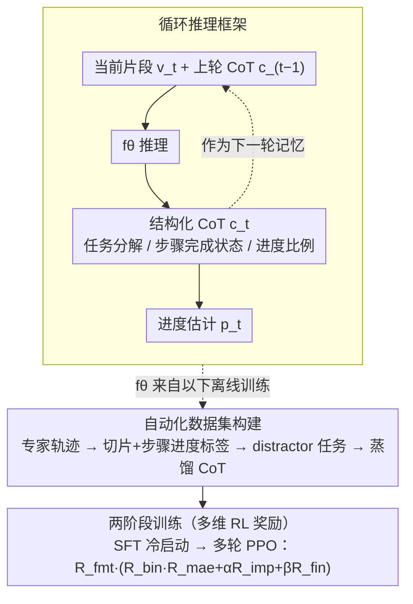

# Recurrent Reasoning with Vision-Language Models for Estimating Long-Horizon Embodied Task Progress

**会议**: CVPR 2026  
**arXiv**: [2603.17312](https://arxiv.org/abs/2603.17312)  
**代码**: [HuggingFace](https://huggingface.co/)  
**领域**:机器人
**关键词**: 任务进度估计, 具身智能, 循环推理, Chain-of-Thought, 强化学习

## 一句话总结
提出 R²VLM，通过循环推理框架逐步处理本地视频片段，维护动态更新的 CoT 记录任务分解和完成状态，结合多维 RL 奖励实现长时域具身任务进度估计的 SOTA，并支持策略学习、奖励建模、主动辅助等下游应用。

## 研究背景与动机
**领域现状**：具身智能体需要准确估计多步骤长时域任务的执行进度，以支持长程规划和上下文感知决策。

**现有痛点**：
   - GVL 和 ROVER 等方法仅利用 VLM 的视频理解能力和大上下文窗口，忽视了推理潜力
   - 长视频轨迹的处理计算开销巨大（动辄数千帧），不适合实时部署
   - 任务包含多个时间依赖的子任务，需要推理能力来对齐视觉观察与逻辑依赖

**核心矛盾**：全视频处理开销过大 vs 局部片段缺乏全局上下文；视频理解不足以处理复杂的时间逻辑依赖。

**本文目标**：高效、准确、可解释地估计长时域具身任务进度。

**切入角度**：像人类一样"看一段、想一下、记住关键信息"——循环处理视频片段并维护结构化记忆。

**核心idea**：循环推理 + 动态 CoT 作为跨时间步的记忆载体，避免处理全视频同时保持全局上下文。

## 方法详解

### 整体框架
R²VLM 要解决的是：给一段几千帧的长视频，准确说出"这个多步骤任务现在完成到百分之几"，但又不能把全视频一次性塞进 VLM（开销过大、实时性差）。它的做法是模仿人"看一段、想一下、记住关键信息"——把视频切成 4s/2s 的短片段，逐段循环推理，用一份不断改写的 CoT 当作跨片段传递的记忆。

每一轮，模型接收当前片段 $v_t$、任务描述 $\tau$ 和上一轮的 CoT $c_{t-1}$，输出更新后的 CoT $c_t$ 和进度估计 $p_t$：

$$c_t,\; p_t = f_\theta(\tau,\, v_t,\, c_{t-1})$$

这样每轮只看一小段画面，全局上下文则完全由 $c_{t-1}$ 承载，既省算力又不丢历史。要让 $f_\theta$ 真的学会按这套结构推理、且进度数值靠谱，论文还配了一条自动化数据集构建流程（把专家轨迹蒸馏成“片段+CoT”训练数据），并用两阶段训练（SFT 冷启动 + 多轮 PPO 强化）把模型打磨出来。整体数据流如下：

### 关键设计

**1. 循环推理框架：用逐段迭代替代全视频处理，靠 CoT 续传全局上下文**

针对"全视频开销大、局部片段又缺全局视野"这对矛盾，R²VLM 让推理沿时间轴一段一段往前滚。第一轮还没有历史，模型先用 VLM 自带的常识把任务拆成子步骤，生成初始 CoT $c_0$；之后每来一个新片段，模型就基于画面动态修订这份分解——发现实际执行和预想不符时可以合并、拆分或重排步骤，并刷新各步骤的完成状态。这样做的好处是三层叠加的：CoT 把"为什么判断进度是这个值"的推理链显式写出来，准确性和可解释性都更高；上一轮的 CoT 直接充当全局上下文，模型不必回看几千帧也知道任务走到哪了；而且每轮都继承前一轮的推理结论，逻辑不会在片段切换处断裂。

**2. 结构化 CoT：让记忆本身有固定格式，而不是一段自由文本**

CoT 之所以能当可靠的记忆载体，关键在于它有规定的三段结构：(i) 任务分解，列出当前认为的子任务序列；(ii) 关键步骤分析，标注每个子任务是已完成还是待完成；(iii) 进度估计，按"已完成步骤数 / 总步骤数"的比例算出 $p_t$。注意分解不是一锤定音的——具身环境往往只能部分观察，初始分解未必和真实执行对齐，所以每轮都允许改写。用步骤比例而非时间比例来定义进度，是因为长时域任务里不同步骤耗时差异极大，按步骤数更能反映任务的真实结构。

**3. 自动化数据集构建：把专家轨迹蒸馏成“片段+CoT”训练数据，并用 distractor 任务防作弊**

此前几乎没有“带 CoT 指导的进度估计”数据，于是作者搭了一条自动化流程，把 ALFRED（仿真）和 Ego4D（真实）的专家轨迹转成训练样本，分三步：其一，按 4s/2s 切成短片段、每段均匀采 4 帧，并按“已完成步骤数占比”给出进度标签（用步骤比例而非时间比例，更贴合长时域任务的真实结构）；其二，生成 distractor 任务（干扰任务）——直接让 VLM 编无关任务会因为没有可定义的进度而失败，作者改用受约束的提示，强制干扰任务的前 $n_r$ 步与原任务一致、之后才分叉，于是进度可由 $\min(n_r/n,\dots)$ 精确控制，逼模型真正基于任务逻辑推理而不是靠表面视觉线索抄近路；其三，蒸馏 CoT 训练数据——任务分解、关键步骤、进度这些信息在原数据集里本就以标注形式存在，直接喂给大模型整合即可批量产出高质量的结构化 CoT。最终构建出 ALFRED 11,499 条轨迹 / 124,821 组对话、Ego4D 13,965 条 / 127,694 组，人工复核保留率分别 93%、74%。

**4. 两阶段训练与多维 RL 奖励：先模仿格式、再用五维信号打磨数值与自我修正**

训练分两阶段：先用上面生成的“片段+CoT”数据做 SFT，让模型学会按结构化格式推理（cold start）；再以一个早期 SFT checkpoint 作冷启动，做多轮 PPO 强化学习。仅靠 SFT 模仿，模型学到的是“像那样写推理”，但不保证进度数值真的准、也不保证多轮之间越推越对。于是作者设计了一套乘加结合的奖励，对应五个层面：$R_{fmt}$ 检查 think/answer 标签格式是否合规（合格记 1）；$R_{bin}$ 看预测落在哪个步骤区间，正确记 1.0、相邻记 0.25，提供粗粒度对齐；$R_{mae}$ 用 $\max(1 - |p_t - p_t^{gt}|/\delta_1,\, 0)$ 施加细粒度的数值约束；$R_{imp}$ 奖励“本轮误差比上一轮更小”，直接度量循环推理的自我修正能力（归一化到不对称区间 $[-1, 0.8]$，放大误差变大时的惩罚）；$R_{fin}$ 则约束模型正确判断任务是否真的结束。五项按下式组合：

$$R_{overall} = R_{fmt} \cdot \left( R_{bin} \cdot R_{mae} + \alpha R_{imp} + \beta R_{fin} \right)$$

把 $R_{fmt}$ 放在最外层相乘，意味着格式不合规则整条奖励归零——先保证可解析，再谈准不准；而 $R_{bin}\cdot R_{mae}$ 相乘则保证只有粗粒度区间判对时才发放细粒度 MAE 奖励，提升训练稳定性。这里特意选 PPO 而非 GRPO：GRPO 要求从同一输入采样多个候选来算组内优势，但循环设置中每条轨迹的 $c_{t-1}$ 各不相同，根本凑不出“同输入”，所以只能用 PPO。

### 一个完整示例
以一条 ALFRED 的"把杯子放进微波炉加热"轨迹为例。第 0 轮模型还没看画面，先凭常识把任务拆成 4 步：①找杯子 ②拿起杯子 ③打开微波炉 ④放入并启动，初始 CoT 标记全部"待完成"，进度估计 $p_0 = 0\%$。第 1 个片段里机械臂走到桌边抓起杯子，模型把①②标为"已完成"，进度更新到 $2/4 = 50\%$。第 2 个片段画面里出现的是冰箱而非微波炉——模型据此动态修订分解，意识到智能体可能要先取别的物品，于是把第④步拆成"取物—放入—启动"，总步数从 4 调到 5，进度相应回算为 $2/5 = 40\%$。第 3 个片段微波炉门被打开，③完成，进度升到 $3/5 = 60\%$。整个过程模型从未回看前面的几千帧画面，全靠每轮改写的 CoT 记住"已经抓了杯子、分解被改成 5 步"——这正是循环推理"看一段、改记忆、报进度"的闭环。

## 实验关键数据

### 主实验

| 模型 | 大小 | ALFRED $p_{mae}$↓ | ALFRED $bin$↑ | Ego4D $p_{mae}$↓ | Ego4D $bin$↑ |
|------|------|:---------:|:---------:|:---------:|:---------:|
| GPT-5 | - | 18.35 | 0.505 | 25.04 | 0.259 |
| Gemini-2.5-Pro | - | 16.27 | 0.481 | 28.22 | 0.217 |
| Qwen2.5-VL-72B | 72B | 24.88 | 0.342 | 26.88 | 0.254 |
| **R²VLM (SFT+RL)** | **7B** | **6.34** | **0.758** | **11.88** | **0.526** |

### 消融实验

| 配置 | ALFRED $p_{mae}$↓ | 说明 |
|------|:---------:|------|
| SFT only | 7.52 | 基础监督微调 |
| + RL (w/o $R_{imp}$) | 6.89 | 缺少跨轮次改进信号 |
| + RL (w/o $R_{bin}$) | 7.11 | 缺少粗粒度步骤约束 |
| **Full R²VLM** | **6.34** | 所有奖励组合最优 |

### 关键发现
- 7B 的 R²VLM 全面超越 GPT-5 和 Gemini-2.5-Pro，MAE 降低 65%+
- Improvement Reward 对多轮推理贡献显著，体现了循环推理中自我修正的价值
- 在进度增强策略学习、奖励建模、主动辅助三个下游任务中均展现强泛化
- 循环推理避免处理全视频，推理速度远快于全局方法

## 亮点与洞察
- **循环推理 + CoT 作为记忆**：将 CoT 从一次性推理工具扩展为跨时间步的结构化记忆载体，既保持全局一致性又避免长视频计算，可以迁移到任何需要长时间跨度推理的 VLM 任务
- **Improvement Reward 设计**：奖励跨轮次的误差减少，直接度量模型的自我修正能力，这是多轮推理场景下的独特设计
- **自动化数据生成管线**：将 ALFRED/Ego4D 的专家轨迹自动转化为视频片段+CoT 训练数据，包括 distractor 任务描述的生成策略
- **多下游应用验证**：不仅做进度估计，还展示了作为 RL 奖励模型和主动辅助系统的价值

## 局限与展望
- CoT 的步骤分解质量严重依赖 VLM 的常识推理能力，复杂新任务可能分解不准确
- ALFRED 是仿真环境，真实世界（Ego4D）的性能仍有较大差距
- 每个片段固定长度（4s/2s），未考虑动态调整片段粒度
- 仅基于 Qwen2.5-VL-7B，在更大/更强模型上的效果未验证

## 相关工作与启发
- **vs GVL / ROVER**：它们依赖 VLM 的 ICL 和大上下文窗口，不做推理，性能在复杂长时域任务上受限。R²VLM 通过循环推理和 RL 显著提升
- **vs 分层奖励方法**：传统方法需要手动设计任务层次分解，R²VLM 通过训练自动习得分解和推理策略

## 补充分析
- 进度定义基于步骤比例而非时间比例，更好地反映长时域任务结构，因为不同步骤耗时差异很大
- Distractor 任务的生成策略很巧妙：强制前 $n_r$ 步与原任务一致但后续步骤不同，使得进度可以精确控制
- 人工审核的 benchmark 保留率 ALFRED 93%、Ego4D 74%，说明自动生成的数据质量较高
- 选择 PPO 而非 GRPO 的原因是技术性的：GRPO 需要从同一输入生成多个候选，但循环设置中每条轨迹的 $c_{t-1}$ 不同
- Improvement Reward 的不对称范围 [-1, 0.8] 放大了误差增加的惩罚，鼓励保守但稳定的进度估计

## 评分
- 新颖性: ⭐⭐⭐⭐ 循环推理+CoT记忆的框架设计巧妙
- 实验充分度: ⭐⭐⭐⭐⭐ 两个数据集四个指标三个下游应用
- 写作质量: ⭐⭐⭐⭐ 结构清晰，方法描述详尽
- 价值: ⭐⭐⭐⭐⭐ 对具身AI的进度估计和奖励建模具有重要意义

<!-- RELATED:START -->

## 相关论文

- [\[CVPR 2026\] PALM: Progress-Aware Policy Learning via Affordance Reasoning for Long-Horizon Robotic Manipulation](palm_progress-aware_policy_learning_via_affordance_reasoning_for_long-horizon_ro.md)
- [\[CVPR 2026\] RoboAgent: Chaining Basic Capabilities for Embodied Task Planning](roboagent_chaining_basic_capabilities_for_embodied_task_planning.md)
- [\[CVPR 2026\] QuantVLA: Scale-Calibrated Post-Training Quantization for Vision-Language-Action Models](quantvla_scale-calibrated_post-training_quantization_for_vision-language-action_.md)
- [\[CVPR 2026\] ProFocus: Proactive Perception and Focused Reasoning in Vision-and-Language Navigation](profocus_proactive_perception_and_focused_reasoning_in_vision-and-language_navig.md)
- [\[CVPR 2026\] SaPaVe: Towards Active Perception and Manipulation in Vision-Language-Action Models for Robotics](sapave_active_perception_manipulation_vla_roboti.md)

<!-- RELATED:END -->
