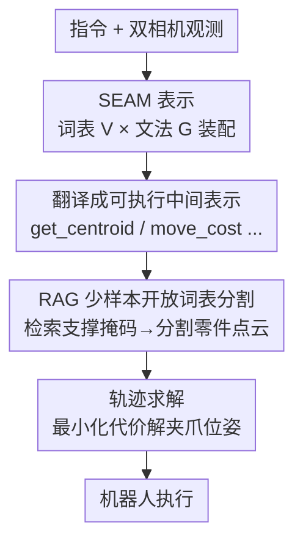

# Rethinking Intermediate Representation for VLM-based Robot Manipulation

**会议**: CVPR 2026  
**论文**: [CVF Open Access](https://openaccess.thecvf.com/content/CVPR2026/html/Tang_Rethinking_Intermediate_Representation_for_VLM-based_Robot_Manipulation_CVPR_2026_paper.html)  
**代码**: 无  
**领域**: 机器人 / 具身智能  
**关键词**: VLM 机器人操作, 中间表示, 上下文无关文法, 开放词表分割, RAG

## 一句话总结
针对"VLM 把人类指令翻译成可执行中间表示"这件事，本文借鉴上下文无关文法把中间表示拆成**词表 + 文法**，设计出既好让 VLM 理解、又能泛化到未见任务的 SEAM 表示，并配一套 RAG 少样本开放词表零件分割，真实机器人成功率比此前 SOTA 高约 15%。

## 研究背景与动机
**领域现状**：用 VLM 做机器人操作有两条主路线。一条是 VLA（端到端微调 VLM 直接吐动作），但要海量带动作标注的数据；另一条是 VLM-only——让 VLM 把人类指令 $L$ 和视觉输入 $I$ 翻译成一个**中间表示** $R=\text{VLM}(L,I)$，再丢给求解器解出夹爪位姿。本文聚焦后者，核心争论点就是：这个中间表示到底该长什么样。

**现有痛点**：中间表示在两类设计间反复横跳。**高层表示**（如 Instruct2Act 那种预定义技能词 `grasp_edge / move_above / put`）VLM 一看就懂，但太僵硬——换个新任务"用刀切胡萝卜"就得人工塞进 `grasp_center / cut / move_perpendicular` 等新词，扩展全靠堆人工。**低层表示**（如 ReKep / OmniManip 用 keypoint、axis 这类原语）泛化性好，但 VLM 要现写一大堆显式约束/代价的代码，又长又脆，经常生成错。

**核心矛盾**：中间表示在 **VLM 可理解性（VLM-comprehensibility）** 与 **动作可泛化性（action-generalizability）** 之间存在 trade-off——越接近自然语言越好懂但越不通用，越接近底层几何越通用但越难让 VLM 正确生成。作者用实验把这个 trade-off 量化了出来。

**切入角度与核心 idea**：作者从**上下文无关文法（CFG）**得到启发——一门语言无非是"有限的词 + 有限的递归产生式"就能组合出无限句子。于是把中间表示 $\tilde R=(V,G)$ 分解为**语义词表 $V$**（一小撮语义丰富的操作）和**组合文法 $G$**（约束这些词怎么拼），让 VLM 把"写代码"变成"按语法拼装语义积木"。一句话：**用一套小而精的语义词表 + 类型化文法，把代码生成降级成语义装配，同时拿下好懂和好泛化。**

## 方法详解

### 整体框架
给定当前观测和任务指令，pipeline 是：① VLM 在 SEAM 的词表 $V$ 和文法 $G$ 约束下，把指令**装配**成一段中间表示（例如 `move_cost(get_centroid('teapot lid'), get_centroid('teapot opening'), [0,0,0.05])`）；② 这段表示里点名了要操作的细粒度零件（"teapot lid""teapot opening"），用 **RAG 数据库**检索出对应的支撑图像/掩码，再用少样本分割网络把当前场景里的这些零件分割出来；③ 把分割得到的点云代入 SEAM 表示（它本身是 Python 可执行的、算出一个数值代价），通过优化求解夹爪的目标旋转平移，得到机器人轨迹去执行。整条链路把"语言理解→几何定位→动作求解"三段解耦，VLM 只负责它擅长的语义装配，几何精度交给分割 + 优化。

### 关键设计

**1. SEAM：把中间表示拆成语义词表 + 类型化文法**

这是直接对着上面那个 trade-off 开的刀。作者类比 CFG 的 4 元组 $(V,\Sigma,R,S)$，把中间表示重写成 $\tilde R=(V,G)$：词表 $V$ 是一组**语义自洽、贴近人话**的操作（如 `get_axis`、`get_centroid`、`get_height`、`move_cost`、`parallel_cost`、`perpendicular_cost`、`rotate_cost`、`orbit_cost`、`gripper_close/open`），文法 $G$ 是一套**带类型系统**的产生式（如 `object→pt`、`object→vec`、`pt,pt→cost`、`vec,vec→cost`、`cost→cost+cost`、`pt→pt±pt`）。要"切胡萝卜"时，VLM 不再现编代码，而是拼出 `perpendicular_cost(get_axis("carrot"), get_axis("knife blade")) + move_cost(get_centroid("knife"), get_centroid("knife blade"), offset=[0,0,0.1])`。

它为什么能同时拿下两端？词表每个词都落在 VLM 的语义空间里、且把底层实现（比如 `get_axis` 内部其实是 PCA 求主轴）抽象掉只暴露必要参数——这保证了**可理解性**；而文法的类型约束让一小撮正交、最小化的词能合法组合出大量未见动作——这保证了**可泛化性**。作者明确列了 VLM-Readability / Proper Abstraction / Conciseness / Reliability / Proper Minimalism / Composability 六条设计原则来支撑这一点。和 ReKep 那种"让 VLM 自己写 VPython 算约束"相比，SEAM 把容易出错的几何计算固化进词表内部，VLM 只做语义层的装配，错误率自然降下来。

**2. RAG-based 少样本开放词表零件分割：把"teapot opening"这种词真正定位到像素**

光有 `get_centroid('teapot opening')` 这样的词没用，得真的在图像里分割出"茶壶口"这种细粒度零件。现有开放词表分割在这件事上集体翻车——OV-Seg、Grounded SAM2 倾向于分割整个物体而非可交互零件，LISA 连铰链/开口/可供性都分不准。作者的做法是建一个数据库 $D=\{(K_i,P_i)\}_{i=1}^N$：$K_i$ 是描述某零件的一组关键短语（"cup opening" 可对应 {cup opening, cup rim, cup edge}），$P_i=\{(I_j^S,M_j^S)\}$ 是若干支撑图像及其零件二值掩码。推理时给定查询图像 $I^Q$ 和语言描述 desc，用 **Levenshtein 编辑距离**（对轻微措辞不一致鲁棒）把 desc 匹配到编辑距离最小的关键短语，检索出对应支撑对；再用一个少样本分割网络当 Mapper，按支撑特征与查询特征的注意力相似度，把支撑掩码 $M^S$ 映射成查询掩码 $M^Q$。好处是无需为每个新零件重训，靠检索 + 少样本即可定位任意零件，而且实测推理只要 0.6 秒，是所有对比方法里最快的。

**3. 基于代价最小化的轨迹求解：把语义表示落成 SO(3) 位姿**

SEAM 表示是 Python 可执行的，跑出来是一个**数值代价**，衡量点云 $P$ 与表示的匹配程度。求解时先区分哪些零件随夹爪运动（记为 $P^m$）、哪些静止（$P^s$）。由于夹爪与抓取物刚性相连、共享同一变换，求解目标旋转 $R\in SO(3)$ 与平移 $t\in\mathbb{R}^3$ 就归约为一个优化问题：

$$\min_{R,t}\ \text{cost}\!\left(P^s\cup\big(RR_0^{-1}(P^m-t_0)+t\big)\right)+\alpha\|t-t_0\|^2+\beta\|\text{euler}(RR_0^{-1})\|_1$$

其中 $R_0,t_0$ 是夹爪初始位姿，后两项是正则项（权重 $\alpha,\beta$），鼓励夹爪以最小平移和旋转完成动作。这一步把"语义装配的中间表示"真正变成可执行的连续动作，且因为代价直接由词表语义定义，求解器不需要任务专属的手写约束。

## 实验关键数据

硬件是 UR5 + 夹爪，双 Intel RealSense D435 相机对向布置（两视图拼接后让 Qwen-VL 选最无遮挡的物体做分割）；VLM 用 Qwen3-VL-30B-A22B 部署在 A100，分割用 Swin-B 特征 + 预训练 matcher。

### 主实验：真实机器人 8 任务成功率
对比 VoxPoser / CoPa / ReKep / OmniManip，每任务 10 次试验、随机化物体初始位姿，区分闭环/开环（⚠️ 表格列对齐以原文为准，部分单元缺失）。

| 设置 | VoxPoser | CoPa | ReKep | OmniManip | SEAM (ours) |
|------|----------|------|-------|-----------|-------------|
| 总成功率（闭环） | 18.6% | 28.8% | — | 68.8% | **83.8%** |
| 总成功率（开环） | — | — | — | 52.5% | **63.8%** |

逐任务上，SEAM 在"装笔入笔筒""盖茶壶盖""按红色按钮""开罐"等需要精确对齐的任务上明显领先（如按按钮闭环 10/10、开罐 8/10）。整体闭环成功率比最强基线 OmniManip 高约 **15 个百分点**。

### 效率对比 & 可泛化性/可理解性量化
| 分割推理耗时 | LISA | OV-Seg | Grounded SAM | SEAM (ours) |
|------|------|--------|--------------|-------------|
| Time (sec) | 0.9 | 10.2 | 0.88 | **0.6** |

作者还提出两个新指标量化中间表示本身的好坏：动作可泛化性 $\text{AG}=1-\frac{|V|}{T}$（$|V|$ 是翻译所有指令所需的唯一词表操作数，$T$ 是任务总数，越少越泛化）；VLM 可理解性 $\text{VC}=\frac{N_{\text{succ}}}{T}$（VLM 能正确生成表示的任务比例）。在随机生成的 33 个操作任务上，用 Qwen3-VL 生成表示、DeepSeek 评判是否合理可解。结论：高层方法（Instruct2Act）VC 高但 AG 低，低层方法（ReKep/OmniManip）AG 高但 VC 低，二者存在明确 trade-off，而 **SEAM 在两个指标上同时取得平衡**。

### 关键发现
- 两大组件分工清晰：SEAM 表示负责"VLM 能不能正确生成"，RAG 分割负责"零件能不能精确定位"。在"盖茶壶盖"这类对齐敏感任务上，准确分割到茶壶口的边缘是成功关键——其他方法只能定位到茶壶中心或内部点，导致盖子怼歪或砸进壶里。
- 效率是隐藏亮点：SEAM 的分割 0.6 秒，比 OV-Seg（10.2 秒）快一个数量级，说明 RAG 少样本路线不仅准还省时。
- trade-off 被量化是本文方法论上的贡献：第一次用 AG / VC 两个可计算指标把"中间表示设计"这件主观的事摆上台面。

## 亮点与洞察
- **把 CFG 搬进机器人中间表示**：用"词表 + 文法"的语言学视角统一了高层/低层表示之争，是个很干净的抽象——既解释了为什么旧方法各有短板，也给出了"小词表 + 类型文法"这个可落地的折中。这个思路可迁移到任何"让 LLM 生成结构化可执行表示"的场景（如工具调用、API 编排）。
- **类型系统当护栏**：文法里的 `pt,pt→cost` 这类类型约束，本质是给 VLM 的生成空间套了个编译期检查，逼它只产合法组合，比纯 prompt 提示更可靠。
- **RAG 少样本分割兼顾准与快**：用编辑距离做检索 + Mapper 做少样本映射，避开了为新零件重训，0.6 秒延迟在真实机器人闭环里很实用。

## 局限与展望
- 作者承认两类失败：一是 VLM 自身空间理解有限，会生成错误方向；二是感知不足，遮挡或关键零件没被相机拍清会导致点云有缺陷。
- 词表 $V$ 和文法 $G$ 仍是人工设计的——虽然比手工塞技能词省事，但面对全新动作类型（如需要力反馈/触觉的精细操作）时词表是否够用存疑，论文实验也声明在"单臂、无触觉、无力反馈"设定下进行。
- 量化指标里 VC 由 DeepSeek 自动评判任务是否"可合理完成"，这种 LLM-as-judge 评估的可靠性 ⚠️ 以原文及附录细节为准；AG 仅看唯一操作数，未必完全反映真实泛化难度。
- ⚠️ 评测任务描述中"六个刚体任务 + 六个关节机构任务"与"八个任务"的表述存在出入，具体任务集以原文为准。

## 相关工作与启发
- **vs ReKep**：ReKep 用关键点 + 多级优化把指令翻成动作，泛化好但要 VLM 现写 VPython 显式算约束，长而脆；SEAM 把几何计算固化进词表内部，VLM 只做语义装配，生成更稳，对齐类任务成功率更高。
- **vs OmniManip**：OmniManip 用 axis/keypoint 原语构造空间约束，同样偏低层、要 VLM 选对轴并拼对表示；SEAM 用 `get_axis` 等语义词抽象掉方向对齐的复杂度，闭环总成功率高约 15 个百分点。
- **vs Instruct2Act（高层 API）**：它靠预定义动作 API，VLM 好懂但词表僵硬、换任务要加新词；SEAM 用小而正交的词表 + 文法，可理解性相当但动作可泛化性高得多。

## 评分
- 新颖性: ⭐⭐⭐⭐⭐ 用上下文无关文法重构机器人中间表示，并首次用 AG/VC 两指标量化"可泛化↔可理解"trade-off，视角很新。
- 实验充分度: ⭐⭐⭐⭐ 真机 8 任务 + 效率 + 表示质量量化都有，但任务规模偏小、部分表格描述有出入。
- 写作质量: ⭐⭐⭐⭐ 动机与抽象讲得清楚，图示对比直观；个别实验设置表述不够一致。
- 价值: ⭐⭐⭐⭐⭐ "结构化语义装配 + 类型文法护栏"对所有让 LLM/VLM 生成可执行表示的任务都有借鉴意义。

<!-- RELATED:START -->

## 相关论文

- [\[ICLR 2026\] RoboInter: A Holistic Intermediate Representation Suite Towards Robotic Manipulation](../../ICLR2026/robotics/robointer_a_holistic_intermediate_representation_suite_towards_robotic_manipulat.md)
- [\[CVPR 2026\] StaMo: Unsupervised Learning of Generalizable Robot Motion from Compact State Representation](stamo_unsupervised_learning_of_generalizable_robot_motion_from_compact_state_rep.md)
- [\[CVPR 2026\] Rethinking Camera Choice: An Empirical Study on Fisheye Camera Properties in Robotic Manipulation](rethinking_camera_choice_an_empirical_study_on_fisheye_camera_properties_in_robo.md)
- [\[CVPR 2026\] Rethinking Visual Rearrangement from A Diffusion Perspective](rethinking_visual_rearrangement_from_a_diffusion_perspective.md)
- [\[CVPR 2026\] Language-Grounded Decoupled Action Representation for Robotic Manipulation (LaDA)](lada_robotic_manipulation.md)

<!-- RELATED:END -->
