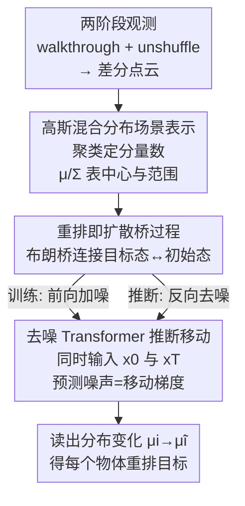

# Rethinking Visual Rearrangement from A Diffusion Perspective

**会议**: CVPR 2026  
**论文**: [CVF Open Access](https://openaccess.thecvf.com/content/CVPR2026/html/Qi_Rethinking_Visual_Rearrangement_from_A_Diffusion_Perspective_CVPR_2026_paper.html)  
**代码**: 无  
**领域**: 机器人 / 具身智能  
**关键词**: 视觉重排, 扩散桥, 高斯混合分布, 具身智能, 去噪Transformer

## 一句话总结
把"把被打乱的房间恢复原样"这一具身重排任务重新理解成一个扩散桥过程——打乱是前向扩散、复原是反向去噪——并用高斯混合分布表示物体状态、用去噪 Transformer 逐步推断每个物体该往哪挪，在 RoomR 上把成功率从 14.2% 提到 17.8%。

## 研究背景与动机
**领域现状**：视觉重排（visual rearrangement）是具身智能里最难的任务之一：agent 先在"目标态"房间里探索记忆布局（walkthrough 阶段），然后房间被随机打乱若干物体，agent 再被放回去把房间恢复成原样（unshuffle 阶段）。现有做法分两类——端到端强化学习用参数化策略去记忆环境状态；模块化方法把任务拆成感知 + 规划，显式建模并比较"初始态"和"目标态"两套场景表示，再从两者之差直接推断要挪哪些物体、挪到哪。

**现有痛点**：无论哪一类，本质都是"把初始态和目标态当成两个孤立的数据分布，建立某种表示后做差分比较，然后一步到位推出重排目标"。这有两个硬伤：一是高度依赖精确感知，对输入噪声很敏感，点云稍微脏一点结论就偏；二是初始态和目标态之间往往隔得很远，直接做差分相当于在两个分布之间"找最短路径"，推断跨度太大，结果的准确性和最优性都难保证。

**核心矛盾**：这些方法只盯着两个端点状态本身，完全没有去挖掘"从目标态是怎么一步步变成初始态的"这个演化过程。而重排任务的目标其实不是把物体精确放回原坐标，而是在"位置精度"和"任务完成度"之间取平衡——可接受的目标态本身是一个集合 $S^* = S_1^* \times \dots \times S_n^*$（由 3D 包围盒 IOU 阈值界定），用单点坐标去逼近反而会把推断空间放大或缩小到不合适的范围。

**切入角度**：作者从非平衡态热力学的扩散过程找灵感。如果把物体分布的香农熵当作场景"混乱度"的度量，那么房间被打乱（熵增）和 agent 复原（熵减）恰好对应分子在浓度差驱动下扩散、以及它的逆过程；进一步，把随机打乱和复原看成一个马尔可夫随机过程的前向与反向，房间状态可由朗之万方程这类随机微分方程描述，可以证明物体分布概率与信息熵的变化满足扩散方程。换句话说——房间状态的变化天然就能建模成扩散过程。

**核心 idea**：用扩散桥（diffusion bridge）替代差分比较来求解重排——把打乱当前向扩散、复原当反向去噪，在高斯混合分布的隐空间里用去噪 Transformer 一步步、高置信地推断每个物体的移动趋势，而不是一步到位地比较两个孤立状态。

## 方法详解

### 整体框架
方法叫 Diffusion Rearrangement，是一个模块化方案，输入是房间的目标态与初始态配置，输出是每个待重排物体的状态变化（要往哪挪）。整条流水线分三段串起来：先在 walkthrough 和 unshuffle 两阶段沿相同轨迹采集 egocentric 深度观测、构建全局点云，抽取两套点云中"被移动/凸出"的部分得到差分点云；把差分点云聚类后拟合成高斯混合分布（GMM），用每个高斯分量的均值和协方差表示一个物体的中心坐标与位置范围；然后把这套分布丢进一个布朗桥扩散模型——训练时走前向加噪、推断时走反向去噪，用去噪 Transformer 迭代地预测噪声（等价于物体移动的方向梯度），逐步把初始态分布推回目标态分布；最后从分布参数的变化 $\mu_i \to \tilde\mu_i$ 读出每个物体的实际位移作为重排目标。

### 关键设计

**1. 把重排重定义为布朗桥扩散过程：让推断沿演化轨迹逐步走，而不是两端硬比对**

针对"差分比较跨度太大、置信度低"的痛点，作者不再把目标态和初始态当两个孤立分布去找最短路径，而是用一条扩散桥把它们连起来：把随机打乱看成前向扩散过程、把复原看成反向去噪过程。关键区别在于，生成式扩散模型（如 DDPM）的一端是纯高斯噪声、中间态是无意义的噪声图像；而这里的任务专用扩散桥连接的是两个**有意义的结构化状态**——目标态 $x_0$ 和初始态 $x_T$，中间任何一个被 agent 单步动作分割出来的状态都是一个合法的房间配置。形式上用布朗桥刻画给定两端时刻 $t$ 的分布：

$$p\left(x_t \mid x_0, x_T\right)=\mathcal{N}\left(\left(1-\tfrac{t}{T}\right) x_0+\tfrac{t}{T} x_T,\ \tfrac{t(T-t)}{T} I\right)$$

它在 $t=0$ 锁定在目标态、$t=T$ 锁定在初始态，前向转移核 $q(x_t\mid x_0,x_T)=\mathcal{N}(x_t;(1-m_t)x_0+m_t x_T,\ \delta_t I)$，其中 $m_t=t/T$、$\delta_t=2s(m_t-m_t^2)$。这样做有效是因为：每一步去噪只需推断一小段局部变化、置信度高，把许多高置信小步累加起来逼近整体大变化，类似模拟梯度下降——任务越复杂、跨度越大，这种"分步逼近"相比"一步差分"越有优势。

**2. 用高斯混合分布表示场景状态：贴合"可接受目标是一个集合"的任务本质**

针对"用精确坐标做差分对噪声敏感、且与任务定义不符"的痛点，作者把房间状态 $x_t=[x_t^1,\dots,x_t^n]$ 用物体中心坐标的高斯混合模型来表示：$p(x_t)=\sum_{i=1}^n \pi_i\,\mathcal{N}(x_t\mid\mu_i,\Sigma_i)$，每个分量对应一个物体，均值 $\mu_i$ 是中心点、协方差 $\Sigma_i$ 描述可接受的位置范围。选 GMM 有三个理由：高斯混合与单个高斯相乘仍是高斯混合（便于推导桥过程中任意时刻分布仍保持 GMM 形式）；每个分量天然对应一个物体的中心与空间范围；参数化方便且对噪声鲁棒。由于房间里通常只有少数物体被移动，未移动物体可设 $\pi_i=0$ 而忽略，于是只需对差分点云（walkthrough 与 unshuffle 全局点云的移动/凸出部分）做聚类确定分量数、再拟合出 $x_0\sim\mathrm{GMM}(p_w)$ 和 $x_T\sim\mathrm{GMM}(p_u)$。这样把推断空间约束到"可接受状态"附近，既不像场景图方法那样把目标放大到整张桌子、也不像实例匹配方法那样把目标缩得过窄。

**3. 同时喂入两端状态的去噪 Transformer：免匹配地推断每个物体的移动**

针对"模块化方法要显式做物体匹配、易错且割裂"的痛点，作者用一个 encoder-only Transformer 当去噪网络：GMM 参数经 2 层 MLP 编码进 512 维隐空间作为 token，时间步 $t$ 用正弦位置编码注入，自注意力在不同物体分布之间建立内在联系，输出端 MLP 解码出 GMM 参数的变化。由于 Transformer 处理序列时输入输出物体直接一一对应，**根本不需要额外的匹配算法**。训练目标由 ELBO 简化为估计 $x_t-x_0$（等价于最小化当前态到目标态的距离）：

$$\mathcal{L}_{rearrange}=\left\| x_t - x_0 - \epsilon_\theta(x_t,t)\right\|^2$$

一个关键的任务特化点：标准 BBDM 作为生成模型在推断时拿不到生成目标 $x_0$，但重排任务里 $x_0$（目标态观测）和 $x_T$（初始态观测）**都是已知输入**，因此采样被改写成 $x^*_{t-1}=\mu_\theta(x^*_t,x_0,x_T,t)+\sqrt{\tilde\delta_t}\,\epsilon$，把目标态观测显式带进反向过程，让每步去噪都被两端真实观测约束，从而推断出实际目标态 $x^*_0$。这正是它比纯生成式扩散在"有约束的状态间演化"上更可靠的原因。

### 损失函数 / 训练策略
训练时对每个任务先用探索策略在两阶段采集点云与位姿，拟合出配对的 $x_0,x_T$；随机采时间步 $t\sim\mathrm{Uniform}(1,\dots,T)$ 与噪声 $\epsilon\sim\mathcal{N}(0,I)$，前向得 $x_t=(1-m_t)x_0+m_t x_T+\sqrt{\delta_t}\epsilon$，再对上面的重排损失做梯度下降。为增强鲁棒性，输入点云会加入轻微高斯扰动。优化器 Adam（lr=0.001，$\beta_1$=0.9，$\beta_2$=0.999），batch 64，Transformer 6 层 8 头、512 维，在单张 A40 上训 25,000 步；推断用 DDIM 加速采样，步数 $S=200$ 以平衡质量与效率。

## 实验关键数据

### 主实验
在 AI2-THOR 模拟器上的 RoomR 数据集（80 房间/4000 训练任务，验证与测试各 20 房间/1000 任务，每任务移动 1~5 个物体）评测，四个指标：Suc（最严格，所有物体全部归位才算成功）、FS（Fixed Strict，物体级成功率，有任何不该动的物体被挪到则为 0）、Mis（末态错位物体数 / 初始错位物体数，可 >1）、E（Energy Remaining，剩余能量比例）。

| 数据集 | 方法 | Suc(%)↑ | FS(%)↑ | Mis↓ | E↓ |
|--------|------|---------|--------|------|-----|
| RoomR | MaSS | 4.7 | 16.5 | 1.018 | 1.016 |
| RoomR | TIDEE | 11.7 | 28.9 | 0.734 | 0.715 |
| RoomR | CAVR (SOTA) | 14.2 | 33.1 | 0.707 | 0.714 |
| RoomR | **Ours** | **17.8** | **38.8** | **0.641** | **0.643** |
| ProcTHOR | CAVR (SOTA) | 4.9 | 17.0 | 0.849 | 0.851 |
| ProcTHOR | **Ours** | **8.4** | **24.7** | **0.806** | **0.814** |

相比此前 SOTA 的点云匹配方法 CAVR，本文在 RoomR 上成功率 +3.6%、FS +5.7%，四项指标全面领先；在作者自建的多房间 ProcTHOR 数据集（8000 场景）上同样全面领先，验证了泛化性。

### 消融实验
| 配置 | Suc(%)↑ | FS(%)↑ | Mis↓ | E↓ | 说明 |
|------|---------|--------|------|-----|------|
| Direct 匹配 + 分布表示 | 6.5 | 19.4 | 0.837 | 0.860 | 直接按 GMM 权重匹配 |
| Kuhn-Munkres 匹配 + 分布表示 | 12.8 | 29.7 | 0.730 | 0.732 | 二部图匹配替代去噪模型 |
| 去噪模型 + coordinate 表示 | 16.7 | 37.1 | 0.664 | 0.669 | 只用中心坐标 |
| 去噪模型 + feature 表示 | 17.2 | 37.9 | 0.652 | 0.658 | 用 PointNet++ 几何特征 |
| **去噪模型 + 分布表示 (Full)** | **17.8** | **38.8** | **0.641** | **0.643** | 完整模型 |

另有采样步数实验（验证集）：步数 <200 时各指标随步数快速提升，200 步达到最优（Suc 17.9 / FS 38.1），超过 200 反而三项指标轻微下降——说明并非步数越多越好。鲁棒性方面，对深度输入加 $\sigma=0.01$ 米高斯噪声后，Suc 仅从 17.8 降到 17.5、FS 从 38.8 降到 38.3，分布表示带来了一定抗噪能力。

### 关键发现
- **去噪模型是最大贡献来源**：把去噪 Transformer 换成 Kuhn-Munkres 二部图匹配，Suc 从 17.8 直接掉到 12.8、Direct 匹配更是只有 6.5——因为基于嵌入余弦相似度的匹配无法捕捉物体间关系、更无法推理物体变化的"过程"。
- **分布表示优于坐标/特征**：纯坐标只携带位置信息、纯 PointNet++ 特征只携带外观信息，都不如 GMM 分布（同时编码中心 + 范围），FS 分别为 37.1 和 37.9，低于完整模型 38.8。
- **采样步数存在甜点**：200 步最优，过多反而退化，说明扩散桥在该任务上不需要超长去噪链。

## 亮点与洞察
- **跨学科的重定义最为出彩**：把房间打乱/复原类比成分子扩散的前向/反向、用香农熵增减解释任务，进而论证状态变化满足扩散方程——这个从非平衡态热力学借来的视角，是把"差分比较"换成"过程建模"的思想根。
- **任务专用扩散桥而非生成式扩散**：两端都是有意义的结构化状态（而非高斯噪声），且推断时把目标态观测 $x_0$ 显式带进反向采样，让每步去噪都受真实观测约束——这是它区别于普通 BBDM 的关键 trick，可迁移到任何"两个已知状态之间做可解释演化"的任务（如轨迹补全、状态插值）。
- **用 GMM 表示"可接受集合"而非单点**：把目标建模成分布，天然吻合"重排不要求精确归位、只要落在 IOU 阈值内"的任务定义，避免推断空间过大或过小——这个表示选择本身就是对任务目标的深刻理解。

## 局限与展望
- **依赖差分点云质量**：方法建立在从点云拟合的 GMM 之上，作者自己也承认点云质量会显著影响整体表现，深度传感器噪声虽被部分吸收但仍是瓶颈，未来工作要提升鲁棒性与泛化。
- **绝对成功率仍偏低**：RoomR 上 Suc 仅 17.8%、ProcTHOR 仅 8.4%，说明视觉重排整体远未解决，本文是相对提升而非任务攻克；多房间场景退化明显。
- **探索策略与重排解耦**：训练前需要 agent 先用一个独立探索策略采集两阶段点云，探索质量直接决定输入好坏，但这部分并非本文优化重点，端到端联合优化是潜在改进方向。
- **GMM 分量数依赖聚类**：待重排物体数未知时靠聚类先定分量数，聚类失误会直接传导到后续所有推断，缺乏对该环节误差的鲁棒处理。

## 相关工作与启发
- **vs CAVR（点云匹配，前 SOTA）**: 同样用差分点云作输入，但 CAVR 用匹配算法直接比较初始态与目标态的物体并推断变化；本文改成在 GMM 分布隐空间里用扩散桥逐步去噪推断演化过程，免匹配且对噪声更鲁棒，四项指标全面超越。
- **vs TIDEE（场景理解/2D 占据图）**: TIDEE 维护 2D 占据图与物体标签、靠场景图推断空间关系变化，提供的是粗粒度目标（容易把目标放大到整张桌子）；本文用分布表示把推断空间约束到可接受状态附近，FS 与 E 指标大幅领先。
- **vs MaSS（实例搜索策略）**: MaSS 用基于搜索的策略，本文用分布表示 + 去噪推理，在所有指标上显著超出（RoomR 上 Suc 17.8 vs 4.7）。
- **vs 生成式扩散（DDPM/BBDM）**: 生成式扩散一端是纯高斯噪声、中间态无意义；本文的任务专用扩散桥连接两个有意义的结构化状态，并把目标态观测显式注入反向过程，实现受约束的可解释演化。

## 评分
- 新颖性: ⭐⭐⭐⭐⭐ 用非平衡态热力学/扩散桥重新定义视觉重排，把差分比较换成过程建模，视角新且自洽。
- 实验充分度: ⭐⭐⭐⭐ RoomR + 自建 ProcTHOR 两数据集、匹配/表示/步数/抗噪多组消融到位，但绝对成功率偏低、缺更大规模真机验证。
- 写作质量: ⭐⭐⭐⭐ 动机推导（熵→扩散方程→桥过程）清晰，公式完整；部分符号偏密集，需对照才好读。
- 价值: ⭐⭐⭐⭐ 为具身重排提供了可迁移的"两已知状态间扩散桥演化"范式，对轨迹/状态推断类任务有启发，但当前性能离落地尚远。

<!-- RELATED:START -->

## 相关论文

- [\[CVPR 2026\] Rethinking Intermediate Representation for VLM-based Robot Manipulation](rethinking_intermediate_representation_for_vlm-based_robot_manipulation.md)
- [\[CVPR 2026\] GraspLDP: Towards Generalizable Grasping Policy via Latent Diffusion](graspldp_towards_generalizable_grasping_policy_via_latent_diffusion.md)
- [\[CVPR 2026\] GraspGen-X: Cross-Embodiment 6-DOF Diffusion-based Grasping](graspgen-x_cross-embodiment_6-dof_diffusion-based_grasping.md)
- [\[CVPR 2026\] Semantic Audio-Visual Navigation in Continuous Environments](semantic_audio-visual_navigation_in_continuous_environments.md)
- [\[CVPR 2026\] Rethinking Camera Choice: An Empirical Study on Fisheye Camera Properties in Robotic Manipulation](rethinking_camera_choice_an_empirical_study_on_fisheye_camera_properties_in_robo.md)

<!-- RELATED:END -->
