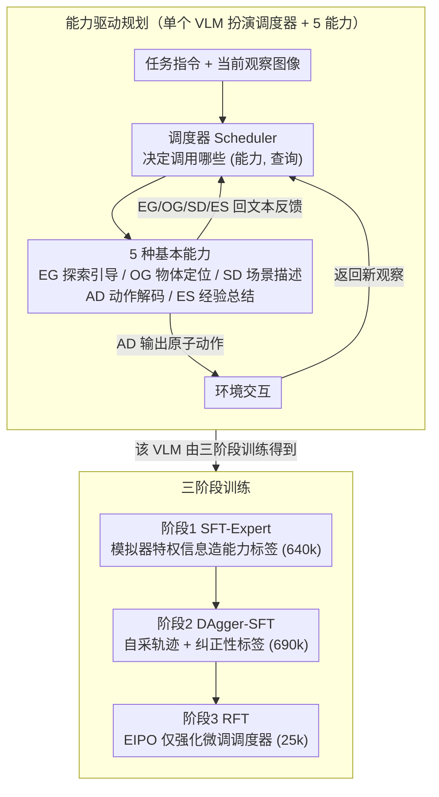

# RoboAgent: Chaining Basic Capabilities for Embodied Task Planning

**会议**: CVPR 2026  
**arXiv**: [2604.07774](https://arxiv.org/abs/2604.07774)  
**代码**: [https://github.com/woyut/RoboAgent_CVPR26](https://github.com/woyut/RoboAgent_CVPR26)  
**领域**: 机器人  
**关键词**: 具身任务规划, 能力链式调用, 视觉语言模型, 强化学习, 多阶段训练

## 一句话总结

提出 RoboAgent，一种能力驱动的具身任务规划框架，用单个 VLM 同时实现调度器和 5 种基本能力（探索引导、物体定位、场景描述、动作解码、经验总结），通过三阶段训练（SFT + DAgger + 专家引导 RL）在 EB-ALFRED 和 ALFWorld 上达到 SOTA。

## 研究背景与动机

1. **领域现状**：具身任务规划（ETP）要求智能体根据视觉观察和语言指令，在环境中执行原子动作序列完成复杂任务。VLM 虽在多模态理解上表现出色，但在涉及多轮交互、长视野推理、扩展上下文分析的具身规划中表现有限。

2. **现有痛点**：(1) 直接用 CoT 推理产生的中间思考缺乏规范化格式和直接监督，难以保证推理的正确性和实用性；(2) 依赖闭源模型或外部工具的方法无法端到端训练；(3) 标准 RL 在稀疏奖励的探索场景中难以学习有效策略。

3. **核心矛盾**：复杂规划隐含多个中间过程（意图理解、常识推理、环境分析、动作建模、进度监控），但现有方法将其混为一体，难以对中间步骤施加精细监督。

4. **本文目标** 将复杂规划分解为一系列基本视觉-语言问题，使单个 VLM 能通过显式的能力调用实现可控、透明的推理过程。

5. **切入角度**：定义一组对具身场景关键的视觉-语言能力，由调度器决定何时调用什么能力，每个能力维护自己的上下文并产生中间推理结果或环境交互。

6. **核心 idea**：用一个 VLM 同时扮演调度器和多种能力角色，将"自由格式 CoT"替换为"结构化能力调用链"，配合利用模拟器内部信息的多阶段训练。

## 方法详解

### 整体框架

RoboAgent 要解决的是：怎么让一个 VLM 在具身环境里做长视野规划，而不是让它一口气吐出一段无人监督的自由 CoT。它的做法是把"规划"拆成两层角色，但底层只用同一个 VLM（Qwen2.5-VL-3B）扮演——上层是调度器（Scheduler），下层是 5 种基本能力（Capability）。调度器读任务指令和历史上下文，决定下一步该调哪个能力、传什么查询，输出一串 `[(能力名, 查询)]`；被点名的能力接过查询和当前观察图像，要么吐出原子动作直接和环境交互，要么吐出一段文本反馈回填给调度器。调度器据此更新上下文、再决定下一次调用，如此循环直到任务完成。整个链条不依赖任何外部工具或闭源模型，因此可以端到端训练——而要把这个"调度器 + 能力"合一的单个 VLM 训出来，本文用了递进的三阶段流程（SFT-Expert → DAgger-SFT → 专家引导 RFT）。下面先讲规划架构、再讲三阶段训练，其中第三阶段的强化微调用到自研的 EIPO 算法。

### 关键设计

**1. 把规划拆成 5 种 VLM 本就擅长的视觉-语言子问题**

自由格式 CoT 最大的麻烦是"中间思考"没有规范格式、也无从直接监督，模型说得对不对没法逐步纠。RoboAgent 的对策是预先定义一组能力，每种能力对应 VLM 的一项基本功：**探索引导 (EG)** 靠常识推理预测目标物体最可能在哪个方向，解决"没看到目标时往哪走"；**物体定位 (OG)** 做开放词汇检测，判断目标是否已进入视野；**场景描述 (SD)** 把目标物体的当前状态写成文本；**动作解码 (AD)** 把导航/操控指令翻译成原子动作序列；**经验总结 (ES)** 复盘最近动作的执行结果、分析失败原因。其中只有 AD 产生动作但不回文本，另外 4 种只回文本不产生动作——这种"动作 vs 反馈"的分工让调度器始终拿到结构化的中间信息。这样做的好处是双向的：调用的每一步都对应一个 VLM 拿手的任务，发挥了模型内在能力；同时每个能力都成了一个可以单独施加监督、单独诊断和替换的接口。

**2. 三阶段训练：从会用格式，到修分布偏移，到泛化**

单靠模仿专家轨迹的模型一旦自己上场就会因为分布偏移翻车，而稀疏奖励的探索场景又让纯 RL 很难起步，所以训练被拆成递进的三段。**Stage 1 (SFT-Expert)** 先让模型学会基本格式和技能：利用模拟器的特权信息（场景图谱、分割掩码、环境消息——这些推理时都看不到）为每种能力反推出训练标签，共 640k 样本。**Stage 2 (DAgger-SFT)** 让 Stage 1 的模型实际部署去采集自生成轨迹，再用语义匹配把模型的能力调用对齐到 ground-truth，构造出"你刚才该怎么改"的纠正性标签（690k 样本，并补上物体描述和动作格式增强），专门修补模仿学习留下的分布偏移。**Stage 3 (RFT)** 只对调度器做强化微调，以"能力调用是否完成操纵子计划"为奖励，合成 25k 条多样化交互轨迹，把调度策略推向更广的场景泛化。三段各司其职：SFT 打基础、DAgger 补偏移、RFT 提泛化。

**3. 专家引导策略优化 (EIPO)：用确定性专家换来精确、稳定的梯度**

Stage 3 的调度器强化学习若直接套 PPO/GRPO，要靠蒙特卡洛去估回报改进量，在稀疏奖励下噪声大、收敛慢。EIPO 换了个角度——不优化策略自身的回报增量，而是直接最大化**专家**的优势函数 $A_{\pi^*}(s,a)$。关键在于这里的专家策略是确定性的，于是 $A_{\pi^*}$ 可以精确算出来，不必采样估计。具体优化时沿用 GRPO 风格的组内均值当基线，把"组内相对更好"的动作给正梯度、"更差"的给负梯度：

$$J(\pi) = \mathbb{E}_{s \sim D}\, \frac{1}{G} \sum_{i=1}^{G} \big[\, r(a^i, s)\, \hat{A}_{\pi^*}(s, a^i) \,\big]$$

之所以稳，是因为专家的最优性天然保证 $A_{\pi^*}(s,a) \leq 0$——任何次优动作的优势都非正，会被自动压低，方向明确不会乱跳；而且它用的是步级别的优势函数而非 GRPO 的 episode 级回报，信号更密、收敛更快。

### 一个完整示例：取一杯并放到桌上

以"把杯子放到桌上"这类任务走一遍，能看清调度器和能力是怎么串起来的。开局视野里没有杯子，调度器先调 **EG**，能力根据常识反馈"杯子常在橱柜/水槽方向"，于是给出朝该方向探索的提示；调度器据此让 **AD** 解码出几步导航原子动作，机器人移动后拿到新观察图像。调度器接着调 **OG** 检测当前画面是否出现杯子——若否，回到 EG 继续换方向探索；若是，则调 **SD** 描述杯子状态（"杯子在水槽里，可抓取"），再让 **AD** 解码抓取动作。抓取执行后调度器调 **ES** 复盘这步是否成功、有没有抓空，确认成功后继续规划导航到桌子、解码放置动作。整条链路里，调度器始终拿到的是 OG/SD/ES 给的结构化文本反馈而非一段模糊的内心独白，因此每一次"下一步调谁"的决策都有据可依，出错时也能定位到是哪个能力环节出了问题。

### 损失函数 / 训练策略

Stage 1-2 使用标准交叉熵损失进行 SFT。Stage 3 使用 EIPO 算法，学习率 5e-6，batch size 512，120 次策略更新迭代。整体在 4 卡 H800 上训练。基模型 Qwen2.5-VL-3B，Stage 1 学习率 1e-5，batch size 32，2 epochs。

## 实验关键数据

### 主实验

| 基准 | 方法 | 基模型 | 平均 SR |
|------|------|--------|---------|
| EB-ALFRED | Claude-3.7-Sonnet (zero-shot) | - | 67.7 |
| EB-ALFRED | WAP | Qwen2.5-VL-7B | 62.7 |
| EB-ALFRED | **RoboAgent** | **Qwen2.5-VL-3B** | **67.0** |
| ALFWorld (视觉) | SEEA-R1 | Qwen2.5-VL-7B | 36.0 |
| ALFWorld (视觉) | **RoboAgent** | **Qwen2.5-VL-3B** | **77.6** |
| ALFWorld (文本) | DynaMind | Qwen2.5-7B | 92.5/89.1 |
| ALFWorld (文本) | **RoboAgent** | **Qwen2.5-VL-3B** | **92.1/94.0** |

在 ALFWorld 视觉环境中，RoboAgent 以 77.6% SR 大幅超越所有现有 RL 方法（次优 SEEA-R1 仅 36.0%），提升幅度达 41.6 个百分点。

### 消融实验

| 训练配置 | ALFWorld SR | EB-ALFRED SR | 说明 |
|---------|-------------|--------------|------|
| SFT-expert | 44.8 | 62.0 | 仅专家轨迹 SFT |
| +DAgger (aug. gen.) | 73.1 | 64.3 | 加模型生成数据的 DAgger |
| +RFT (aug. exp.) | 74.6 | 65.7 | 加增强专家数据 RFT |
| +RFT (aug. syn.) | **77.6** | **67.0** | 完整模型，加合成数据 RFT |

### 关键发现

- **DAgger 阶段贡献最大**：ALFWorld 上从 44.8→73.1（+28.3），说明模型自采集轨迹的纠正性监督对弥补分布偏移至关重要。
- **EIPO 比 GRPO 收敛更快**：在相同迭代次数下，EIPO 相比 GRPO 达到更高的 ALFWorld SR，验证了步级优势函数的稳定性优势。
- **跨模态泛化**：同一个视觉模型直接适配文本环境，达到 92.1/94.0 (seen/unseen)，接近专为文本设计的方法，说明能力框架获得了模态无关的规划能力。
- **OOD 泛化**：在 EB-Habitat (22.3) 和 LoTa-WAH (22.1) 上优于其他开源迁移模型，但与闭源 GPT-4o (59.0) 仍有差距。

## 亮点与洞察

- **"能力即接口"的设计理念极具启发性**：不同于自由格式 CoT，结构化的能力调用让中间推理可监督、可诊断、可替换，是 VLM agent 设计的一个重要范式。
- **利用模拟器特权信息构建训练数据**：训练时利用场景图谱、分割掩码等推理时不可见的信息为能力构建高质量标签，是一个巧妙的知识蒸馏策略。
- **单模型多角色**：调度器和所有能力共享一个 3B VLM，无需外部工具或多模型协作，大幅降低了部署复杂度。这一设计可迁移到其他多工具 agent 系统中。
- **EIPO 算法可推广**：利用专家策略的确定性来获得精确优势估计，适用于任何有可靠专家策略的 RL 场景。

## 局限与展望

- 仅在 AI2-THOR/ALFRED 模拟器上训练，真实世界泛化能力未验证
- 5 种能力是预定义的，无法动态扩展新能力或根据任务自适应选择
- OOD 结果显示跨模拟器泛化仍有明显差距（vs GPT-4o 零样本差 ~37 个百分点）
- 3B 模型在复杂推理场景下可能受限，更大模型可能进一步提升
- 可以考虑引入能力的自我发现和组合机制，而非固定 5 种

## 相关工作与启发

- **vs SEEA-R1**: SEEA-R1 用 7B 模型 + RL 达到 36.0% ALFWorld SR，RoboAgent 用 3B 模型达到 77.6%，说明结构化能力调用比自由 CoT 推理更有效
- **vs 闭源零样本 (Claude/GPT-4o)**: 在 EB-ALFRED 上 RoboAgent (67.0) 接近 Claude-3.7-Sonnet (67.7)，在 ALFWorld 视觉上大幅超越 GPT-4o (24.0)，说明领域微调的小模型可以匹敌大模型
- **vs 渐进式规划 (MPO/DynaMind)**: 这些方法通过子目标分解任务，RoboAgent 通过能力分解推理过程，后者提供了更精细的监督接口

## 评分

- 新颖性: ⭐⭐⭐⭐ 能力驱动规划框架设计新颖，EIPO 算法有理论贡献，但能力定义仍较手工
- 实验充分度: ⭐⭐⭐⭐⭐ 4 个基准（2 in-domain + 2 OOD）、3 种模态（视觉/文本/OOD）、完整阶段消融、EIPO vs GRPO 对比
- 写作质量: ⭐⭐⭐⭐ 框架描述清晰，训练流水线图示直观，但公式推导部分较密集
- 价值: ⭐⭐⭐⭐⭐ 为 VLM 具身 agent 提供了一个可复制、可扩展的范式，77.6% ALFWorld SR 是目前最强结果

<!-- RELATED:START -->

## 相关论文

- [\[CVPR 2026\] Recurrent Reasoning with Vision-Language Models for Estimating Long-Horizon Embodied Task Progress](recurrent_reasoning_with_vision-language_models_for_estimating_long-horizon_embo.md)
- [\[ICML 2026\] Embodied Task Planning via Graph-Informed Action Generation with Large Language Models](../../ICML2026/robotics/embodied_task_planning_via_graph-informed_action_generation_with_large_language_.md)
- [\[CVPR 2026\] Iterative Closed-Loop Motion Synthesis for Scaling the Capabilities of Humanoid Control](iterative_closed-loop_motion_synthesis_for_scaling_the_capabilities_of_humanoid_.md)
- [\[ICLR 2026\] REI-Bench: Can Embodied Agents Understand Vague Human Instructions in Task Planning?](../../ICLR2026/robotics/rei-bench_can_embodied_agents_understand_vague_human_instructions_in_task_planni.md)
- [\[NeurIPS 2025\] Towards Reliable Code-as-Policies: A Neuro-Symbolic Framework for Embodied Task Planning](../../NeurIPS2025/robotics/towards_reliable_code-as-policies_a_neuro-symbolic_framework_for_embodied_task_p.md)

<!-- RELATED:END -->
