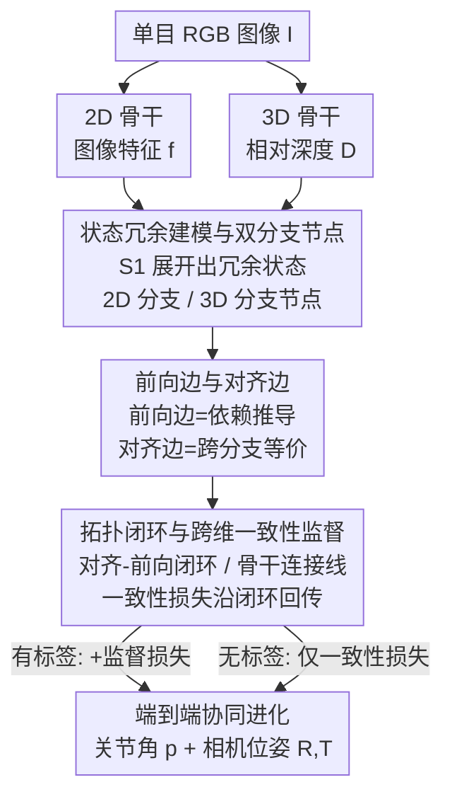

# RoboTAG: End-to-end Robot Pose Estimation via Topological Alignment Graph

**会议**: CVPR 2026  
**论文**: [CVF Open Access](https://openaccess.thecvf.com/content/CVPR2026/html/Liu_RoboTAG_End-to-end_Robot_Pose_Estimation_via_Topological_Alignment_Graph_CVPR_2026_paper.html)  
**代码**: 待确认  
**领域**: 机器人 / 具身智能  
**关键词**: 机器人位姿估计, 3D先验, 拓扑对齐图, 跨维一致性监督, 无标注对齐

## 一句话总结
针对单目 RGB 机器人位姿估计高度依赖标注、且把 3D 问题压成 2D 而丢掉空间先验的痛点，RoboTAG 把相机-机器人系统的各个状态变量组织成一张含 2D 分支与 3D 分支的"拓扑对齐图"，在图里找出若干"闭环"施加 2D-3D 一致性监督，使两条骨干网络协同进化，从而能利用无标注野外图像训练，在 DREAM 的 9 个基准上 5 个达到 SOTA、平均 AUC 76.9%。

## 研究背景与动机
**领域现状**：从单目 RGB 图像估计机器人位姿（关节角 + 相机外参）是机器人与计算机视觉的基础任务，能支撑人机交互、多机器人协作，以及为野外机器人视频自动打标签。主流做法（RoboPose、RoboPEPP、Holistic Pose 等）大多在 2D 视觉骨干网络上接预测头，直接回归关节角与关键点。

**现有痛点**：这些方法有两个共性问题。其一，**严重依赖标注数据**——而真实场景里带精确关节角/相机位姿标注的机器人数据非常稀缺，导致只能在合成数据上训练、再面对仿真到真实（sim-to-real）的鸿沟。其二，**把本质上的 3D 问题降维到 2D 域**：忽略了预训练 3D 模型里现成的几何先验，又被 2D 表示固有的空间歧义所累，性能受限。此外像 RoboPEPP/DREAM 还要靠 PnP 从预测的 2D 关键点反解相机位姿，关键点一旦被遮挡或有噪声，PnP 解就跟着崩。

**核心矛盾**：标注稀缺与 3D 几何信息缺失这两件事其实指向同一个根：**2D 分支孤立地预测每个状态、再各自施加监督**，分支之间没有可以互相校验的结构，于是既无法借 3D 先验补 2D 的歧义，也无法在没有标签时找到额外的监督信号。

**本文目标**：在不引入额外标注的前提下，把 3D 先验注入位姿估计，并造出一种即使没有标签也能用的监督。

**切入角度**：作者观察到，相机-机器人系统的状态变量之间存在大量**数学上等价或可互相推导**的冗余关系（例如关节角与 3D 关键点互相决定、3D 关键点投影即得 2D 关键点）。如果把这些变量当节点、把它们之间的依赖与等价当边连成一张图，那么"两条不同路径算出的同一个量应当相等"本身就是一条天然的监督——不需要任何外部标签。

**核心 idea**：用一张带 2D、3D 双分支的拓扑图（RoboTAG）组织所有系统状态，在图中定义"闭环"，对闭环两端等价节点施加 2D-3D 一致性约束，让 2D 与 3D 骨干在闭环梯度里协同进化。

## 方法详解

### 整体框架
给定一张含 $n$ 个关节的机器人单目 RGB 图像 $I$，系统被定义为 $\mathcal{S}_0 = \{p, R, T\}$（$p$ 是关节角即机器人构型，$R,T$ 是相机相对机器人基座的旋转与平移）。目标是从 $I$ 估计 $\hat{\mathcal{S}}_0 = \{\hat{p}(I), \hat{R}(I), \hat{T}(I)\}$。

整体流程是：图像同时过一个 2D 骨干（抽图像特征 $f$）和一个 3D 骨干（抽相对深度 $D$）；以 $f$ 和 $D$ 为起点，用一组"前向边"按变量间的依赖关系推导出 2D 分支与 3D 分支各自的状态节点（关节角、2D/3D 关键点、点云、相机位姿等）；再用"对齐边"把两条分支里**指代同一物理量**的等价节点连起来；这些边围出若干**闭环**，闭环两端经对齐边连接的节点理应一致，于是施加 2D-3D 一致性损失。整张图可端到端训练：有标签时叠加监督损失，没标签时只用闭环一致性损失，梯度沿闭环回流，把前向边上的神经网络以及两条骨干一起训起来。

### 关键设计

**1. 状态冗余建模与双分支节点：把"等价但分别算出"的量都显式列成节点**

孤立预测每个状态的根本问题是分支间无从互校，因此 RoboTAG 先**故意制造冗余**：在最小状态 $\mathcal{S}_0=\{p,R,T\}$ 之外扩展出 $\mathcal{S}_1 = \{p, R, T, \kappa_2, \kappa_3, pts\}$（加入 2D 关键点 $\kappa_2$、3D 关键点 $\kappa_3$、点云 $pts$）。由于 $\mathcal{S}_0$ 已能完全决定系统，$\mathcal{S}_1$ 里这些量都是冗余的——而正是冗余给了"同一个量可由不同路径算出、理应相等"的约束空间。在此之上定义 3D 分支节点 $\{V_n^3\}=\{D, D', p, \kappa_3, pts\}$ 与 2D 分支节点 $\{V_n^2\}=\{f, \lambda, p, R, T, \kappa_2, \kappa_3, pts\}$，其中 $D$ 为 3D 骨干的相对深度、$D'=\lambda\cdot D$ 为深度调节器 $\lambda$ 校正后的绝对深度。两条分支各自都持有 $p,\kappa_3,pts$ 这类"同名"量，为后续跨分支对齐埋下伏笔。

**2. 前向边与对齐边：用两类边把依赖关系和等价关系分开编码**

图里的边分两种。**前向边**刻画变量间的依赖：当 $\partial\mathcal{V}_i/\partial\mathcal{V}_j \neq 0$ 时 $\mathcal{E}^{\text{forward}}_{\mathcal{V}_i,\mathcal{V}_j}=1$（如关节角 $p$ 与 3D 关键点 $\kappa_3$ 互相依赖，故连边；$p$ 与相机旋转 $R$ 不依赖，则不连）。这种依赖由三类算子之一实现：**纯变换**（两量数学等价，如 3D 关键点投影成 2D 关键点 $\kappa_{2,proj}$）、**机器人先验模型**（用 URDF 描述做正运动学，从 $p,R,T$ 算出 $\kappa_{3,fk}$、$pts_{fk}$）、**神经网络**（关系是隐式的，用网络拟合，如从 $f$ 前向出 $\{p^2,R,T,\kappa_2^2,\kappa_3^2,pts^2,\lambda\}$）。**对齐边**则刻画跨分支的等价：当 $\mathcal{V}_i \Longleftrightarrow \mathcal{V}_j$（两节点指代同一物理量）时置 1，例如 $p^2\Leftrightarrow p^3$、$\kappa_3^2\Leftrightarrow\kappa_3^3\Leftrightarrow\kappa_{3,fk}^3\Leftrightarrow\kappa_{3,fk}^2$、$pts^2_{fk}\Leftrightarrow pts^3_{fk}\Leftrightarrow pts^3_{unproj}$。两类边一起把"怎么算"与"哪些应当相等"清晰地编码进了拓扑结构。

**3. 拓扑闭环与跨维一致性监督：让无标签也能产生可回传的监督，并驱动双骨干协同进化**

有了边就能找"闭环"。论文定义两类可施加监督的结构：**对齐-前向闭环**（恰含一条对齐边、其余皆前向边，几何上首尾相接成环）；**骨干连接线**（首尾分别落在 3D 骨干、2D 骨干这两个特殊节点 $S_p=\{D,f\}$ 上、不闭合，但同样恰含一条对齐边，可视为把两个骨干当作前向边相连节点后的特例）。这些闭环构成拓扑空间一个子空间的基（论文取一组基本环路基 $B$ 使 $H_1(G,\mathbb{Z}_2)=\text{span}_{\mathbb{Z}_2}(B)$，⚠️ 该同调表述以原文为准）。在闭环上，对一条对齐边两端的状态施加一致性损失即可逼它们相等，梯度会沿整个闭环回传，训练闭环里前向边上的神经网络；对骨干连接线，梯度直接灌进 3D、2D 骨干，使两条分支**协同进化**。一致性损失 $\mathcal{L}_{\text{align}}$ 把 $p^3$ 与 $p^2$、$\kappa_3^3$ 与 $\kappa_3^2$ 等的 $\ell_2$ 差，以及 $pts^3_{unproj}$ 与 $pts^3_{fk}/pts^2_{fk}$ 的 Chamfer 距离加权求和；总损失 $\mathcal{L}_{\text{tot}}=\mathcal{L}_{\text{align}}+\mathcal{L}_{\text{supervised}}$。关键在于 $\mathcal{L}_{\text{align}}$ **不需要任何标签**——只要图像就能算，这正是 RoboTAG 能吃无标注野外数据、缓解数据瓶颈的来源。相机位姿也因被多个闭环从不同方向约束，得以**绕开 PnP**、直接由 2D 分支预测，从而对遮挡/缺失关键点更鲁棒。

### 损失函数 / 训练策略
训练分两相。**监督相**：在带标签的合成 DR-train 上，同时用 $\mathcal{L}_{\text{align}}$ 与 $\mathcal{L}_{\text{supervised}}$；后者把预测的 $p^3,R^2,T^2,\kappa_2^2,\kappa_{2,proj}^2,pts$ 等与各自 ground truth 的 $\ell_2$/Chamfer 差加权求和，缺哪个标签就略去对应项。学习率 $1.2\times10^{-4}$，全局 batch 128，训 80 epoch，衰减率 0.95。**对齐相**：当有真实图像（如 Panda 3C）但无标注时，仅用闭环一致性损失继续训，不引入任何新标注/新数据；学习率降到 $1.0\times10^{-6}$、batch 128、训 20 epoch。2D 骨干由 Holistic Pose 的 rootnet（DepthNet 任务预训练）初始化，3D 骨干用预训练 DepthAnything-V2 Tiny，全部权重可训。8 张 L40S（每卡 46GB）训练约 3 天收敛。

## 实验关键数据

### 主实验
评测沿用 DREAM 基准，指标为预测/真值关节位置在图像内的 ADD 曲线下面积（AUC ↑）。Panda 3C-*、ORB 为真实照片，其余为合成集；由于监督训练集是 DR，其它评测集相对 DR 都是**分布外（OOD）**。

| 数据集（部分） | RoboPose | RoboPEPP | Holistic Pose | RoboTAG(本文) |
|----------------|---------|----------|---------------|---------------|
| 平均 AUC | 71.3 | 74.0 | 75.7 | **76.9** |
| Panda DR | 70.4 | 75.3 | 82.2 | **83.1** |
| Panda 3C-AK(真实) | 77.6 | 78.5 | 76.0 | 75.7 |
| Panda Photo | 82.9 | 83.0 | 82.7 | 82.5 |
| Kuka DR | 80.2 | 76.2 | 75.1 | 75.0 |
| Baxter DR | 32.7 | 34.4 | 58.8 | **58.8** |

RoboTAG 平均 AUC 76.9%，比次优高 1.2%，在 9 个基准里 5 个取得 SOTA，尤其在真实 + 合成照片的 OOD 集上展现出更稳的泛化。作者也坦言在与训练数据高度相似的 DR 集上，混合对齐框架弱于纯监督，但 OOD 集的增益对真实部署更关键。延迟方面，RoboTAG 单次前向 35 ms，接近 2D 基线（23/27 ms），远低于优化类方法（200 ms+）。

### 消融实验
平均关节角偏差（度 ↓，Panda）与模块消融（AUC ↑）：

| 配置 | 指标 | 说明 |
|------|------|------|
| Panda DR · 关节角偏差 | 3.6（本文）vs 3.8（RoboPEPP） | 前 5 个关节多数 SOTA |
| Panda Photo · 关节角偏差 | 3.3（本文）vs 3.2（RoboPEPP） | 与 RoboPEPP 相当 |
| 2D 基线（仅 2D 分支） | — | 不含任何 3D 分支/图结构 |
| + 2D-3D 特征融合 | +0.45% | 仅加 3D 骨干 + Hiwin 注意力融合，无图/无对齐 |
| + 完整 TAG（对齐） | 再 +1.6% | 加闭环 + 2D-3D 一致性损失 |

### 关键发现
- **TAG 对齐是主要增益来源**：单纯把 3D 特征融进来只涨 0.45%，而完整 TAG 的闭环一致性监督再带来 1.6% 提升——说明价值不在"多一个 3D 骨干"，而在用拓扑闭环把 3D 先验真正约束进预测。
- **越靠近基座的关节估得越准**：靠基座的关节（如 J1）对 3D 位置影响大、被 3D 分支更严格监督；最远端关节（J6/夹爪）3D 特征响应弱、偏差更大——但末端关节对整体姿态影响小，实用上不致命。
- **绕开 PnP 带来鲁棒性**：DREAM/RoboPEPP 靠 PnP 反解相机，关键点被遮挡就崩；RoboTAG 直接由 2D 分支预测相机位姿且被多个闭环约束，对噪声/极端视角更稳。

## 亮点与洞察
- **"制造冗余 → 冗余即监督"的思路很巧**：刻意把可互推的状态都列成节点，再用"不同路径算出的同一量应相等"造出无标签监督，把图论的闭环/环路基直接搬来做一致性约束，是个可迁移的范式。
- **拓扑图统一了 2D/3D 表示的协同**：前向边（怎么算）与对齐边（哪些等价）分离编码，闭环梯度让两条骨干协同进化，而不是简单的特征拼接融合——这解释了为何 TAG 比纯融合多涨 3 倍多。
- **可迁移性**：任何"存在多条计算路径得到同一量"的多模态/多分支估计任务（如多视角几何、跨传感器标定）都能借这套"冗余建图 + 闭环一致性"做半监督。

## 局限与展望
- **远端关节精度不足**：最远离基座的关节（如第 6 关节）因 3D 特征响应弱而偏差偏大，作者明确把"提升末端关节精度"列为 future work。
- **DR 同分布上弱于纯监督**：当评测集与训练集高度相似时，对齐损失反而稀释了纯监督的效果，混合框架并非处处占优。
- **依赖机器人先验模型（URDF）与正运动学**：前向边的一部分要靠已知 URDF 计算，对未知/无精确模型的机器人本体适用性待验证。
- ⚠️ 闭环的同调基表述、各损失权重 $\alpha_i/\beta_i$ 的具体取值原文未在正文给全，复现需参阅补充材料。

## 相关工作与启发
- **vs RoboPose**：RoboPose 用渲染-比对迭代精修关节角与相机位姿，计算量大；RoboTAG 单次前向 35 ms，且靠 3D 先验 + 闭环避免迭代优化。
- **vs RoboPEPP**：RoboPEPP 引入 MAE 预训练增强对机器人-相机系统的理解，但仍在 2D 域、靠 PnP 反解相机，关键点误差会累积；RoboTAG 直接预测相机位姿并用 3D 分支约束，OOD 更稳。
- **vs Holistic Pose（rootnet/[1]）**：Holistic Pose 用 2D 骨干直接预测 3D 关键点，对预测头是高难任务；RoboTAG 在这条任务上加了由 3D 骨干引导的闭环，预测更准。
- **vs RoboKeyGen**：用扩散模型把 2D 关键点抬升到 3D，但不在 DREAM 等通用基准上评测、未开源，故未直接对比。

## 评分
- 新颖性: ⭐⭐⭐⭐⭐ 把机器人位姿估计重述为"拓扑对齐图 + 闭环一致性"，并以冗余状态造无标签监督，思路新颖且自洽。
- 实验充分度: ⭐⭐⭐⭐ 覆盖 3 种机器人本体、真实 + 合成、含模块消融与延迟分析，但缺与更多半监督基线的对比、部分细节在补充材料。
- 写作质量: ⭐⭐⭐⭐ 框架与图论定义清晰，但公式排版较密、部分符号需对照补充材料才好懂。
- 价值: ⭐⭐⭐⭐⭐ 直指机器人数据瓶颈，能吃无标注野外图像并为其打标签，对真实部署意义大。

<!-- RELATED:START -->

## 相关论文

- [\[CVPR 2026\] LEAD: Minimizing Learner-Expert Asymmetry in End-to-End Driving](lead_minimizing_learner-expert_asymmetry_in_end-to-end_driving.md)
- [\[CVPR 2026\] End-to-End Language-Action Model for Humanoid Whole Body Control](end-to-end_language-action_model_for_humanoid_whole_body_control.md)
- [\[CVPR 2026\] A Cross-view Fusion Framework for Robust 6-DoF Grasp Pose Estimation](a_cross-view_fusion_framework_for_robust_6-dof_grasp_pose_estimation.md)
- [\[NeurIPS 2025\] SutureBot: A Precision Framework & Benchmark for Autonomous End-to-End Suturing](../../NeurIPS2025/robotics/suturebot_a_precision_framework_benchmark_for_autonomous_end-to-end_suturing.md)
- [\[CVPR 2025\] TinyNav: End-to-End TinyML for Real-Time Autonomous Navigation on Microcontrollers](../../CVPR2025/robotics/tinynav_end-to-end_tinyml_for_real-time_autonomous_navigation_on_microcontroller.md)

<!-- RELATED:END -->
