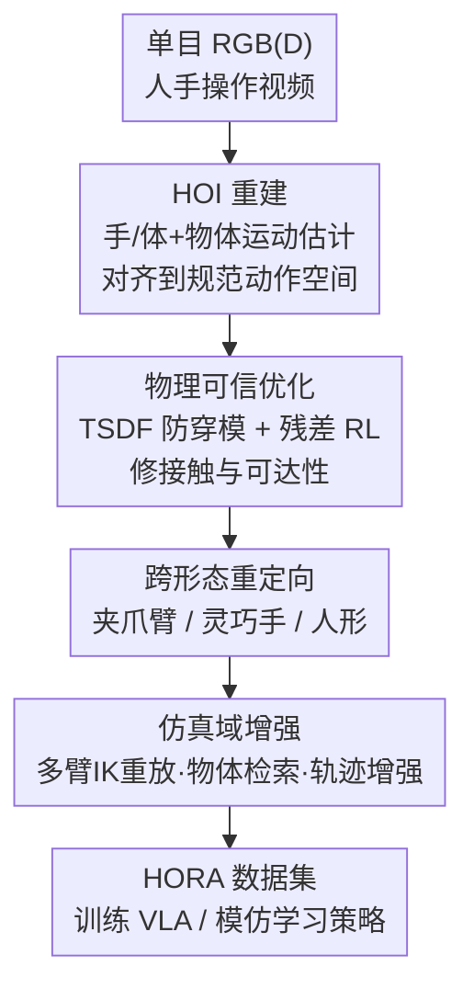

# RoboWheel: A Data Engine from Real-World Human Demonstrations for Cross-Embodiment Robotic Learning

**会议**: CVPR 2026  
**论文**: [CVF Open Access](https://openaccess.thecvf.com/content/CVPR2026/html/Zhang_RoboWheel_A_Data_Engine_from_Real-World_Human_Demonstrations_for_Cross-Embodiment_CVPR_2026_paper.html)  
**代码**: 无（仅有项目页 https://zhangyuhong01.github.io/Robowheel）  
**领域**: 机器人 / 具身智能  
**关键词**: 数据引擎, 手物交互重建, 跨形态重定向, 物理可信, VLA

## 一句话总结
RoboWheel 把单目 RGB(D) 拍到的「人手操作物体」视频，经过高精度重建 + 物理可信优化 + 跨机器人形态重定向 + 仿真域增强，自动转换成可直接训练 VLA / 模仿学习策略的机器人监督数据，并据此造出了 15 万条轨迹的多模态数据集 HORA，首次定量证明 HOI 视频能当机器人学习的有效监督。

## 研究背景与动机
**领域现状**：具身智能体最有效的监督是「人怎么和世界交互」，但拿到机器人能直接用的监督数据非常贵。目前主流靠两条路：遥操作（teleoperation）和影棚动捕（studio MoCap），都需要专用硬件、人工精挑，动作多样性差、跨机器人本体迁移难。

**现有痛点**：与此同时，互联网上、公开数据集里堆着海量手-物交互（HOI）视频，里面藏着真实世界的操作策略，却几乎没人把它转成机器人能训的数据。卡点有三个：单目重建有噪声、重建出来的轨迹物理上不可信（穿模、接触飘）、人手和机器人本体（夹爪 / 灵巧手 / 人形）形态不匹配。

**核心矛盾**：基于 SMPL-H/MANO 和 6D 物体位姿的感知方法能从单目恢复几何和运动，但接触估计不一致、遮挡下手物相互穿透、轨迹不平滑、违反运动学/动力学约束——「能重建出大致几何」和「能当机器人监督」之间隔着一道物理可信 + 可执行的鸿沟。纯仿真合成数据又不反映真实感知和接触分布。

**本文目标**：做一条可扩展的处理流水线，同时满足三件事：(i) 大规模、持续地采到物理可信的机器人-物体交互轨迹；(ii) 灵活把轨迹重定向到各种异构机器人本体（甚至跨域）、保留交互语义；(iii) 能组合多种数据增强、保持可扩展性。

**切入角度**：人手运动其实是一种「与本体无关」的通用运动表示——只要先把它重建准、修到物理可信，再投影成不同机器人的可执行动作，就能从一段普通视频里榨出跨本体监督。

**核心 idea**：用「视频 → 重建 → 重定向 → 增强 → 数据」的端到端数据引擎，把人手操作视频变成跨形态机器人训练数据，单目 RGB(D) 一个相机就够。

## 方法详解

### 整体框架
RoboWheel 是一条单向流水线：输入是单目 RGB(-D) 的人手操作物体视频，输出是带多模态观测、可直接喂给 VLA / 模仿学习模型的机器人轨迹数据。中间分四级处理——先从视频里把手和物体的运动重建到同一世界坐标系；再用 TSDF + 残差强化学习把轨迹修到既不穿模、又能让机器人够得着的物理可信状态；接着把这套统一的 HOI 轨迹重定向到夹爪臂、灵巧手、人形等异构本体，得到可执行动作；最后在 Isaac Sim 里做大量域随机化增强，扩出观测和轨迹的分布。整条链路像一个不断转的「数据飞轮」（这正是 RoboWheel 名字的来源）。

### 关键设计

**1. 单目 HOI 重建：把视频里的手和物体恢复到同一世界坐标系**

针对「单目重建噪声大、缺尺度、坐标不统一」这个起点痛点，作者把现成的 SOTA 估计器拼成一个统一重建框架。给定视频帧 $\{I_t\}_{t=1}^T$，先判断这段片段是只有手还是全身：只有手就逐帧估手姿态 $h_t=(\theta_h(t), R^w_h(t), t^w_h(t))$；全身就估 SMPL-H 参数再抽出手的状态。物体侧先分割出 mask $m_t$ 和深度 $D_t$，用多视图 3D 生成器造出无尺度的带纹理网格 $\hat{M}_o$，再把 mask 内深度反投影成点云、用包围盒对角线之比 $s_o$ 把网格缩放到真实尺度 $M_o = s_o\hat{M}_o$，最后用对应点驱动的跟踪器估物体 6D 位姿流。关键一步是消除视角不一致：估出相机内参和相机到世界的变换，把所有手物交互搬到世界坐标，再基于身体关节位置构造参考系，对齐到一个**规范动作空间** $\mathcal{A}$——这让来自录制、公开数据集、网络视频的异构来源能统一处理，是后面所有重定向和增强都在 $\mathcal{A}$ 里做的前提。

**2. 物理可信优化：TSDF 防穿模 + 残差 RL 修接触与可达性**

重建出的几何在遮挡下常常手插进物体、接触忽有忽无、还不保证机器人够得着，这一步专门把它修到物理可信。分两段：先用物体的截断符号距离函数 TSDF $\phi_o(x;t)$（外部为正）做无碰撞初始化——优化手参数让手掌顶点 $V_h^{palm}$ 的 $\phi_o^2$ 最小，把手推出物体表面，再调腕部旋转平移避免整手穿透。拿到无碰撞初始化后，引入一个**残差 RL 策略**进一步精修手和物体的轨迹：在原轨迹上学一个残差，鼓励准确跟踪、并在手物距离低于阈值时促成物理一致的接触。RL 的状态 $s_t=(h_t, p_t, \dot{h}_t, \dot{p}_t, C_t)$ 把位姿、速度和接触力 $C_t$ 都纳进来，奖励是几何、动力学、接触三项加权：

$$r_t = \lambda_{geo}\Phi_{geo}(\|\Delta h_t\| + \|\Delta p_t\|) + \lambda_{dyn}\Phi_{dyn}(\|\Delta\dot{h}_t\| + \|\Delta\dot{p}_t\|) + \lambda_{con}\Phi_{con}(C_t)$$

其中 $\Delta$ 是当前状态与目标状态的误差。消融里这一步是涨点主力：TSDF + RL 把重放成功率（Replay SR）从无优化的 78.7% 拉到 93.6%（+14.9），相对位姿一致性也最好。

**3. 跨形态重定向：把同一套手轨迹投影成夹爪臂 / 灵巧手 / 人形的可执行动作**

物理可信轨迹有了，还要解决「人手 ≠ 机器人本体」。对**平行夹爪臂**，把 3D 手关节映射成末端执行器位姿 $\{T_g(t), g(t)\}$：用 kNN 分类器先判断是「整手抓」还是「指尖抓」两种手势，整手抓从 MCP 关节构造稳定的手掌坐标系抑制指尖抖动，指尖抓则用食指-拇指连线定义夹爪轴；夹爪开合状态不靠物体 mask（遮挡时易错），而是用 CoTracker 跟踪物体上关键点的位移——点不动判为张开、动了判为闭合，对遮挡更鲁棒。对**灵巧手**，用运动学相似性 + 接触保持约束把手运动重定向到目标手关节空间；对**人形**，借全身 SMPL-H 估计，通过逆运动学 + 动力学感知优化适配到人形关节树。重放时执行可能因精度或非物理碰撞失败，作者用 Qwen2.5-VL 看腕视角和第三视角观测做二分类（成功/失败）自动筛选，成功的轨迹再生成精细语言指令，让数据自带 caption。

**4. 仿真域增强数据飞轮：在 Isaac Sim 里把一条轨迹扩成多本体、多场景、多物体**

为了在保住接触语义和物理可信的前提下放大覆盖面，所有增强都在规范动作空间 $\mathcal{A}$ 里做。**多臂重放**：在 Isaac Sim 实例化 UR5/UR5e、Franka Panda、KUKA iiwa、Kinova Gen3、Sawyer 五种 6/7-DoF 臂，把 HOI 末端轨迹 $T_g(t)$ 用 cuRobo 的 GPU 加速逆运动学解成可行关节轨迹 $q_t$（带可达上下限和自碰撞约束，并用上一帧解 $q_{t-1}$ 当种子保时序连续）。**物体检索替换**：用 Chamfer 距离、AABB IoU、文本-形状语义嵌入的融合相似度 $S$ 检索 top-K 替代物体，对齐主轴并绑定相同 AABB 和规范位姿，使原末端运动计划能直接在几何/语义匹配的新物体上重放（如杯↔带把杯、盒↔纸箱）。**轨迹增强**：把轨迹按接触状态切成 hold/open 段，交互段加物体系刚体变换、非交互段线性重映射并同步姿态变化（公式 5），不重新规划就扩出轨迹分布。这三类增强加上背景纹理、杂乱桌面、手部镜像等，构成不断产数据的飞轮。

### 损失函数 / 训练策略
物理可信优化阶段用上面奖励 $r_t$ 训残差 RL 策略；重建侧 TSDF 项最小化手掌顶点的 $\phi_o^2$ 做碰撞惩罚。增强阶段的 IK 求解最小化 cuRobo 的位姿到达代价 $C_{goal}$，约束为关节限位 $q_{min}\preceq q\preceq q_{max}$ 与自碰撞 $C_{coll}(q)\le 0$。动捕子集的 MANO 拟合则用「触觉接触态 + 腕姿标定 + 关节平滑 + 解剖先验」多约束联合优化，对所有帧并行求解。

## 实验关键数据

### 主实验
下游策略验证（Tab. 3，真实机器人成功率 %，按难度分组，tele.=10 条遥操作 | HORA=10 条 HORA）：用 HORA 同等数量轨迹训练，性能可与遥操作媲美；再叠加 5k HORA 预训练后超过两者，复杂任务上提升尤其明显。

| 难度组 | 指标 | RDT (tele.\|HORA) | Pi0 (tele.\|HORA) | RDT+5kHORA | Pi0+5kHORA |
|--------|------|------|------|------|------|
| Easy（4 任务均值） | 成功率 | 66.3 \| 47.5 | 68.8 \| 58.8 | 75.0 | 76.3 |
| Hard（4 任务均值） | 成功率 | 35.0 \| 25.0 | 40.0 \| 31.3 | 47.5 | **58.8** |

重定向方案对比（Tab. 5，真实机器人直接重放成功率 %）：本文重定向在所有任务上都更高。

| 方法 | Macro 平均成功率 |
|------|------|
| GAT-Grasp | 50.0 |
| yoto | 66.7 |
| **Ours** | **91.7** |

### 消融实验
重建质量模块消融（Tab. 2，在 HO-Cap 上评，Replay SR 为重放成功率）：

| 配置 | 物体 CD↓ | 抖动↓ | 旋转一致↓ | 重放 SR↑ | 说明 |
|------|---------|------|---------|---------|------|
| HOLD（对比基线） | 7.5 | 3.47 | - | - | 现有 HOI 重建方法 |
| Ours w/o TSDF & RL | 5.4 | 3.34 | 5.1 | 78.7 | 只重建不修物理 |
| Ours TSDF only | 5.4 | 0.84 | 3.2 | 85.2 | 加防穿模，抖动骤降 |
| Ours RL only | 6.2 | 4.13 | 3.1 | 61.7 | 只 RL 不防穿模，反而掉 |
| **Ours TSDF + RL** | **5.1** | 0.92 | **1.9** | **93.6** | 完整模型 +14.9 |

数据增强鲁棒性（Tab. 4，RDT 在分布漂移下，HORA vs HORA-aug）：

| 场景 | HORA 平均 | HORA-aug 平均 | 提升 |
|------|----------|--------------|------|
| 未见物体 | 3.75/10 | 4.25/10 | +0.5 |
| 杂乱场景 | 4.00/10 | 4.50/10 | +0.5 |
| 未见背景 | 1.50/10 | 4.00/10 | **+2.5** |

### 关键发现
- 物理可信优化里 **TSDF 和 RL 是互补的，缺一不可**：只用 RL 不防穿模反而把重放成功率拉到 61.7%（比啥都不做的 78.7% 还低），加上 TSDF 才到 93.6%——说明先有无碰撞初始化、再让 RL 在可行域里精修才稳。
- **HORA 数据能顶替遥操作**：同等数量下 HORA 训练的策略成功率与遥操作相当，尽管存在 sim-to-real gap；这是论文宣称的「首次定量证明 HOI 模态可作机器人学习有效监督」。
- 数据增强对**未见背景**的鲁棒性提升最大（+25% 成功率）：不加增强时改背景会让模型灾难性退化，加增强后大幅缓解视觉域 gap。

## 亮点与洞察
- **「与本体无关的运动表示」是核心杠杆**：把人手运动当成统一中间表示，一次重建可重定向到夹爪、灵巧手、人形，相当于把数据采集成本从「每种机器人各采一遍」降到「拍一段视频」，单目 RGB(D) 一个相机就够。
- **TSDF 做硬约束初始化 + 残差 RL 做软精修**这套两段式很值得复用：先用几何约束把解推进物理可行域，再让 RL 在可行域里优化接触和可达性，避免 RL 从零探索时学崩，是处理「带物理约束的轨迹优化」的好范式。
- **夹爪开合用关键点位移而非 mask 判定**是个抗遮挡小技巧：操作中手物互相遮挡严重，盯物体关键点动没动比盯 mask 完整度鲁棒得多。
- 用 **VLM（Qwen2.5-VL）做重放成功/失败自动筛选 + 生成语言指令**，把「数据清洗」和「标注」自动化进飞轮，省掉人工质检。

## 局限与展望
- **灵巧手和人形重定向只做了初步验证**（Preliminary validations in Appendix）：正文实打实的下游实验几乎都在 6/7-DoF 夹爪臂上，跨到更复杂本体的有效性还没充分量化。⚠️ 以原文附录为准。
- **存在 sim-to-real gap**：增强数据在 Isaac Sim 里生成，作者也承认靠精确重建 + 数据分布拓宽来缓解，但未见背景这类极端漂移下成功率仍只有 4/10，绝对值不高。
- **依赖一长串现成 SOTA 估计器**（手/体姿态、深度、3D 生成、位姿跟踪、相机标定），任一环节失效都会传导到下游；论文没系统分析各组件失败时整条链路的退化。
- 改进方向：把灵巧手/人形纳入主实验定量评估；探索真实-仿真混合训练进一步压 sim-to-real gap；端到端联合优化重建-重定向而非串行级联。

## 相关工作与启发
- **vs 遥操作 / 影棚动捕**：它们采的数据本体专属、硬件昂贵、多样性差；RoboWheel 从普通 HOI 视频提取本体无关运动表示再重定向，轻量且跨本体，代价是引入 sim-to-real gap 和重建噪声。
- **vs HOLD 等单帧 HOI 重建**：HOLD 之类方法多限于单帧或接触中场景，难处理接近/撤离阶段、遮挡、低分辨率；RoboWheel 加 TSDF + RL 把重建修到物理可信且时序稳定，重放成功率从对比基线大幅提升。
- **vs Open X-Embodiment / RT-X 跨本体语料**：它们证明异构机器人间正迁移可行，但仍需真实机器人采数据；RoboWheel 进一步把数据源前移到「人手视频」，用重建-重定向-增强补齐到机器人可用监督。

## 评分
- 新颖性: ⭐⭐⭐⭐ 把 HOI 视频系统性转成跨本体机器人监督的完整数据引擎，并首次定量验证 HOI 当监督的有效性，工程整合度高。
- 实验充分度: ⭐⭐⭐⭐ 覆盖重建质量、四种 VLA/IL 下游、重定向对比、增强鲁棒性多角度，但灵巧手/人形只做初步验证。
- 写作质量: ⭐⭐⭐⭐ 流水线和公式交代清楚，部分细节（碰撞优化、重定向算法）压进附录，正文略需脑补。
- 价值: ⭐⭐⭐⭐ 15 万条多模态数据集 HORA + 可扩展数据引擎，对降低具身数据采集成本有实际意义。

<!-- RELATED:START -->

## 相关论文

- [\[CVPR 2026\] TraceGen: World Modeling in 3D Trace Space Enables Learning from Cross-Embodiment Videos](tracegen_world_modeling_in_3d_trace_space_enables_learning_from_cross-embodiment.md)
- [\[CVPR 2026\] Beyond Mimicry: Learning Whole-Body Human-Humanoid Interaction from Human-Human Demonstrations](beyond_mimicry_learning_whole-body_human-humanoid_interaction_from_human-human_d.md)
- [\[CVPR 2026\] GraspGen-X: Cross-Embodiment 6-DOF Diffusion-based Grasping](graspgen-x_cross-embodiment_6-dof_diffusion-based_grasping.md)
- [\[CVPR 2026\] VideoWorld 2: Learning Transferable Knowledge from Real-world Videos](videoworld_2_learning_transferable_knowledge_from_real-world_videos.md)
- [\[ICLR 2026\] D-REX: Differentiable Real-to-Sim-to-Real Engine for Learning Dexterous Grasping](../../ICLR2026/robotics/d-rex_differentiable_real-to-sim-to-real_engine_for_learning_dexterous_grasping.md)

<!-- RELATED:END -->
