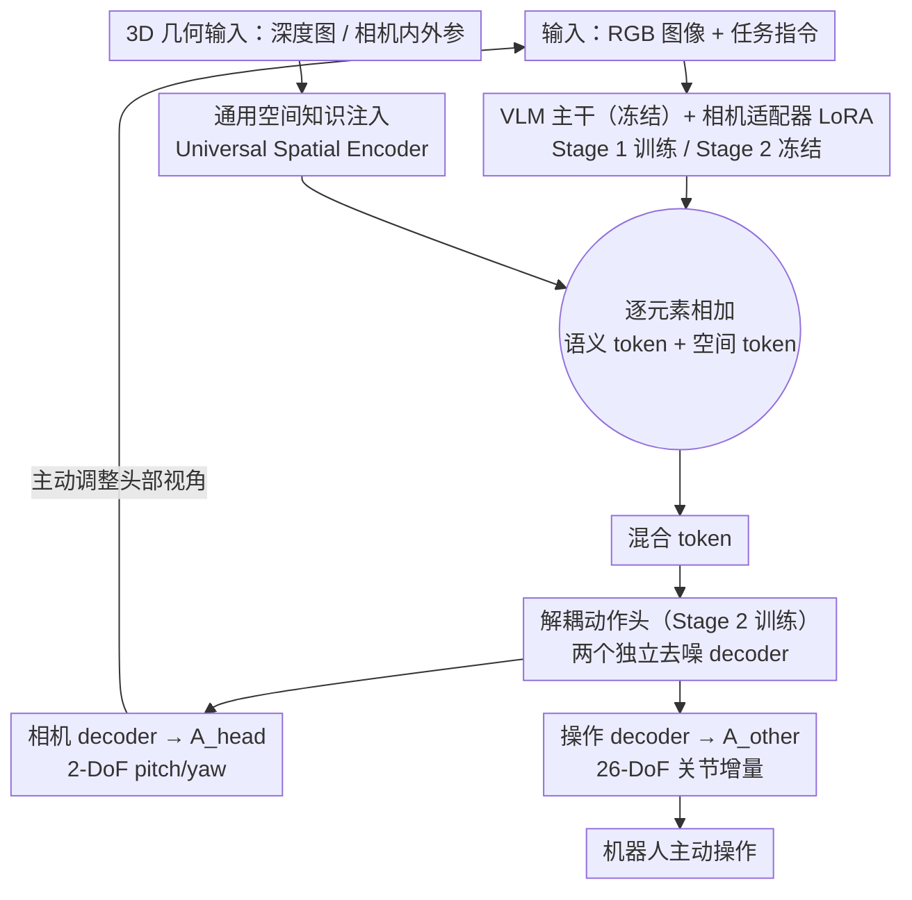

# SaPaVe: Towards Active Perception and Manipulation in Vision-Language-Action Models for Robotics

**会议**: CVPR 2026  
**arXiv**: [2603.12193](https://arxiv.org/abs/2603.12193)  
**代码**: [https://lmzpai.github.io/SaPaVe](https://lmzpai.github.io/SaPaVe)  
**领域**: 多模态VLM / 机器人  
**关键词**: 主动感知, VLA模型, 解耦动作空间, 3D空间注入, 人形机器人

## 一句话总结
SaPaVe提出端到端主动操作框架，通过解耦相机动作和操作动作的底层到顶层训练策略，先用20万对语义相机控制数据学习主动感知先验，再联合优化实现主动操作，在真实世界中超越π₀和GR00T N1达31.25%成功率提升。

## 研究背景与动机

1. **领域现状**：主动感知和操作是机器人与复杂场景交互的核心能力。现有VLM（如Qwen2.5-VL、Gemini 2.5 Pro）已提升语义理解能力，VLA模型（如π₀、GR00T N1）致力于端到端桥接视觉-语言-动作。
2. **现有痛点**：
    - VLM做主动感知多将其建模为VQA任务（从离散候选中选最优视角），无法进行连续精细的相机控制。
    - VLA模型通常在固定最优头部相机视角下训练和评估，对视角变化敏感，缺乏主动视角调整能力。
    - 直接在VLA中增加相机动作到统一动作空间会产生冲突，且需要大量昂贵的真实世界主动感知+操作数据。
3. **核心矛盾**：主动操作需要"语义主动感知"（根据任务策略调整视角获取关键信息）和"主动视角执行"（在动态视角下保持鲁棒操作）两种能力的紧密耦合，但数据稀缺和动作空间冲突使得现有方法难以兼顾。
4. **本文目标** 如何在数据高效的前提下，让机器人同时学会语义驱动的主动视角调整和视角变化下的鲁棒操作。
5. **切入角度**：关键洞察是相机运动是跨具身平台通用的（embodiment-agnostic），可以先独立学习再联合优化，从而实现底层到顶层的高效训练。
6. **核心 idea**：解耦相机动作与操作动作，先用大规模语义相机运动数据建立主动感知先验，再联合优化实现数据高效的主动操作。

## 方法详解

### 整体框架
SaPaVe要解决的问题是：让机器人既能"主动看"（根据任务把头部相机转到能看清关键信息的角度），又能在这个变动的视角下"稳定地做"（完成抓取、操作关节等任务）。它在标准VLA架构上接受RGB图像和任务指令，但把输出拆成两路解耦动作——头部相机动作 $A_{head}$（pitch/yaw 调整，2-DoF）和操作动作 $A_{other}$（26-DoF 关节位置增量，对应 Unitree G1 双臂双手）。两路都用动作分块(action chunking)预测时域为 $k$ 的动作序列保证时序平滑。整篇的核心赌注是：相机怎么转和机器人长什么样无关（embodiment-agnostic），所以可以先用海量纯视角数据把"主动感知"单独练好，再用少量操作数据把它和"操作"缝起来，从而绕开主动操作数据稀缺的难题。

### 关键设计

**1. 解耦动作头 + 相机适配器：把相机控制从操作动作里摘出来，不污染原有先验**

直接的做法是把相机运动塞进 VLA 现成的统一动作空间，但这会破坏模型在大规模固定视角操作数据上学到的先验——相机维度和操作维度互相干扰，结果两头都学不好。SaPaVe 的对策是物理隔离这两类动作：相机适配器以 LoRA 形式挂在 VLM 上、只学语义主动感知先验而冻结原始 VLM 权重；解耦动作头则配两个独立的 denoising decoder，分头输出 $A_{head}$ 和 $A_{other}$。这样相机能力是"贴"上去的而非"挤"进去的，VLM 的高层语义信息得以保留。消融印证了这一点：全量微调 VLM 去学相机运动反而不如轻量适配器（Tab.5 中去掉相机适配器平均掉 11.25%），正是因为重训练冲掉了语义先验。

**2. 通用空间知识注入：给缺 3D 先验的 VLA 补上抗视角变化的几何感**

VLA 模型本身没有 3D 几何先验，一旦视角主动变动，它对物体空间位置的理解就会漂移，操作随之失稳。SaPaVe 引入一个继承自强前馈 3D 几何模型的 Universal Spatial Encoder，可接受任意种类的 3D 几何信息（深度图、相机内外参等）作为输入而无需改架构或重训练。编码得到的空间 token 与 VLM 输出 token 逐元素相加，融合后的混合 token 注入解耦动作头的去噪过程，让动作生成时始终带着一份与当前视角对齐的几何参照。它的作用是直接的：消融中去掉该模块平均掉 16.25%，连本应最简单的遮挡抓取也掉 15%，说明对抗视角变化靠的就是这份显式 3D 信息。

**3. 两阶段底层到顶层训练策略：先练通用的"看"，再缝具身相关的"做"**

如果一次性联合训练主动感知和主动操作，就需要大量同时含视角调整和操作标注的数据，而这种数据恰恰最稀缺、最贵。SaPaVe 顺着"相机运动 embodiment-agnostic"的判断把训练拆成两层。Stage 1（语义主动感知对齐）只用容易批量生产的 ActiveViewPose-200K 训练相机适配器和相机动作解码器，目标是纯 MSE：

$$\mathcal{L}_{stage1} = \mathcal{L}_{MSE}(A_{head,t}, A_{head,t}^*)$$

这一步让模型先获得强语义驱动的视角调整先验。Stage 2（主动操作微调）随后冻结相机适配器、保护住已学到的感知能力，再用混合数据（ActiveViewPose-200K + 机器人操作数据）训练解耦动作头：

$$\mathcal{L}_{stage2} = \lambda_{head}\mathcal{L}_{head} + \lambda_{other}\mathcal{L}_{other}$$

少量操作数据只需把"怎么做"接到已经练好的"怎么看"上即可，迁移因此非常数据高效。消融里去掉 Stage 1 平均暴跌 31.25%（85→53.75）、视野外任务几乎减半，正说明这层主动感知先验是整套方法的地基。

### 一个完整示例：一次"视野外抓取"

设任务是"抓取桌上被挡在视野外的水杯"。① 初始头部视角看不到杯子，相机适配器读出语义先验、解耦动作头的相机 decoder 输出 $A_{head}$（如 yaw 右转、pitch 下压），把镜头主动转向杯子所在方位；② 新视角下，Universal Spatial Encoder 把当前深度图和相机内外参编码成空间 token，与 VLM 的语义 token 逐元素相加，注入操作 decoder——此时模型既知道"杯子在哪"（语义）也知道"离手多远、什么朝向"（几何）；③ 操作 decoder 据此输出 $A_{other}$ 的 26-DoF 关节增量，以动作分块形式平滑地伸手抓取。整个过程里"看"和"做"由两个独立头分头负责、靠注入的混合 token 协同，避免了统一动作空间下相机和操作互相打架——这正是固定相机/手腕相机组合在视野外任务上落后 40% 以上的根因。

### 损失函数 / 训练策略
- Stage 1：仅 MSE 损失监督相机动作预测，建立语义主动感知先验。
- Stage 2：加权 MSE 损失同时监督相机和操作动作，并冻结相机适配器以保护 Stage 1 学到的先验。
- 全程用动作分块(action chunking)保证预测序列的时序平滑。

## 实验关键数据

### 主实验：语义主动感知评估

| 方法 | Val | Test1 | Test2 | 平均 |
|------|-----|-------|-------|------|
| Qwen2.5-VL-72B | 63.9 | 65.1 | 58.0 | 62.3 |
| Multi-SpatialMLLM | 72.8 | 74.3 | 63.6 | 70.2 |
| Gemini-2.5-Pro | 73.3 | 76.5 | 68.2 | 72.7 |
| **SaPaVe (2B)** | **85.5** | **89.1** | **78.3** | **84.3** |

真实世界主动操作（成功率%）：

| 方法 | 遮挡抓放 | 视野外抓放 | 遮挡关节操作 | 视野外关节操作 | 平均 |
|------|---------|----------|------------|------------|------|
| π₀ | 55 | 45 | 45 | 35 | 45.00 |
| GR00T-N1 | 60 | 55 | 50 | 50 | 53.75 |
| **SaPaVe** | **90** | **85** | **85** | **80** | **85.00** |

### 消融实验

| 配置 | 遮挡抓放 | 视野外抓放 | 遮挡操作 | 视野外操作 | 平均 |
|------|---------|----------|---------|----------|------|
| Full Model | 90 | 85 | 85 | 80 | 85.00 |
| w/o Stage 1 | 65 | 55 | 50 | 45 | 53.75 |
| w/o Stage 2 | 75 | 60 | 70 | 60 | 66.25 |
| w/o 解耦动作头 | 80 | 70 | 70 | 65 | 71.25 |
| w/o 相机适配器 | 80 | 75 | 70 | 70 | 73.75 |
| w/o 空间知识注入 | 75 | 75 | 65 | 60 | 68.75 |

### 关键发现
- Stage 1贡献最大，去掉后平均掉31.25%（85→53.75），尤其是视野外任务几乎减半，说明主动感知先验是核心。
- 通用空间知识注入去掉后掉16.25%，连简单的遮挡抓取都掉15%，说明3D信息对抗视角变化至关重要。
- 仅2B参数的SaPaVe在语义感知上超越72B的Qwen2.5-VL和Gemini 2.5 Pro，说明语义主动感知不是通用VLM的涌现能力，需要专门训练。
- 固定相机+手腕相机的组合仍远不如主动相机，尤其是视野外任务（gap > 40%），说明"更多视角"不如"主动控制视角"。

## 亮点与洞察
- **"相机运动是embodiment-agnostic的"这一洞察**是全文最核心的insight，由此推导出解耦+底层到顶层的训练策略，优雅且有效。可以迁移到其他需要分离通用能力和具身特定能力的机器人学习场景。
- **ActiveViewPose-200K数据集**的构建流程（4K高质量资产 + 启发式动作生成 + GPT-4o指令生成 + 人工精炼）既高效又可复现，为社区提供了一个填补空白的评测基准。
- 真实世界中超越π₀ 40%、GR00T-N1 31.25%的绝对成功率提升，说明主动操作能力不是简单增加动作维度就能解决的。

## 局限与展望
- 仅在Unitree G1人形机器人上验证，对其他机器人形态（如单臂、移动底盘）的迁移性未验证。
- 当前相机动作仅2-DoF（pitch/yaw），未考虑平移等更复杂的视角调整。
- ActiveViewPose-200K是半自动构建的静态场景数据，真实世界的动态遮挡变化可能需要更多数据。
- 可以探索在线学习机制，让机器人在执行中持续改进主动感知策略。

## 相关工作与启发
- **vs π₀ [6]**: π₀是强通用VLA但缺乏主动感知能力，直接微调加入相机动作效果差（成功率仅45%），SaPaVe通过解耦策略达85%。
- **vs GR00T-N1 [5]**: 同样缺乏主动感知先验，虽然是专为人形设计但主动操作上被SaPaVe超越31.25%。
- **vs NBV方法 [7,54]**: 传统Next-Best-View方法非端到端且缺少语义输入，SaPaVe端到端整合语义理解和连续相机控制。

## 评分
- 新颖性: ⭐⭐⭐⭐⭐ "解耦+底层到顶层"策略和ActiveManip-Bench都是开创性贡献
- 实验充分度: ⭐⭐⭐⭐⭐ 仿真+真实世界+消融+泛化全覆盖，baseline选择精准
- 写作质量: ⭐⭐⭐⭐ 论文结构清晰，实验分析深入
- 价值: ⭐⭐⭐⭐⭐ 填补了VLA模型在主动操作领域的空白，数据集和基准对社区价值极高

<!-- RELATED:START -->

## 相关论文

- [\[CVPR 2026\] ActiveVLA: Injecting Active Perception into Vision-Language-Action Models for Precise 3D Robotic Manipulation](activevla_injecting_active_perception_into_vision-language-action_models_for_pre.md)
- [\[CVPR 2026\] Adaptive Action Chunking at Inference-time for Vision-Language-Action Models](adaptive_action_chunking_at_inference-time_for_vision-language-action_models.md)
- [\[CVPR 2026\] QuantVLA: Scale-Calibrated Post-Training Quantization for Vision-Language-Action Models](quantvla_scale-calibrated_post-training_quantization_for_vision-language-action_.md)
- [\[CVPR 2026\] HiF-VLA: Hindsight, Insight and Foresight through Motion Representation for Vision-Language-Action Models](hif-vla_hindsight_insight_and_foresight_through_motion_representation_for_vision.md)
- [\[CVPR 2026\] AVA-VLA: Improving Vision-Language-Action models with Active Visual Attention](ava_vla_improving_vision_language_action_models_with_active_visual_attention.md)

<!-- RELATED:END -->
