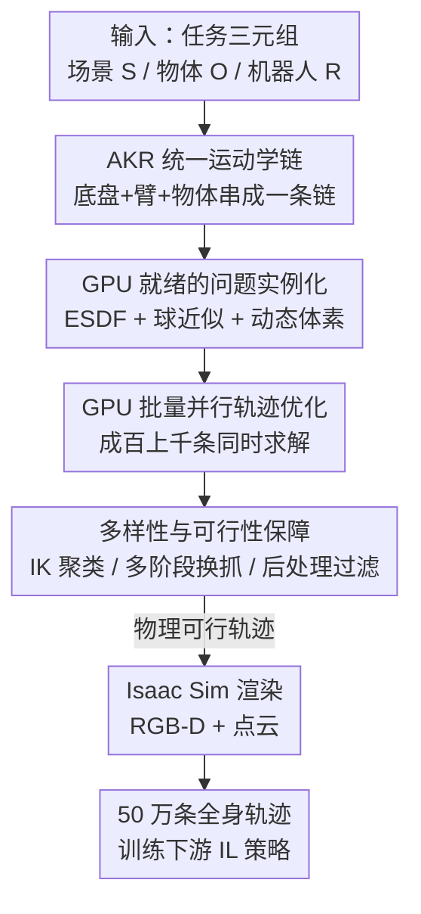

# Scalable Trajectory Generation for Whole-Body Mobile Manipulation

**会议**: CVPR 2026  
**论文**: [CVF Open Access](https://openaccess.thecvf.com/content/CVPR2026/html/Niu_Scalable_Trajectory_Generation_for_Whole-Body_Mobile_Manipulation_CVPR_2026_paper.html)  
**代码**: https://automoma.pages.dev/ （项目页）  
**领域**: 机器人 / 具身智能  
**关键词**: 全身移动操作、轨迹生成、GPU 加速运动规划、增强运动学表示、模仿学习

## 一句话总结
AutoMoMa 把移动底盘、机械臂和被操作物体统一成单条"增强运动学链（AKR）"，再把轨迹优化和碰撞检测整体搬到 GPU 上批量并行，从而以每 GPU·小时 5000 条的速度（比 CPU 基线快约 80 倍）自动合成 50 万条物理可行的全身协调轨迹，证明此前阻碍全身移动操作策略学习的根本瓶颈是数据规模而非算法。

## 研究背景与动机
**领域现状**：让机器人在真实的非结构化房间里干活，必须"全身协调"——底盘和机械臂同时动才能完成开门、推椅子、开洗碗机这类任务。和固定底座的桌面操作不同，移动操作把底盘的全屋移动性叠加进搜索空间，构型维度直接膨胀到 10 自由度左右（底盘 3 + 臂 7），而在严苛的关节约束、铰接约束和碰撞约束下，合法解在这个高维空间里极其稀疏。要学到可靠的全身策略，所需数据量比固定底座任务高出几个数量级。

**现有痛点**：可大规模生成这种数据的手段全都不灵。遥操作（如 Mobile ALOHA）能采到高保真全身演示，但靠人手动操作，疲劳和硬件限制让数据量卡在几百到几千条；仿真强化学习探索代价高、sim-to-real gap 大；基于规划的方法能保证物理可行，但 CPU 实现慢到离谱——AKR 框架的 CPU 求解器每小时只能产出 60 条轨迹。结果就是已有数据集只能在"规模、多样性、运动学保真度"三者里被迫三选一甚至二选一。

**核心矛盾**：AKR 这套把底盘/臂/物体统一建模的运动学表示，本来是这个任务最对路的原理性基础，却被 CPU 求解器的吞吐量死死压住，无法放大到训练泛化策略所需的规模。也就是说，缺的不是建模思想，而是"高保真运动学建模"与"现代并行硬件吞吐量"之间的桥。

**本文目标**：造一条可扩展的流水线，在保持 AKR 物理/运动学保真度的前提下，把全身协调轨迹的生成吞吐量提升几个数量级，覆盖多场景、多铰接物体、多机器人本体；并用下游策略实验回答"到底要多少数据才够"。

**核心 idea**：用 GPU 并行的轨迹优化与碰撞检测，把 AKR 规划整体批量化——既不牺牲单条轨迹的运动学严格性，又一次性求解成百上千条，把单 GPU·小时的产量从 60 条量级抬到 5000 条量级。

## 方法详解

### 整体框架
AutoMoMa 的输入是一个任务三元组 $(S, O, R)$——场景 $S$、物体集 $O$、机器人本体 $R$，输出是大批物理可行、带同步多模态观测（RGB-D + 点云）的全身轨迹。整条流水线串成四个阶段：**任务规范** 定义环境/物体/机器人上下文 → **问题实例化** 把原始几何转成可送进 GPU 规划器的图元（ESDF 距离场 + 球近似碰撞体 + 组装好的 AKR 链） → **轨迹生成** 在统一的 AKR 构型空间里求解带约束的优化问题，产出协调的全身运动 → **渲染** 在 Isaac Sim 里把每个轨迹点渲成同步的 RGB-D 与点云。其中真正的两个贡献支点是 **AKR 统一运动学链** 和 **GPU 批量并行优化**，前者保证物理保真，后者保证规模。

### 关键设计

**1. AKR 统一运动学链：把底盘、臂、物体焊成一条链以联合优化**

全身移动操作的难点在于底盘、机械臂、被操作物体三者的运动学互相耦合，分开规划（先动底盘再动臂）很容易解出物理上对不上的轨迹。AutoMoMa 沿用并落地了 AKR（Augmented Kinematic Representation）：把机器人运动学树、物体运动学树、以及末端执行器到物体抓取点的变换三者拼成**一条串行运动学链**。具体做法有两步关键操作：一是引入**虚拟底盘**，用两个正交的平移关节 + 一个旋转关节来建模底盘在地面上的平面运动，让"开车走位"也变成链上的关节；二是把物体通过一个编码抓取位姿的**虚拟关节**挂到末端，并对铰接物体做**运动学反转**——把物体的运动学根从原本的环境锚点（如固定的橱柜底座）翻转到抓取点，使整条链从世界坐标系出发、一路经底盘→臂→物体、终止于物体的环境锚点。反转不是简单调换父子关系，所有变换、分支结构、旋转/平移关节相对子链坐标系的定义都要严格重算，否则碰撞几何会错位。

这样一来，AKR 状态写成 $x = [q_B^T, q_M^T, q_O^T]^T \in \mathcal{X}_{free}$，其中 $q_B \in \mathbb{R}^3$ 是底盘位姿、$q_M \in \mathbb{R}^n$ 是臂的关节构型、$q_O \in \mathbb{R}^m$ 是铰接物体的关节状态（刚体时 $m=0$）。三者被统一进同一个构型空间后，规划就退化成"在 $\mathcal{X}_{free}$ 里找一条满足约束的轨迹 $x_{1:T}$"，并施加一组约束：

$$h_{chain}(x[t]) = 0,\quad \|f_{task}(x[T]) - g_{goal}\|_2^2 \le \xi_{goal},\quad x_{min} \le x[t] \le x_{max}$$

其中 $h_{chain}$ 强制环境施加的铰接约束（如门的合页只能绕轴转、椅子只能在地面平移），$f_{task}$ 把终态映射到任务目标空间并要求落在容差 $\xi_{goal}$ 内，位置/速度/加速度还各有上下界（$\|\Delta x[t]\|_\infty \le \Delta x_{max}$ 等）。把物体变成"机器人的运动学延伸"后，底盘移动、臂操作、物体被怎么带动这三件事在同一次优化里被联合考虑，这是它能产出真·协调全身运动、而非拼接式伪协调的根本原因。

**2. GPU 就绪的问题实例化：把场景几何榨成 GPU 能批量碰撞检测的图元**

AKR 解决了"怎么建模"，但要把规划搬上 GPU 还得先把场景几何改造成适合大规模并行查询的形式，否则碰撞检测会成为新瓶颈。这一阶段做三件事。其一，每个场景被转成**欧氏符号距离场（ESDF）**以加速环境距离查询，并把规划查询限制在由物体起止状态定义的轴对齐包围盒内，只算局部工作空间、砍掉无关开销。其二，所有连杆几何用**拟合球**近似——这是为 GPU 高吞吐碰撞检测量身定做的表示；拟合前先把网格缩小一点以防体积高估、保证保守避障，体素化引入平移偏移时再把球簇质心与原网格重新对齐，永久接触的相邻连杆对（如底座与立柱）则直接 mask 掉以省算力。其三，针对操作前后碰撞语义会变的问题用了**动态体素策略**：接近阶段，与物体相交的环境体素被临时清空、换成高分辨率网格，避免离散化误差把合法抓取位姿堵死；操作阶段，物体已变成 AKR 链上的一节连杆，它原本的静态环境网格被移除，只保留严格在物体当前体积之外的体素，消除与物体初始状态的假阳性碰撞。没有这套预处理，GPU 上的批量碰撞检测要么不准要么不快。

**3. GPU 批量并行轨迹优化：把"一次解一条"变成"一次解上千条"**

这是 80 倍加速的来源。AutoMoMa 把轨迹生成形式化为统一 AKR 构型空间里的约束优化，目标函数同时压低总行程和轨迹不平滑度：

$$J(x_{1:T}) = \sum_{t=1}^{T-1} \|W_v \,\Delta x[t]\|_2^2 + \sum_{t=2}^{T-1} \|W_a \,\Delta \dot{x}[t]\|_2^2,\qquad x^\star_{1:T} = \arg\min_{x_{1:T}} J(x_{1:T})$$

对角权重矩阵 $W_v, W_a$ 用来调节协调策略（例如交互时优先保持底盘稳定）。任务目标按物体类型给定：刚体搬运给目标 $SE(3)$ 位姿，铰接物体给特定关节构型（如开门角度）；约束也按物体—场景的物理关系派生（重物如椅子限制在 $SE(2)$ 平面运动，静止铰接物体则对末端施加严格位姿约束以模拟它固定在环境上）。关键在于，整套优化与碰撞检测被批处理到 GPU 上**同时求解成百上千个规划问题**，借助 GPU 加速的运动规划后端，AutoMoMa 达到每 GPU·小时 5000 条轨迹——相对每小时只能产 60 条的 CPU AKR 基线快约 80 倍。正是这个吞吐量把 AKR 从"原理上对、规模上没用"变成了能产 50 万条的数据引擎。

**4. 多样性与可行性保障：IK 聚类、多阶段换抓与后处理过滤**

光快还不够，数据得既多样又干净。AutoMoMa 在三处下功夫。起止构型通过对物体状态解**逆运动学（IK）**得到，为兼顾覆盖度与开销，把相似 IK 解在关节空间**聚类**、只保留一组紧凑的代表性候选构型，从而让轨迹的底盘落位分布得足够广（每个物体配约 20 个 AO-Grasp 抓取标注，每个抓取约 30 个 IK 解再聚类）。遇到运动学极限或碰撞导致一次连续抓取做不到的复杂任务（如在狭窄空间开洗碗机），用**多阶段策略**：采样一个中间状态 $\phi_{mid}$，把轨迹拆成 $[\phi_0 \to \phi_{mid}]$ 和 $[\phi_{mid} \to \phi_T]$ 两段，中间插一个无碰撞的重新抓取动作。最后做**后处理过滤**，逐个航点校验约束：对静止铰接物体计算物体—世界附着的平移偏差 $d = \|p(x[t]) - p(x_{ref})\|_2$ 与旋转偏差 $\theta = \arccos(2\langle r(x[t]), r(x_{ref})\rangle^2 - 1)$，平面约束再额外约束竖直位移 $d_z$ 与滚转/俯仰偏差；超阈值的轨迹一律丢弃，保证最终数据集只含稳定、物理合理的全身运动。

### 渲染
四阶段的收尾在 NVIDIA Isaac Sim 里完成：在机器人本体和环境中布置同步的自我中心视角与固定视角 RGB-D 相机，对每个航点 $x[t]$ 渲染 RGB 与深度图并投影成仿真世界坐标系下的 3D 点云，让每个关节空间构型都配上对应的几何与视觉上下文。渲染框架可扩展——相机摆位可定制，已存轨迹可在不同光照、相机配置、传感模态下重放，便于支撑模仿学习、视觉伺服、可供性检测等多种下游任务。

## 实验关键数据

### 数据集对比
AutoMoMa 同时拿下了此前数据集只能三选一的"规模 + 多样性 + 高保真关节空间轨迹"，且是少数提供真正全身底盘—臂协调的数据集。

| 数据集 | 机器人 | Episode 数 | 全身协调 | 场景数 | 采集方式 |
|--------|--------|-----------|---------|--------|----------|
| RT-1 [4] | Google Robot | 73,499 | 是 | 10 | VR 遥操作（仅末端位姿） |
| BC-Z [18] | Google Robot | 39,350 | 是 | 2–3 | VR 遥操作（仅末端位姿） |
| Mobile ALOHA [13] | Mobile ALOHA | 276 | 是 | 5 | 主从遥操作（关节位置） |
| DobbE [36] | Hello Stretch | 5,208 | 是 | 216 | 工具式遥操作（仅末端位姿） |
| TidyBot [44] | TidyBot | 24 | 否 | 104 | 脚本化原语 |
| **Ours (AutoMoMa)** | 多机器人 | **500,000** | **是** | **330** | **自动运动规划（关节位置）** |

### 数据规模化实验（DP3 策略，微波炉开门任务）
策略用 SOTA 的 3D 扩散方法 DP3，成功判据是 300 步内门到达目标角度，每设置 50 次随机试验取平均。核心发现是"数据量是绑定约束"。

| 实验维度 | 设置 | 关键结果 |
|----------|------|----------|
| 固定 vs 移动底座（单场景） | 逐步加到 3200 条 | 固定底座 <800 条即 100% 成功；移动底座 seen 仅饱和在约 70% |
| 场景多样性扩展 | 1 → 30 个场景，每场景 1k 条 | unseen 成功率随场景数稳步提升，几何多样性是泛化主驱动 |
| 轨迹密度扩展 | 固定 30 场景，密度从 750 加到 30000 | seen/unseen 一致泛化到约 75% 成功 |
| 架构泛化 | DP3 / DP / ACT | 三种架构均随密度提升而增益，DP3 因 3D 模态最优 |
| 物体稳定性 | 100k 规模、5 个 SAPIEN 物体 | 多数物体 seen 成功率 >50%，个别物体因铰接约束限制工作空间而方差大 |

### 生成效率
- 吞吐量：每 GPU·小时约 5000 条轨迹，比 CPU 基线（约 60 条/小时）快约 80 倍。
- 规模：50 万条以上物理可行轨迹，跨 330 个场景、多种铰接物体、三种机器人本体（Summit Franka、TIAGo、R1）。
- 每条轨迹 30 个关节空间航点，配 4096 点点云、每轨迹渲染 120 帧 RGB-D。

### 关键发现
- **数据稀缺才是真瓶颈**：即便单个铰接物体任务，SOTA 方法也要数万条演示才能到约 80% 成功，证明卡住全身移动操作的是数据规模而非算法本身——这是全文最重要的实证结论。
- **底盘移动性指数级放大难度**：移动底座因 10 自由度底盘—臂耦合，单场景就算到 3200 条也只饱和在约 70%，而固定底座 800 条不到就满分，量化了"移动"带来的额外数据需求。
- **单场景高密度 ≠ 理解场景**：在单一场景里堆轨迹密度，策略会"流形记忆"而非学到场景理解，对同一工作空间内的新 IK 起点显著退化；要泛化必须靠跨场景的几何多样性。
- **多样性与密度可互补**：扩场景数与扩单场景密度带来的提升量级相当，二者都能把 seen/unseen 成功率推到约 75%。

## 亮点与洞察
- **"统一链 + GPU 批量"是把老原理放大的范式**：AKR 的统一运动学建模思想不是新的，但把它整体并行化、配上 ESDF/球近似/动态体素这套 GPU 就绪的几何预处理，硬生生把吞吐量抬了 80 倍——这个"原理早就对、缺的是工程化放大"的路子，对其他被求解器拖慢的规划类任务很有借鉴价值。
- **运动学反转把铰接物体变成链的延伸**，让"机器人怎么动 + 物体被怎么带动"在一次优化里联合求解，是产出真协调（而非分别规划底盘和臂再拼接）的关键巧思。
- **动态体素策略**针对"接近态"和"操作态"碰撞语义不同分别处理，是把球近似碰撞落地时一个很实用的细节，避免离散化误差堵死合法抓取。
- **用数据规模化实验反推"瓶颈在数据"**这一研究方法本身就是贡献：与其继续改算法，不如先把数据管够，再看 SOTA 能走多远——结论直接重新定义了该领域的努力方向。

## 局限与展望
- **依赖已知几何与运动学**：流水线需要已知的场景几何和物体运动学模型，不支持动态人机交互、也不支持可变形物体，离真正开放世界还有距离。
- **球近似的几何误差**：为 GPU 加速而做的球近似碰撞体偶尔会引入几何不准，导致执行失败——速度与保真之间仍有未完全消解的取舍。
- **个别物体方差大**：如物体 ID 46197 因铰接约束限制了机器人工作空间，成功率不稳，说明数据规模并非万能，物理可达性本身会设上限。
- **仿真为主**：虽然在真实 UR5-Ridgeback 平台上做了验证，但主体实验在 Isaac Sim 内，sim-to-real 的系统性评估仍偏薄。
- 作者计划引入基于学习的生成方法、并做社区驱动工具以便扩展到新机器人和新环境。

## 相关工作与启发
- **vs Mobile ALOHA / 遥操作**：遥操作采的是高保真真实演示，但靠人手、受疲劳和硬件限制只能到几百条；AutoMoMa 用自动规划把同样具备全身协调的数据量推到 50 万条，规模差三个数量级，代价是数据来自仿真规划而非真人。
- **vs CPU 版 AKR 规划器**：两者运动学建模同源（都用 AKR 单链），区别在求解后端——CPU 版每小时 60 条、被吞吐量锁死只能做窄用途数据集，AutoMoMa 把优化与碰撞检测批量搬上 GPU 实现约 80 倍加速，才把同一套原理放大到可训泛化策略的规模。
- **vs MoMaGen 等数据增广**：增广类方法从已有演示抽任务信息再重生成轨迹，但常用解耦规划器分别生成底盘与臂的运动，得不到真正的全身行为；AutoMoMa 靠 AKR 统一链从底层保证底盘—臂—物体联合优化。
- **vs 端到端深度 RL（仿真全身控制）**：RL 自动采数据但样本效率低、易过拟合特定环境且 sim-to-real gap 大；AutoMoMa 走"先用规划把物理可行数据管够、再训 IL 策略"的路线，绕开了 RL 探索代价，并实证了 IL 在足够数据下能泛化。

## 评分
- 新颖性: ⭐⭐⭐⭐ 把 AKR 整体 GPU 并行化 + 配套几何预处理实现 80 倍加速，工程系统性创新强，单一组件多为已有原理的落地组合。
- 实验充分度: ⭐⭐⭐⭐ 多维度数据规模化实验扎实、跨三种 IL 架构与多物体验证，并有真机验证；但消融偏向"数据维度"而非方法组件，主体仍在仿真。
- 写作质量: ⭐⭐⭐⭐ 动机—瓶颈—方法—实证逻辑清晰，AKR 构造与流水线讲得明白，公式与图配合到位。
- 价值: ⭐⭐⭐⭐⭐ 50 万条全身移动操作轨迹 + "瓶颈是数据"的实证结论，为该方向补上了长期缺失的基础设施，影响面大。

<!-- RELATED:START -->

## 相关论文

- [\[CVPR 2026\] End-to-End Language-Action Model for Humanoid Whole Body Control](end-to-end_language-action_model_for_humanoid_whole_body_control.md)
- [\[CVPR 2026\] Beyond Mimicry: Learning Whole-Body Human-Humanoid Interaction from Human-Human Demonstrations](beyond_mimicry_learning_whole-body_human-humanoid_interaction_from_human-human_d.md)
- [\[CVPR 2026\] IGen: Scalable Data Generation for Robot Learning from Open-World Images](igen_scalable_data_generation_for_robot_learning_from_open-world_images.md)
- [\[NeurIPS 2025\] DexFlyWheel: A Scalable Self-Improving Data Generation Framework for Dexterous Manipulation](../../NeurIPS2025/robotics/dexflywheel_a_scalable_and_self-improving_data_generation_framework_for_dexterou.md)
- [\[CVPR 2026\] DynBridge: Bridging Imagination and Control through Interaction Dynamics for Robot Manipulation](dynbridge_bridging_imagination_and_control_through_interaction_dynamics_for_robo.md)

<!-- RELATED:END -->
