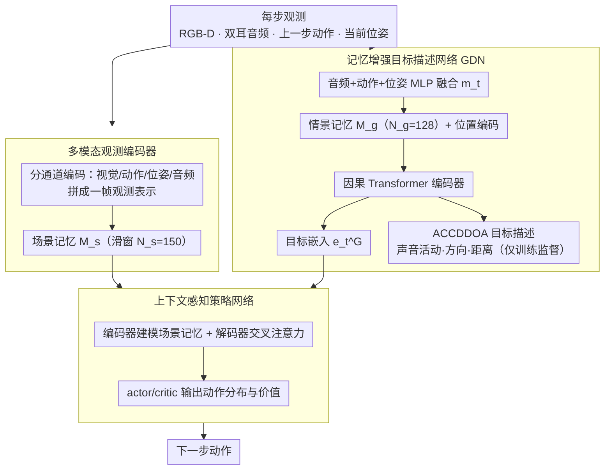

# Semantic Audio-Visual Navigation in Continuous Environments

**会议**: CVPR 2026  
**arXiv**: [2603.19660](https://arxiv.org/abs/2603.19660)  
**代码**: [https://github.com/yichenzeng24/SAVN-CE](https://github.com/yichenzeng24/SAVN-CE)  
**领域**:机器人
**关键词**: 音视觉导航, 连续环境, 记忆增强, 目标推理, 具身智能

## 一句话总结
本文提出 SAVN-CE 任务，将语义音视觉导航扩展到连续3D环境中，并设计 MAGNet（记忆增强目标描述网络），通过融合历史上下文和自运动线索实现在目标声音消失后的稳健目标推理，成功率绝对提升最高达 12.1%。

## 研究背景与动机
1. **领域现状**：音视觉导航（AVN）让具身智能体利用听觉和视觉线索在未知环境中导航到发声目标。语义音视觉导航（SAVN）进一步要求目标是语义上有意义的物体（如"椅子在吱嘎作响"），而非任意位置。
2. **现有痛点**：现有方法依赖预计算的房间脉冲响应（RIR），需要TB级存储空间，且智能体只能在离散网格点上移动（1米分辨率、4个固定朝向），严重限制了任务的真实性。
3. **核心矛盾**：离散环境使得观测在空间上不连续，智能体无法自由探索；而连续环境下目标声音可能间歇性静默甚至完全停止发声，导致目标信息丢失。
4. **本文目标** (a) 如何在连续环境中实现自由移动的音视觉导航？(b) 当目标声音消失时，如何维持稳定的目标表示？(c) 如何同时推断目标的空间位置和语义类别？
5. **切入角度**：作者观察到自运动线索（上一步动作+当前位姿）可以推断目标相对位置的动态变化，而通过情景记忆可以在声音消失后保持目标表示的时间连续性。
6. **核心 idea**：用记忆增强的 Transformer 编码器融合双耳音频、自运动线索和情景记忆，实现声音消失后的持续目标追踪。

## 方法详解

### 整体框架
MAGNet 要解决的核心难题是：在连续 3D 环境里，发声目标的声音会间歇静默甚至彻底停止，一旦没了声音，传统方法就丢失了目标方位。整篇的思路是把"听到声音那一刻的目标信息"沿时间维护下去——靠的是一条情景记忆和一条自运动推理链。具体地，每一步先把 RGB-D、双耳音频、上一步动作和当前位姿编码成统一嵌入，一份存进场景记忆供策略使用，一份送进目标描述网络（GDN）推断目标在哪、是什么；GDN 输出的目标嵌入再喂给一个 Transformer 编码-解码的策略网络，结合历史场景记忆决定下一步往哪走。三个模块（观测编码器、GDN、策略网络）首尾相接，共同维持"声音消失后目标依然可追"的能力。

### 关键设计

**1. 多模态观测编码器：把异构感官信号压成一个能进记忆的向量**

连续环境的步长缩到 0.25s，观测比离散网格密集得多，编码器必须既高效又保留长期历史。这里的做法是分通道编码再拼接：RGB 和深度图各过一个 ResNet-18，前一动作过嵌入层，归一化位姿 $[x/d, y/d, \sin\theta, \cos\theta, t/t_{max}]$ 过全连接层，双耳波形则用 STFT 转成复数谱图、提取 4 通道声学特征（平均幅度谱、ICP 相位差的正弦/余弦、ILD），再过 3 层卷积。其中相位差和 ILD（双耳强度差）是关键——它们直接编码了声源的左右方位信息。所有嵌入拼成一帧观测表示，存进一个容量 $N_s=150$ 的滑动窗口场景记忆，既给策略提供上下文，也是后续时间建模的原料。

**2. 记忆增强目标描述网络（GDN）：声音消失后靠自运动+记忆把目标"算"出来**

这是全篇针对"声音间歇/消失"痛点的核心模块。直觉是：即使听不到声音，只要知道上一刻目标在哪、自己又怎么动了，就能推算目标现在的相对方位。每一步把双耳音频嵌入、动作嵌入、位姿嵌入经 MLP 融合成 $m_t$，压入容量 $N_g=128$ 的情景记忆；记忆序列加位置编码后送入**因果** Transformer 编码器（因果掩码防止未来信息泄露），同时吐出两个东西：一是目标嵌入 $e_t^G$ 交给策略网络，二是 ACCDDOA 格式的目标描述 $y_{ct} = [a_{ct}R_{ct}, d_{ct}]$，把声音活动状态 $a_{ct}$、方向单位向量 $R_{ct}$ 和归一化距离 $d_{ct}$ 打包成一个紧凑向量用于训练监督。之所以这套能在静默时仍稳，是因为自运动线索给出的是确定性的几何更新——TurnLeft/TurnRight 让目标方位角精确平移 $\pm15°$，MoveForward 同时改变方位和距离；而细粒度动作空间（0.25m 前进 / 15° 转弯）把每一步的位置变化压得很小，让记忆里的目标轨迹平滑、可追。

**3. 上下文感知策略网络：让决策看见整段历史而不只是当前帧**

部分可观测的连续环境里，只看当前帧很容易决策抖动，所以策略网络也用 Transformer 把历史串起来。编码器吃下场景记忆 $M_{s,t}$ 建模时间依赖，解码器以当前观测嵌入为 query、编码后的记忆为 key/value，做交叉注意力得到上下文感知的潜状态 $s_t$；$s_t$ 再分头送进 actor 和 critic 全连接层，分别输出动作分布和状态价值。这样策略既能利用 GDN 给的目标嵌入"知道往哪走"，又能借注意力把过去若干步的观测纳入考量，在声音断续时仍做出连贯的导航决策。

### 一个完整示例：声音中途静默后如何继续追踪
设第 $t$ 步智能体还能听到"吱嘎作响的椅子"在右前方，双耳特征给出方位角约 $+30°$、距离归一化 $0.5$；GDN 把这帧融合特征压入情景记忆，输出 $a_{ct}=1$（声音活跃）、方向向量指向右前、距离 $0.5$。下一步声音突然停了（$t+1$）：观测编码器收到的双耳特征不再含方位信息，但智能体执行了一次 TurnRight。此时 GDN 不依赖当前音频，而是读情景记忆里 $t$ 步的目标描述，叠加自运动几何更新——TurnRight 让目标方位角减 $15°$，于是把方位从 $+30°$ 修正到约 $+15°$，距离基本不变。即便接下来连续几步都静默，记忆 + 自运动链条仍能逐步外推目标的相对方位，策略网络据此持续朝目标方向前进，而不是因为"听不到了"就原地打转——这正是 MAGNet 相比依赖加权历史聚合的 SAVi 在声音消失场景更稳的原因。

### 损失函数 / 训练策略
- GDN 使用 MSE 损失在线监督训练，利用 oracle ACCDDOA 标签，采用因果注意力防止未来信息泄露
- 策略网络使用 DD-PPO 训练，遵循 SAVi 的两阶段范式
- 奖励：成功 +10，到目标的测地距离变化的中间奖励，每步 -0.01 时间惩罚
- 每次迭代 150 步 rollout，在 128 CPU + 4 A800 GPU 上训练约 14 天

## 实验关键数据

### 主实验

| 方法 | SR↑ | SPL↑ | SNA↑ | DTG↓ | SWS↑ |
|------|-----|------|------|------|------|
| AV-Nav | 21.3 | 17.8 | 13.1 | 10.7 | 4.0 |
| SMT+Audio | 24.8 | 21.0 | 16.8 | 10.1 | 5.3 |
| SAVi | 25.6 | 21.2 | 17.3 | 10.1 | 6.0 |
| **MAGNet** | **37.7** | **32.9** | **27.4** | **8.0** | **10.6** |
| Oracle1 | 41.4 | 37.8 | 31.0 | 6.3 | 13.0 |
| Oracle2 | 75.0 | 63.7 | 51.9 | 4.2 | 48.4 |

Clean 环境下，MAGNet 相比 SAVi 提升 12.1% SR（绝对值），SWS 提升 4.6%。

### 消融实验

| 配置 | SR↑ | SPL↑ | SWS↑ |
|------|-----|------|------|
| w/o GDN | 32.4 | 27.9 | 6.3 |
| GDN w/o Memory | 33.9 | 29.8 | 8.9 |
| GDN w/o Self-motion | 34.3 | 30.4 | 7.8 |
| Full MAGNet | **37.7** | **32.9** | **10.6** |

### 关键发现
- 去掉 GDN 后 SR 降 5.3%，但仍超过所有 baseline，说明策略网络本身已很强
- 情景记忆的贡献（+3.8% SR）大于自运动线索（+1.9% SR），但两者结合效果最佳
- 干扰环境下所有方法性能下降，MAGNet 虽然 SR 仅从 37.7 降到 19.3，但 DSR（误触干扰源率）最高达 7.8%，说明声学相似干扰是主要瓶颈
- Oracle2 vs Oracle1 的巨大差距（75.0 vs 41.4）表明声音消失后目标信息丢失是核心挑战

## 亮点与洞察
- **ACCDDOA 格式统一描述目标**：将声音活动状态、到达方向单位向量和距离融合为一个紧凑的向量表示，非常优雅地将 SELD 任务与导航结合起来
- **自运动线索的物理可解释性**：TurnLeft/TurnRight 精确改变目标方位角 ±15°，这种显式的几何关系使得网络更容易学习声音消失后的目标位置更新
- **连续环境数据集构建**：声音起始时间从 [0,5]s 均匀采样，持续时间服从高斯分布（均值 15s，标准差 9s），测试集平均 oracle 动作数 78.49（离散设定仅 26.52），大幅提升了任务难度

## 局限与展望
- Oracle2 与 MAGNet 的巨大差距（75.0 vs 37.7）表明 GDN 仍有很大提升空间
- 干扰环境下 DSR 最高，说明对声学相似干扰的区分能力不足
- 仅支持单目标导航，未来可扩展到多目标、动态目标场景
- 训练成本高（14天，128 CPU + 4 GPU），限制了大规模实验

## 相关工作与启发
- **vs SAVi**: SAVi 依赖加权因子 λ 聚合历史估计，本文用 Transformer 情景记忆替代，在声音消失后表现更好
- **vs VLN-CE**: VLN-CE 有语言指令提供明确目标，SAVN-CE 需要从部分感知中推断目标，更具挑战性

## 评分
- 新颖性: ⭐⭐⭐⭐ 连续环境 + 记忆增强 GDN 的组合较为新颖，但各组件设计较为standard
- 实验充分度: ⭐⭐⭐⭐⭐ 消融全面，GDN评估、因素分析、轨迹可视化俱全
- 写作质量: ⭐⭐⭐⭐ 论文结构清晰，任务定义明确
- 价值: ⭐⭐⭐⭐ 为音视觉导航提供了更真实的连续环境基准

<!-- RELATED:START -->

## 相关论文

- [\[ICCV 2025\] NavMorph: A Self-Evolving World Model for Vision-and-Language Navigation in Continuous Environments](../../ICCV2025/robotics/navmorph_a_self-evolving_world_model_for_vision-and-language_navigation_in_conti.md)
- [\[CVPR 2026\] Progress-Think: Semantic Progress Reasoning for Vision-Language Navigation](progress-think_semantic_progress_reasoning_for_vision-language_navigation.md)
- [\[CVPR 2026\] TrajRAG: Retrieving Geometric-Semantic Experience for Zero-Shot Object Navigation](trajrag_retrieving_geometric-semantic_experience_for_zero-shot_object_navigation.md)
- [\[CVPR 2026\] Towards Open Environments and Instructions: General Vision-Language Navigation via Fast-Slow Interactive Reasoning](towards_open_environments_and_instructions_general_vision-language_navigation_vi.md)
- [\[CVPR 2026\] Bridging the 2D-3D Gap: A Hierarchical Semantic-Geometric Map for Vision Language Navigation](bridging_the_2d-3d_gap_a_hierarchical_semantic-geometric_map_for_vision_language.md)

<!-- RELATED:END -->
