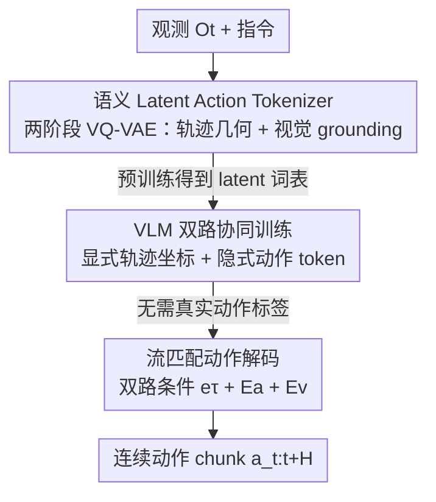

# SemanticVLA: Towards Semantic Reasoning over Action Memorization via Synergistic Explicit Trace and Latent Action Planning

**会议**: CVPR 2026  
**论文**: [CVF Open Access](https://openaccess.thecvf.com/content/CVPR2026/html/Ni_SemanticVLA_Towards_Semantic_Reasoning_over_Action_Memorization_via_Synergistic_Explicit_CVPR_2026_paper.html)  
**代码**: 无  
**领域**: 具身智能 / VLA  
**关键词**: 视觉-语言-动作, 显式轨迹推理, 隐式动作 token, VQ-VAE, 流匹配

## 一句话总结
SemanticVLA 用「显式轨迹推理 + 隐式动作 token」双路设计，把 VLM 原生的空间 grounding 能力真正用起来去做机器人操作，在 LIBERO 上拿到 97.0% 成功率、SimplerEnv WidowX 上 65.1%，并且在指令改写、长程与推理密集任务上比基线稳得多。

## 研究背景与动机

**领域现状**：VLA（Vision-Language-Action）的主流范式是「双系统」——预训练 VLM 当 System 2 做高层推理，下游的 action expert（扩散 / 流匹配）当 System 1 做低层电机控制，两者之间用 VLM 吐出的 latent embedding 来对接。

**现有痛点**：作者观察到当前 VLA 有一个尴尬的脆弱性——它们能完成「把海绵放到 5 号卡片上」这种直白指令，却在语义等价但表述不同的「把海绵放到白板上数学题的答案处」上崩掉。也就是说，模型其实是在**记动作模式**，而不是真在理解语义。指令一改写就掉点，遇到需要推理的任务更是急剧下滑。

**核心矛盾**：这种脆弱来自两个结构性问题。其一，action loss 的梯度反传穿过 VLM 参数，会把 VLM 优化成「针对具体任务做模式匹配」，破坏掉它本来的组合式理解能力；其二，VLM 和 action expert 之间靠的是没有显式监督的不透明 latent embedding，在纯动作监督下这些表示会迅速漂向「拟合动作」，把预训练好的基础模型退化成一个参数很重的融合编码器。已有的两条补救路线各有取舍：co-training（混入通用多模态数据）能"保住"推理能力却无法真正"用起来"；latent action 方法注入语义却又有记忆动作模式的风险。

**本文目标 + 切入角度**：作者要设计一个真正调用 VLM 原生推理、同时又能给 action expert 稳定且语义 grounded 引导的接口。关键观察是：**轨迹（trace）预测天然契合 VLM 的空间 grounding 能力**——把"末端执行器要往哪走"显式写成坐标序列，正好复用 VLM 在视觉-语言预训练里学到的空间定位，相当于给操作规划一个可解释的"思考过程"。

**核心 idea**：用「显式轨迹推理」(走哪里，可解释但对数值敏感) 和「隐式 latent action token」(怎么操作，视觉 grounded 但抽象) 两条互补路径协同——轨迹给 latent 提供空间监督与脚手架，latent 用视觉注意力补偿轨迹的坐标不精确，从而让模型靠语义推理而非动作记忆来工作。

## 方法详解

### 整体框架

SemanticVLA 要解决的是「怎么让 VLM 的推理能力真正传导到机器人动作上，而不是被动作监督带歪」。整条 pipeline 分三个阶段串行：先离线把「轨迹 → 隐式动作 token」的语义词表训练好（不碰语言、不碰动作），再让 VLM 同时学会预测显式轨迹坐标和这些 latent token（这一步**不需要真实动作标签**），最后才接上 action expert 用流匹配把离散表示解码成连续动作 chunk。贯穿始终的原则是：VLM 只通过「结构化轨迹坐标 + 紧凑 latent token」给出干净的语义引导，**绝不直接暴露在原始动作监督下**，以免推理能力被腐蚀。

整张图自上而下就是「输入 → 三个贡献阶段 → 输出动作」，下面三个关键设计正好对应中间三个贡献节点。

### 关键设计

**1. 语义 Latent Action Tokenizer：用轨迹而非语言来 grounding 紧凑动作 token**

痛点很直接：现有 latent action token 要么从原始动作学（缺操作语义）、要么从视觉重建学（把任务无关的外观变化也缠进去），用语言来注入语义（如 UniVLA）又会过拟合到具体措辞、且轨迹级描述去条件 token 级表示存在时间错位。作者的洞察是——**轨迹是天然更好的条件锚点**：每段轨迹和它对应的动作窗口在时间上严格对齐，而且轨迹是几何不变量，换一种语言说法它依然稳定，本身就用空间结构编码了操作语义。

具体用**两阶段 VQ-VAE**。第一阶段只在坐标序列上做几何抽象：给定轨迹 $\tau=(p_1,\dots,p_L)$、$p_i=(u_i,v_i)\in[0,1]^2$，用带时序卷积的编码器 $\phi^{trace}_{enc}$ 抽特征再量化 $q_{trace}=\arg\min_k\lVert z_{trace}-c^{trace}_k\rVert^2$，重建损失让码本学到「抓取弧线、放置动作」这类对外观/光照/布局不变的纯几何基元。第二阶段做视觉 grounding：用 DINOv2 抽观测 $o_t,o_{t+H}$ 的视觉特征 $h_{visual}$，和第一阶段的几何码本项 $c^{trace}_{q_{trace}}$ 通过 cross-attention 融合，让几何先验动态去注意任务相关的视觉区域、压掉背景噪声，得到最终 latent token $e_a=c^a_{q_a}$。为保证它同时保留几何结构和视觉语义，用**双重重建监督**：轨迹解码器 $\phi^{spatial}_{dec}$ 保几何精度、视觉解码器 $\phi^{visual}_{dec}$ 保语义理解，两个解码器预训练后都丢弃。整体目标 $\mathcal{L}_{LAT}=\mathcal{L}^a_{vq}+\mathcal{L}^{trace}_{recon}+\mathcal{L}^{visual}_{recon}$。这种「先纯几何、再视觉落地」的顺序设计，让 token 既知道「往哪动」（几何先验）又知道「怎么操作」（视觉特征），全程不靠语言，避免了语言变异性偏差。

**2. VLM 双路协同训练：显式轨迹与隐式 token 互补强化，且不碰真实动作**

有了 token 词表后，要让 VLM 把两条路径串起来。这一步的关键是两条路径互补：轨迹复用 VLM 预训练的空间理解做可解释规划，latent token 提供紧凑、视觉 grounded 的执行表示来补偿轨迹的数值敏感。**整个协同阶段不需要真实机器人动作**，监督完全来自空间轨迹和预训练好的 latent 词表。

轨迹这一路沿用 MolmoAct 的做法，把轨迹当成**归一化 2D 坐标序列、用 VLM 的原生语言接口当文本 token 自回归生成**：$p(\tau\mid o_t,\ell_t)=\prod_{j=1}^L p(p_j\mid o_t,\ell_t,\tau_{<j})$，交叉熵损失 $\mathcal{L}_{trace}$ 监督。这相当于把空间规划显式摊开成"思考过程"，不需要改动任何架构。latent 这一路则给 VLM 词表扩充一组特殊 token $\{\text{ACT}\_1,\dots,\text{ACT}\_K\}$ 索引进预训练码本，在生成完轨迹后再自回归预测一串 latent 动作 token 做 action chunking：$p(q_{1:N}\mid o_t,\ell_t,\tau)=\prod_{i=1}^N p(q_i\mid o_t,\ell_t,\tau,q_{<i})$。总损失 $\mathcal{L}_{VLM}=\mathcal{L}_{trace}+\mathcal{L}_{latent}$。这样轨迹给 VLM 的空间推理提供显式目标，latent token 又通过对任务相关上下文的视觉注意力补偿轨迹坐标不精确，反过来轨迹脚手架又帮 latent 过滤视觉变化、聚焦到操作相关区域——双向受益，且只用很小的词表扩充就保住了 VLM 能力。

**3. 流匹配动作解码：双路条件融合，弱正则保护 VLM 不退化**

VLM 产出的是离散 latent token 索引 $q_{1:N}$ 和显式轨迹坐标 $\tau$，但机器人执行需要连续动作 chunk $a_{t:t+H}\in\mathbb{R}^{H\times D}$，这一步用轻量流匹配解码器搭桥。它**同时吃两条路径的条件**：latent 这边取 VLM 最后一层关于 token 的隐状态 $E_a=\{h_{q_1},\dots,h_{q_N}\}$（编码了对视觉、空间规划、语言的多模态推理）；轨迹这边把预测坐标 $\tau$ 过**冻结的**轨迹编码器 $\phi^{trace}_{enc}$ 得到 $e_\tau$（抽出对视觉外观不变的纯空间-时序动态）。解码器对带噪动作 $a_t$ 在去噪时刻 $t\in[0,1]$ 做 $v_\theta(a_t,t,e_\tau,E_a,E_v)\to a_{t:t+H}$，其中 $e_\tau$ 给几何引导、$E_a$ 给语义 grounding、$E_v$ 给视觉上下文，通过 cross-attention 预测速度场迭代去噪生成动作。

最后阶段端到端微调，目标 $\mathcal{L}_{finetune}=\lambda_{VLM}\mathcal{L}_{VLM}+\mathcal{L}_{flow}$。这里 $\lambda_{VLM}$ 是**弱监督**——它的作用是保住协同阶段建立的双路推理、防止 VLM 在动作微调中退化成"拟合动作"。同时 VLM 上用 LoRA 微调、流解码器从头全量训练，既让 VLM 保留高层空间推理、又让解码器专注低层电机控制。这个弱正则是和「不让动作梯度污染 VLM」这一全局原则一脉相承的。

### 损失函数 / 训练策略

三阶段训练对应三个设计：Stage 1 在 TraceX-240K 上预训练语义 latent tokenizer 5 万步（batch 512），学干净几何基元；Stage 2 在同数据上协同训练 VLM 联合预测轨迹与 latent token 10 万步（batch 256），不解码动作；Stage 3 在下游 benchmark 上端到端微调，开启流匹配解码并用弱正则保护 VLM。VLM backbone 从 Prismatic-7B 初始化（沿用 UniVLA，集成 SigLIP + DINOv2 + LLaMA-2），全程 16 张 H200。数据上自建 **TraceX-240K**——从 Open X-Embodiment（Bridge V2 / Fractal / BC-Z）和 DROID 收 24 万条机器人轨迹，用 Molmo-72B 采关键帧做轨迹标注、CoTracker 插值得到稠密时间对齐的轨迹序列。

## 实验关键数据

### 主实验

LIBERO（Franka）和 SimplerEnv WidowX 两个仿真套件上，SemanticVLA 双榜第一：

| 基准 | 指标 | SemanticVLA | 次优 | 提升 |
|------|------|-------------|------|------|
| LIBERO | 平均成功率 | **97.0** | UniVLA 95.2 | +1.8 |
| LIBERO-Long | 长程成功率 | **94.4** | UniVLA 92.0 | +2.4 |
| SimplerEnv WidowX | 平均成功率 | **65.1** | MolmoAct 51.4 | +13.7 |
| WidowX Put Spoon | 成功率 | **83.6** | MolmoAct 70.3 | +13.3 |

真实 Franka 机器人上，覆盖长程组合任务（备餐、桌面分拣）与推理密集任务（数学计算、拼单词），共 62.3% 平均成功率，大幅领先：

| 模型 | 长程·备餐 | 长程·分拣 | 推理·数学 | 推理·拼词 | 平均 |
|------|-----------|-----------|-----------|-----------|------|
| OpenVLA | 16 | 10 | 6 | 3 | 8.8 |
| UniVLA | 47 | 41 | 27 | 16 | 32.8 |
| MolmoAct | 59 | 47 | 36 | 19 | 40.3 |
| π0 | 63 | 54 | 43 | 32 | 48.0 |
| **SemanticVLA** | **77** | **69** | **58** | **45** | **62.3** |

### 消融实验

LIBERO 指令改写下隔离轨迹引导预训练的作用（图 6 训练曲线）：

| 配置 | latent 预测准确率 | 改写后成功率 | 说明 |
|------|------------------|-------------|------|
| 完整 SemanticVLA | 93.6% | 87.6% | 双路完整 |
| w/o 显式轨迹 | 85.6% | 79.2% | 直接从 VLM embedding 预测 latent，掉 8.4 个点 |
| UniVLA latent | —（差 >12%） | 71.3% | 无轨迹监督的 latent，差距 >12% |

真机三种泛化轴（视觉扰动 / 任务变化 / 语言改写）下验证 latent 反过来稳定轨迹执行（图 7）：

| 配置 | 语言改写成功率 | 说明 |
|------|---------------|------|
| 完整 SemanticVLA | 56 | 完整双路 |
| w/o latent action planning | 48 | 去掉 latent 这一路 |
| MolmoAct | 33 | 扩词表加原始动作 token，腐蚀语言能力 |
| HAMSTER | 30 | 直接条件原始坐标，误差累积 |

### 关键发现
- **轨迹引导预训练是 latent 语义的关键来源**：在都不用显式轨迹推理的受控对比里，本文 latent 比 UniVLA latent 准确率/成功率高出 >12%，说明轨迹监督给码本注入了更丰富的语义 grounding，几何脚手架充当强归纳偏置过滤掉任务无关变化。
- **两条路径真的互补**：去掉显式轨迹，改写鲁棒性从 87.6% 掉到 79.2%（轨迹帮区分"真理解 vs 记模式"）；去掉 latent，语言改写从 56 掉到 48（latent 帮稳定轨迹的数值敏感）。
- **指令改写鲁棒性最强**：SemanticVLA 在 LIBERO 改写下仅掉 9.4%，而 OpenVLA 掉 18.4%、UniVLA 掉 23.9%；具备显式推理的 MolmoAct 掉 11.9%，印证"显式推理机制提升语言泛化"。
- **把动作 token 塞进 VLM 词表会伤推理**：MolmoAct 那种扩词表加原始动作 token 的做法，会因梯度干扰退化语言能力——这正是本文坚持"latent token + 流匹配解码器做模态分离"的实验依据。

## 亮点与洞察
- **用轨迹当 latent action 的"重建目标"是点睛之笔**：以往要么用语言注入语义（有变异偏差）、要么纯视觉重建（缠入外观），轨迹作为精确几何载体，天然同时给了语义 grounding 和视觉对齐，还和动作窗口时间严格对齐——一个表示替掉了两类缺陷。
- **"显式可解释 + 隐式鲁棒"的互补范式可迁移**：显式坐标负责"可解释、复用 VLM 推理"，隐式 token 负责"视觉 grounded、抗数值噪声"，这种「一条路解释、一条路兜底」的双路设计思路，可以搬到其他需要可解释中间表示又怕中间表示脆弱的任务（如导航 waypoint、规划草图）。
- **"不让动作梯度碰 VLM"贯穿全设计**：从三阶段把动作解码隔离到最后、到 $\lambda_{VLM}$ 弱正则、再到 LoRA + 从头训解码器的分工，整套工程都在守一条原则，逻辑非常自洽。

## 局限与展望
- 依赖 TraceX-240K 的轨迹标注质量，作者自己也承认目前用 Molmo-72B 均匀采关键帧 + CoTracker 插值，"更语义化的关键帧提取"可进一步提升标注质量——⚠️ 即标注 pipeline 还有改进空间，轨迹质量会直接影响下游。
- 轨迹是 2D 归一化坐标，对需要精细 3D / 深度推理的操作是否够用、对相机视角变化是否稳健，文中主要靠 DINOv2 视觉 grounding 间接补偿，缺直接的 3D 评测。
- 训练成本不低（16×H200，三阶段共 15 万步预训练 + 协同），latent 词表大小 $K$、动作 chunk 长度等超参的敏感性文中未充分展开。
- 真机评测每任务 20 rollouts / 5 变体，规模有限；推理密集任务（数学、拼词）虽领先，但 45%~58% 的绝对成功率离实用仍有距离。

## 相关工作与启发
- **vs MolmoAct**：两者都把轨迹当 VLM 语言接口里的辅助推理来生成。区别在 MolmoAct 直接扩词表加**原始动作 token**，梯度干扰会腐蚀 VLM 语言能力（消融里语言改写仅 33%）；本文用 latent token + 流匹配解码器维持模态分离，语言改写到 56%。
- **vs UniVLA**：UniVLA 用任务语言当中间模态、两阶段训练来过滤外观变化，但语言偏差仍会渗入。本文改用**空间轨迹**当显式重建目标，作为不依赖语言的精确几何载体，latent 准确率/成功率高出 >12%。
- **vs TraceVLA / HAMSTER**：TraceVLA 把历史轨迹叠加成视觉 prompt（被动渲染、无前瞻规划，真机表现最差）；HAMSTER 直接条件预测坐标（误差累积、对分布偏移脆弱）。本文的核心差异是用隐式 latent token 给轨迹"兜底"，补偿其数值敏感性。
- **vs π0 / GR00T**：这两者靠海量预训练拿到强结果但用不透明 latent embedding 对接 System 1/2。本文不靠堆数据，而是靠语义 grounded 的 latent + 显式轨迹真正调用 VLM 原生推理，在 WidowX 上反超它们。

## 评分
- 新颖性: ⭐⭐⭐⭐⭐ 「显式轨迹 + 隐式 latent」双路互补、并用轨迹当 latent 重建目标，切入角度新且自洽
- 实验充分度: ⭐⭐⭐⭐⭐ 两个仿真套件 + 真机 + 指令改写鲁棒性 + 双向消融，证据链完整
- 写作质量: ⭐⭐⭐⭐ 动机与三阶段逻辑清晰，但部分符号（多个 VQ-VAE 编解码器）密集，初读略费力
- 价值: ⭐⭐⭐⭐⭐ 直指 VLA"记模式而非推理"的痛点，方法与 TraceX-240K 数据集都有复用价值

<!-- RELATED:START -->

## 相关论文

- [\[CVPR 2026\] Fast-ThinkAct: Efficient Vision-Language-Action Reasoning via Verbalizable Latent Planning](fast-thinkact_efficient_vision-language-action_reasoning_via_verbalizable_latent.md)
- [\[CVPR 2026\] TRM-VLA: Temporal-Aware Chain-of-Thought Reasoning and Memorization for Vision-Language-Action Models](trm-vla_temporal-aware_chain-of-thought_reasoning_and_memorization_for_vision-la.md)
- [\[CVPR 2026\] Action-Sketcher: From Reasoning to Action via Visual Sketches for Robotic Manipulation](action-sketcher_from_reasoning_to_action_via_visual_sketches_for_robotic_manipul.md)
- [\[CVPR 2026\] Motus: A Unified Latent Action World Model](motus_a_unified_latent_action_world_model.md)
- [\[CVPR 2026\] Learning a Unified Latent Action Space from Videos with Action-centric Cycle Consistency](learning_a_unified_latent_action_space_from_videos_with_action-centric_cycle_con.md)

<!-- RELATED:END -->
