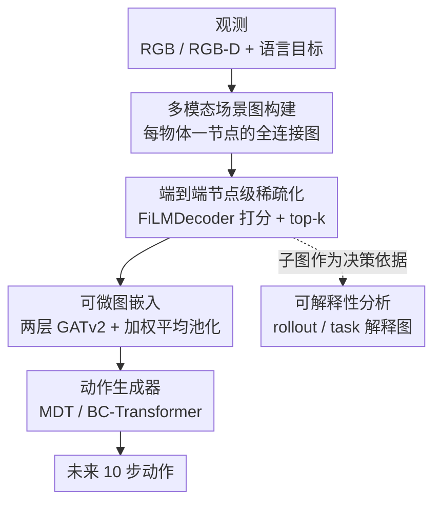

# SIR: Structured Image Representations for Explainable Robot Learning

**会议**: CVPR 2026  
**论文**: [CVF Open Access](https://openaccess.thecvf.com/content/CVPR2026/html/Mattes_SIR_Structured_Image_Representations_for_Explainable_Robot_Learning_CVPR_2026_paper.html)  
**代码**: https://github.com/intuitiverobots/SIR_Model  
**领域**: 机器人 / 具身智能  
**关键词**: 模仿学习, 场景图, 图稀疏化, 可解释性, 目标条件策略

## 一句话总结
SIR 把机器人观测先转成一张全连接场景图，再用一个端到端可学的稀疏化模块只保留任务相关的少数节点，把这个"瘦身后的子图"当作策略的状态表示——既在 RoboCasa 上把成功率从 14.81% 提到 19.5%，又因为子图本身就是模型决策依据而天然可解释，进而能反查出数据集里的伪相关与位置偏置。

## 研究背景与动机
**领域现状**：目标条件模仿学习（GCIL）这两年靠注意力 / 扩散类策略（如 MDT）进步很快，主流做法是用卷积骨干或视觉基础模型把图像压成一个 learned visual embedding，再喂给动作生成器。

**现有痛点**：这种视觉嵌入是个不透明的稠密向量——它把整张图的信息糊成一团，既没有显式结构，也说不清"模型到底看了哪个物体才做出这个动作"。后果有两个：一是对画面里的干扰物（distractor）很敏感，多放几个无关物体成功率就掉；二是完全没有可解释性，出了问题无从分析。

**核心矛盾**：图像嵌入在"紧凑"和"可解释/可结构化"之间存在根本张力——压得越紧越方便喂进网络，就越看不出里面到底编码了什么。已有的图方法要么走 planning 路线（依赖 TAMP、需要人工 key-point 更新图），要么只把图当辅助输入，要么像 Compose by Focus 那样只能处理 3-4 个节点的简单点云图，都没真正把"结构化场景图"当作 step-wise 策略的直接状态。

**本文目标**：(1) 系统验证场景图（SG）能不能、以及用哪种图像模态当节点特征，才能当好机器人策略的场景表示；(2) 学一个能筛出"任务相关子图"的稀疏化方法，并用子图反过来剖析模型的决策。

**切入角度**：作者押注在场景图这个中间表示上——SG 天然能把符号信息（物体标签）、几何线索（包围盒 / 点云）和高层视觉特征统一进一张关系图里，结构清晰且可读。关键的进一步观察是：如果让模型**只能**看到稀疏子图里的少数节点，那这个子图就**等于**模型的"解释"——因为它确实是动作生成时唯一可用的场景信息。

**核心 idea**：用"端到端学出来的稀疏场景子图"替代不透明的图像嵌入，作为 GCIL 策略的状态表示，从而让可解释性内生于策略本身，而非事后附加。

## 方法详解

### 整体框架
SIR 是一个 GCIL 模型，输入是单帧观测（RGB 或 RGB-D）和语言目标，输出是未来 10 步动作。它把"看场景"拆成四个串行模块：先从图像抽出一张**全连接场景图**（每个物体一个节点）；再用一个可学模块给每个节点打分、只留下分最高的 top-k 个节点，得到**任务相关子图**；接着用两层 GATv2 把这个子图嵌成一个状态向量；最后把状态向量 + CLIP 编码的语言目标喂给下游动作生成器（MDT 或 BC-Transformer）。其中场景图抽取这一步是冻结的，后面三个模块在 GCIL 框架内端到端联合训练。

整条管线的精髓在于：被稀疏化模块"删掉"的节点，从此对最终图嵌入**毫无贡献**——这保证了"留下来的子图"就是模型真正用到的全部场景信息，可解释性因此是硬保证而不是近似。

### 关键设计

**1. 多模态场景图构建：把符号、几何、视觉拼成一张可读的图**

策略的痛点是图像嵌入糊成一团、看不出结构。SIR 先用真值或预测的分割掩码把场景里每个物体抠出来，每个物体当一个节点，连成一张全连接图（FC-Graph）。节点的初始特征可以从四种模态里自由拼接：**Label**（物体类别的 one-hot）、**Cropped-Image-Feature**（用预训练 ResNet18 对包围盒裁剪图编码，骨干在"包围盒图像重建"任务上预训练）、**BB-Coordinates**（2D 包围盒四角 + 中心点的归一化坐标）、**Point-Cloud-Feature**（用在点云重建任务上预训练的 PointNet 编码）。设计上这些模态能直接 concat 进节点向量，无需额外对齐。边特征也带几何含义：当节点含包围盒或点云时，边初始化为节点间的几何距离；否则初始化为 1（纯粹辅助后续消息传递）。实验里 Cropped-Image-Feature + BB-Coordinates 这一组合性价比最高——既最准又推理快，所以稀疏图方法默认都用它。

**2. 端到端节点级稀疏化：在消息传递之前就把无关节点删干净**

这是 SIR 的核心，也是它和已有图稀疏化方法的根本区别。已有的 GNN 池化（DiffPool / GrePool / SAGPool）虽然也选节点，但都是在消息传递**之后或之间**选——这时未选中节点的信息可能早已扩散进图嵌入，所以"哪些节点真正起作用"说不清，不算真可解释。SIR 主张：必须在消息传递**之前**就端到端学会删节点，删掉的节点对最终嵌入零贡献，可解释性才硬。

具体做法：用一个两层、每层四头的 Transformer-Decoder 给每个节点算分 $\text{NS}(n)$，每层用 AdaLN 把节点嵌入条件在语言目标上（作者把这个模块叫 **FiLMDecoder**）。然后按 top-k 选出得分最高的 $k$ 个节点（$k$ 是任务相关物体数决定的任务级超参，作者称为 instruction-grounded node selection），定义节点权重

$$\text{NW}(n) = \begin{cases} \text{NS}(n), & n \text{ 被选入子图} \\ 0, & \text{否则} \end{cases}$$

为防止所有节点分数收敛到同一个值（稀疏化退化失效），引入一个 **soft histogram loss**：不做硬分桶，而是用高斯核把每个分数软分配到多个直方图 bin，求和归一化得到可微的软直方图，再和均匀分布算 MSE，鼓励分数在 $[0,1]$ 上均匀铺开（训练时权重 0.1）。此外对节点权重再加一个 L1 损失，逼着指令相关节点的 $\text{NW}$ 高、无关节点的低。消融里 soft histogram loss 对性能影响最大——去掉它（Naive NR）成功率从 19.5% 暴跌到 9.6%。

**3. 可微图嵌入：把节点权重灌进消息传递和池化，保证"删了就真没了"**

光在前面打分还不够，得让"删节点"这件事真的可微、且真的阻断信息流。SIR 用两层带残差的 GATv2 + 全局平均池化生成图嵌入，并对 GATv2 做了三处改造来打通端到端梯度：(1) 让 $\text{NS}(n)$ 的梯度直接作为 $\text{NW}(n)$ 的梯度（top-k 选择这步不可导，靠这招传梯度）；(2) 把节点权重塞进边权重 $\text{EdgeWeight}(u,v) = \text{NW}(u)\cdot\text{NW}(v)$，因为消息既乘注意力分又乘边权重，被删节点（$\text{NW}=0$）的信息就传不出去；(3) 池化时也按节点分数加权：

$$\text{GraphEmbedding} = \frac{\sum_{n \in V} \text{NW}(n)\cdot X_n}{\sum_{n \in V} \mathbb{1}_{[\text{NW}(n) > 0]}}$$

其中 $X_n$ 是节点 $n$ 传播后的最终特征。这一式等价于对保留节点（$\text{NW}(n)>0$）做均值池化，但显式带上 $\text{NS}(n)$ 能改善梯度流、让 FiLMDecoder 学得更好。三处改造合起来才让"消息传递前删节点"既可学又名副其实。

**4. 内生可解释性：用子图一致性反查数据集偏置**

由于子图是动作生成时唯一的场景信息，分析子图就等于分析模型在想什么。作者定义节点（或边）$n$ 的出现率

$$p_{p,n} = \frac{n \text{ 出现在子图中的次数}}{n \text{ 出现在场景图中的次数}}$$

把一次 rollout 里每步子图按出现率聚合成 "rollout 解释图"，把一个任务所有 rollout 聚合成 "task 解释图"；$p_{p,n}$ 越逼近 $\{0,1\}$，说明解释越一致。再把子图分三类对照人类预期：① 符合预期、② 含干扰节点、③ 缺关键节点。**真正有价值的洞察来自②③这两类偏差**——比如 CloseDrawer 任务成功率高达 81%，但子图里 Drawer 只出现 11%，反而稳定包含 Oven、Microwave 等无关物体，暴露出模型在吃训练数据的伪相关；又如 CloseSingleDoor 任务，SIR 几乎只选 PandaMobile / PandaGripper 两个自身节点、完全不看目标门，却比看了目标门的 TopK 模型高 5%+，说明数据里有强位置偏置，模型学会了"按固定轨迹闭门"而无视门的真实位置。

### 损失函数 / 训练策略
GCIL 内部三个模块（稀疏化 / 图嵌入 / 动作生成）端到端联合训练，场景图抽取冻结。除动作生成的模仿学习主损失外，稀疏化模块额外加两项正则：soft histogram loss（权重 0.1，逼分数均匀分布、防塌缩）与节点权重的 L1 损失（逼指令相关节点权重高）。每个配置用两个随机种子各训一次，评测 100 次 rollout 取平均。

## 实验关键数据

### 主实验
在 RoboCasa 24 个原子任务上对比 MDT 作为动作生成器（成功率 %，越高越好）：

| 观测表示 | Doors(4) | Drawers(2) | Knobs(2) | Levers(3) | Buttons(3) | Avg(24) |
|----------|----------|-----------|----------|-----------|-----------|---------|
| Image（baseline） | 25.13 | 49.75 | 7.25 | 23.67 | 17.00 | 14.81 |
| Fully-Connected-Graph | 28.62 | 39.25 | 14.00 | 40.00 | 18.83 | 16.98 |
| **SIR（本文）** | **30.25** | 46.25 | **16.50** | **48.50** | **21.83** | **19.50** |

仅靠全连接图（不稀疏化）就已逼近 17%、超过图像基线；加上指令引导的稀疏化进一步拉到 19.5%。提升在 Doors / Levers / Knobs / Buttons 上尤其明显，但 Drawers 和 Pick&Place 上反而不如图像基线——作者归因于这两类任务存在重数据集偏置（见可解释性分析）。

### 消融实验
不同稀疏化方式对比（RoboCasa, Avg-24 成功率 %）：

| 稀疏化方式 | Avg(24) | 说明 |
|-----------|---------|------|
| None（全连接） | 16.98 | 不稀疏化 |
| Random Node Removal | 5.48 | 随机删节点，崩溃 |
| Naive NR（无 soft histogram loss） | 9.60 | 学删但无防塌缩损失，暴跌 |
| Threshold | 17.17 | 按阈值保留 |
| TopK（无任务级 k、无 L1 引导） | 18.44 | 通用 top-k |
| **SIR**（指令引导 top-k + L1） | **19.50** | 完整模型 |

节点特征模态消融（节选，RoboCasa Avg-24 %）：

| 输入 / 节点特征 | Avg(24) |
|----------------|---------|
| Image baseline | 14.81 |
| Image + FiLM baseline | 15.85 |
| Point Clouds baseline | 4.13 |
| 图: Cropped-Img | 16.65 |
| 图: BB-Coord + Cropped-Img（Fusion） | 16.98 |
| 图: Point-Cloud-Feature | 11.08 |
| 图: Cropped-Img + Point Clouds | 15.04 |

点云直接喂动作生成器只有 4.13%，但当成图节点特征却有 11.08%——说明 GNN 是整合点云信息更高效的架构。

### 关键发现
- **soft histogram loss 是稀疏化的命门**：去掉它（Naive NR 9.60%）比保留它（SIR 19.5%）掉了近 10 个点，因为没有它分数会塌缩、稀疏化失效；随机删节点更是直接崩到 5.48%。
- **图表示天然抗干扰**：推理时往场景里塞 3-9 个训练时没见过的干扰物，图像基线平均掉 3.3%、TopK 模型掉 2.9%，而 SIR / FC-Graph / Threshold 几乎不掉、个别任务（Knobs、Levers）反而略升——因为图把场景按物体离散化，多出来的物体只是多几个被稀疏化删掉的节点。
- **可解释性能反查数据集病灶**：高成功率不代表"为对的理由成功"——CloseDrawer 81% 成功却几乎不看 Drawer（伪相关），CloseSingleDoor 里 SIR 完全无视目标门却赢 TopK 5%+（位置偏置）。这正是 Drawers / Pick&Place 上图方法不占优的根因。

## 亮点与洞察
- **"子图即解释"的硬可解释性**：把可解释性做成内生约束而非事后归因——因为被删节点对图嵌入零贡献，子图就是模型用到的全部信息，没有"信息已经偷偷扩散进去"的漏洞。这比 SAGPool 之类"传播后再选"的池化在可解释性上严谨得多。
- **top-k 不可导却照样端到端**：用"$\text{NS}$ 梯度直接当 $\text{NW}$ 梯度 + 边权重 $\text{NW}(u)\cdot\text{NW}(v)$ + 池化带分数"三招，把硬选择这步的梯度问题绕过去，这套可微化技巧可迁移到任何需要"先离散选元素再下游可学"的图/集合任务。
- **用模型的"错误注视"当数据探针**：最反直觉的一点是，作者明说真正的洞察不来自"正确子图"，而来自子图偏离人类预期的地方——这把可解释性从"展示模型多聪明"翻转成"暴露数据多脏"，是个能复用到其他领域的分析范式。
- **多视角融合两条路**：多相机场景给了 Split-View（各视角独立 GNN 嵌入）和 Fusion Graph（把多视角节点拼进一张图）两种选择，对任意静态多相机 benchmark 都可直接套用。

## 局限与展望
- **依赖分割与物体级离散化**：场景图构建需要（真值或预测的）分割掩码把物体抠出来，对无明确物体边界的场景、或分割失败时的鲁棒性未充分讨论；预测掩码下的结果只在附录给出。
- **k 是任务级人工超参**：top-k 的 $k$ 按"任务相关物体数"人工设定，换任务要重设，离"完全自适应稀疏度"还有距离；Threshold 方式虽自适应但精度略低。⚠️ 论文未给出 $k$ 的自动选择方案。
- **解释靠定性 + 一致性指标**：可解释性评估主要是定性看 task 解释图 + $p_{p,n}$ 一致性，没有量化的"解释正确率"基准，"模型为对的理由成功"目前仍靠人工判读。
- **绝对成功率偏低**：19.5% 的 Avg-24 说明任务本身很难（作者刻意只用静态相机子集做公平对比），离实用还远；Pick&Place 几乎为 0，图表示在这类任务上并无优势。

## 相关工作与启发
- **vs Compose by Focus**：同样把 SG 当动作模型的直接输入，但 Compose by Focus 只处理 3-4 节点的简单图、只用点云特征、只在简单操作任务上验证；SIR 处理更大的全连接 / 稀疏图、整合多种图像模态、在复杂厨房任务上验证，且把图当"中间表示"而非直接的行为学习部件。
- **vs Instant Policy**：Instant Policy 在扩散框架里用图做 in-context 模仿，但被限制在点云嵌入；SIR 不绑死点云、可融合标签 / 包围盒 / 视觉 / 点云多模态，且核心是学一个可解释的稀疏子图。
- **vs plan-based 图方法（如 ConceptGraphs / TAMP 系）**：那些方法用高层信息图 + 规划算法 + 人工 key-point 更新图；SIR 证明低层信息图无需 planning、无需 key-point 就能驱动 step-wise GCIL。
- **vs DiffPool / SAGPool 等 GNN 池化**：它们在消息传递之后/之间选节点，未选中节点信息可能已扩散，不算真可解释；SIR 是（据作者所知）首个在消息传递**之前**端到端学节点删除、保证删除节点零贡献的方法。

## 评分
- 新颖性: ⭐⭐⭐⭐⭐ 把"端到端学稀疏子图"做成内生可解释的状态表示，并首创"消息传递前删节点"，角度新且自洽。
- 实验充分度: ⭐⭐⭐⭐ RoboCasa + CALVIN、双动作生成器、稀疏化方式与节点模态双消融、干扰物鲁棒性都覆盖，但绝对成功率低、解释评估偏定性。
- 写作质量: ⭐⭐⭐⭐⭐ 四个 RQ 串起全文，方法与可解释性分析逻辑清晰，反查数据偏置一段尤其有说服力。
- 价值: ⭐⭐⭐⭐ "用模型的错误注视当数据探针"这一范式对调试机器人策略和审查数据集偏置有实际可迁移价值。

<!-- RELATED:START -->

## 相关论文

- [\[AAAI 2026\] Theory of Mind for Explainable Human-Robot Interaction](../../AAAI2026/robotics/theory_of_mind_for_explainable_human-robot_interaction.md)
- [\[CVPR 2026\] Video2Robo: 3DGS-based Synthetic Data from One Video Enables Scalable Robot Learning](video2robo_3dgs-based_synthetic_data_from_one_video_enables_scalable_robot_learn.md)
- [\[CVPR 2026\] CoMo: Learning Continuous Latent Motion from Internet Videos for Scalable Robot Learning](como_learning_continuous_latent_motion_from_internet_videos_for_scalable_robot_l.md)
- [\[CVPR 2026\] DynBridge: Bridging Imagination and Control through Interaction Dynamics for Robot Manipulation](dynbridge_bridging_imagination_and_control_through_interaction_dynamics_for_robo.md)
- [\[CVPR 2026\] GeniNav: Generative Model Driven Image-Goal Navigation via Imagination-Guided Consistency Flow Matching](geninav_generative_model_driven_image-goal_navigation_via_imagination-guided_con.md)

<!-- RELATED:END -->
