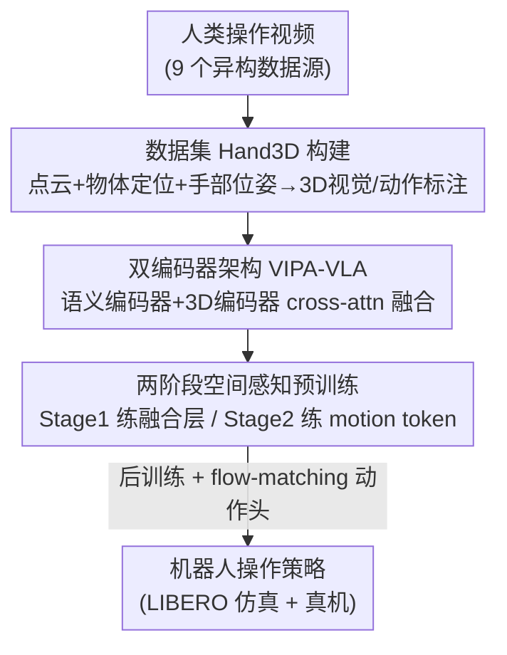

# Spatial-Aware VLA Pretraining through Visual-Physical Alignment from Human Videos

**会议**: CVPR 2026  
**论文**: [CVF Open Access](https://openaccess.thecvf.com/content/CVPR2026/html/Feng_Spatial-Aware_VLA_Pretraining_through_Visual-Physical_Alignment_from_Human_Videos_CVPR_2026_paper.html)  
**代码**: 无（项目页 https://beingbeyond.github.io/VIPA-VLA）  
**领域**: 机器人 / 具身智能（VLA 预训练）  
**关键词**: VLA、空间感知预训练、人类视频、视觉-物理对齐、机器人操作

## 一句话总结
针对 VLA 模型「用 2D 视觉去驱动 3D 物理动作」这一感知-动作鸿沟，本文提出在学机器人策略之前先做一个「空间感知预训练」阶段——从大规模人类操作视频里抽出 3D 视觉标注和 3D 动作标注作为监督，训练双编码器模型 VIPA-VLA 把 2D 语义视觉对齐到 3D 空间，结果不用一帧机器人数据预训练就在 LIBERO 上做到 92.4% 平均成功率，real robot 上也明显超过强基线。

## 研究背景与动机
**领域现状**：VLA（Vision-Language-Action）是当前通用机器人策略的主流范式——拿预训练好的视觉-语言模型（VLM）当底座，把动作 token 化或外挂一个 action expert，再在机器人数据上微调，让模型既能看图、又能读指令、最终输出动作。GR00T-N1、π0/π0.5 这类工作把海量多模态互联网数据 + 机器人数据一起做大规模 VLA 预训练，泛化能力很强。

**现有痛点**：但绝大多数 VLA 的输入还是 2D 视觉（RGB 图像/视频帧），而动作却发生在 3D 物理空间里。模型看到的是像素，要做的却是「手往前移 5cm、向下抓」这种带真实尺度的 3D 动作，二者之间的对应关系很弱。结果就是空间 grounding 差、换个场景就泛化不动。

**核心矛盾**：VLM 擅长的是「视觉-语义」对齐（图里有什么），而 VLA 额外需要「视觉-物理」对齐（这个像素对应 3D 几何里的哪个位置、动作怎么作用到环境）。现有 VLA 直接拿 VLM 底座上机器人数据微调，跳过了「让模型先理解 3D 空间」这一步，所以 2D 感知和 3D 动作始终没真正打通。

**切入角度**：人类操作视频天然蕴含「2D 观测 ↔ 3D 物理动作」的对应关系——人怎么在各种视觉场景下伸手、抓取、移动物体，这些都是现成的 3D 动作证据。而且人类视频比机器人数据好采太多，覆盖场景也广。虽然人手和机械臂存在 embodiment gap，但「动作在 3D 空间里怎么执行」这一层信息是跨 embodiment 通用的。

**核心 idea**：在 VLA 后训练（机器人策略学习）之前，插入一个「空间感知 VLA 预训练」阶段——从人类视频抽 3D 视觉/动作标注，训练模型把 2D 视觉对齐到 3D 空间理解（作者称之为 visual-physical alignment），让模型带着 3D grounding 先验再去学机器人策略。

## 方法详解

### 整体框架
整篇方法围绕一条三阶段流水线展开：先从人类视频造数据集 **Hand3D**（含 3D 视觉标注 + 3D 动作标注），再用这套标注分两阶段做空间感知预训练，训练一个双编码器模型 **VIPA-VLA**，最后才在机器人数据上后训练、外挂 flow-matching 动作头输出可执行动作。整个 pipeline 的关键在于：预训练阶段完全不碰机器人数据，纯靠人类视频把「2D 语义视觉 → 3D 空间 → 动作」三层逐级对齐。

### 关键设计

**1. Hand3D 数据集：把人类视频转成带真实尺度的 3D 视觉 + 动作监督**

这是整个范式的供血来源，针对的痛点是「VLA 缺少能把 2D 像素对应到 3D 物理空间的监督信号」。作者从 9 个异构人类操作数据源（Arctic、HOI4D、OAKINK2、EgoDex 等）聚合视频，先把所有手部标注统一到 MANO 参数化手模型，再分两路造标注：

- **3D 视觉标注（Hand3D-visual）**：用 Cut3R 估每帧稠密点云 $P=\{(x_i,y_i,z_i)\}_{i=1}^N$（选 Cut3R 是因为它在动态场景和人-物交互上更鲁棒），用 Gemini-2.5-flash + GroundingDINO 出物体 2D 框再结合深度定位到 3D；手部用 MANO 算出 21 个 3D 关节，再投影回图像平面 $(u,v)=\Pi(K[R|t](x,y,z)^\top)$，$\Pi(x',y',z')=(x'/z',y'/z')$，靠可见性过滤掉手出画面的帧。**关键的尺度校准**：单目点云的相对尺度对不上真实物理尺度，而动作要在真实尺度执行，所以作者用手部关节的绝对深度 $J_h^z$ 去匹配点云估计深度 $\tilde J_h^z$，取中位数估一个缩放因子 $s=\mathrm{median}_{k\in\Omega}(j_k^z/\tilde j_k^z)$，把点云校准成 $sP$，让手和物体落在统一的真实 3D 坐标系。最后用 Gemini 生成 4 类 VQA：空间关系 / 任务完成 / 手部移动 / 相机移动，其中前 3 类把 3D 关系编码成 `(方向, 距离)`——距离取欧氏范数，方向把单位向量按分量阈值 $\gamma$ 离散成 right/left、up/down、forward/backward 这种语言 token。约 4K clips 产出约 300K 指令-答案对。
- **3D 动作标注（Hand3D-action）**：从手腕轨迹 $(x_t,y_t,z_t)$ 均匀分箱离散成 motion token 序列 $(m_x^1,m_y^1,m_z^1,\dots)$，配上文本指令（沿用 UniHand），从 4M 对里过滤掉手部位移太小的样本，得到 1M 的细粒度运动监督。

这样一来，原本稠密、连续的 3D 几何被压成「语言化、可当监督」的紧凑标签，模型既能感知静态空间配置，也能推理手部运动、任务操作、甚至相机移动这些动态变化。

**2. VIPA-VLA 双编码器 + cross-attention 融合：给语义视觉补上 3D 几何**

针对的痛点是「单一语义视觉编码器只懂高层语义、提供不了 3D 空间结构」。作者在常规语义视觉编码器之外，额外塞一个 3D 视觉编码器 Cut3R，前者出语义嵌入 $V_{sem}$、后者出空间嵌入 $V_{spa}$。融合层用一个 cross-attention 实现：**语义特征当 query，3D 空间特征当 key/value**，输出融合后的视觉表征 $V_f$——也就是让语义视觉去「查询」对应的几何信息，把两类互补特征绑在一起。此外为了让模型能理解从人类视频抽出的细粒度 3D 运动轨迹，作者扩展了 LLM 的 token 嵌入空间，引入一组离散化 3D 物理空间的 motion token，使得「动作」也能进 LLM 的语言通道被建模和预测。

**3. 两阶段空间感知预训练：从「对齐空间感知」到「对齐动作」逐级推进**

针对的痛点是「2D 语义、3D 空间、动作三层一次性对齐太难」。作者把预训练拆成由粗到细的两步，且每步只解冻最该动的部分：

- **Stage 1（练融合层）**：冻住所有预训练参数（含两个编码器和 LLM），只训那个随机初始化的 cross-attention 融合层，用 3D 视觉标注 VQA 数据，目标是把 $V_{sem}$ 和 $V_{spa}$ 对齐、让模型学会推理 3D 空间关系。消融显示「只训融合层」就已经能拿到可观增益。
- **Stage 2（练 motion token）**：扩展 LLM 词表纳入 motion token，冻住语义和空间两个编码器，只训 LLM，让它在融合视觉+文本条件下预测 motion token，从而获得细粒度空间推理和动作级理解——学会「视觉线索 ↔ 物理运动模式」的映射。

两阶段下来，VIPA-VLA 把 2D 语义感知、3D 空间理解、动作推理逐级对齐，为下游机器人策略学习提供 3D grounding 先验。

### 损失函数 / 训练策略
后训练阶段才接触机器人数据：外挂一个 DiT（diffusion transformer）动作头，用 flow matching 学动作。从 VLM 底座抽条件 $h_{cond}=\mathrm{VLM}_\phi(v,l,Q_a)$（$Q_a$ 是固定的 action query，取对应隐状态当 DiT 的条件）。用随机噪声 $\epsilon$ 和真值动作 $a_t$ 线性插值造噪声轨迹 $\tilde a_t^{(\tau)}=(1-\tau)\epsilon+\tau a_t$，$\tau\sim U(0,1)$，把它和机器人状态嵌入 $s_t$ 拼起来喂 DiT，预测瞬时流向量 $v_\theta$，目标是逼近 oracle 传输方向 $a_t-\epsilon$：

$$\mathcal{L}_{FM}=\mathbb{E}_{a_t,\tau,\epsilon,v,l}\big[\|v_\theta-(a_t-\epsilon)\|_2^2\big]$$

后训练时只更新 LLM 底座和动作头 $f_\theta$。底座用 InternVL3.5-2B 初始化，预训练学习率 1e-5、后训练 5e-5，8×A800 训练。

## 实验关键数据

### 主实验（LIBERO 仿真，4 个任务套件 × 500 trials）
最值得注意的是：VIPA-VLA **预训练阶段完全没用机器人数据**（表中 Robo-PT 列为 ✗），却追平甚至超过用大规模机器人数据预训练的 π 系列和 GR00T。

| 设置 | 模型 | Robo-PT | 平均成功率 (%) |
|------|------|---------|----------------|
| 单视角 | SpatialVLA | ✓ | 78.1 |
| 单视角 | 4D-VLA | ✓ | 88.6 |
| 单视角 | GR00T N1.5* | ✓ | 92.1 |
| 单视角 | **VIPA-VLA** | ✗ | **92.4** |
| 双视角 | π0 | ✓ | 94.4 |
| 双视角 | π0.5 | ✓ | 96.9 |
| 双视角 | **VIPA-VLA** | ✗ | **96.8** |

在显式建模空间推理的基线（SpatialVLA、TraceVLA、MolmoAct）中，VIPA-VLA 一致更好。

### 真机实验（Franka 7-DoF + Inspire 灵巧手，子任务/整任务成功率）
| 任务 | GR00T N1.5 | Being-H0 | InternVL3.5 | VIPA-VLA |
|------|-----------|----------|-------------|----------|
| Put-Three-Obj | 48% / 40% | 38% / 20% | 34% / 10% | 52% / 10% |
| Wipe-Board | 57% / 30% | 40% / 10% | 43% / 10% | **83% / 60%** |
| Water-Plant | 53% / 30% | 37% / 20% | 37% / 20% | **57% / 50%** |

在 unseen 环境里优势更明显（Wipe-Board-Unseen 83%/50%，基线大多在初期就失败）。Put-Three-Obj 整任务率偏低但子任务率最高，说明它在长序列里掉链子更晚、过程更稳。

### 消融实验
| 配置 | LIBERO 平均 (%) | 说明 |
|------|------------------|------|
| VIPA-VLA（完整） | 92.4 | 双编码器 + 空间感知预训练 |
| – Pretraining | 91.2 (-1.2) | 去掉人类视频预训练 |
| – Dual Encoder | 90.4 (-2.0) | 去掉 3D 编码器 |
| – Both | 88.7 (-3.7) | 两个都去掉 |

3D 空间理解评估（Hand3D-test，2K 未见视频 VQA）：

| 模型 | 距离误差 (m) ↓ | 方向得分 ↑ |
|------|----------------|------------|
| InternVL3.5（底座） | 0.18 | 1.22/3 |
| InternVL3.5 + Hand3D | 0.14 | 1.75/3 |
| VIPA-VLA-PT | **0.12** | **1.82/3** |

### 关键发现
- 双编码器架构（-2.0%）比人类视频预训练（-1.2%）对最终性能贡献更大，但两者叠加才拿到最强结果，说明「数据级监督」和「架构级 3D 融合」是互补的。
- 3D 空间理解评估里，「底座 + Hand3D 预训练」就把距离误差从 0.18 降到 0.14、方向分从 1.22 升到 1.75，证明 Hand3D 标注本身（数据层面）就显著提升空间 grounding；再加双编码器还能进一步小涨，说明 3D 编码器带来了数据监督之外的额外收益。
- Stage 1 只训融合层就有可观增益，意味着「对齐语义和空间视觉特征」这一步本身就很值钱。
- Stage 2 后预测的运动轨迹比 ground-truth 更平滑、更目标导向（人类真值反而带噪声冗余），还学到了 affordance——例如抓木勺会抓在柄端。

## 亮点与洞察
- **把「3D 空间理解」从感知任务变成可迁移的动作先验**：以往 3D VLM 大多停在「感知静态场景」，本文用人类视频把 3D 理解和「动作怎么在 3D 空间执行」绑定，跨过了 perception→action 这一步，这是和 SpatialVLA/3D-VLA 路线的本质区别。
- **尺度校准这步很关键也很实用**：单目深度的相对尺度对动作学习是有害的，用 MANO 手部绝对关节位置去 median 校准点云尺度，是个低成本但直击痛点的 trick，可迁移到任何「单目几何 + 需要真实尺度」的具身任务。
- **不用机器人数据预训练也能打平强基线**，说明「2D↔3D grounding」这个先验确实是 VLA 泛化的瓶颈之一，而人类视频是性价比极高的来源。
- **把 3D 几何语言化成 `(方向, 距离)` token**，让空间监督能直接进 VLM 的文本/VQA 通道，是个能复用的「让空间信息进 LLM」的范式。

## 局限与展望
- 作者展望：这套空间感知预训练可以和机器人数据预训练结合，形成更完整的整体预训练策略（言下之意是单靠人类视频还不够，机器人数据仍有不可替代的价值）。
- ⚠️ 真机评估规模偏小（每任务 10 trials），整任务成功率方差大（Put-Three-Obj 整任务仅 10%），结论更多靠子任务率支撑，泛化性需更多 trials 验证。
- 依赖一长串现成大模型（Cut3R、Gemini-2.5-flash、GroundingDINO、MANO）做自动标注，标注质量受这些模型上限和误差传播影响，论文未深入分析标注噪声对下游的影响。
- embodiment gap 仍存在：人手轨迹和机械臂/灵巧手并非一一对应，本文靠「学 3D 空间理解而非直接对齐动作空间」绕开，但跨 embodiment 的真实迁移损失没有量化。

## 相关工作与启发
- **vs SpatialVLA / 3D-VLA / GeoVLA**：它们也想给 VLA 加 3D，但 SpatialVLA 靠 ego-centric 位置编码 + 自适应动作网格、3D-VLA 用 diffusion world model 渲染未来图像/点云、GeoVLA 直接吃 RGBD。本文不改输入也不渲染，而是**新增一个预训练阶段**，用人类视频抽的 3D 标注 + 3D 编码器把 2D 显式对齐到 3D，强调「先 grounding 再学策略」。
- **vs Being-H0 / UniHand**：同样用人类视频做 VLA 预训练，但 Being-H0 主要学操作运动序列（motion sequence），本文更强调「2D 观测 ↔ 3D 动作空间」的空间 grounding，并显式引入尺度校准和双编码器。
- **vs GR00T-N1 / π0.5**：它们靠海量机器人数据 + 互联网数据堆大规模预训练，本文则证明在零机器人数据预训练下，靠人类视频的 3D 先验也能逼近其性能，是更省机器人数据的路线。

## 评分
- 新颖性: ⭐⭐⭐⭐⭐ 「先做空间感知预训练再学策略」+ 人类视频造 3D 视觉/动作双标注，路线清晰且有区分度。
- 实验充分度: ⭐⭐⭐⭐ LIBERO + 真机 + 空间理解评估 + 消融都覆盖到了，但真机 trials 偏少、整任务方差大。
- 写作质量: ⭐⭐⭐⭐ 范式动机讲得透，pipeline 和公式清楚；个别符号（Hand3D 两路标注）需对照图才好懂。
- 价值: ⭐⭐⭐⭐⭐ 给「VLA 缺 3D grounding」开了一条低成本人类视频预训练的实用路线，可与机器人数据预训练叠加。

<!-- RELATED:START -->

## 相关论文

- [\[CVPR 2026\] VLA Models Are More Generalizable Than You Think: Revisiting Physical and Spatial Modeling](vla_models_are_more_generalizable_than_you_think_revisiting_physical_and_spatial.md)
- [\[CVPR 2026\] EgoRoC: Towards Egocentric Robotic Control via Task-Agnostic Visual Alignment](egoroc_towards_egocentric_robotic_control_via_task-agnostic_visual_alignment.md)
- [\[CVPR 2026\] ForeAct: Steering Your VLA with Efficient Visual Foresight Planning](foreact_steering_your_vla_with_efficient_visual_foresight_planning.md)
- [\[CVPR 2026\] CLiViS: Unleashing Cognitive Map through Linguistic-Visual Synergy for Embodied Visual Reasoning](clivis_unleashing_cognitive_map_through_linguistic-visual_synergy_for_embodied_v.md)
- [\[CVPR 2026\] DiffuView: Multi-View Diffusion Pretraining for 3D-Aware Robotic Manipulation](diffuview_multi-view_diffusion_pretraining_for_3d_aware_robotic_manipulation.md)

<!-- RELATED:END -->
