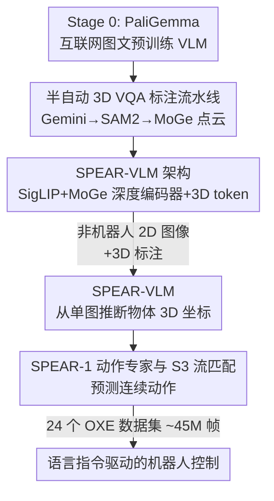

# SPEAR-1: Scaling Beyond Robot Demonstrations via 3D Understanding

**会议**: CVPR 2026  
**论文**: [CVF Open Access](https://openaccess.thecvf.com/content/CVPR2026/html/Nikolov_SPEAR-1_Scaling_Beyond_Robot_Demonstrations_via_3D_Understanding_CVPR_2026_paper.html)  
**代码**: spear.insait.ai（开放权重 + 3D 标注数据）  
**领域**: 机器人 / 具身智能（3D-aware VLA）  
**关键词**: 机器人基础模型, VLA, 3D 感知, 单目深度, 流匹配

## 一句话总结
SPEAR-1 主张机器人基础模型泛化差的根因在于底座 VLM 只懂 2D，于是先用「易采集的非机器人 2D 图像 + 自动生成的 3D 标注」把 VLM 训练成会预测 3D 坐标的 SPEAR-VLM，再在它之上接动作专家训练 VLA，最终在未见过的 Franka(DROID) 环境零样本性能追平 π0.5、超过 π0-FAST，而所用机器人演示数据少 20×。

## 研究背景与动机
**领域现状**：VLA（Vision-Language-Action）模型是当下通用机器人控制的主流范式，它把互联网预训练 VLM 的「常识」和大规模机器人演示数据缝合在一起，端到端输出动作。

**现有痛点**：这类策略的泛化能力高度碎片化——OpenVLA、SpatialVLA、CogAct 等在「玩具」环境（相机位置见过、背景同分布）里零样本表现不错，但一搬到真实部署场景（如 Franka/DROID，相机位姿变化、背景 OOD）就崩，必须针对目标环境再 fine-tune。π0、π0.5 靠堆**闭源**的大规模机器人数据来换泛化，代价高昂。

**核心矛盾**：作者认为瓶颈在「地基」——绝大多数机器人基础模型是 fine-tune 自只在 2D 图文任务上训练的 VLM，而具身控制本质发生在 3D 世界。VLM 缺乏 3D 空间推理，就只能从海量机器人演示里**隐式**地学几何结构，于是被昂贵、且与具体本体强绑定的机器人数据卡住了规模和泛化。

**本文目标**：在不增加（甚至大幅减少）机器人数据的前提下，给 VLA 注入「控制相关的 3D 空间理解」。

**切入角度**：3D 标注不一定要来自机器人。普通 2D 图像配上现成的视觉基础模型（深度估计、分割、检测）就能**自动**生成 3D 标注，这比采机器人演示便宜得多、也更易扩展。

**核心 idea**：先用「3D 标注的非机器人 2D 图像」把 VLM 升级成能从单张 2D 图推断物体 3D 坐标的 SPEAR-VLM，再在它上面接动作专家，让 3D 几何先验在机器人训练之前就嵌进表征里——用便宜的非机器人数据「替换」掉一部分昂贵的机器人演示。

## 方法详解

### 整体框架
SPEAR-1 的训练是一条三阶段流水线，越往后数据越稀缺但越贴近控制：Stage 0 是已有的通用 VLM（PaliGemma，互联网图文预训练）；Stage 1 把它改造成 3D-aware 的 **SPEAR-VLM**——加一个单目深度编码器、扩词表加 3D token，在自动标注的非机器人 2D 图像上学「预测物体 3D 包围盒 / 物体间距离」等具身风格的 VQA 任务；Stage 2 在 SPEAR-VLM 之上接一个**流匹配动作专家**，用 24 个 Open X-Embodiment 数据集（约 45M 帧）训练成真正能输出连续动作的机器人基础模型 SPEAR-1。三个阶段层层递进，把「被动的 2D 感知」一步步转成「主动的 3D 行为」。

### 关键设计

**1. SPEAR-VLM：给 2D VLM 装上深度眼睛和 3D 词表**

针对「VLM 只懂 2D、缺几何」这个根本痛点，SPEAR-VLM 在 PaliGemma 上做两件事。架构上，PaliGemma 本来是 SigLIP 视觉编码器 + 线性投影 + Gemma 语言模型；作者额外接入 **MoGe** 单目深度编码器作为第二个视觉骨干——选 MoGe 是因为它做仿射不变（affine-invariant）建模，即使相机内参未知也能输出 3D 点云/深度。具体做法是把 MoGe ViT 编码器最后 4 层中间特征沿通道拼接，用一个随机初始化的线性投影映到 LLM 嵌入空间，再和 SigLIP 投影输出**取平均**作为送进 LLM 的视觉 token。表达侧，作者给 PaliGemma 分词器扩了 $N=1024$ 个「3D token」，专门用来把连续的 3D 坐标编码成文本可生成的离散符号。这样 VLM 不再只会描述「图里有什么」，而是能直接回答「胡萝卜 3D 包围盒的八个顶点坐标是多少」。

**2. 半自动 3D VQA 标注流水线：让普通 2D 图像「长出」3D 监督**

这是把「非机器人数据」变成可用 3D 监督的关键，正面回应了「机器人数据太贵」的痛点。流水线只吃 2D 图像、全靠现成视觉基础模型：① 用 Gemini 检测 2D 包围盒和语义标签；② 把这些框喂给 SAM2 得到实例级分割掩码；③ 用 MoGe 直接预测整图 3D 点云。构造训练样本时，随机采一个模板化文本 prompt 和图中若干物体，用物体掩码去过滤 MoGe 点云得到该物体的 3D 点云，再由分割点云算出有向 3D 包围盒，拼成问答对。任务覆盖 3D 物体检测、物体间相对关系、相机到物体距离、物体关键点等——这些都是「VLA 真正需要学」的具身能力的代理。数据上聚焦室内场景，标注 EgoExo4D 的「做饭」「修车」片段共 20 万张图，再补 3 万帧 Bridge-V2（机器人演示，占训练混合 10%）增加视觉多样性。值得强调的是：仅用 **20 万张非机器人 2D 图像**，SPEAR-1 就超过了额外训练在 9 亿多帧机器人演示上的模型。

**3. SPEAR-1 动作专家与 S3 流匹配：把 3D 表征接到连续控制上**

有了 3D-aware 的 VLM 还不够，得让它真的吐出机器人动作。SPEAR-1 沿用 π0 架构：一个流匹配（flow matching）动作专家处理本体感知（末端位姿 + 夹爪状态），通过 attend VLM 的中间 key-value 来预测一段动作序列 $A_t=[a_t,\dots,a_{t+H-1}]$。每个动作分解为平移、旋转、夹爪三部分 $a_t=[x_t,q_t,g_t]$。作者的关键改进是**旋转用单位四元数、并在 $S^3$ 流形上做流匹配**，而不是把 $\mathbb{R}^4\to S^3$ 当线性问题。训练时采样时间步 $\tau$ 与噪声，平移走线性插值，旋转走球面线性插值（slerp）：

$$q^\tau_t=\frac{\sin\big((1-\tau)\theta\big)}{\sin\theta}\,q_\epsilon+\frac{\sin(\tau\theta)}{\sin\theta}\,q_t,\quad \theta=\cos^{-1}(q_\epsilon\cdot q_t)$$

平移用 MSE 形式的条件流匹配损失 $L_{\mathbb{R}^3}$，旋转把速度预测的 cosine 损失和积分后四元数的测地（geodesic）损失相加得 $L_{S^3}$，总损失 $L(\theta)=\mathbb{E}[L_{\mathbb{R}^3}+L_{S^3}]$。推理时从随机噪声用欧拉积分把向量场从 $\tau=0$ 推到 $\tau=1$。作者实测这套半空间单位四元数 + $S^3$ 流形公式，比欧拉角/旋转矩阵 + 线性流匹配更稳更准。

**4. 「在哪一步训/冻哪个编码器」的工程配方**

3D 先验能不能保住，极度依赖训练时机。作者系统消融了编码器的训/冻组合，结论是：VLM 预训练阶段让 SigLIP 和 MoGe **都可训**，但到 VLA 训练阶段把 **MoGe 冻住**——因为机器人训练会退化预训练视觉表征（ReVLA 现象），而 MoGe 学的是稠密深度、更贴近操作本质，一旦在 VLA 阶段继续训反而把 3D 能力训坏（消融里 VLA 阶段训 MoGe 平均成功率从 35.4% 暴跌到 18.8%）。配套还有几个稳训练的细节：图像按中心裁剪/padding 而非粗暴缩放（避免破坏长宽比、进而破坏深度与点云估计）；外部相机 280×210、腕部相机 112×112（信息少就给低分辨率省算力）；动作块 $H=5$、5Hz，跨数据集用**全局分位数归一化**鼓励学「运动」而非死记每个数据集；用 EMA checkpoint 显著稳住最终性能。

### 损失函数 / 训练策略
SPEAR-VLM 仿 LLaVA 分两段训：第一段从 PaliGemma+MoGe 权重初始化，只训随机初始化的 MoGe 投影、3D token 嵌入和 SigLIP 投影，其余冻结；第二段更长，只冻 SigLIP 和 MoGe 编码器，并把 3D token 的 next-token-prediction 损失放大 $\lambda=2$。VLM 训练 batch 512、共 12k 步、16×H200 约 18 小时。VLA 预训练从 SPEAR-VLM + 随机动作专家起步，batch 2048、300k 步、32×H200 约 6 天，训在 24 个 OXE 数据集上；针对 WidowX/Franka 真机再各 fine-tune 50k 步得到 SPEAR-1 (Bridge) 和 SPEAR-1 (DROID)。

## 实验关键数据

### 主实验
SIMPLER WidowX 仿真上对比同类开权重 VLA（SpatialVLA 数据引自原文）：

| 模型 | Carrot on Plate | Eggplant in Basket | Spoon on Towel | Stack Block | 平均成功率 |
|------|----------------|--------------------|----------------|-------------|-----------|
| OpenVLA | 0% | 4.1% | 0% | 0% | 1.0% |
| SpatialVLA | 25.0% | 100.0% | 16.7% | 29.2% | 42.7% |
| **SPEAR-1 (ours)** | 58.3% | 62.5% | 62.5% | 45.8% | **57.3%** |

真机层面：WidowX 上 SPEAR-1 平均任务进度比强基线 OpenVLA 高约 10%；Franka(DROID) 上**不在目标环境做任何 fine-tune** 即明显超过 π0-FAST、追平 π0.5，而这两个基线都额外训了至少 9 亿帧、约 20× 的机器人演示数据。作者强调 SPEAR-1（同样 π0 架构）零样本性能可达 π0-FAST 的约 5×。

### 消融实验
单环境 Bridge-V2 子集训练、SIMPLER WidowX 评测，验证 3D 预训练每一块的贡献：

| 配置 | 关键差异 | 平均成功率 | 说明 |
|------|---------|-----------|------|
| no 3D（PaliGemma 基线） | 无 3D 任务 | 20.8% | 原始 2D VLM |
| no OBJ | 只用随机像素 3D 坐标、无物体级任务 | 20.8% | 没有物体级监督等于白训 |
| no MoGe | 有物体级 3D 任务、但无深度编码器 | 26.0% | 有提升但有限 |
| no VLA-MF | VLA 阶段也训 MoGe | 18.8% | 比基线还差，训坏了 3D |
| **SPEAR-VLM（完整）** | 物体级任务 + MoGe，VLM 训/VLA 冻 MoGe | **35.4%** | 最优配置 |

另在 Franka(DROID) 上从零训两个 VLA 对比底座（Table 2）：π0-PaliGemma 平均任务进度 34%，π0-SPEAR-VLM 达 46%，且在不属于 DROID 训练集的「Carrot on Plate」任务上从 0% 提到 42%，说明 3D 底座带来更强泛化。

### 关键发现
- **物体级 3D 任务 + MoGe 缺一不可**：只喂随机像素坐标（no OBJ）完全无效，去掉 MoGe（no MoGe）只有零星提升，两者齐备才从 20.8% 跳到 35.4%。
- **MoGe 必须在 VLA 阶段冻结**：继续训 MoGe（no VLA-MF）会把性能压到 18.8%、比不做 3D 还低，印证「机器人训练退化预训练视觉表征」。作者推测 SigLIP 只学图级语义、MoGe 学稠密深度更接近操作本质，所以 MoGe 表征更脆、更需保护。
- **数据效率惊人**：20 万张非机器人 2D 图像换来的泛化，胜过额外 9 亿帧机器人演示；整体机器人数据用量是 π0.5 的约 1/20。

## 亮点与洞察
- **「3D 先验来源与控制解耦」**：把「学 3D 几何」从昂贵的机器人演示里剥离出来，改用现成视觉基础模型自动标注的普通 2D 图像——这是本文最「啊哈」的地方，等于找到一条绕开机器人数据墙的扩展路径。
- **标注流水线全靠现成模型串联**（Gemini→SAM2→MoGe），不需要任何 3D 真值或专用采集，复现门槛低、可迁移到任意室内图像数据集去扩 3D 监督。
- **「何时冻编码器」被当成一等公民来消融**：很多 VLA 工作默认全程可训，本文用数据证明 VLA 阶段冻 MoGe 是性能关键，这个经验可直接迁移到其它「双视觉骨干」VLA。
- **旋转放到 $S^3$ 流形上做流匹配**而非当线性回归，是把流匹配用于机器人动作时一个干净且有效的细节，可复用到任何需要预测姿态/四元数的策略。

## 局限与展望
- 作者承认：3D 预训练策略对**可形变物体或复杂形状物体**不适用，因为有向 3D 包围盒先验抓不住这类几何。
- MoGe 是仿射不变深度，算出的 3D 包围盒标签**不在度量空间**（非 metric depth），这对下游的影响尚未厘清，未来可考虑接入度量深度估计或真值点云。
- 仍**需要在目标本体上 fine-tune** 才能拿到满意结果（Bridge/DROID 各再训 50k 步），离真正「零样本跨本体」还有距离。
- 3D 预训练数据量/质量与下游控制之间的 scaling law 尚未研究；面对比 π0.5 更多数量级的任务/环境时能否守住优势也有待验证。
- 个人观察：消融与真机实验都在少数室内桌面操作任务、单/双相机设置下完成，任务集偏窄；且原文贡献列表里出现「trained with 20× more robot demonstration data」与摘要「20× fewer」表述相反，应以「少 20×」为准（疑为笔误，⚠️ 以原文为准）。

## 相关工作与启发
- **vs SpatialVLA / MotoVLA**：它们也想给机器人控制注入 3D，但 SpatialVLA 是在 VLA 里塞深度编码器、不做任何 VLM 对齐/预训练，3D 能力仍**完全从昂贵机器人数据隐式学**；SPEAR-1 在 VLM 这一层（基础模型级）就先把 3D 学好，端到端跨多本体多环境，不靠目标环境 fine-tune 即达 SOTA。
- **vs SpatialVLM / RoboSpatial**：它们训的是高层「空间关系」，SPEAR-VLM 直接训**显式 3D 坐标预测**，预训练任务离具身控制更近；且 SPEAR 模型与数据全部开放，SpatialVLM 两者都不公开。
- **vs SpatialBot**：同样想做空间感知 VLM 控制，但其推理是多步 VLM 流程、且从未被证明能整合进 VLA 做通用控制。
- **vs π0 / π0-FAST / π0.5**：SPEAR-1 直接搭在 π0 架构上，但用 SPEAR-VLM 替换底座 VLM。π0-FAST 靠专用动作 tokenization、π0.5 靠高层子任务预测 + 多样化机器人数据混合来换泛化；SPEAR-1 证明「在非机器人数据上做 3D VLM 预训练」是更可扩展的替代路线——少 20× 机器人数据即可追平 π0.5。
- **vs Gemini Robotics 1.0**：思路接近（也做 3D 预训练），但其细节大多不公开、且蒸馏自更大的 Gemini 2.0；本文差异在于（1）单独研究 3D 预训练的收益、（2）训一个小得多的开放模型且只用有限的 OXE 开放数据、（3）明确证明用非机器人 2D 图像替代机器人数据。

## 评分
- 新颖性: ⭐⭐⭐⭐⭐ 把「3D 几何学习」从机器人演示中解耦、用自动标注的非机器人 2D 图像替代，是一条清晰且未被充分探索的扩展路径。
- 实验充分度: ⭐⭐⭐⭐ 仿真 + 双本体真机 + 多组关键消融（含训/冻编码器、底座对比）扎实，但任务集偏室内桌面操作、规模有限。
- 写作质量: ⭐⭐⭐⭐ 动机—方法—消融逻辑顺畅，三阶段图清晰；个别表格行号混乱、贡献列表有「20× more/fewer」笔误。
- 价值: ⭐⭐⭐⭐⭐ 开放权重 + 开放 3D 标注数据，且给出「用便宜数据省下 20× 机器人演示」的可复制范式，对机器人基础模型社区实用价值高。

<!-- RELATED:START -->

## 相关论文

- [\[CVPR 2026\] PointWorld: Scaling 3D World Models for In-The-Wild Robotic Manipulation](pointworld_scaling_3d_world_models_for_in-the-wild_robotic_manipulation.md)
- [\[CVPR 2026\] Beyond Mimicry: Learning Whole-Body Human-Humanoid Interaction from Human-Human Demonstrations](beyond_mimicry_learning_whole-body_human-humanoid_interaction_from_human-human_d.md)
- [\[CVPR 2026\] Beyond Success: Refining Elegant Robot Manipulation from Mixed-Quality Data via Just-in-Time Intervention](beyond_success_refining_elegant_robot_manipulation_from_mixed-quality_data_via_j.md)
- [\[CVPR 2026\] RoboWheel: A Data Engine from Real-World Human Demonstrations for Cross-Embodiment Robotic Learning](robowheel_a_data_engine_from_real-world_human_demonstrations_for_cross-embodimen.md)
- [\[CVPR 2026\] Structural Action Transformer for 3D Dexterous Manipulation](structural_action_transformer_for_3d_dexterous_manipulation.md)

<!-- RELATED:END -->
