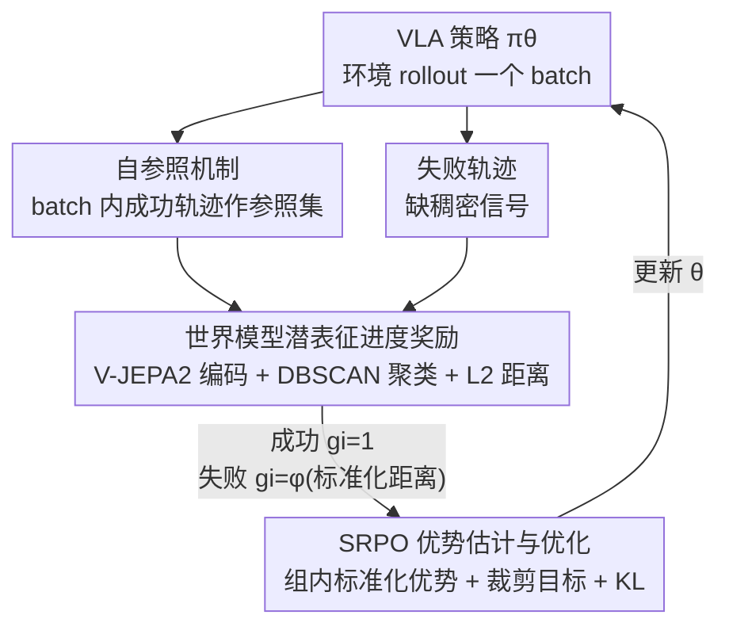

# SRPO: Self-Referential Policy Optimization for Vision-Language-Action Models

**会议**: CVPR 2026  
**论文**: [CVF Open Access](https://openaccess.thecvf.com/content/CVPR2026/html/Fei_SRPO_Self-Referential_Policy_Optimization_for_Vision-Language-Action_Models_CVPR_2026_paper.html)  
**代码**: 无  
**领域**: 机器人 / 具身智能 / 强化学习  
**关键词**: VLA、强化学习、奖励稀疏、世界模型、过程奖励

## 一句话总结
SRPO 用同一训练 batch 里**自己跑出来的成功轨迹**当参照、用世界模型潜空间表征衡量失败轨迹"离成功有多近"，把 GRPO 那种 0/1 稀疏奖励变成稠密的过程奖励，不靠任何额外演示或人工奖励工程，就把 OpenVLA* 在 LIBERO 上从 48.9% 拉到 99.2%（200 步内）。

## 研究背景与动机

**领域现状**：视觉-语言-动作（VLA）模型把大规模预训练 VLM 迁移到机器人操作上，但训练高度依赖专家演示，容易在小规模下游数据上过拟合，形成"演示偏置"——模型学到的天花板就是演示者的水平，很难超越人类。近来大家普遍用强化学习（尤其是 GRPO 这类 group-based 方法）做后训练来打破这个上限。

**现有痛点**：VLA 场景下 RL 的核心痛点是**奖励极度稀疏**。GRPO 只用回合末的二值成功信号（成功 1 / 失败 0）做优势估计，而机器人 multi-turn rollout 又特别贵。结果是：一大批"差一点就成功"的失败轨迹里其实藏着大量进度信息，却被整条丢弃，训练效率极低。

**核心矛盾**：想给失败轨迹打稠密的过程奖励（PRM），就得知道"任务完成到哪一步了"——但现有过程奖励要么依赖专家演示来标里程碑，要么靠人工拆解任务阶段（hand-crafted stage）。这与"自主学习、可扩展"的目标直接冲突：你为了密集监督又把人工先验请回来了。另一条路是用世界模型建模动态，但传统**像素级**世界模型跨域泛化差、往往需要任务专属微调。

**本文目标**：在不引入任何外部演示、不做人工奖励工程的前提下，给失败轨迹一个稠密、可泛化、任务无关的过程奖励。

**切入角度**：作者的关键观察有两点——其一，每个训练 batch 里**模型自己**就会跑出一些成功轨迹，它们天然是"什么叫做对了"的参照标准；其二，世界模型**潜空间**的压缩表征能跨环境捕捉行为进度模式，不需要像素级重建或域内微调。把监督问题从"如何拿到专家标签"改写成"如何从自己的成功里提取过程奖励"。

**核心 idea**：用 batch 内自产的成功轨迹作自参照、用世界模型潜表征的距离衡量行为相似度，给失败轨迹打过程奖励，再塞进 GRPO 式的优势估计里优化策略。

## 方法详解

### 整体框架
SRPO 把"自参照过程奖励"无缝嵌进 GRPO 的训练回路。每一轮训练里，策略 $\pi_\theta$ 在环境里 rollout 出一个 batch 的轨迹，其中既有成功也有失败。成功轨迹被收集成**参照集**；对每条轨迹，用一个在大规模机器人视频上预训练的世界模型（V-JEPA 2）当 encoder，把整条观测序列编码成潜空间表征。失败轨迹的"进度"被建模为它的表征到成功表征簇的 L2 距离——离得越近、进度越高、奖励越大。这个进度奖励再喂给 GRPO 式的优势估计与裁剪目标，在 KL 正则下更新策略。

整条管线是"rollout → 收集参照 → 世界模型编码 → 距离算奖励 → 优势估计 → 策略更新"的闭环，逻辑清晰、模块串行，下图给出鸟瞰：

### 关键设计

**1. 自参照奖励：把 batch 内自产的成功轨迹当"标准答案"**

针对的痛点是"想给失败轨迹密集监督，就得请回专家演示或人工阶段标注"。SRPO 的做法是彻底绕开外部监督：在每个训练 batch 内，凡是终端奖励 $R(z_{0:T}, l)=1$ 的轨迹就归入成功参照集 $S=\{o^{(i)}_{0:T}; R(z^{(i)}_{0:T}, l)=1\}$，失败轨迹则按"它和这些成功参照有多像"来反推过程奖励 $\hat{R}(o_{0:T}, S)$。这把监督问题从"how do we obtain expert labels"改写成"how do we extract progress-wise reward from our own successes"——参照标准随策略一起进化，不需要任何外部数据，天然可扩展。相比 GRPO 只用 outcome-only 奖励、把整个 batch 的失败信息浪费掉，SRPO 把同一个 batch 用得更充分。注意作者刻意选**轨迹级**奖励而非细粒度 reward shaping，理由是过度精细的人工稠密信号反而会把策略带向次优解。

**2. 世界模型潜表征进度奖励：用 V-JEPA 2 的潜空间距离量化"离成功有多近"**

要把"行为相似度"算成数值，靠原始像素不行——像素级世界模型跨域泛化差、对微小视觉扰动敏感，通用视觉模型（如 ImageBind）又不懂机器人物理概念。SRPO 的关键是用大规模机器人视频预训练的世界模型 encoder $W$，把整条轨迹观测编码到潜空间 $h_i = W(o^{(i)}_{0:T})$，这种压缩、可迁移的表征天然捕捉跨环境的进度模式。具体计算分三步：先对成功参照表征做 DBSCAN 聚类得到一组代表性中心 $C=\mathrm{DBSCAN}(S)$；再算失败轨迹表征到最近中心的距离 $d_i = \min(\{\lVert h_i - h_j\rVert_2; h_j \in C\})$；最后把距离标准化后过激活函数映射到 $(0,1)$：

$$g_i = \begin{cases} 1.0 & \text{成功轨迹} \\ \phi\!\left(\dfrac{d_i - \bar{d}}{\sigma_d}\right) & \text{失败轨迹} \end{cases}$$

其中 $\bar{d}$、$\sigma_d$ 是所有失败轨迹距离的均值和标准差，$\phi(\cdot)$ 把输出压到 $(0,1)$。距离越小说明越接近成功簇、奖励越高。这样失败轨迹里"productive segments"（差一点成功的片段）就能被识别并奖励，而不是被整条丢弃。

**3. 自参照策略优化（SRPO）：把过程奖励塞进 GRPO 的优势与裁剪目标**

有了过程奖励 $g_i$，剩下就是把它接进 group-based 优化。沿用 GRPO，概率比 $r_{i,t}(\theta)=\dfrac{\pi_\theta(a^{(i)}_t|o^{(i)}_t, l)}{\pi_{\theta_{old}}(a^{(i)}_t|o^{(i)}_t, l)}$，优势由**组内标准化**的过程奖励给出：

$$\hat{A}_i = \frac{g_i - \mu_g}{\sigma_g}$$

即在当前训练组内用世界进度奖励算均值 $\mu_g$、标准差 $\sigma_g$ 来标准化，让策略学习的是"组内相对表现"——比同 batch 其他轨迹更接近成功的就被强化。裁剪后的代理目标和 PPO/GRPO 一致：

$$L^{CLIP}_{t,i}(\theta) = \min\!\big(r_{i,t}(\theta)\hat{A}_i,\ \mathrm{clip}(r_{i,t}(\theta), 1-\epsilon, 1+\epsilon)\hat{A}_i\big)$$

总目标在时间步 $t$ 和样本 $i$ 上取期望并加 KL 正则 $\omega(\theta)=\beta D_{KL}(\pi_\theta \Vert \pi_{ref})$：

$$L^{SRPO}(\theta) = \mathbb{E}_{t,i}\,L^{CLIP}_{t,i}(\theta) + \omega(\theta)$$

KL 项把策略约束在参照策略附近以保稳定。这一设计的本质区别在于：GRPO 的优势来自二值 outcome，SRPO 的优势来自世界进度奖励——同样的优化骨架，喂进去的监督信号从稀疏变稠密。

### 损失函数 / 训练策略
训练管线为"单演示 SFT → SRPO 在线 RL 后训练"两段：先用每个任务**一条**官方演示做监督微调拿到初始 checkpoint，再用 SRPO 做在线 RL。训练框架基于 SiiRL，潜世界表征用 V-JEPA 2，策略骨架是加了 action chunking 和并行解码的 OpenVLA（文中记为 OpenVLA*）。优化目标即上面的 $L^{SRPO}(\theta)$，无任何额外专家监督或人工奖励。

## 实验关键数据

### 主实验
LIBERO 四个 suite（Spatial / Object / Goal / Long）的成功率对比。SRPO 建立在 one-shot SFT 基线之上，箭头表示相对 one-shot 基线的提升：

| 模型 | Spatial | Object | Goal | Long | Avg |
|------|---------|--------|------|------|-----|
| OpenVLA | 84.7 | 88.4 | 79.2 | 53.7 | 76.5 |
| Pi0 | 96.8 | 98.8 | 95.8 | 85.2 | 94.2 |
| SimpleVLA-RL (GRPO) | 98.2 | 98.7 | 98.8 | 91.7 | 96.9 |
| RIPT-VLA (GRPO) | 99.0 | 98.6 | 98.6 | 93.8 | 97.5 |
| RLinf (GRPO) | 99.4 | 99.8 | 98.8 | 94.0 | 98.0 |
| OpenVLA\*-Full（全量 SFT） | 91.6 | 95.3 | 90.6 | 86.5 | 91.0 |
| OpenVLA\*-One（单演示 SFT） | 63.6 | 54.9 | 59.6 | 17.3 | 48.9 |
| **+ Online SRPO** | **98.8** | **100.0** | **99.4** | **98.6** | **99.2** |
|  | ↑35.2 | ↑45.1 | ↑39.8 | ↑81.3 | ↑50.3 |

从 48.9% 的单演示基线起步，200 步内到 99.2%（相对提升 103%），且在 Long 这种长程任务上提升最猛（17.3 → 98.6）。值得注意 SRPO 只用第三人称视角图像 + 语言指令，就压过了用多视角、本体感受、3D 数据等额外模态的方法。

### 泛化鲁棒性
LIBERO-Plus 引入七维扰动（相机、机器人初始、语言、光照、背景、噪声、布局）。SRPO 加在 one-shot 策略上，不仅碾压自己的 base，还在所有 7 个维度超过全量 SFT 基线：

| 模型 | Total（七维平均） |
|------|------|
| OpenVLA\*-One（单演示 SFT） | 19.4 |
| OpenVLA\*-Full（全量 SFT） | 51.1 |
| RIPT-VLA | 68.4 |
| OpenVLA-OFT | 69.6 |
| **OpenVLA\*-One + Online SRPO** | **59.6**（↑40.2） |

相对单演示基线提升 167%（19.4 → 59.6）。作者归因于 SRPO 的在线交互探索了比静态全量数据集更广的轨迹分布，弥补并超越了"更多输入模态"的优势。

### 消融 / 奖励质量分析
表 3 对比三种过程奖励的质量（5 个指标，越高越好）：

| 奖励方式 | SC（相关性） | Mono（单调性） | MMD | JS | SMD |
|----------|------|------|------|------|------|
| Pixel-level（像素级） | 0.125 | 0.498 | 0.274 | 0.548 | 2.100 |
| ImageBind（通用视觉） | 0.957 | 0.837 | 0.356 | 0.408 | 18.111 |
| **SRPO（世界模型潜表征）** | **0.998** | **0.992** | **0.615** | **0.572** | **188.799** |

SC/Mono 在成功轨迹上衡量进度信号与帧号的正相关与单调性；MMD/JS/SMD 衡量成功与失败轨迹的可区分度。

### 关键发现
- **奖励设计是胜负手**：SRPO 超过依赖稀疏 outcome 奖励的 SimpleVLA-RL / RLinf，也超过用人工阶段奖励的 TGRPO——说明自参照 + 世界模型的过程奖励比"启发式阶段划分 + 奖励调参"更有效。
- **潜表征 vs 像素/通用视觉**：像素级奖励收敛极慢（只看末帧、对像素扰动敏感）；ImageBind 初期快但在 ~85% 平台期停滞（缺机器人物理概念）；只有世界模型潜表征给出平滑单调、物理合理的进度曲线，长程重复子任务也不乱。
- **训练效率**：四个 suite 分别只用 79 / 59 / 103 / 219 步收敛，远少于 SFT 的上万步；相比 GRPO，SRPO 在长程任务上效率斜率更陡——因为 GRPO 丢弃失败回合，SRPO 能从"差一点成功"的片段里榨取学习信号。

## 亮点与洞察
- **"自参照"把监督问题重写得很漂亮**：不是"去哪找专家标签"，而是"怎么从自己的成功里提取过程奖励"。参照标准随策略进化、零外部数据，这套思路可迁移到任何有稀疏成功/失败信号的在线 RL（不限于 VLA）。
- **用世界模型潜空间而非像素**是关键工程判断：潜表征天然抓跨环境的进度模式，省掉像素级重建和域内微调，还顺带获得物理合理性——这解释了为何长程重复子任务的进度曲线不抖。
- **故意不做细粒度 reward shaping**：作者明确选轨迹级奖励，因为过度精细的人工稠密信号会把策略带偏到次优解。这是一个反直觉但有据的设计取舍。
- DBSCAN 聚成多个中心再取最近距离，比单一均值参照更鲁棒——成功轨迹本身可能有多种模式，多中心避免把"另一种成功方式"误判为低进度。

## 局限与展望
- **依赖 batch 内能产出成功轨迹**：若某任务初期成功率几乎为 0，参照集为空，过程奖励无从计算——SRPO 仍需 one-shot SFT 把成功率抬到非零起点，对完全冷启动的高难任务可能失效。⚠️ 这点论文未明确讨论失败边界。
- **奖励质量绑定世界模型**：进度估计完全依赖 V-JEPA 2 的潜表征质量，换到和预训练分布差异大的形态/场景，潜表征是否还能捕捉进度模式存疑，论文主要在 LIBERO 系列验证。
- **轨迹级奖励的粒度上限**：刻意放弃细粒度 shaping 换稳定性，但对需要精细 credit assignment 的超长程任务，轨迹级信号可能不够细。
- 真机实验在正文只是"effective in both simulation and real-world"一句带过，规模与可复现性细节不足。

## 相关工作与启发
- **vs GRPO / SimpleVLA-RL / RLinf**：它们用二值 outcome 奖励，整条失败轨迹被浪费；SRPO 复用同样的 group 优化骨架，但把优势来源换成稠密世界进度奖励，长程任务效率与最终性能都更高。
- **vs 人工阶段过程奖励（TGRPO 等）**：它们靠专家演示或人工拆解里程碑定义进度，难在自主在线 RL 里扩展；SRPO 用自产成功轨迹 + 任务无关潜表征，零人工先验。
- **vs 像素级世界模型 / World-Env**：像素级需任务专属微调、跨域差；SRPO 只取世界模型潜表征做轨迹比较，免重建免域内训练。
- **vs ImageBind 等通用视觉嵌入**：通用模型不懂机器人物理，进度曲线抖动停滞；机器人视频预训练的世界模型才抓得住进度。

## 评分
- 新颖性: ⭐⭐⭐⭐⭐ "自参照 + 世界模型潜表征过程奖励"把稀疏奖励问题重写得干净，无需外部监督
- 实验充分度: ⭐⭐⭐⭐ LIBERO/LIBERO-Plus + 奖励质量 + 效率多角度验证，但真机实验偏单薄
- 写作质量: ⭐⭐⭐⭐ 动机—方法—实验逻辑清晰，公式完整
- 价值: ⭐⭐⭐⭐⭐ 200 步达 SOTA、零额外监督，为自主 VLA-RL 提供了可扩展范式

<!-- RELATED:START -->

## 相关论文

- [\[CVPR 2026\] Closed-Loop Neural Activation Control in Vision-Language-Action Models](closed-loop_neural_activation_control_in_vision-language-action_models.md)
- [\[CVPR 2026\] MoEActok: A MoE-based Action Tokenizer for Vision-Language-Action Models](moeactok_a_moe-based_action_tokenizer_for_vision-language-action_models.md)
- [\[CVPR 2026\] Counterfactual VLA: Self-Reflective Vision-Language-Action Model with Adaptive Reasoning](counterfactual_vla_self-reflective_vision-language-action_model_with_adaptive_re.md)
- [\[CVPR 2026\] ACoT-VLA: Action Chain-of-Thought for Vision-Language-Action Models](acot-vla_action_chain-of-thought_for_vision-language-action_models.md)
- [\[CVPR 2026\] QuantVLA: Scale-Calibrated Post-Training Quantization for Vision-Language-Action Models](quantvla_scale-calibrated_post-training_quantization_for_vision-language-action_.md)

<!-- RELATED:END -->
