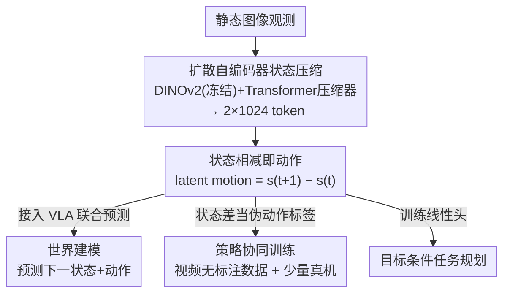

# StaMo: Unsupervised Learning of Generalizable Robot Motion from Compact State Representation

**会议**: CVPR 2026  
**论文**: [CVF Open Access](https://openaccess.thecvf.com/content/CVPR2026/html/Liu_StaMo_Unsupervised_Learning_of_Generalizable_Robot_Motion_from_Compact_State_CVPR_2026_paper.html)  
**代码**: https://aim-uofa.github.io/StaMo/ (项目页)  
**领域**: 机器人 / 具身智能  
**关键词**: 紧凑状态表示, 隐式动作, 扩散自编码器, 世界模型, VLA

## 一句话总结
StaMo 用一个轻量编码器 + 预训练 DiT 解码器，把一张静态图像无监督压成仅 2 个 1024 维 token 的紧凑状态表示，并发现「两个状态 token 之差」天然就是可执行的机器人动作（latent action）——无需任何视频与时序建模，就把 VLA 在 LIBERO 上提升 11.6%、真机成功率提升 31%。

## 研究背景与动机

**领域现状**：具身智能里，VLA（vision-language-action）模型需要一种「状态表示」来做世界建模和中间推理，它的作用不同于感知用的视觉特征——状态表示更靠近动作生成端，要服务于「预测未来、把视觉规划桥接到动作执行」。当前学动作的主流路线是从**视频**里学 latent action：取连续帧，用复杂时序模型抽出帧间变化当作动作信号。

**现有痛点**：这条路有两层矛盾。其一，低维的动作表示（轨迹、光流、end-effector 位姿、latent action）虽然紧凑、能靠简单差分表达动态，却缺乏语义丰富度，编码不了目标状态、交互动态、结构化空间关系；而高维的状态表示（原图特征、稠密 DINOv2 特征、深度/分割图）虽然表达力强，却冗余、计算重，且本身不内含「状态如何转移」的动态信息。两者各占一头，谁也兼顾不了。其二，从视频学动作本身代价高：要复杂且昂贵的时序模型，而视频片段内部的高方差运动会让模型学出「平均化」的模糊动作，对采样帧间隔敏感、可解释性差。

**核心矛盾**：紧凑性（compact）与表达力（expressive）之间存在 trade-off，而动态信息又被绑死在「必须从视频时序里抽」的范式上。

**本文目标**：学一种**既紧凑又有表达力**的状态表示，紧凑到「两个状态之差」就能直接当动作用，从而把动作学习从视频里解放出来。

**切入角度**：作者反问——既然用视频的最终目的只是捕捉「帧间变化即动作」，为什么非要从次优的状态表示上去训复杂的运动抽取器？如果状态表示本身足够有表达力，那么单纯两个静态帧状态相减，是不是就自然蕴含了一个有意义的 latent action？

**核心 idea**：用「DINOv2 + 预训练 DiT 解码器」的扩散自编码器把单帧图像压成 2 个 token 的紧凑状态；动作不再显式建模，而是作为状态空间中**两个 token 的向量差**自然涌现（emergent）。一句话：用「足够好的静态状态表示 + 相减」替代「从视频学复杂运动提取器」。

## 方法详解

### 整体框架

StaMo 的核心只有一件事：训练一个能把单张图像压到极致（少到 2 个 token）又能高保真重建的状态编码器，然后让动作「自己冒出来」。整条管线分三段：①**静态压缩器训练**——用扩散自编码器把图像编码成 2 个 1024 维的紧凑状态 token，靠预训练 DiT 解码器的生成先验保证重建质量；②**动作插值**——训好之后，把两个状态 token 相减就得到 latent motion，在状态空间做线性插值即可解码出连续、合理的运动轨迹，全程无动作监督；③**下游利用**——把紧凑状态接进 VLA 做世界建模（联合预测下一状态 + 动作），或把状态差当作伪动作标签做策略协同训练（co-training），还能用于目标图像条件下的任务规划。

### 关键设计

**1. 扩散自编码器压出 2-token 紧凑状态：靠生成先验顶住极端压缩的信息损失**

痛点很直接：拿预训练图像编码器的输出当状态，会得到 256×1024 这种巨大特征图，冗余且拖慢实时执行与长程规划；可只取一个 `[CLS]` token 又太粗，撑不起精细操作。StaMo 的解法是把它当**扩散自编码器**来训：编码器 $E$ = 冻结的 DINOv2 特征提取器 + 一个基于 transformer 的压缩器，把观测映射成极短的 token 序列（少到 2 个 1024 维 token）；解码器 $D$ 是一个 DiT，以这些 token 为条件去重建原图。整套基于 Stable Diffusion 3，只训压缩器和 DiT 解码器，DINOv2 全程冻结。训练用 base model 同款的 Flow Matching 目标：

$$z_0 = \tau(x_0), \quad \mathcal{L}_{DAE} = \mathbb{E}_{z_0,t}\,\lVert D(z_t, E(x_0), t) - u(z_t)\rVert_2^2$$

其中 $\tau$ 是预训练扩散模型的 VAE 编码器、把图像 $x_0$ 转成 latent $z_0$，$z_t = (1-\sigma_t)z_0 + \sigma_t\epsilon$ 是纯噪声 $\epsilon$ 与 $z_0$ 的线性插值，$u$ 是目标速度。为什么有效：要从 2 个 token 准确重建像素，解码器必须**隐式理解**机器人位姿、物体交互这些关键状态信息——重建任务逼着 token 把「任务关键信息」而非冗余视觉细节编码进去。消融显示 token 维度从 256 到 1024 对重建影响很小，正是因为预训练 DiT 的生成先验补偿了低维下的信息损失（见表四）。

**2. 状态相减即动作：让 latent action 从静态状态空间里涌现**

这是全文最「啊哈」的发现，也直接解决了「紧凑 vs 表达力」的二难。传统动作表示（末端位姿、光流、轨迹）紧凑但表达力弱，传统状态表示（稠密特征）表达力强但不内含动态。StaMo 把动作直接定义成相邻紧凑状态 token 的向量差：

$$a_t = s_{t+1} - s_t$$

由于状态空间足够紧凑且语义结构化，在两个状态（起始帧、目标帧）的 token 之间做**线性插值**，解码出来的图像序列就呈现出平滑、合理、动态一致的运动轨迹——也就是说，运动是这个表示空间的几何性质，而非额外学出来的。为什么这有效：这暗示大规模视觉模型隐式地学到了一个**线性化的动力学流形（linearized dynamics manifold）**，于是「相减」这种最简单的操作就能抽出有意义的动作。相比从视频学，它更省训练、且避开了视频内运动方差导致的表示模糊；更妙的是这个 latent motion 高度可迁移（sim-to-sim / sim-to-real / real-to-sim 都成立），说明学到的运动不是场景特定的。

**3. 接入 VLA 做世界建模：用「预测下一状态」当辅助任务正则化策略**

像 OpenVLA 这类 VLA 本质是反应式策略，只学「当前视觉-语言上下文 → 低层动作（如 7-DoF 末端控制）」的直接映射，并不强迫智能体推理「我的动作会让世界怎么变」。StaMo 的紧凑状态正好适合补上这一课：把 StaMo 编码器接进 OpenVLA，给自回归骨干挂一个轻量 MLP 头，专门预测下一时刻的状态表示，让模型联合预测「下一状态 + 对应动作」。损失为：

$$\mathcal{L}_{total} = \lambda_{action}\mathcal{L}_{action} + \lambda_{future}\big(\mathcal{L}_{mse}(s_{pred}, s_{gt}) + \mathcal{L}_1(s_{pred}, s_{gt})\big)$$

$\mathcal{L}_{action}$ 是标准的 next-token 交叉熵（锚定主控制任务），世界模型项用 MSE + L1 双约束回归真值未来状态。作者把 $\lambda_{action} = \lambda_{future}$，意思是「学会预测」和「学会行动」同等重要。为什么有效：预测「接下来会发生什么」会反过来正则化策略、提升主动作预测的质量；而且推理时只需预测 2 个 token、不必解码整张未来图像，所以几乎不增加推理开销（见表三，OpenVLA-OFT 从 18.24Hz 仅降到 17.82Hz，远好于解全图的 11.42Hz）。一个有意思的细节：动作 horizon 短时（OpenVLA 单步）用 **motion** 表示更好（类似 LIBERO 里的 delta 末端位姿、增量目标更直接），horizon 长时（OpenVLA-OFT）用 **state** 表示更好（作为稳定的目标条件信号）。

**4. 状态差当伪动作标签做协同训练：把无标注视频变成可学的动作数据**

latent motion 太抽象，难以直接定量对比，作者用策略协同训练来「实打实」验证它好不好用。做法：对每对连续视频帧用冻结的 $E$ 算 $m_t = E(o_{t+1}) - E(o_t)$ 当作伪动作标签，把一小批有动作标注的真机数据和一大批无动作标注的视频数据拼成统一数据集，在单个策略模型里联合训练。为什么有效：这把「从海量无标注视频里学」这件事变成现实——只要 StaMo 的状态差足够忠实于真实动作，就能用伪标签把视频的知识灌进策略。实验（表五）里 1 真机 + 4 份 StaMo 伪标签把平均成功率从 62.9%（仅 1 真机）拉到 84.6%，逼近全真机的 86.2%，且显著强于同设定下的 ATM（73.4%）和 LAPA（74.2%）。

### 损失函数 / 训练策略
- 压缩器训练用 Flow Matching 目标（式 1），冻结 DINOv2，只训 transformer 压缩器和 DiT 解码器，基座为 Stable Diffusion 3。
- 世界建模用 action 交叉熵 + 未来状态 MSE/L1 复合损失（式 2），$\lambda_{action}=\lambda_{future}$。
- 主实验训练数据用 DROID 与 LIBERO；scaling 实验额外叠加 OXE 与 egocentric human 数据。

## 实验关键数据

### 主实验

LIBERO 世界建模主结果（1000 次 rollout/任务，成功率 %）：

| 方法 | Spatial | Object | Goal | Long | Average |
|------|---------|--------|------|------|---------|
| OpenVLA | 84.7 | 88.4 | 79.2 | 53.7 | 76.5 |
| OpenVLA* + DINOv2 特征 | 88.6 | 90.4 | 83.5 | 61.4 | 80.9 |
| OpenVLA* + StaMo state | 92.3 | 94.8 | 88.1 | 75.2 | 87.6 |
| OpenVLA* + StaMo motion | 93.1 | 95.1 | 87.4 | 76.9 | **88.1** |
| OpenVLA-OFT | 93.7 | 94.2 | 89.7 | 91.3 | 92.2 |
| OpenVLA-OFT* + StaMo state | 96.8 | 98.9 | 95.0 | 96.3 | **96.8** |

相对 OpenVLA 基线，StaMo 平均 +11.6%（76.5→88.1）；OpenVLA-OFT 上 +4.6%（92.2→96.8），且全面超过「直接用 DINOv2 特征」。Long-horizon 提升尤其明显（53.7→76.9）。

真机六任务（短/长程各三，50 次演示/任务，20 次试验，成功率）：

| 方法 | 短程均值 | 长程均值 | 总均值 |
|------|---------|---------|--------|
| OpenVLA | 0.30 | 0.20 | 0.25 |
| UniVLA | 0.40 | 0.25 | 0.33 |
| OpenVLA + StaMo state | 0.60 | 0.52 | 0.56 |
| OpenVLA-OFT + StaMo state | 0.65 | 0.63 | **0.64** |

真机相对 OpenVLA 从 0.25 提到 0.56（+31 个百分点），长程任务从 0.20 提到 0.52，提升幅度比仿真更大。

### 消融实验

| 配置 | 关键指标 | 说明 |
|------|---------|------|
| token 维度 256 / 512 / 1024 | PSNR/SSIM 几乎不变（如 libero object SSIM 0.948 上下） | 维度对重建影响极小，DiT 先验补偿了低维信息损失 |
| 预训练 DiT 解码器 | LIBERO 均值 87.6% | 完整设置 |
| 解码器从零训练 | LIBERO 均值 85.7% | 收敛更慢且达不到同等性能，证明大规模自然图像预训练先验关键 |
| 训练数据 S→S+D→+OXE→+Ego | 真机性能逐级提升 | 数据量与多样性（含人类第一视角）越大越好，可 scale |

零样本迁移到 ManiSkill（LIBERO 训练直接用，100 次试验，成功率）：StaMo state 在 Pick/Push/Stack/Pull 四任务分别 41/32/48/36%，远高于 OpenVLA（28/4/18/16%）和 UniVLA（32/7/22/20%）。

动作线性探测（Linear Probing，式 3-4）：把 $\Delta z = E(I_{n+k}) - E(I_n)$ 喂给轻量 MLP 预测真值动作序列，用 MSE 衡量。StaMo 在 1/2/4/8 步各 horizon 上 MSE 全面低于 Pooled Delta Image（像素差）、Delta DINOv2 Features（特征差）和 LAPA，证明状态差是高信息量、线性可分的动作表示。

目标条件规划（ManiSkill，冻结编码器只训线性头）：StaMo 在四任务 22/32/16/38%，全面超过 DINO-WM 的 12/8/4/18%。

### 关键发现
- **动作 horizon 决定该用 state 还是 motion**：短程（OpenVLA 单步）用 motion 更好，因为它类似 delta 末端位姿这种增量目标；长程（OpenVLA-OFT）用 state 更好，因为它是稳定的目标条件信号。这是个很实用的 trade-off 经验。
- **预训练先验是命门**：解码器从零训练掉到 85.7%（vs 87.6%）且收敛慢，说明「能从 2 token 重建像素」这件事高度依赖大规模自然图像预训练带来的隐式状态理解。
- **几乎零推理开销**：只预测 2 个 token、不解全图，OpenVLA-OFT 加 StaMo 后从 18.24Hz 仅降到 17.82Hz，而解全图的方案（DINOv2 特征）掉到 11.42Hz，UniVLA/WorldVLA 只有 2-3Hz。
- **token 维度不敏感**：256/512/1024 重建质量几乎一致，紧凑性几乎不付出代价。

## 亮点与洞察
- **「静即是动」的视角转换**：论文用 Feynman「我们观察到的静态只是动态平衡」开场，核心洞察是动作不必从视频时序学——只要状态表示足够好，相减即动作。这是对「latent action 必须来自视频」这一主流信念的直接挑战，思想上很漂亮。
- **重建任务被巧妙当成「状态信息蒸馏器」**：用「能否从 2 token 重建像素」来逼迫表示编码任务关键信息，这个自监督代理任务设计可迁移到任何「想要紧凑又信息完整的表示」的场景。
- **线性化动力学流形假设**：状态空间里线性插值就能产生合理运动，暗示大视觉模型隐式学到了线性化的动力学结构——这个观察本身就值得后续深挖。
- **即插即用 + 几乎零开销**：作为中间表示无缝接进现有 VLA，性能涨而推理几乎不掉速，工程上很有吸引力；伪动作标签把无标注视频盘活，对数据稀缺的机器人学习是条可扩展路径。

## 局限与展望
- **作者承认**：latent motion 抽象、难直接定量对比，只能靠协同训练和线性探测间接验证其有效性。
- **方法依赖强生成先验**：整套建立在预训练 DiT/Stable Diffusion 3 之上，从零训练显著变差，意味着方法对基座质量和算力有隐性要求，迁移到没有强生成先验的模态/领域时未必成立。
- **2-token 的能力边界未充分探讨**：极端压缩在精细、多物体、长程复杂交互任务上是否会丢关键信息，论文主要用重建 PSNR/SSIM 间接说明，缺乏对「哪些任务关键信息被丢」的失败分析。
- **线性插值产生运动的前提**：依赖状态流形近似线性，对于高度非线性、剧烈或多模态的运动（如灵巧操作），线性差分是否仍忠实有待验证。
- **改进方向**：可探索 token 数随任务复杂度自适应、对插值轨迹的物理一致性加约束、把「状态差即动作」推广到更长 horizon 的分段插值。

## 相关工作与启发
- **vs 视频派 latent action（LAPA / ATM / Genie 系列）**: 他们从连续视频帧学离散或连续 latent action，需复杂时序模型、对采样间隔敏感、动作模糊；StaMo 从单帧静态图学状态、相减得动作，更省训练、更可解释、迁移性更强，协同训练里平均成功率 84.6% vs LAPA 74.2% / ATM 73.4%。
- **vs 稠密视觉特征做世界模型（DINO-WM / UniVLA / WorldVLA）**: 他们要么解码全图、要么用冗余高维状态，泛化受限、推理慢（2-3Hz）；StaMo 用 2 token 紧凑表示，零样本迁移到 ManiSkill 和目标条件规划上全面领先，推理频率高一个数量级。
- **vs 低维动作表示（轨迹 / 光流 / 末端位姿）**: 它们紧凑但表达力弱、编码不了语义与目标状态；StaMo 在「紧凑 × 表达力」谱系上占据两者兼得的位置（论文图 2），既能高保真重建又能靠差分表达动作。

## 评分
- 新颖性: ⭐⭐⭐⭐⭐ 「足够好的静态状态表示，相减即动作」是对视频派 latent action 范式的根本性挑战，视角新颖且有线性化动力学流形的洞察支撑。
- 实验充分度: ⭐⭐⭐⭐⭐ 仿真+真机、世界建模/协同训练/线性探测/零样本迁移/目标规划多角度验证，含 token 维度、预训练先验、数据 scaling 等关键消融。
- 写作质量: ⭐⭐⭐⭐ 动机推导清晰、图表完整、核心思想表达有力；个别处（latent motion 难定量）的论证略依赖间接证据。
- 价值: ⭐⭐⭐⭐⭐ 即插即用、几乎零推理开销地显著提升 VLA，并把无标注视频盘活成可学动作数据，对数据稀缺的机器人学习实用价值高。

<!-- RELATED:START -->

## 相关论文

- [\[CVPR 2026\] CoMo: Learning Continuous Latent Motion from Internet Videos for Scalable Robot Learning](como_learning_continuous_latent_motion_from_internet_videos_for_scalable_robot_l.md)
- [\[CVPR 2026\] HiF-VLA: Hindsight, Insight and Foresight through Motion Representation for Vision-Language-Action Models](hif-vla_hindsight_insight_and_foresight_through_motion_representation_for_vision.md)
- [\[CVPR 2026\] Rethinking Intermediate Representation for VLM-based Robot Manipulation](rethinking_intermediate_representation_for_vlm-based_robot_manipulation.md)
- [\[CVPR 2026\] DAWN: Pixel Motion Diffusion is What We Need for Robot Control](dawn_pixel_motion_diffusion_robot_control.md)
- [\[CVPR 2026\] Chain of World: World Model Thinking in Latent Motion (CoWVLA)](chain_of_world_world_model_thinking_in_latent_motion.md)

<!-- RELATED:END -->
