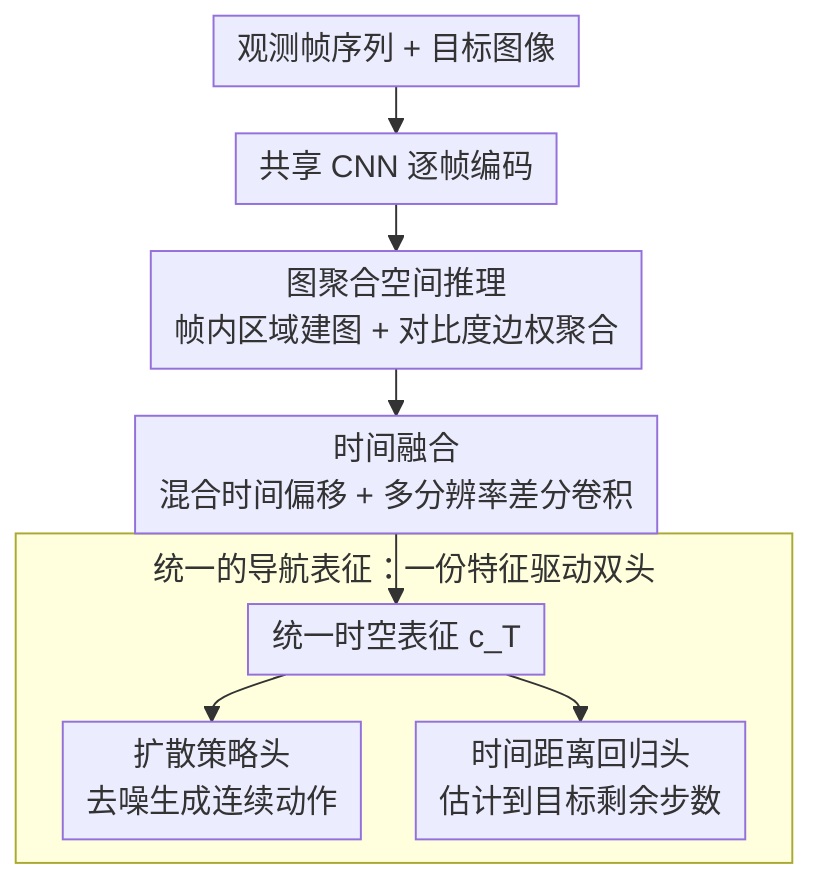

# STRNet: Visual Navigation with Spatio-Temporal Representation through Dynamic Graph Aggregation

**会议**: CVPR 2026  
**arXiv**: [2604.02829](https://arxiv.org/abs/2604.02829)  
**代码**: [https://github.com/hren20/STRNet](https://github.com/hren20/STRNet)  
**领域**: 自动驾驶 / 具身智能  
**关键词**: 视觉导航, 时空表征, 图神经网络, 扩散策略, 目标条件控制

## 一句话总结

STRNet 提出统一的时空表征框架用于视觉导航，通过图推理模块建模帧内空间拓扑结构，结合混合时间偏移和多分辨率差分卷积建模时序动态，显著提升了目标条件导航的成功率（比 NoMaD 提升 70%）。

## 研究背景与动机

视觉导航中，现有方法大量投入在改进决策模块（策略头、行为克隆、指令跟随），但视觉编码器通常只是 ImageNet 预训练 CNN + 简单时间池化。这种粗粒度的特征表示在到达决策层之前就模糊了关键的几何和运动线索。

**核心问题**：池化/平均注意力平滑了区分"靠近目标"和"横向移动"的微小光流信号；排列不变的自注意力忽略了门廊、走廊和障碍物之间的拓扑关系。

## 方法详解

### 整体框架

STRNet 想解决的是一个被长期忽视的环节：导航研究的精力大多花在策略头上，而视觉编码器还停留在「ImageNet CNN + 时间池化」的粗糙状态，几何与运动线索在送进决策层之前就被抹平了。它的思路是把编码器本身做强——一条共享 CNN 先逐帧抽特征，接着图聚合模块在**单帧内**重建区域之间的空间拓扑，再由时间融合模块（混合时间偏移 + 多分辨率差分卷积）在**帧之间**注入运动信息。这份时空表征最后同时喂给两个轻量头：扩散策略头生成连续控制动作，时间距离回归头估计到目标还有多远。整条链路里没有重新设计策略，只是把「特征」这一层从模糊变清晰。

### 关键设计

**1. 图聚合空间推理：让单帧特征保留场景的拓扑结构**

排列不变的自注意力会把门、走廊、障碍物当成无序的 token 来处理，丢掉了它们之间「这条通道通向哪里、那堵墙挡住什么」的空间关系。STRNet 把每一帧特征当作一张图来处理：节点对应图像中的区域，边的权重由区域间的视觉对比度学习得到，再用图聚合在节点间传播信息做空间推理。相比直接拍平成 token 的注意力，图结构天然带有「谁和谁相邻、谁连通谁」的归纳偏置，更适合表达导航真正关心的可通行布局，于是门廊、走廊这类结构元素在表征里能被区分开，而不是糊成一片。

**2. 混合时间偏移 + 多分辨率差分卷积：用近乎免费的方式补回运动线索**

区分「正在靠近目标」和「只是横向平移」靠的是微小的光流信号，而时间平均池化恰好把这种信号抹掉了，换成全注意力又太重。STRNet 用两个轻量算子组合来替代：混合时间偏移把一部分通道沿时间轴错位，使相邻帧的信息以**零额外参数**的方式串进当前帧；多分辨率差分卷积则在多个时间尺度上计算帧间差异，让快速运动和缓慢漂移都能被各自的尺度捕获。两者叠加得到一份紧凑却富含运动信息的时间表征，在效率和表达力之间避开了池化太糙、注意力太贵的两难。

**3. 统一的导航表征：一份特征同时撑起动作生成与进度估计**

融合后的时空表征不专属于某一个任务，而是同时驱动扩散策略头和时间距离回归头：前者生成连续动作序列，后者估计当前到目标还剩多少步。让两个头共享同一份表征不只是省参数——进度估计逼着表征显式编码「离目标的远近」，这个目标感知信号反过来约束策略，避免它在快到终点时还绕远路。论文的 t-SNE 也印证了这点：STRNet 的嵌入按到目标的距离自然分层，而平均池化的基线把远近样本混在一起。

### 损失函数 / 训练策略

扩散策略损失（去噪目标）+ 时间距离回归的 MSE 损失，在导航数据集上端到端联合训练。

## 实验关键数据

### 主实验

| 方法 | 2D-3D-S 成功率 | CitySim 成功率 | GRScenes 成功率 |
|------|---------------|---------------|----------------|
| NoMaD | 基线 | 基线 | 基线 |
| NaviBridger | +小幅提升 | +小幅提升 | +小幅提升 |
| **STRNet** | **+70%** | **显著提升** | **显著提升** |

在三个数据集上一致显著提升，室内室外都有效。

### 消融实验

| 配置 | 平均成功率 | 说明 |
|------|-----------|------|
| CNN + 时间池化（NoMaD） | 基线 | 特征模糊 |
| + 图空间推理 | 提升 | 空间结构感知增强 |
| + 时间融合 | 进一步提升 | 运动信息注入 |
| 完整 STRNet | 最优 | 时空协同 |

### 关键发现

- t-SNE 可视化显示 STRNet 的特征嵌入按到目标的距离清晰分层，而 NoMaD 的嵌入混杂在一起
- 图空间推理和时间融合的贡献相当，缺一不可
- 表征质量的提升直接转化为导航成功率——好的特征是好导航的前提

## 亮点与洞察

- **关注被忽视的编码器**：大量导航研究聚焦策略设计，但编码器质量才是基础。STRNet 证明好的特征比复杂的策略更重要
- **图推理的适配性**：图结构天然匹配导航中的空间拓扑需求，比 Transformer 的全注意力更高效且更有归纳偏置
- **轻量时间建模**：时间偏移+差分卷积几乎不增加计算量，是"免费"的时间信息注入

## 局限与展望

- 图结构是预定义的（基于图像网格），不是动态学习的
- 当前仅测试目标图像导航，未扩展到语言指令导航
- 扩散策略的推理延迟可能影响实时性

## 相关工作与启发

- **vs NoMaD**: NoMaD 用平均池化做时间融合，STRNet 用图推理+混合偏移
- **vs ViNT**: ViNT 用拓扑记忆做长程规划，STRNet 聚焦于基础表征质量
- **vs NaviBridger**: NaviBridger 改进扩散策略，STRNet 改进表征编码

## 评分

- 新颖性: ⭐⭐⭐⭐ 图推理用于导航表征是有价值的新方向
- 实验充分度: ⭐⭐⭐⭐ 三个数据集+可视化分析
- 写作质量: ⭐⭐⭐⭐ 动机清晰，对比合理
- 价值: ⭐⭐⭐⭐ 对视觉导航社区有实际指导意义

<!-- RELATED:START -->

## 相关论文

- [\[CVPR 2026\] CLiViS: Unleashing Cognitive Map through Linguistic-Visual Synergy for Embodied Visual Reasoning](clivis_unleashing_cognitive_map_through_linguistic-visual_synergy_for_embodied_v.md)
- [\[CVPR 2026\] Spatial-Aware VLA Pretraining through Visual-Physical Alignment from Human Videos](spatial-aware_vla_pretraining_through_visual-physical_alignment_from_human_video.md)
- [\[CVPR 2026\] HiF-VLA: Hindsight, Insight and Foresight through Motion Representation for Vision-Language-Action Models](hif-vla_hindsight_insight_and_foresight_through_motion_representation_for_vision.md)
- [\[NeurIPS 2025\] EgoThinker: Unveiling Egocentric Reasoning with Spatio-Temporal CoT](../../NeurIPS2025/robotics/egothinker_unveiling_egocentric_reasoning_with_spatiotempora.md)
- [\[CVPR 2026\] Semantic Audio-Visual Navigation in Continuous Environments](semantic_audio-visual_navigation_in_continuous_environments.md)

<!-- RELATED:END -->
