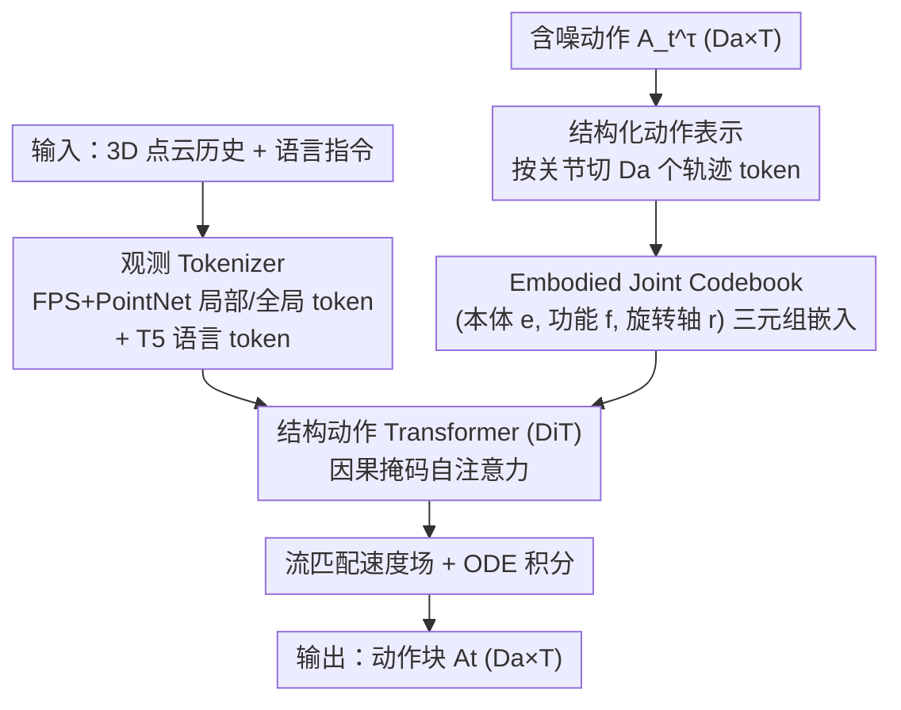

# Structural Action Transformer for 3D Dexterous Manipulation

**会议**: CVPR 2026  
**论文**: [CVF Open Access](https://openaccess.thecvf.com/content/CVPR2026/html/Lei_Structural_Action_Transformer_for_3D_Dexterous_Manipulation_CVPR_2026_paper.html)  
**代码**: 无（仅[项目页](https://xiaohanlei.github.io/projects/SAT)）  
**领域**: 机器人 / 具身智能（3D 灵巧操作）  
**关键词**: 灵巧手操作, 跨本体迁移, 动作表示, 流匹配, 点云策略

## 一句话总结
SAT 把灵巧手的动作块从"按时间排列的动作向量序列 $(T,D_a)$"翻转成"按关节排列的轨迹序列 $(D_a,T)$"，让 Transformer 把关节数当成可变序列长度天然处理异构本体，再配一套描述关节功能/运动学角色的 Embodied Joint Codebook，用流匹配从 3D 点云生成整段动作，仅 19.36M 参数就在 11 个仿真任务和 6 个真机双手任务上全面超过 2D/3D baseline。

## 研究背景与动机

**领域现状**：从大规模人类/机器人示范中做模仿学习，是教机器人灵巧技能的主流路线。当前策略学习普遍采用"动作分块（action chunking）"——一次预测未来一段动作 $(T,D_a)$，其中 $T$ 是预测时域、$D_a$ 是动作维度，每个时间步的 $D_a$ 维向量当作一个 token，沿时间排成序列喂给 Diffusion Policy / Transformer。这种"时间为中心（temporal-centric）"的视角对低自由度系统（如 7-DoF 机械臂）很好用。

**现有痛点**：当本体换成高自由度灵巧手（如 24-DoF 的 Shadow Hand），时间为中心的表示开始崩。一方面，模型要在一个单体的高维向量里隐式学习几十个关节之间的复杂耦合，维度越高越难学；另一方面更致命的是——这种"固定维度"的表示**没有任何跨本体迁移的天然机制**：不同灵巧手形态、运动学、关节数都不同，$D_a$ 维向量根本无法直接对齐或比较，A 手学到的技能没法迁到 B 手。此外多数 VLA 模型依赖 2D 图像输入，丢掉了灵巧操作所需的精细 3D 空间关系。

**核心矛盾**：动作被表示成"时间快照的序列"时，关节维度被压成一个不可拆的整体，于是"高自由度的可扩展性"和"跨本体的可迁移性"同时被堵死——你无法让模型看到"两只手的食指 MCP 关节其实在干同一件事"。

**本文目标**：(1) 找到一种动作表示，让单一策略能天然吃下关节数不同的异构本体；(2) 直接从 3D 点云学习以保留空间几何；(3) 在高自由度灵巧手上既参数高效又样本高效。

**切入角度**：作者注意到 Transformer 的核心优势恰恰是处理**变长、无序**序列。如果把动作块沿"关节维度"切 token——每个 token 是某个关节在整段时域上的轨迹——那么"本体不同"就直接等价于"序列长度 $D_a$ 不同"，这正是 Transformer 原生擅长的；同时自注意力还能直接在表示空间里学到不同本体关节之间的功能对应。

**核心 idea**：用"结构为中心（structural-centric）"的动作表示 $(D_a,T)$ 代替"时间为中心"的 $(T,D_a)$，把关节当 token、把时间当特征，再用一个编码关节功能角色的码本消除关节歧义，从而一举打通高自由度的可扩展性与跨本体的可迁移性。

## 方法详解

### 整体框架
SAT 是一个条件生成式策略：输入是最近 $T_o$ 帧原始 3D 点云历史 $\mathbf{P}_t=(P_{t-T_o+1},\dots,P_t)$（每帧 $P_k\in\mathbb{R}^{N\times3}$）和一条自然语言指令 $L$，输出是未来动作块 $A_t\in\mathbb{R}^{D_a\times T}$。整条管线分三块：**观测 tokenizer** 把点云历史 + 语言编码成条件序列；**结构动作 tokenizer** 把含噪动作沿关节切成 $D_a$ 个 token，并叠加 Embodied Joint Codebook 注入结构先验；**结构动作 Transformer（DiT）** 在两路 token 上做带因果掩码的自注意力，预测流匹配的速度场，最后用 ODE 求解器一步积分出干净动作块。闭环控制时按 receding-horizon 执行其中一段，再用新观测重新查询。

### 关键设计

**1. 结构为中心的动作表示：把"按时间排"翻成"按关节排"**

这是全文的根。传统 $(T,D_a)$ 表示把每个时间步的整段动作当一个 token，关节耦合被压进单体向量、本体之间无法比较。SAT 反过来定义 $A_t\in\mathbb{R}^{D_a\times T}$，第 $i$ 行 $j_i\in\mathbb{R}^T$ 就是第 $i$ 个关节在整段时域上的完整轨迹，于是动作块变成一个**长度为 $D_a$、无序、可变长**的"关节轨迹序列"。这一翻转带来两个直接红利：其一，本体异构性退化成"序列长度不同"，Transformer 天生处理变长序列，单一策略无需任何本体专属模块就能同时吃 Shadow Hand 和 xHand；其二，时间维 $T$ 现在成了每个关节 token 的特征维度，模型可以为每个关节学一段压缩的运动基元（motion primitive），并通过自注意力直接发现"不同手的对应关节在做相似的事"，把技能沿功能相似性迁移过去。消融里把这条换回时间为中心的表示，平均成功率从 0.71 掉到 0.64（Table 4 最后一行），证明这不是换皮而是范式差异。

**2. Embodied Joint Codebook：给无序关节 token 一个"身份证"**

把动作切成关节序列后立刻冒出一个歧义：序列本身是无序的，Transformer 怎么知道第 3 个 token 是哪根手指的哪个关节？作者用一个由本体形态学派生的码本解决。对任意一只手的每个关节 $j$，定义一个三元组 $J_j=(e,f,r)$：$e$ 是 **Embodiment ID**（本体身份，如 ShadowHand / XHand），$f$ 是 **Functional Category**（功能类别，仿人手解剖学分为 CMC / MCP / PIP / DIP 等关节），$r$ 是 **Rotation Axis**（主运动轴，如屈伸 Flexion/Extension、外展内收 Abduction/Adduction、旋前旋后 Pronation/Supination）。三个分量各查一张可学习嵌入表，关节最终的码本嵌入 $C_j\in\mathbb{R}^{d_{feat}}$ 是三者之和，再加到压缩后的关节轨迹 token 上：$\text{tok}_{input\ act}=\text{tok}_{act}+E$。

它为什么是迁移的关键？因为两只**不同的手**（$e$ 不同）可以**共享同一功能关节**（$f$ 相同）和**同一旋转轴**（$r$ 相同），从而得到相似的码本嵌入，把模型直接"预热"到可迁移的状态——这正是结构为中心表示能跨本体的落地机制。消融极有说服力：完全去掉关节嵌入会**灾难性失败**（成功率 0.71→0.01，Table 4），因为无序序列彻底失去"哪条轨迹对应哪个物理关节"的锚点；而三分量里单独去掉功能类别 $f$ 同样灾难（0.71→0.02，Table 5），说明**功能对应**才是跨越本体鸿沟最核心的因素，去掉本体 ID 或旋转轴只是中等掉点（0.57 / 0.62）。

**3. 分层点云观测编码 + DiT 因果掩码：把 3D 几何与语言喂进策略**

为保留灵巧操作所需的精细 3D 空间关系，观测 tokenizer 对历史里每帧点云 $P_k$ 做分层编码：先用最远点采样（FPS）选 $M$ 个局部中心，对每个中心取 $K$ 近邻成局部组、过共享 PointNet 得局部几何特征 $f_{k,i}$，再把组中心坐标过 MLP 当位置编码相加，得到 $M$ 个局部 token；同时把整帧点云送进另一个 PointNet 编码器得到一个全局场景 token（不加位置编码）。$T_o$ 帧的全局/局部 token 拼成历史序列，语言用预训练 T5 编码器编成 $\text{tok}_{lang}$，二者拼成条件前缀 $\text{tok}_{obs}$。作者还对局部 token 序列做随机 shuffle 作数据增强，利用局部 patch 的置换不变性。随后把动作 token 与观测 token 拼在一起送入 DiT，并改造自注意力掩码为**因果掩码**：观测 token 只看观测 token，动作 token 看全部观测 token 和其它动作 token——这样观测作为稳定条件不被噪声动作污染，DiT 输出对应动作序列的 token 过 MLP 即得速度场 $\epsilon_\theta(A_t^\tau,\tau,o_t)$。消融显示去全局/局部点云 token 或因果掩码都只是中等掉点（0.68~0.69），说明 3D 几何与因果结构有贡献但非生死线，真正的命门仍是表示与码本。

**4. 连续时间流匹配 + 一步 ODE 推理：高效生成整段动作**

SAT 用连续时间归一化流（CNF）建模条件分布 $p(A_t|o_t)$，学一个把标准高斯 $\mathcal{N}(0,I)$ 输运到动作分布的条件速度场。训练目标为流匹配损失：

$$\mathcal{L}(\theta)=\mathbb{E}_{\tau\sim U(0,1),\,A_t^0\sim\mathcal{N}(0,I),\,A_t^1\sim\mathcal{D}}\big[\,\lVert\epsilon_\theta(A_t^\tau,\tau,o_t)-(A_t^1-A_t^0)\rVert^2\,\big]$$

其中 $A_t^1$ 是真值动作、$A_t^0$ 是噪声、$A_t^\tau=(1-\tau)A_t^0+\tau A_t^1$ 是线性插值。推理时采一个噪声 $A_t^0$，从 $\tau=0$ 到 $\tau=1$ 解 ODE $\frac{dA_t^\tau}{d\tau}=\epsilon_\theta(A_t^\tau,\tau,o_t)$ 即得干净动作。流匹配相比扩散的好处是路径更直、采样更省——单步 Euler 积分（1-NFE）即可恢复概率流；实际实现用固定 10 步 Euler 把噪声映成动作。这条与结构表示配合，让 19.36M 的小模型也能稳定生成几十维关节的整段连贯轨迹。

### 损失函数 / 训练策略
单一目标即上面的流匹配损失。训练分两阶段：先在人类（HOI4D / Ego-Exo4D / Aria Digital Twin，用 MANO 手姿）、机器人（Fourier ActionNet / DexCap）、仿真（Adroit / DexArt / Bi-DexHands 的 RL 专家轨迹）三类异构数据混合上做大规模预训练，所有关节统一按 Embodied Joint Codebook 打标；再用少量域内示范对每个下游任务微调。优化器 AdamW（$\beta=(0.9,0.999)$，weight decay 0.01），预训练峰值学习率 $1\times10^{-4}$、10k 步线性 warmup 后 cosine 衰减到 $1\times10^{-6}$，微调学习率 $1\times10^{-5}$。

## 实验关键数据

### 主实验
在 Adroit、DexArt、Bi-DexHands 三个仿真 benchmark 共 11 个灵巧操作任务上，SAT 用最小的参数量拿到最高平均成功率，且全面压过 2D 与 3D baseline。

| 方法 | 参数(M) | 模态 | Adroit(3) | DexArt(4) | Bi-DexHands(4) | 平均成功率 |
|------|--------|------|-----------|-----------|----------------|-----------|
| Diffusion Policy | 266.8 | 2D | 0.32 | 0.49 | 0.42 | 0.42 |
| HPT | 13.99 | 2D | 0.45 | 0.53 | 0.44 | 0.47 |
| UniAct | 1053 | 2D | 0.49 | 0.55 | 0.47 | 0.50 |
| 3D Diffusion Policy | 255.2 | 3D | 0.68 | 0.69 | 0.55 | 0.63 |
| 3D ManiFlow Policy | 218.9 | 3D | 0.70 | 0.70 | 0.59 | 0.66 |
| **SAT (本文)** | **19.36** | 3D | **0.75** | **0.73** | **0.67** | **0.71** |

真机实验在双 7-DoF xArm + 双 12-DoF xHand 平台、单个 L515 LiDAR 俯视感知下评测 6 个单/双手任务（每任务 50 条 VR 遥操作示范），同样全胜：

| 任务 | HPT | 3DDP | SAT(本文) |
|------|-----|------|-----------|
| 拔笔帽 | 0.10 | 0.25 | **0.30** |
| 传递 Baymax 玩偶 | 0.50 | 0.75 | **0.85** |
| 推后抓盒子 | 0.05 | 0.15 | **0.35** |
| 放积木入盘 | 0.60 | 0.85 | **0.90** |
| 刷杯子 | 0.10 | 0.30 | **0.45** |
| 抓篮球 | 0.65 | 0.80 | **0.95** |

### 消融实验

| 模型变体 | 平均成功率 | 说明 |
|----------|-----------|------|
| SAT（完整） | 0.71 | 完整模型 |
| w/o 全局点云 token | 0.68 | 去全局场景上下文，中等掉点 |
| w/o 局部点云 token | 0.69 | 去局部几何，中等掉点 |
| w/o 因果掩码 | 0.68 | 观测被噪声动作污染，中等掉点 |
| w/o 关节嵌入(码本) | **0.01** | 无序序列失锚，灾难性失败 |
| w. 时间为中心动作 | 0.64 | 换回 $(T,D_a)$，掉 7 个点 |

码本三分量进一步拆解（Table 5）：去 Embodiment ID 降到 0.57、去 Rotation Axis 降到 0.62，而**去 Functional Category 直接崩到 0.02**——功能对应是跨本体的命门。Token 维度消融（Table 2）显示性能对时间压缩很鲁棒：$d_{feat}$ 从 256 一路压到 32（参数 162.74M→8.65M）成功率仍稳在 0.70~0.71，只有压到 16 才略掉到 0.66，说明关节轨迹确有大量冗余可压。

### 关键发现
- **码本是命门**：去掉关节嵌入或其中的功能类别都会让模型直接报废（0.01 / 0.02），因为无序关节序列没有码本就无法把轨迹对应到物理关节；这反过来证明"结构表示必须配身份编码"才成立。
- **结构 > 时间是真范式差**：仅把表示换回时间为中心就掉 7 个点（0.71→0.64），且这是在其余组件全保留的前提下，说明收益来自表示本身而非架构堆料。
- **人类数据比机器人数据更有用**：只用人类数据预训练（0.68）反而胜过只用机器人数据（0.66），印证 Embodied Joint Codebook 真能把人手功能运动翻译到机器人控制；只用仿真数据最高（0.70），因其观测/动作/动力学与下游最对齐。
- **极致参数高效**：19.36M 参数比 2D baseline 小一个数量级、也远小于其它 3D 方法，却拿到最高成功率，且 1-NFE 推理 FLOPs 仅约 0.99G。

## 亮点与洞察
- **一次"转置"解锁两个难题**：把动作矩阵从 $(T,D_a)$ 转成 $(D_a,T)$ 这一步几乎零成本，却同时把"高自由度可扩展"和"跨本体可迁移"两个老大难变成 Transformer 的原生能力——异构本体 = 变长序列，这个映射非常优雅，是最让人"啊哈"的地方。
- **码本的组合性而非相似性才是迁移来源**：t-SNE 可视化显示嵌入主要按本体和旋转轴聚类、功能类别反而不那么分明，作者据此指出泛化不是来自嵌入相似，而是来自码本的"组合结构"——这是个反直觉但有数据支撑的洞察，可迁移到任何"用属性三元组编码异构实体"的任务。
- **副产品的硬件设计启示**：统计 10 款灵巧手发现 MCP/CMC/PIP 的屈伸关节出现频率最高，暗示这是灵巧操作的核心功能集、应在硬件设计中优先保证——一个从策略学习里"挖"出的具身设计建议。

## 局限与展望
- **单一固定相机的遮挡瓶颈**：作者自承在接触密集的双手任务中，一只手常严重遮挡另一只手或目标物，单个固定俯视相机无法消歧，策略被"饿"掉关键几何信息（拔笔帽、推后抓盒子这类成功率明显偏低正源于此）。多视角/手腕相机或主动视角是自然的补法。
- **大形态/接触几何失配导致关节误分配**：当示范与执行平台的运动学或接触几何差距过大时，会出现动作分配错误，作者指出需要显式动力学/力约束或触觉闭环纠正——目前纯视觉开环对此无能为力。
- **仍是模仿学习范式**：方法依赖成功示范，未涉及在线探索；作者把"结构动作表示用于强化学习、提供结构化探索空间"列为未来方向，但本文未验证。
- **码本依赖人工形态学标注**：三元组 $(e,f,r)$ 的映射表需按解剖学先验手工设计，换一类非仿人形态（如多于五指或异形机械手）时如何自动构造功能类别仍是开放问题。

## 相关工作与启发
- **vs 时间为中心的动作分块（Diffusion Policy / 多数 VLA）**：它们把每个时间步的 $D_a$ 维动作当单体 token 沿时间排，本文沿关节排；区别在于前者的固定维度向量无法对齐不同本体，后者用变长序列 + 码本天然支持跨本体迁移，且本文直接吃 3D 点云而非 2D 图像，保留了灵巧操作的空间几何。
- **vs 异构学习的"stem/trunk"模块化路线（HPT、UniAct 等）**：它们靠为每个本体设计专属输入 stem 把不同机器人投到共享潜空间，再过大 trunk；本文则不需要任何本体专属模块——本体身份直接由序列长度 $D_a$ 表达，让自注意力在表示空间里自学关节间的功能映射，更统一也更参数高效（19.36M vs UniAct 1053M）。
- **vs 3D 点云策略（3D Diffusion Policy、3D ManiFlow Policy）**：它们也用点云但仍沿用时间为中心表示，本文在相同 3D 输入下把表示换成结构为中心，平均成功率从 0.63/0.66 提到 0.71，证明增益主要来自动作表示这一维度。

## 评分
- 新颖性: ⭐⭐⭐⭐⭐ "把动作沿关节维 token 化"是策略学习里第一个成功落地的结构为中心范式，转置+码本的组合简洁而本质。
- 实验充分度: ⭐⭐⭐⭐ 11 仿真 + 6 真机任务、码本/表示/数据/压缩多维消融充分；略憾于未与更多大规模 VLA 在统一协议下对比、缺真机失败率统计的量化深挖。
- 写作质量: ⭐⭐⭐⭐⭐ 动机层层递进，Figure 1 的概念对照图把核心思想一图说清，消融结论（功能类别命门、人类数据胜机器人）都给了机制解释。
- 价值: ⭐⭐⭐⭐⭐ 为高自由度异构灵巧手提供了可扩展、可迁移、参数高效的通用策略路径，码本的组合式异构编码思路对具身领域有广泛启发。

<!-- RELATED:START -->

## 相关论文

- [\[CVPR 2026\] PointWorld: Scaling 3D World Models for In-The-Wild Robotic Manipulation](pointworld_scaling_3d_world_models_for_in-the-wild_robotic_manipulation.md)
- [\[CVPR 2026\] ActiveVLA: Injecting Active Perception into Vision-Language-Action Models for Precise 3D Robotic Manipulation](activevla_injecting_active_perception_into_vision-language-action_models_for_pre.md)
- [\[CVPR 2026\] Learning Surgical Robotic Manipulation with 3D Spatial Priors](learning_surgical_robotic_manipulation_with_3d_spatial_priors.md)
- [\[CVPR 2026\] AdaDexTrack: Dynamic Modulation for Adaptive and Generalizable Dexterous Manipulation Tracking](adadextrack_dynamic_modulation_for_adaptive_and_generalizable_dexterous_manipula.md)
- [\[CVPR 2026\] DiffuView: Multi-View Diffusion Pretraining for 3D-Aware Robotic Manipulation](diffuview_multi-view_diffusion_pretraining_for_3d_aware_robotic_manipulation.md)

<!-- RELATED:END -->
